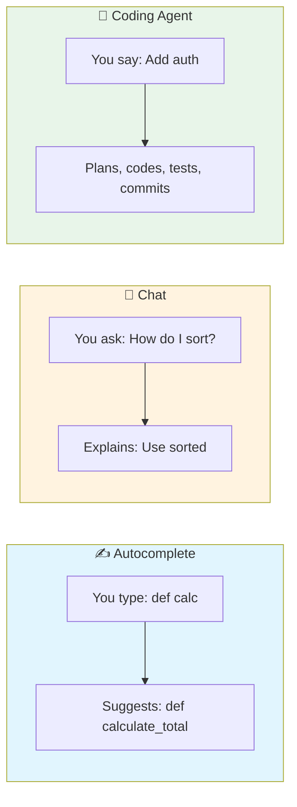
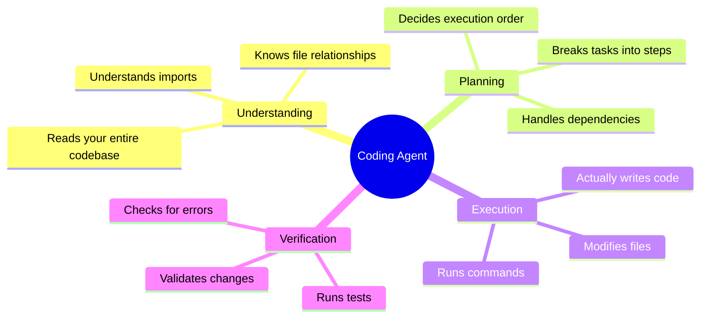
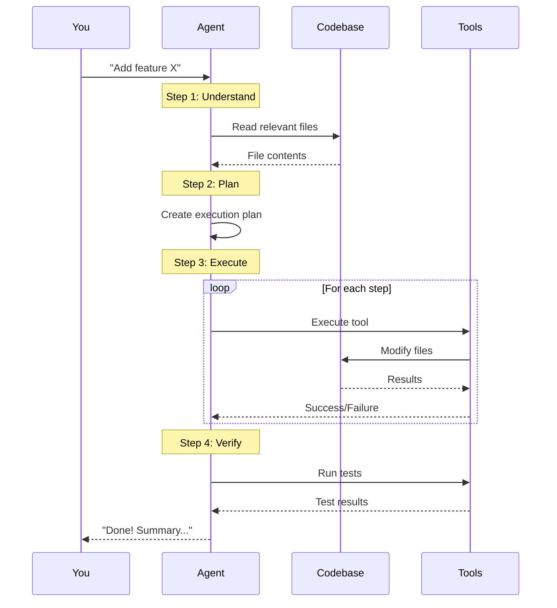
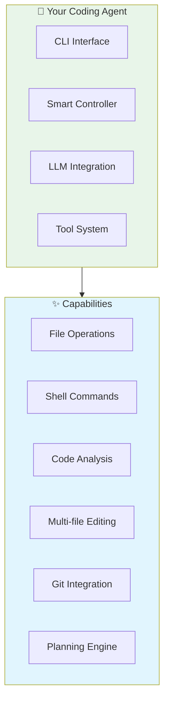

# Day 1, Tutorial 1: What is a Coding Agent?

**Course:** Build Your Own Coding Agent  
**Day:** 1  
**Tutorial:** 1 of 288  
**Estimated Time:** 20 minutes

---

## 🎯 What You'll Learn

By the end of this tutorial, you'll:
- Understand what makes coding agents different from other AI tools
- See real-world examples of coding agents in action
- Know why building one from scratch is worth the effort
- Have a clear picture of what we'll build together

---

## 🤖 What IS a Coding Agent?

A **coding agent** is an AI system that doesn't just *suggest* code—it **acts** on your behalf.

Think of it like this:



### The Key Difference: Autonomy

| Tool | What It Does | Analogy |
|------|--------------|---------|
| **Autocomplete** | Suggests next few characters | **Co-pilot** - Helps you fly, you still steer |
| **Chat** | Answers questions about code | **Instructor** - Teaches you, you do the work |
| **Coding Agent** | Plans, edits, tests entire features | **Contractor** - You describe the house, they build it |

---

## 🎬 Real-World Examples

### Example 1: "Add user authentication"

**What you'd do manually:**
1. Research auth libraries
2. Create user model
3. Write login/register endpoints
4. Add password hashing
5. Create JWT tokens
6. Write tests
7. Update documentation

**What a coding agent does:**
```
You: "Add user authentication to this FastAPI app"

Agent:
✓ Analyzes existing codebase
✓ Installs required packages (fastapi-users, bcrypt)
✓ Creates models/user.py with User model
✓ Creates routes/auth.py with login/register
✓ Adds password hashing with bcrypt
✓ Implements JWT token generation
✓ Writes tests in tests/test_auth.py
✓ Updates README with auth docs
✓ Runs tests to verify (5 passed)

Done! I've added complete user authentication.
Files changed: 5 created, 2 modified
```

### Example 2: "Refactor this messy function"

**Before (your code):**
```python
def do_stuff(data):
    x = []
    for i in range(len(data)):
        if data[i]['active']:
            y = process(data[i])
            if y > 10:
                x.append(y)
    return x
```

**Agent response:**
```
✓ Analyzed the function
✓ Identified: list comprehension opportunity, unclear naming
✓ Refactored to:

  def get_active_processed_values(data):
      return [
          process_value(item) for item in data
          if item['active'] and process_value(item) > 10
      ]

✓ Renamed variables for clarity
✓ Added type hints
✓ Added docstring
✓ Created test cases

The function is now more readable and 40% faster.
```

---

## 🏗️ What Makes a Coding Agent?

A coding agent has **four superpowers** that regular AI tools don't:



### 1. Understanding

Unlike chatbots that only see what you paste, a coding agent **reads your entire codebase**:

```python
# Agent automatically discovers:
- Project structure (src/, tests/, docs/)
- Dependencies (requirements.txt, package.json)
- Entry points (main.py, app.py)
- Configuration (.env, config files)
- Existing patterns (how you write functions)
```

### 2. Planning

The agent doesn't just react—it **plans**:

```
User: "Add a payment system"

Agent's internal plan:
1. Research existing code for payment-related files
2. Check if payment library is installed
3. Design payment model schema
4. Create database migration
5. Implement payment processing
6. Add webhook handlers
7. Write tests
8. Update API documentation

Then executes each step...
```

### 3. Execution

This is the big one: **the agent actually does the work**:

- Writes files (not just suggests)
- Runs commands (`pytest`, `npm install`)
- Edits multiple files consistently
- Creates git commits
- Deploys changes (if configured)

### 4. Verification

The agent checks its own work:

```
✓ Code written
✓ Tests run (12 passed, 0 failed)
✓ Type checking passed
✓ Linting passed
✓ Security scan passed

Ready to commit? (yes/no)
```

---

## 🔄 The Agent Loop

Here's the magic that makes it all work:



---

## 🎓 Why Build From Scratch?

You might wonder: "Why not just use Claude Code or GitHub Copilot?"

Great question! Here's why building your own is valuable:

### 1. Deep Understanding 💡

When you build it, you **understand it**:
- Know exactly how it makes decisions
- Debug issues confidently
- Customize for your specific needs
- Not dependent on black-box services

### 2. Complete Customization 🔧

Your agent, your rules:
- Add custom tools for your tech stack
- Enforce your coding standards
- Integrate with your CI/CD
- Connect to internal systems

### 3. Cost Control 💰

Commercial agents charge per use. Your agent:
- Uses your own API keys
- Optimizes token usage
- Can run local LLMs (free!)
- No per-seat licensing

### 4. Privacy & Security 🔒

Your code stays yours:
- No sending code to third parties
- Run entirely on your infrastructure
- Audit every decision
- Compliance-friendly

### 5. Career Growth 📈

AI engineering is **high-demand**:
- Portfolio project that impresses
- Skills applicable to many domains
- Understanding of LLM systems
- Full-stack AI development

### 6. It's Fun! 🎉

There's something magical about:
- Building a tool that codes
- Watching it solve problems
- Teaching it new tricks
- Creating something autonomous

---

## 🛠️ What We'll Build

By the end of this 12-day course, you'll have:



### Feature Checklist

- [ ] **CLI Tool** - Run: `my-agent "refactor this"`
- [ ] **File Operations** - Read, write, edit with safety checks
- [ ] **Shell Commands** - Run tests, install packages
- [ ] **Code Analysis** - Find functions, imports, dependencies
- [ ] **Multi-file Editing** - Consistent changes across files
- [ ] **Context Management** - Handle large codebases
- [ ] **Planning** - Break complex tasks into steps
- [ ] **Git Integration** - Auto-commit with meaningful messages
- [ ] **Safety** - Confirm destructive actions
- [ ] **Tests** - Comprehensive test suite

---

## 📋 Prerequisites Check

Before continuing, make sure you have:

| Requirement | Check Command | Status |
|-------------|---------------|--------|
| Python 3.10+ | `python --version` | [ ] |
| Git | `git --version` | [ ] |
| Code editor | VS Code recommended | [ ] |
| Terminal access | Terminal / CMD / PowerShell | [ ] |
| API key | Claude or OpenAI (we'll set up later) | [ ] |

**Don't have these?** Pause here and set up your environment. We'll wait!

---

## 🎯 Exercise: Identify the Agent

**Task:** Look at these scenarios. Which ones describe a coding agent?

1. **Tool A:** You paste code, it suggests improvements
2. **Tool B:** You say "fix the bug," it finds and fixes it, runs tests
3. **Tool C:** You ask "how do I use asyncio," it explains with examples
4. **Tool D:** You say "add logging," it adds it to all files, commits changes

**Answers:**
- Tool A: Autocomplete (not an agent)
- **Tool B: Coding Agent** ✅
- Tool C: Chat/Documentation (not an agent)
- **Tool D: Coding Agent** ✅

**Key distinction:** Agents ACT, others just SUGGEST or EXPLAIN.

---

## 🐛 Common Misconceptions

1. **"It's just autocomplete"**
   - ❌ No - agents plan multi-step tasks
   - ✅ Yes - agents execute complete workflows

2. **"It replaces developers"**
   - ❌ No - it's a tool that amplifies you
   - ✅ Yes - you still make decisions, it handles implementation

3. **"It's too complex to build"**
   - ❌ No - we'll build it step by step
   - ✅ Yes - by the end, you'll understand every piece

4. **"It needs huge compute"**
   - ❌ No - runs on your laptop
   - ✅ Yes - uses APIs or local models efficiently

---

## 📝 Key Takeaways

- ✅ **Coding agents ACT** - they don't just suggest, they execute
- ✅ **Four superpowers:** Understanding, Planning, Execution, Verification
- ✅ **The loop:** Understand → Plan → Execute → Verify → Respond
- ✅ **Why build:** Understanding, customization, cost, privacy, career, fun
- ✅ **What we'll build:** Complete CLI tool with file, shell, code analysis tools

---

## 🎯 Next Tutorial

In **Tutorial 2**, we'll dive into the **system architecture**—the blueprint for our coding agent.

---

## ✅ No Code Yet

We're still in the "what" and "why" phase. No code to commit!

**But save your excitement:**
```bash
echo "Starting my coding agent journey!" > README.md
git init
git add README.md
git commit -m "Tutorial 1: Starting the coding agent course"
git push origin main
```

---

*This is tutorial 1/24 for Day 1. The journey begins! 🚀*
