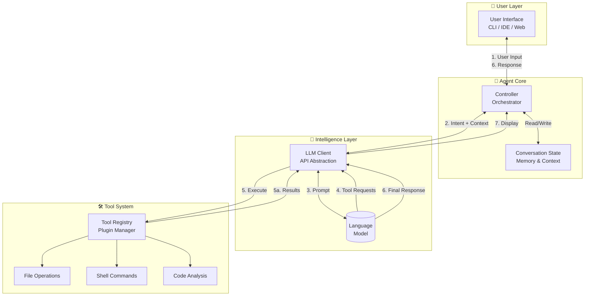
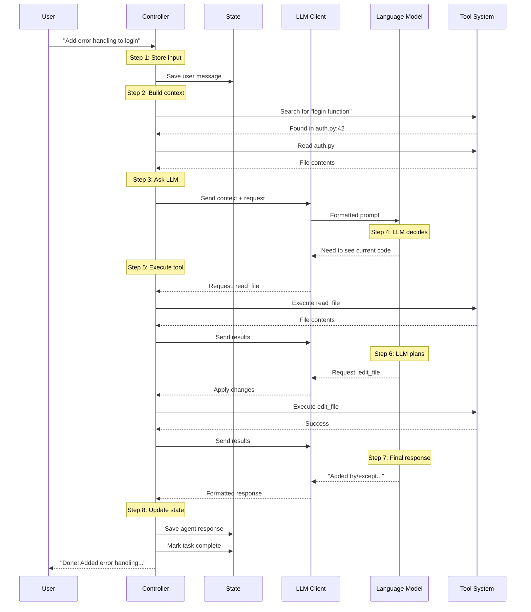

# Day 1, Tutorial 2: System Architecture Deep Dive

**Course:** Build Your Own Coding Agent  
**Day:** 1  
**Tutorial:** 2 of 288  
**Estimated Time:** 25 minutes

---

## 🎯 What You'll Learn

By the end of this tutorial, you'll:
- Understand the high-level architecture of a coding agent
- See how components communicate with each other
- Visualize data flow from user input to code execution
- Know why we separate concerns into distinct modules

---

## 🏗️ The Big Picture

A coding agent isn't just one program - it's a **system of cooperating components**. Think of it like a restaurant:

- **You** (the customer) tell the waiter what you want
- **The waiter** (controller) takes your order to the kitchen
- **The chef** (LLM) decides what ingredients and steps are needed
- **The kitchen staff** (tools) prepare the food
- **The waiter** brings it back to you

Let's see how this maps to our agent architecture.

---

## 🧩 Four Main Components



---

## 📋 Component Breakdown

### 1️⃣ User Interface (UI)

**What it does:**
- Receives user commands via CLI, IDE extension, or web interface
- Displays agent responses in readable format
- Shows file changes, diffs, and execution results
- Provides progress indicators and status updates

**Examples:**
- Terminal CLI (like Claude Code)
- VS Code extension (like GitHub Copilot Chat)
- Web interface (like ChatGPT with code interpreter)

**Key Design Principle:** The UI is "dumb" - it just displays what the Controller tells it to. No business logic here.

---

### 2️⃣ Controller (The Orchestrator)

**What it does:**
- Parses user intent from natural language
- Plans multi-step actions (read file → analyze → edit → test)
- Manages conversation state and context
- Coordinates between LLM and Tools
- Handles errors and retries

**Think of it as:** The brain's executive function. It decides WHAT to do, not HOW to do it.

**Key Responsibilities:**
```python
class Controller:
    def run(self, user_input: str):
        # 1. Store user message
        # 2. Build context (history + relevant files)
        # 3. Ask LLM: "What should I do?"
        # 4. Parse LLM response (might request tools)
        # 5. Execute requested tools
        # 6. Send results back to LLM
        # 7. Return final response to user
```

---

### 3️⃣ LLM Client

**What it does:**
- Abstracts different LLM providers (Claude, GPT, local models)
- Formats prompts correctly for each provider
- Handles tool use / function calling format
- Processes structured responses (JSON, XML)
- Manages API keys, rate limits, and retries

**Why we need it:**
```python
# Without abstraction:
if using_claude:
    response = call_anthropic_api(prompt, tools)
elif using_gpt:
    response = call_openai_api(prompt, functions)

# With abstraction:
response = llm_client.complete(prompt, tools)  # Same interface!
```

**Supported Providers:**
- Anthropic Claude (Claude 3.5 Sonnet, Opus)
- OpenAI GPT (GPT-4, GPT-4 Turbo)
- Local models (Ollama, LM Studio)

---

### 4️⃣ Tool System

**What it does:**
- Executes actions the LLM can't do directly:
  - **File operations:** Read, write, edit, delete files
  - **Shell commands:** Run tests, install packages, git commands
  - **Code analysis:** Parse AST, find definitions, analyze imports
- Validates tool inputs (safety!)
- Returns structured results to LLM
- Handles errors gracefully

**The Tool Registry Pattern:**
```python
class ToolRegistry:
    def register(self, tool: Tool): ...
    def execute(self, tool_name: str, args: dict): ...
    
# Register tools
registry.register(FileReadTool())
registry.register(ShellExecuteTool())
registry.register(CodeSearchTool())

# LLM requests: {"tool": "file_read", "args": {"path": "main.py"}}
result = registry.execute("file_read", {"path": "main.py"})
```

---

## 🔄 Data Flow Walkthrough

Let's trace what happens when you say: **"Add error handling to the login function"**



---

## 🎯 Why This Architecture?

### Separation of Concerns
Each component has ONE job:
- **UI:** Display things
- **Controller:** Make decisions
- **LLM Client:** Talk to AI
- **Tools:** Execute actions

### Testability
We can test each component independently:
```python
# Test Controller with mock LLM
mock_llm = MockLLMClient()
controller = Controller(llm_client=mock_llm)
assert controller.run("test") == expected

# Test Tools without any LLM
file_tool = FileReadTool()
result = file_tool.execute({"path": "test.txt"})
assert result == "file contents"
```

### Extensibility
Add new capabilities without breaking existing code:
- New LLM provider? Add to LLM Client.
- New tool? Register in Tool System.
- New UI? Swap the UI layer.

### Safety
The Controller validates everything:
- "Delete all files" → Rejected (destructive)
- "Read /etc/passwd" → Rejected (outside workspace)
- "Run rm -rf /" → Rejected (dangerous command)

---

## 🏠 Analogy: Restaurant Kitchen

| Component | Restaurant Analogy | Agent Analogy |
|-----------|-------------------|---------------|
| **User** | Customer | Developer using the agent |
| **UI** | Waiter | CLI/IDE that takes input |
| **Controller** | Head Chef | Orchestrates the whole process |
| **LLM** | Recipe Book | Knows WHAT to do, not HOW |
| **Tools** | Kitchen Stations | Actually do the work |
| **State** | Order Ticket | Remembers what's happening |

The customer (you) tells the waiter (UI) what they want. The head chef (Controller) looks at the recipe (LLM) and directs the kitchen stations (Tools) to prepare the meal. The waiter brings it back to you.

---

## 🎯 Exercise: Trace a Request

**Scenario:** User says "Find all TODO comments in the codebase"

**Task:** Trace through the architecture:
1. What does the UI do?
2. What does the Controller do?
3. What does the LLM Client do?
4. What tools might be called?
5. What's the final output?

**Answer:**
1. **UI:** Receives "Find all TODO comments", sends to Controller
2. **Controller:** Stores message, asks LLM "How do I find TODOs?"
3. **LLM Client:** Formats prompt, sends to LLM
4. **LLM:** Responds "Use grep to search for 'TODO'"
5. **Controller:** Calls Tool System → ShellTool executes `grep -r "TODO" .`
6. **Tool System:** Returns list of files with TODOs
7. **Controller:** Sends results to LLM for summary
8. **LLM:** Provides formatted list
9. **Controller:** Returns to UI
10. **UI:** Displays formatted TODO list to user

---

## 🐛 Common Pitfalls

1. **Putting logic in the UI**
   - ❌ UI decides what tool to call
   - ✅ UI just displays, Controller decides

2. **Controller doing too much**
   - ❌ Controller implements file reading
   - ✅ Controller delegates to FileTool

3. **Tight coupling to one LLM**
   - ❌ Direct OpenAI API calls everywhere
   - ✅ Use LLM Client abstraction

4. **No state management**
   - ❌ Each message is independent
   - ✅ Conversation history provides context

---

## 📝 Key Takeaways

- ✅ **Four components:** UI, Controller, LLM Client, Tool System
- ✅ **Controller is the brain:** Decides what to do, delegates how
- ✅ **LLM knows WHAT, Tools know HOW:** Separation of planning and execution
- ✅ **State matters:** Conversation history enables context-aware responses
- ✅ **Safety first:** Controller validates all actions before execution

---

## 🎯 Next Tutorial

In **Tutorial 3**, we'll break down each component in detail and start designing the interfaces between them.

---

## ✅ No Code Yet

We're still in the design phase! No code to commit for this tutorial. We'll start coding in Tutorial 4.

**But if you want to save your notes:**
```bash
# Create a notes file for your architecture thoughts
echo "My agent architecture notes..." > architecture_notes.md
git add architecture_notes.md
git commit -m "Tutorial 2: Architecture notes"
git push origin main
```

---

*This is tutorial 2/24 for Day 1. The blueprint is ready!*
