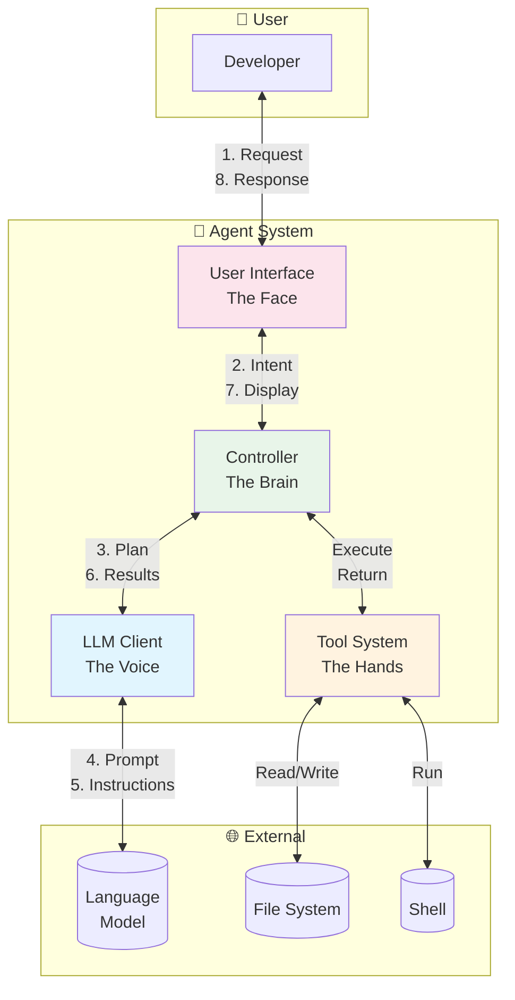
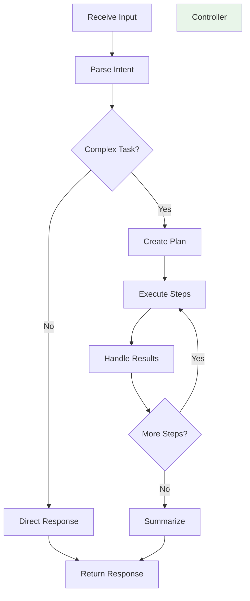
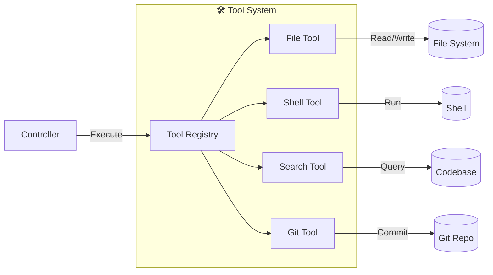
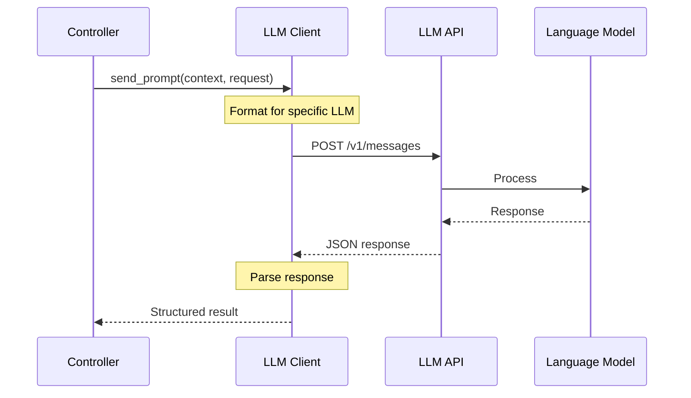
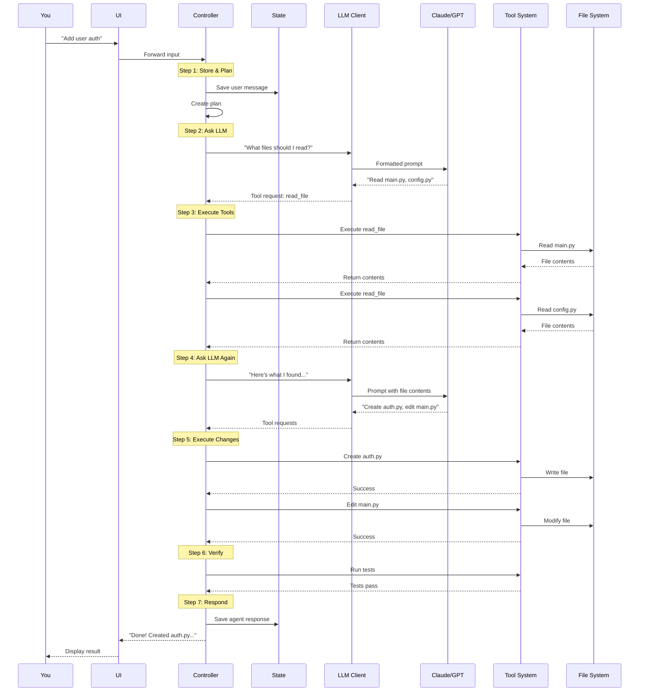

# Day 1, Tutorial 3: Component Breakdown

**Course:** Build Your Own Coding Agent  
**Day:** 1  
**Tutorial:** 3 of 288  
**Estimated Time:** 25 minutes

---

## 🎯 What You'll Learn

By the end of this tutorial, you'll:
- Understand the four main components in detail
- Know what each component does and doesn't do
- See how they communicate with each other
- Understand the interfaces between components

---

## 🧩 The Four Components

In Tutorial 2, we saw the high-level architecture. Now let's break down each component with concrete examples.



---

## 1️⃣ User Interface (UI)

**The Face of the Agent**

### What It Does

The UI is your window into the agent. It's responsible for:

| Responsibility | Example |
|--------------|---------|
| **Receive input** | You type: "Refactor the auth module" |
| **Display responses** | Shows: "I'll analyze the auth module..." |
| **Show progress** | Displays: "Reading files... [3/5]" |
| **Present changes** | Shows diffs: "- old code\n+ new code" |
| **Handle confirmations** | Asks: "Delete file.py? (yes/no)" |
| **Show errors** | Displays: "Error: File not found" |

### What It DOESN'T Do

```python
# ❌ BAD: UI making decisions
class BadUI:
    def handle_input(self, user_input):
        if "refactor" in user_input:
            self.run_refactor()  # UI should NOT decide this!
        elif "test" in user_input:
            self.run_tests()     # UI should NOT decide this!

# ✅ GOOD: UI just passes through
class GoodUI:
    def handle_input(self, user_input):
        response = self.controller.run(user_input)  # Delegate!
        self.display(response)
```

### Real Example

```
You: "Add error handling to login"

UI Display:
━━━━━━━━━━━━━━━━━━━━━━━━━━━━━━
🤖 Agent is thinking...

📖 Reading: auth.py
📖 Reading: models.py
✏️  Editing: auth.py (lines 42-58)
🧪 Running tests...
✅ Tests passed (5/5)

Done! I've added try/except blocks to handle:
- Invalid credentials
- Database errors  
- Rate limiting

Files modified: 1
Lines changed: +12, -3
━━━━━━━━━━━━━━━━━━━━━━━━━━━━━━
```

### In Our Implementation

We'll start with a **CLI interface** (terminal), then optionally add:
- **Web UI** (browser-based)
- **IDE Extension** (VS Code plugin)
- **API Server** (for integrations)

---

## 2️⃣ Controller (The Brain)

**The Orchestrator**

### What It Does

The Controller is the decision-maker. It:



**Key Responsibilities:**

1. **Parse Intent**
   ```python
   # "Add auth" → needs to understand what "auth" means
   intent = controller.parse("Add auth to the app")
   # Result: {"action": "add_feature", "feature": "authentication"}
   ```

2. **Plan Multi-Step Actions**
   ```python
   # Breaks "Add auth" into steps:
   plan = [
       {"step": 1, "action": "analyze_codebase", "description": "Find user-related files"},
       {"step": 2, "action": "install_package", "package": "fastapi-users"},
       {"step": 3, "action": "create_file", "path": "models/user.py"},
       {"step": 4, "action": "edit_file", "path": "main.py"},
       {"step": 5, "action": "run_tests"},
   ]
   ```

3. **Manage State**
   ```python
   # Remembers what we've done
   state = {
       "conversation_history": [...],
       "files_modified": [...],
       "current_plan": [...],
       "context": {...}
   }
   ```

4. **Decide When to Use Tools**
   ```python
   # Controller decides: "I need to read a file"
   if controller.needs_file_context():
       file_content = tool_system.read_file("auth.py")
       controller.add_context(file_content)
   ```

5. **Handle Errors**
   ```python
   try:
       result = tool_system.run_tests()
   except TestFailure as e:
       controller.retry_or_ask_user(e)
   ```

### What It DOESN'T Do

The Controller **never** executes actions directly:

```python
# ❌ BAD: Controller doing everything
class BadController:
    def run(self, user_input):
        # Controller should NOT read files directly!
        with open("file.py") as f:
            content = f.read()
        
        # Controller should NOT run shell commands!
        os.system("pytest")

# ✅ GOOD: Controller delegates
class GoodController:
    def run(self, user_input):
        # Ask Tool System to read file
        content = self.tools.read_file("file.py")
        
        # Ask Tool System to run tests
        results = self.tools.run_command("pytest")
```

### Real Example: "Add error handling"

```python
# Controller's internal flow:

def run("Add error handling to login"):
    # 1. Store user message
    state.add_message("user", "Add error handling to login")
    
    # 2. Build context (what files are relevant?)
    context = build_context("login error handling")
    
    # 3. Ask LLM: "What should I do?"
    llm_response = llm_client.send(context + user_input)
    
    # 4. LLM says: "Read auth.py first"
    if llm_response.needs_tool("read_file"):
        file_content = tools.read_file("auth.py")
        
    # 5. Send file content to LLM
    llm_response = llm_client.send(file_content)
    
    # 6. LLM says: "Add try/except here"
    if llm_response.needs_tool("edit_file"):
        tools.edit_file("auth.py", changes)
        
    # 7. Verify: Run tests
    test_results = tools.run_command("pytest")
    
    # 8. Return summary to user
    return "Added error handling! Tests pass."
```

---

## 3️⃣ Tool System (The Hands)

**The Action Executor**

### What It Does

The Tool System executes actions. It's the only component that touches the outside world:



**Available Tools:**

| Tool | Purpose | Example |
|------|---------|---------|
| **File Tool** | Read, write, edit files | `read_file("main.py")` |
| **Shell Tool** | Run commands | `run_command("pytest")` |
| **Search Tool** | Find code patterns | `search("def login")` |
| **Git Tool** | Version control | `git_commit("Add auth")` |
| **Code Tool** | Analyze code | `get_function_signature("login")` |

### Tool Interface

Every tool follows the same interface:

```python
class Tool(ABC):
    @property
    @abstractmethod
    def name(self) -> str:
        """Tool name for the LLM to reference"""
        pass
    
    @property
    @abstractmethod
    def description(self) -> str:
        """What this tool does"""
        pass
    
    @abstractmethod
    def execute(self, args: dict) -> str:
        """
        Execute the tool with arguments.
        Returns: Result as string (for LLM to understand)
        """
        pass
```

### Example: File Tool

```python
class FileTool(Tool):
    @property
    def name(self) -> str:
        return "file_operations"
    
    @property
    def description(self) -> str:
        return "Read, write, and edit files"
    
    def execute(self, args: dict) -> str:
        action = args.get("action")
        path = args.get("path")
        
        if action == "read":
            with open(path) as f:
                return f.read()
        
        elif action == "write":
            content = args.get("content")
            with open(path, 'w') as f:
                f.write(content)
            return f"Wrote {len(content)} characters to {path}"
        
        elif action == "edit":
            # Apply edit operations
            ...
```

### Safety First

Tools validate everything:

```python
def read_file(self, path: str):
    # Safety: Prevent directory traversal
    if ".." in path:
        raise SecurityError("Path traversal not allowed")
    
    # Safety: Stay within workspace
    if not path.startswith(self.workspace_root):
        raise SecurityError("File outside workspace")
    
    # Safety: Check if file exists
    if not os.path.exists(path):
        raise FileNotFoundError(f"File not found: {path}")
    
    # Now safe to read
    with open(path) as f:
        return f.read()
```

---

## 4️⃣ LLM Client (The Voice)

**The AI Communicator**

### What It Does

The LLM Client is the bridge to the language model:



**Responsibilities:**

1. **Format Prompts Correctly**
   ```python
   # Claude format
   claude_prompt = {
       "messages": [{"role": "user", "content": prompt}],
       "tools": tool_definitions,
       "system": system_prompt
   }
   
   # GPT format (different!)
   gpt_prompt = {
       "messages": [
           {"role": "system", "content": system_prompt},
           {"role": "user", "content": prompt}
       ],
       "functions": tool_definitions
   }
   ```

2. **Handle Tool Use**
   ```python
   # LLM responds with tool request
   response = {
       "content": None,
       "tool_calls": [{
           "name": "read_file",
           "arguments": {"path": "main.py"}
       }]
   }
   
   # LLM Client parses this
   return ToolRequest("read_file", {"path": "main.py"})
   ```

3. **Manage API Details**
   - API keys (from environment)
   - Rate limits (don't exceed quotas)
   - Retries (handle transient failures)
   - Timeouts (don't hang forever)

4. **Support Multiple Providers**
   ```python
   class LLMClient:
       def __init__(self, provider: str):
           if provider == "anthropic":
               self.adapter = AnthropicAdapter()
           elif provider == "openai":
               self.adapter = OpenAIAdapter()
           elif provider == "ollama":
               self.adapter = OllamaAdapter()
   ```

### Example: Complete Flow

```python
# Controller asks LLM Client
response = llm_client.complete(
    prompt="Add error handling to this function",
    context={
        "file_content": "def login(): ...",
        "conversation_history": [...]
    },
    tools=[file_tool, shell_tool]
)

# LLM Client formats for Claude
claude_request = {
    "model": "claude-3-5-sonnet",
    "messages": [...],
    "tools": [
        {
            "name": "edit_file",
            "description": "Edit a file",
            "input_schema": {...}
        }
    ]
}

# Sends to API
api_response = requests.post(
    "https://api.anthropic.com/v1/messages",
    headers={"Authorization": f"Bearer {api_key}"},
    json=claude_request
)

# Parses response
if api_response.tool_calls:
    return ToolRequest(
        name=api_response.tool_calls[0].name,
        arguments=api_response.tool_calls[0].arguments
    )
else:
    return TextResponse(content=api_response.content)
```

---

## 🔄 How They Work Together: Complete Example

Let's trace: **"Add user authentication"**



---

## 🎯 Exercise: Component Mapping

**Task:** For each action, identify which component does the work.

| # | Action | Component |
|---|--------|-----------|
| 1 | You type "fix the bug" | UI |
| 2 | Decides which files to read | ? |
| 3 | Displays "Reading file..." | ? |
| 4 | Reads the actual file | ? |
| 5 | Formats prompt for Claude | ? |
| 6 | Runs `pytest` command | ? |
| 7 | Shows test results | ? |
| 8 | Stores conversation history | ? |

**Answers:**
1. UI ✅
2. **Controller** (decides what to do)
3. **UI** (displays progress)
4. **Tool System** (executes file read)
5. **LLM Client** (formats for specific LLM)
6. **Tool System** (runs shell command)
7. **UI** (displays results)
8. **Controller** (manages state)

---

## 🐛 Common Pitfalls

1. **Controller doing tool work**
   - ❌ Controller reads files directly
   - ✅ Controller asks Tool System

2. **UI making decisions**
   - ❌ UI decides which tool to call
   - ✅ UI just displays, Controller decides

3. **LLM Client without abstraction**
   - ❌ Direct OpenAI calls everywhere
   - ✅ LLM Client abstracts provider

4. **Tools without safety**
   - ❌ File tool accepts any path
   - ✅ File tool validates paths

5. **No state management**
   - ❌ Each message independent
   - ✅ Controller maintains context

---

## 📝 Key Takeaways

- ✅ **UI** = Face (input/output, no decisions)
- ✅ **Controller** = Brain (orchestrates, plans, decides)
- ✅ **Tool System** = Hands (executes actions, touches files/shell)
- ✅ **LLM Client** = Voice (talks to AI, handles API details)
- ✅ **Separation:** Each has ONE job, delegates to others
- ✅ **Safety:** Tools validate, Controller coordinates

---

## 🎯 Next Tutorial

In **Tutorial 4**, we'll implement the **Data Flow**—our first working code that shows how information moves between these components.

---

## ✅ No Code Yet

Still in the design phase! We're building the mental model first.

**Save your understanding:**
```bash
cat > component_notes.md << 'EOF'
# Component Responsibilities

## UI
- Input/output only
- No business logic

## Controller
- Decision maker
- State manager

## Tool System
- Action executor
- Safety validator

## LLM Client
- AI communication
- API abstraction
EOF

git add component_notes.md
git commit -m "Tutorial 3: Component breakdown notes"
git push origin main
```

---

*This is tutorial 3/24 for Day 1. The architecture is clear!*
