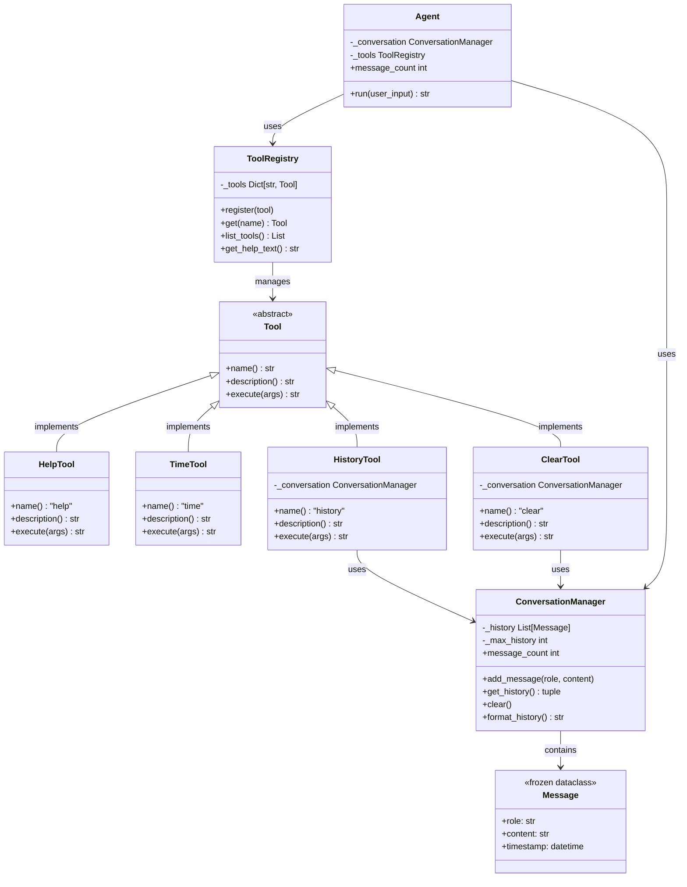

# Day 1, Tutorial 5: OOP Refresher - Classes, Objects, Encapsulation

**Course:** Build Your Own Coding Agent  
**Day:** 1  
**Tutorial:** 5 of 288  
**Estimated Time:** 30 minutes

---

## 🎯 What You'll Learn

By the end of this tutorial, you'll:
- Refactor procedural code into clean OOP design
- Apply encapsulation to protect internal state
- Create proper interfaces for your agent components
- Build a foundation for the full agent architecture

---

## 🔄 Where We Left Off

In Tutorial 4, we built `agent_v0.py` - a simple agent with:
- A `SimpleAgent` class (basic)
- Hardcoded command handling
- Direct history management

It worked, but it had problems:
- ❌ History is directly accessible (can be corrupted)
- ❌ No separation between "what to do" and "how to do it"
- ❌ Commands are hardcoded in the agent class
- ❌ Hard to extend with new features

**Today, we fix this with proper OOP.**

---

## 🧱 OOP Concepts We'll Apply

### 1. **Encapsulation** - Hide the internals
```python
# Bad: Anyone can mess with history
agent.conversation_history = []  # Oops, cleared by accident!

# Good: Controlled access
agent.add_message("user", "Hello")  # Only way to modify
```

### 2. **Single Responsibility** - One job per class
```python
# Bad: Agent does everything
class Agent:
    def run(self): ...
    def handle_file_tool(self): ...  # File logic here?
    def handle_shell_tool(self): ... # Shell logic here?

# Good: Separate concerns
class Agent:
    def run(self): ...
    # Uses ToolRegistry, not implements tools

class ToolRegistry:
    def execute(self, tool_name): ...
```

### 3. **Interfaces** - Define contracts
```python
from abc import ABC, abstractmethod

class Tool(ABC):
    @abstractmethod
    def execute(self, args): ...
    
    @abstractmethod  
    def description(self) -> str: ...
```

### 4. **Class Diagram** - Visual overview

Here's how our classes relate to each other:



**Key relationships:**
- **Inheritance** (`<|--`): All tools implement the `Tool` interface
- **Composition** (`-->`): Agent uses `ConversationManager` and `ToolRegistry`
- **Association**: `ToolRegistry` manages multiple `Tool` objects
- **Dependency**: `HistoryTool` and `ClearTool` need `ConversationManager`

---

## 🛠️ Let's Refactor

Create a new file: `agent_v1.py`

```python
#!/usr/bin/env python3
"""
Coding Agent v1.0 - OOP Refactored
Proper encapsulation, interfaces, and separation of concerns.
"""

from abc import ABC, abstractmethod
from dataclasses import dataclass, field
from typing import List, Dict, Any, Optional
import datetime


# ============================================================================
# DATA CLASSES - Immutable data structures
# ============================================================================

@dataclass(frozen=True)
class Message:
    """
    Immutable message in the conversation.
    
    frozen=True means once created, it can't be changed.
    This prevents accidental modification of history.
    """
    role: str  # "user" or "agent"
    content: str
    timestamp: datetime.datetime = field(default_factory=datetime.datetime.now)
    
    def __repr__(self) -> str:
        time_str = self.timestamp.strftime("%H:%M:%S")
        return f"[{time_str}] {self.role}: {self.content[:50]}..."


# ============================================================================
# INTERFACES - Define contracts
# ============================================================================

class Tool(ABC):
    """
    Abstract base class for all tools.
    
    Every tool must implement:
    - name: What to call it
    - description: What it does (for help)
    - execute: The actual work
    """
    
    @property
    @abstractmethod
    def name(self) -> str:
        """Tool name (used in commands)."""
        pass
    
    @property
    @abstractmethod
    def description(self) -> str:
        """Tool description (for /help)."""
        pass
    
    @abstractmethod
    def execute(self, args: str = "") -> str:
        """
        Execute the tool with optional arguments.
        
        Args:
            args: Tool arguments (e.g., "/time" has no args,
                  "/read file.txt" has "file.txt")
        
        Returns:
            Tool output as string
        """
        pass


# ============================================================================
# CONCRETE TOOLS - Actual implementations
# ============================================================================

class HelpTool(Tool):
    """Shows available commands."""
    
    @property
    def name(self) -> str:
        return "help"
    
    @property
    def description(self) -> str:
        return "Show available commands"
    
    def execute(self, args: str = "") -> str:
        return "Available commands: /help, /time, /history, /clear"


class TimeTool(Tool):
    """Shows current time."""
    
    @property
    def name(self) -> str:
        return "time"
    
    @property
    def description(self) -> str:
        return "Show current time"
    
    def execute(self, args: str = "") -> str:
        now = datetime.datetime.now()
        return f"Current time: {now.strftime('%Y-%m-%d %H:%M:%S')}"


class HistoryTool(Tool):
    """Shows conversation history."""
    
    def __init__(self, conversation_manager: 'ConversationManager'):
        self._conversation = conversation_manager
    
    @property
    def name(self) -> str:
        return "history"
    
    @property
    def description(self) -> str:
        return "Show conversation history"
    
    def execute(self, args: str = "") -> str:
        return self._conversation.format_history()


class ClearTool(Tool):
    """Clears conversation history."""
    
    def __init__(self, conversation_manager: 'ConversationManager'):
        self._conversation = conversation_manager
    
    @property
    def name(self) -> str:
        return "clear"
    
    @property
    def description(self) -> str:
        return "Clear conversation history"
    
    def execute(self, args: str = "") -> str:
        self._conversation.clear()
        return "History cleared."


# ============================================================================
# CONVERSATION MANAGER - Encapsulated history
# ============================================================================

class ConversationManager:
    """
    Manages conversation history with proper encapsulation.
    
    The history is private (_history) and can only be modified
    through controlled methods.
    """
    
    def __init__(self):
        self._history: List[Message] = []
        self._max_history = 100  # Prevent unbounded growth
    
    def add_message(self, role: str, content: str) -> None:
        """
        Add a message to history.
        
        Args:
            role: "user" or "agent"
            content: The message content
        """
        message = Message(role=role, content=content)
        self._history.append(message)
        
        # Trim old messages if needed
        if len(self._history) > self._max_history:
            self._history = self._history[-self._max_history:]
    
    def get_history(self) -> tuple[Message, ...]:
        """
        Get immutable copy of history.
        
        Returns:
            Tuple of messages (can't be modified)
        """
        return tuple(self._history)
    
    def clear(self) -> None:
        """Clear all history."""
        self._history.clear()
    
    def format_history(self) -> str:
        """Format history for display."""
        if not self._history:
            return "No history yet."
        
        lines = []
        for msg in self._history:
            role_label = "You" if msg.role == "user" else "Agent"
            lines.append(f"{role_label}: {msg.content}")
        return "\n".join(lines)
    
    @property
    def message_count(self) -> int:
        """Get number of messages in history."""
        return len(self._history)


# ============================================================================
# TOOL REGISTRY - Manages available tools
# ============================================================================

class ToolRegistry:
    """
    Registry of all available tools.
    
    This separates tool management from the agent logic.
    """
    
    def __init__(self):
        self._tools: Dict[str, Tool] = {}
    
    def register(self, tool: Tool) -> None:
        """Register a new tool."""
        self._tools[tool.name] = tool
    
    def get(self, name: str) -> Optional[Tool]:
        """Get a tool by name."""
        return self._tools.get(name)
    
    def list_tools(self) -> List[Tool]:
        """Get all registered tools."""
        return list(self._tools.values())
    
    def get_help_text(self) -> str:
        """Generate help text for all tools."""
        lines = ["Available commands:"]
        for tool in self._tools.values():
            lines.append(f"  /{tool.name} - {tool.description}")
        return "\n".join(lines)


# ============================================================================
# AGENT - The main controller (refactored)
# ============================================================================

class Agent:
    """
    The main agent controller.
    
    Responsibilities:
    - Coordinate between user, tools, and (future) LLM
    - Manage conversation flow
    - NOT implement tools (delegated to ToolRegistry)
    - NOT manage history directly (delegated to ConversationManager)
    """
    
    def __init__(self):
        self._conversation = ConversationManager()
        self._tools = ToolRegistry()
        self._setup_tools()
    
    def _setup_tools(self) -> None:
        """Register all available tools."""
        self._tools.register(HelpTool())
        self._tools.register(TimeTool())
        self._tools.register(HistoryTool(self._conversation))
        self._tools.register(ClearTool(self._conversation))
    
    def run(self, user_input: str) -> str:
        """
        Main entry point - process user input and return response.
        
        Flow:
        1. Store user input in conversation
        2. Decide what to do (command or default response)
        3. Execute and get response
        4. Store response in conversation
        5. Return response
        """
        # Step 1: Store user input
        self._conversation.add_message("user", user_input)
        
        # Step 2 & 3: Process and get response
        response = self._process_input(user_input)
        
        # Step 4: Store response
        self._conversation.add_message("agent", response)
        
        return response
    
    def _process_input(self, user_input: str) -> str:
        """
        Process user input and generate response.
        
        In v1, we handle commands. In future versions, this will
        call the LLM to decide what to do.
        """
        # Check for commands
        if user_input.startswith("/"):
            return self._handle_command(user_input)
        
        # Default response (placeholder for LLM)
        return f"Received: '{user_input}'. (LLM integration coming in Tutorial 25!)"
    
    def _handle_command(self, user_input: str) -> str:
        """Parse and execute commands."""
        # Parse command and args
        parts = user_input[1:].split(maxsplit=1)  # Remove "/" and split
        command = parts[0] if parts else ""
        args = parts[1] if len(parts) > 1 else ""
        
        # Special case: help with no specific tool
        if command == "help":
            return self._tools.get_help_text()
        
        # Look up and execute tool
        tool = self._tools.get(command)
        if tool:
            return tool.execute(args)
        
        return f"Unknown command: /{command}. Type /help for available commands."
    
    @property
    def message_count(self) -> int:
        """Get number of messages in conversation."""
        return self._conversation.message_count


# ============================================================================
# MAIN - Entry point
# ============================================================================

def main():
    """Run the agent in an interactive loop."""
    print("=" * 60)
    print("Coding Agent v1.0 - OOP Refactored")
    print("=" * 60)
    print("\nType your message and press Enter.")
    print("Commands: /help, /time, /history, /clear")
    print("Type 'quit' to exit.\n")
    
    agent = Agent()
    
    while True:
        try:
            user_input = input("You: ").strip()
            
            if user_input.lower() in ['quit', 'exit', 'q']:
                print(f"\nGoodbye! Total messages: {agent.message_count}")
                break
            
            if not user_input:
                continue
            
            response = agent.run(user_input)
            print(f"Agent: {response}\n")
            
        except KeyboardInterrupt:
            print("\n\nInterrupted. Goodbye!")
            break
        except EOFError:
            print("\n\nEOF received. Goodbye!")
            break


if __name__ == "__main__":
    main()
```

---

## 🧪 Test It

Run the refactored agent:

```bash
python agent_v1.py
```

**Try these interactions:**

```
You: Hello
Agent: Received: 'Hello'. (LLM integration coming in Tutorial 25!)

You: /help
Agent: Available commands:
  /help - Show available commands
  /time - Show current time
  /history - Show conversation history
  /clear - Clear conversation history

You: /time
Agent: Current time: 2026-03-19 09:47:32

You: /history
Agent: You: Hello
Agent: Received: 'Hello'. (LLM integration coming in Tutorial 25!)
You: /help
Agent: Available commands: ...
You: /time
Agent: Current time: ...

You: quit
Goodbye! Total messages: 8
```

---

## 🔍 What Changed?

### Before (v0) vs After (v1)

| Aspect | v0 (Tutorial 4) | v1 (Tutorial 5) |
|--------|-----------------|-----------------|
| **History** | Direct list access | Encapsulated in `ConversationManager` |
| **Tools** | Hardcoded in `Agent` | Separate `Tool` classes via `ToolRegistry` |
| **Extensibility** | Edit `Agent` class | Add new `Tool` class, register it |
| **Safety** | History can be corrupted | Immutable `Message` objects |
| **Testability** | Hard to test parts | Each class testable independently |

---

## 🎯 Exercise: Add a New Tool

**Task:** Add a `/count` command that shows the number of messages.

**Steps:**
1. Create a new `CountTool` class implementing the `Tool` interface
2. It needs access to `ConversationManager` (like `HistoryTool`)
3. Register it in `Agent._setup_tools()`

**Solution:**

```python
class CountTool(Tool):
    """Shows message count."""
    
    def __init__(self, conversation_manager: ConversationManager):
        self._conversation = conversation_manager
    
    @property
    def name(self) -> str:
        return "count"
    
    @property
    def description(self) -> str:
        return "Show message count"
    
    def execute(self, args: str = "") -> str:
        count = self._conversation.message_count
        return f"Total messages: {count}"

# In Agent._setup_tools(), add:
self._tools.register(CountTool(self._conversation))
```

---

## 🐛 Common Pitfalls

1. **Breaking encapsulation**
   - ❌ `agent._conversation._history.append(...)`  # Don't do this!
   - ✅ `agent._conversation.add_message(...)`  # Use the public API

2. **Forgetting to register tools**
   - ❌ Create `CountTool` but don't call `register()`
   - ✅ Always register in `_setup_tools()`

3. **Not implementing all abstract methods**
   - ❌ `Tool` subclass missing `description` property
   - ✅ All `@abstractmethod` must be implemented

4. **Mutable default arguments**
   - ❌ `def __init__(self, history=[]):`  # Shared between instances!
   - ✅ `def __init__(self): self.history = []`  # Instance-specific

---

## 📝 Key Takeaways

- ✅ **Encapsulation** protects data - use private attributes (`_history`)
- ✅ **Interfaces** (ABC) define contracts - all tools must implement required methods
- ✅ **Single Responsibility** - each class has one job
- ✅ **Composition** - `Agent` uses `ConversationManager` and `ToolRegistry`
- ✅ **Extensibility** - add new tools without modifying `Agent`
- ✅ **Immutability** - `Message` is frozen, can't be accidentally changed

---

## 🎯 Next Tutorial

In **Tutorial 6**, we'll learn SOLID principles and apply them to make our agent even more robust.

---

## ✅ Commit Your Work

```bash
git add agent_v1.py
git commit -m "Tutorial 5: Refactor with OOP principles"
git push origin main
```

**Your agent is now properly object-oriented!** 🎉

---

*This is tutorial 5/24 for Day 1. The architecture is taking shape!*
