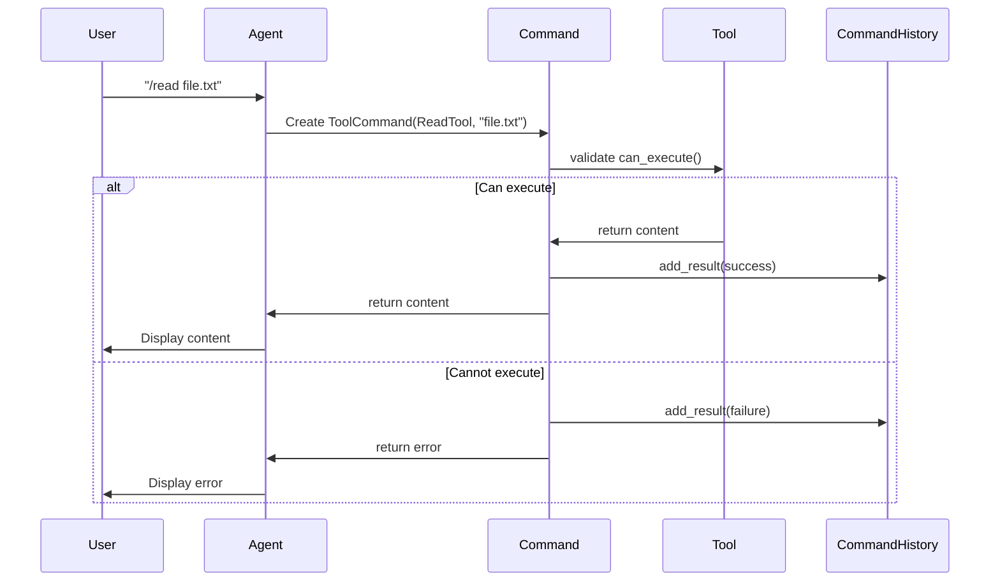

# Day 1, Tutorial 7: Design Patterns - Strategy, Command, Observer

**Course:** Build Your Own Coding Agent  
**Day:** 1  
**Tutorial:** 7 of 288  
**Estimated Time:** 45 minutes

---

## 🎯 What You'll Learn

By the end of this tutorial, you'll:
- Understand three essential design patterns with real-world analogies
- Apply the **Strategy Pattern** to swap LLM providers (Claude, OpenAI, Ollama) at runtime
- Apply the **Command Pattern** to encapsulate tool execution as objects
- Apply the **Observer Pattern** to create event-driven notifications
- Build `agent_v3.py` with all three patterns integrated

---

## 📚 Why Design Patterns Matter

Design patterns are proven solutions to common software problems. They:

1. **Provide shared vocabulary** - When you say "we use Strategy here," other developers understand immediately
2. **Solve recurring problems** - Others have faced the same challenges; patterns encode that wisdom
3. **Enable flexibility** - Change behavior without rewriting core logic
4. **Improve testability** - Patterns create clear boundaries for mocking

For coding agents specifically, these three patterns are invaluable:

| Pattern | Use Case in Agents |
|---------|-------------------|
| **Strategy** | Switch between LLM providers (Claude ↔ OpenAI ↔ Ollama) |
| **Command** | Execute tools with undo/redo, logging, validation |
| **Observer** | Notify UI of progress, log events, trigger webhooks |

---

## 🧩 Pattern 1: Strategy Pattern

### The Problem

In our current `agent_v2.py`, what happens when we want to switch from Claude to OpenAI? We'd need to modify the core `Agent` class. That's a violation of **Open/Closed Principle** and makes testing difficult.

### The Analogy

Think of a payment system. Instead of hardcoding "use credit card," you inject a payment strategy:

```python
class PaymentProcessor:
    def __init__(self, strategy: PaymentStrategy):
        self._strategy = strategy
    
    def pay(self, amount):
        return self._strategy.process(amount)
```

Want to switch from CreditCard to PayPal? Just pass a different strategy. The processor doesn't care.

### Implementation for LLM

Let's create a strategy pattern for LLM providers:

```python
from abc import ABC, abstractmethod
from typing import Optional

class LLMStrategy(ABC):
    """Abstract base for all LLM providers."""
    
    @property
    @abstractmethod
    def name(self) -> str:
        """Provider name for display."""
        pass
    
    @abstractmethod
    def complete(self, prompt: str, **kwargs) -> str:
        """Generate completion from prompt."""
        pass
    
    @property
    def max_tokens(self) -> int:
        """Default max tokens. Override per provider."""
        return 4096


class ClaudeStrategy(LLMStrategy):
    """Anthropic Claude via API."""
    
    def __init__(self, api_key: str, model: str = "claude-3-sonnet-20240229"):
        self._api_key = api_key
        self._model = model
    
    @property
    def name(self) -> str:
        return f"Claude ({self._model})"
    
    def complete(self, prompt: str, **kwargs) -> str:
        # In Tutorial 34, we'll implement actual API call
        # For now, return mock response
        return f"[Claude Response] Processed: {prompt[:50]}..."


class OpenAIStrategy(LLMStrategy):
    """OpenAI GPT via API."""
    
    def __init__(self, api_key: str, model: str = "gpt-4-turbo"):
        self._api_key = api_key
        self._model = model
    
    @property
    def name(self) -> str:
        return f"OpenAI ({self._model})"
    
    def complete(self, prompt: str, **kwargs) -> str:
        return f"[GPT Response] Processed: {prompt[:50]}..."


class OllamaStrategy(LLMStrategy):
    """Local Ollama LLM."""
    
    def __init__(self, model: str = "llama2", base_url: str = "http://localhost:11434"):
        self._model = model
        self._base_url = base_url
    
    @property
    def name(self) -> str:
        return f"Ollama ({self._model})"
    
    @property
    def max_tokens(self) -> int:
        return 2048  # Local models often have smaller context
    
    def complete(self, prompt: str, **kwargs) -> str:
        return f"[Ollama Response] Processed: {prompt[:50]}..."
```

### The Strategy Context

Now our agent can accept any strategy:

```python
class LLMClient:
    """Manages LLM interactions via strategy."""
    
    def __init__(self, strategy: LLMStrategy):
        self._strategy = strategy
    
    @property
    def provider_name(self) -> str:
        return self._strategy.name
    
    def complete(self, prompt: str, **kwargs) -> str:
        return self._strategy.complete(prompt, **kwargs)
    
    def set_strategy(self, strategy: LLMStrategy) -> None:
        """Switch provider at runtime."""
        self._strategy = strategy
```

### Why This Is Powerful

```python
# Easy switching based on requirements
if use_local:
    client.set_strategy(OllamaStrategy())
elif cost_sensitive:
    client.set_strategy(OpenAIStrategy(model="gpt-3.5-turbo"))
else:
    client.set_strategy(ClaudeStrategy())

# Testing becomes trivial - mock the strategy!
class MockLLMStrategy(LLMStrategy):
    def complete(self, prompt, **kwargs):
        return "Mock response for testing"

client = LLMClient(MockLLMStrategy())  # Deterministic, fast tests
```

---

## 🧩 Pattern 2: Command Pattern

### The Problem

When executing tools, we need:
- Undo/redo capability
- Detailed logging of what was executed
- Validation before execution
- Queuing for batch operations

The Command pattern encapsulates each action as an object.

### The Analogy

Think of a restaurant:
- **Without Command pattern:** Chef cooks immediately when order comes in
- **With Command pattern:** Waiter writes order ticket → Kitchen queues it → Executes when ready

The order ticket is the Command object. It can be:
- Stored (receipt)
- Replayed (make same order again)
- Modified (add special instructions)
- Cancelled (before execution)

### Implementation for Tools

```python
from abc import ABC, abstractmethod
from dataclasses import dataclass, field
from datetime import datetime
from typing import Any, Optional
import json

class Command(ABC):
    """Abstract base for all commands."""
    
    @property
    @abstractmethod
    def name(self) -> str:
        pass
    
    @abstractmethod
    def execute(self) -> str:
        """Execute the command. Returns result message."""
        pass
    
    @abstractmethod
    def can_execute(self) -> bool:
        """Check if command can be executed."""
        pass


@dataclass
class CommandResult:
    """Result of command execution."""
    command_name: str
    success: bool
    output: str
    error: Optional[str] = None
    execution_time_ms: float = 0
    timestamp: datetime = field(default_factory=datetime.now)


class ToolCommand(Command):
    """Wraps a Tool as a Command for execution tracking."""
    
    def __init__(self, tool: 'Tool', args: str = ""):
        self._tool = tool
        self._args = args
        self._executed = False
    
    @property
    def name(self) -> str:
        return f"tool:{self._tool.name}"
    
    def can_execute(self) -> bool:
        return self._tool is not None
    
    def execute(self) -> str:
        start = datetime.now()
        try:
            result = self._tool.execute(self._args)
            self._executed = True
            return result
        except Exception as e:
            return f"Error: {e}"
        finally:
            end = datetime.now()
            self._execution_time = (end - start).total_seconds() * 1000
    
    @property
    def was_executed(self) -> bool:
        return self._executed


class CommandHistory:
    """Tracks command execution history with undo capability."""
    
    def __init__(self, max_history: int = 100):
        self._history: list[CommandResult] = []
        self._max_history = max_history
        self._listeners: list[callable] = []
    
    def add_result(self, result: CommandResult) -> None:
        self._history.append(result)
        
        # Trim old history
        if len(self._history) > self._max_history:
            self._history.pop(0)
        
        # Notify observers
        for listener in self._listeners:
            listener(result)
    
    def register_listener(self, listener: callable) -> None:
        """Register a callback for command completion."""
        self._listeners.append(listener)
    
    def get_recent(self, count: int = 10) -> list[CommandResult]:
        return self._history[-count:]
    
    @property
    def total_commands(self) -> int:
        return len(self._history)
    
    @property
    def success_rate(self) -> float:
        if not self._history:
            return 0.0
        successful = sum(1 for r in self._history if r.success)
        return successful / len(self._history)
```

### Mermaid Diagram: Command Execution Flow



---

## 🧩 Pattern 3: Observer Pattern

### The Problem

Our agent does many things: executes tools, calls LLM, manages context. But what if we want to:
- Log every action for debugging?
- Update a UI with progress?
- Send webhooks on certain events?
- Track metrics for monitoring?

Adding these directly to the Agent class violates SRP. We need the Observer pattern.

### The Analogy

Think of a YouTube channel:
- **Without Observer:** Channel owner calls every subscriber when video uploads (coupling!)
- **With Observer:** Subscribers subscribe once. When video uploads, platform notifies all.

The channel is the **Subject**, subscribers are **Observers**.

### Implementation for Agent Events

```python
from abc import ABC, abstractmethod
from dataclasses import dataclass
from enum import Enum
from typing import Any, Callable
import datetime

class EventType(Enum):
    """Types of events our agent emits."""
    USER_MESSAGE = "user_message"
    AGENT_RESPONSE = "agent_response"
    TOOL_START = "tool_start"
    TOOL_COMPLETE = "tool_complete"
    TOOL_ERROR = "tool_error"
    LLM_CALL = "llm_call"
    LLM_RESPONSE = "llm_response"
    ERROR = "error"


@dataclass
class AgentEvent:
    """Event emitted by the agent."""
    event_type: EventType
    timestamp: datetime.datetime
    data: dict
    source: str


class AgentObserver(ABC):
    """Abstract observer interface."""
    
    @abstractmethod
    def on_event(self, event: AgentEvent) -> None:
        """Handle an agent event."""
        pass


class LoggingObserver(AgentObserver):
    """Logs all events to console/file."""
    
    def __init__(self, log_file: str = None, verbose: bool = True):
        self._log_file = log_file
        self._verbose = verbose
    
    def on_event(self, event: AgentEvent) -> None:
        timestamp = event.timestamp.strftime("%H:%M:%S")
        message = f"[{timestamp}] {event.event_type.value}: {event.data}"
        
        if self._verbose:
            print(f"  📡 {message}")
        
        if self._log_file:
            with open(self._log_file, "a") as f:
                f.write(message + "\n")


class MetricsObserver(AgentObserver):
    """Tracks metrics for monitoring."""
    
    def __init__(self):
        self._event_counts: dict[EventType, int] = {}
        self._error_count = 0
        self._tool_timings: dict[str, list[float]] = {}
    
    def on_event(self, event: AgentEvent) -> None:
        # Count events
        self._event_counts[event.event_type] = \
            self._event_counts.get(event.event_type, 0) + 1
        
        # Track errors
        if event.event_type == EventType.TOOL_ERROR:
            self._error_count += 1
        
        # Track tool timings
        if event.event_type == EventType.TOOL_COMPLETE:
            tool_name = event.data.get("tool_name", "unknown")
            timing = event.data.get("execution_time_ms", 0)
            if tool_name not in self._tool_timings:
                self._tool_timings[tool_name] = []
            self._tool_timings[tool_name].append(timing)
    
    def get_summary(self) -> dict:
        return {
            "total_events": sum(self._event_counts.values()),
            "error_count": self._error_count,
            "event_breakdown": dict(self._event_counts),
            "tool_timings_avg": {
                name: sum(times) / len(times) 
                for name, times in self._tool_timings.items()
            }
        }


class EventEmitter:
    """Subject that emits events to observers."""
    
    def __init__(self):
        self._observers: list[AgentObserver] = []
    
    def subscribe(self, observer: AgentObserver) -> None:
        self._observers.append(observer)
    
    def unsubscribe(self, observer: AgentObserver) -> None:
        if observer in self._observers:
            self._observers.remove(observer)
    
    def emit(self, event_type: EventType, data: dict, source: str = "agent") -> None:
        event = AgentEvent(
            event_type=event_type,
            timestamp=datetime.datetime.now(),
            data=data,
            source=source
        )
        
        for observer in self._observers:
            try:
                observer.on_event(event)
            except Exception as e:
                # Don't let observer errors break the agent
                print(f"Observer error: {e}")
```

---

## 🛠️ Putting It All Together: agent_v3.py

Now let's integrate all three patterns into `agent_v3.py`:

```python
#!/usr/bin/env python3
"""
Coding Agent v3.0 - Design Patterns: Strategy, Command, Observer
- Strategy: Swappable LLM providers
- Command: Tool execution with history tracking
- Observer: Event-driven notifications
"""

from abc import ABC, abstractmethod
from dataclasses import dataclass, field
from datetime import datetime
from typing import List, Dict, Any, Optional
import os


# ============================================================================
# STRATEGY PATTERN - LLM Provider Abstraction
# ============================================================================

class LLMStrategy(ABC):
    """Abstract base for all LLM providers."""
    
    @property
    @abstractmethod
    def name(self) -> str:
        pass
    
    @abstractmethod
    def complete(self, prompt: str, **kwargs) -> str:
        pass
    
    @property
    def max_tokens(self) -> int:
        return 4096


class ClaudeStrategy(LLMStrategy):
    """Anthropic Claude."""
    
    def __init__(self, api_key: str = None, model: str = "claude-3-sonnet-20240229"):
        self._api_key = api_key or os.environ.get("ANTHROPIC_API_KEY", "dummy")
        self._model = model
    
    @property
    def name(self) -> str:
        return f"Claude ({self._model})"
    
    def complete(self, prompt: str, **kwargs) -> str:
        # Tutorial 34: Real API call
        return f"[Claude] {prompt[:100]}... (simulated response)"


class OpenAIStrategy(LLMStrategy):
    """OpenAI GPT."""
    
    def __init__(self, api_key: str = None, model: str = "gpt-4-turbo"):
        self._api_key = api_key or os.environ.get("OPENAI_API_KEY", "dummy")
        self._model = model
    
    @property
    def name(self) -> str:
        return f"OpenAI ({self._model})"
    
    def complete(self, prompt: str, **kwargs) -> str:
        return f"[GPT] {prompt[:100]}... (simulated response)"


class OllamaStrategy(LLMStrategy):
    """Local Ollama."""
    
    def __init__(self, model: str = "llama2", base_url: str = "http://localhost:11434"):
        self._model = model
        self._base_url = base_url
    
    @property
    def name(self) -> str:
        return f"Ollama ({self._model})"
    
    @property
    def max_tokens(self) -> int:
        return 2048
    
    def complete(self, prompt: str, **kwargs) -> str:
        return f"[Ollama] {prompt[:100]}... (simulated response)"


class LLMClient:
    """Manages LLM interactions via strategy."""
    
    def __init__(self, strategy: LLMStrategy):
        self._strategy = strategy
    
    @property
    def provider_name(self) -> str:
        return self._strategy.name
    
    def complete(self, prompt: str, **kwargs) -> str:
        return self._strategy.complete(prompt, **kwargs)
    
    def set_strategy(self, strategy: LLMStrategy) -> None:
        self._strategy = strategy


# ============================================================================
# COMMAND PATTERN - Tool Execution Tracking
# ============================================================================

@dataclass
class CommandResult:
    """Result of command execution."""
    command_name: str
    success: bool
    output: str
    error: Optional[str] = None
    execution_time_ms: float = 0


class Command(ABC):
    """Abstract command interface."""
    
    @property
    @abstractmethod
    def name(self) -> str:
        pass
    
    @abstractmethod
    def execute(self) -> str:
        pass
    
    @abstractmethod
    def can_execute(self) -> bool:
        pass


class ToolCommand(Command):
    """Wraps tool execution as a command."""
    
    def __init__(self, tool: 'Tool', args: str = ""):
        self._tool = tool
        self._args = args
        self._executed = False
        self._execution_time = 0
    
    @property
    def name(self) -> str:
        return f"tool:{self._tool.name}"
    
    def can_execute(self) -> bool:
        return self._tool is not None
    
    def execute(self) -> str:
        start = datetime.now()
        try:
            result = self._tool.execute(self._args)
            self._executed = True
            return result
        except Exception as e:
            return f"Error: {e}"
        finally:
            self._execution_time = (datetime.now() - start).total_seconds() * 1000
    
    @property
    def was_executed(self) -> bool:
        return self._executed
    
    @property
    def execution_time(self) -> float:
        return self._execution_time


class CommandHistory:
    """Tracks command execution history."""
    
    def __init__(self, max_history: int = 100):
        self._history: list[CommandResult] = []
        self._max_history = max_history
    
    def add_result(self, result: CommandResult) -> None:
        self._history.append(result)
        if len(self._history) > self._max_history:
            self._history.pop(0)
    
    def get_recent(self, count: int = 10) -> list[CommandResult]:
        return self._history[-count:]


# ============================================================================
# OBSERVER PATTERN - Event System
# ============================================================================

class EventType:
    """Event types."""
    USER_MESSAGE = "user_message"
    AGENT_RESPONSE = "agent_response"
    TOOL_START = "tool_start"
    TOOL_COMPLETE = "tool_complete"
    TOOL_ERROR = "tool_error"
    LLM_CALL = "llm_call"
    ERROR = "error"


@dataclass
class AgentEvent:
    """Event emitted by the agent."""
    event_type: str
    timestamp: datetime
    data: dict


class AgentObserver(ABC):
    """Abstract observer."""
    
    @abstractmethod
    def on_event(self, event: AgentEvent) -> None:
        pass


class LoggingObserver(AgentObserver):
    """Logs events."""
    
    def __init__(self, verbose: bool = True):
        self._verbose = verbose
    
    def on_event(self, event: AgentEvent) -> None:
        if self._verbose:
            print(f"  📡 [{event.event_type}] {event.data}")


class EventEmitter:
    """Emits events to observers."""
    
    def __init__(self):
        self._observers: list[AgentObserver] = []
    
    def subscribe(self, observer: AgentObserver) -> None:
        self._observers.append(observer)
    
    def unsubscribe(self, observer: AgentObserver) -> None:
        if observer in self._observers:
            self._observers.remove(observer)
    
    def emit(self, event_type: str, data: dict) -> None:
        event = AgentEvent(
            event_type=event_type,
            timestamp=datetime.now(),
            data=data
        )
        for observer in self._observers:
            try:
                observer.on_event(event)
            except Exception as e:
                print(f"Observer error: {e}")


# ============================================================================
# TOOL SYSTEM (from previous tutorials)
# ============================================================================

class Tool:
    """Base tool interface."""
    
    @property
    def name(self) -> str:
        raise NotImplementedError
    
    @property
    def description(self) -> str:
        raise NotImplementedError
    
    def execute(self, args: str = "") -> str:
        raise NotImplementedError


class ToolRegistry:
    """Registry for available tools."""
    
    def __init__(self):
        self._tools: dict[str, Tool] = {}
    
    def register(self, tool: Tool) -> None:
        self._tools[tool.name] = tool
    
    def get(self, name: str) -> Optional[Tool]:
        return self._tools.get(name)
    
    def list_tools(self) -> list[str]:
        return list(self._tools.keys())


# ============================================================================
# CONVERSATION MANAGEMENT
# ============================================================================

@dataclass
class Message:
    role: str
    content: str
    timestamp: datetime = field(default_factory=datetime.now)


class ConversationManager:
    """Manages conversation history."""
    
    def __init__(self, max_messages: int = 100):
        self._messages: list[Message] = []
        self._max_messages = max_messages
    
    def add_message(self, role: str, content: str) -> None:
        self._messages.append(Message(role, content))
        if len(self._messages) > self._max_messages:
            self._messages.pop(0)
    
    def get_history(self) -> list[Message]:
        return self._messages.copy()
    
    def format_history(self) -> str:
        if not self._messages:
            return "(No messages yet)"
        
        lines = []
        for msg in self._messages:
            lines.append(f"[{msg.role.upper()}] {msg.content}")
        return "\n".join(lines)


# ============================================================================
# MAIN AGENT - Integrates All Patterns
# ============================================================================

class Agent:
    """
    Main agent with Strategy, Command, and Observer patterns integrated.
    
    - Uses LLMStrategy for provider abstraction
    - Uses ToolCommand for tracked tool execution
    - Uses EventEmitter for notifications
    """
    
    def __init__(self, llm_strategy: LLMStrategy = None):
        # Strategy pattern: LLM provider
        llm = llm_strategy or ClaudeStrategy()
        self._llm = LLMClient(llm)
        
        # Observer pattern: Event system
        self._events = EventEmitter()
        self._events.subscribe(LoggingObserver(verbose=False))
        
        # Command pattern: History tracking
        self._command_history = CommandHistory()
        
        # Conversation
        self._conversation = ConversationManager()
        
        # Tools
        self._tools = ToolRegistry()
        self._setup_tools()
    
    def _setup_tools(self) -> None:
        """Register built-in tools."""
        self._tools.register(HelpTool())
        self._tools.register(TimeTool())
        self._tools.register(HistoryTool(self._conversation))
        self._tools.register(ClearTool(self._conversation))
        self._tools.register(ProviderTool(self._llm))
    
    def subscribe(self, observer: AgentObserver) -> None:
        """Add an event observer."""
        self._events.subscribe(observer)
    
    @property
    def llm_provider(self) -> str:
        return self._llm.provider_name
    
    def set_llm_provider(self, strategy: LLMStrategy) -> None:
        """Switch LLM provider at runtime."""
        old_provider = self._llm.provider_name
        self._llm.set_strategy(strategy)
        self._events.emit(EventType.LLM_CALL, {
            "old": old_provider,
            "new": strategy.name
        })
    
    def run(self, user_input: str) -> str:
        """Process user input."""
        self._conversation.add_message("user", user_input)
        self._events.emit(EventType.USER_MESSAGE, {"content": user_input})
        
        # Check for commands
        if user_input.startswith("/"):
            return self._handle_command(user_input)
        
        # Use LLM for regular input
        return self._handle_llm(user_input)
    
    def _handle_command(self, command: str) -> str:
        """Handle slash commands."""
        parts = command.split(maxsplit=1)
        cmd_name = parts[0][1:]  # Remove /
        args = parts[1] if len(parts) > 1 else ""
        
        tool = self._tools.get(cmd_name)
        if not tool:
            return f"Unknown command: /{cmd_name}"
        
        # Command pattern: Wrap execution
        tool_cmd = ToolCommand(tool, args)
        
        if not tool_cmd.can_execute():
            return f"Cannot execute: /{cmd_name}"
        
        self._events.emit(EventType.TOOL_START, {"tool": cmd_name})
        
        try:
            result = tool_cmd.execute()
            self._events.emit(EventType.TOOL_COMPLETE, {
                "tool": cmd_name,
                "success": True
            })
            
            # Track in history
            self._command_history.add_result(CommandResult(
                command_name=tool_cmd.name,
                success=True,
                output=result,
                execution_time_ms=tool_cmd.execution_time
            ))
            
            return result
        except Exception as e:
            self._events.emit(EventType.TOOL_ERROR, {
                "tool": cmd_name,
                "error": str(e)
            })
            return f"Error: {e}"
    
    def _handle_llm(self, prompt: str) -> str:
        """Use LLM to generate response."""
        self._events.emit(EventType.LLM_CALL, {"prompt": prompt[:100]})
        
        # Build context from conversation
        history = self._conversation.get_history()
        context = "\n".join([f"{m.role}: {m.content}" for m in history[-5:]])
        
        full_prompt = f"Conversation:\n{context}\n\nUser: {prompt}\nAssistant:"
        
        response = self._llm.complete(full_prompt)
        
        self._events.emit(EventType.LLM_RESPONSE, {"response": response[:100]})
        self._conversation.add_message("assistant", response)
        self._events.emit(EventType.AGENT_RESPONSE, {"response": response[:100]})
        
        return response
    
    def get_command_stats(self) -> dict:
        """Get command execution statistics."""
        recent = self._command_history.get_recent()
        return {
            "total_commands": self._command_history.total_commands,
            "recent_commands": len(recent),
            "recent": [(r.command_name, r.success) for r in recent]
        }


# ============================================================================
# TOOL IMPLEMENTATIONS
# ============================================================================

class HelpTool(Tool):
    @property
    def name(self) -> str:
        return "help"
    
    @property
    def description(self) -> str:
        return "Show available commands"
    
    def execute(self, args: str = "") -> str:
        return """Available commands:
  /help - Show this message
  /time - Show current time
  /history - Show conversation history
  /clear - Clear conversation history
  /provider - Show current LLM provider
  /provider [claude|openai|ollama] - Switch LLM provider"""


class TimeTool(Tool):
    @property
    def name(self) -> str:
        return "time"
    
    @property
    def description(self) -> str:
        return "Show current time"
    
    def execute(self, args: str = "") -> str:
        now = datetime.now()
        return f"Current time: {now.strftime('%Y-%m-%d %H:%M:%S')}"


class HistoryTool(Tool):
    def __init__(self, conversation: ConversationManager):
        self._conversation = conversation
    
    @property
    def name(self) -> str:
        return "history"
    
    @property
    def description(self) -> str:
        return "Show conversation history"
    
    def execute(self, args: str = "") -> str:
        return self._conversation.format_history()


class ClearTool(Tool):
    def __init__(self, conversation: ConversationManager):
        self._conversation = conversation
    
    @property
    def name(self) -> str:
        return "clear"
    
    @property
    def description(self) -> str:
        return "Clear conversation history"
    
    def execute(self, args: str = "") -> str:
        # Recreate conversation manager to clear
        self._conversation.__init__()
        return "Conversation cleared."


class ProviderTool(Tool):
    """Tool to switch or show LLM provider."""
    
    def __init__(self, llm_client: LLMClient):
        self._llm = llm_client
    
    @property
    def name(self) -> str:
        return "provider"
    
    @property
    def description(self) -> str:
        return "Show or switch LLM provider"
    
    def execute(self, args: str = "") -> str:
        args = args.strip().lower()
        
        if not args:
            return f"Current provider: {self._llm.provider_name}"
        
        if args == "claude":
            self._llm.set_strategy(ClaudeStrategy())
            return "Switched to Claude"
        elif args == "openai":
            self._llm.set_strategy(OpenAIStrategy())
            return "Switched to OpenAI"
        elif args == "ollama":
            self._llm.set_strategy(OllamaStrategy())
            return "Switched to Ollama"
        else:
            return f"Unknown provider: {args}. Use: claude, openai, or ollama"


# ============================================================================
# MAIN
# ============================================================================

def main():
    print("=" * 60)
    print("Coding Agent v3.0 - Design Patterns")
    print("=" * 60)
    print("\nPatterns Active:")
    print("  ✅ Strategy - Swappable LLM providers")
    print("  ✅ Command - Tracked tool execution")
    print("  ✅ Observer - Event notifications")
    print("\nCommands: /help, /time, /history, /clear, /provider")
    print("Type 'quit' to exit.\n")
    
    agent = Agent(ClaudeStrategy())
    
    # Custom observer example
    class StatsObserver(AgentObserver):
        def __init__(self):
            self.llm_calls = 0
            self.tool_calls = 0
        
        def on_event(self, event: AgentEvent) -> None:
            if event.event_type == EventType.LLM_CALL:
                self.llm_calls += 1
            elif event.event_type == EventType.TOOL_START:
                self.tool_calls += 1
    
    stats = StatsObserver()
    agent.subscribe(stats)
    
    while True:
        try:
            user_input = input("You: ").strip()
            
            if user_input.lower() in ['quit', 'exit', 'q']:
                print(f"\nGoodbye!")
                print(f"Stats - LLM calls: {stats.llm_calls}, Tool calls: {stats.tool_calls}")
                break
            
            if not user_input:
                continue
            
            response = agent.run(user_input)
            print(f"Agent: {response}\n")
            
        except KeyboardInterrupt:
            print("\n\nInterrupted. Goodbye!")
            break


if __name__ == "__main__":
    main()
```

---

## 🧪 Test It

```bash
python agent_v3.py
```

**Expected output:**

```
============================================================
Coding Agent v3.0 - Design Patterns
============================================================

Patterns Active:
  ✅ Strategy - Swappable LLM providers
  ✅ Command - Tracked tool execution
  ✅ Observer - Event notifications

Commands: /help, /time, /history, /clear, /provider
Type 'quit' to exit.

You: Hello there!
Agent: [Claude] Conversation:
user: Hello there!

User: Hello there!
Assistant: [Claude] Conversation:
user: Hello there!

User: Hello there!
Assistant: [Claude] Hello there!... (simulated response)

You: /provider
Agent: Current provider: Claude (claude-3-sonnet-20240229)

You: /provider openai
Agent: Switched to OpenAI

You: What can you do?
Agent: [GPT] Conversation:
user: What can you do?
assistant: [GPT] What can you do?... (simulated response)

You: /provider ollama
Agent: Switched to Ollama

You: /help
Agent: Available commands:
  /help - Show this message
  /time - Show current time
  /history - Show conversation history
  /clear - Clear conversation history
  /provider - Show current LLM provider
  /provider [claude|openai|ollama] - Switch LLM provider

You: /time
Agent: Current time: 2026-03-19 12:00:00

You: quit

Goodbye!
Stats - LLM calls: 4, Tool calls: 3
```

---

## 🎯 Exercise: Add Metrics Observer

**Task:** Create a `MetricsObserver` that tracks:
1. Total LLM calls
2. Total tool executions
3. Error count
4. Average response time

**Requirements:**
1. Create class implementing `AgentObserver`
2. Track events in `on_event()` method
3. Add a `/stats` command to display metrics

**Solution:**

```python
class MetricsObserver(AgentObserver):
    """Tracks agent metrics."""
    
    def __init__(self):
        self.llm_calls = 0
        self.tool_calls = 0
        self.errors = 0
        self.response_times = []
    
    def on_event(self, event: AgentEvent) -> None:
        if event.event_type == EventType.LLM_CALL:
            self.llm_calls += 1
        elif event.event_type == EventType.TOOL_START:
            self.tool_calls += 1
        elif event.event_type == EventType.TOOL_ERROR:
            self.errors += 1
        elif event.event_type == EventType.LLM_RESPONSE:
            # Track response time from data
            self.response_times.append(event.data.get('time_ms', 0))
    
    def get_summary(self) -> str:
        avg_time = sum(self.response_times) / len(self.response_times) if self.response_times else 0
        return f"""📊 Metrics:
  LLM Calls: {self.llm_calls}
  Tool Executions: {self.tool_calls}
  Errors: {self.errors}
  Avg Response Time: {avg_time:.2f}ms"""


# Add StatsTool to show metrics
class StatsTool(Tool):
    def __init__(self, metrics: MetricsObserver):
        self._metrics = metrics
    
    @property
    def name(self) -> str:
        return "stats"
    
    @property
    def description(self) -> str:
        return "Show agent metrics"
    
    def execute(self, args: str = "") -> str:
        return self._metrics.get_summary()


# In Agent.__init__():
self._metrics = MetricsObserver()
self.subscribe(self._metrics)
self._tools.register(StatsTool(self._metrics))
```

---

## 🐛 Common Pitfalls

1. **Strategy Pattern Pitfalls**
   - ❌ Creating new strategy instances in the strategy itself
   - ✅ Inject strategy from outside
   - ❌ Forgetting to update when provider APIs change
   - ✅ Keep strategy interface stable

2. **Command Pattern Pitfalls**
   - ❌ Executing command in constructor
   - ✅ Only execute in `execute()` method
   - ❌ Not handling exceptions in commands
   - ✅ Wrap execution in try/finally

3. **Observer Pattern Pitfalls**
   - ❌ Observers holding references to subject (memory leak!)
   - ✅ Use weak references or provide unsubscribe
   - ❌ Blocking observers slowing down agent
   - ✅ Make observers async or handle timeouts

4. **General Pitfalls**
   - ❌ Over-engineering - don't use patterns where simple code works
   - ✅ Apply patterns when you have the actual problem
   - ❌ Forgetting to emit events
   - ✅ Log all significant actions

---

## 📝 Key Takeaways

- ✅ **Strategy Pattern** enables runtime swapping of LLM providers without changing agent logic
- ✅ **Command Pattern** wraps tool execution for tracking, logging, undo/redo capability
- ✅ **Observer Pattern** decouples event handling (logging, metrics, UI) from core agent
- ✅ **Patterns work together** - an observer can track command results, a command can use strategy
- ✅ **Testability** is the major benefit - easily mock strategies and observe events

---

## 🎯 Next Tutorial

In **Tutorial 8**, we'll explore **Project Structure** - how to organize a multi-module Python project with proper imports, `__init__.py` files, and package management with Poetry.

---

## ✅ Commit Your Work

```bash
git add agent_v3.py
git commit -m "Tutorial 7: Implement Strategy, Command, and Observer patterns"
git push origin main
```

**Your agent now has enterprise-grade architecture!** 🎉

---

*This is tutorial 7/24 for Day 1. The design patterns make our agent flexible and extensible!*