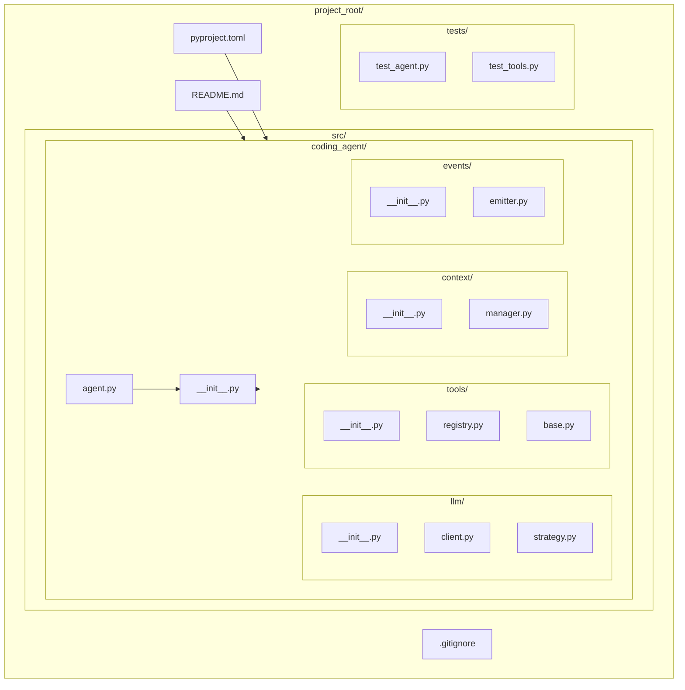

# Day 1, Tutorial 8: Project Structure - Organizing Multi-Module Python

**Course:** Build Your Own Coding Agent  
**Day:** 1  
**Tutorial:** 8 of 288  
**Estimated Time:** 40 minutes

---

## 🎯 What You'll Learn

By the end of this tutorial, you'll:
- Understand the standard Python package structure
- Organize our agent code into proper modules
- Set up Poetry for dependency management
- Create proper `__init__.py` files and `__all__` exports
- Configure imports using absolute and relative imports
- Build a production-ready project layout

---

## 📂 Why Project Structure Matters

In Tutorials 4-7, we created single-file agents (`agent_v0.py` through `agent_v3.py`). While great for learning, real projects need:

1. **Modularity** - Split code into logical modules
2. **Reusability** - Import specific parts without loading everything
3. **Testability** - Test individual modules in isolation
4. **Maintainability** - Find and fix bugs easily
5. **Collaboration** - Multiple developers can work on different modules
6. **Packaging** - Publish to PyPI for others to use

Think of it like a kitchen:
- **Single file** = One person cooking everything in one pot
- **Proper structure** = Specialized stations (prep, grill, sauté) with clear organization

---

## 🎯 The Goal: Our Agent Package Structure

By the end of this tutorial, our project will look like this:



---

## 🧩 Understanding Python Package Structure

### What is a Package vs Module?

| Term | Definition | Example |
|------|------------|---------|
| **Module** | A single `.py` file | `agent.py` |
| **Package** | A directory with `__init__.py` | `llm/` folder |
| **Sub-package** | Package inside a package | `llm/providers/` |

### The `__init__.py` Magic

Every package needs an `__init__.py` file. It:
- Makes Python treat the directory as a package
- Runs when you `import coding_agent`
- Controls what gets exported via `__all__`

```python
# coding_agent/__init__.py
"""Coding Agent - AI-powered coding assistant."""

# Version info
__version__ = "0.3.0"

# Main exports - what gets imported with "from coding_agent import *"
__all__ = [
    "Agent",
    "LLMClient",
    "ToolRegistry",
]

# Import main classes for convenient access
from coding_agent.agent import Agent
from coding_agent.llm.client import LLMClient
from coding_agent.tools.registry import ToolRegistry
```

---

## 🛠️ Prerequisites: Install Poetry

Before we start, you need Poetry installed. Choose your OS:

### macOS / Linux
```bash
# Install via official installer
curl -sSL https://install.python-poetry.org | python3 -

# Add to PATH (add this to your ~/.zshrc or ~/.bashrc)
export PATH="$HOME/.local/bin:$PATH"

# Verify installation
poetry --version
```

### Windows
```powershell
# In PowerShell
(Invoke-WebRequest -Uri https://install.python-poetry.org -UseBasicParsing).Content | py -

# Add to PATH (Poetry is installed in %APPDATA%\Python\Scripts)
# Then verify:
poetry --version
```

### Using Homebrew (macOS)
```bash
brew install poetry
poetry --version
```

---

## 🛠️ Let's Build the Structure

### Step 0: Create README.md (Required by Poetry)

Poetry requires a `README.md` file. Create it now:

```bash
# In your project root (same level as where pyproject.toml will be)
cat > README.md << 'EOF'
# Coding Agent

An AI-powered coding assistant - build your own like Claude Code.

## Quick Start

```bash
# Install dependencies
poetry install

# Run the agent
poetry run python -m coding_agent.agent
```

## Project Structure

- `src/coding_agent/` - Main package
  - `llm/` - LLM provider abstractions
  - `tools/` - Tool implementations
  - `context/` - Conversation management
  - `events/` - Event system (Observer pattern)

## Design Patterns Used

This project demonstrates:
- **Strategy Pattern** - Swappable LLM providers
- **Command Pattern** - Tool execution tracking
- **Observer Pattern** - Event-driven notifications

See Tutorial 7 for pattern details.
EOF
```

### Step 1: Create the Directory Tree

```bash
# Create the project structure
mkdir -p src/coding_agent/{llm,tools,context,events}
mkdir -p tests/{unit,integration}
mkdir -p scripts

# Create __init__.py files for each package
touch src/coding_agent/__init__.py
touch src/coding_agent/llm/__init__.py
touch src/coding_agent/tools/__init__.py
touch src/coding_agent/context/__init__.py
touch src/coding_agent/events/__init__.py
touch tests/__init__.py
touch tests/unit/__init__.py
touch tests/integration/__init__.py
```

### Step 2: Set Up Poetry

Poetry is Python's modern dependency manager. It replaces `requirements.txt` with `pyproject.toml`:

```bash
# Initialize Poetry (run in project root)
cd coding-agent
poetry init
```

This creates `pyproject.toml`. Let's customize it:

```toml
[tool.poetry]
name = "coding-agent"
version = "0.3.0"
description = "An AI-powered coding assistant - build your own like Claude Code"
authors = ["Your Name <your@email.com>"]
readme = "README.md"
packages = [{include = "coding_agent", from = "src"}]

[tool.poetry.dependencies]
python = "^3.10"
dataclasses = {version = "^3.10", python = "<3.10"}

[tool.poetry.group.dev.dependencies]
pytest = "^7.4"
pytest-cov = "^4.1"
black = "^23.0"
ruff = "^0.1"

[tool.poetry.scripts]
coding-agent = "coding_agent.agent:main"

[build-system]
requires = ["poetry-core"]
build-backend = "poetry.core.masonry.api"
```

#### Understanding `pyproject.toml` Sections

Here's what each section does:

| Section | Purpose | Example |
|---------|---------|---------|
| `[tool.poetry]` | Package metadata | name, version, description, author |
| `[tool.poetry.dependencies]` | Runtime dependencies | python="^3.10" - what users need to run |
| `[tool.poetry.group.dev.dependencies]` | Dev-only dependencies | pytest, black - only for development |
| `[tool.poetry.scripts]` | CLI commands | `coding-agent` command runs agent.py:main |
| `[build-system]` | How to build package | poetry-core handles packaging |

**Key points:**
- `^3.10` means "3.10 or higher, but less than 4.0"
- `packages = [{include = "coding_agent", from = "src"}]` tells Poetry to look in `src/` not root
- Dev dependencies aren't installed for end users (only developers)

### Step 3: Run `poetry install`

Now install the package:

```bash
# Install dependencies and your package
poetry install

# This creates:
# - poetry.lock (pinned versions, commit this!)
# - Virtual environment with dependencies

# Verify it worked
poetry run python -c "from coding_agent import Agent; print('Import successful!')"
```

### Step 4: Move Code to Modules

Now let's move our `agent_v3.py` code into proper modules:

> **Note:** The code below **IS** the Strategy, Command, and Observer patterns from Tutorial 7! We're not rewriting them - we're organizing the **same code** into separate files. Each module contains:
> - `llm/` → Strategy pattern for LLM providers (Claude, OpenAI, Ollama)
> - `tools/` → Command pattern base and registry
> - `events/` → Observer pattern for event system
> - `agent.py` → Integrates all three patterns

The structure changes, but the logic remains identical to Tutorial 7.

#### The LLM Module

```python
# src/coding_agent/llm/strategy.py
"""LLM Strategy Pattern - Swappable providers."""

from abc import ABC, abstractmethod
from typing import Optional
import os


class LLMStrategy(ABC):
    """Abstract base for all LLM providers."""
    
    @property
    @abstractmethod
    def name(self) -> str:
        """Provider name for display."""
        pass
    
    @abstractmethod
    def complete(self, prompt: str, **kwargs) -> str:
        """Generate completion from prompt."""
        pass
    
    @property
    def max_tokens(self) -> int:
        """Default max tokens. Override per provider."""
        return 4096


class ClaudeStrategy(LLMStrategy):
    """Anthropic Claude via API."""
    
    def __init__(
        self, 
        api_key: Optional[str] = None, 
        model: str = "claude-3-sonnet-20240229"
    ):
        self._api_key = api_key or os.environ.get("ANTHROPIC_API_KEY", "dummy")
        self._model = model
    
    @property
    def name(self) -> str:
        return f"Claude ({self._model})"
    
    def complete(self, prompt: str, **kwargs) -> str:
        # Tutorial 34: Real API call
        return f"[Claude] {prompt[:100]}... (simulated)"


class OpenAIStrategy(LLMStrategy):
    """OpenAI GPT via API."""
    
    def __init__(
        self, 
        api_key: Optional[str] = None, 
        model: str = "gpt-4-turbo"
    ):
        self._api_key = api_key or os.environ.get("OPENAI_API_KEY", "dummy")
        self._model = model
    
    @property
    def name(self) -> str:
        return f"OpenAI ({self._model})"
    
    def complete(self, prompt: str, **kwargs) -> str:
        return f"[GPT] {prompt[:100]}... (simulated)"


class OllamaStrategy(LLMStrategy):
    """Local Ollama LLM."""
    
    def __init__(
        self, 
        model: str = "llama2", 
        base_url: str = "http://localhost:11434"
    ):
        self._model = model
        self._base_url = base_url
    
    @property
    def name(self) -> str:
        return f"Ollama ({self._model})"
    
    @property
    def max_tokens(self) -> int:
        return 2048
    
    def complete(self, prompt: str, **kwargs) -> str:
        return f"[Ollama] {prompt[:100]}... (simulated)"
```

```python
# src/coding_agent/llm/client.py
"""LLM Client - Manages LLM interactions via strategy."""

from typing import Optional
from coding_agent.llm.strategy import LLMStrategy, ClaudeStrategy


class LLMClient:
    """Manages LLM interactions via strategy pattern."""
    
    def __init__(self, strategy: Optional[LLMStrategy] = None):
        self._strategy = strategy or ClaudeStrategy()
    
    @property
    def provider_name(self) -> str:
        return self._strategy.name
    
    def complete(self, prompt: str, **kwargs) -> str:
        return self._strategy.complete(prompt, **kwargs)
    
    def set_strategy(self, strategy: LLMStrategy) -> None:
        """Switch LLM provider at runtime."""
        self._strategy = strategy
```

```python
# src/coding_agent/llm/__init__.py
"""LLM Module - Language model abstractions."""

from coding_agent.llm.strategy import (
    LLMStrategy,
    ClaudeStrategy,
    OpenAIStrategy,
    OllamaStrategy,
)
from coding_agent.llm.client import LLMClient

__all__ = [
    "LLMStrategy",
    "ClaudeStrategy", 
    "OpenAIStrategy",
    "OllamaStrategy",
    "LLMClient",
]
```

#### The Tools Module

```python
# src/coding_agent/tools/base.py
"""Base Tool interface."""

from abc import ABC, abstractmethod
from typing import Optional


class Tool(ABC):
    """Abstract base class for all tools."""
    
    @property
    @abstractmethod
    def name(self) -> str:
        """Tool name for command matching."""
        pass
    
    @property
    @abstractmethod
    def description(self) -> str:
        """Short description for help text."""
        pass
    
    @abstractmethod
    def execute(self, args: str = "") -> str:
        """Execute the tool with optional arguments."""
        pass
```

```python
# src/coding_agent/tools/registry.py
"""Tool Registry - Manages available tools."""

from typing import Dict, List, Optional
from coding_agent.tools.base import Tool


class ToolRegistry:
    """Registry for available tools."""
    
    def __init__(self):
        self._tools: Dict[str, Tool] = {}
    
    def register(self, tool: Tool) -> None:
        """Register a new tool."""
        self._tools[tool.name] = tool
    
    def get(self, name: str) -> Optional[Tool]:
        """Get a tool by name."""
        return self._tools.get(name)
    
    def list_tools(self) -> List[str]:
        """List all registered tool names."""
        return list(self._tools.keys())
    
    def get_help_text(self) -> str:
        """Generate help text for all tools."""
        lines = ["Available commands:"]
        for tool in self._tools.values():
            lines.append(f"  /{tool.name} - {tool.description}")
        return "\n".join(lines)
```

```python
# src/coding_agent/tools/__init__.py
"""Tools Module - File, shell, and code analysis tools."""

from coding_agent.tools.base import Tool
from coding_agent.tools.registry import ToolRegistry

__all__ = ["Tool", "ToolRegistry"]
```

#### The Command Pattern Module

The Command pattern wraps tool execution for tracking and history:

```python
# src/coding_agent/tools/command.py
"""Command Pattern - Tool execution tracking."""

from abc import ABC, abstractmethod
from dataclasses import dataclass, field
from datetime import datetime
from typing import List, Optional, Any, Callable
from coding_agent.tools.base import Tool


@dataclass
class CommandResult:
    """Result of command execution."""
    command_name: str
    success: bool
    output: str
    error: Optional[str] = None
    execution_time_ms: float = 0


class Command(ABC):
    """Abstract command interface."""
    
    @property
    @abstractmethod
    def name(self) -> str:
        pass
    
    @abstractmethod
    def execute(self) -> str:
        pass
    
    @abstractmethod
    def can_execute(self) -> bool:
        pass


class ToolCommand(Command):
    """Wraps tool execution as a command for tracking."""
    
    def __init__(self, tool: Tool, args: str = ""):
        self._tool = tool
        self._args = args
        self._executed = False
        self._execution_time = 0
    
    @property
    def name(self) -> str:
        return f"tool:{self._tool.name}"
    
    def can_execute(self) -> bool:
        return self._tool is not None
    
    def execute(self) -> str:
        start = datetime.now()
        try:
            result = self._tool.execute(self._args)
            self._executed = True
            return result
        except Exception as e:
            return f"Error: {e}"
        finally:
            self._execution_time = (datetime.now() - start).total_seconds() * 1000
    
    @property
    def was_executed(self) -> bool:
        return self._executed
    
    @property
    def execution_time(self) -> float:
        return self._execution_time


class CommandHistory:
    """Tracks command execution history."""
    
    def __init__(self, max_history: int = 100):
        self._history: List[CommandResult] = []
        self._max_history = max_history
        self._listeners: List[Callable[[CommandResult], Any]] = []
    
    def add_result(self, result: CommandResult) -> None:
        """Add a command result to history."""
        self._history.append(result)
        if len(self._history) > self._max_history:
            self._history.pop(0)
        
        # Notify listeners
        for listener in self._listeners:
            listener(result)
    
    def register_listener(self, listener: Callable[[CommandResult], Any]) -> None:
        """Register a callback for command completion."""
        self._listeners.append(listener)
    
    def get_recent(self, count: int = 10) -> List[CommandResult]:
        """Get recent command results."""
        return self._history[-count:]
    
    @property
    def total_commands(self) -> int:
        return len(self._history)
    
    @property
    def success_rate(self) -> float:
        if not self._history:
            return 0.0
        successful = sum(1 for r in self._history if r.success)
        return successful / len(self._history)
```

Update `tools/__init__.py` to include Command pattern:

```python
# src/coding_agent/tools/__init__.py
"""Tools Module - File, shell, and code analysis tools."""

from coding_agent.tools.base import Tool
from coding_agent.tools.registry import ToolRegistry
from coding_agent.tools.command import (
    Command,
    CommandResult,
    ToolCommand,
    CommandHistory,
)

__all__ = [
    "Tool",
    "ToolRegistry",
    "Command",
    "CommandResult",
    "ToolCommand",
    "CommandHistory",
]
```

#### The Events Module

```python
# src/coding_agent/events/emitter.py
"""Event system - Observer pattern implementation."""

from abc import ABC, abstractmethod
from dataclasses import dataclass, field
from datetime import datetime
from typing import Callable, List, Dict, Any


class EventType:
    """Event types emitted by the agent."""
    USER_MESSAGE = "user_message"
    AGENT_RESPONSE = "agent_response"
    TOOL_START = "tool_start"
    TOOL_COMPLETE = "tool_complete"
    TOOL_ERROR = "tool_error"
    LLM_CALL = "llm_call"
    LLM_RESPONSE = "llm_response"
    ERROR = "error"


@dataclass
class AgentEvent:
    """Event emitted by the agent."""
    event_type: str
    timestamp: datetime = field(default_factory=datetime.now)
    data: Dict[str, Any] = field(default_factory=dict)


class AgentObserver(ABC):
    """Abstract observer interface."""
    
    @abstractmethod
    def on_event(self, event: AgentEvent) -> None:
        """Handle an agent event."""
        pass


class LoggingObserver(AgentObserver):
    """Logs events to console."""
    
    def __init__(self, verbose: bool = False):
        self._verbose = verbose
    
    def on_event(self, event: AgentEvent) -> None:
        if self._verbose:
            print(f"  📡 [{event.event_type}] {event.data}")


class EventEmitter:
    """Emits events to registered observers."""
    
    def __init__(self):
        self._observers: List[AgentObserver] = []
    
    def subscribe(self, observer: AgentObserver) -> None:
        """Register an observer."""
        self._observers.append(observer)
    
    def unsubscribe(self, observer: AgentObserver) -> None:
        """Remove an observer."""
        if observer in self._observers:
            self._observers.remove(observer)
    
    def emit(self, event_type: str, data: Dict[str, Any] = None) -> None:
        """Emit an event to all observers."""
        event = AgentEvent(
            event_type=event_type,
            timestamp=datetime.now(),
            data=data or {}
        )
        
        for observer in self._observers:
            try:
                observer.on_event(event)
            except Exception as e:
                # Don't let observer errors break the agent
                print(f"Observer error: {e}")
```

```python
# src/coding_agent/events/__init__.py
"""Events Module - Observer pattern for agent notifications."""

from coding_agent.events.emitter import (
    EventType,
    AgentEvent,
    AgentObserver,
    LoggingObserver,
    EventEmitter,
)

__all__ = [
    "EventType",
    "AgentEvent", 
    "AgentObserver",
    "LoggingObserver",
    "EventEmitter",
]
```

#### The Context Module

```python
# src/coding_agent/context/manager.py
"""Conversation and context management."""

from dataclasses import dataclass, field
from datetime import datetime
from typing import List, Optional


@dataclass
class Message:
    """A single message in the conversation."""
    role: str  # "user", "assistant", or "system"
    content: str
    timestamp: datetime = field(default_factory=datetime.now)


class ConversationManager:
    """Manages conversation history."""
    
    def __init__(self, max_messages: int = 100):
        self._messages: List[Message] = []
        self._max_messages = max_messages
    
    def add_message(self, role: str, content: str) -> None:
        """Add a message to the conversation."""
        self._messages.append(Message(role=role, content=content))
        
        # Trim old messages if needed
        if len(self._messages) > self._max_messages:
            self._messages = self._messages[-self._max_messages:]
    
    def get_history(self) -> List[Message]:
        """Get conversation history."""
        return self._messages.copy()
    
    def format_history(self) -> str:
        """Format history for display."""
        if not self._messages:
            return "(No messages yet)"
        
        lines = []
        for msg in self._messages:
            role_label = msg.role.upper()
            lines.append(f"[{role_label}] {msg.content}")
        return "\n".join(lines)
    
    def clear(self) -> None:
        """Clear all messages."""
        self._messages.clear()
    
    @property
    def message_count(self) -> int:
        """Get number of messages."""
        return len(self._messages)
```

```python
# src/coding_agent/context/__init__.py
"""Context Module - Conversation and state management."""

from coding_agent.context.manager import ConversationManager, Message

__all__ = ["ConversationManager", "Message"]
```

#### The Main Agent

```python
# src/coding_agent/agent.py
"""Main Agent - Integrates all components."""

from typing import Optional
from dataclasses import dataclass

# Import from submodules
from coding_agent.llm import LLMClient, ClaudeStrategy, LLMStrategy
from coding_agent.tools import (
    ToolRegistry, Tool,
    Command, CommandResult, ToolCommand, CommandHistory
)
from coding_agent.context import ConversationManager
from coding_agent.events import EventEmitter, EventType, LoggingObserver


# Built-in tools
class HelpTool(Tool):
    """Show available commands."""
    
    def __init__(self, registry: ToolRegistry):
        self._registry = registry
    
    @property
    def name(self) -> str:
        return "help"
    
    @property
    def description(self) -> str:
        return "Show available commands"
    
    def execute(self, args: str = "") -> str:
        return self._registry.get_help_text()


class TimeTool(Tool):
    """Show current time."""
    
    @property
    def name(self) -> str:
        return "time"
    
    @property
    def description(self) -> str:
        return "Show current time"
    
    def execute(self, args: str = "") -> str:
        from datetime import datetime
        now = datetime.now()
        return f"Current time: {now.strftime('%Y-%m-%d %H:%M:%S')}"


class HistoryTool(Tool):
    """Show conversation history."""
    
    def __init__(self, conversation: ConversationManager):
        self._conversation = conversation
    
    @property
    def name(self) -> str:
        return "history"
    
    @property
    def description(self) -> str:
        return "Show conversation history"
    
    def execute(self, args: str = "") -> str:
        return self._conversation.format_history()


class ClearTool(Tool):
    """Clear conversation history."""
    
    def __init__(self, conversation: ConversationManager):
        self._conversation = conversation
    
    @property
    def name(self) -> str:
        return "clear"
    
    @property
    def description(self) -> str:
        return "Clear conversation history"
    
    def execute(self, args: str = "") -> str:
        self._conversation.clear()
        return "Conversation cleared."


class Agent:
    """
    Main Agent class - the brain of our coding assistant.
    
    Integrates:
    - LLM client (with Strategy pattern)
    - Tool registry (with Command pattern)
    - Conversation manager (context)
    - Event emitter (Observer pattern)
    """
    
    def __init__(self, llm_strategy: Optional[LLMStrategy] = None):
        # LLM with Strategy pattern
        self._llm = LLMClient(llm_strategy or ClaudeStrategy())
        
        # Observer pattern for events
        self._events = EventEmitter()
        self._events.subscribe(LoggingObserver(verbose=False))
        
        # Conversation management
        self._conversation = ConversationManager()
        
        # Tools with registry
        self._tools = ToolRegistry()
        self._setup_tools()
        
        # Command history (Command pattern)
        self._command_history = CommandHistory()
    
    def _setup_tools(self) -> None:
        """Register built-in tools."""
        self._tools.register(HelpTool(self._tools))
        self._tools.register(TimeTool())
        self._tools.register(HistoryTool(self._conversation))
        self._tools.register(ClearTool(self._conversation))
    
    def subscribe(self, observer) -> None:
        """Add an event observer."""
        self._events.subscribe(observer)
    
    @property
    def llm_provider(self) -> str:
        """Get current LLM provider name."""
        return self._llm.provider_name
    
    def set_llm_provider(self, strategy: LLMStrategy) -> None:
        """Switch LLM provider at runtime."""
        self._llm.set_strategy(strategy)
    
    def run(self, user_input: str) -> str:
        """Process user input and return response."""
        # Store user message
        self._conversation.add_message("user", user_input)
        self._events.emit(EventType.USER_MESSAGE, {"content": user_input})
        
        # Handle commands vs LLM
        if user_input.startswith("/"):
            response = self._handle_command(user_input)
        else:
            response = self._handle_llm(user_input)
        
        # Store and emit response
        self._conversation.add_message("assistant", response)
        self._events.emit(EventType.AGENT_RESPONSE, {"response": response[:100]})
        
        return response
    
    def _handle_command(self, command: str) -> str:
        """Handle slash commands using Command pattern."""
        parts = command.split(maxsplit=1)
        cmd_name = parts[0][1:]  # Remove /
        args = parts[1] if len(parts) > 1 else ""
        
        tool = self._tools.get(cmd_name)
        if not tool:
            return f"Unknown command: /{cmd_name}"
        
        # Command pattern: Wrap tool in command for tracking
        tool_cmd = ToolCommand(tool, args)
        
        if not tool_cmd.can_execute():
            return f"Cannot execute: /{cmd_name}"
        
        self._events.emit(EventType.TOOL_START, {"tool": cmd_name})
        
        try:
            # Execute via Command (tracks time, success)
            result = tool_cmd.execute()
            
            # Track in CommandHistory
            self._command_history.add_result(CommandResult(
                command_name=tool_cmd.name,
                success=True,
                output=result,
                execution_time_ms=tool_cmd.execution_time
            ))
            
            self._events.emit(EventType.TOOL_COMPLETE, {"tool": cmd_name})
            return result
            
        except Exception as e:
            # Track failed command
            self._command_history.add_result(CommandResult(
                command_name=tool_cmd.name,
                success=False,
                output="",
                error=str(e),
                execution_time_ms=tool_cmd.execution_time
            ))
            
            self._events.emit(EventType.TOOL_ERROR, {"tool": cmd_name, "error": str(e)})
            return f"Error: {e}"
    
    def _handle_llm(self, prompt: str) -> str:
        """Use LLM to generate response."""
        self._events.emit(EventType.LLM_CALL, {"prompt": prompt[:100]})
        
        # Build context from recent messages
        history = self._conversation.get_history()
        context = "\n".join([f"{m.role}: {m.content}" for m in history[-5:]])
        
        full_prompt = f"Conversation:\n{context}\n\nUser: {prompt}\nAssistant:"
        response = self._llm.complete(full_prompt)
        
        self._events.emit(EventType.LLM_RESPONSE, {"response": response[:100]})
        
        return response


def main():
    """Entry point for CLI usage."""
    print("=" * 60)
    print("Coding Agent - Package Structure Demo")
    print("=" * 60)
    print(f"\nProvider: Claude (simulated)")
    print("Commands: /help, /time, /history, /clear")
    print("Type 'quit' to exit.\n")
    
    agent = Agent()
    
    while True:
        try:
            user_input = input("You: ").strip()
            
            if user_input.lower() in ['quit', 'exit', 'q']:
                print("\nGoodbye!")
                break
            
            if not user_input:
                continue
            
            response = agent.run(user_input)
            print(f"Agent: {response}\n")
            
        except KeyboardInterrupt:
            print("\n\nInterrupted. Goodbye!")
            break


if __name__ == "__main__":
    main()
```

#### The Package Init

```python
# src/coding_agent/__init__.py
"""
Coding Agent - Build your own AI coding assistant

A production-ready coding agent with:
- Strategy pattern for LLM providers (Claude, OpenAI, Ollama)
- Observer pattern for events and notifications
- Extensible tool system
- Conversation context management
"""

from coding_agent.agent import Agent
from coding_agent.llm import LLMClient, LLMStrategy, ClaudeStrategy
from coding_agent.tools import ToolRegistry, Tool
from coding_agent.context import ConversationManager

__version__ = "0.3.0"

__all__ = [
    "Agent",
    "LLMClient",
    "LLMStrategy",
    "ClaudeStrategy",
    "ToolRegistry",
    "Tool",
    "ConversationManager",
]
```

---

## 🧪 Write Tests

Let's add actual test code. Create the test files:

### Test the Tool Registry

```python
# tests/unit/test_tools.py
"""Tests for the tools module."""

import pytest
from coding_agent.tools import ToolRegistry, Tool
from coding_agent.tools.base import Tool


class MockTool(Tool):
    """A simple mock tool for testing."""
    
    @property
    def name(self) -> str:
        return "mock"
    
    @property
    def description(self) -> str:
        return "A mock tool for testing"
    
    def execute(self, args: str = "") -> str:
        return f"Mock executed with: {args}"


class TestToolRegistry:
    """Test cases for ToolRegistry."""
    
    def test_register_tool(self):
        """Tools can be registered and retrieved."""
        registry = ToolRegistry()
        tool = MockTool()
        
        registry.register(tool)
        
        assert registry.get("mock") is tool
    
    def test_get_nonexistent_tool(self):
        """Getting unknown tool returns None."""
        registry = ToolRegistry()
        
        result = registry.get("nonexistent")
        
        assert result is None
    
    def test_list_tools(self):
        """List returns all registered tool names."""
        registry = ToolRegistry()
        registry.register(MockTool())
        
        tools = registry.list_tools()
        
        assert "mock" in tools
        assert len(tools) == 1
    
    def test_help_text_contains_tool(self):
        """Help text includes registered tools."""
        registry = ToolRegistry()
        registry.register(MockTool())
        
        help_text = registry.get_help_text()
        
        assert "mock" in help_text
        assert "A mock tool for testing" in help_text


class TestMockTool:
    """Test cases for the mock tool itself."""
    
    def test_tool_has_name(self):
        """Tool has required name property."""
        tool = MockTool()
        assert tool.name == "mock"
    
    def test_tool_executes(self):
        """Tool execute method works."""
        tool = MockTool()
        
        result = tool.execute("test args")
        
        assert "test args" in result
        assert "Mock executed" in result
```

### Test the LLM Strategy Pattern

```python
# tests/unit/test_llm.py
"""Tests for the LLM module - Strategy pattern."""

import pytest
from coding_agent.llm import (
    LLMClient,
    ClaudeStrategy,
    OpenAIStrategy,
    OllamaStrategy,
)


class TestClaudeStrategy:
    """Test cases for Claude provider."""
    
    def test_claude_has_name(self):
        """Strategy returns correct name."""
        strategy = ClaudeStrategy(api_key="dummy")
        
        assert "Claude" in strategy.name
    
    def test_claude_completes(self):
        """Strategy returns simulated response."""
        strategy = ClaudeStrategy(api_key="dummy")
        
        response = strategy.complete("Hello")
        
        assert "[Claude]" in response
        assert "Hello" in response


class TestLLMClient:
    """Test cases for LLMClient - uses Strategy pattern."""
    
    def test_client_uses_strategy(self):
        """Client uses injected strategy."""
        strategy = ClaudeStrategy(api_key="dummy")
        client = LLMClient(strategy)
        
        assert "Claude" in client.provider_name
    
    def test_client_can_switch_strategy(self):
        """Strategy can be swapped at runtime."""
        client = LLMClient(ClaudeStrategy(api_key="dummy"))
        
        # Switch provider
        client.set_strategy(OpenAIStrategy(api_key="dummy"))
        
        assert "OpenAI" in client.provider_name
    
    def test_client_delegates_complete(self):
        """Client delegates to strategy."""
        strategy = ClaudeStrategy(api_key="dummy")
        client = LLMClient(strategy)
        
        response = client.complete("Test prompt")
        
        # Should contain prompt and Claude tag
        assert "[Claude]" in response
        assert "Test prompt" in response
```

### Test the Event System (Observer Pattern)

```python
# tests/unit/test_events.py
"""Tests for the events module - Observer pattern."""

from coding_agent.events import (
    EventType,
    EventEmitter,
    AgentObserver,
    AgentEvent,
)


class MockObserver(AgentObserver):
    """Captures events for testing."""
    
    def __init__(self):
        self.events = []
    
    def on_event(self, event: AgentEvent) -> None:
        self.events.append(event)


class TestEventEmitter:
    """Test cases for Observer pattern."""
    
    def test_observer_receives_events(self):
        """Subscribed observers receive emitted events."""
        emitter = EventEmitter()
        observer = MockObserver()
        
        emitter.subscribe(observer)
        emitter.emit(EventType.USER_MESSAGE, {"content": "Hello"})
        
        assert len(observer.events) == 1
        assert observer.events[0].event_type == EventType.USER_MESSAGE
    
    def test_multiple_observers(self):
        """Multiple observers all receive events."""
        emitter = EventEmitter()
        obs1 = MockObserver()
        obs2 = MockObserver()
        
        emitter.subscribe(obs1)
        emitter.subscribe(obs2)
        emitter.emit(EventType.TOOL_START, {"tool": "test"})
        
        assert len(obs1.events) == 1
        assert len(obs2.events) == 1
    
    def test_unsubscribe_removes_observer(self):
        """Unsubscribed observers don't receive events."""
        emitter = EventEmitter()
        observer = MockObserver()
        
        emitter.subscribe(observer)
        emitter.unsubscribe(observer)
        emitter.emit(EventType.TOOL_COMPLETE, {})
        
        assert len(observer.events) == 0
```

### Test the Agent (Integration)

```python
# tests/integration/test_agent.py
"""Integration tests for the full Agent."""

from coding_agent import Agent
from coding_agent.llm import ClaudeStrategy


class TestAgent:
    """Integration tests for Agent."""
    
    def test_agent_creation(self):
        """Agent can be created with default strategy."""
        agent = Agent()
        
        assert agent.llm_provider is not None
    
    def test_agent_runs_command(self):
        """Agent can execute built-in commands."""
        agent = Agent()
        
        response = agent.run("/help")
        
        assert "Available commands" in response
    
    def test_agent_handles_unknown_command(self):
        """Unknown commands return error."""
        agent = Agent()
        
        response = agent.run("/nonexistent")
        
        assert "Unknown command" in response
    
    def test_agent_runs_llm(self):
        """Agent can use LLM for non-commands."""
        agent = Agent(ClaudeStrategy())
        
        response = agent.run("Hello")
        
        # Should get simulated Claude response
        assert "[Claude]" in response
    
    def test_conversation_history_tracked(self):
        """Agent tracks conversation history."""
        agent = Agent()
        
        agent.run("Hello")
        agent.run("/history")
        
        # History should include the message
        response = agent.run("/history")
        assert "Hello" in response
```

### Run the Tests

```bash
# Run all tests
poetry run pytest

# Run with coverage
poetry run pytest --cov=coding_agent

# Run specific test file
poetry run pytest tests/unit/test_tools.py

# Run with verbose output
poetry run pytest -v
```

---

## 🧪 Test the Package

### Option 1: Run as Module

```bash
# Install the package in development mode
poetry install

# Run the agent
poetry run python -m coding_agent.agent
```

### Option 2: Import in Python

```python
# test_imports.py
from coding_agent import Agent
from coding_agent.llm import ClaudeStrategy, OpenAIStrategy, OllamaStrategy
from coding_agent.tools import ToolRegistry
from coding_agent.context import ConversationManager

# Create an agent
agent = Agent(ClaudeStrategy())

# Use it
response = agent.run("Hello!")
print(response)

# Switch provider
agent.set_llm_provider(OpenAIStrategy())
response = agent.run("What can you do?")
print(response)
```

---

## 🎯 Exercise: Add a New Tool to the Package

**Task:** Create a new tool `EchoTool` that echoes back the input with formatting.

**Steps:**
1. Create `src/coding_agent/tools/echo.py`
2. Import it in `src/coding_agent/tools/__init__.py`
3. Register it in `Agent._setup_tools()`

**Solution:**

```python
# src/coding_agent/tools/echo.py
"""Echo tool - echoes input with formatting."""

from coding_agent.tools.base import Tool


class EchoTool(Tool):
    """Echo back the input with formatting."""
    
    @property
    def name(self) -> str:
        return "echo"
    
    @property
    def description(self) -> str:
        return "Echo input with formatting"
    
    def execute(self, args: str = "") -> str:
        if not args:
            return "Usage: /echo <message>"
        return f"📢 Echo: {args}"
```

Update `tools/__init__.py`:
```python
from coding_agent.tools.base import Tool
from coding_agent.tools.registry import ToolRegistry
from coding_agent.tools.echo import EchoTool

__all__ = ["Tool", "ToolRegistry", "EchoTool"]
```

---

## 🐛 Common Pitfalls

### 1. Circular Imports

**Problem:**
```python
# agent.py imports from tools
from coding_agent.tools import ToolRegistry

# tools/__init__.py imports from agent
from coding_agent.agent import Agent  # CIRCULAR!
```

**Solution:** Use late imports or restructure:
```python
# Option: Import in function, not at module level
def some_method(self):
    from coding_agent.agent import Agent  # Late import
```

### 2. Missing `__init__.py`

**Problem:**
```
src/coding_agent/
  agent.py  # No __init__.py!
```

**Solution:** Always create `__init__.py` in every package directory.

### 3. Wrong Import Paths

**Problem:**
```python
# From coding_agent/agent.py
from llm import LLMClient  # WRONG - relative to file location
```

**Solution:** Use full package paths:
```python
from coding_agent.llm import LLMClient  # CORRECT - from package root
```

### 4. Forgetting to Export in `__all__`

**Problem:**
```python
# User can't do: from coding_agent import MyClass
class MyClass:
    pass
# Not in __all__!
```

**Solution:** Always define `__all__` and include new classes.

### 5. Poetry Path Issues

**Problem:**
```
ModuleNotFoundError: No module named 'coding_agent'
```

**Solution:** Ensure `pyproject.toml` has correct package config:
```toml
[tool.poetry]
packages = [{include = "coding_agent", from = "src"}]
```

---

## 📝 Key Takeaways

- ✅ **Package structure** enables modular, maintainable code
- ✅ **`__init__.py`** makes directories into Python packages
- ✅ **`__all__`** controls what's exported on `from package import *`
- ✅ **Poetry** manages dependencies and packaging
- ✅ **Absolute imports** from package root avoid confusion
- ✅ **Module organization** separates concerns (LLM, tools, context, events)
- ✅ **Testing** benefits from isolated modules

---

## 🎯 Next Tutorial

In **Tutorial 9**, we'll set up the complete **development environment** - installing Python, configuring IDE (VS Code), setting up git, and configuring API keys for Claude/OpenAI.

---

## ✅ Commit Your Work

```bash
# Stage the new structure
git add src/
git add pyproject.toml
git add poetry.lock  # After poetry install

# Commit
git commit -m "Tutorial 8: Set up proper Python package structure

- Create multi-module package under src/coding_agent/
- Separate llm, tools, context, events modules
- Add __init__.py with proper exports
- Configure Poetry for dependency management
- Add built-in tools: help, time, history, clear"

git push origin main
```

**Your agent is now a proper Python package!** 🎉

---

*This is tutorial 8/24 for Day 1. The foundation is professional-grade!*