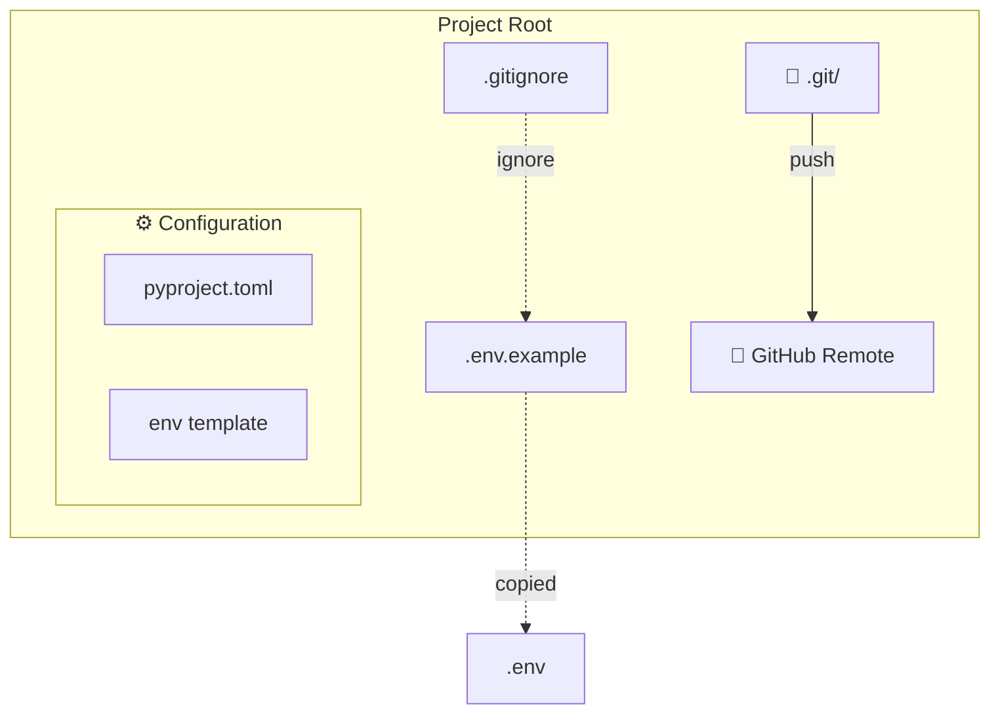

# Day 1, Tutorial 9: Setting Up the Project - Git, Environment & API Keys

**Course:** Build Your Own Coding Agent  
**Day:** 1  
**Tutorial:** 9 of 288  
**Estimated Time:** 45 minutes

---

## 🎯 What You'll Learn

By the end of this tutorial, you'll:
- Initialize a git repository with proper .gitignore
- Create a GitHub remote and push your code
- Set up environment variables with .env files
- Configure API keys for Claude, OpenAI, and Ollama
- Understand the difference between development and production environments
- Create a robust configuration system for your agent

---

## 📂 Why Environment & Git Setup Matters

In Tutorial 8, we built a beautiful package structure. But a real project needs:

1. **Version Control** - Track changes, collaborate, backup
2. **Secret Management** - Keep API keys safe (never commit them!)
3. **Environment Configuration** - Different settings for dev/prod
4. **Reproducibility** - Anyone can clone and run your code

Think of it like building a house:
- **Tutorial 8** = Blueprints and materials
- **Tutorial 9** = Foundation, utilities, and permits

Skip this, and you'll have a beautiful house with no water electricity!

---

## 🎯 The Goal: Fully Configured Project

By the end of this tutorial, our project will have:



---

## 🧩 Understanding Environment Configuration

### What Are Environment Variables?

Environment variables are dynamic values that your operating system provides to programs. They're perfect for:

| Use Case | Example |
|----------|---------|
| API Keys | `ANTHROPIC_API_KEY=sk-...` |
| Configuration | `LOG_LEVEL=DEBUG` |
| Paths | `HOME=/Users/rajat` |
| Features | `DEBUG=true` |

### Why Not Hardcode?

```python
# ❌ BAD - Never do this!
api_key = "sk-ant-api03-xxxxx"  # Exposed in source!

# ✅ GOOD - Use environment!
api_key = os.environ.get("ANTHROPIC_API_KEY")
```

### The .env Pattern

```
.env           # Your secrets (NEVER commit this)
.env.example   # Template for others (SAFE to commit)
.gitignore    # Block .env from git
```

---

## 🛠️ Let's Build It

### Step 1: Initialize Git Repository

If you haven't already, let's set up git for our project:

```bash
# Navigate to your project
cd ~/build-coding-agent

# Initialize git repository
git init

# Create initial commit with empty structure
git add .
git commit -m "Initial commit: project skeleton"

# Check status
git status
```

### Step 2: Create Proper .gitignore

Create a comprehensive `.gitignore` that protects secrets:

```bash
# Create .gitignore
touch .gitignore
```

Now fill it with essential patterns:

```gitignore
# ===========================================
# Environment & Secrets (MOST IMPORTANT!)
# ===========================================
.env
.env.local
.env.*.local
*.env

# Python
__pycache__/
*.py[cod]
*$py.class
*.so
.Python
build/
develop-eggs/
dist/
downloads/
eggs/
.eggs/
lib/
lib64/
parts/
sdist/
var/
wheels/
*.egg-info/
.installed.cfg
*.egg

# Virtual environments
venv/
ENV/
env/
.venv/

# IDE
.idea/
.vscode/
*.swp
*.swo
*~
.DS_Store

# Testing
.pytest_cache/
.coverage
htmlcov/
.tox/

# Poetry
poetry.lock  # Optional: commit if you want exact reproducibility

# Logs
*.log
logs/

# OS
.DS_Store
Thumbs.db
```

### Step 3: Create .env.example Template

This shows developers what environment variables are needed WITHOUT exposing secrets:

```bash
# Create .env.example
touch .env.example
```

Fill it with all possible configuration options:

```bash
# .env.example - Copy this to .env and fill in your values
# ========================================================

# ===========================================
# LLM API Keys (get from respective dashboards)
# ===========================================

# Anthropic Claude - https://console.anthropic.com/
# ANTHROPIC_API_KEY=sk-ant-

# OpenAI - https://platform.openai.com/api-keys
# OPENAI_API_KEY=sk-

# Google Gemini - https://aistudio.google.com/app/apikey
# GOOGLE_API_KEY=AIza...

# ===========================================
# LLM Configuration
# ===========================================

# Which LLM to use by default (claude, openai, ollama)
DEFAULT_LLM_PROVIDER=claude

# Model choices
CLAUDE_MODEL=claude-3-5-sonnet-20241022
OPENAI_MODEL=gpt-4o
OLLAMA_MODEL=llama3.2

# ===========================================
# Agent Configuration
# ===========================================

# Logging level: DEBUG, INFO, WARNING, ERROR
LOG_LEVEL=INFO

# Maximum tokens for responses
MAX_TOKENS=4096

# Temperature (0.0 = deterministic, 1.0 = creative)
TEMPERATURE=0.7

# Enable verbose event logging
VERBOSE_EVENTS=false

# ===========================================
# Tool Configuration
# ===========================================

# Allowed directories for file operations
ALLOWED_DIRECTORIES=.

# Shell command timeout (seconds)
SHELL_TIMEOUT=30

# Enable read-only mode (no file writes)
READ_ONLY=false

# ===========================================
# Development Settings
# ===========================================

# Use mock LLM responses (for testing without API)
MOCK_LLM=false

# Debug mode
DEBUG=false
```

### Step 4: Get API Keys

Let's walk through getting the major LLM provider API keys:

#### Anthropic Claude (Recommended)

1. Go to https://console.anthropic.com/
2. Sign up or log in
3. Navigate to "API Keys" in the sidebar
4. Click "Create Key"
5. Copy the key (starts with `sk-ant-`)
6. **⚠️ This only shows once! Save it somewhere safe**

#### OpenAI GPT

1. Go to https://platform.openai.com/api-keys
2. Click "Create new secret key"
3. Give it a name (e.g., "coding-agent")
4. Copy the key (starts with `sk-`)
5. **⚠️ This only shows once!**

#### Ollama (Local, Free)

Ollama doesn't need an API key - it runs locally:

1. Install: https://ollama.com/download
2. Pull a model: `ollama pull llama3.2`
3. Start server: `ollama serve`

No API key needed!

### Step 5: Create Your .env File

```bash
# Copy the example
cp .env.example .env

# Edit with your actual keys
nano .env  # or use your favorite editor
```

Fill in at least one API key:

```bash
# My .env file (example)
ANTHROPIC_API_KEY=sk-ant-api03-xxxxxxxxxxxxx
DEFAULT_LLM_PROVIDER=claude
LOG_LEVEL=INFO
```

### Step 6: Create Configuration Module

Let's create a robust configuration system that loads from environment variables:

```python
# src/coding_agent/config.py
"""Configuration management - Load settings from environment variables."""

import os
from dataclasses import dataclass, field
from typing import Optional, List
from pathlib import Path


@dataclass
class LLMConfig:
    """LLM provider configuration."""
    
    # Provider choice
    default_provider: str = "claude"
    
    # Model names
    claude_model: str = "claude-3-5-sonnet-20241022"
    openai_model: str = "gpt-4o"
    ollama_model: str = "llama3.2"
    
    # Generation parameters
    temperature: float = 0.7
    max_tokens: int = 4096
    top_p: float = 0.9
    
    # API Keys (loaded from environment)
    @property
    def anthropic_api_key(self) -> Optional[str]:
        return os.environ.get("ANTHROPIC_API_KEY")
    
    @property
    def openai_api_key(self) -> Optional[str]:
        return os.environ.get("OPENAI_API_KEY")
    
    @property
    def google_api_key(self) -> Optional[str]:
        return os.environ.get("GOOGLE_API_KEY")
    
    @property
    def has_anthropic_key(self) -> bool:
        return bool(self.anthropic_api_key and not self.anthropic_api_key.startswith("sk-ant-"))
    
    @property
    def has_openai_key(self) -> bool:
        return bool(self.openai_api_key and not self.openai_api_key.startswith("sk-"))
    
    @property
    def available_providers(self) -> List[str]:
        """List providers with valid API keys."""
        providers = []
        if self.has_anthropic_key:
            providers.append("claude")
        if self.has_openai_key:
            providers.append("openai")
        # Ollama is always available if running
        providers.append("ollama")
        return providers


@dataclass
class ToolConfig:
    """Tool configuration."""
    
    # Directories
    allowed_directories: List[str] = field(default_factory=lambda: ["."])
    
    # Safety
    read_only: bool = False
    shell_timeout: int = 30
    allow_destructive: bool = False
    
    # Command whitelist (empty = allow all)
    allowed_commands: List[str] = field(default_factory=list)
    blocked_commands: List[str] = field(default_factory=lambda: ["rm -rf /", "mkfs"])


@dataclass
class LoggingConfig:
    """Logging configuration."""
    
    level: str = "INFO"
    verbose_events: bool = False
    log_file: Optional[str] = None


@dataclass
class AgentConfig:
    """Main agent configuration."""
    
    llm: LLMConfig = field(default_factory=LLMConfig)
    tools: ToolConfig = field(default_factory=ToolConfig)
    logging: LoggingConfig = field(default_factory=LoggingConfig)
    
    # Development flags
    mock_llm: bool = False
    debug: bool = False
    
    @classmethod
    def from_environment(cls) -> "AgentConfig":
        """Create configuration from environment variables."""
        
        # LLM Config
        llm_config = LLMConfig(
            default_provider=os.environ.get("DEFAULT_LLM_PROVIDER", "claude"),
            claude_model=os.environ.get("CLAUDE_MODEL", "claude-3-5-sonnet-20241022"),
            openai_model=os.environ.get("OPENAI_MODEL", "gpt-4o"),
            ollama_model=os.environ.get("OLLAMA_MODEL", "llama3.2"),
            temperature=float(os.environ.get("TEMPERATURE", "0.7")),
            max_tokens=int(os.environ.get("MAX_TOKENS", "4096")),
            top_p=float(os.environ.get("TOP_P", "0.9")),
        )
        
        # Tools Config
        allowed_dirs = os.environ.get("ALLOWED_DIRECTORIES", ".").split(",")
        tool_config = ToolConfig(
            allowed_directories=allowed_dirs,
            read_only=os.environ.get("READ_ONLY", "false").lower() == "true",
            shell_timeout=int(os.environ.get("SHELL_TIMEOUT", "30")),
            allow_destructive=os.environ.get("ALLOW_DESTRUCTIVE", "false").lower() == "true",
        )
        
        # Logging Config
        log_level = os.environ.get("LOG_LEVEL", "INFO").upper()
        logging_config = LoggingConfig(
            level=log_level,
            verbose_events=os.environ.get("VERBOSE_EVENTS", "false").lower() == "true",
            log_file=os.environ.get("LOG_FILE"),
        )
        
        # Main Config
        return cls(
            llm=llm_config,
            tools=tool_config,
            logging=logging_config,
            mock_llm=os.environ.get("MOCK_LLM", "false").lower() == "true",
            debug=os.environ.get("DEBUG", "false").lower() == "true",
        )
    
    def validate(self) -> List[str]:
        """Validate configuration and return list of issues."""
        issues = []
        
        # Check for API keys
        if self.llm.default_provider == "claude" and not self.llm.has_anthropic_key:
            issues.append("ANTHROPIC_API_KEY not set (set DEFAULT_LLM_PROVIDER=ollama to skip)")
        
        if self.llm.default_provider == "openai" and not self.llm.has_openai_key:
            issues.append("OPENAI_API_KEY not set (set DEFAULT_LLM_PROVIDER=ollama to skip)")
        
        # Validate log level
        valid_levels = ["DEBUG", "INFO", "WARNING", "ERROR"]
        if self.logging.level not in valid_levels:
            issues.append(f"LOG_LEVEL must be one of {valid_levels}")
        
        return issues


# Global config instance
_config: Optional[AgentConfig] = None


def get_config() -> AgentConfig:
    """Get the global configuration instance (singleton)."""
    global _config
    if _config is None:
        _config = AgentConfig.from_environment()
    return _config


def reset_config() -> AgentConfig:
    """Reset and reload configuration."""
    global _config
    _config = AgentConfig.from_environment()
    return _config
```

### Step 7: Update the Agent to Use Configuration

Now let's update our Agent to use the new configuration system:

```python
# src/coding_agent/agent.py (updated)
"""Main Agent - Integrates all components with configuration."""

from typing import Optional
from dataclasses import dataclass

# Import from submodules
from coding_agent.llm import LLMClient, ClaudeStrategy, OpenAIStrategy, OllamaStrategy, LLMStrategy
from coding_agent.tools import ToolRegistry, Tool
from coding_agent.context import ConversationManager
from coding_agent.events import EventEmitter, EventType, LoggingObserver
from coding_agent.config import get_config


# Built-in tools
class HelpTool(Tool):
    """Show available commands."""
    
    def __init__(self, registry: ToolRegistry):
        self._registry = registry
    
    @property
    def name(self) -> str:
        return "help"
    
    @property
    def description(self) -> str:
        return "Show available commands"
    
    def execute(self, args: str = "") -> str:
        return self._registry.get_help_text()


class ConfigTool(Tool):
    """Show configuration status."""
    
    @property
    def name(self) -> str:
        return "config"
    
    @property
    def description(self) -> str:
        return "Show current configuration"
    
    def execute(self, args: str = "") -> str:
        config = get_config()
        
        lines = [
            "📋 Configuration:",
            f"  LLM Provider: {config.llm.default_provider}",
            f"  Claude Model: {config.llm.claude_model}",
            f"  OpenAI Model: {config.llm.openai_model}",
            f"  Ollama Model: {config.llm.ollama_model}",
            f"  Temperature: {config.llm.temperature}",
            f"  Max Tokens: {config.llm.max_tokens}",
            f"  Log Level: {config.logging.level}",
            f"  Read Only: {config.tools.read_only}",
            f"  Mock LLM: {config.mock_llm}",
            "",
            "🔑 API Keys:",
            f"  Anthropic: {'✅ Set' if config.llm.has_anthropic_key else '❌ Not set'}",
            f"  OpenAI: {'✅ Set' if config.llm.has_openai_key else '❌ Not set'}",
        ]
        
        # Check for issues
        issues = config.validate()
        if issues:
            lines.append("")
            lines.append("⚠️  Issues:")
            for issue in issues:
                lines.append(f"    - {issue}")
        
        return "\n".join(lines)


class TimeTool(Tool):
    """Show current time."""
    
    @property
    def name(self) -> str:
        return "time"
    
    @property
    def description(self) -> str:
        return "Show current time"
    
    def execute(self, args: str = "") -> str:
        from datetime import datetime
        now = datetime.now()
        return f"Current time: {now.strftime('%Y-%m-%d %H:%M:%S')}"


class HistoryTool(Tool):
    """Show conversation history."""
    
    def __init__(self, conversation: ConversationManager):
        self._conversation = conversation
    
    @property
    def name(self) -> str:
        return "history"
    
    @property
    def description(self) -> str:
        return "Show conversation history"
    
    def execute(self, args: str = "") -> str:
        return self._conversation.format_history()


class ClearTool(Tool):
    """Clear conversation history."""
    
    def __init__(self, conversation: ConversationManager):
        self._conversation = conversation
    
    @property
    def name(self) -> str:
        return "clear"
    
    @property
    def description(self) -> str:
        return "Clear conversation history"
    
    def execute(self, args: str = "") -> str:
        self._conversation.clear()
        return "Conversation cleared."


@dataclass
class CommandResult:
    """Result of command execution."""
    command_name: str
    success: bool
    output: str
    execution_time_ms: float = 0


class Agent:
    """
    Main Agent class - the brain of our coding assistant.
    
    Integrates:
    - LLM client (with Strategy pattern)
    - Tool registry (with Command pattern)
    - Conversation manager (context)
    - Event emitter (Observer pattern)
    - Configuration system (from environment)
    """
    
    def __init__(self, llm_strategy: Optional[LLMStrategy] = None):
        # Load configuration
        self._config = get_config()
        
        # LLM with Strategy pattern - use provided or get from config
        if llm_strategy is None:
            llm_strategy = self._create_strategy_from_config()
        self._llm = LLMClient(llm_strategy)
        
        # Observer pattern for events
        self._events = EventEmitter()
        verbose = self._config.logging.verbose_events
        self._events.subscribe(LoggingObserver(verbose=verbose))
        
        # Conversation management
        self._conversation = ConversationManager()
        
        # Tools with registry
        self._tools = ToolRegistry()
        self._setup_tools()
        
        # Command history
        self._command_history = []
        
        # Log startup
        self._events.emit(EventType.LLM_CALL, {
            "provider": self._llm.provider_name,
            "model": self._config.llm.default_provider
        })
    
    def _create_strategy_from_config(self) -> LLMStrategy:
        """Create appropriate LLM strategy from configuration."""
        provider = self._config.llm.default_provider.lower()
        
        if provider == "claude" and self._config.llm.has_anthropic_key:
            return ClaudeStrategy(
                api_key=self._config.llm.anthropic_api_key,
                model=self._config.llm.claude_model
            )
        elif provider == "openai" and self._config.llm.has_openai_key:
            return OpenAIStrategy(
                api_key=self._config.llm.openai_api_key,
                model=self._config.llm.openai_model
            )
        elif provider == "ollama":
            return OllamaStrategy(model=self._config.llm.ollama_model)
        else:
            # Fallback to Ollama or mock
            if self._config.mock_llm:
                from coding_agent.llm.mock import MockStrategy
                return MockStrategy()
            # Default to Ollama
            return OllamaStrategy(model=self._config.llm.ollama_model)
    
    def _setup_tools(self) -> None:
        """Register built-in tools."""
        self._tools.register(HelpTool(self._tools))
        self._tools.register(ConfigTool())
        self._tools.register(TimeTool())
        self._tools.register(HistoryTool(self._conversation))
        self._tools.register(ClearTool(self._conversation))
    
    def subscribe(self, observer) -> None:
        """Add an event observer."""
        self._events.subscribe(observer)
    
    @property
    def llm_provider(self) -> str:
        """Get current LLM provider name."""
        return self._llm.provider_name
    
    def set_llm_provider(self, strategy: LLMStrategy) -> None:
        """Switch LLM provider at runtime."""
        self._llm.set_strategy(strategy)
    
    def run(self, user_input: str) -> str:
        """Process user input and return response."""
        # Store user message
        self._conversation.add_message("user", user_input)
        self._events.emit(EventType.USER_MESSAGE, {"content": user_input})
        
        # Handle commands vs LLM
        if user_input.startswith("/"):
            response = self._handle_command(user_input)
        else:
            response = self._handle_llm(user_input)
        
        # Store and emit response
        self._conversation.add_message("assistant", response)
        self._events.emit(EventType.AGENT_RESPONSE, {"response": response[:100]})
        
        return response
    
    def _handle_command(self, command: str) -> str:
        """Handle slash commands."""
        parts = command.split(maxsplit=1)
        cmd_name = parts[0][1:]  # Remove /
        args = parts[1] if len(parts) > 1 else ""
        
        tool = self._tools.get(cmd_name)
        if not tool:
            return f"Unknown command: /{cmd_name}"
        
        self._events.emit(EventType.TOOL_START, {"tool": cmd_name})
        
        try:
            result = tool.execute(args)
            self._events.emit(EventType.TOOL_COMPLETE, {"tool": cmd_name})
            return result
        except Exception as e:
            self._events.emit(EventType.TOOL_ERROR, {"tool": cmd_name, "error": str(e)})
            return f"Error: {e}"
    
    def _handle_llm(self, prompt: str) -> str:
        """Use LLM to generate response."""
        self._events.emit(EventType.LLM_CALL, {"prompt": prompt[:100]})
        
        # Build context from recent messages
        history = self._conversation.get_history()
        context = "\n".join([f"{m.role}: {m.content}" for m in history[-5:]])
        
        full_prompt = f"Conversation:\n{context}\n\nUser: {prompt}\nAssistant:"
        response = self._llm.complete(full_prompt)
        
        self._events.emit(EventType.LLM_RESPONSE, {"response": response[:100]})
        
        return response


def main():
    """Entry point for CLI usage."""
    config = get_config()
    
    print("=" * 60)
    print("Coding Agent - Environment & Git Setup Demo")
    print("=" * 60)
    print(f"\nProvider: {config.llm.default_provider}")
    print(f"Model: {config.llm.claude_model if config.llm.default_provider == 'claude' else config.llm.openai_model}")
    print("Commands: /help, /config, /time, /history, /clear")
    print("Type 'quit' to exit.\n")
    
    agent = Agent()
    
    while True:
        try:
            user_input = input("You: ").strip()
            
            if user_input.lower() in ['quit', 'exit', 'q']:
                print("\nGoodbye!")
                break
            
            if not user_input:
                continue
            
            response = agent.run(user_input)
            print(f"Agent: {response}\n")
            
        except KeyboardInterrupt:
            print("\n\nInterrupted. Goodbye!")
            break


if __name__ == "__main__":
    main()
```

### Step 8: Create a Mock Strategy for Testing

For testing without API calls:

```python
# src/coding_agent/llm/mock.py
"""Mock LLM for testing without API calls."""

from coding_agent.llm.strategy import LLMStrategy


class MockStrategy(LLMStrategy):
    """Mock LLM that returns predefined responses for testing."""
    
    def __init__(self, response: str = "This is a mock response."):
        self._response = response
    
    @property
    def name(self) -> str:
        return "Mock"
    
    @property
    def max_tokens(self) -> int:
        return 100
    
    def complete(self, prompt: str, **kwargs) -> str:
        # Generate contextually relevant mock responses
        prompt_lower = prompt.lower()
        
        if "hello" in prompt_lower or "hi" in prompt_lower:
            return "Hello! I'm your coding assistant. How can I help you today?"
        elif "help" in prompt_lower:
            return "I can help you with coding tasks. Try asking me to write some code, explain a concept, or analyze your project."
        elif "write" in prompt_lower or "code" in prompt_lower:
            return "Here's a simple Python function:\n\n```python\ndef greet(name):\n    return f'Hello, {name}!'\n```"
        else:
            return self._response
```

### Step 9: Create GitHub Repository

```bash
# 1. Create repository on GitHub (via web UI)
# https://github.com/new
# Name: build-coding-agent
# Description: Build your own AI coding assistant like Claude Code
# Make it Public or Private

# 2. Add remote and push
git remote add origin https://github.com/YOUR_USERNAME/build-coding-agent.git

# 3. Push your code
git branch -M main
git push -u origin main
```

### Step 10: Create Helper Scripts

```bash
# scripts/setup.sh - One-time setup
#!/bin/bash
set -e

echo "🚀 Setting up Coding Agent environment..."

# Check Python version
python3 --version

# Install Poetry if needed
if ! command -v poetry &> /dev/null; then
    echo "Installing Poetry..."
    curl -sSL https://install.python-poetry.org | python3 -
fi

# Install dependencies
echo "Installing dependencies..."
poetry install

# Copy environment file if needed
if [ ! -f .env ]; then
    echo "Creating .env from template..."
    cp .env.example .env
    echo "⚠️  Please edit .env and add your API keys!"
fi

# Initialize git if needed
if [ ! -d .git ]; then
    echo "Initializing git..."
    git init
fi

echo "✅ Setup complete! Run 'poetry run python -m coding_agent.agent' to start."
```

```bash
# Make it executable
chmod +x scripts/setup.sh
```

---

## 🧪 Test the Configuration

### Test 1: Check Configuration Loading

```bash
# Set some environment variables
export ANTHROPIC_API_KEY=sk-ant-test123
export DEFAULT_LLM_PROVIDER=claude
export LOG_LEVEL=DEBUG

# Run the agent
poetry run python -m coding_agent.agent
```

### Test 2: Check Configuration Command

```
You: /config
Agent: 📋 Configuration:
  LLM Provider: claude
  Claude Model: claude-3-5-sonnet-20241022
  OpenAI Model: gpt-4o
  Ollama Model: llama3.2
  Temperature: 0.7
  Max Tokens: 4096
  Log Level: INFO
  Read Only: false
  Mock LLM: false

🔑 API Keys:
  ✅ Anthropic: Set
  ❌ OpenAI: Not set
```

### Test 3: Validate Missing Keys

If no API keys are set, you should see:

```
⚠️  Issues:
    - ANTHROPIC_API_KEY not set (set DEFAULT_LLM_PROVIDER=ollama to skip)
```

This is expected! The agent gracefully falls back to Ollama or Mock mode.

---

## 🎯 Exercise: Add a New Configuration Option

**Task:** Add a `session_timeout` configuration option that controls how long the agent waits for user input before timing out.

**Steps:**
1. Add `SESSION_TIMEOUT` to `.env.example`
2. Add `session_timeout` field to `AgentConfig` in `config.py`
3. Load it from environment in `from_environment()`
4. Use it in the main loop

**Solution:**

```python
# In config.py, add to AgentConfig:
session_timeout: int = 300  # 5 minutes default

# In from_environment():
session_timeout=int(os.environ.get("SESSION_TIMEOUT", "300")),

# In agent.py main loop:
import signal

def timeout_handler(signum, frame):
    raise TimeoutError("Session timed out")

# Set timeout
signal.signal(signal.SIGALRM, timeout_handler)
signal.alarm(self._config.session_timeout)
```

---

## 🐛 Common Pitfalls

### 1. Committing Secrets

**Problem:**
```bash
# Accidentally committed .env!
git log --all --full-history -- .env
```

**Solution:** If you accidentally committed secrets:
```bash
# Remove from git but keep locally
git rm --cached .env

# Update .gitignore
echo ".env" >> .gitignore

# Commit the fix
git add .gitignore
git commit -m "Remove secrets from git history"

# ⚠️ This doesn't remove them from GitHub!
# You may need to rotate your API keys.
```

### 2. Wrong Environment Variable Names

**Problem:** Keys not loading
```bash
# In .env
ANTHROPIC_KEY=sk-ant-...  # WRONG name!

# In code
os.environ.get("ANTHROPIC_API_KEY")  # Different name = None
```

**Solution:** Match names exactly between .env and code.

### 3. Poetry Not Finding .env

**Problem:** Environment variables not available when running via Poetry

**Solution:** Use Poetry's dotenv plugin:
```bash
poetry add --group dev python-dotenv

# Create poetry.env in project root
# (Poetry automatically loads this)
```

Or run with explicit env:
```bash
export $(cat .env | xargs) && poetry run python -m coding_agent.agent
```

### 4. Wrong Working Directory

**Problem:** `.env` file not found

**Solution:** Use absolute paths or ensure you're in the right directory:
```python
# In config.py
env_path = Path(__file__).parent.parent.parent / ".env"
# Or use a config.yaml in a standard location like ~/.config/coding-agent/
```

---

## 📝 Key Takeaways

- ✅ **Environment variables** keep secrets out of source code
- ✅ **.gitignore** protects .env from being committed
- ✅ **.env.example** documents required configuration
- ✅ **Configuration module** centralizes all settings
- ✅ **Git initialization** enables version control
- ✅ **GitHub remote** provides backup and collaboration
- ✅ **Validation** catches missing API keys early
- ✅ **Fallback strategies** (Ollama/Mock) keep agent working without API keys

---

## 🎯 Next Tutorial

In **Tutorial 10**, we'll create **our first module: The Agent class skeleton** - actually implementing the core Agent class that brings together all the components we've built so far!

We'll create:
- The main `Agent` class
- Its initialization and configuration
- The main run loop
- Proper error handling
- Entry points for CLI usage

---

## ✅ Commit Your Work

```bash
# Stage all new files
git add .
git add .gitignore
git add .env.example
git add src/coding_agent/config.py

# Commit
git commit -m "Tutorial 9: Set up git, environment, and API keys

- Initialize git repository with proper .gitignore
- Create .env.example template for configuration
- Add API key loading from environment variables
- Create config.py module with validation
- Add ConfigTool to show current settings
- Add MockStrategy for testing without API
- Update Agent to use configuration system"

git push origin main
```

**Your project is now version-controlled and configured!** 🎉

---

*This is tutorial 9/24 for Day 1. Your agent is becoming production-ready!*

---

## 📚 Additional Resources

- [GitHub Docs: Creating a repo](https://docs.github.com/en/repositories/creating-and-managing-repositories/creating-a-new-repository)
- [Poetry: Environment variables](https://python-poetry.org/docs/faq/#my-requests-are-timing-out)
- [Anthropic: API Keys](https://docs.anthropic.com/en/docs/about-claude/security)
- [Python dotenv](https://pypi.org/project/python-dotenv/)