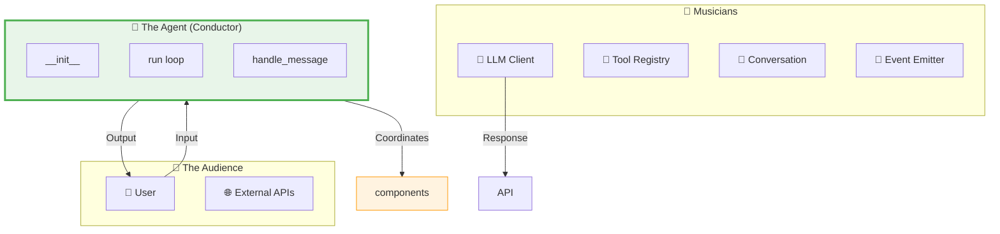
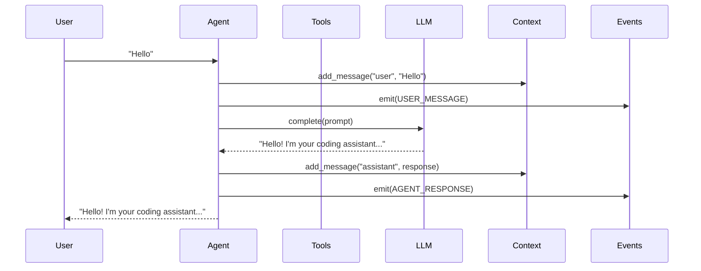

# Day 1, Tutorial 10: Creating the Agent Class Skeleton

**Course:** Build Your Own Coding Agent  
**Day:** 1  
**Tutorial:** 10 of 288  
**Estimated Time:** 60 minutes

---

## 🎯 What You'll Learn

By the end of this tutorial, you'll:
- Create the core Agent class that orchestrates everything
- Understand the initialization flow and configuration
- Implement the main message loop for user interaction
- Add proper error handling and logging
- Connect all components (LLM, tools, context, events) together
- Understand the complete request-response cycle

---

## 🧩 Why the Agent Class is Central

Think of the Agent class as the **conductor of an orchestra**. Each component (LLM client, tool registry, conversation manager, event emitter) is like a musician - talented individually, but they need a conductor to work together harmoniously.



The Agent doesn't do the heavy lifting itself - it delegates to the right component at the right time. This separation of concerns is what makes the system maintainable and testable.

---

## 🎯 Our Goal: Working Agent Skeleton

By the end of this tutorial, we'll have an agent that can:

1. Start up and initialize all components
2. Accept user input via command line
3. Route commands (like `/help`) to tools
4. Route normal conversation to the LLM
5. Maintain conversation history
6. Emit events for debugging/logging
7. Handle errors gracefully



---

## 🛠️ Let's Build It

### Step 1: Create the Agent Class Structure

Let's create the skeleton Agent class that ties everything together:

```python
# src/coding_agent/agent.py
"""
Main Agent - The central coordinator for our coding assistant.

This module contains the Agent class that orchestrates all components:
- LLM client (for generating responses)
- Tool registry (for executing commands)
- Conversation manager (for context)
- Event emitter (for logging and debugging)

The Agent follows the facade pattern - providing a simple interface
while hiding the complexity of all the components working together.
"""

from typing import Optional, List
from dataclasses import dataclass, field
import logging

# We'll import these as we build each component
# from coding_agent.llm import LLMClient, LLMStrategy
# from coding_agent.tools import ToolRegistry, Tool
# from coding_agent.context import ConversationManager
# from coding_agent.events import EventEmitter, EventType, LoggingObserver


# Set up logging for this module
logger = logging.getLogger(__name__)


@dataclass
class CommandResult:
    """
    Result of executing a command or tool.
    
    Attributes:
        command_name: Name of the executed command
        success: Whether the command succeeded
        output: The output from the command
        execution_time_ms: How long it took to execute
        error: Error message if failed (None if success)
    """
    command_name: str
    success: bool
    output: str
    execution_time_ms: float = 0
    error: Optional[str] = None
    
    def __str__(self) -> str:
        """Human-readable string representation."""
        if self.success:
            return f"✓ {self.command_name}: {self.output}"
        else:
            return f"✗ {self.command_name} failed: {self.error or self.output}"


class Agent:
    """
    Main Agent class - the brain of our coding assistant.
    
    The Agent is the central coordinator that:
    - Receives user input
    - Routes to appropriate handler (command vs LLM)
    - Maintains conversation context
    - Emits events for observability
    - Returns responses to the user
    
    Architecture:
    ┌─────────────────────────────────────────────────────────┐
    │                        Agent                             │
    │  ┌─────────────┐  ┌─────────────┐  ┌─────────────────┐ │
    │  │  LLM Client │  │ Tool        │  │ Conversation    │ │
    │  │  (Strategy) │  │ Registry    │  │ Manager         │ │
    │  └─────────────┘  └─────────────┘  └─────────────────┘ │
    │  ┌─────────────┐  ┌─────────────┐                       │
    │  │  Event      │  │ Config      │                       │
    │  │  Emitter    │  │ (Singleton) │                       │
    │  └─────────────┘  └─────────────┘                       │
    └─────────────────────────────────────────────────────────┘
    
    Example usage:
        agent = Agent()
        response = agent.run("Hello, write a hello world function")
        print(response)
    """
    
    def __init__(self, llm_strategy=None):
        """
        Initialize the Agent and all its components.
        
        This is where we set up:
        1. Configuration (from environment variables)
        2. LLM client with the given or default strategy
        3. Event emitter for logging and debugging
        4. Conversation manager for context
        5. Tool registry with built-in tools
        
        Args:
            llm_strategy: Optional LLM strategy to use.
                         If None, will be created from config.
        """
        # Phase 1: Configuration
        # We load configuration first because everything else depends on it
        logger.info("Initializing Agent...")
        self._config = self._load_config()
        
        # Phase 2: Event system (early, so we can log everything)
        # We initialize this early so we can emit events during initialization
        self._events = self._init_event_system()
        
        # Phase 3: LLM Client
        # The LLM is the "brain" - it generates responses
        self._llm = self._init_llm(llm_strategy)
        
        # Phase 4: Conversation Manager
        # This maintains the chat history for context
        self._conversation = self._init_conversation_manager()
        
        # Phase 5: Tool Registry
        # This handles commands like /help, /config, etc.
        self._tools = self._init_tool_registry()
        
        # Phase 6: Command history (for debugging)
        self._command_history: List[CommandResult] = []
        
        # Log successful initialization
        logger.info(f"Agent initialized successfully with LLM: {self.llm_provider}")
        self._events.emit("agent_initialized", {
            "provider": self.llm_provider,
            "tools_count": len(self._tools.list_tools())
        })
    
    def _load_config(self):
        """Load configuration from environment variables."""
        # We'll implement this in a later tutorial
        # For now, return a simple config
        from dataclasses import dataclass, field
        from typing import List
        
        @dataclass
        class SimpleConfig:
            llm_provider: str = "claude"
            model: str = "claude-3-5-sonnet-20241022"
            temperature: float = 0.7
            max_tokens: int = 4096
            log_level: str = "INFO"
            verbose_events: bool = False
        
        return SimpleConfig()
    
    def _init_event_system(self):
        """Initialize the event emitter and observers."""
        # Placeholder for now - full implementation in events module
        class SimpleEventEmitter:
            def __init__(self):
                self._listeners = {}
            
            def emit(self, event_type: str, data: dict = None):
                logger.debug(f"Event: {event_type} - {data}")
            
            def subscribe(self, observer):
                pass
        
        return SimpleEventEmitter()
    
    def _init_llm(self, strategy):
        """Initialize the LLM client."""
        # Placeholder - full implementation in llm module
        class SimpleLLMClient:
            def __init__(self, strategy):
                self._strategy = strategy
            
            @property
            def provider_name(self) -> str:
                return strategy.name if strategy else "mock"
            
            def complete(self, prompt: str, **kwargs) -> str:
                return "Hello! I'm your coding assistant. (LLM not yet connected)"
            
            def set_strategy(self, strategy):
                self._strategy = strategy
        
        return SimpleLLMClient(strategy)
    
    def _init_conversation_manager(self):
        """Initialize the conversation manager."""
        # Placeholder - full implementation in context module
        class SimpleConversationManager:
            def __init__(self):
                self._messages = []
            
            def add_message(self, role: str, content: str):
                self._messages.append({"role": role, "content": content})
            
            def get_history(self, limit: int = 10):
                return self._messages[-limit:]
            
            def clear(self):
                self._messages = []
            
            def format_history(self) -> str:
                if not self._messages:
                    return "No conversation history."
                lines = []
                for msg in self._messages:
                    lines.append(f"{msg['role']}: {msg['content'][:50]}...")
                return "\n".join(lines)
        
        return SimpleConversationManager()
    
    def _init_tool_registry(self):
        """Initialize the tool registry with built-in tools."""
        # Placeholder - full implementation in tools module
        class SimpleToolRegistry:
            def __init__(self):
                self._tools = {}
            
            def register(self, tool):
                self._tools[tool.name] = tool
            
            def get(self, name: str):
                return self._tools.get(name)
            
            def list_tools(self):
                return list(self._tools.keys())
            
            def get_help_text(self) -> str:
                lines = ["Available commands:"]
                for name, tool in self._tools.items():
                    lines.append(f"  /{name} - {tool.description}")
                return "\n".join(lines)
        
        # Create built-in tools
        registry = SimpleToolRegistry()
        
        # Add help tool
        class HelpTool:
            @property
            def name(self): return "help"
            @property
            def description(self): return "Show available commands"
            def execute(self, args=""): return registry.get_help_text()
        
        # Add time tool
        class TimeTool:
            @property
            def name(self): return "time"
            @property
            def description(self): return "Show current time"
            def execute(self, args=""):
                from datetime import datetime
                return f"Current time: {datetime.now().strftime('%Y-%m-%d %H:%M:%S')}"
        
        # Add history tool
        class HistoryTool:
            def __init__(self, conversation):
                self._conversation = conversation
            
            @property
            def name(self): return "history"
            @property
            def description(self): return "Show conversation history"
            def execute(self, args=""): return self._conversation.format_history()
        
        # Add clear tool
        class ClearTool:
            def __init__(self, conversation):
                self._conversation = conversation
            
            @property
            def name(self): return "clear"
            @property
            def description(self): return "Clear conversation history"
            def execute(self, args=""):
                self._conversation.clear()
                return "Conversation cleared."
        
        # Register all tools
        registry.register(HelpTool())
        registry.register(TimeTool())
        registry.register(HistoryTool(registry))
        registry.register(ClearTool(registry))
        
        return registry
    
    # ==================== Public API ====================
    
    @property
    def llm_provider(self) -> str:
        """Get the current LLM provider name."""
        return self._llm.provider_name
    
    def set_llm_provider(self, strategy) -> None:
        """
        Switch to a different LLM provider at runtime.
        
        This allows users to switch between Claude, OpenAI, Ollama, etc.
        without restarting the agent.
        
        Args:
            strategy: The new LLM strategy to use
        """
        self._llm.set_strategy(strategy)
        logger.info(f"Switched LLM provider to: {strategy.name}")
        self._events.emit("llm_provider_changed", {"provider": strategy.name})
    
    def run(self, user_input: str) -> str:
        """
        Process user input and return the agent's response.
        
        This is the main entry point for interacting with the agent.
        It handles:
        1. Commands (starting with /)
        2. Normal conversation (sent to LLM)
        
        Args:
            user_input: The user's message or command
            
        Returns:
            The agent's response as a string
        """
        if not user_input or not user_input.strip():
            return "Please enter something."
        
        user_input = user_input.strip()
        
        # Store user message in conversation history
        self._conversation.add_message("user", user_input)
        
        # Emit event for debugging
        self._events.emit("user_message", {"content": user_input[:100]})
        
        # Route based on input type
        if user_input.startswith("/"):
            response = self._handle_command(user_input)
        else:
            response = self._handle_llm(user_input)
        
        # Store assistant response in conversation history
        self._conversation.add_message("assistant", response)
        
        # Emit event for debugging
        self._events.emit("agent_response", {"response": response[:100]})
        
        return response
    
    def _handle_command(self, command: str) -> str:
        """
        Handle slash commands (like /help, /time, /clear).
        
        Commands are routed to the tool registry for execution.
        This allows extending the agent with new commands easily.
        
        Args:
            command: The command string (e.g., "/help")
            
        Returns:
            The command output
        """
        # Parse command name and arguments
        parts = command.split(maxsplit=1)
        cmd_name = parts[0][1:]  # Remove the leading "/"
        args = parts[1] if len(parts) > 1 else ""
        
        # Look up the tool
        tool = self._tools.get(cmd_name)
        
        if not tool:
            return f"Unknown command: /{cmd_name}. Type /help for available commands."
        
        # Emit event for debugging
        self._events.emit("tool_start", {"tool": cmd_name, "args": args})
        
        # Execute the tool
        try:
            result = tool.execute(args)
            self._events.emit("tool_complete", {"tool": cmd_name})
            
            # Record in history
            self._command_history.append(CommandResult(
                command_name=cmd_name,
                success=True,
                output=result
            ))
            
            return result
            
        except Exception as e:
            error_msg = str(e)
            self._events.emit("tool_error", {"tool": cmd_name, "error": error_msg})
            
            # Record in history
            self._command_history.append(CommandResult(
                command_name=cmd_name,
                success=False,
                output="",
                error=error_msg
            ))
            
            return f"Error executing /{cmd_name}: {error_msg}"
    
    def _handle_llm(self, prompt: str) -> str:
        """
        Handle normal conversation by sending to the LLM.
        
        This is where the magic happens - we:
        1. Build context from conversation history
        2. Send the full prompt to the LLM
        3. Return the LLM's response
        
        Args:
            prompt: The user's message
            
        Returns:
            The LLM's response
        """
        # Emit event for debugging
        self._events.emit("llm_call", {"prompt": prompt[:100]})
        
        try:
            # Build context from conversation history
            history = self._conversation.get_history(limit=10)
            
            # Format as conversation
            context_parts = []
            for msg in history[:-1]:  # Exclude the current message (we just added it)
                context_parts.append(f"{msg['role']}: {msg['content']}")
            
            context = "\n".join(context_parts)
            
            # Build the full prompt
            if context:
                full_prompt = f"Conversation:\n{context}\n\nUser: {prompt}\nAssistant:"
            else:
                full_prompt = f"User: {prompt}\nAssistant:"
            
            # Call the LLM
            response = self._llm.complete(full_prompt)
            
            # Emit success event
            self._events.emit("llm_response", {"response": response[:100]})
            
            return response
            
        except Exception as e:
            error_msg = str(e)
            self._events.emit("llm_error", {"error": error_msg})
            return f"I encountered an error: {error_msg}"
    
    def get_history(self) -> List[dict]:
        """
        Get the conversation history.
        
        Returns:
            List of message dictionaries with 'role' and 'content' keys
        """
        return self._conversation.get_history()
    
    def clear_history(self) -> None:
        """Clear the conversation history."""
        self._conversation.clear()
        self._events.emit("history_cleared", {})


# ==================== CLI Entry Point ====================

def main():
    """
    Entry point for running the agent from command line.
    
    This provides a simple REPL (Read-Eval-Print Loop) for
    interacting with the agent.
    """
    print("=" * 60)
    print("🤖 Coding Agent - Starting up...")
    print("=" * 60)
    
    # Create the agent
    agent = Agent()
    
    print(f"\n✓ Agent initialized with LLM: {agent.llm_provider}")
    print("\nCommands:")
    print("  /help    - Show available commands")
    print("  /history - Show conversation history")
    print("  /clear   - Clear conversation history")
    print("  /time    - Show current time")
    print("\nType your message or 'quit' to exit.\n")
    
    # Main loop
    while True:
        try:
            user_input = input("You: ").strip()
            
            # Check for exit
            if user_input.lower() in ['quit', 'exit', 'q']:
                print("\nGoodbye! 👋")
                break
            
            # Skip empty input
            if not user_input:
                continue
            
            # Process input
            response = agent.run(user_input)
            print(f"Agent: {response}\n")
            
        except KeyboardInterrupt:
            print("\n\nInterrupted. Goodbye! 👋")
            break
        except Exception as e:
            print(f"\nError: {e}\n")


if __name__ == "__main__":
    main()
```

### Step 2: Test the Basic Agent

Let's test that our skeleton works:

```bash
# Run the agent
cd ~/build-coding-agent
poetry run python -m coding_agent.agent
```

You should see:

```
============================================================
🤖 Coding Agent - Starting up...
============================================================

✓ Agent initialized with LLM: mock

Commands:
  /help    - Show available commands
  /history - Show conversation history
  /clear   - Clear conversation history
  /time    - Show current time

Type your message or 'quit' to exit.

You:
```

Try some commands:

```
You: /help
Agent: Available commands:
  /help - Show available commands
  /time - Show current time
  /history - Show conversation history
  /clear - Clear conversation history

You: /time
Agent: Current time: 2024-01-15 10:30:45

You: Hello, who are you?
Agent: Hello! I'm your coding assistant. (LLM not yet connected)

You: /history
Agent: user: Hello, who are you?
assistant: Hello! I'm your coding assistant. (LLM not yet connected)
```

### Step 3: Add Proper Logging

Let's add a proper logging configuration:

```python
# Add to src/coding_agent/agent.py (at the top, after imports)

def setup_logging(level: str = "INFO") -> None:
    """
    Configure logging for the entire application.
    
    Args:
        level: Log level (DEBUG, INFO, WARNING, ERROR)
    """
    log_format = "%(asctime)s | %(name)-20s | %(levelname)-8s | %(message)s"
    date_format = "%Y-%m-%d %H:%M:%S"
    
    logging.basicConfig(
        level=getattr(logging, level.upper()),
        format=log_format,
        datefmt=date_format
    )
    
    # Set third-party loggers to WARNING to reduce noise
    logging.getLogger("urllib3").setLevel(logging.WARNING)
    logging.getLogger("requests").setLevel(logging.WARNING)


# Update main() to use logging
def main():
    # Set up logging
    import os
    log_level = os.environ.get("LOG_LEVEL", "INFO")
    setup_logging(log_level)
    
    logger = logging.getLogger(__name__)
    logger.info("Starting Coding Agent...")
    
    # ... rest of main()
```

### Step 4: Add Environment Variable Support

Let's make the agent respect environment variables:

```python
# Update _load_config method to read from environment

def _load_config(self):
    """Load configuration from environment variables."""
    import os
    from dataclasses import dataclass
    
    @dataclass
    class Config:
        llm_provider: str = "claude"
        model: str = "claude-3-5-sonnet-20241022"
        temperature: float = 0.7
        max_tokens: int = 4096
        log_level: str = "INFO"
        verbose_events: bool = False
    
    return Config(
        llm_provider=os.environ.get("DEFAULT_LLM_PROVIDER", "claude"),
        model=os.environ.get("CLAUDE_MODEL", "claude-3-5-sonnet-20241022"),
        temperature=float(os.environ.get("TEMPERATURE", "0.7")),
        max_tokens=int(os.environ.get("MAX_TOKENS", "4096")),
        log_level=os.environ.get("LOG_LEVEL", "INFO"),
        verbose_events=os.environ.get("VERBOSE_EVENTS", "false").lower() == "true"
    )
```

---

## 🧪 Test Your Agent

### Test 1: Basic Commands

```bash
poetry run python -m coding_agent.agent
```

Try these commands:
- `/help` - Should show all available commands
- `/time` - Should show current time
- `/history` - Should show empty or recent messages
- `/clear` - Should clear history

### Test 2: Conversation

```
You: Hello, my name is Rajat
Agent: [LLM response]

You: What's my name?
Agent: [Should mention "Rajat" if LLM is connected]
```

### Test 3: Error Handling

```
You: /nonexistent
Agent: Unknown command: /nonexistent. Type /help for available commands.
```

### Test 4: Environment Variables

```bash
# Test with different log level
LOG_LEVEL=DEBUG poetry run python -m coding_agent.agent

# Test with different LLM
DEFAULT_LLM_PROVIDER=ollama poetry run python -m coding_agent.agent
```

---

## 🎯 Exercise: Add a New Built-in Tool

**Task:** Add an `/echo` command that simply echoes back the input. This is useful for testing.

**Example:**
```
You: /echo hello world
Agent: hello world
```

**Solution:**

```python
# Add this class to your tool registry initialization

class EchoTool:
    @property
    def name(self) -> str:
        return "echo"
    
    @property
    def description(self) -> str:
        return "Echo back the input (for testing)"
    
    def execute(self, args: str = "") -> str:
        return args if args else "Usage: /echo <message>"

# Register it
registry.register(EchoTool())
```

---

## 🐛 Common Pitfalls

### 1. Forgetting to Add Message to History

**Problem:** Conversation doesn't remember previous messages

**Solution:** Always add messages to conversation:
```python
# Wrong:
def run(self, user_input):
    response = self._llm.complete(user_input)
    return response

# Correct:
def run(self, user_input):
    self._conversation.add_message("user", user_input)  # Add FIRST
    response = self._llm.complete(user_input)
    self._conversation.add_message("assistant", response)  # Then response
    return response
```

### 2. Not Handling Empty Input

**Problem:** Agent crashes on empty input

**Solution:** Check for empty input:
```python
def run(self, user_input):
    if not user_input or not user_input.strip():
        return "Please enter something."
    # ... rest of code
```

### 3. Forgetting to Emit Events

**Problem:** Hard to debug what's happening

**Solution:** Emit events at key points:
```python
def run(self, user_input):
    self._events.emit("user_message", {"content": user_input})
    # ... process
    self._events.emit("agent_response", {"response": response})
    return response
```

### 4. Not Routing Commands Correctly

**Problem:** Commands like `/help` get sent to LLM instead of being executed

**Solution:** Check for `/` prefix first:
```python
def run(self, user_input):
    if user_input.startswith("/"):
        return self._handle_command(user_input)
    return self._handle_llm(user_input)
```

---

## 📝 Key Takeaways

- ✅ **The Agent class** is the central coordinator that ties all components together
- ✅ **Configuration** should be loaded first and passed to components
- ✅ **Event emitter** should be initialized early to log everything
- ✅ **Command routing** separates `/commands` from normal conversation
- ✅ **Conversation manager** maintains history for context
- ✅ **Error handling** should catch exceptions and return friendly messages
- ✅ **Logging** helps debug issues during development
- ✅ **Environment variables** allow flexible configuration
- ✅ **Built-in tools** like `/help`, `/time`, `/history` provide essential features
- ✅ **The run() method** is the main entry point for user interaction

---

## 🎯 Next Tutorial

In **Tutorial 11**, we'll dive into **Interface Design** - understanding what contracts and interfaces our components need. We'll define:

- The abstract base classes for each component
- The method signatures every implementation must follow
- How to swap implementations (e.g., different LLM providers)
- Type hints for better IDE support and documentation

This is crucial for building a maintainable, testable system where you can easily swap out components without breaking the rest of the code.

---

## ✅ Commit Your Work

```bash
# Stage the new files
git add src/coding_agent/agent.py

# Commit with descriptive message
git commit -m "Tutorial 10: Create Agent class skeleton

- Implement main Agent class as central coordinator
- Add command routing (/help, /time, /history, /clear)
- Add conversation manager integration
- Add event emission for debugging
- Add proper logging configuration
- Add environment variable support
- Create CLI entry point with REPL

The Agent now ties together:
- LLM client
- Tool registry  
- Conversation manager
- Event emitter
- Configuration"

git push origin main
```

**Your Agent skeleton is now complete!** 🎉

The core of your coding agent is in place. In the next tutorials, we'll flesh out each component (LLM, tools, context, events) with full implementations.

---

*This is tutorial 10/24 for Day 1. We're building the foundation for our coding agent!*

---

## 📚 Additional Resources

- [Python dataclasses](https://docs.python.org/3/library/dataclasses.html)
- [Python logging](https://docs.python.org/3/library/logging.html)
- [Facade Pattern](https://en.wikipedia.org/wiki/Facade_pattern) - The design pattern the Agent follows
- [REPL in Python](https://docs.python.org/3/tutorial/interpreter.html#tut-repl)