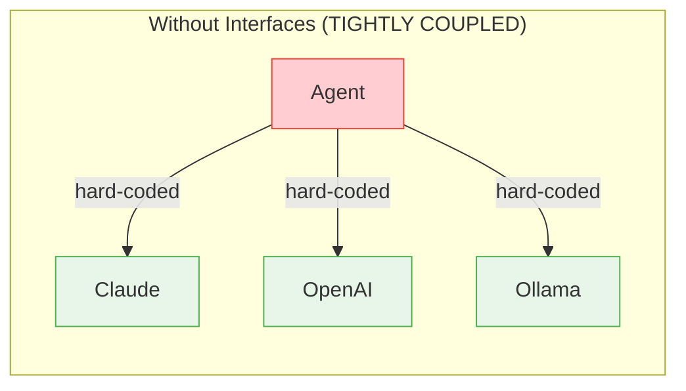
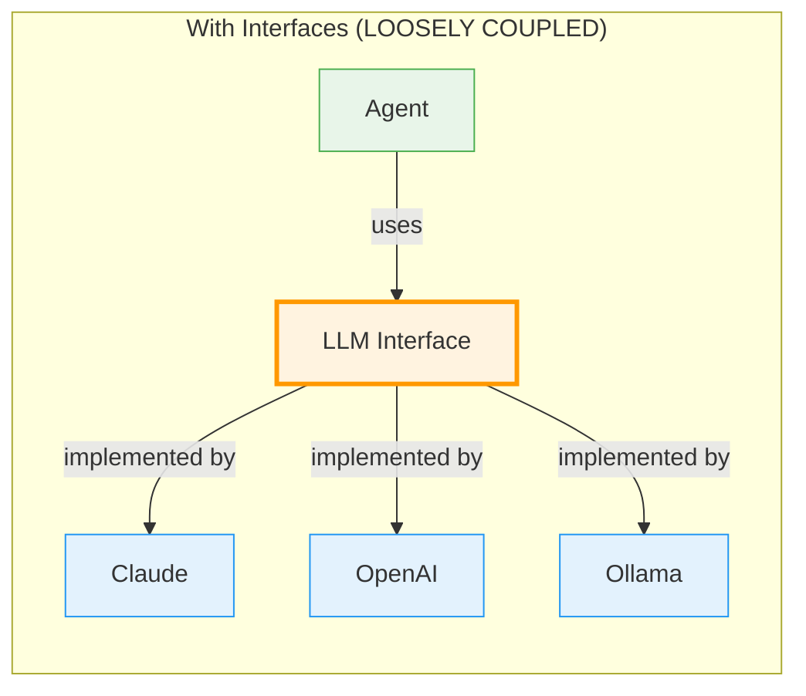
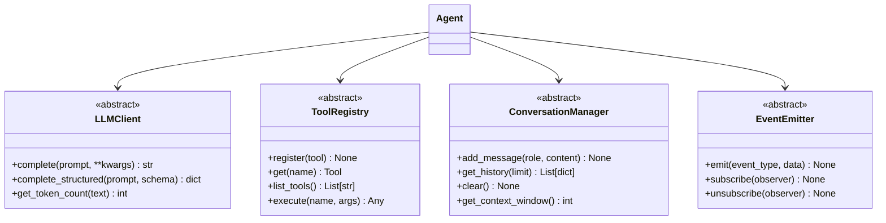

# Day 1, Tutorial 11: Interface Design - What Contracts Do We Need?

**Course:** Build Your Own Coding Agent  
**Day:** 1  
**Tutorial:** 11 of 288  
**Estimated Time:** 60 minutes

---

## 🎯 What You'll Learn

By the end of this tutorial, you'll:
- Understand why interfaces are crucial for maintainable agent architecture
- Design abstract base classes (ABCs) for each component
- Define contracts that enable easy swapping of implementations
- Create proper type hints for better IDE support
- Implement polymorphism across LLM providers
- Build a plugin system for tools

---

## 🧩 Why Interface Design Matters

Imagine you're building a car. Would you weld the engine directly to the chassis? Of course not! You'd design **interfaces** - standardized points where components connect. The engine has a standardized shaft, the wheels have standardized mounts, the fuel system has standardized connectors.

Software is no different. Without interfaces:



With interfaces, your Agent doesn't care **which** LLM it uses - it just knows the contract:



### The Benefits of Contracts

1. **Swap implementations without touching client code** - Want to switch from Claude to OpenAI? Just swap the implementation class.

2. **Test with mocks** - During testing, replace the real LLM with a mock that returns predetermined responses.

3. **Multiple implementations** - Let users choose between different LLM providers, storage backends, or tool registries.

4. **Clear API contracts** - Every developer knows exactly what methods a component must implement.

5. **IDE support** - Type hints and abstract methods give you autocomplete and error checking.

---

## 🎯 Our Goal: Define Component Contracts

We'll create interfaces for:

1. **LLM Client** - Abstract interface for all LLM providers
2. **Tool Registry** - Abstract interface for tool management
3. **Conversation Manager** - Abstract interface for context/storage
4. **Event Emitter** - Abstract interface for observability



---

## 🛠️ Let's Build It

### Step 1: Create the Interfaces Module

We'll create a dedicated `interfaces` module to hold all our contracts. This follows the **Interface Segregation Principle** from SOLID - clients shouldn't depend on methods they don't use.

```python
# src/coding_agent/interfaces/__init__.py
"""
Interfaces Module - Abstract contracts for all components.

This module defines the interfaces (abstract base classes) that
all implementations must follow. This enables:
- Swappable LLM providers (Claude, OpenAI, Ollama)
- Pluggable tool registries
- Testable components with mocks
- Clear API contracts

Architecture:
┌─────────────────────────────────────────────────────────┐
│                     Interfaces                           │
│  ┌─────────────┐  ┌─────────────┐  ┌─────────────────┐  │
│  │  LLMClient │  │ToolRegistry │  │ConversationMgr │  │
│  │  Interface │  │  Interface  │  │    Interface    │  │
│  └─────────────┘  └─────────────┘  └─────────────────┘  │
│  ┌─────────────┐                                         │
│  │EventEmitter │                                         │
│  │  Interface  │                                         │
│  └─────────────┘                                         │
└─────────────────────────────────────────────────────────┘
"""

from coding_agent.interfaces.llm import LLMClient, LLMResponse, Message
from coding_agent.interfaces.tools import ToolRegistry, Tool, ToolResult
from coding_agent.interfaces.context import ConversationManager, ContextItem
from coding_agent.interfaces.events import EventEmitter, Event, EventObserver

__all__ = [
    "LLMClient",
    "LLMResponse", 
    "Message",
    "ToolRegistry",
    "Tool",
    "ToolResult",
    "ConversationManager",
    "ContextItem",
    "EventEmitter",
    "Event",
    "EventObserver",
]
```

### Step 2: Define the LLM Client Interface

This is the most critical interface since the LLM is the "brain" of our agent.

```python
# src/coding_agent/interfaces/llm.py
"""
LLM Client Interface - Contract for all LLM providers.

This abstract base class defines what every LLM client must implement.
Whether you're using Anthropic Claude, OpenAI GPT, or a local Ollama
model, they all must conform to this contract.

Why use an interface?
- Swap providers without changing agent code
- Test with mock responses
- Add new providers easily
- Clear contract for developers
"""

from abc import ABC, abstractmethod
from dataclasses import dataclass
from typing import Optional, List, Dict, Any, Generator
import logging

logger = logging.getLogger(__name__)


@dataclass
class Message:
    """
    A single message in a conversation.
    
    Attributes:
        role: Who sent the message ('user', 'assistant', or 'system')
        content: The text content of the message
        tool_calls: Optional tool calls made by the assistant
        tool_call_id: ID of the tool call this message responds to
    """
    role: str
    content: str
    tool_calls: Optional[List[Dict[str, Any]]] = None
    tool_call_id: Optional[str] = None
    
    def to_dict(self) -> Dict[str, Any]:
        """Convert to dictionary format for API calls."""
        result = {"role": self.role, "content": self.content}
        if self.tool_calls:
            result["tool_calls"] = self.tool_calls
        if self.tool_call_id:
            result["tool_call_id"] = self.tool_call_id
        return result
    
    @classmethod
    def from_dict(cls, data: Dict[str, Any]) -> "Message":
        """Create a Message from a dictionary."""
        return cls(
            role=data["role"],
            content=data["content"],
            tool_calls=data.get("tool_calls"),
            tool_call_id=data.get("tool_call_id")
        )


@dataclass
class LLMResponse:
    """
    Response from an LLM completion.
    
    This dataclass wraps the raw API response to provide a
    consistent interface regardless of the provider.
    
    Attributes:
        content: The text content of the response
        model: The model that generated the response
        usage: Token usage information
        finish_reason: Why the generation stopped
        tool_calls: Any tool calls made in the response
        raw_response: The raw API response (provider-specific)
    """
    content: str
    model: str
    usage: Optional[Dict[str, int]] = None
    finish_reason: Optional[str] = None
    tool_calls: Optional[List[Dict[str, Any]]] = None
    raw_response: Optional[Dict[str, Any]] = None
    
    def __str__(self) -> str:
        return f"LLMResponse(model={self.model}, content={self.content[:50]}...)"
    
    @property
    def total_tokens(self) -> int:
        """Total tokens used (prompt + completion)."""
        if self.usage:
            return self.usage.get("total_tokens", 0)
        return 0


class LLMClient(ABC):
    """
    Abstract base class for all LLM clients.
    
    This interface defines the contract that all LLM implementations
    must follow. Implementations include:
    - AnthropicClient (Anthropic Claude)
    - OpenAIClient (OpenAI GPT)
    - OllamaClient (Local Ollama models)
    - MockClient (For testing)
    
    Why ABC?
    - Enforces implementation of all abstract methods
    - Provides clear contract for developers
    - Enables IDE autocomplete and type checking
    
    Example:
        class AnthropicClient(LLMClient):
            def complete(self, prompt, **kwargs):
                # Implementation here
                ...
    """
    
    def __init__(self, model: str, api_key: Optional[str] = None, **kwargs):
        """
        Initialize the LLM client.
        
        Args:
            model: The model identifier (e.g., "claude-3-5-sonnet-20241022")
            api_key: API key for authentication (may be None for local models)
            **kwargs: Additional provider-specific configuration
        """
        self.model = model
        self.api_key = api_key
        self.config = kwargs
        logger.info(f"Initializing {self.__class__.__name__} with model: {model}")
    
    @property
    @abstractmethod
    def provider_name(self) -> str:
        """
        Return the name of the provider.
        
        Returns:
            String identifier for the provider (e.g., 'anthropic', 'openai')
        """
        pass
    
    @property
    def max_tokens(self) -> int:
        """Maximum tokens the model can generate."""
        return self.config.get("max_tokens", 4096)
    
    @max_tokens.setter
    def max_tokens(self, value: int):
        """Set maximum tokens."""
        self.config["max_tokens"] = value
    
    @property
    def temperature(self) -> float:
        """Sampling temperature (0.0 - 1.0)."""
        return self.config.get("temperature", 0.7)
    
    @temperature.setter
    def temperature(self, value: float):
        """Set temperature (clamped to valid range)."""
        self.config["temperature"] = max(0.0, min(1.0, value))
    
    @abstractmethod
    def complete(
        self,
        prompt: str,
        messages: Optional[List[Message]] = None,
        system_prompt: Optional[str] = None,
        **kwargs
    ) -> LLMResponse:
        """
        Generate a completion for the given prompt.
        
        This is the main method for text generation. It handles both
        simple prompts and full conversation histories.
        
        Args:
            prompt: The user's prompt (used if messages is None)
            messages: Full conversation history (overrides prompt)
            system_prompt: System instructions (e.g., "You are a helpful assistant")
            **kwargs: Additional provider-specific parameters
            
        Returns:
            LLMResponse object containing the generated text and metadata
            
        Example:
            # Simple prompt
            response = client.complete("Write a hello world function")
            
            # With conversation history
            response = client.complete(
                messages=[
                    Message("user", "What's 2+2?"),
                    Message("assistant", "4"),
                    Message("user", "Multiply by 3")
                ]
            )
            
            # With system prompt
            response = client.complete(
                prompt="Explain this code",
                system_prompt="You are a code expert. Be concise."
            )
        """
        pass
    
    @abstractmethod
    def complete_streaming(
        self,
        prompt: str,
        messages: Optional[List[Message]] = None,
        system_prompt: Optional[str] = None,
        **kwargs
    ) -> Generator[str, None, None]:
        """
        Generate a streaming completion.
        
        Yields chunks of the response as they're generated, enabling
        real-time display (like ChatGPT does).
        
        Args:
            prompt: The user's prompt
            messages: Full conversation history
            system_prompt: System instructions
            **kwargs: Additional parameters
            
        Yields:
            Chunks of the response text
            
        Example:
            for chunk in client.complete_streaming("Tell me a story"):
                print(chunk, end="", flush=True)
        """
        pass
    
    @abstractmethod
    def complete_with_tools(
        self,
        prompt: str,
        tools: List[Dict[str, Any]],
        messages: Optional[List[Message]] = None,
        **kwargs
    ) -> LLMResponse:
        """
        Generate a completion that may include tool calls.
        
        This enables the "tool use" capability where the LLM can
        request execution of functions (like our tool system).
        
        Args:
            prompt: The user's prompt
            tools: List of tool definitions (JSON Schema format)
            messages: Conversation history
            **kwargs: Additional parameters
            
        Returns:
            LLMResponse that may contain tool_calls
            
        Example:
            tools = [
                {
                    "name": "read_file",
                    "description": "Read a file",
                    "parameters": {
                        "type": "object",
                        "properties": {
                            "path": {"type": "string"}
                        }
                    }
                }
            ]
            response = client.complete_with_tools("Read myfile.txt", tools)
            if response.tool_calls:
                # Execute tool and continue
                ...
        """
        pass
    
    @abstractmethod
    def get_token_count(self, text: str) -> int:
        """
        Calculate the number of tokens in the text.
        
        This is crucial for context window management - we need to
        know how many tokens we're using to avoid exceeding limits.
        
        Different providers may have different tokenization, so this
        is an abstract method that each implementation must handle.
        
        Args:
            text: The text to count tokens for
            
        Returns:
            Number of tokens in the text
            
        Note:
            For accuracy, use the provider's own tokenization.
            The tiktoken library can approximate for OpenAI models.
        """
        pass
    
    @abstractmethod
    def validate_api_key(self) -> bool:
        """
        Check if the API key is valid and has access.
        
        This should make a lightweight API call to verify
        the credentials work.
        
        Returns:
            True if the API key is valid
            
        Raises:
            AuthenticationError: If the API key is invalid
            RateLimitError: If rate limited
        """
        pass
    
    def get_max_context_tokens(self) -> int:
        """
        Get the maximum context window for this model.
        
        Returns:
            Maximum tokens the model can handle in context
        """
        # Default implementation - override in subclasses
        return self.config.get("max_context_tokens", 4096)
    
    def __repr__(self) -> str:
        return f"{self.__class__.__name__}(model={self.model})"


# Exception classes for error handling

class LLMError(Exception):
    """Base exception for LLM-related errors."""
    pass


class AuthenticationError(LLMError):
    """Raised when API key is invalid or missing."""
    pass


class RateLimitError(LLMError):
    """Raised when rate limit is exceeded."""
    pass


class InvalidRequestError(LLMError):
    """Raised when the request is invalid."""
    pass


class APIError(LLMError):
    """Raised when the API returns an error."""
    pass
```

### Step 3: Define the Tool Registry Interface

```python
# src/coding_agent/interfaces/tools.py
"""
Tool Registry Interface - Contract for tool management.

This abstract base class defines the contract for tool registration,
discovery, and execution. Tools are how the agent interacts with
the outside world (files, shell, etc.).
"""

from abc import ABC, abstractmethod
from dataclasses import dataclass
from typing import Any, Dict, List, Optional, Callable
import logging

logger = logging.getLogger(__name__)


@dataclass
class ToolResult:
    """
    Result of executing a tool.
    
    Attributes:
        success: Whether the tool executed successfully
        output: The tool's output (text, data, etc.)
        error: Error message if failed
        execution_time_ms: How long execution took
    """
    success: bool
    output: Any
    error: Optional[str] = None
    execution_time_ms: float = 0
    
    def __str__(self) -> str:
        if self.success:
            return f"Success: {self.output}"
        return f"Error: {self.error or self.output}"


class Tool(ABC):
    """
    Abstract base class for all tools.
    
    A tool is a capability the agent can use to interact with
    the world - reading files, running commands, searching, etc.
    
    Each tool must define:
    - name: Unique identifier
    - description: What the tool does (for the LLM)
    - parameters: JSON Schema for arguments
    - execute: The actual implementation
    """
    
    @property
    @abstractmethod
    def name(self) -> str:
        """Unique identifier for this tool."""
        pass
    
    @property
    @abstractmethod
    def description(self) -> str:
        """
        Human-readable description for the LLM.
        
        This is crucial - the LLM uses this to decide WHEN to
        use the tool. Be descriptive but concise.
        
        Example:
            return "Read the contents of a file from the filesystem"
        """
        pass
    
    @property
    def parameters(self) -> Dict[str, Any]:
        """
        JSON Schema for tool arguments.
        
        Override this to define required/optional parameters.
        
        Example:
            return {
                "type": "object",
                "properties": {
                    "path": {
                        "type": "string",
                        "description": "Path to the file"
                    },
                    "line_numbers": {
                        "type": "boolean",
                        "description": "Include line numbers",
                        "default": False
                    }
                },
                "required": ["path"]
            }
        """
        return {
            "type": "object",
            "properties": {},
            "required": []
        }
    
    @abstractmethod
    def execute(self, **kwargs) -> ToolResult:
        """
        Execute the tool with the given arguments.
        
        Args:
            **kwargs: Arguments matching the tool's parameter schema
            
        Returns:
            ToolResult with success status and output
            
        Raises:
            ToolError: If execution fails
        """
        pass
    
    def validate_args(self, **kwargs) -> bool:
        """
        Validate the arguments against the schema.
        
        Args:
            **kwargs: Arguments to validate
            
        Returns:
            True if valid
            
        Raises:
            ValueError: If arguments are invalid
        """
        # Simple validation - override for complex cases
        return True
    
    def __repr__(self) -> str:
        return f"Tool({self.name})"


class ToolRegistry(ABC):
    """
    Abstract base class for tool registries.
    
    The registry maintains a collection of tools and provides
    methods for registration, discovery, and execution.
    
    Implementations:
    - InMemoryToolRegistry: Simple in-memory storage
    - PluginToolRegistry: Load tools from plugins
    - DatabaseToolRegistry: Persist tools in database
    """
    
    @abstractmethod
    def register(self, tool: Tool) -> None:
        """
        Register a new tool.
        
        If a tool with the same name exists, it should be replaced.
        
        Args:
            tool: The tool to register
            
        Example:
            registry.register(ReadFileTool())
        """
        pass
    
    @abstractmethod
    def unregister(self, name: str) -> bool:
        """
        Remove a tool from the registry.
        
        Args:
            name: Name of the tool to remove
            
        Returns:
            True if tool was removed, False if not found
        """
        pass
    
    @abstractmethod
    def get(self, name: str) -> Optional[Tool]:
        """
        Get a tool by name.
        
        Args:
            name: Name of the tool
            
        Returns:
            The tool or None if not found
        """
        pass
    
    @abstractmethod
    def list_tools(self) -> List[str]:
        """
        List all registered tool names.
        
        Returns:
            List of tool names
        """
        pass
    
    @abstractmethod
    def get_tool_definitions(self) -> List[Dict[str, Any]]:
        """
        Get tool definitions for LLM tool calling.
        
        Returns:
            List of tool definitions in provider-specific format
        """
        pass
    
    @abstractmethod
    def execute(self, name: str, **kwargs) -> ToolResult:
        """
        Execute a tool by name.
        
        Args:
            name: Name of the tool to execute
            **kwargs: Arguments to pass to the tool
            
        Returns:
            ToolResult with output or error
            
        Example:
            result = registry.execute("read_file", path="main.py")
            if result.success:
                print(result.output)
        """
        pass
    
    @abstractmethod
    def search(self, query: str) -> List[Tool]:
        """
        Search for tools matching a query.
        
        Useful for helping users find relevant tools.
        
        Args:
            query: Search query
            
        Returns:
            List of matching tools
        """
        pass
    
    def __repr__(self) -> str:
        return f"{self.__class__.__name__}({len(self.list_tools())} tools)"


class ToolError(Exception):
    """Base exception for tool-related errors."""
    pass


class ToolNotFoundError(ToolError):
    """Raised when a requested tool doesn't exist."""
    pass


class ToolExecutionError(ToolError):
    """Raised when tool execution fails."""
    pass
```

### Step 4: Define the Conversation Manager Interface

```python
# src/coding_agent/interfaces/context.py
"""
Conversation Manager Interface - Contract for context management.

This abstract base class defines how conversation history and
context are managed. Different implementations can use different
storage backends (memory, file, database) or strategies (sliding
window, summarization, etc.).
"""

from abc import ABC, abstractmethod
from dataclasses import dataclass
from typing import List, Optional, Dict, Any
from datetime import datetime
import logging

logger = logging.getLogger(__name__)


@dataclass
class ContextItem:
    """
    A single item in the conversation context.
    
    Attributes:
        role: Who sent this message (user, assistant, system)
        content: The message content
        timestamp: When the message was sent
        token_count: Number of tokens in this message
        metadata: Additional metadata (tool calls, etc.)
    """
    role: str
    content: str
    timestamp: datetime
    token_count: Optional[int] = None
    metadata: Optional[Dict[str, Any]] = None
    
    def to_dict(self) -> Dict[str, Any]:
        """Convert to dictionary."""
        return {
            "role": self.role,
            "content": self.content,
            "timestamp": self.timestamp.isoformat(),
            "token_count": self.token_count,
            "metadata": self.metadata
        }
    
    @classmethod
    def from_dict(cls, data: Dict[str, Any]) -> "ContextItem":
        """Create from dictionary."""
        return cls(
            role=data["role"],
            content=data["content"],
            timestamp=datetime.fromisoformat(data["timestamp"]),
            token_count=data.get("token_count"),
            metadata=data.get("metadata")
        )


class ConversationManager(ABC):
    """
    Abstract base class for conversation/context management.
    
    This interface defines how conversation history is stored,
    retrieved, and managed. Implementations can vary in:
    - Storage backend (memory, file, database)
    - Strategy (full history, sliding window, summarization)
    - Persistence (session-only, persistent across restarts)
    
    Why separate this from the Agent?
    - Different users have different needs
    - Easy to test with mock conversations
    - Can swap strategies without changing agent code
    """
    
    def __init__(self, max_tokens: int = 100000, **kwargs):
        """
        Initialize the conversation manager.
        
        Args:
            max_tokens: Maximum tokens to keep in context
            **kwargs: Additional configuration
        """
        self.max_tokens = max_tokens
        self.config = kwargs
        logger.info(f"Initializing {self.__class__.__name__} with max_tokens={max_tokens}")
    
    @abstractmethod
    def add_message(self, role: str, content: str, **metadata) -> ContextItem:
        """
        Add a message to the conversation history.
        
        Args:
            role: Message role (user, assistant, system)
            content: Message content
            **metadata: Additional metadata
            
        Returns:
            The added ContextItem
        """
        pass
    
    @abstractmethod
    def get_history(self, limit: Optional[int] = None) -> List[ContextItem]:
        """
        Get conversation history.
        
        Args:
            limit: Maximum number of messages to return (None = all)
            
        Returns:
            List of ContextItems, most recent last
        """
        pass
    
    @abstractmethod
    def get_messages_for_llm(self, limit: Optional[int] = None) -> List[Dict[str, str]]:
        """
        Get messages formatted for LLM API.
        
        This returns messages in the format expected by the LLM API,
        not our internal ContextItem format.
        
        Args:
            limit: Maximum number of messages
            
        Returns:
            List of message dictionaries
            
        Example:
            [
                {"role": "system", "content": "You are helpful..."},
                {"role": "user", "content": "Hello"},
                {"role": "assistant", "content": "Hi!"}
            ]
        """
        pass
    
    @abstractmethod
    def clear(self) -> None:
        """Clear all conversation history."""
        pass
    
    @abstractmethod
    def get_total_tokens(self) -> int:
        """
        Get total tokens in conversation.
        
        Returns:
            Approximate token count
        """
        pass
    
    @abstractmethod
    def get_context_window(self) -> int:
        """
        Get the maximum context window size.
        
        Returns:
            Maximum tokens allowed in context
        """
        pass
    
    def should_summarize(self) -> bool:
        """
        Check if context should be summarized.
        
        This is a heuristic - implementations may override with
        more sophisticated logic.
        
        Returns:
            True if we're approaching the token limit
        """
        return self.get_total_tokens() > (self.max_tokens * 0.8)
    
    @abstractmethod
    def summarize_old_messages(self) -> str:
        """
        Summarize old messages to save context space.
        
        Returns:
            Summary text
        """
        pass
    
    def __len__(self) -> int:
        """Return number of messages."""
        return len(self.get_history())
    
    def __repr__(self) -> str:
        return f"{self.__class__.__name__}({len(self)} messages, {self.get_total_tokens()} tokens)"
```

### Step 5: Define the Event Emitter Interface

```python
# src/coding_agent/interfaces/events.py
"""
Event Emitter Interface - Contract for observability.

This abstract base class defines the event system for logging,
debugging, and monitoring. Components emit events, observers react.
"""

from abc import ABC, abstractmethod
from dataclasses import dataclass
from typing import Dict, Any, List, Callable, Optional
from datetime import datetime
from enum import Enum
import logging

logger = logging.getLogger(__name__)


class EventType(Enum):
    """Standard event types for the agent."""
    # User events
    USER_MESSAGE = "user_message"
    AGENT_RESPONSE = "agent_response"
    
    # LLM events
    LLM_CALL = "llm_call"
    LLM_RESPONSE = "llm_response"
    LLM_ERROR = "llm_error"
    LLM_PROVIDER_CHANGED = "llm_provider_changed"
    
    # Tool events
    TOOL_START = "tool_start"
    TOOL_COMPLETE = "tool_complete"
    TOOL_ERROR = "tool_error"
    
    # Agent events
    AGENT_INITIALIZED = "agent_initialized"
    AGENT_STARTED = "agent_started"
    AGENT_STOPPED = "agent_stopped"
    HISTORY_CLEARED = "history_cleared"
    
    # Error events
    ERROR = "error"
    WARNING = "warning"


@dataclass
class Event:
    """
    A single event in the system.
    
    Attributes:
        type: Event type (from EventType enum)
        data: Event data (dict)
        timestamp: When the event occurred
        source: Source component
    """
    type: str
    data: Dict[str, Any]
    timestamp: datetime
    source: Optional[str] = None
    
    def to_dict(self) -> Dict[str, Any]:
        return {
            "type": self.type,
            "data": self.data,
            "timestamp": self.timestamp.isoformat(),
            "source": self.source
        }


class EventObserver(ABC):
    """
    Abstract base class for event observers.
    
    Observers react to events. Common implementations:
    - LoggingObserver: Log events to file/console
    - MetricsObserver: Send metrics to monitoring
    - DebugObserver: Store for debugging
    """
    
    @abstractmethod
    def on_event(self, event: Event) -> None:
        """
        Handle an event.
        
        Args:
            event: The event to handle
        """
        pass
    
    def on_error(self, event: Event, error: Exception) -> None:
        """
        Handle an error in event processing.
        
        Default implementation just logs.
        
        Args:
            event: The event that caused the error
            error: The error that occurred
        """
        logger.error(f"Observer error for {event.type}: {error}")


class EventEmitter(ABC):
    """
    Abstract base class for event emission.
    
    The event system follows the Observer pattern:
    - Components emit events (they don't know who's listening)
    - Observers subscribe to event types
    - When an event is emitted, all subscribers are notified
    
    This decouples components - the Agent doesn't need to know
    about logging, metrics, or debugging tools.
    """
    
    @abstractmethod
    def emit(self, event_type: str, data: Optional[Dict[str, Any]] = None) -> None:
        """
        Emit an event.
        
        Args:
            event_type: Type of event (use EventType enum values)
            data: Event data
            
        Example:
            emitter.emit("user_message", {"content": "Hello"})
        """
        pass
    
    @abstractmethod
    def subscribe(self, observer: EventObserver, event_types: Optional[List[str]] = None) -> None:
        """
        Subscribe to events.
        
        Args:
            observer: The observer to add
            event_types: List of event types to subscribe to (None = all)
        """
        pass
    
    @abstractmethod
    def unsubscribe(self, observer: EventObserver) -> None:
        """
        Unsubscribe from events.
        
        Args:
            observer: The observer to remove
        """
        pass
    
    @abstractmethod
    def get_subscribers(self, event_type: str) -> List[EventObserver]:
        """
        Get all subscribers for an event type.
        
        Args:
            event_type: The event type
            
        Returns:
            List of observers
        """
        pass
    
    def emit_user_message(self, content: str) -> None:
        """Convenience method for user message events."""
        self.emit(EventType.USER_MESSAGE.value, {"content": content})
    
    def emit_agent_response(self, content: str) -> None:
        """Convenience method for agent response events."""
        self.emit(EventType.AGENT_RESPONSE.value, {"content": content})
    
    def emit_llm_call(self, prompt: str, model: str) -> None:
        """Convenience method for LLM call events."""
        self.emit(EventType.LLM_CALL.value, {"prompt": prompt, "model": model})
    
    def emit_tool_start(self, tool_name: str, args: Dict[str, Any]) -> None:
        """Convenience method for tool start events."""
        self.emit(EventType.TOOL_START.value, {"tool": tool_name, "args": args})
```

### Step 6: Update the Agent to Use Interfaces

Now let's update the Agent class to use these interfaces properly:

```python
# Update src/coding_agent/agent.py to use interfaces

# Add imports at the top
from coding_agent.interfaces import (
    LLMClient,
    ToolRegistry, 
    Tool,
    ConversationManager,
    EventEmitter,
    Message,
)

# Update the Agent class to type hints
class Agent:
    """
    Main Agent class with proper interface typing.
    """
    
    def __init__(
        self,
        llm_client: Optional[LLMClient] = None,
        tool_registry: Optional[ToolRegistry] = None,
        conversation_manager: Optional[ConversationManager] = None,
        event_emitter: Optional[EventEmitter] = None,
    ):
        """
        Initialize with interface implementations.
        
        All parameters are interfaces - you can pass any implementation.
        
        Args:
            llm_client: LLM client implementation
            tool_registry: Tool registry implementation
            conversation_manager: Conversation manager implementation
            event_emitter: Event emitter implementation
        """
        # If no implementations provided, create defaults
        self._llm: LLMClient = llm_client or self._create_default_llm()
        self._tools: ToolRegistry = tool_registry or self._create_default_tools()
        self._conversation: ConversationManager = conversation_manager or self._create_default_conversation()
        self._events: EventEmitter = event_emitter or self._create_default_events()
        
        logger.info(f"Agent initialized with: {self._llm}, {self._tools}")
    
    def _create_default_llm(self) -> LLMClient:
        """Create a default LLM client (placeholder)."""
        # This would create an actual implementation
        from coding_agent.llm import MockLLMClient
        return MockLLMClient(model="mock")
    
    # ... rest of methods using interface types
```

---

## 🧪 Test It

### Test 1: Verify Interface Import

```python
# Test that all interfaces can be imported
from coding_agent.interfaces import (
    LLMClient,
    ToolRegistry,
    ConversationManager,
    EventEmitter,
    Message,
    Tool,
    ToolResult,
    ContextItem,
    Event,
)

print("✓ All interfaces imported successfully")
```

### Test 2: Verify Abstract Methods

```python
# Verify that interfaces enforce implementation
import inspect

# Check LLMClient has abstract methods
llm_abstracts = [name for name, method in inspect.getmembers(LLMClient) 
                 if getattr(method, '__isabstractmethod__', False)]
print(f"LLMClient abstract methods: {llm_abstracts}")

# Try to instantiate (should fail)
try:
    client = LLMClient(model="test")
except TypeError as e:
    print(f"✓ Cannot instantiate abstract LLMClient: {e}")
```

### Test 3: Create a Mock Implementation

```python
# Test with a mock implementation
class MockLLMClient(LLMClient):
    def __init__(self, model: str = "mock", **kwargs):
        super().__init__(model, **kwargs)
    
    @property
    def provider_name(self) -> str:
        return "mock"
    
    def complete(self, prompt, messages=None, system_prompt=None, **kwargs):
        return LLMResponse(
            content=f"Mock response to: {prompt[:50]}",
            model=self.model,
            usage={"prompt_tokens": 10, "completion_tokens": 20, "total_tokens": 30}
        )
    
    def complete_streaming(self, prompt, messages=None, system_prompt=None, **kwargs):
        yield f"Mock streaming response to: {prompt}"
    
    def complete_with_tools(self, prompt, tools, messages=None, **kwargs):
        return self.complete(prompt, messages, **kwargs)
    
    def get_token_count(self, text: str) -> int:
        return len(text.split())  # Rough approximation
    
    def validate_api_key(self) -> bool:
        return True

# Test the mock
client = MockLLMClient("test-model")
response = client.complete("Hello")
print(f"✓ Mock client works: {response}")
```

---

## 🎯 Exercise: Create a Tool Implementation

**Task:** Create a `ReadFileTool` that implements the `Tool` interface.

**Requirements:**
- Name: "read_file"
- Description: "Read contents of a file"
- Parameters: `path` (required), `line_numbers` (optional, default False)
- Execute: Read and return file contents

**Solution:**

```python
import os
from coding_agent.interfaces import Tool, ToolResult


class ReadFileTool(Tool):
    """Tool for reading file contents."""
    
    @property
    def name(self) -> str:
        return "read_file"
    
    @property
    def description(self) -> str:
        return "Read the contents of a file from the filesystem"
    
    @property
    def parameters(self) -> dict:
        return {
            "type": "object",
            "properties": {
                "path": {
                    "type": "string",
                    "description": "Path to the file to read"
                },
                "line_numbers": {
                    "type": "boolean",
                    "description": "Include line numbers in output",
                    "default": False
                },
                "max_lines": {
                    "type": "integer",
                    "description": "Maximum number of lines to read",
                    "default": None
                }
            },
            "required": ["path"]
        }
    
    def execute(self, **kwargs) -> ToolResult:
        path = kwargs.get("path", "")
        line_numbers = kwargs.get("line_numbers", False)
        max_lines = kwargs.get("max_lines")
        
        if not path:
            return ToolResult(
                success=False,
                output="",
                error="path is required"
            )
        
        try:
            with open(path, 'r') as f:
                lines = f.readlines()
            
            if max_lines:
                lines = lines[:max_lines]
            
            if line_numbers:
                output = "".join(f"{i+1:4d} | {line}" for i, line in enumerate(lines))
            else:
                output = "".join(lines)
            
            return ToolResult(
                success=True,
                output=output
            )
        except FileNotFoundError:
            return ToolResult(
                success=False,
                output="",
                error=f"File not found: {path}"
            )
        except PermissionError:
            return ToolResult(
                success=False,
                output="",
                error=f"Permission denied: {path}"
            )


# Test it
tool = ReadFileTool()
result = tool.execute(path="agent.py", line_numbers=True)
print(result)
```

---

## 🐛 Common Pitfalls

### 1. Forgetting @abstractmethod

**Problem:** Interface allows instantiation without implementing methods

**Solution:** Always use @abstractmethod on interface methods:
```python
class LLMClient(ABC):  # Must inherit from ABC
    @abstractmethod  # Must decorate abstract methods
    def complete(self, prompt):
        pass
```

### 2. Inconsistent Method Signatures

**Problem:** Implementation has different signature than interface

**Solution:** Follow the interface exactly:
```python
# Interface says:
def complete(self, prompt: str, messages: Optional[List[Message]] = None) -> LLMResponse:

# Implementation must match exactly:
def complete(self, prompt: str, messages: Optional[List[Message]] = None) -> LLMResponse:
    # ✅ Correct - matches signature
```

### 3. Not Using Type Hints

**Problem:** Lose IDE support and type checking

**Solution:** Always add type hints:
```python
# Wrong
def complete(prompt):
    return "text"

# Correct
def complete(prompt: str, messages: Optional[List[Message]] = None) -> LLMResponse:
    ...
```

### 4. Breaking the Contract

**Problem:** Changing interface after implementations exist

**Solution:** Use versioned interfaces or deprecation warnings:
```python
# Add version to interface
class LLMClient(ABC):
    VERSION = "1.0.0"
    
    @abstractmethod
    def complete(self, prompt: str, **kwargs) -> LLMResponse:
        pass
```

---

## 📝 Key Takeaways

- ✅ **Interfaces define contracts** - What implementations must provide
- ✅ **ABCs enforce implementation** - Can't instantiate without implementing all abstract methods
- ✅ **Loose coupling** - Agent depends on interfaces, not implementations
- ✅ **Easy testing** - Swap real implementations for mocks
- ✅ **Swappable providers** - Switch LLM providers without changing agent code
- ✅ **Type hints** - Enable IDE autocomplete and error checking
- ✅ **Clear contracts** - Developers know exactly what to implement
- ✅ **Plugin architecture** - New tools can be added without changing core code
- ✅ **Versioning** - Interfaces can be versioned for backwards compatibility
- ✅ **Documentation** - Interfaces serve as documentation

---

## 🎯 Next Tutorial

In **Tutorial 12**, we'll dive into **Dependency Injection** - understanding how to wire up all our components. We'll cover:

- The DI container pattern
- Factory functions for creating components
- Configuration management
- How to make components testable
- Lazy initialization

This ties everything together - we'll have interfaces defined, and now we'll learn how to connect implementations to those interfaces properly.

---

## ✅ Commit Your Work

```bash
# Stage the new interfaces
git add src/coding_agent/interfaces/
git add src/coding_agent/interfaces/llm.py
git add src/coding_agent/interfaces/tools.py
git add src/coding_agent/interfaces/context.py
git add src/coding_agent/interfaces/events.py

# Commit with descriptive message
git commit -m "Tutorial 11: Define component interfaces/contracts

- Create interfaces module with ABCs for all components
- LLMClient: Abstract interface for all LLM providers
- ToolRegistry: Abstract interface for tool management  
- ConversationManager: Abstract interface for context
- EventEmitter: Abstract interface for observability
- Add Message, ToolResult, ContextItem, Event dataclasses
- Add exception classes (LLMError, ToolError, etc.)
- Update Agent to use interface type hints

Enables:
- Swappable LLM providers (Claude, OpenAI, Ollama)
- Pluggable tool registries
- Testable components with mocks
- Clear API contracts for developers

Following SOLID principles:
- ISP: Interfaces segregation
- DIP: Dependency inversion
- OCP: Open/closed principle"

git push origin main
```

**Your interface contracts are now defined!** 🎉

These contracts form the backbone of your agent's architecture. Any implementation (Claude, OpenAI, custom tools) must conform to these contracts, ensuring consistency and flexibility.

---

*This is tutorial 11/24 for Day 1. We're building the foundation for our coding agent!*

---

## 📚 Additional Resources

- [Python ABC (Abstract Base Classes)](https://docs.python.org/3/library/abc.html)
- [SOLID Principles](https://en.wikipedia.org/wiki/SOLID)
- [Interface Segregation Principle](https://en.wikipedia.org/wiki/Interface_segregation_principle)
- [Dependency Inversion Principle](https://en.wikipedia.org/wiki/Dependency_inversion_principle)
- [Python dataclasses](https://docs.python.org/3/library/dataclasses.html)
- [Mocking in Python tests](https://docs.python.org/3/library/unittest.mock.html)