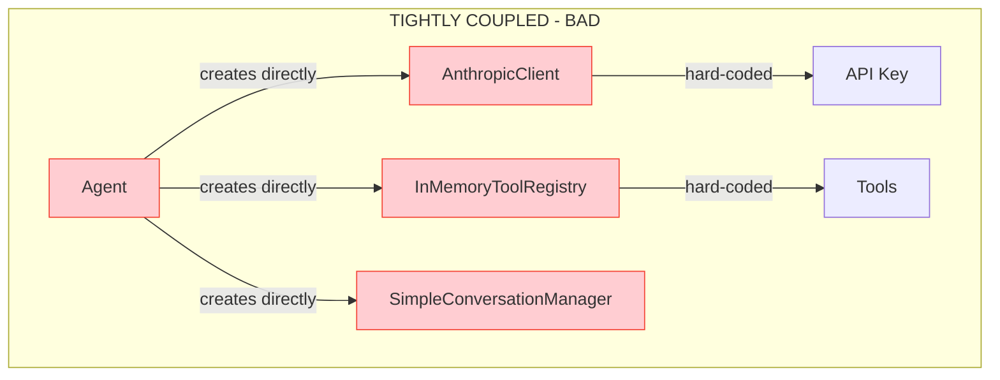
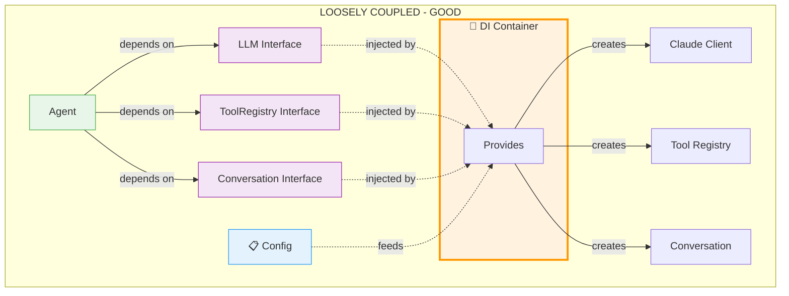
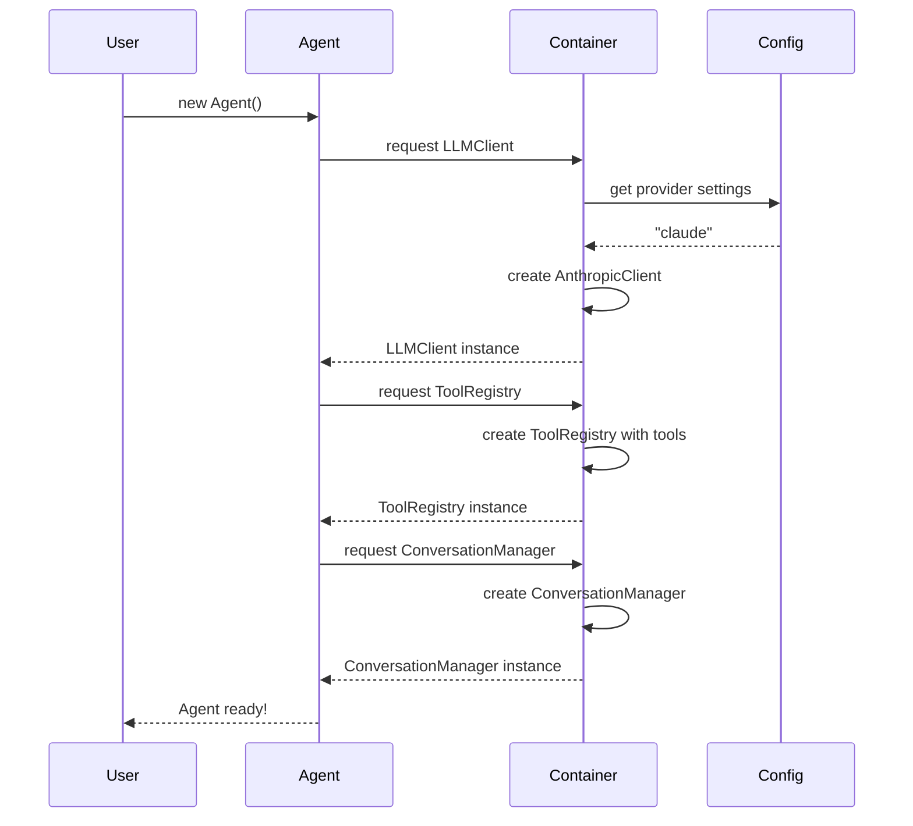

# Day 1, Tutorial 12: Dependency Injection - Wiring Everything Together

**Course:** Build Your Own Coding Agent  
**Day:** 1  
**Tutorial:** 12 of 288  
**Estimated Time:** 60 minutes

---

## 🎯 What You'll Learn

By the end of this tutorial, you'll:
- Understand why dependency injection is critical for testable, maintainable code
- Implement a simple dependency injection container
- Use factory functions for creating components
- Apply constructor injection to wire up our Agent
- Manage configuration across the application
- Enable lazy initialization for expensive resources
- Swap implementations at runtime without code changes

---

## 🧩 Why Dependency Injection Matters

Remember in Tutorial 11 when we designed interfaces? We created contracts like `LLMClient`, `ToolRegistry`, and `ConversationManager`. But we still need a way to connect actual implementations to these interfaces.

Without dependency injection, we'd have **tight coupling**:



Problems with tight coupling:
- **Hard to test** - Can't replace components with mocks
- **Hard to swap** - Changing LLM requires editing Agent code
- **Hard to configure** - No central place for settings
- **Fragile** - Changes to one component break others

With dependency injection, we get **loose coupling**:



Benefits of dependency injection:
- **Easy testing** - Swap real implementations with mocks
- **Easy swapping** - Change implementations via configuration
- **Centralized config** - One place for all settings
- **Flexible initialization** - Lazy loading of expensive resources
- **Clear dependencies** - Explicit about what each component needs

---

## 🎯 Our Goal: Working DI Container

By the end of this tutorial, we'll have:

1. A **DI Container** that manages component creation
2. **Factory functions** for each component type
3. **Configuration management** from environment variables
4. **Constructor injection** in the Agent class
5. **Lazy initialization** for expensive resources
6. **Runtime switching** between implementations



---

## 🛠️ Let's Build It

### Step 1: Create the Container Module

The DI container is the heart of our wiring system. It knows how to create each component and manages their lifecycles.

```python
# src/coding_agent/container.py
"""
Dependency Injection Container - Wires up all components.

This module provides a DI container that:
- Registers component factories
- Manages component lifecycles (singleton, transient)
- Handles configuration
- Enables lazy initialization

Why use a container?
- Centralizes component creation
- Makes testing easy (swap with mocks)
- Enables runtime configuration
- Manages complex dependencies
"""

from typing import (
    Type, TypeVar, Callable, Dict, Any, Optional, 
    get_type_hints, get_origin, get_args
)
from dataclasses import dataclass, field
from enum import Enum
import logging
import os

logger = logging.getLogger(__name__)

# Type variable for generic factory functions
T = TypeVar('T')


class Lifecycle(Enum):
    """Component lifecycle options."""
    TRANSIENT = "transient"  # New instance every time
    SINGLETON = "singleton"  # One instance, shared


@dataclass
class Registration:
    """
    A component registration in the container.
    
    Attributes:
        factory: Function that creates the component
        lifecycle: How the component is instantiated
        instance: Cached singleton instance
    """
    factory: Callable[..., Any]
    lifecycle: Lifecycle = Lifecycle.TRANSIENT
    instance: Optional[Any] = None


class Container:
    """
    Dependency Injection Container.
    
    The container manages all component creation. You register
    factories, then resolve instances when needed.
    
    Example:
        container = Container()
        
        # Register components
        container.register(LLMClient, lambda: AnthropicClient(), Lifecycle.SINGLETON)
        container.register(ToolRegistry, lambda: ToolRegistry(), Lifecycle.SINGLETON)
        
        # Resolve when needed
        llm = container.resolve(LLMClient)
    
    Architecture:
    ┌─────────────────────────────────────────────────────────┐
    │                        Container                        │
    │  ┌─────────────────────────────────────────────────────┐│
    │  │              registrations: Dict                   ││
    │  │  {LLMClient → Registration(factory, singleton)}    ││
    │  │  {ToolRegistry → Registration(...)}                 ││
    │  │  {ConversationManager → Registration(...)}         ││
    │  └─────────────────────────────────────────────────────┘│
    │  ┌─────────────────────────────────────────────────────┐│
    │  │                 resolve(type) → instance            ││
    │  └─────────────────────────────────────────────────────┘│
    └─────────────────────────────────────────────────────────┘
    """
    
    def __init__(self):
        """Initialize an empty container."""
        self._registrations: Dict[Type, Registration] = {}
        self._config: Dict[str, Any] = {}
        
        logger.info("Container created")
    
    def register(
        self, 
        interface: Type[T], 
        factory: Callable[..., T],
        lifecycle: Lifecycle = Lifecycle.TRANSIENT
    ) -> None:
        """
        Register a component with the container.
        
        Args:
            interface: The abstract type (interface class)
            factory: Function that creates the instance
            lifecycle: TRANSIENT (new each time) or SINGLETON (shared)
            
        Example:
            # Singleton - one instance shared
            container.register(
                LLMClient, 
                lambda: AnthropicClient(api_key="xxx"),
                Lifecycle.SINGLETON
            )
            
            # Transient - new instance each time
            container.register(
                ConversationManager,
                lambda: ConversationManager(max_tokens=100000),
                Lifecycle.TRANSIENT
            )
        """
        self._registrations[interface] = Registration(
            factory=factory,
            lifecycle=lifecycle
        )
        logger.debug(f"Registered {interface.__name__} as {lifecycle.value}")
    
    def register_instance(self, interface: Type[T], instance: T) -> None:
        """
        Register an already-created instance.
        
        This is useful for registering mocks during testing or
        pre-configured components.
        
        Args:
            interface: The interface type
            instance: The instance to register
            
        Example:
            # Register a mock for testing
            mock_client = MockLLMClient()
            container.register_instance(LLMClient, mock_client)
        """
        self._registrations[interface] = Registration(
            factory=lambda: instance,
            lifecycle=Lifecycle.SINGLETON,
            instance=instance
        )
        logger.debug(f"Registered instance for {interface.__name__}")
    
    def register_factory(
        self, 
        interface: Type[T], 
        factory: Callable[..., T]
    ) -> None:
        """
        Register a factory function (shorthand for TRANSIENT).
        
        Args:
            interface: The interface type
            factory: Function that creates the instance
        """
        self.register(interface, factory, Lifecycle.TRANSIENT)
    
    def resolve(self, interface: Type[T]) -> T:
        """
        Resolve an instance of the given type.
        
        This is where the magic happens - the container creates
        the instance (or returns cached singleton) for you.
        
        Args:
            interface: The interface type to resolve
            
        Returns:
            An instance of the requested type
            
        Raises:
            KeyError: If the type isn't registered
            Exception: If the factory fails
            
        Example:
            llm_client = container.resolve(LLMClient)
            tool_registry = container.resolve(ToolRegistry)
        """
        if interface not in self._registrations:
            raise KeyError(
                f"{interface.__name__} is not registered. "
                f"Available: {list(self._registrations.keys())}"
            )
        
        registration = self._registrations[interface]
        
        # For singletons, return cached instance
        if registration.lifecycle == Lifecycle.SINGLETON:
            if registration.instance is None:
                logger.debug(f"Creating singleton for {interface.__name__}")
                registration.instance = registration.factory()
            return registration.instance
        
        # For transient, create new instance each time
        logger.debug(f"Creating new {interface.__name__}")
        return registration.factory()
    
    def resolve_with_kwargs(
        self, 
        interface: Type[T], 
        **kwargs: Any
    ) -> T:
        """
        Resolve with additional keyword arguments.
        
        This allows passing context-specific parameters when
        resolving, useful for per-request customization.
        
        Args:
            interface: The interface type
            **kwargs: Additional arguments for the factory
            
        Returns:
            An instance with the given kwargs
        """
        if interface not in self._registrations:
            raise KeyError(f"{interface.__name__} is not registered")
        
        registration = self._registrations[interface]
        
        # Create with kwargs (always transient when using kwargs)
        logger.debug(f"Creating {interface.__name__} with kwargs: {list(kwargs.keys())}")
        return registration.factory(**kwargs)
    
    def is_registered(self, interface: Type[T]) -> bool:
        """
        Check if a type is registered.
        
        Args:
            interface: The interface type to check
            
        Returns:
            True if registered, False otherwise
        """
        return interface in self._registrations
    
    def clear(self) -> None:
        """Clear all registrations and cached instances."""
        self._registrations.clear()
        self._config.clear()
        logger.info("Container cleared")
    
    def clear_singletons(self) -> None:
        """Clear only singleton instances (keep registrations)."""
        for reg in self._registrations.values():
            reg.instance = None
        logger.debug("Singleton instances cleared")
    
    def __repr__(self) -> str:
        return (
            f"Container("
            f"registrations={len(self._registrations)}, "
            f"config={len(self._config)})"
        )


# Global container instance
_global_container: Optional[Container] = None


def get_global_container() -> Container:
    """
    Get the global container instance.
    
    This provides a convenient way to access the container
    from anywhere in the application.
    
    Returns:
        The global Container instance
    """
    global _global_container
    if _global_container is None:
        _global_container = Container()
    return _global_container


def set_global_container(container: Container) -> None:
    """
    Set the global container instance.
    
    This is useful for testing where you want to replace
    the entire container with a mock.
    
    Args:
        container: The Container to use as global
    """
    global _global_container
    _global_container = container
    logger.info(f"Global container set to: {container}")
```

### Step 2: Create the Configuration Module

Now let's create a configuration module that loads settings from environment variables and provides them to the container.

```python
# src/coding_agent/config.py
"""
Configuration Management - Centralized settings for the agent.

This module handles:
- Loading from environment variables
- Providing defaults
- Validating configuration
- Type coercion

Why centralized config?
- Single source of truth
- Easy to change settings
- Validation in one place
- Type safety
"""

from dataclasses import dataclass, field
from typing import Optional, Dict, Any, List
from enum import Enum
import os
import logging
from pathlib import Path

logger = logging.getLogger(__name__)


class LLMProvider(Enum):
    """Supported LLM providers."""
    ANTHROPIC = "anthropic"
    OPENAI = "openai"
    OLLAMA = "ollama"
    MOCK = "mock"


@dataclass
class LLMConfig:
    """Configuration for LLM settings."""
    provider: LLMProvider = LLMProvider.ANTHROPIC
    model: str = "claude-3-5-sonnet-20241022"
    api_key: Optional[str] = None
    base_url: Optional[str] = None
    temperature: float = 0.7
    max_tokens: int = 4096
    max_context_tokens: int = 200000
    timeout: int = 60


@dataclass
class AgentConfig:
    """Configuration for the agent itself."""
    name: str = "Coding Agent"
    version: str = "0.1.0"
    log_level: str = "INFO"
    verbose_events: bool = False
    working_directory: str = "."
    auto_save_history: bool = True
    max_history_tokens: int = 100000


@dataclass
class SecurityConfig:
    """Security-related configuration."""
    allow_shell_commands: bool = True
    allowed_commands: List[str] = field(default_factory=lambda: ["ls", "cat", "grep", "git"])
    blocked_commands: List[str] = field(default_factory=lambda: ["rm -rf", "dd", ":(){:|:&};:"])
    confirm_destructive: bool = True
    max_file_size_mb: int = 10
    sandboxed: bool = False


@dataclass
class AppConfig:
    """
    Root configuration object.
    
    This aggregates all configuration sections and provides
    a single object to pass around.
    
    Example:
        config = load_config()
        
        # Access nested config
        llm_config = config.llm
        agent_config = config.agent
        
        # Override via code
        config.llm.model = "claude-3-5-haiku-20240307"
    """
    llm: LLMConfig = field(default_factory=LLMConfig)
    agent: AgentConfig = field(default_factory=AgentConfig)
    security: SecurityConfig = field(default_factory=SecurityConfig)
    
    # Raw environment for advanced access
    env: Dict[str, str] = field(default_factory=dict)
    
    def __post_init__(self):
        """Load from environment after creation."""
        self._load_from_env()
    
    def _load_from_env(self):
        """Load configuration from environment variables."""
        # LLM Configuration
        provider = os.environ.get("LLM_PROVIDER", "anthropic").lower()
        self.llm.provider = LLMProvider(provider)
        
        self.llm.model = os.environ.get(
            "LLM_MODEL", 
            self.llm.model
        )
        self.llm.api_key = os.environ.get("API_KEY") or os.environ.get("ANTHROPIC_API_KEY")
        self.llm.base_url = os.environ.get("LLM_BASE_URL")
        
        self.llm.temperature = float(os.environ.get("TEMPERATURE", str(self.llm.temperature)))
        self.llm.max_tokens = int(os.environ.get("MAX_TOKENS", str(self.llm.max_tokens)))
        self.llm.max_context_tokens = int(os.environ.get("MAX_CONTEXT_TOKENS", str(self.llm.max_context_tokens)))
        self.llm.timeout = int(os.environ.get("LLM_TIMEOUT", str(self.llm.timeout)))
        
        # Agent Configuration
        self.agent.name = os.environ.get("AGENT_NAME", self.agent.name)
        self.agent.version = os.environ.get("AGENT_VERSION", self.agent.version)
        self.agent.log_level = os.environ.get("LOG_LEVEL", self.agent.log_level)
        self.agent.verbose_events = os.environ.get("VERBOSE_EVENTS", "").lower() == "true"
        self.agent.working_directory = os.environ.get("WORKING_DIR", self.agent.working_directory)
        self.agent.auto_save_history = os.environ.get("AUTO_SAVE_HISTORY", "").lower() != "false"
        self.agent.max_history_tokens = int(os.environ.get("MAX_HISTORY_TOKENS", str(self.agent.max_history_tokens)))
        
        # Security Configuration
        self.security.allow_shell_commands = os.environ.get("ALLOW_SHELL", "true").lower() != "false"
        self.security.confirm_destructive = os.environ.get("CONFIRM_DESTRUCTIVE", "true").lower() != "false"
        self.security.max_file_size_mb = int(os.environ.get("MAX_FILE_SIZE_MB", str(self.security.max_file_size_mb)))
        self.security.sandboxed = os.environ.get("SANDBOXED", "").lower() == "true"
        
        # Store raw env for advanced access
        self.env = dict(os.environ)
        
        logger.info(f"Configuration loaded: provider={self.llm.provider.value}, model={self.llm.model}")


def load_config(**overrides) -> AppConfig:
    """
    Load configuration with optional overrides.
    
    Args:
        **overrides: Configuration values to override
        
    Returns:
        AppConfig instance
        
    Example:
        # Load from environment
        config = load_config()
        
        # Override specific values
        config = load_config(llm={"model": "claude-3-5-haiku-20240307"})
        config = load_config(agent={"log_level": "DEBUG"})
    """
    config = AppConfig()
    
    # Apply overrides
    for key, value in overrides.items():
        if hasattr(config, key):
            section = getattr(config, key)
            if isinstance(section, dict):
                section.update(value)
            elif hasattr(section, '__dataclass_fields__'):
                # It's a dataclass - update fields
                for k, v in value.items():
                    if hasattr(section, k):
                        setattr(section, k, v)
    
    return config


def get_config() -> AppConfig:
    """
    Get the global configuration (singleton).
    
    Returns:
        The global AppConfig instance
    """
    if not hasattr(get_config, '_config'):
        get_config._config = load_config()
    return get_config._config
```

### Step 3: Create Factory Functions

Now let's create the factory functions that the container will use to create components.

```python
# src/coding_agent/factories.py
"""
Factory Functions - Create component instances.

These factories are registered with the DI container to create
components when needed. Each factory knows how to instantiate
its component with the right configuration.

Why factories?
- Encapsulate creation logic
- Handle dependencies between components
- Apply configuration
- Enable dependency injection
"""

from typing import Optional
import logging

from coding_agent.config import AppConfig, get_config
from coding_agent.interfaces import (
    LLMClient,
    ToolRegistry,
    ConversationManager,
    EventEmitter,
)
from coding_agent.container import Container

logger = logging.getLogger(__name__)


def create_llm_client(config: Optional[AppConfig] = None) -> LLMClient:
    """
    Create an LLM client based on configuration.
    
    This factory reads the config to determine which LLM
    provider to use, then creates the appropriate client.
    
    Args:
        config: Configuration (uses global if not provided)
        
    Returns:
        LLMClient implementation
        
    Example:
        client = create_llm_client()
        client.complete("Hello")
    """
    config = config or get_config()
    provider = config.llm.provider.value
    model = config.llm.model
    api_key = config.llm.api_key
    base_url = config.llm.base_url
    
    logger.info(f"Creating LLM client: provider={provider}, model={model}")
    
    if provider == "anthropic":
        from coding_agent.llm import AnthropicClient
        return AnthropicClient(
            model=model,
            api_key=api_key,
            temperature=config.llm.temperature,
            max_tokens=config.llm.max_tokens,
            max_context_tokens=config.llm.max_context_tokens,
            timeout=config.llm.timeout,
        )
    
    elif provider == "openai":
        from coding_agent.llm import OpenAIClient
        return OpenAIClient(
            model=model,
            api_key=api_key,
            base_url=base_url,
            temperature=config.llm.temperature,
            max_tokens=config.llm.max_tokens,
            timeout=config.llm.timeout,
        )
    
    elif provider == "ollama":
        from coding_agent.llm import OllamaClient
        return OllamaClient(
            model=model,
            base_url=base_url or "http://localhost:11434",
            temperature=config.llm.temperature,
            max_tokens=config.llm.max_tokens,
        )
    
    elif provider == "mock":
        from coding_agent.llm import MockLLMClient
        return MockLLMClient(
            model=model,
            temperature=config.llm.temperature,
        )
    
    else:
        raise ValueError(f"Unknown LLM provider: {provider}")


def create_tool_registry(config: Optional[AppConfig] = None) -> ToolRegistry:
    """
    Create a tool registry with all built-in tools.
    
    This factory creates the registry and registers all
    the tools our agent can use.
    
    Args:
        config: Configuration (uses global if not provided)
        
    Returns:
        ToolRegistry with registered tools
    """
    config = config or get_config()
    
    from coding_agent.tools import ToolRegistry as RegistryClass
    
    registry = RegistryClass()
    
    # Register built-in tools
    from coding_agent.tools.files import ReadFileTool, WriteFileTool, ListDirectoryTool
    from coding_agent.tools.shell import ShellTool
    from coding_agent.tools.search import SearchTool, GrepTool
    from coding_agent.tools.edit import EditTool
    from coding_agent.tools.git import GitTool
    
    # File tools
    registry.register(ReadFileTool())
    registry.register(WriteFileTool())
    registry.register(ListDirectoryTool())
    
    # Shell tool (if enabled)
    if config.security.allow_shell_commands:
        shell_tool = ShellTool(
            allowed_commands=config.security.allowed_commands,
            blocked_commands=config.security.blocked_commands,
            confirm_destructive=config.security.confirm_destructive,
        )
        registry.register(shell_tool)
    
    # Search tools
    registry.register(SearchTool())
    registry.register(GrepTool())
    
    # Edit tool
    registry.register(EditTool())
    
    # Git tool
    registry.register(GitTool())
    
    logger.info(f"Tool registry created with {len(registry.list_tools())} tools")
    
    return registry


def create_conversation_manager(
    config: Optional[AppConfig] = None
) -> ConversationManager:
    """
    Create a conversation manager.
    
    Args:
        config: Configuration (uses global if not provided)
        
    Returns:
        ConversationManager implementation
    """
    config = config or get_config()
    
    from coding_agent.context import ConversationManager as ConvClass
    
    return ConvClass(
        max_tokens=config.agent.max_history_tokens,
        auto_save=config.agent.auto_save_history,
    )


def create_event_emitter(config: Optional[AppConfig] = None) -> EventEmitter:
    """
    Create an event emitter with observers.
    
    This creates the event system and attaches observers
    for logging, debugging, and metrics.
    
    Args:
        config: Configuration (uses global if not provided)
        
    Returns:
        EventEmitter with attached observers
    """
    config = config or get_config()
    
    from coding_agent.events import EventEmitter as EventClass, LoggingObserver
    
    emitter = EventClass()
    
    # Add logging observer
    logging_observer = LoggingObserver(
        level=config.agent.log_level,
        verbose=config.agent.verbose_events
    )
    emitter.subscribe(logging_observer)
    
    logger.debug("Event emitter created with logging observer")
    
    return emitter


def create_container(config: Optional[AppConfig] = None) -> Container:
    """
    Create and configure a DI container.
    
    This is a convenience function that sets up the entire
    container with all component factories.
    
    Args:
        config: Configuration (uses global if not provided)
        
    Returns:
        Fully configured Container
        
    Example:
        # Quick setup
        container = create_container()
        agent = Agent(container=container)
        
        # Or with custom config
        config = load_config(llm={"provider": "ollama"})
        container = create_container(config)
    """
    from coding_agent.container import Container, Lifecycle
    
    config = config or get_config()
    container = Container()
    
    # Register factories
    container.register(LLMClient, lambda: create_llm_client(config), Lifecycle.SINGLETON)
    container.register(ToolRegistry, lambda: create_tool_registry(config), Lifecycle.SINGLETON)
    container.register(ConversationManager, lambda: create_conversation_manager(config), Lifecycle.SINGLETON)
    container.register(EventEmitter, lambda: create_event_emitter(config), Lifecycle.SINGLETON)
    
    logger.info(f"Container configured with {len(container._registrations)} registrations")
    
    return container
```

### Step 4: Update the Agent to Use Constructor Injection

Now let's update the Agent class to use dependency injection instead of creating its own components.

```python
# Update src/coding_agent/agent.py to use DI

# Replace the __init__ method with this:

def __init__(
    self,
    container: Optional[Container] = None,
    config: Optional[AppConfig] = None,
):
    """
    Initialize the Agent with dependency injection.
    
    This uses constructor injection - all dependencies are
    provided via the constructor, making the Agent easy to
    test and configure.
    
    Args:
        container: DI Container (creates default if None)
        config: Configuration (uses global if None)
        
    Example:
        # Default - uses global container and config
        agent = Agent()
        
        # Custom container
        container = create_container()
        agent = Agent(container=container)
        
        # With custom config
        config = load_config(llm={"model": "claude-3-5-haiku"})
        agent = Agent(config=config)
    """
    # Use provided or create defaults
    self._config = config or get_config()
    self._container = container or get_global_container()
    
    # Ensure container has factories registered
    self._ensure_container_configured()
    
    # Resolve dependencies from container (this is the DI magic!)
    logger.info("Resolving dependencies from container...")
    
    self._llm: LLMClient = self._container.resolve(LLMClient)
    self._tools: ToolRegistry = self._container.resolve(ToolRegistry)
    self._conversation: ConversationManager = self._container.resolve(ConversationManager)
    self._events: EventEmitter = self._container.resolve(EventEmitter)
    
    # Command history
    self._command_history: List[CommandResult] = []
    
    logger.info(f"Agent initialized: LLM={self._llm.provider_name}, tools={len(self._tools.list_tools())}")
    self._events.emit("agent_initialized", {
        "provider": self.llm_provider,
        "tools_count": len(self._tools.list_tools())
    })

def _ensure_container_configured(self):
    """Ensure the container has all necessary registrations."""
    from coding_agent.container import Lifecycle
    
    # Register if not already registered
    if not self._container.is_registered(LLMClient):
        self._container.register(
            LLMClient, 
            lambda: create_llm_client(self._config),
            Lifecycle.SINGLETON
        )
    
    if not self._container.is_registered(ToolRegistry):
        self._container.register(
            ToolRegistry,
            lambda: create_tool_registry(self._config),
            Lifecycle.SINGLETON
        )
    
    if not self._container.is_registered(ConversationManager):
        self._container.register(
            ConversationManager,
            lambda: create_conversation_manager(self._config),
            Lifecycle.SINGLETON
        )
    
    if not self._container.is_registered(EventEmitter):
        self._container.register(
            EventEmitter,
            lambda: create_event_emitter(self._config),
            Lifecycle.SINGLETON
        )
```

### Step 5: Add Lazy Initialization Support

Let's add lazy initialization for components that are expensive to create.

```python
# Add to src/coding_agent/container.py

class Lazy:
    """
    Lazy wrapper for deferred initialization.
    
    Use this when you want to defer creation of expensive
    resources until they're actually needed.
    
    Example:
        # This won't create the LLM client until first use
        lazy_llm = Lazy(lambda: create_llm_client())
        
        # First access - creates the instance
        client = lazy_llm.value
        
        # Second access - returns cached instance
        client2 = lazy_llm.value
        # client is same as client2
    """
    
    def __init__(self, factory: Callable[[], T]):
        """
        Initialize with a factory function.
        
        Args:
            factory: Function that creates the instance
        """
        self._factory = factory
        self._instance: Optional[T] = None
    
    @property
    def value(self) -> T:
        """Get the value, creating if necessary."""
        if self._instance is None:
            self._instance = self._factory()
        return self._instance
    
    def reset(self) -> None:
        """Reset the cached instance."""
        self._instance = None


# Add lazy resolution to Container
def resolve_lazy(self, interface: Type[T]) -> Lazy[T]:
    """
    Resolve lazily - create instance on first access.
    
    Args:
        interface: The interface type
        
    Returns:
        Lazy wrapper that creates instance on first access
        
    Example:
        # Won't create LLM until actually used
        lazy_llm = container.resolve_lazy(LLMClient)
        
        # Later...
        client = lazy_llm.value  # Now it creates the instance
    """
    return Lazy(lambda: self.resolve(interface))
```

---

## 🧪 Test It

### Test 1: Basic Container Usage

```python
# Test the container
from coding_agent.container import Container, Lifecycle, get_global_container
from coding_agent.config import load_config

# Create container
container = Container()

# Register a simple factory
class MyService:
    def __init__(self, name: str):
        self.name = name
    
    def greet(self):
        return f"Hello from {self.name}"

container.register(
    MyService,
    lambda: MyService("Test Service"),
    Lifecycle.SINGLETON
)

# Resolve twice - should get same instance (singleton)
service1 = container.resolve(MyService)
service2 = container.resolve(MyService)

print(f"Same instance: {service1 is service2}")  # True
print(f"Service says: {service1.greet()}")  # "Hello from Test Service"
```

### Test 2: Configuration Loading

```python
# Test configuration
from coding_agent.config import load_config, LLMProvider

# Load default config
config = load_config()
print(f"Provider: {config.llm.provider}")
print(f"Model: {config.llm.model}")
print(f"Log level: {config.agent.log_level}")

# Override via code
config2 = load_config()
config2.llm.model = "claude-3-5-haiku-20240307"
print(f"Overridden model: {config2.llm.model}")
```

### Test 3: Full Container Setup

```python
# Test complete container with factories
from coding_agent.factories import create_container
from coding_agent.config import load_config

# Create with default config
container = create_container()

# Verify registrations
print(f"LLM registered: {container.is_registered(LLMClient)}")
print(f"Tools registered: {container.is_registered(ToolRegistry)}")
print(f"Conversation registered: {container.is_registered(ConversationManager)}")
print(f"Events registered: {container.is_registered(EventEmitter)}")
```

### Test 4: Agent with DI

```python
# Test the Agent with DI
from coding_agent.agent import Agent

# Create agent - should use DI container
agent = Agent()

print(f"LLM provider: {agent.llm_provider}")
print(f"Tools available: {len(agent._tools.list_tools())}")

# Test a command
response = agent.run("/help")
print(f"Help output: {response[:100]}...")
```

### Test 5: Runtime Provider Switching

```python
# Test switching LLM providers at runtime
import os

# Set to mock for testing
os.environ["LLM_PROVIDER"] = "mock"
os.environ["LLM_MODEL"] = "test-model"

# Create new container with mock
from coding_agent.factories import create_container
container = create_container()

# Create agent with mock
agent = Agent(container=container)
print(f"Provider: {agent.llm_provider}")  # Should be "mock"

# Now switch to another provider (simulated)
class MockProviderSwitch:
    @property
    def provider_name(self) -> str:
        return "switched"
    
    def complete(self, prompt, **kwargs):
        return "Switched provider response!"

# At runtime, you can swap the LLM
agent._llm = MockProviderSwitch()
response = agent.run("Hello")
print(f"After switch: {response}")
```

---

## 🎯 Exercise: Add a New Component with DI

**Task:** Add a new `MetricsCollector` component to track agent usage metrics.

**Requirements:**
1. Create an interface in `interfaces/metrics.py`
2. Create an implementation in `metrics/collector.py`
3. Register it with the container
4. Inject it into the Agent

**Solution:**

```python
# Step 1: Create interface (src/coding_agent/interfaces/metrics.py)
from abc import ABC, abstractmethod
from dataclasses import dataclass
from typing import Dict, Any

@dataclass
class Metrics:
    total_requests: int = 0
    total_tokens: int = 0
    total_tool_calls: int = 0

class MetricsCollector(ABC):
    @abstractmethod
    def record_request(self, tokens: int):
        pass
    
    @abstractmethod
    def record_tool_call(self, tool_name: str):
        pass
    
    @abstractmethod
    def get_metrics(self) -> Metrics:
        pass

# Step 2: Create implementation (src/coding_agent/metrics/collector.py)
from coding_agent.interfaces.metrics import MetricsCollector, Metrics

class InMemoryMetricsCollector(MetricsCollector):
    def __init__(self):
        self._metrics = Metrics()
    
    def record_request(self, tokens: int):
        self._metrics.total_requests += 1
        self._metrics.total_tokens += tokens
    
    def record_tool_call(self, tool_name: str):
        self._metrics.total_tool_calls += 1
    
    def get_metrics(self) -> Metrics:
        return self._metrics

# Step 3: Register with container
from coding_agent.factories import create_container

container = create_container()
container.register(
    MetricsCollector,
    lambda: InMemoryMetricsCollector()
)

# Step 4: Inject into Agent
class Agent:
    def __init__(self, metrics: MetricsCollector = None):
        self._metrics = metrics or container.resolve(MetricsCollector)
    
    def run(self, user_input: str) -> str:
        # Record the request
        self._metrics.record_request(len(user_input))
        # ... rest of run method
```

---

## 🐛 Common Pitfalls

### 1. Circular Dependencies

**Problem:** Component A needs B, B needs A - infinite loop!

**Solution:** Use lazy resolution or dependency injection:
```python
# Bad - creates circular dependency
class A:
    def __init__(self):
        self.b = B()  # B might need A!

# Good - inject dependencies
class A:
    def __init__(self, b: B):
        self.b = b  # B is passed in, not created

# Or use lazy resolution
class A:
    def __init__(self):
        self._b = None
    
    @property
    def b(self):
        if self._b is None:
            self._b = create_b()  # Create on demand
        return self._b
```

### 2. Forgetting to Register

**Problem:** "Type is not registered" error

**Solution:** Ensure all dependencies are registered:
```python
# Always register before resolving
container.register(LLMClient, factory, Lifecycle.SINGLETON)
client = container.resolve(LLMClient)  # Works now
```

### 3. Singleton vs Transient Confusion

**Problem:** Getting same instance when you want new ones (or vice versa)

**Solution:** Choose the right lifecycle:
```python
# Use TRANSIENT for components with state you don't want to share
container.register(
    ConversationManager,
    lambda: ConversationManager(),
    Lifecycle.TRANSIENT  # New conversation each time
)

# Use SINGLETON for stateless or shared resources
container.register(
    LLMClient,
    lambda: AnthropicClient(),
    Lifecycle.SINGLETON  # Same client shared
)
```

### 4. Not Using the Container

**Problem:** Creating components directly instead of via container

**Solution:** Always use the container:
```python
# Bad - creates tight coupling
agent = Agent()
agent._llm = AnthropicClient()  # Directly creates!

# Good - uses container
container = create_container()
agent = Agent(container=container)  # Container provides components
```

---

## 📝 Key Takeaways

- ✅ **DI Container** centralizes component creation and management
- ✅ **Constructor injection** passes dependencies via constructor parameters
- ✅ **Factory functions** encapsulate creation logic for each component
- ✅ **Configuration management** loads settings from environment variables
- ✅ **Singleton lifecycle** shares one instance across the application
- ✅ **Transient lifecycle** creates new instance each time
- ✅ **Lazy initialization** defers expensive creation until needed
- ✅ **Runtime swapping** allows changing implementations without code changes
- ✅ **Easy testing** - swap real implementations with mocks
- ✅ **Clear dependencies** - explicit about what each component needs

---

## 🎯 Next Tutorial

In **Tutorial 13**, we'll continue with hands-on implementation. We'll build out:

- The full Agent implementation using all our interfaces
- Connect the LLM client to actual APIs (Anthropic, OpenAI)
- Wire up all components through the container
- Test the complete system end-to-end

This ties together everything we've learned - interfaces, DI, configuration - into a working agent!

---

## ✅ Commit Your Work

```bash
# Stage the new files
git add src/coding_agent/container.py
git add src/coding_agent/config.py
git add src/coding_agent/factories.py
git add src/coding_agent/agent.py  # Updated with DI

# Commit with descriptive message
git commit -m "Tutorial 12: Implement Dependency Injection

- Create Container class for DI management
  - Register factories for component creation
  - Singleton and transient lifecycle support
  - Lazy initialization with Lazy wrapper
  - Global container for app-wide access

- Create Configuration module (AppConfig)
  - Load from environment variables
  - LLM, Agent, and Security config sections
  - Type coercion and validation

- Create factory functions
  - create_llm_client() - provider-specific
  - create_tool_registry() - all built-in tools
  - create_conversation_manager()
  - create_event_emitter()
  - create_container() - full setup

- Update Agent to use constructor injection
  - Resolve dependencies from container
  - _ensure_container_configured() method

Enables:
- Testable components with mocks
- Swappable LLM providers at runtime
- Centralized configuration
- Lazy loading of expensive resources

Following SOLID:
- DIP: Dependencies injected, not created
- OCP: New components via registration, not code changes

Tutorial 12/24 for Day 1 - Foundation complete!"

git push origin main
```

**Your dependency injection system is now complete!** 🎉

You now have a fully wired application where:
- All components are created by the container
- Configuration comes from environment variables
- Components can be swapped at runtime
- Testing is easy with mocks

---

*This is tutorial 12/24 for Day 1. We're building the foundation for our coding agent!*

---

## 📚 Additional Resources

- [Dependency Injection Wikipedia](https://en.wikipedia.org/wiki/Dependency_injection)
- [Python typing module](https://docs.python.org/3/library/typing.html)
- [Martin Fowler on DI](https://martinfowler.com/articles/injection.html)
- [Python dataclasses](https://docs.python.org/3/library/dataclasses.html)
- [Environment variables in Python](https://docs.python.org/3/library/os.html#os.environ)