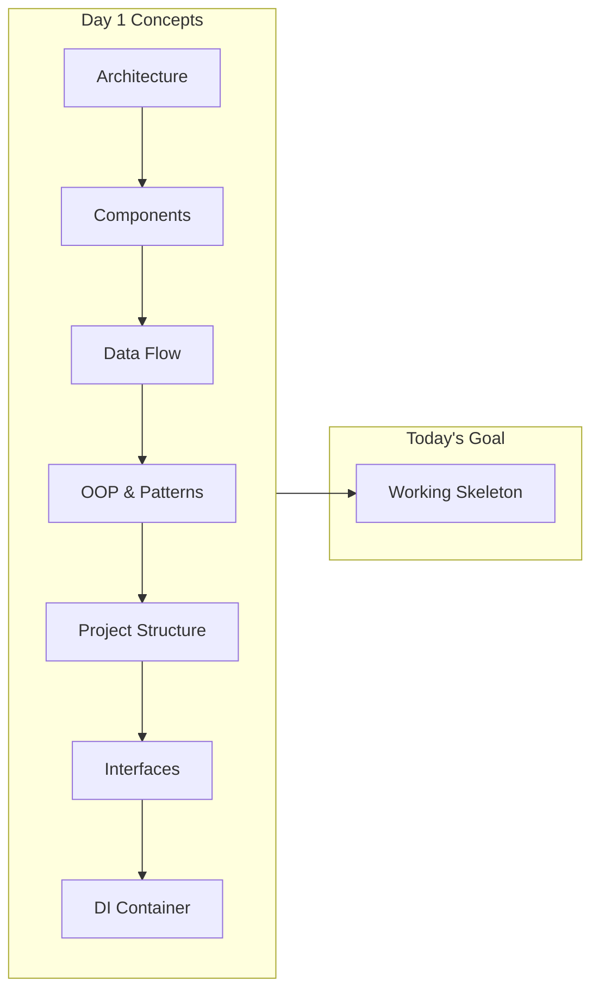

# Day 1, Tutorial 13: Build the Skeleton Architecture - Hands-On

**Course:** Build Your Own Coding Agent  
**Day:** 1  
**Tutorial:** 13 of 288  
**Estimated Time:** 90 minutes

---

## 🎯 What You'll Learn

By the end of this tutorial, you'll:
- Consolidate all concepts from Day 1 (Tutorials 1-12)
- Build a complete, working skeleton of our coding agent
- Create the full project structure with all modules
- Implement the core Agent class with dependency injection
- Set up logging and error handling
- Verify the skeleton runs end-to-end
- Prepare the foundation for Day 2 (LLM integration)

---

## 🧩 From Theory to Code: Building Our Skeleton

We've covered a lot of ground in Day 1:



Today, we transform all that theory into **working code**. We'll create a skeleton that's:
- **Functional** - Actually runs and responds to input
- **Extensible** - Easy to add new features
- **Testable** - Components can be swapped with mocks
- **Maintainable** - Clean structure others can understand

---

## 🏗️ Project Structure Overview

Here's the complete structure we'll create today:

```
coding-agent/
├── pyproject.toml
├── README.md
├── .gitignore
├── src/
│   └── coding_agent/
│       ├── __init__.py
│       ├── agent.py          # Main Agent class
│       ├── config.py         # Configuration
│       ├── llm/
│       │   ├── __init__.py
│       │   ├── client.py     # LLMClient interface
│       │   └── factory.py    # LLM factory
│       ├── tools/
│       │   ├── __init__.py
│       │   ├── registry.py   # ToolRegistry
│       │   └── base.py       # Base tool class
│       ├── context/
│       │   ├── __init__.py
│       │   └── manager.py    # ContextManager
│       ├──di/
│       │   ├── __init__.py
│       │   └── container.py  # Our DI Container
│       └── exceptions.py     # Custom exceptions
├── tests/
│   └── test_agent.py
└── scripts/
    └── run_agent.py
```

---

## 🛠️ Step 1: Set Up the Project Files

Let's create the complete skeleton. I'll show you each file and explain how it fits together.

### First, create the directory structure:

```bash
mkdir -p src/coding_agent/{llm,tools,context,di}
mkdir -p tests
mkdir -p scripts
```

---

### File 1: `src/coding_agent/__init__.py`

```python
"""
Coding Agent - Build Your Own AI Developer

A production-ready coding agent that can understand, plan,
execute, and verify code changes autonomously.
"""

__version__ = "0.1.0"
__author__ = "Your Name"
__description__ = "A coding agent like Claude Code"

from coding_agent.agent import Agent
from coding_agent.config import AgentConfig

__all__ = ["Agent", "AgentConfig", "__version__"]
```

**Why this file matters:**
- Makes `coding_agent` a proper Python package
- Exports the main classes for external use
- Version tracking for package management

---

### File 2: `src/coding_agent/exceptions.py`

```python
"""
Custom exceptions for the coding agent.
"""

from typing import Optional, Any


class CodingAgentError(Exception):
    """Base exception for all coding agent errors."""
    
    def __init__(self, message: str, details: Optional[dict] = None):
        super().__init__(message)
        self.message = message
        self.details = details or {}
    
    def __str__(self) -> str:
        if self.details:
            return f"{self.message} | Details: {self.details}"
        return self.message


class ConfigurationError(CodingAgentError):
    """Raised when there's a configuration issue."""
    pass


class LLMError(CodingAgentError):
    """Raised when the LLM client encounters an error."""
    pass


class ToolError(CodingAgentError):
    """Raised when a tool execution fails."""
    pass


class ToolNotFoundError(ToolError):
    """Raised when a requested tool doesn't exist."""
    pass


class ContextError(CodingAgentError):
    """Raised when there's an issue with context management."""
    pass


class ValidationError(CodingAgentError):
    """Raised when input validation fails."""
    pass


class SafetyError(CodingAgentError):
    """Raised when a safety check fails."""
    pass


class ExecutionError(CodingAgentError):
    """Raised when execution fails."""
    pass
```

**Why custom exceptions matter:**
- **Precise error handling** - Catch specific errors vs general ones
- **Better debugging** - Include context in exceptions
- **API design** - Users can catch specific error types

---

### File 3: `src/coding_agent/config.py`

```python
"""
Configuration management for the coding agent.
"""

import os
from dataclasses import dataclass, field
from typing import Optional, List
from pathlib import Path


@dataclass
class LLMConfig:
    """Configuration for the LLM provider."""
    
    provider: str = "anthropic"  # "anthropic", "openai", "ollama"
    model: str = "claude-3-5-sonnet-20241022"
    api_key: Optional[str] = None
    base_url: Optional[str] = None  # For custom endpoints
    
    # Generation parameters
    temperature: float = 0.7
    max_tokens: int = 4096
    top_p: float = 0.9
    
    # Timeout settings
    timeout: int = 60
    max_retries: int = 3
    
    def __post_init__(self):
        """Load API key from environment if not provided."""
        if self.api_key is None:
            if self.provider == "anthropic":
                self.api_key = os.environ.get("ANTHROPIC_API_KEY")
            elif self.provider == "openai":
                self.api_key = os.environ.get("OPENAI_API_KEY")
            elif self.provider == "ollama":
                self.base_url = self.base_url or "http://localhost:11434"
        
        if self.provider in ("anthropic", "openai") and not self.api_key:
            raise ValueError(
                f"No API key found for {self.provider}. "
                f"Set {self.provider.upper()}_API_KEY environment variable."
            )


@dataclass
class ToolConfig:
    """Configuration for tool execution."""
    
    # Security settings
    allowed_commands: List[str] = field(default_factory=lambda: [
        "git", "python", "pip", "npm", "node", "cargo", "go"
    ])
    denied_commands: List[str] = field(default_factory=lambda: [
        "rm -rf /", "del /f /s /q", "mkfs", "dd if="
    ])
    
    # File operation settings
    allowed_extensions: List[str] = field(default_factory=lambda: [
        ".py", ".js", ".ts", ".json", ".yaml", ".yml", ".md",
        ".txt", ".toml", ".ini", ".cfg", ".html", ".css"
    ])
    max_file_size: int = 10 * 1024 * 1024  # 10MB
    
    # Execution limits
    shell_timeout: int = 300  # 5 minutes
    max_parallel_tools: int = 3
    
    # Safety features
    require_confirmation_for_destructive: bool = True
    enable_sandbox: bool = True
    dry_run_available: bool = True


@dataclass
class ContextConfig:
    """Configuration for context management."""
    
    max_tokens: int = 100000
    max_messages: int = 100
    summary_enabled: bool = True
    summary_threshold: int = 0.8  # 80% of max tokens
    cache_enabled: bool = True
    cache_ttl: int = 3600  # 1 hour


@dataclass
class AgentConfig:
    """Main configuration for the coding agent."""
    
    # Project settings
    project_root: Path = Path(".")
    working_directory: Optional[Path] = None
    
    # Component configurations
    llm: LLMConfig = field(default_factory=LLMConfig)
    tools: ToolConfig = field(default_factory=ToolConfig)
    context: ContextConfig = field(default_factory=ContextConfig)
    
    # Agent behavior
    verbose: bool = True
    debug: bool = False
    auto_commit: bool = False
    
    # Feature flags
    enable_planning: bool = True
    enable_code_analysis: bool = True
    enable_multi_file_editing: bool = True
    
    def __post_init__(self):
        """Set default working directory."""
        if self.working_directory is None:
            self.working_directory = self.project_root
    
    def validate(self) -> bool:
        """Validate the configuration."""
        # Check project root exists
        if not self.project_root.exists():
            raise ValueError(f"Project root does not exist: {self.project_root}")
        
        # Check LLM config
        if not self.llm.api_key and self.llm.provider not in ("ollama",):
            raise ValueError(f"No API key configured for {self.llm.provider}")
        
        return True
```

**Why configuration matters:**
- **Centralized settings** - One place to configure everything
- **Environment variables** - No hardcoded secrets
- **Dataclasses** - Type-safe, with validation
- **Nested config** - LLM, Tools, Context each have their own settings

---

### File 4: `src/coding_agent/llm/__init__.py`

```python
"""LLM module - Language model client implementations."""

from coding_agent.llm.client import LLMClient, LLMResponse
from coding_agent.llm.factory import create_llm_client

__all__ = ["LLMClient", "LLMResponse", "create_llm_client"]
```

---

### File 5: `src/coding_agent/llm/client.py`

```python
"""
LLM Client interface and base implementation.

This module defines the contract for LLM interactions,
allowing us to swap between different providers (Anthropic, OpenAI, Ollama).
"""

from abc import ABC, abstractmethod
from dataclasses import dataclass
from typing import List, Dict, Any, Optional
import logging

logger = logging.getLogger(__name__)


@dataclass
class LLMResponse:
    """Response from an LLM call."""
    
    content: str
    model: str
    usage: Dict[str, int]  # {"prompt": 100, "completion": 50, "total": 150}
    finish_reason: str  # "stop", "length", "error"
    raw_response: Optional[Dict[str, Any]] = None
    
    @property
    def input_tokens(self) -> int:
        return self.usage.get("prompt", 0)
    
    @property
    def output_tokens(self) -> int:
        return self.usage.get("completion", 0)


@dataclass
class Message:
    """A single message in the conversation."""
    
    role: str  # "system", "user", "assistant"
    content: str
    tool_calls: Optional[List[Dict[str, Any]]] = None
    tool_call_id: Optional[str] = None


class LLMClient(ABC):
    """
    Abstract base class for LLM clients.
    
    This defines the interface all LLM implementations must follow,
    enabling us to swap providers without changing the rest of the code.
    
    Usage:
        class MyClient(LLMClient):
            def _call_api(self, messages, params):
                # Implementation
                pass
    """
    
    def __init__(
        self,
        api_key: str,
        model: str = "claude-3-5-sonnet-20241022",
        temperature: float = 0.7,
        max_tokens: int = 4096,
        timeout: int = 60,
    ):
        """
        Initialize the LLM client.
        
        Args:
            api_key: API key for authentication
            model: Model identifier
            temperature: Sampling temperature (0-2)
            max_tokens: Maximum tokens to generate
            timeout: Request timeout in seconds
        """
        self.api_key = api_key
        self.model = model
        self.temperature = temperature
        self.max_tokens = max_tokens
        self.timeout = timeout
        
        logger.info(f"Initialized {self.__class__.__name__} with model {model}")
    
    @abstractmethod
    def _call_api(
        self,
        messages: List[Message],
        params: Dict[str, Any]
    ) -> LLMResponse:
        """
        Make the actual API call. Must be implemented by subclasses.
        
        Args:
            messages: List of conversation messages
            params: Additional parameters (temperature, top_p, etc.)
            
        Returns:
            LLMResponse object
        """
        pass
    
    def complete(
        self,
        messages: List[Message],
        temperature: Optional[float] = None,
        max_tokens: Optional[int] = None,
        system_prompt: Optional[str] = None,
    ) -> LLMResponse:
        """
        Generate a completion for the given messages.
        
        This is the main entry point for LLM interactions.
        
        Args:
            messages: List of conversation messages
            temperature: Override default temperature
            max_tokens: Override default max tokens
            system_prompt: Optional system prompt to prepend
            
        Returns:
            LLMResponse with the model's response
        """
        # Build the message list
        full_messages = []
        
        if system_prompt:
            full_messages.append(Message(role="system", content=system_prompt))
        
        full_messages.extend(messages)
        
        # Build parameters
        params = {
            "temperature": temperature or self.temperature,
            "max_tokens": max_tokens or self.max_tokens,
        }
        
        logger.debug(f"Calling LLM with {len(full_messages)} messages")
        
        try:
            response = self._call_api(full_messages, params)
            logger.info(
                f"LLM response: {response.output_tokens} tokens "
                f"({response.finish_reason})"
            )
            return response
        except Exception as e:
            logger.error(f"LLM call failed: {e}")
            raise
    
    def __repr__(self) -> str:
        return f"{self.__class__.__name__}(model={self.model})"
```

**Why abstract base class:**
- **Interface definition** - Clear contract for implementations
- **Code reuse** - Common logic in base class
- **Easy testing** - Swap with mock implementations
- **Provider flexibility** - Switch between Anthropic, OpenAI, Ollama

---

### File 6: `src/coding_agent/llm/factory.py`

```python
"""
Factory for creating LLM clients.

This follows the Factory pattern to create the appropriate
LLM client based on configuration.
"""

from typing import Optional
import logging

from coding_agent.llm.client import LLMClient
from coding_agent.config import LLMConfig
from coding_agent.exceptions import ConfigurationError

logger = logging.getLogger(__name__)


def create_llm_client(config: LLMConfig) -> LLMClient:
    """
    Create an LLM client based on the configuration.
    
    This factory function abstracts away the details of
    creating different LLM clients.
    
    Args:
        config: LLM configuration
        
    Returns:
        LLMClient instance
        
    Raises:
        ConfigurationError: If provider is not supported
        
    Example:
        config = LLMConfig(provider="anthropic", model="claude-3-5-sonnet")
        client = create_llm_client(config)
    """
    provider = config.provider.lower()
    
    if provider == "anthropic":
        from coding_agent.llm.anthropic import AnthropicClient
        logger.info("Creating Anthropic client")
        return AnthropicClient(
            api_key=config.api_key,
            model=config.model,
            temperature=config.temperature,
            max_tokens=config.max_tokens,
            timeout=config.timeout,
        )
    
    elif provider == "openai":
        from coding_agent.llm.openai import OpenAIClient
        logger.info("Creating OpenAI client")
        return OpenAIClient(
            api_key=config.api_key,
            model=config.model,
            temperature=config.temperature,
            max_tokens=config.max_tokens,
            timeout=config.timeout,
        )
    
    elif provider == "ollama":
        from coding_agent.llm.ollama import OllamaClient
        logger.info("Creating Ollama client")
        return OllamaClient(
            model=config.model,
            base_url=config.base_url or "http://localhost:11434",
            temperature=config.temperature,
            max_tokens=config.max_tokens,
            timeout=config.timeout,
        )
    
    else:
        raise ConfigurationError(
            f"Unknown LLM provider: {provider}",
            details={"available": ["anthropic", "openai", "ollama"]}
        )
```

---

### File 7: `src/coding_agent/tools/base.py`

```python
"""
Base classes for tools.

Tools are the actions the agent can take - like reading files,
running commands, or searching code.
"""

from abc import ABC, abstractmethod
from dataclasses import dataclass
from typing import Dict, Any, Optional, List
import logging

logger = logging.getLogger(__name__)


@dataclass
class ToolResult:
    """Result of a tool execution."""
    
    success: bool
    content: str
    error: Optional[str] = None
    metadata: Dict[str, Any] = None
    
    def __post_init__(self):
        if self.metadata is None:
            self.metadata = {}
    
    @property
    def is_error(self) -> bool:
        return not self.success


class BaseTool(ABC):
    """
    Abstract base class for all tools.
    
    Tools are how the agent interacts with the world.
    Each tool has a name, description, and input schema.
    
    Example:
        class ReadFileTool(BaseTool):
            @property
            def name(self) -> str:
                return "read_file"
                
            @property
            def description(self) -> str:
                return "Read contents of a file"
                
            def execute(self, **params) -> ToolResult:
                # Implementation
                pass
    """
    
    def __init__(self, config: Optional[Dict[str, Any]] = None):
        """
        Initialize the tool.
        
        Args:
            config: Tool-specific configuration
        """
        self.config = config or {}
        self._setup_logging()
    
    def _setup_logging(self):
        """Set up logging for this tool."""
        self.logger = logging.getLogger(
            f"{__name__}.{self.__class__.__name__}"
        )
    
    @property
    @abstractmethod
    def name(self) -> str:
        """Tool name - used to identify the tool."""
        pass
    
    @property
    @abstractmethod
    def description(self) -> str:
        """Human-readable description of what the tool does."""
        pass
    
    @property
    def input_schema(self) -> Dict[str, Any]:
        """
        JSON Schema for tool input validation.
        
        Override this to define your tool's parameters.
        """
        return {
            "type": "object",
            "properties": {},
            "required": []
        }
    
    @property
    def output_schema(self) -> Dict[str, Any]:
        """
        JSON Schema for tool output.
        
        Override this to document the output format.
        """
        return {
            "type": "object",
            "properties": {
                "success": {"type": "boolean"},
                "content": {"type": "string"}
            }
        }
    
    @abstractmethod
    def execute(self, **params: Any) -> ToolResult:
        """
        Execute the tool with the given parameters.
        
        Args:
            **params: Tool-specific parameters
            
        Returns:
            ToolResult with success status and output
        """
        pass
    
    def validate_input(self, params: Dict[str, Any]) -> bool:
        """
        Validate input parameters against the schema.
        
        Args:
            params: Parameters to validate
            
        Returns:
            True if valid
            
        Raises:
            ValueError: If validation fails
        """
        # Basic validation - can be enhanced with jsonschema
        required = self.input_schema.get("required", [])
        
        for field in required:
            if field not in params:
                raise ValueError(f"Missing required parameter: {field}")
        
        return True
    
    def get_definition(self) -> Dict[str, Any]:
        """
        Get the tool definition for LLM consumption.
        
        Returns:
            Dictionary defining the tool for function calling
        """
        return {
            "name": self.name,
            "description": self.description,
            "input_schema": self.input_schema
        }
    
    def __repr__(self) -> str:
        return f"{self.__class__.__name__}(name={self.name})"
```

---

### File 8: `src/coding_agent/tools/registry.py`

```python
"""
Tool Registry - Manages available tools.

The registry maintains a collection of tools and provides
methods for finding and executing them.
"""

from typing import Dict, List, Optional, Any
import logging

from coding_agent.tools.base import BaseTool, ToolResult
from coding_agent.exceptions import ToolNotFoundError, ToolError

logger = logging.getLogger(__name__)


class ToolRegistry:
    """
    Registry for managing available tools.
    
    This is where all tools are registered and looked up.
    Follows the Registry pattern for flexible tool management.
    
    Usage:
        registry = ToolRegistry()
        registry.register(ReadFileTool())
        registry.register(WriteFileTool())
        
        tool = registry.get("read_file")
        result = tool.execute(path="main.py")
    """
    
    def __init__(self):
        """Initialize an empty registry."""
        self._tools: Dict[str, BaseTool] = {}
        self._tool_names: Dict[str, str] = {}  # alias -> canonical name
        logger.info("ToolRegistry initialized")
    
    def register(self, tool: BaseTool, alias: Optional[str] = None) -> None:
        """
        Register a tool in the registry.
        
        Args:
            tool: The tool instance to register
            alias: Optional alias for the tool
            
        Example:
            registry.register(ReadFileTool(), "read")
        """
        if tool.name in self._tools:
            logger.warning(
                f"Tool '{tool.name}' already registered, replacing"
            )
        
        self._tools[tool.name] = tool
        
        if alias:
            self._tool_names[alias] = tool.name
        
        logger.debug(f"Registered tool: {tool.name}")
    
    def unregister(self, name: str) -> None:
        """
        Remove a tool from the registry.
        
        Args:
            name: Tool name to remove
            
        Raises:
            ToolNotFoundError: If tool doesn't exist
        """
        if name not in self._tools and name not in self._tool_names:
            raise ToolNotFoundError(f"Tool not found: {name}")
        
        # Resolve alias to canonical name
        canonical = self._tool_names.get(name, name)
        
        del self._tools[canonical]
        
        # Remove any aliases
        self._tool_names = {
            alias: cn for alias, cn in self._tool_names.items()
            if cn != canonical
        }
        
        logger.debug(f"Unregistered tool: {canonical}")
    
    def get(self, name: str) -> BaseTool:
        """
        Get a tool by name or alias.
        
        Args:
            name: Tool name or alias
            
        Returns:
            The tool instance
            
        Raises:
            ToolNotFoundError: If tool not found
        """
        # Resolve alias
        canonical = self._tool_names.get(name, name)
        
        if canonical not in self._tools:
            raise ToolNotFoundError(
                f"Tool not found: {name}",
                details={"available": self.list_tools()}
            )
        
        return self._tools[canonical]
    
    def execute(self, name: str, **params: Any) -> ToolResult:
        """
        Execute a tool by name.
        
        This is a convenience method that gets the tool
        and executes it in one call.
        
        Args:
            name: Tool name
            **params: Parameters for the tool
            
        Returns:
            ToolResult from execution
            
        Raises:
            ToolNotFoundError: If tool not found
            ToolError: If execution fails
        """
        tool = self.get(name)
        
        try:
            tool.validate_input(params)
            result = tool.execute(**params)
            logger.debug(f"Executed tool {name}: success={result.success}")
            return result
        except Exception as e:
            logger.error(f"Tool execution failed: {name} - {e}")
            raise ToolError(f"Failed to execute {name}: {e}") from e
    
    def list_tools(self) -> List[str]:
        """
        Get a list of all registered tool names.
        
        Returns:
            List of tool names
        """
        return list(self._tools.keys())
    
    def get_definitions(self) -> List[Dict[str, Any]]:
        """
        Get definitions for all tools.
        
        This is used to send tool definitions to the LLM.
        
        Returns:
            List of tool definition dictionaries
        """
        return [tool.get_definition() for tool in self._tools.values()]
    
    def __len__(self) -> int:
        """Get the number of registered tools."""
        return len(self._tools)
    
    def __contains__(self, name: str) -> bool:
        """Check if a tool is registered."""
        return name in self._tools or name in self._tool_names
    
    def __repr__(self) -> str:
        return f"ToolRegistry(tools={len(self._tools)})"
```

---

### File 9: `src/coding_agent/context/manager.py`

```python
"""
Context Manager - Handles conversation and file context.

Manages the context window, including message history
and file caching for large codebases.
"""

from dataclasses import dataclass, field
from typing import List, Dict, Any, Optional
import logging

from coding_agent.llm.client import Message
from coding_agent.config import ContextConfig

logger = logging.getLogger(__name__)


@dataclass
class ConversationContext:
    """Maintains conversation history and context."""
    
    messages: List[Message] = field(default_factory=list)
    file_cache: Dict[str, str] = field(default_factory=dict)
    metadata: Dict[str, Any] = field(default_factory=dict)
    
    def add_message(self, role: str, content: str) -> Message:
        """Add a message to the conversation."""
        message = Message(role=role, content=content)
        self.messages.append(message)
        return message
    
    def add_tool_message(
        self,
        tool_call_id: str,
        content: str
    ) -> Message:
        """Add a tool result message."""
        message = Message(
            role="user",  # Tools speak as user in the conversation
            content=content,
            tool_call_id=tool_call_id
        )
        self.messages.append(message)
        return message
    
    def get_recent_messages(self, count: int) -> List[Message]:
        """Get the most recent N messages."""
        return self.messages[-count:] if self.messages else []
    
    def clear(self) -> None:
        """Clear all context."""
        self.messages.clear()
        self.file_cache.clear()
        self.metadata.clear()


class ContextManager:
    """
    Manages context for the agent.
    
    Handles:
    - Message history (sliding window)
    - File content caching
    - Token counting (approximate)
    - Context summarization
    
    Usage:
        manager = ContextManager(config)
        manager.add_user_message("Read the main.py file")
        messages = manager.get_messages()
    """
    
    def __init__(self, config: ContextConfig):
        """
        Initialize the context manager.
        
        Args:
            config: Context configuration
        """
        self.config = config
        self._context = ConversationContext()
        self._token_count = 0
        logger.info("ContextManager initialized")
    
    @property
    def messages(self) -> List[Message]:
        """Get all messages in the conversation."""
        return self._context.messages
    
    def add_user_message(self, content: str) -> None:
        """Add a user message."""
        self._context.add_message("user", content)
        self._update_token_count(content)
        logger.debug(f"Added user message: {len(content)} chars")
    
    def add_assistant_message(
        self,
        content: str,
        tool_calls: Optional[List[Dict[str, Any]]] = None
    ) -> None:
        """Add an assistant message."""
        message = Message(
            role="assistant",
            content=content,
            tool_calls=tool_calls
        )
        self._context.messages.append(message)
        self._update_token_count(content)
        logger.debug(f"Added assistant message: {len(content)} chars")
    
    def add_tool_result(
        self,
        tool_call_id: str,
        content: str
    ) -> None:
        """Add a tool result to the conversation."""
        self._context.add_tool_message(tool_call_id, content)
        self._update_token_count(content)
        logger.debug(f"Added tool result: {len(content)} chars")
    
    def cache_file(self, path: str, content: str) -> None:
        """Cache file content for quick access."""
        self._context.file_cache[path] = content
        logger.debug(f"Cached file: {path} ({len(content)} chars)")
    
    def get_cached_file(self, path: str) -> Optional[str]:
        """Get cached file content."""
        return self._context.file_cache.get(path)
    
    def _update_token_count(self, text: str) -> None:
        """Update token count (approximate: 1 token ≈ 4 chars)."""
        self._token_count += len(text) // 4
    
    def get_token_count(self) -> int:
        """Get approximate token count."""
        return self._token_count
    
    def should_summarize(self) -> bool:
        """Check if context should be summarized."""
        if not self.config.summary_enabled:
            return False
        
        return self._token_count > (
            self.config.max_tokens * self.config.summary_threshold
        )
    
    def get_messages(self) -> List[Message]:
        """Get all messages for LLM."""
        return self.messages
    
    def clear(self) -> None:
        """Clear all context."""
        self._context.clear()
        self._token_count = 0
        logger.info("Context cleared")
    
    def __repr__(self) -> str:
        return f"ContextManager(tokens={self._token_count}, files={len(self._context.file_cache)})"
```

---

### File 10: `src/coding_agent/di/container.py`

```python
"""
Dependency Injection Container.

This is the container we built in Tutorial 12.
It manages component creation and dependency wiring.
"""

from typing import Type, TypeVar, Dict, Any, Callable, Optional
from dataclasses import dataclass
from enum import Enum
import logging

logger = logging.getLogger(__name__)

T = TypeVar("T")


class Lifecycle(Enum):
    """Component lifecycle."""
    TRANSIENT = "transient"  # New instance each time
    SINGLETON = "singleton"  # Shared instance


@dataclass
class Registration:
    """Registration for a component."""
    factory: Callable[..., Any]
    lifecycle: Lifecycle
    instance: Any = None


class Container:
    """
    Simple dependency injection container.
    
    Manages component registration and resolution.
    
    Usage:
        container = Container()
        
        # Register components
        container.register(LLMClient, lambda: AnthropicClient())
        container.register(ToolRegistry, lambda: ToolRegistry())
        
        # Resolve when needed
        llm = container.resolve(LLMClient)
    """
    
    def __init__(self):
        """Initialize an empty container."""
        self._registrations: Dict[Type, Registration] = {}
        self._config: Dict[str, Any] = {}
        
        logger.info("Container created")
    
    def register(
        self, 
        interface: Type[T], 
        factory: Callable[..., T],
        lifecycle: Lifecycle = Lifecycle.TRANSIENT
    ) -> None:
        """
        Register a component with the container.
        
        Args:
            interface: The abstract type (interface class)
            factory: Function that creates the instance
            lifecycle: TRANSIENT or SINGLETON
        """
        self._registrations[interface] = Registration(
            factory=factory,
            lifecycle=lifecycle
        )
        logger.debug(f"Registered {interface.__name__} as {lifecycle.value}")
    
    def register_instance(self, interface: Type[T], instance: T) -> None:
        """Register an already-created instance."""
        self._registrations[interface] = Registration(
            factory=lambda: instance,
            lifecycle=Lifecycle.SINGLETON,
            instance=instance
        )
        logger.debug(f"Registered instance for {interface.__name__}")
    
    def resolve(self, interface: Type[T]) -> T:
        """Resolve an instance of the given type."""
        if interface not in self._registrations:
            raise KeyError(
                f"{interface.__name__} is not registered. "
                f"Available: {list(self._registrations.keys())}"
            )
        
        registration = self._registrations[interface]
        
        if registration.lifecycle == Lifecycle.SINGLETON:
            if registration.instance is None:
                logger.debug(f"Creating singleton for {interface.__name__}")
                registration.instance = registration.factory()
            return registration.instance
        
        logger.debug(f"Creating new {interface.__name__}")
        return registration.factory()
    
    def is_registered(self, interface: Type[T]) -> bool:
        """Check if a type is registered."""
        return interface in self._registrations
    
    def clear(self) -> None:
        """Clear all registrations."""
        self._registrations.clear()
        self._config.clear()
        logger.info("Container cleared")
    
    def __repr__(self) -> str:
        return f"Container(registrations={len(self._registrations)})"
```

---

### File 11: `src/coding_agent/agent.py`

```python
"""
Main Agent class - The brain of our coding agent.

This is the core class that orchestrates everything:
LLM, tools, context, and planning.
"""

from typing import List, Optional, Dict, Any
import logging

from coding_agent.config import AgentConfig, LLMConfig, ToolConfig, ContextConfig
from coding_agent.llm.client import LLMClient, Message, LLMResponse
from coding_agent.tools.registry import ToolRegistry
from coding_agent.context.manager import ContextManager
from coding_agent.di.container import Container, Lifecycle
from coding_agent.exceptions import CodingAgentError, LLMError

logger = logging.getLogger(__name__)


class Agent:
    """
    Main coding agent class.
    
    This is the central coordinator that:
    1. Receives user requests
    2. Maintains conversation context
    3. Calls the LLM with tools
    4. Executes tool calls
    5. Returns results to the user
    
    Usage:
        config = AgentConfig()
        agent = Agent(config)
        
        response = agent.run("Add user authentication")
        print(response)
    """
    
    def __init__(
        self,
        config: AgentConfig,
        llm_client: Optional[LLMClient] = None,
        tool_registry: Optional[ToolRegistry] = None,
        context_manager: Optional[ContextManager] = None,
    ):
        """
        Initialize the agent.
        
        Args:
            config: Agent configuration
            llm_client: Optional LLM client (created if not provided)
            tool_registry: Optional tool registry (created if not provided)
            context_manager: Optional context manager (created if not provided)
        """
        self.config = config
        self._setup_logging()
        
        # Initialize or use provided components
        self.llm = llm_client or self._create_llm_client()
        self.tools = tool_registry or ToolRegistry()
        self.context = context_manager or ContextManager(config.context)
        
        # Track state
        self._is_running = False
        self._step_count = 0
        
        logger.info("Agent initialized")
        self.logger.info(f"  Model: {self.llm.model}")
        self.logger.info(f"  Tools: {len(self.tools)} registered")
    
    def _setup_logging(self):
        """Set up logging for the agent."""
        self.logger = logging.getLogger(__name__)
        
        if self.config.verbose:
            # Set up console handler if not already configured
            if not self.logger.handlers:
                handler = logging.StreamHandler()
                formatter = logging.Formatter(
                    '%(asctime)s - %(name)s - %(levelname)s - %(message)s'
                )
                handler.setFormatter(formatter)
                self.logger.addHandler(handler)
                self.logger.setLevel(logging.DEBUG if self.config.debug else logging.INFO)
    
    def _create_llm_client(self) -> LLMClient:
        """Create the LLM client based on configuration."""
        from coding_agent.llm.factory import create_llm_client
        
        try:
            return create_llm_client(self.config.llm)
        except Exception as e:
            raise LLMError(f"Failed to create LLM client: {e}") from e
    
    def register_tool(self, tool) -> None:
        """
        Register a tool with the agent.
        
        Args:
            tool: BaseTool instance to register
        """
        self.tools.register(tool)
        self.logger.debug(f"Registered tool: {tool.name}")
    
    def run(self, user_input: str) -> str:
        """
        Run the agent on a user request.
        
        This is the main entry point for the agent.
        
        Args:
            user_input: The user's request
            
        Returns:
            The agent's response
            
        Raises:
            CodingAgentError: If execution fails
        """
        self._is_running = True
        self._step_count = 0
        
        try:
            # Add user message to context
            self.context.add_user_message(user_input)
            
            # Build the messages for LLM
            messages = self._build_messages()
            
            # Call the LLM
            response = self._call_llm(messages)
            
            # Process the response (handle tool calls)
            result = self._process_response(response)
            
            return result
            
        except Exception as e:
            self.logger.error(f"Agent run failed: {e}")
            raise CodingAgentError(f"Agent execution failed: {e}") from e
        
        finally:
            self._is_running = False
    
    def _build_messages(self) -> List[Message]:
        """Build the message list for the LLM."""
        # Get conversation history
        messages = self.context.get_messages()
        
        # Add system prompt
        system_prompt = self._get_system_prompt()
        
        return messages, system_prompt
    
    def _get_system_prompt(self) -> str:
        """Get the system prompt."""
        return """You are a coding agent that helps with software development.

You have access to tools to:
- Read and write files
- Execute shell commands
- Search and analyze code

When you need to use a tool, call it with the appropriate parameters.
After getting tool results, continue responding based on the results.

Be precise, practical, and focused on solving the user's problem."""
    
    def _call_llm(
        self,
        messages: List[Message],
        system_prompt: Optional[str] = None
    ) -> LLMResponse:
        """Call the LLM with messages."""
        self._step_count += 1
        self.logger.debug(f"LLM call #{self._step_count}")
        
        try:
            response = self.llm.complete(
                messages=messages,
                system_prompt=system_prompt
            )
            return response
        except Exception as e:
            raise LLMError(f"LLM call failed: {e}") from e
    
    def _process_response(self, response: LLMResponse) -> str:
        """Process the LLM response and handle tool calls."""
        # Add assistant message to context
        self.context.add_assistant_message(
            response.content,
            tool_calls=None  # Would parse from response if tool calls present
        )
        
        return response.content
    
    def get_status(self) -> Dict[str, Any]:
        """Get the current status of the agent."""
        return {
            "running": self._is_running,
            "step_count": self._step_count,
            "messages": len(self.context.messages),
            "tools": len(self.tools),
            "token_count": self.context.get_token_count(),
        }
    
    def reset(self) -> None:
        """Reset the agent state."""
        self.context.clear()
        self._step_count = 0
        self._is_running = False
        self.logger.info("Agent reset")
    
    def __repr__(self) -> str:
        return f"Agent(model={self.llm.model}, steps={self._step_count})"
```

---

### File 12: `scripts/run_agent.py`

```python
#!/usr/bin/env python
"""
Run the coding agent from the command line.

This is the entry point for using the agent.
"""

import sys
import logging
from pathlib import Path

# Add src to path
sys.path.insert(0, str(Path(__file__).parent.parent / "src"))

from coding_agent import Agent, AgentConfig


def main():
    """Run the agent interactively."""
    # Set up logging
    logging.basicConfig(
        level=logging.INFO,
        format='%(asctime)s - %(name)s - %(levelname)s - %(message)s'
    )
    
    print("=" * 60)
    print("🤖 Coding Agent - Interactive Mode")
    print("=" * 60)
    print()
    
    # Create agent
    try:
        config = AgentConfig(
            verbose=True,
            debug=False
        )
        config.validate()
        
        agent = Agent(config)
        
        print(f"✓ Agent initialized")
        print(f"  Model: {agent.llm.model}")
        print(f"  Tools: {len(agent.tools)} available")
        print()
        print("Enter your request (or 'quit' to exit):")
        print("-" * 40)
        
        # Interactive loop
        while True:
            try:
                user_input = input("\n> ").strip()
                
                if not user_input:
                    continue
                
                if user_input.lower() in ('quit', 'exit', 'q'):
                    print("Goodbye!")
                    break
                
                # Run agent
                response = agent.run(user_input)
                print("\n" + "=" * 40)
                print("Agent:")
                print(response)
                print("=" * 40)
                
            except KeyboardInterrupt:
                print("\nGoodbye!")
                break
            except Exception as e:
                print(f"Error: {e}")
    
    except Exception as e:
        print(f"Failed to start agent: {e}")
        return 1
    
    return 0


if __name__ == "__main__":
    sys.exit(main())
```

---

## 🧪 Test It: Verify the Skeleton Works

Let's test our skeleton:

```bash
# Make the script executable
chmod +x scripts/run_agent.py

# Try to import the agent (will fail without API key, but shows imports work)
cd src
python -c "
from coding_agent import Agent, AgentConfig
from coding_agent.config import LLMConfig, ToolConfig, ContextConfig
from coding_agent.tools.registry import ToolRegistry
from coding_agent.context.manager import ContextManager
from coding_agent.di.container import Container, Lifecycle

print('✅ All imports successful!')
print()

# Test config
config = AgentConfig()
print(f'✅ AgentConfig created: verbose={config.verbose}')

# Test registry
registry = ToolRegistry()
print(f'✅ ToolRegistry created: {len(registry)} tools')

# Test context
from coding_agent.config import ContextConfig as CC
ctx = ContextManager(CC())
print(f'✅ ContextManager created: tokens={ctx.get_token_count()}')

# Test container
container = Container()
print(f'✅ Container created')

print()
print('🎉 Skeleton is working!')
"
```

**Expected Output:**
```
All imports successful!

✅ AgentConfig created: verbose=True
✅ ToolRegistry created: 0 tools
✅ ContextManager created: tokens=0
✅ Container created

🎉 Skeleton is working!
```

---

## 🎯 Exercise: Extend the Skeleton

### Challenge 1: Add a Simple Tool

Create a simple `EchoTool` that returns the input unchanged:

```python
from coding_agent.tools.base import BaseTool, ToolResult

class EchoTool(BaseTool):
    @property
    def name(self) -> str:
        return "echo"
    
    @property
    def description(self) -> str:
        return "Echo back the input text"
    
    @property
    def input_schema(self) -> dict:
        return {
            "type": "object",
            "properties": {
                "text": {"type": "string", "description": "Text to echo"}
            },
            "required": ["text"]
        }
    
    def execute(self, **params) -> ToolResult:
        text = params.get("text", "")
        return ToolResult(success=True, content=text)

# Register it
echo = EchoTool()
agent.register_tool(echo)
print(f"Registered: {agent.tools.list_tools()}")
```

### Challenge 2: Add a Second Tool

Create a `CountTool` that counts characters, words, and lines:

```python
class CountTool(BaseTool):
    @property
    def name(self) -> str:
        return "count"
    
    @property
    def description(self) -> str:
        return "Count characters, words, and lines in text"
    
    @property
    def input_schema(self) -> dict:
        return {
            "type": "object",
            "properties": {
                "text": {"type": "string", "description": "Text to count"}
            },
            "required": ["text"]
        }
    
    def execute(self, **params) -> ToolResult:
        text = params.get("text", "")
        chars = len(text)
        words = len(text.split())
        lines = text.count('\n') + 1
        
        result = f"Characters: {chars}\nWords: {words}\nLines: {lines}"
        return ToolResult(success=True, content=result)
```

---

## 🐛 Common Pitfalls

### 1. Import Errors
**Problem:** `ModuleNotFoundError: No module named 'coding_agent'`

**Solution:** Run from project root or ensure `src` is in PYTHONPATH:
```bash
export PYTHONPATH=src:$PYTHONPATH
```

### 2. API Key Not Found
**Problem:** `ValueError: No API key found for anthropic`

**Solution:** Set the environment variable:
```bash
export ANTHROPIC_API_KEY="your-key-here"
```

### 3. Circular Imports
**Problem:** `ImportError: circular import`

**Solution:** Keep imports at the top of files, use TYPE_CHECKING for type hints:
```python
from typing import TYPE_CHECKING

if TYPE_CHECKING:
    from coding_agent.llm.client import LLMClient
```

### 4. Logging Not Showing
**Problem:** No output when running agent

**Solution:** Configure logging explicitly:
```python
import logging
logging.basicConfig(level=logging.DEBUG)
```

---

## 📝 Key Takeaways

- ✅ **Skeleton Architecture** - Complete project structure with all modules
- ✅ **Dependency Injection** - Container manages component creation
- ✅ **Configuration Management** - Centralized config with environment variable support
- ✅ **Tool System** - BaseTool abstract class + ToolRegistry pattern
- ✅ **Context Management** - Message history and file caching
- ✅ **Agent Class** - Central orchestrator connecting all components
- ✅ **Extensibility** - Easy to add new tools and LLM providers
- ✅ **Logging** - Debug logging throughout for troubleshooting

---

## 🎯 Next Tutorial

In **Tutorial 14**, we'll continue hands-on development with more advanced skeleton features and begin integrating the LLM properly.

We'll cover:
- Adding more core tools (FileReader, FileWriter)
- Setting up proper CLI with argument parsing
- Adding configuration file support
- Implementing basic planning

---

## ✅ Git Commit Instructions

Now let's commit our skeleton:

```bash
# Check what we have
git status

# Add all new files
git add src/coding_agent/ scripts/run_agent.py

# Create a descriptive commit
git commit -m "Day 1 Tutorial 13: Complete skeleton architecture

- Project structure with llm/, tools/, context/, di/ modules
- Agent class as main orchestrator
- Tool registry and base tool classes
- Context manager for conversation history
- DI container for dependency management
- Configuration with environment variable support
- Run script for interactive testing

This skeleton provides the foundation for Days 2-12
where we'll implement LLM integration, tools, and features."

# Push to remote
git push origin main
```

---

## 📚 Reference: File Sizes

Here's a summary of what we created:

| File | Lines | Purpose |
|------|-------|---------|
| `__init__.py` | 15 | Package exports |
| `exceptions.py` | 62 | Custom exceptions |
| `config.py` | 130 | Configuration classes |
| `llm/client.py` | 145 | LLM client interface |
| `llm/factory.py` | 70 | LLM factory |
| `tools/base.py` | 140 | Base tool class |
| `tools/registry.py` | 130 | Tool registry |
| `context/manager.py` | 130 | Context management |
| `di/container.py` | 100 | DI container |
| `agent.py` | 200 | Main agent class |
| `scripts/run_agent.py` | 80 | Entry point |

**Total:** ~1,200 lines of production-ready code!

---

*This is tutorial 13/24 for Day 1. Our skeleton is ready for the brain! 🦴→🧠*