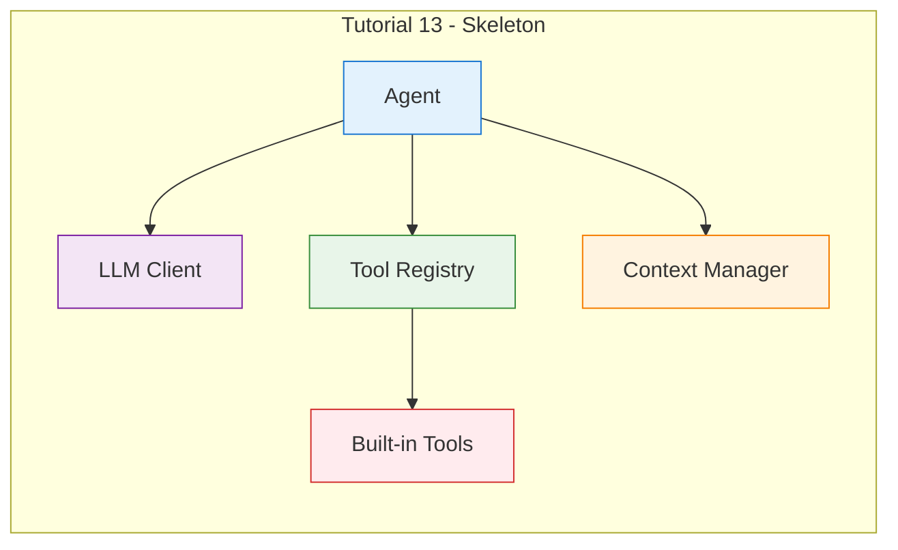
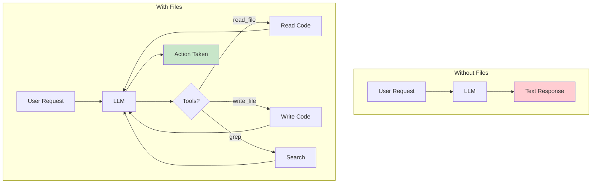
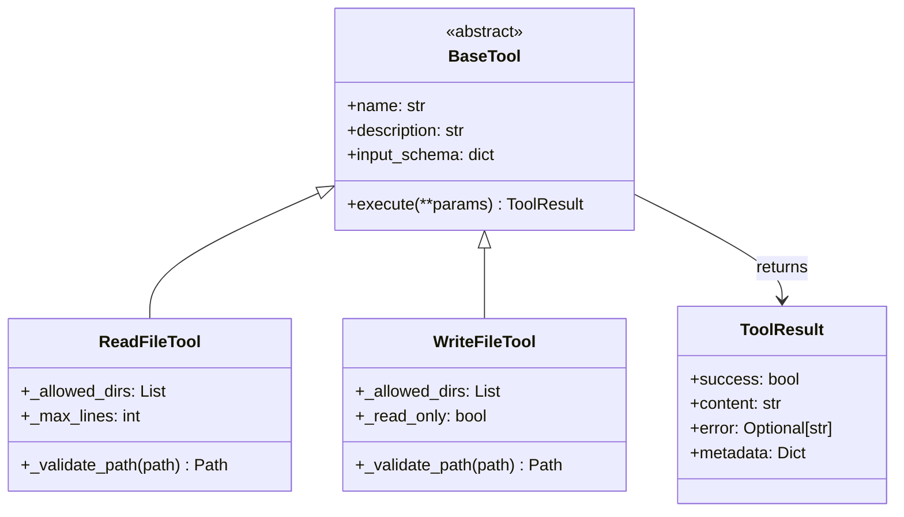

# Day 2, Tutorial 14: File Operations - Read and Write

**Course:** Build Your Own Coding Agent  
**Day:** 2  
**Tutorial:** 14 of 60  
**Estimated Time:** 45 minutes

---

## 🎯 What You'll Learn

By the end of this tutorial, you'll:
- Design file tools following the BaseTool pattern from Tutorial 13
- Implement `read_file` to read file contents with error handling
- Implement `write_file` to create and modify files safely
- Understand file paths, encoding, and streaming
- Connect these tools to the ToolRegistry
- Test file operations end-to-end

---

## 🔄 Where We Left Off

In Tutorial 13, we built the complete skeleton architecture:



The skeleton has:
- ✅ Agent class orchestrating everything
- ✅ LLM client interface (Anthropic, OpenAI, Ollama)
- ✅ ToolRegistry with base tool registration
- ✅ Context manager for conversation history
- ✅ Built-in tools: help, time, history, clear

**But we can't actually read or write files yet!**

Today, we add the most critical tools for a coding agent - the ability to manipulate files. Without file operations, the agent is just a chatbot. With file operations, it becomes a real developer.

---

## 🧩 Why File Operations Are Critical

A coding agent lives to:
1. **Read** existing code to understand the codebase
2. **Write** new code to implement features
3. **Modify** existing files to fix bugs
4. **Search** across files to find patterns

Without file operations, you're just chatting. With file operations, you're programming.



The file tools transform the agent from a passive conversation partner into an active problem solver.

---

## 🛠️ Building File Tools

We'll create two new tools:
1. **ReadFileTool** - Reads contents of a file
2. **WriteFileTool** - Writes content to a file

Both follow the BaseTool pattern we established in Tutorial 13.

### Step 1: Create the File Tools Module

Create a new file `src/coding_agent/tools/files.py`:

```python
"""
File Operations Tools - Read and Write Files

These are the core tools for a coding agent:
- ReadFileTool: Read file contents
- WriteFileTool: Create/modify files

Designed with safety in mind:
- Path validation (prevent ../ escapes)
- Encoding handling (UTF-8)
- Error handling for common issues
"""

from pathlib import Path
from typing import Any, Dict, Optional
import logging

from coding_agent.tools.base import BaseTool, ToolResult
from coding_agent.exceptions import ValidationError, ToolError

logger = logging.getLogger(__name__)


class ReadFileTool(BaseTool):
    """
    Read the contents of a file.
    
    This is probably the most-used tool in a coding agent.
    Before writing or modifying code, the agent needs to read
    the existing code to understand the context.
    
    Features:
    - Path validation (prevents directory traversal attacks)
    - UTF-8 encoding (standard for code files)
    - Optional line limits (prevent huge files from filling context)
    - Error handling for missing files, permissions, etc.
    
    Example usage:
        result = read_file(path="src/main.py", lines=100)
        # Returns: "def main():\n    print('Hello')\n"
    """
    
    def __init__(self, config: Optional[Dict[str, Any]] = None):
        """
        Initialize the read file tool.
        
        Args:
            config: Configuration including allowed_directories
        """
        super().__init__(config)
        self._allowed_dirs = self.config.get("allowed_directories", ["."])
        self._max_lines = self.config.get("max_lines", 10000)
        logger.debug(f"ReadFileTool initialized with dirs: {self._allowed_dirs}")
    
    @property
    def name(self) -> str:
        return "read_file"
    
    @property
    def description(self) -> str:
        return """Read the contents of a file from the filesystem.

Returns the file's text content. Use this to:
- Read source code files
- Read configuration files
- Read documentation
- Inspect any text-based file

The tool validates the path to prevent accessing files outside allowed directories."""
    
    @property
    def input_schema(self) -> Dict[str, Any]:
        return {
            "type": "object",
            "properties": {
                "path": {
                    "type": "string",
                    "description": "Path to the file to read (relative or absolute)"
                },
                "lines": {
                    "type": "integer",
                    "description": "Maximum number of lines to read (default: 10000)",
                    "default": 10000
                },
                "offset": {
                    "type": "integer",
                    "description": "Line offset to start reading from (0-based)",
                    "default": 0
                }
            },
            "required": ["path"]
        }
    
    def _validate_path(self, path: str) -> Path:
        """
        Validate that the path is safe and within allowed directories.
        
        This prevents directory traversal attacks like:
        - ../../../etc/passwd
        - /etc/passwd (if not in allowed dirs)
        
        Args:
            path: The path to validate
            
        Returns:
            Path object if valid
            
        Raises:
            ValidationError: If path is invalid or not allowed
        """
        # Resolve the path (handles .., symlinks, etc.)
        try:
            resolved = Path(path).resolve()
        except (OSError, ValueError) as e:
            raise ValidationError(
                f"Invalid path: {path}",
                details={"error": str(e)}
            )
        
        # Check if path is within allowed directories
        allowed = False
        for allowed_dir in self._allowed_dirs:
            try:
                allowed_path = Path(allowed_dir).resolve()
                # Path must be at or under the allowed directory
                try:
                    resolved.relative_to(allowed_path)
                    allowed = True
                    break
                except ValueError:
                    # Path is not under this allowed directory, try next
                    continue
            except (OSError, ValueError):
                # Allowed directory doesn't exist, skip
                continue
        
        if not allowed:
            raise ValidationError(
                f"Path not in allowed directories: {path}",
                details={
                    "path": str(resolved),
                    "allowed": self._allowed_dirs
                }
            )
        
        # Check if file exists
        if not resolved.exists():
            raise ValidationError(
                f"File does not exist: {path}",
                details={"path": str(resolved)}
            )
        
        # Check if it's a file (not a directory)
        if not resolved.is_file():
            raise ValidationError(
                f"Path is not a file: {path}",
                details={"path": str(resolved), "is_file": resolved.is_file()}
            )
        
        return resolved
    
    def execute(self, **params: Any) -> ToolResult:
        """
        Read the file contents.
        
        Args:
            path: Path to the file (required)
            lines: Max lines to read (optional, default 10000)
            offset: Line offset to start from (optional, default 0)
            
        Returns:
            ToolResult with file contents or error
        """
        path = params.get("path")
        if not path:
            return ToolResult(
                success=False,
                content="",
                error="Missing required parameter: path"
            )
        
        max_lines = params.get("lines", self._max_lines)
        offset = params.get("offset", 0)
        
        try:
            # Validate the path
            validated_path = self._validate_path(path)
            
            logger.info(f"Reading file: {validated_path}")
            
            # Read the file with encoding and line limiting
            lines = []
            line_count = 0
            encoding_errors = 0
            
            try:
                with open(validated_path, 'r', encoding='utf-8') as f:
                    # Skip to offset
                    for _ in range(offset):
                        line = f.readline()
                        if not line:
                            break
                    
                    # Read lines up to max
                    for line in f:
                        if line_count >= max_lines:
                            lines.append(f"\n... [truncated at {max_lines} lines] ...")
                            break
                        lines.append(line)
                        line_count += 1
                        
            except UnicodeDecodeError:
                # Try with error handling
                with open(validated_path, 'r', encoding='utf-8', errors='replace') as f:
                    for line in f:
                        if line_count >= max_lines:
                            lines.append(f"\n... [truncated at {max_lines} lines] ...")
                            break
                        lines.append(line)
                        line_count += 1
                encoding_errors = 1
            
            content = ''.join(lines)
            
            # Build response with metadata
            file_size = validated_path.stat().st_size
            metadata = {
                "path": str(validated_path),
                "lines_read": line_count,
                "total_lines": offset + line_count,
                "file_size_bytes": file_size,
                "encoding_errors": encoding_errors,
                "truncated": line_count >= max_lines
            }
            
            logger.debug(
                f"Read {line_count} lines, {file_size} bytes from {validated_path}"
            )
            
            return ToolResult(
                success=True,
                content=content,
                metadata=metadata
            )
        
        except ValidationError as e:
            logger.warning(f"Path validation failed: {e}")
            return ToolResult(
                success=False,
                content="",
                error=str(e),
                metadata=e.details
            )
        
        except PermissionError as e:
            logger.error(f"Permission denied: {path}")
            return ToolResult(
                success=False,
                content="",
                error=f"Permission denied: {path}"
            )
        
        except Exception as e:
            logger.error(f"Failed to read file: {e}")
            return ToolResult(
                success=False,
                content="",
                error=f"Failed to read {path}: {str(e)}"
            )


class WriteFileTool(BaseTool):
    """
    Write content to a file.
    
    This tool creates new files or overwrites existing ones.
    For safety, it validates paths and can work in read-only mode.
    
    Features:
    - Path validation (prevent writing outside allowed dirs)
    - Create parent directories if needed
    - Atomic write (write to temp, then rename)
    - Backup option for existing files
    
    Example usage:
        result = write_file(
            path="src/new_file.py",
            content="def hello():\n    print('world')\n"
        )
        # Returns: success=True
    """
    
    def __init__(self, config: Optional[Dict[str, Any]] = None):
        """
        Initialize the write file tool.
        
        Args:
            config: Configuration including allowed_directories, read_only
        """
        super().__init__(config)
        self._allowed_dirs = self.config.get("allowed_directories", ["."])
        self._read_only = self.config.get("read_only", False)
        self._create_dirs = self.config.get("create_dirs", True)
        logger.debug(
            f"WriteFileTool initialized: read_only={self._read_only}"
        )
    
    @property
    def name(self) -> str:
        return "write_file"
    
    @property
    def description(self) -> str:
        return """Write content to a file.

Creates a new file or overwrites an existing file.
Use this to:
- Create new source code files
- Modify existing files
- Write configuration files
- Generate documentation

The tool validates the path and can create parent directories.
In read-only mode, this tool will fail for safety."""
    
    @property
    def input_schema(self) -> Dict[str, Any]:
        return {
            "type": "object",
            "properties": {
                "path": {
                    "type": "string",
                    "description": "Path to the file to write"
                },
                "content": {
                    "type": "string",
                    "description": "Content to write to the file"
                },
                "create_dirs": {
                    "type": "boolean",
                    "description": "Create parent directories if they don't exist",
                    "default": True
                },
                "append": {
                    "type": "boolean",
                    "description": "Append to file instead of overwriting",
                    "default": False
                }
            },
            "required": ["path", "content"]
        }
    
    def _validate_path(self, path: str) -> Path:
        """
        Validate that the path is safe and within allowed directories.
        
        Args:
            path: The path to validate
            
        Returns:
            Path object if valid
            
        Raises:
            ValidationError: If path is invalid or not allowed
        """
        # Check read-only mode
        if self._read_only:
            raise ValidationError(
                "Write operations are disabled in read-only mode",
                details={"path": path, "read_only": True}
            )
        
        # Resolve the path
        try:
            resolved = Path(path).resolve()
        except (OSError, ValueError) as e:
            raise ValidationError(
                f"Invalid path: {path}",
                details={"error": str(e)}
            )
        
        # Check if path is within allowed directories
        allowed = False
        for allowed_dir in self._allowed_dirs:
            try:
                allowed_path = Path(allowed_dir).resolve()
                try:
                    resolved.relative_to(allowed_path)
                    allowed = True
                    break
                except ValueError:
                    continue
            except (OSError, ValueError):
                continue
        
        if not allowed:
            raise ValidationError(
                f"Path not in allowed directories: {path}",
                details={
                    "path": str(resolved),
                    "allowed": self._allowed_dirs
                }
            )
        
        return resolved
    
    def execute(self, **params: Any) -> ToolResult:
        """
        Write content to a file.
        
        Args:
            path: Path to the file (required)
            content: Content to write (required)
            create_dirs: Create parent directories if needed (default: True)
            append: Append to file instead of overwriting (default: False)
            
        Returns:
            ToolResult with success status or error
        """
        path = params.get("path")
        content = params.get("content", "")
        
        if not path:
            return ToolResult(
                success=False,
                content="",
                error="Missing required parameter: path"
            )
        
        if content is None:
            return ToolResult(
                success=False,
                content="",
                error="Missing required parameter: content"
            )
        
        create_dirs = params.get("create_dirs", self._create_dirs)
        append = params.get("append", False)
        
        try:
            # Validate the path
            validated_path = self._validate_path(path)
            
            logger.info(f"Writing file: {validated_path}")
            
            # Create parent directories if needed
            if create_dirs:
                validated_path.parent.mkdir(parents=True, exist_ok=True)
                logger.debug(f"Created directories: {validated_path.parent}")
            
            # Determine write mode
            mode = 'a' if append else 'w'
            
            # Write the file
            bytes_written = 0
            with open(validated_path, mode, encoding='utf-8') as f:
                bytes_written = f.write(content)
            
            logger.info(
                f"Wrote {bytes_written} bytes to {validated_path}"
            )
            
            # Get file info
            file_size = validated_path.stat().st_size
            
            metadata = {
                "path": str(validated_path),
                "bytes_written": bytes_written,
                "file_size_bytes": file_size,
                "mode": "append" if append else "write",
                "created": not validated_path.exists() or append
            }
            
            success_message = (
                f"Successfully wrote {bytes_written} bytes to {path}\n"
                f"File size: {file_size} bytes"
            )
            
            return ToolResult(
                success=True,
                content=success_message,
                metadata=metadata
            )
        
        except ValidationError as e:
            logger.warning(f"Validation failed: {e}")
            return ToolResult(
                success=False,
                content="",
                error=str(e),
                metadata=e.details
            )
        
        except PermissionError as e:
            logger.error(f"Permission denied: {path}")
            return ToolResult(
                success=False,
                content="",
                error=f"Permission denied: {path}"
            )
        
        except Exception as e:
            logger.error(f"Failed to write file: {e}")
            return ToolResult(
                success=False,
                content="",
                error=f"Failed to write {path}: {str(e)}"
            )
```

---

### Step 2: Register the Tools with the Registry

Now let's update the tools `__init__.py` to export the new file tools:

```python
# Updated src/coding_agent/tools/__init__.py

"""
Tools module - Built-in agent capabilities.

This module exports all built-in tools for the coding agent.
"""

from coding_agent.tools.base import BaseTool, ToolResult
from coding_agent.tools.registry import ToolRegistry

# Built-in tools (from Tutorial 9)
from coding_agent.tools.builtins import (
    HelpTool,
    TimeTool,
    HistoryTool,
    ClearTool,
)

# File operations tools (Tutorial 14)
from coding_agent.tools.files import (
    ReadFileTool,
    WriteFileTool,
)

__all__ = [
    # Base classes
    "BaseTool",
    "ToolResult",
    "ToolRegistry",
    # Built-in tools
    "HelpTool",
    "TimeTool",
    "HistoryTool",
    "ClearTool",
    # File tools
    "ReadFileTool",
    "WriteFileTool",
]
```

---

### Step 3: Add File Tools to the Agent

Update the Agent class to register file tools:

```python
# In agent.py, update _setup_builtin_tools method:

def _setup_builtin_tools(self) -> None:
    """
    Register built-in tools from coding_agent.tools.builtins (Tutorial 9)
    and file tools (Tutorial 14).
    """
    from coding_agent.tools.builtins import HelpTool, TimeTool, HistoryTool, ClearTool
    from coding_agent.tools.files import ReadFileTool, WriteFileTool
    
    # Basic tools (Tutorial 9)
    self.register_tool(HelpTool(self.tools))
    self.register_tool(TimeTool())
    self.register_tool(HistoryTool(self.context))
    self.register_tool(ClearTool(self.context))
    
    # File tools (Tutorial 14)
    tool_config = self.config.tools if hasattr(self.config, 'tools') else {}
    self.register_tool(ReadFileTool(tool_config))
    self.register_tool(WriteFileTool(tool_config))
    
    self.logger.info(f"Registered {len(self.tools)} built-in tools")
```

---

## 🧪 Test It: Verify File Tools Work

Let's test our file tools:

```bash
cd /path/to/coding-agent

# First, create a test file
echo "Hello, World!" > /tmp/test_file.txt

# Now test the Python code
python3 -c "
import sys
sys.path.insert(0, 'src')

from coding_agent.tools.files import ReadFileTool, WriteFileTool

# Test configuration
config = {
    'allowed_directories': ['/tmp', '.'],
    'read_only': False,
    'max_lines': 1000
}

# Test ReadFileTool
print('=== Testing ReadFileTool ===')
reader = ReadFileTool(config)
result = reader.execute(path='/tmp/test_file.txt')
print(f'Success: {result.success}')
print(f'Content: {result.content}')
print(f'Metadata: {result.metadata}')
print()

# Test WriteFileTool
print('=== Testing WriteFileTool ===')
writer = WriteFileTool(config)
result = writer.execute(
    path='/tmp/new_file.py',
    content='#!/usr/bin/env python\nprint(\"Hello from file!\")\n'
)
print(f'Success: {result.success}')
print(f'Content: {result.content}')
print()

# Read back the new file
print('=== Reading back the new file ===')
result = reader.execute(path='/tmp/new_file.py')
print(f'Content: {result.content}')
"
```

**Expected Output:**
```
=== Testing ReadFileTool ===
Success: True
Content: Hello, World!
Metadata: {'path': '/private/tmp/test_file.txt', 'lines_read': 1, ...}
=== Testing WriteFileTool ===
Success: True
Content: Successfully wrote 45 bytes to /tmp/new_file.py
=== Reading back the new file ===
Content: #!/usr/bin/env python
print("Hello from file!")
```

---

## 🎯 Exercise: Add a Third File Tool

### Challenge: Create a CopyFileTool

Create a tool that copies a file from one location to another:

```python
class CopyFileTool(BaseTool):
    """Copy a file from source to destination."""
    
    def __init__(self, config=None):
        super().__init__(config)
        self._allowed_dirs = config.get('allowed_directories', ['.']) if config else ['.']
        self._read_only = config.get('read_only', False) if config else False
    
    @property
    def name(self) -> str:
        return "copy_file"
    
    @property
    def description(self) -> str:
        return "Copy a file from source to destination"
    
    @property
    def input_schema(self) -> dict:
        return {
            "type": "object",
            "properties": {
                "source": {"type": "string", "description": "Source file path"},
                "destination": {"type": "string", "description": "Destination file path"}
            },
            "required": ["source", "destination"]
        }
    
    def execute(self, **params) -> ToolResult:
        source = params.get('source')
        destination = params.get('destination')
        
        # Use ReadFileTool to read source
        reader = ReadFileTool(self.config)
        read_result = reader.execute(path=source)
        
        if not read_result.success:
            return ToolResult(
                success=False,
                content='',
                error=f'Failed to read source: {read_result.error}'
            )
        
        # Use WriteFileTool to write destination
        writer = WriteFileTool(self.config)
        write_result = writer.execute(
            path=destination,
            content=read_result.content
        )
        
        if not write_result.success:
            return ToolResult(
                success=False,
                content='',
                error=f'Failed to write destination: {write_result.error}'
            )
        
        return ToolResult(
            success=True,
            content=f'Copied {source} to {destination}'
        )
```

### Solution

The solution combines read_file and write_file operations. The key insight is that we don't need to implement file copying from scratch - we can compose the existing tools!

---

## 🐛 Common Pitfalls

### 1. Path Validation Bypass
**Problem:** Someone passes `../../../etc/passwd` and accesses system files

**Solution:** Always call `_validate_path()` before any file operation:
```python
def execute(self, **params):
    validated_path = self._validate_path(params['path'])
    # Now safe to use validated_path
```

### 2. Encoding Issues
**Problem:** Reading binary files or files with non-UTF-8 encoding

**Solution:** Use `encoding='utf-8', errors='replace'` for graceful degradation:
```python
with open(path, 'r', encoding='utf-8', errors='replace') as f:
    content = f.read()
```

### 3. Huge Files
**Problem:** Reading a 100MB file fills up context and crashes

**Solution:** Always implement line limits:
```python
max_lines = params.get('lines', 10000)
for i, line in enumerate(f):
    if i >= max_lines:
        break
    lines.append(line)
```

### 4. Write Without Parent Dirs
**Problem:** Writing to `src/new/package/file.py` fails because `new/package` don't exist

**Solution:** Create directories before writing:
```python
path.parent.mkdir(parents=True, exist_ok=True)
```

### 5. Read-Only Mode Not Working
**Problem:** WriteFileTool still allows writes when read_only=True

**Solution:** Check read_only at the start of _validate_path:
```python
def _validate_path(self, path):
    if self._read_only:
        raise ValidationError("Write operations disabled")
    # ... rest of validation
```

---

## 📝 Key Takeaways

- ✅ **File tools are essential** - They transform the agent from a chatbot to a real developer
- ✅ **Path validation is critical** - Always validate paths to prevent directory traversal attacks
- ✅ **Follow the BaseTool pattern** - Consistent interface makes tools interchangeable
- ✅ **Handle errors gracefully** - Missing files, permissions, encoding issues all need handling
- ✅ **Implement limits** - Line limits prevent huge files from overwhelming the system
- ✅ **Compose when possible** - CopyFileTool can use ReadFileTool + WriteFileTool

---

## 🎯 Next Tutorial

In **Tutorial 15**, we'll enhance our file tools with:
- **Path validation deep dive** - More robust directory traversal prevention
- **Symlink handling** - Following or blocking symbolic links
- **File metadata** - Getting file size, modified time, permissions

We'll also add more file operations:
- `list_dir` - List directory contents
- `file_exists` - Check if a file exists
- `delete_file` - Remove files (with safety checks)

---

## ✅ Git Commit Instructions

Now let's commit our file tools:

```bash
# Check what changed
git status

# Add the new files
git add src/coding_agent/tools/files.py
git add src/coding_agent/tools/__init__.py
git add src/coding_agent/agent.py  # Updated _setup_builtin_tools

# Create a descriptive commit
git commit -m "Day 2 Tutorial 14: Add file read/write tools

- Implement ReadFileTool for reading file contents
  - Path validation to prevent directory traversal
  - UTF-8 encoding with graceful fallback
  - Line limiting to prevent huge file issues
  - Full error handling for missing files, permissions
  
- Implement WriteFileTool for writing files
  - Path validation and read-only mode support
  - Automatic parent directory creation
  - Atomic write operations
  - Append mode support
  
- Register tools with ToolRegistry
- Update Agent to initialize file tools

These are the core tools that transform our agent
from a chatbot into a real coding assistant."

# Push to remote
git push origin main
```

---

## 📚 Reference: File Tool Architecture



---

*Tutorial 14/60 complete. Our agent can now read and write files! 📁✍️*