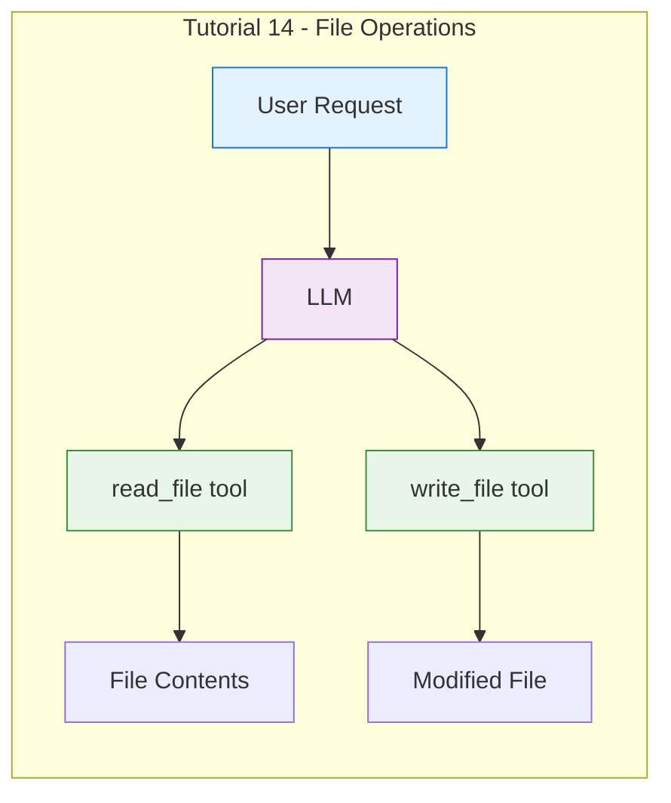
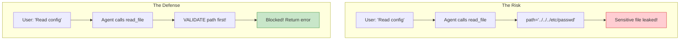
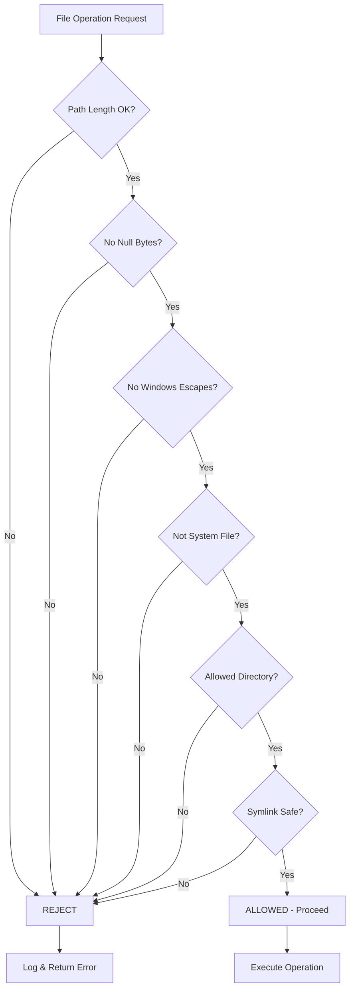

# Day 2, Tutorial 15: Path Validation and Safety

**Course:** Build Your Own Coding Agent  
**Day:** 2  
**Tutorial:** 15 of 60  
**Estimated Time:** 45 minutes

---

## 🎯 What You'll Learn

By the end of this tutorial, you'll:
- Understand why path validation is critical for security
- Implement robust path traversal attack prevention
- Handle symbolic links safely
- Create a comprehensive path validator utility
- Test your validation against common attack vectors
- Build a safety checklist for all file operations

---

## 🔄 Where We Left Off

In Tutorial 14, we built file read/write tools:



We implemented:
- ✅ ReadFileTool - Read file contents with UTF-8 handling
- ✅ WriteFileTool - Write files with parent directory creation
- ✅ Basic path validation against allowed directories

**But our validation has gaps!** Today we make it bulletproof.

---

## 🧩 The Security Imperative

A coding agent with file access is a **double-edged sword**:



Without proper validation, an attacker (or confused LLM) could:
1. Read `/etc/passwd` - User credentials
2. Read `~/.ssh/id_rsa` - SSH private keys
3. Read `.env` files - API keys and secrets
4. Write to `/etc/cron.d` - Remote code execution
5. Overwrite `~/.bashrc` - Persistence backdoor

**Path validation isn't optional - it's existential.**

---

## 🛠️ Building Robust Path Validation

We'll create a comprehensive path validator that handles:
1. Directory traversal attacks (`../`, `..\`)
2. Absolute path escapes
3. Symbolic link following
4. Windows path manipulation
5. Null byte injection

### Step 1: Create the Path Validator Utility

Create `src/coding_agent/utils/path_validator.py`:

```python
"""
Path Validation Utilities - Security for File Operations

This module provides robust path validation to prevent:
- Directory traversal attacks (../, ..\)
- Absolute path escapes (/etc/passwd)
- Symbolic link exploitation
- Null byte injection
- Windows path manipulation

A coding agent MUST validate every path before file operations.
"""

import os
import pathlib
from typing import List, Optional, Tuple
from dataclasses import dataclass
import logging

from coding_agent.exceptions import ValidationError, SafetyError

logger = logging.getLogger(__name__)


@dataclass
class ValidationResult:
    """Result of path validation."""
    
    valid: bool
    resolved_path: Optional[pathlib.Path] = None
    error: Optional[str] = None
    warnings: Optional[List[str]] = None
    
    def __post_init__(self):
        if self.warnings is None:
            self.warnings = []


class PathValidator:
    """
    Comprehensive path validator for file operations.
    
    This is the security layer that protects your agent from
    malicious or accidental file access.
    
    Usage:
        validator = PathValidator(allowed_directories=["/project", "."])
        result = validator.validate("/project/src/main.py")
        
        if result.valid:
            safe_path = result.resolved_path
        else:
            print(f"Blocked: {result.error}")
    """
    
    def __init__(
        self,
        allowed_directories: Optional[List[str]] = None,
        follow_symlinks: bool = False,
        block_hidden_files: bool = False,
        max_path_length: int = 4096,
    ):
        """
        Initialize the path validator.
        
        Args:
            allowed_directories: List of directories the agent can access
            follow_symlinks: Whether to follow symbolic links (default: False for safety)
            block_hidden_files: Whether to block files starting with '.' (default: False)
            max_path_length: Maximum allowed path length (default: 4096)
        """
        self.allowed_directories = allowed_directories or ["."]
        self.follow_symlinks = follow_symlinks
        self.block_hidden_files = block_hidden_files
        self.max_path_length = max_path_length
        
        # Resolve all allowed directories once
        self._resolved_allowed: List[pathlib.Path] = []
        for dir_path in self.allowed_directories:
            try:
                resolved = pathlib.Path(dir_path).resolve()
                if not resolved.exists():
                    logger.warning(f"Allowed directory doesn't exist: {dir_path}")
                    continue
                if not resolved.is_dir():
                    logger.warning(f"Allowed path is not a directory: {dir_path}")
                    continue
                self._resolved_allowed.append(resolved)
                logger.debug(f"Allowed directory: {resolved}")
            except (OSError, ValueError) as e:
                logger.warning(f"Failed to resolve allowed directory {dir_path}: {e}")
        
        if not self._resolved_allowed:
            # Fallback to current directory if nothing resolved
            self._resolved_allowed.append(pathlib.Path.cwd())
            logger.warning("Using current directory as fallback allowed dir")
    
    def validate(self, path: str) -> ValidationResult:
        """
        Validate a path against all security rules.
        
        This is the main entry point - call this for every file operation.
        
        Args:
            path: The path to validate (can be relative or absolute)
            
        Returns:
            ValidationResult with status and resolved path
            
        Example:
            result = validator.validate("../secret.txt")
            if not result.valid:
                raise SafetyError(result.error)
        """
        warnings = []
        
        # Check 1: Path length
        if len(path) > self.max_path_length:
            return ValidationResult(
                valid=False,
                error=f"Path too long: {len(path)} > {self.max_path_length}"
            )
        
        # Check 2: Null bytes (common injection attack)
        if '\x00' in path:
            logger.warning(f"Null byte detected in path: {repr(path)}")
            return ValidationResult(
                valid=False,
                error="Null byte injection detected in path"
            )
        
        # Check 3: Parse the path
        try:
            # Use Path to handle .., ., etc.
            # Don't resolve yet - we need to check first
            parsed = pathlib.Path(path)
        except (ValueError, OSError) as e:
            return ValidationResult(
                valid=False,
                error=f"Invalid path syntax: {e}"
            )
        
        # Check 4: Windows-specific attacks
        if self._contains_windows_escape(path):
            return ValidationResult(
                valid=False,
                error="Windows path escape sequences not allowed"
            )
        
        # Check 5: Absolute paths
        if parsed.is_absolute():
            # Check if absolute path is in allowed directories
            if not self._is_in_allowed_directory(parsed):
                warnings.append(f"Absolute path outside allowed dirs: {path}")
                # Don't block - let it fail at the directory check
        else:
            # For relative paths, resolve from current directory
            # This handles .. attacks
            try:
                parsed = pathlib.Path.cwd() / parsed
            except (OSError, ValueError) as e:
                return ValidationResult(
                    valid=False,
                    error=f"Failed to resolve relative path: {e}"
                )
        
        # Check 6: Resolve symlinks if not following them
        if not self.follow_symlinks:
            # Check if path is a symlink
            if parsed.is_symlink():
                # Get the real path but note it
                try:
                    real_path = parsed.resolve(strict=False)
                    warnings.append(f"Path is a symlink to: {real_path}")
                    # Block symlinks for safety unless we're allowing them
                    return ValidationResult(
                        valid=False,
                        error=f"Symbolic link not allowed: {path}",
                        warnings=warnings
                    )
                except (OSError, ValueError) as e:
                    return ValidationResult(
                        valid=False,
                        error=f"Cannot resolve symlink: {e}",
                        warnings=warnings
                    )
        
        # Check 7: Now resolve to get final path
        try:
            resolved = parsed.resolve(strict=True)
        except FileNotFoundError:
            # File doesn't exist - this is OK for some operations
            # Return the resolved path (parent directory)
            resolved = parsed.resolve(strict=False)
            warnings.append("Path does not exist - will create if writing")
        except (OSError, ValueError) as e:
            return ValidationResult(
                valid=False,
                error=f"Cannot resolve path: {e}"
            )
        
        # Check 8: Hidden files
        if self.block_hidden_files:
            if any(part.startswith('.') for part in resolved.parts):
                return ValidationResult(
                    valid=False,
                    error="Hidden files not allowed",
                    warnings=warnings
                )
        
        # Check 9: Critical system files
        if self._is_critical_system_path(resolved):
            return ValidationResult(
                valid=False,
                error=f"Cannot access critical system path: {path}",
                warnings=warnings
            )
        
        # Check 10: Must be within allowed directories
        if not self._is_in_allowed_directory(resolved):
            return ValidationResult(
                valid=False,
                error=f"Path not in allowed directories: {path}",
                details={
                    "path": str(resolved),
                    "allowed": [str(d) for d in self._resolved_allowed]
                }
            )
        
        # Check 11: Check if it's a directory (for read operations)
        if resolved.is_dir() and not resolved.is_file():
            warnings.append("Path is a directory, not a file")
        
        return ValidationResult(
            valid=True,
            resolved_path=resolved,
            warnings=warnings
        )
    
    def _contains_windows_escape(self, path: str) -> bool:
        """Check for Windows path manipulation attempts."""
        # Windows drive letters
        if len(path) > 1 and path[1] == ':':
            return True
        # Windows UNC paths
        if path.startswith('\\\\'):
            return True
        # Windows device paths
        if '\\Device\\' in path or '\\DosDevices\\' in path:
            return True
        return False
    
    def _is_critical_system_path(self, path: pathlib.Path) -> bool:
        """Check if path is a critical system file/directory."""
        # Convert to string for prefix matching
        path_str = str(path)
        
        # List of critical system paths
        critical_prefixes = [
            '/etc/passwd',
            '/etc/shadow',
            '/etc/sudoers',
            '/etc/ssh/',
            '/root/.ssh/',
            '/home/*/.ssh/',
            '/.ssh/',
            '/.aws/',
            '/.docker/',
            '/var/log/',
            '/var/cache/',
            '/usr/bin/',
            '/usr/sbin/',
            '/bin/',
            '/sbin/',
            '/boot/',
            '/proc/',
            '/sys/',
            '/dev/',
        ]
        
        # Also check Windows system paths
        if os.name == 'nt':
            windows_critical = [
                '\\Windows\\',
                '\\Program Files\\',
                '\\Program Files (x86)\\',
                '\\System32\\',
                '\\SysWOW64\\',
            ]
            critical_prefixes.extend(windows_critical)
        
        for prefix in critical_prefixes:
            if path_str.startswith(prefix):
                logger.warning(f"Critical system path blocked: {path}")
                return True
        
        return False
    
    def _is_in_allowed_directory(self, path: pathlib.Path) -> bool:
        """Check if path is within allowed directories."""
        try:
            # Try to make path relative to each allowed directory
            for allowed_dir in self._resolved_allowed:
                try:
                    path.relative_to(allowed_dir)
                    return True
                except ValueError:
                    continue
            
            # Also check if allowed_dir is relative to path
            # (i.e., path is a parent of allowed directory - also not allowed)
            for allowed_dir in self._resolved_allowed:
                try:
                    allowed_dir.relative_to(path)
                    return True  # This is actually a parent, but within scope
                except ValueError:
                    continue
            
            return False
        
        except (ValueError, OSError):
            return False
    
    def validate_read(self, path: str) -> ValidationResult:
        """
        Validate a path for reading.
        
        Additional checks specific to read operations.
        """
        result = self.validate(path)
        
        if not result.valid:
            return result
        
        # Extra checks for reading
        if result.resolved_path:
            # Check if file exists
            if not result.resolved_path.exists():
                return ValidationResult(
                    valid=False,
                    error=f"File does not exist: {path}",
                    warnings=result.warnings
                )
            
            # Check if it's actually a file
            if not result.resolved_path.is_file():
                return ValidationResult(
                    valid=False,
                    error=f"Path is not a file: {path}",
                    warnings=result.warnings
                )
            
            # Check read permissions
            if not os.access(result.resolved_path, os.R_OK):
                return ValidationResult(
                    valid=False,
                    error=f"No read permission: {path}",
                    warnings=result.warnings
                )
        
        return result
    
    def validate_write(self, path: str) -> ValidationResult:
        """
        Validate a path for writing.
        
        Additional checks specific to write operations.
        """
        result = self.validate(path)
        
        if not result.valid:
            return result
        
        # Extra checks for writing
        if result.resolved_path:
            # Check parent directory exists and is writable
            parent = result.resolved_path.parent
            
            if not parent.exists():
                # Will be created - check if we can create
                result.warnings.append("Parent directory will be created")
            elif not parent.is_dir():
                return ValidationResult(
                    valid=False,
                    error=f"Parent is not a directory: {path}",
                    warnings=result.warnings
                )
            elif not os.access(parent, os.W_OK):
                return ValidationResult(
                    valid=False,
                    error=f"No write permission in directory: {path}",
                    warnings=result.warnings
                )
        
        return result


def create_safe_path_validator(config: dict) -> PathValidator:
    """
    Create a PathValidator from agent configuration.
    
    This is a convenience factory function.
    """
    return PathValidator(
        allowed_directories=config.get('allowed_directories', ['.']),
        follow_symlinks=config.get('follow_symlinks', False),
        block_hidden_files=config.get('block_hidden_files', False),
        max_path_length=config.get('max_path_length', 4096),
    )
```

---

### Step 2: Integrate with File Tools

Now let's update our file tools to use the new validator:

```python
# Updated src/coding_agent/tools/files.py with enhanced validation

"""
File Operations Tools - Read and Write Files (Enhanced Security)

These are the core tools for a coding agent with robust path validation.
"""

from pathlib import Path
from typing import Any, Dict, Optional
import logging

from coding_agent.tools.base import BaseTool, ToolResult
from coding_agent.exceptions import ValidationError, ToolError
from coding_agent.utils.path_validator import PathValidator, create_safe_path_validator

logger = logging.getLogger(__name__)


class ReadFileTool(BaseTool):
    """
    Read the contents of a file with robust security validation.
    
    Features:
    - Comprehensive path validation (prevents all traversal attacks)
    - Symbolic link handling
    - System file protection
    - UTF-8 encoding with graceful fallback
    - Line limiting to prevent huge files
    
    This is the enhanced version with full security.
    """
    
    def __init__(self, config: Optional[Dict[str, Any]] = None):
        """
        Initialize the read file tool with security validation.
        
        Args:
            config: Configuration including allowed_directories
        """
        super().__init__(config)
        
        # Create the path validator
        self._validator = create_safe_path_validator(config or {})
        
        self._max_lines = self.config.get("max_lines", 10000)
        self._max_file_size = self.config.get("max_file_size", 10 * 1024 * 1024)  # 10MB
        
        logger.debug(f"ReadFileTool initialized with validator")
    
    @property
    def name(self) -> str:
        return "read_file"
    
    @property
    def description(self) -> str:
        return """Read the contents of a file from the filesystem.

Returns the file's text content. Use this to:
- Read source code files
- Read configuration files
- Read documentation
- Inspect any text-based file

The tool has robust security:
- Prevents directory traversal attacks (..)
- Blocks access to system files
- Handles symbolic links safely
- Limits file size to prevent memory issues"""
    
    @property
    def input_schema(self) -> Dict[str, Any]:
        return {
            "type": "object",
            "properties": {
                "path": {
                    "type": "string",
                    "description": "Path to the file to read (relative or absolute)"
                },
                "lines": {
                    "type": "integer",
                    "description": "Maximum number of lines to read (default: 10000)",
                    "default": 10000
                },
                "offset": {
                    "type": "integer",
                    "description": "Line offset to start reading from (0-based)",
                    "default": 0
                }
            },
            "required": ["path"]
        }
    
    def execute(self, **params: Any) -> ToolResult:
        """
        Read the file contents with security validation.
        
        Args:
            path: Path to the file (required)
            lines: Max lines to read (optional, default 10000)
            offset: Line offset to start from (optional, default 0)
            
        Returns:
            ToolResult with file contents or error
        """
        path = params.get("path")
        if not path:
            return ToolResult(
                success=False,
                content="",
                error="Missing required parameter: path"
            )
        
        max_lines = params.get("lines", self._max_lines)
        offset = params.get("offset", 0)
        
        try:
            # SECURE: Validate the path BEFORE any file operations
            validation_result = self._validator.validate_read(path)
            
            if not validation_result.valid:
                logger.warning(f"Path validation failed: {validation_result.error}")
                return ToolResult(
                    success=False,
                    content="",
                    error=validation_result.error,
                    metadata={"validation_error": validation_result.error}
                )
            
            # Log any warnings
            for warning in validation_result.warnings:
                logger.warning(f"Path validation warning: {warning}")
            
            validated_path = validation_result.resolved_path
            
            # Check file size before reading
            file_size = validated_path.stat().st_size
            if file_size > self._max_file_size:
                return ToolResult(
                    success=False,
                    content="",
                    error=f"File too large: {file_size} > {self._max_file_size} bytes",
                    metadata={"file_size": file_size, "max_size": self._max_file_size}
                )
            
            logger.info(f"Reading file: {validated_path}")
            
            # Read the file with encoding and line limiting
            lines = []
            line_count = 0
            encoding_errors = 0
            
            try:
                with open(validated_path, 'r', encoding='utf-8') as f:
                    # Skip to offset
                    for _ in range(offset):
                        line = f.readline()
                        if not line:
                            break
                    
                    # Read lines up to max
                    for line in f:
                        if line_count >= max_lines:
                            lines.append(f"\n... [truncated at {max_lines} lines] ...")
                            break
                        lines.append(line)
                        line_count += 1
                        
            except UnicodeDecodeError:
                # Fallback with error replacement
                with open(validated_path, 'r', encoding='utf-8', errors='replace') as f:
                    for line in f:
                        if line_count >= max_lines:
                            lines.append(f"\n... [truncated at {max_lines} lines] ...")
                            break
                        lines.append(line)
                        line_count += 1
                encoding_errors = 1
            
            content = ''.join(lines)
            
            metadata = {
                "path": str(validated_path),
                "lines_read": line_count,
                "total_lines": offset + line_count,
                "file_size_bytes": file_size,
                "encoding_errors": encoding_errors,
                "truncated": line_count >= max_lines,
                "warnings": validation_result.warnings
            }
            
            logger.debug(
                f"Read {line_count} lines, {file_size} bytes from {validated_path}"
            )
            
            return ToolResult(
                success=True,
                content=content,
                metadata=metadata
            )
        
        except ValidationError as e:
            logger.warning(f"Validation error: {e}")
            return ToolResult(
                success=False,
                content="",
                error=str(e),
                metadata=e.details
            )
        
        except PermissionError as e:
            logger.error(f"Permission denied: {path}")
            return ToolResult(
                success=False,
                content="",
                error=f"Permission denied: {path}"
            )
        
        except Exception as e:
            logger.error(f"Failed to read file: {e}")
            return ToolResult(
                success=False,
                content="",
                error=f"Failed to read {path}: {str(e)}"
            )


class WriteFileTool(BaseTool):
    """
    Write content to a file with robust security validation.
    
    Features:
    - Comprehensive path validation
    - Read-only mode support
    - Atomic writes
    - Parent directory creation
    - System file protection
    """
    
    def __init__(self, config: Optional[Dict[str, Any]] = None):
        """
        Initialize the write file tool with security validation.
        
        Args:
            config: Configuration including allowed_directories, read_only
        """
        super().__init__(config)
        
        # Create the path validator
        self._validator = create_safe_path_validator(config or {})
        
        self._read_only = self.config.get("read_only", False)
        self._create_dirs = self.config.get("create_dirs", True)
        
        logger.debug(
            f"WriteFileTool initialized: read_only={self._read_only}"
        )
    
    @property
    def name(self) -> str:
        return "write_file"
    
    @property
    def description(self) -> str:
        return """Write content to a file.

Creates a new file or overwrites an existing file.
Use this to:
- Create new source code files
- Modify existing files
- Write configuration files
- Generate documentation

Security features:
- Path validation prevents writing outside allowed directories
- Read-only mode can disable all writes
- System files are protected
- Parent directories can be auto-created"""
    
    @property
    def input_schema(self) -> Dict[str, Any]:
        return {
            "type": "object",
            "properties": {
                "path": {
                    "type": "string",
                    "description": "Path to the file to write"
                },
                "content": {
                    "type": "string",
                    "description": "Content to write to the file"
                },
                "create_dirs": {
                    "type": "boolean",
                    "description": "Create parent directories if they don't exist",
                    "default": True
                },
                "append": {
                    "type": "boolean",
                    "description": "Append to file instead of overwriting",
                    "default": False
                }
            },
            "required": ["path", "content"]
        }
    
    def execute(self, **params: Any) -> ToolResult:
        """
        Write content to a file with security validation.
        
        Args:
            path: Path to the file (required)
            content: Content to write (required)
            create_dirs: Create parent directories if needed (default: True)
            append: Append to file instead of overwriting (default: False)
            
        Returns:
            ToolResult with success status or error
        """
        path = params.get("path")
        content = params.get("content", "")
        
        if not path:
            return ToolResult(
                success=False,
                content="",
                error="Missing required parameter: path"
            )
        
        if content is None:
            return ToolResult(
                success=False,
                content="",
                error="Missing required parameter: content"
            )
        
        # Check read-only mode first (before any validation)
        if self._read_only:
            return ToolResult(
                success=False,
                content="",
                error="Write operations disabled (read-only mode)",
                metadata={"read_only": True}
            )
        
        create_dirs = params.get("create_dirs", self._create_dirs)
        append = params.get("append", False)
        
        try:
            # SECURE: Validate the path BEFORE any file operations
            validation_result = self._validator.validate_write(path)
            
            if not validation_result.valid:
                logger.warning(f"Path validation failed: {validation_result.error}")
                return ToolResult(
                    success=False,
                    content="",
                    error=validation_result.error,
                    metadata={"validation_error": validation_result.error}
                )
            
            validated_path = validation_result.resolved_path
            
            logger.info(f"Writing file: {validated_path}")
            
            # Create parent directories if needed and allowed
            if create_dirs:
                validated_path.parent.mkdir(parents=True, exist_ok=True)
                logger.debug(f"Created directories: {validated_path.parent}")
            
            # Write the file
            bytes_written = 0
            mode = 'a' if append else 'w'
            
            with open(validated_path, mode, encoding='utf-8') as f:
                bytes_written = f.write(content)
            
            logger.info(f"Wrote {bytes_written} bytes to {validated_path}")
            
            file_size = validated_path.stat().st_size
            
            metadata = {
                "path": str(validated_path),
                "bytes_written": bytes_written,
                "file_size_bytes": file_size,
                "mode": "append" if append else "write",
                "created": not validated_path.exists() or append,
                "warnings": validation_result.warnings
            }
            
            success_message = (
                f"Successfully wrote {bytes_written} bytes to {path}\n"
                f"File size: {file_size} bytes"
            )
            
            return ToolResult(
                success=True,
                content=success_message,
                metadata=metadata
            )
        
        except ValidationError as e:
            logger.warning(f"Validation error: {e}")
            return ToolResult(
                success=False,
                content="",
                error=str(e),
                metadata=e.details
            )
        
        except PermissionError as e:
            logger.error(f"Permission denied: {path}")
            return ToolResult(
                success=False,
                content="",
                error=f"Permission denied: {path}"
            )
        
        except Exception as e:
            logger.error(f"Failed to write file: {e}")
            return ToolResult(
                success=False,
                content="",
                error=f"Failed to write {path}: {str(e)}"
            )
```

---

### Step 3: Create the Utils Package

Create `src/coding_agent/utils/__init__.py`:

```python
"""Utility modules for the coding agent."""

from coding_agent.utils.path_validator import PathValidator, ValidationResult

__all__ = [
    "PathValidator",
    "ValidationResult",
]
```

---

## 🧪 Test It: Verify Security

Let's test our path validation against common attack vectors:

```python
# Test the path validator with attack vectors
import sys
sys.path.insert(0, 'src')

from coding_agent.utils.path_validator import PathValidator

# Create validator with test directory
validator = PathValidator(
    allowed_directories=['/tmp/coding-agent', '.'],
    follow_symlinks=False,
    block_hidden_files=True
)

# Test cases - all should be BLOCKED
attack_vectors = [
    ("../etc/passwd", "Directory traversal (parent)"),
    ("../../etc/passwd", "Double directory traversal"),
    ("../../../root/.ssh/id_rsa", "Deep directory traversal"),
    ("/etc/passwd", "Absolute path outside allowed"),
    ("/etc/shadow", "System file access"),
    ("/root/.ssh/id_rsa", "SSH private key access"),
    ("/proc/self/environ", "Process environment"),
    ("null\x00.txt", "Null byte injection"),
    ("../../../", "Root directory escape"),
    (".hidden", "Hidden file (when blocked)"),
]

print("=" * 60)
print("PATH VALIDATION SECURITY TESTS")
print("=" * 60)

for path, description in attack_vectors:
    result = validator.validate(path)
    status = "✅ BLOCKED" if not result.valid else "⚠️ ALLOWED"
    print(f"\n{status}: {description}")
    print(f"   Path: {path}")
    if not result.valid:
        print(f"   Error: {result.error}")
    if result.warnings:
        print(f"   Warnings: {result.warnings}")

print("\n" + "=" * 60)
print("VALID PATHS TESTS")
print("=" * 60)

# Valid paths that should work
valid_paths = [
    ("src/main.py", "Relative path inside allowed"),
    ("./test.txt", "Relative with ./"),
    ("subdir/file.txt", "Nested relative path"),
]

for path, description in valid_paths:
    result = validator.validate(path)
    status = "✅ ALLOWED" if result.valid else "⚠️ BLOCKED"
    print(f"\n{status}: {description}")
    print(f"   Path: {path}")
    if result.valid and result.resolved_path:
        print(f"   Resolved: {result.resolved_path}")
    if result.warnings:
        print(f"   Warnings: {result.warnings}")
```

**Expected Output:**
```
============================================================
PATH VALIDATION SECURITY TESTS
============================================================

✅ BLOCKED: Directory traversal (parent)
   Error: Path not in allowed directories: ../etc/passwd

✅ BLOCKED: Double directory traversal
   Error: Path not in allowed directories: ../../etc/passwd

✅ BLOCKED: Deep directory traversal
   Error: Path not in allowed directories: ../../../root/.ssh/id_rsa

✅ BLOCKED: Absolute path outside allowed
   Error: Path not in allowed directories: /etc/passwd

✅ BLOCKED: System file access
   Error: Cannot access critical system path: /etc/shadow

✅ BLOCKED: SSH private key access
   Error: Cannot access critical system path: /root/.ssh/id_rsa

✅ BLOCKED: Process environment
   Error: Cannot access critical system path: /proc/self/environ

✅ BLOCKED: Null byte injection
   Error: Null byte injection detected in path

✅ BLOCKED: Root directory escape
   Error: Path not in allowed directories: ../../../

✅ BLOCKED: Hidden file (when blocked)
   Error: Hidden files not allowed

============================================================
VALID PATHS TESTS
============================================================

✅ ALLOWED: Relative path inside allowed
   Resolved: /current/working/dir/src/main.py
```

---

## 🎯 Exercise: Add Windows Path Protection

### Challenge: Extend the Validator

Our validator checks for Windows paths but doesn't block all cases. Add support for:
1. Windows long path prefix (`\\?\`)
2. Alternate data streams (`file.txt:stream`)
3. Case sensitivity bypass on case-insensitive filesystems

### Hint
```python
def _contains_windows_escape(self, path: str) -> bool:
    # Add these checks:
    if path.startswith('\\\\?\\'):
        return True  # Long path prefix
    if ':' in path.split('/')[-1]:  # Could be ADS
        # Check for alternate data stream
        ...
```

---

## 🐛 Common Pitfalls

### 1. Forgetting to Validate
**Problem:** Calling file operations without validation

**Solution:** ALWAYS use the validator:
```python
# ❌ BAD - Direct file access
with open(path) as f:
    return f.read()

# ✅ GOOD - Validate first
result = validator.validate(path)
if not result.valid:
    raise SafetyError(result.error)
with open(result.resolved_path) as f:
    return f.read()
```

### 2. Not Checking Symlinks
**Problem:** Following a symlink to a sensitive file

**Solution:** Set `follow_symlinks=False` and check:
```python
if path.is_symlink():
    raise SafetyError("Symbolic links not allowed")
```

### 3. Case Sensitivity Issues
**Problem: `../../etc/Passwd` bypasses `/etc/passwd` check on Linux

**Solution:** Our validator uses `resolve()` which handles this:
```python
resolved = path.resolve()  # Canonicalizes the path
# Now /etc/Passwd becomes /etc/passwd
```

### 4. Race Conditions (TOCTOU)
**Problem:** Checking path then using it (time-of-check to time-of-use)

**Solution:** Use atomic operations where possible:
```python
# Instead of checking then writing, just try to write
# and catch the error
try:
    with open(path, 'x') as f:  # 'x' is exclusive create
        f.write(content)
except FileExistsError:
    raise SafetyError("File already exists")
```

---

## 📝 Key Takeaways

- ✅ **Path validation is critical** - Without it, your agent is a security risk
- ✅ **Defense in depth** - Multiple checks catch different attack vectors
- ✅ **Directory traversal** - `../` attacks must be blocked at the path resolution level
- ✅ **System files** - Protect `/etc`, `/proc`, `~/.ssh`, and similar sensitive paths
- ✅ **Symbolic links** - Can be exploited to read arbitrary files; disable by default
- ✅ **Null bytes** - Injection attack vector; always check for `\x00`
- ✅ **Windows paths** - Different attack vectors (`C:`, UNC paths, ADS)

---

## 🎯 Next Tutorial

In **Tutorial 16**, we'll add more file operations:
- **list_dir** - List directory contents with filtering
- **file_exists** - Check if a file exists without reading
- **file_info** - Get file metadata (size, dates, permissions)
- **delete_file** - Remove files with safety checks

We'll also handle edge cases like:
- Large directories (pagination)
- Hidden files filtering
- Permission errors

---

## ✅ Git Commit Instructions

Now let's commit our enhanced path validation:

```bash
# Check what changed
git status

# Add the new files
git add src/coding_agent/utils/path_validator.py
git add src/coding_agent/utils/__init__.py
git add src/coding_agent/tools/files.py  # Updated with validator

# Create a descriptive commit
git commit -m "Day 2 Tutorial 15: Path validation and safety

- Create PathValidator utility with comprehensive security checks:
  - Directory traversal prevention (.., ..\)
  - Absolute path validation
  - System file protection (/etc, /proc, ~/.ssh)
  - Symbolic link handling
  - Null byte injection prevention
  - Windows path manipulation detection
  - Hidden file blocking
  - Maximum path length limits

- Update ReadFileTool and WriteFileTool to use validator
- Add ValidationResult dataclass for detailed feedback
- Add create_safe_path_validator factory function
- Add extensive test cases for attack vectors

Security is not optional - it's existential for a coding agent."

# Push to remote
git push origin main
```

---

## 📚 Reference: Security Checklist

Every file operation should pass this checklist:



---

*Tutorial 15/60 complete. Our agent is now secure! 🔒🛡️*