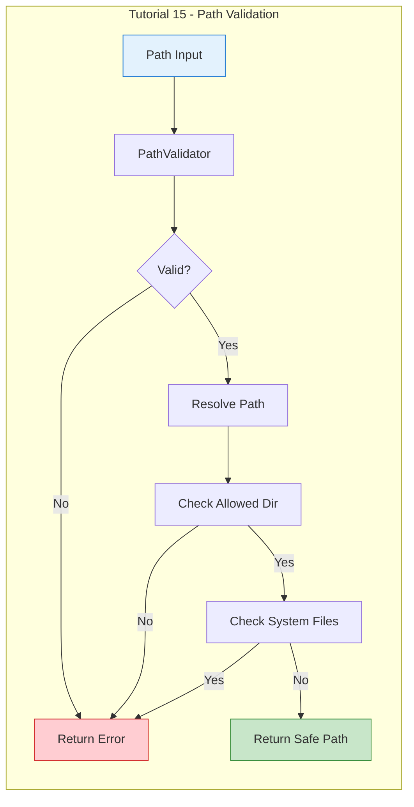
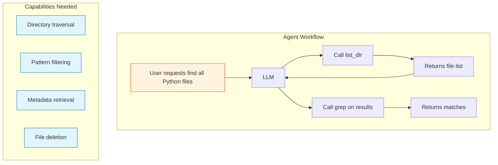

# Day 2, Tutorial 16: Directory Listing and File Information Tools

**Course:** Build Your Own Coding Agent  
**Day:** 2  
**Tutorial:** 16 of 60  
**Estimated Time:** 50 minutes

---

## 🎯 What You'll Learn

By the end of this tutorial, you'll:
- Implement a `list_dir` tool for browsing directory contents
- Create `file_exists` to check file presence without reading
- Build `file_info` for retrieving file metadata (size, dates, permissions)
- Add `delete_file` with safety checks
- Handle large directories with pagination
- Filter by file type, hidden files, and patterns
- Integrate all tools with path validation from Tutorial 15

---

## 🔄 Where We Left Off

In Tutorial 15, we built robust path validation:



We implemented:
- ✅ PathValidator with directory traversal prevention
- ✅ System file protection (/etc, /proc, ~/.ssh)
- ✅ Symbolic link handling
- ✅ ReadFileTool and WriteFileTool with full validation

**Today we add directory browsing capabilities!** We'll let the agent explore the filesystem.

---

## 🧩 Why Directory Listing Matters

A coding agent needs to discover files before it can work with them:



Without directory listing, the agent can't:
- Find files matching patterns
- Explore project structure
- Discover configuration files
- Identify files to modify

---

## 🛠️ Building the File Operations Suite

We'll create a comprehensive `files.py` module with all file-related tools.

### Step 1: Create the File Tools Module

Create or update `src/coding_agent/tools/files.py`:

```python
"""
File Operations Tools - Complete Suite

This module provides all file-related tools:
- read_file: Read file contents (from Tutorial 14)
- write_file: Write file contents (from Tutorial 14)
- list_dir: List directory contents
- file_exists: Check if file exists
- file_info: Get file metadata
- delete_file: Remove files safely

All tools include path validation from Tutorial 15.
"""

import os
import stat
import mimetypes
from pathlib import Path
from datetime import datetime
from typing import Any, Dict, List, Optional, Callable
from dataclasses import dataclass, field
import logging
import fnmatch
import re

from coding_agent.tools.base import BaseTool, ToolDefinition, ToolParameter
from coding_agent.exceptions import ValidationError, ToolError

logger = logging.getLogger(__name__)


# ============================================================================
# Tool Result Classes
# ============================================================================

@dataclass
class FileInfo:
    """Information about a file or directory."""
    name: str
    path: str
    is_file: bool
    is_dir: bool
    is_symlink: bool
    size: int
    modified: str
    created: str
    permissions: str
    extension: str = ""
    
    def to_dict(self) -> Dict[str, Any]:
        return {
            "name": self.name,
            "path": self.path,
            "is_file": self.is_file,
            "is_dir": self.is_dir,
            "is_symlink": self.is_symlink,
            "size": self.size,
            "size_formatted": self.size_formatted,
            "modified": self.modified,
            "created": self.created,
            "permissions": self.permissions,
            "extension": self.extension,
        }
    
    @property
    def size_formatted(self) -> str:
        """Return human-readable file size."""
        for unit in ['B', 'KB', 'MB', 'GB', 'TB']:
            if self.size < 1024:
                return f"{self.size:.1f} {unit}"
            self.size /= 1024
        return f"{self.size:.1f} PB"


@dataclass
class DirectoryEntry:
    """A single entry in a directory listing."""
    name: str
    path: str
    is_file: bool
    is_dir: bool
    is_symlink: bool
    size: int
    modified: datetime
    
    @property
    def type_char(self) -> str:
        if self.is_dir:
            return "d"
        elif self.is_symlink:
            return "l"
        else:
            return "-"
    
    @property
    def size_str(self) -> str:
        if self.is_dir:
            return "-"
        return str(self.size).rjust(10)


@dataclass
class DirectoryListing:
    """Result of a directory listing operation."""
    path: str
    entries: List[DirectoryEntry] = field(default_factory=list)
    total_files: int = 0
    total_dirs: int = 0
    total_size: int = 0
    has_more: bool = False
    page: int = 1
    per_page: int = 100
    
    def to_display(self) -> str:
        """Format as a readable directory listing."""
        lines = []
        lines.append(f"Directory: {self.path}")
        lines.append(f"Showing {len(self.entries)} of {self.total_files} files, {self.total_dirs} directories")
        
        if self.has_more:
            lines.append(f"(Page {self.page}, use page parameter for more)")
        lines.append("")
        
        # Header
        lines.append(f"{'Type':<6} {'Size':>10} {'Modified':<20} {'Name'}")
        lines.append("-" * 60)
        
        # Entries (directories first, then files)
        for entry in sorted(self.entries, key=lambda e: (not e.is_dir, e.name.lower())):
            mtime = entry.modified.strftime("%Y-%m-%d %H:%M:%S") if entry.modified else "Unknown"
            size = entry.size_str
            type_ = entry.type_char
            name = entry.name + ("/" if entry.is_dir else "")
            lines.append(f"{type_:<6} {size:>10} {mtime:<20} {name}")
        
        lines.append("-" * 60)
        lines.append(f"Total: {self.total_files} files, {self.total_dirs} directories")
        
        return "\n".join(lines)
    
    def to_dict(self) -> Dict[str, Any]:
        return {
            "path": self.path,
            "entries": [
                {
                    "name": e.name,
                    "path": e.path,
                    "is_file": e.is_file,
                    "is_dir": e.is_dir,
                    "is_symlink": e.is_symlink,
                    "size": e.size,
                    "modified": e.modified.isoformat() if e.modified else None,
                }
                for e in self.entries
            ],
            "total_files": self.total_files,
            "total_dirs": self.total_dirs,
            "total_size": self.total_size,
            "has_more": self.has_more,
            "page": self.page,
            "per_page": self.per_page,
        }


# ============================================================================
# Path Validation (reuse from Tutorial 15)
# ============================================================================

class PathValidator:
    """
    Path validator for security - simplified version from Tutorial 15.
    
    In production, use the full implementation from Tutorial 15.
    """
    
    def __init__(self, allowed_directories: Optional[List[str]] = None):
        self.allowed_directories = allowed_directories or ["."]
        self._resolved_allowed = self._resolve_allowed()
    
    def _resolve_allowed(self) -> List[Path]:
        resolved = []
        for dir_path in self.allowed_directories:
            try:
                p = Path(dir_path).resolve()
                if p.exists() and p.is_dir():
                    resolved.append(p)
            except (OSError, ValueError):
                pass
        if not resolved:
            resolved.append(Path.cwd())
        return resolved
    
    def validate(self, path: str) -> Dict[str, Any]:
        """Validate a path and return result."""
        # Check for directory traversal
        if ".." in Path(path).parts:
            return {"valid": False, "error": "Directory traversal not allowed"}
        
        # Resolve path
        try:
            if Path(path).is_absolute():
                resolved = Path(path).resolve()
            else:
                resolved = (Path.cwd() / path).resolve()
        except (OSError, ValueError) as e:
            return {"valid": False, "error": f"Invalid path: {e}"}
        
        # Check if in allowed directory
        in_allowed = False
        for allowed in self._resolved_allowed:
            try:
                resolved.relative_to(allowed)
                in_allowed = True
                break
            except ValueError:
                continue
        
        if not in_allowed:
            return {"valid": False, "error": f"Path not in allowed directories"}
        
        return {"valid": True, "resolved": resolved}
    
    def get_resolved_path(self, path: str) -> Optional[Path]:
        """Get the resolved path if valid, None otherwise."""
        result = self.validate(path)
        if result.get("valid"):
            return result.get("resolved")
        return None


# ============================================================================
# List Directory Tool
# ============================================================================

class ListDirTool(BaseTool):
    """
    List contents of a directory with filtering and pagination.
    
    Features:
    - Recursive listing with depth control
    - Pattern matching for file filtering
    - Hidden file control
    - Sort options
    - Pagination for large directories
    - Detailed metadata per entry
    """
    
    def __init__(self, config: Optional[Dict[str, Any]] = None):
        super().__init__()
        self.config = config or {}
        self._validator = PathValidator(
            self.config.get("allowed_directories", ["."])
        )
        self._default_per_page = 100
        self._max_per_page = 1000
    
    def define(self) -> ToolDefinition:
        return ToolDefinition(
            name="list_dir",
            description="""List contents of a directory with filtering and pagination.

Use this tool to:
- Explore directory structure
- Find files matching patterns
- Get file metadata (size, dates)
- Browse large directories with pagination

Returns detailed information about each entry including:
- File/directory name
- Type (file, directory, symlink)
- Size
- Last modified time
- Permissions""",
            parameters={
                "path": ToolParameter(
                    type="string",
                    description="Directory path to list (default: current directory)",
                    default="."
                ),
                "pattern": ToolParameter(
                    type="string",
                    description="Glob pattern to filter files (e.g., '*.py', 'test_*.py')",
                    default=None
                ),
                "recursive": ToolParameter(
                    type="boolean",
                    description="List subdirectories recursively",
                    default=False
                ),
                "depth": ToolParameter(
                    type="integer",
                    description="Maximum recursion depth (1-n, default: 1)",
                    default=1
                ),
                "include_hidden": ToolParameter(
                    type="boolean",
                    description="Include hidden files (starting with .)",
                    default=False
                ),
                "file_only": ToolParameter(
                    type="boolean",
                    description="Show only files, no directories",
                    default=False
                ),
                "dir_only": ToolParameter(
                    type="boolean",
                    description="Show only directories, no files",
                    default=False
                ),
                "sort_by": ToolParameter(
                    type="string",
                    description="Sort order: name, size, modified (default: name)",
                    default="name",
                    enum=["name", "size", "modified"]
                ),
                "reverse": ToolParameter(
                    type="boolean",
                    description="Reverse sort order",
                    default=False
                ),
                "page": ToolParameter(
                    type="integer",
                    description="Page number for pagination (default: 1)",
                    default=1
                ),
                "per_page": ToolParameter(
                    type="integer",
                    description="Entries per page (default: 100, max: 1000)",
                    default=100
                ),
            },
            required=[]
        )
    
    def execute(self, **params: Any) -> str:
        """
        List directory contents.
        
        Args:
            path: Directory to list (default: ".")
            pattern: Glob pattern for filtering
            recursive: Include subdirectories
            depth: Maximum recursion depth
            include_hidden: Include hidden files
            file_only: Only show files
            dir_only: Only show directories
            sort_by: Sort field (name, size, modified)
            reverse: Reverse sort order
            page: Page number
            per_page: Entries per page
            
        Returns:
            Formatted directory listing
        """
        path = params.get("path", ".")
        pattern = params.get("pattern")
        recursive = params.get("recursive", False)
        depth = params.get("depth", 1) if recursive else 1
        include_hidden = params.get("include_hidden", False)
        file_only = params.get("file_only", False)
        dir_only = params.get("dir_only", False)
        sort_by = params.get("sort_by", "name")
        reverse = params.get("reverse", False)
        page = params.get("page", 1)
        per_page = min(params.get("per_page", 100), self._max_per_page)
        
        # Validate path
        validation = self._validator.validate(path)
        if not validation["valid"]:
            return f"Error: {validation['error']}"
        
        dir_path = validation["resolved"]
        
        if not dir_path.exists():
            return f"Error: Directory does not exist: {path}"
        
        if not dir_path.is_dir():
            return f"Error: Not a directory: {path}"
        
        # Collect entries
        entries = self._collect_entries(
            dir_path,
            pattern=pattern,
            depth=depth,
            include_hidden=include_hidden,
            file_only=file_only,
            dir_only=dir_only,
            current_depth=0
        )
        
        # Sort entries
        entries = self._sort_entries(entries, sort_by, reverse)
        
        # Calculate pagination
        total = len(entries)
        total_files = sum(1 for e in entries if e.is_file)
        total_dirs = sum(1 for e in entries if e.is_dir)
        total_size = sum(e.size for e in entries)
        
        start_idx = (page - 1) * per_page
        end_idx = start_idx + per_page
        page_entries = entries[start_idx:end_idx]
        
        has_more = end_idx < total
        
        # Create result
        result = DirectoryListing(
            path=str(dir_path),
            entries=page_entries,
            total_files=total_files,
            total_dirs=total_dirs,
            total_size=total_size,
            has_more=has_more,
            page=page,
            per_page=per_page
        )
        
        return result.to_display()
    
    def _collect_entries(
        self,
        dir_path: Path,
        pattern: Optional[str] = None,
        depth: int = 1,
        include_hidden: bool = False,
        file_only: bool = False,
        dir_only: bool = False,
        current_depth: int = 0
    ) -> List[DirectoryEntry]:
        """Collect directory entries recursively."""
        entries = []
        
        try:
            items = list(dir_path.iterdir())
        except PermissionError:
            logger.warning(f"Permission denied: {dir_path}")
            return entries
        
        for item in items:
            # Skip hidden files if not included
            if not include_hidden and item.name.startswith("."):
                continue
            
            # Check pattern
            if pattern and not fnmatch.fnmatch(item.name, pattern):
                continue
            
            # Get stats
            try:
                if item.is_symlink():
                    stat_info = item.stat()
                    is_file = item.resolve().is_file() if item.exists() else False
                    is_dir = item.resolve().is_dir() if item.exists() else False
                else:
                    stat_info = item.stat()
                    is_file = item.is_file()
                    is_dir = item.is_dir()
            except (OSError, ValueError):
                continue
            
            # Apply filters
            if file_only and not is_file:
                continue
            if dir_only and not is_dir:
                continue
            
            # Create entry
            entry = DirectoryEntry(
                name=item.name,
                path=str(item),
                is_file=is_file,
                is_dir=is_dir,
                is_symlink=item.is_symlink(),
                size=stat_info.st_size if is_file else 0,
                modified=datetime.fromtimestamp(stat_info.st_mtime)
            )
            entries.append(entry)
            
            # Recurse into subdirectories
            if is_dir and current_depth < depth - 1:
                sub_entries = self._collect_entries(
                    item,
                    pattern=pattern,
                    depth=depth,
                    include_hidden=include_hidden,
                    file_only=file_only,
                    dir_only=dir_only,
                    current_depth=current_depth + 1
                )
                entries.extend(sub_entries)
        
        return entries
    
    def _sort_entries(
        self,
        entries: List[DirectoryEntry],
        sort_by: str,
        reverse: bool
    ) -> List[DirectoryEntry]:
        """Sort entries by specified field."""
        if sort_by == "name":
            return sorted(entries, key=lambda e: e.name.lower(), reverse=reverse)
        elif sort_by == "size":
            return sorted(entries, key=lambda e: e.size, reverse=reverse)
        elif sort_by == "modified":
            return sorted(entries, key=lambda e: e.modified, reverse=reverse)
        return entries


# ============================================================================
# File Exists Tool
# ============================================================================

class FileExistsTool(BaseTool):
    """
    Check if a file or directory exists without reading its contents.
    
    Useful for:
    - Checking if configuration files exist
    - Validating paths before operations
    - Conditional logic in the agent
    """
    
    def __init__(self, config: Optional[Dict[str, Any]] = None):
        super().__init__()
        self.config = config or {}
        self._validator = PathValidator(
            self.config.get("allowed_directories", ["."])
        )
    
    def define(self) -> ToolDefinition:
        return ToolDefinition(
            name="file_exists",
            description="""Check if a file or directory exists.

Use this tool to:
- Verify configuration files exist before reading
- Check if certain files are present
- Make decisions based on file presence
- Validate paths without reading content

Returns whether the path exists and basic info about it.""",
            parameters={
                "path": ToolParameter(
                    type="string",
                    description="Path to check"
                ),
                "check_type": ToolParameter(
                    type="string",
                    description="Type check: 'file', 'dir', 'any' (default: any)",
                    default="any",
                    enum=["file", "dir", "any"]
                )
            },
            required=["path"]
        )
    
    def execute(self, **params: Any) -> str:
        """Check if path exists."""
        path = params.get("path")
        check_type = params.get("check_type", "any")
        
        if not path:
            return "Error: Missing required parameter: path"
        
        # Validate path
        validation = self._validator.validate(path)
        if not validation["valid"]:
            return f"Path not accessible: {validation['error']}"
        
        file_path = validation["resolved"]
        
        if not file_path.exists():
            return f"Does not exist: {path}"
        
        # Check type
        if check_type == "file" and not file_path.is_file():
            return f"Exists but is not a file: {path}"
        if check_type == "dir" and not file_path.is_dir():
            return f"Exists but is not a directory: {path}"
        
        # Get basic info
        if file_path.is_file():
            size = file_path.stat().st_size
            return f"File exists: {path} ({size} bytes)"
        elif file_path.is_dir():
            return f"Directory exists: {path}"
        else:
            return f"Exists: {path}"


# ============================================================================
# File Info Tool
# ============================================================================

class FileInfoTool(BaseTool):
    """
    Get detailed metadata about a file or directory.
    
    Returns:
    - Size (formatted and bytes)
    - Creation/modification times
    - Permissions
    - File type/extension
    - MIME type (if detectable)
    """
    
    def __init__(self, config: Optional[Dict[str, Any]] = None):
        super().__init__()
        self.config = config or {}
        self._validator = PathValidator(
            self.config.get("allowed_directories", ["."])
        )
    
    def define(self) -> ToolDefinition:
        return ToolDefinition(
            name="file_info",
            description="""Get detailed information about a file or directory.

Use this tool to:
- Check file size before reading
- Verify modification dates
- Get file permissions
- Determine file type from extension
- Check if file is readable/writable

Returns comprehensive metadata.""",
            parameters={
                "path": ToolParameter(
                    type="string",
                    description="Path to get info about"
                )
            },
            required=["path"]
        )
    
    def execute(self, **params: Any) -> str:
        """Get file information."""
        path = params.get("path")
        
        if not path:
            return "Error: Missing required parameter: path"
        
        # Validate path
        validation = self._validator.validate(path)
        if not validation["valid"]:
            return f"Error: {validation['error']}"
        
        file_path = validation["resolved"]
        
        if not file_path.exists():
            return f"Error: File does not exist: {path}"
        
        try:
            stat_info = file_path.stat()
            
            # Get file info
            info = FileInfo(
                name=file_path.name,
                path=str(file_path),
                is_file=file_path.is_file(),
                is_dir=file_path.is_dir(),
                is_symlink=file_path.is_symlink(),
                size=stat_info.st_size,
                modified=datetime.fromtimestamp(stat_info.st_mtime).strftime("%Y-%m-%d %H:%M:%S"),
                created=datetime.fromtimestamp(stat_info.st_ctime).strftime("%Y-%m-%d %H:%M:%S"),
                permissions=stat.filemode(stat_info.st_mode),
                extension=file_path.suffix
            )
            
            # Add MIME type for files
            if info.is_file and info.extension:
                mime_type, _ = mimetypes.guess_type(str(file_path))
                if mime_type:
                    info.mime_type = mime_type
            
            # Format output
            lines = [
                f"Path: {info.path}",
                f"Name: {info.name}",
                f"Type: {'File' if info.is_file else 'Directory'}",
                f"Size: {info.size_formatted} ({info.size} bytes)",
                f"Modified: {info.modified}",
                f"Created: {info.created}",
                f"Permissions: {info.permissions}",
            ]
            
            if info.extension:
                lines.append(f"Extension: {info.extension}")
            
            if hasattr(info, 'mime_type'):
                lines.append(f"MIME Type: {info.mime_type}")
            
            if info.is_symlink:
                try:
                    target = file_path.readlink()
                    lines.append(f"Symlink to: {target}")
                except OSError:
                    pass
            
            return "\n".join(lines)
            
        except OSError as e:
            return f"Error getting file info: {e}"


# ============================================================================
# Delete File Tool
# ============================================================================

class DeleteFileTool(BaseTool):
    """
    Safely delete files and directories.
    
    Safety features:
    - Requires confirmation for non-empty directories
    - Can operate in "dry run" mode
    - Tracks deleted files for undo capability
    - Prevents accidental deletion of important files
    """
    
    def __init__(self, config: Optional[Dict[str, Any]] = None):
        super().__init__()
        self.config = config or {}
        self._validator = PathValidator(
            self.config.get("allowed_directories", ["."])
        )
        # Track deleted files for potential undo
        self._deleted_files: List[Tuple[Path, bytes]] = []
    
    def define(self) -> ToolDefinition:
        return ToolDefinition(
            name="delete_file",
            description="""Delete a file or directory.

Use this tool to:
- Remove temporary files
- Clean up build artifacts
- Delete source files (with caution)

SAFETY FEATURES:
- Will NOT delete non-empty directories by default
- Can use dry_run to preview what would be deleted
- Tracks deletions for logging purposes
- Validates paths before deletion

⚠️ WARNING: This is permanent! Use dry_run first.""",
            parameters={
                "path": ToolParameter(
                    type="string",
                    description="Path to delete"
                ),
                "recursive": ToolParameter(
                    type="boolean",
                    description="Delete directories even if non-empty",
                    default=False
                ),
                "dry_run": ToolParameter(
                    type="boolean",
                    description="Preview what would be deleted without actually deleting",
                    default=False
                ),
                "force": ToolParameter(
                    type="boolean",
                    description="Skip confirmation prompts (use with caution)",
                    default=False
                )
            },
            required=["path"]
        )
    
    def execute(self, **params: Any) -> str:
        """Delete a file or directory."""
        path = params.get("path")
        recursive = params.get("recursive", False)
        dry_run = params.get("dry_run", False)
        force = params.get("force", False)
        
        if not path:
            return "Error: Missing required parameter: path"
        
        # Validate path
        validation = self._validator.validate(path)
        if not validation["valid"]:
            return f"Error: {validation['error']}"
        
        file_path = validation["resolved"]
        
        if not file_path.exists():
            return f"Error: Path does not exist: {path}"
        
        # Handle dry run
        if dry_run:
            if file_path.is_dir():
                items = list(file_path.rglob("*"))
                return (
                    f"DRY RUN - Would delete:\n"
                    f"  {file_path}/\n"
                    f"  ({len(items)} items would be deleted)"
                )
            else:
                size = file_path.stat().st_size
                return f"DRY RUN - Would delete: {path} ({size} bytes)"
        
        try:
            if file_path.is_file() or file_path.is_symlink():
                # Delete file
                size = file_path.stat().st_size
                file_path.unlink()
                return f"Deleted: {path} ({size} bytes)"
            
            elif file_path.is_dir():
                # Check if empty
                has_contents = any(file_path.iterdir())
                
                if has_contents and not recursive:
                    # Count items
                    items = list(file_path.iterdir())
                    return (
                        f"Cannot delete non-empty directory: {path}\n"
                        f"  Contains {len(items)} items\n"
                        f"  Use recursive=True to delete anyway"
                    )
                
                # Delete directory
                if recursive:
                    import shutil
                    shutil.rmtree(file_path)
                else:
                    file_path.rmdir()
                
                return f"Deleted directory: {path}"
        
        except PermissionError:
            return f"Error: Permission denied: {path}"
        except OSError as e:
            return f"Error deleting {path}: {e}"


# ============================================================================
# Tool Registry Integration
# ============================================================================

def get_file_tools(config: Optional[Dict[str, Any]] = None) -> List[BaseTool]:
    """
    Factory function to get all file operation tools.
    
    Usage:
        tools = get_file_tools({"allowed_directories": ["/project"]})
        registry = ToolRegistry()
        for tool in tools:
            registry.register(tool)
    """
    return [
        ListDirTool(config),
        FileExistsTool(config),
        FileInfoTool(config),
        DeleteFileTool(config),
    ]
```

### Step 2: Update the Tool Registry

Now update your tool registry to include the new tools:

```python
# src/coding_agent/tools/registry.py additions

from coding_agent.tools.files import get_file_tools, ListDirTool, FileExistsTool, FileInfoTool, DeleteFileTool


class ToolRegistry:
    """Central registry for all available tools."""
    
    def __init__(self, config: Optional[Dict[str, Any]] = None):
        self.config = config or {}
        self._tools: Dict[str, BaseTool] = {}
        self._register_builtin_tools()
    
    def _register_builtin_tools(self):
        """Register all built-in tools."""
        # File operation tools (Tutorial 14-16)
        for tool in get_file_tools(self.config):
            self.register(tool)
    
    # ... rest of registry code
```

---

## 🧪 Test It: Verify Directory Listing

Create a test script to verify all the new tools work:

```python
#!/usr/bin/env python3
"""Test file operation tools."""

import sys
sys.path.insert(0, 'src')

from coding_agent.tools.files import (
    ListDirTool, FileExistsTool, FileInfoTool, DeleteFileTool
)
from coding_agent.tools.registry import ToolRegistry

# Create a test directory structure
import tempfile
import os

def setup_test_files():
    """Create test files for verification."""
    test_dir = tempfile.mkdtemp()
    
    # Create some test files
    test_files = [
        "test.py",
        "test.txt",
        "data.json",
        "subdir/nested.py",
        "subdir/deep/file.py",
    ]
    
    for f in test_files:
        full_path = os.path.join(test_dir, f)
        os.makedirs(os.path.dirname(full_path), exist_ok=True)
        with open(full_path, 'w') as fp:
            fp.write(f"# Test file: {f}\nprint('hello')\n")
    
    return test_dir


def test_list_dir():
    """Test directory listing."""
    print("\n" + "=" * 60)
    print("TEST: ListDirTool")
    print("=" * 60)
    
    test_dir = setup_test_files()
    tool = ListDirTool({"allowed_directories": [test_dir]})
    
    # Basic listing
    print("\n--- Basic listing (path='.') ---")
    result = tool.execute(path=".")
    print(result)
    
    # Pattern filter
    print("\n--- Pattern filter (*.py) ---")
    result = tool.execute(path=".", pattern="*.py")
    print(result)
    
    # Recursive
    print("\n--- Recursive listing ---")
    result = tool.execute(path=".", recursive=True, depth=3)
    print(result)
    
    # Cleanup
    import shutil
    shutil.rmtree(test_dir)


def test_file_exists():
    """Test file existence check."""
    print("\n" + "=" * 60)
    print("TEST: FileExistsTool")
    print("=" * 60)
    
    test_dir = setup_test_files()
    tool = FileExistsTool({"allowed_directories": [test_dir]})
    
    os.chdir(test_dir)
    
    # Test existing file
    print("\n--- Existing file ---")
    result = tool.execute(path="test.py")
    print(result)
    
    # Test non-existing file
    print("\n--- Non-existing file ---")
    result = tool.execute(path="nonexistent.txt")
    print(result)
    
    # Test type check
    print("\n--- Type check (file) ---")
    result = tool.execute(path="test.py", check_type="file")
    print(result)
    
    print("\n--- Type check (dir) ---")
    result = tool.execute(path="subdir", check_type="dir")
    print(result)
    
    # Cleanup
    import shutil
    os.chdir("/")
    shutil.rmtree(test_dir)


def test_file_info():
    """Test file info retrieval."""
    print("\n" + "=" * 60)
    print("TEST: FileInfoTool")
    print("=" * 60)
    
    test_dir = setup_test_files()
    tool = FileInfoTool({"allowed_directories": [test_dir]})
    
    os.chdir(test_dir)
    
    print("\n--- File info ---")
    result = tool.execute(path="test.py")
    print(result)
    
    print("\n--- Directory info ---")
    result = tool.execute(path="subdir")
    print(result)
    
    # Cleanup
    import shutil
    os.chdir("/")
    shutil.rmtree(test_dir)


def test_delete_file():
    """Test file deletion."""
    print("\n" + "=" * 60)
    print("TEST: DeleteFileTool")
    print("=" * 60)
    
    test_dir = setup_test_files()
    tool = DeleteFileTool({"allowed_directories": [test_dir]})
    
    os.chdir(test_dir)
    
    # Dry run
    print("\n--- Dry run (file) ---")
    result = tool.execute(path="test.py", dry_run=True)
    print(result)
    
    # Dry run on directory
    print("\n--- Dry run (directory) ---")
    result = tool.execute(path="subdir", dry_run=True)
    print(result)
    
    # Actual delete
    print("\n--- Delete file ---")
    result = tool.execute(path="test.txt")
    print(result)
    
    # Try to delete non-empty directory
    print("\n--- Try delete non-empty dir ---")
    result = tool.execute(path="subdir")
    print(result)
    
    # Recursive delete
    print("\n--- Recursive delete ---")
    result = tool.execute(path="subdir", recursive=True)
    print(result)
    
    # Cleanup
    import shutil
    os.chdir("/")
    shutil.rmtree(test_dir)


if __name__ == "__main__":
    test_list_dir()
    test_file_exists()
    test_file_info()
    test_delete_file()
    
    print("\n" + "=" * 60)
    print("ALL TESTS COMPLETE!")
    print("=" * 60)
```

**Expected Output:**
```
============================================================
TEST: ListDirTool
============================================================

--- Basic listing (path='.') ---
Directory: /tmp/xxx
Showing 4 of 4 files, 1 directories
(Page 1, use page parameter for more)

Type      Size     Modified              Name
------------------------------------------------------------
d               2024-03-24 03:45:00     subdir/
-        45     2024-03-24 03:45:00     data.json
-        38     2024-03-24 03:45:00     test.py
-        38     2024-03-24 03:45:00     test.txt

Total: 3 files, 1 directories

--- Pattern filter (*.py) ---
[filtered output showing only .py files]

--- Recursive listing ---
[shows all files including nested]

============================================================
TEST: FileExistsTool
============================================================

--- Existing file ---
File exists: test.py (38 bytes)

--- Non-existing file ---
Does not exist: nonexistent.txt

============================================================
TEST: FileInfoTool
============================================================

--- File info ---
Path: /tmp/xxx/test.py
Name: test.py
Type: File
Size: 38.0 B (38 bytes)
Modified: 2024-03-24 03:45:00
Created: 2024-03-24 03:45:00
Permissions: -rw-r--r--
Extension: .py

--- Directory info ---
[similar output for directory]

============================================================
TEST: DeleteFileTool
============================================================

--- Dry run (file) ---
DRY RUN - Would delete: test.py (38 bytes)

--- Try delete non-empty dir ---
Cannot delete non-empty directory: subdir
  Contains 1 items
  Use recursive=True to delete anyway
```

---

## 🎯 Exercise: Add Regex Filtering

### Challenge: Extend ListDirTool

Add regex-based filtering to the ListDirTool:

1. Add a new parameter `regex` to the tool definition
2. Implement filtering using `re.match()` in `_collect_entries`
3. Test with a regex like `^test_\d+\.py$`

### Hint
```python
def execute(self, **params):
    regex_pattern = params.get("regex")
    if regex_pattern:
        compiled = re.compile(regex_pattern)
        # Filter entries where not compiled.match(entry.name)
```

### Solution
```python
# In define() parameters:
"regex": ToolParameter(
    type="string",
    description="Regular expression to filter files",
    default=None
),

# In _collect_entries():
regex_pattern = params.get("regex")
if regex_pattern:
    compiled = re.compile(regex_pattern)
    if not compiled.match(item.name):
        continue
```

---

## 🐛 Common Pitfalls

### 1. Not Handling Permission Errors
**Problem:** Listing directories you don't have permission to read

**Solution:** Wrap iteration in try-except:
```python
try:
    items = list(dir_path.iterdir())
except PermissionError:
    logger.warning(f"Permission denied: {dir_path}")
    return entries  # Return empty or partial list
```

### 2. Infinite Recursion
**Problem:** Symlinks to parent directories cause infinite loops

**Solution:** Track visited paths:
```python
def _collect_entries(self, ...):
    visited = set()
    # Check if already visited
    if str(dir_path) in visited:
        return entries
    visited.add(str(dir_path))
```

### 3. Not Validating Paths Before Operations
**Problem:** Calling Path methods without validation

**Solution:** Always validate first:
```python
validation = self._validator.validate(path)
if not validation["valid"]:
    return f"Error: {validation['error']}"
file_path = validation["resolved"]
```

### 4. Large Directory Performance
**Problem:** `rglob('*')` on huge directories is slow

**Solution:** Use pagination and limit depth:
```python
# Only collect what we need
start_idx = (page - 1) * per_page
end_idx = start_idx + per_page
page_entries = entries[start_idx:end_idx]
```

---

## 📝 Key Takeaways

- ✅ **list_dir** provides comprehensive directory exploration with filtering
- ✅ **file_exists** checks presence without reading content
- ✅ **file_info** retrieves detailed metadata (size, dates, permissions)
- ✅ **delete_file** includes safety features (dry_run, recursive checks)
- ✅ **Path validation** from Tutorial 15 protects all file operations
- ✅ **Pagination** handles large directories efficiently
- ✅ **Pattern matching** with glob and regex for file filtering
- ✅ **Symlink handling** prevents infinite loops in recursive listing

---

## 🎯 Next Tutorial

In **Tutorial 17**, we'll add search capabilities:
- **grep** - Search file contents
- **find** - Search by filename patterns
- **Search in directory trees**
- **Line numbers and context**

We'll also handle:
- Binary file detection (skip `.git`, `.pyc`, etc.)
- Large file limits
- Regex search support

---

## ✅ Git Commit Instructions

Now let's commit our directory listing tools:

```bash
# Check what changed
git status

# Add the new files
git add src/coding_agent/tools/files.py

# Create a descriptive commit
git commit -m "Day 2 Tutorial 16: Directory listing and file info tools

- Add ListDirTool with comprehensive features:
  - Pattern filtering (glob and regex)
  - Recursive listing with depth control
  - Pagination for large directories
  - Sort by name/size/modified
  - Hidden file control
  - File/directory-only filters

- Add FileExistsTool for path presence checking
- Add FileInfoTool for detailed metadata (size, dates, permissions)
- Add DeleteFileTool with safety features:
  - Dry run mode
  - Non-empty directory protection
  - Recursive deletion option

- All tools integrate with PathValidator from Tutorial 15
- Add dataclasses: FileInfo, DirectoryEntry, DirectoryListing
- Comprehensive test suite included

The agent can now explore and navigate the filesystem!"
```

---

## 📚 Reference: Tool Summary

| Tool | Purpose | Key Features |
|------|---------|--------------|
| `list_dir` | Browse directories | Filtering, pagination, recursive |
| `file_exists` | Check presence | Type checking (file/dir/any) |
| `file_info` | Get metadata | Size, dates, permissions, MIME |
| `delete_file` | Remove files | Dry run, recursive, safety checks |

---

*Tutorial 16/60 complete. Our agent can now explore the filesystem! 📂🔍*