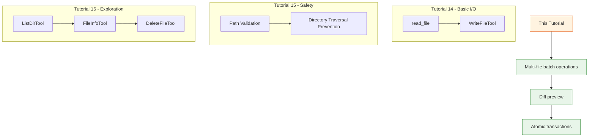
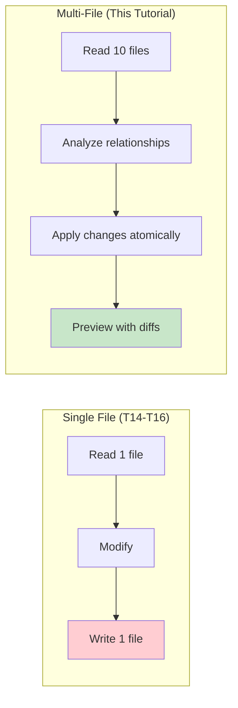

# Day 2, Tutorial 17: Multi-File Operations

**Course:** Build Your Own Coding Agent  
**Day:** 2  
**Tutorial:** 17 of 60  
**Estimated Time:** 55 minutes

---

## 🎯 What You'll Learn

By the end of this tutorial, you'll:
- Implement batch read/write operations across multiple files
- Create tools for applying changes to multiple files atomically
- Build file diff preview capabilities to show changes before writing
- Implement transaction-style operations (all-or-nothing writes)
- Handle multi-file search with aggregated results
- Understand when to use single vs. multi-file operations

---

## 🔄 Where We Left Off

In Tutorials 14-16, we built a comprehensive file operation suite:



We now have:
- ✅ `read_file` - Read file contents with validation
- ✅ `write_file` - Write files with safety checks
- ✅ `list_dir` - Explore directory structure
- ✅ `file_exists` - Check file presence
- ✅ `file_info` - Get file metadata
- ✅ `delete_file` - Remove files safely
- ✅ Path validation preventing directory traversal

**Today we add multi-file operations!** Working with one file at a time is limiting. Real coding tasks involve multiple files.

---

## 🧩 Why Multi-File Operations Matter

A coding agent frequently needs to:



**Real-world scenarios:**
1. **Refactoring** - Rename a function across 10 files
2. **Add imports** - Import a new module in 20 files
3. **Config changes** - Update configuration across multiple services
4. **Code generation** - Create related files (test + implementation)
5. **Migration** - Move code from one module to another

Single-file operations require the LLM to make many sequential tool calls. Multi-file operations are more efficient and can ensure consistency.

---

## 🛠️ Building Multi-File Operations

We'll create a new module `src/coding_agent/tools/multifile.py` with:
1. **ReadMultipleTool** - Read multiple files at once
2. **WriteMultipleTool** - Write multiple files with transaction support
3. **DiffTool** - Show differences between current and proposed content
4. **SearchInFilesTool** - Search across multiple files

### Step 1: Create the Multi-File Tools Module

Create `src/coding_agent/tools/multifile.py`:

```python
"""
Multi-File Operations Tools

Advanced file manipulation for working with multiple files:
- ReadMultipleTool: Batch read files
- WriteMultipleTool: Atomic batch writes with rollback
- DiffTool: Show differences before applying changes
- SearchInFilesTool: Search across multiple files

These tools build on the single-file tools from Tutorials 14-16.
"""

import difflib
import re
from dataclasses import dataclass, field
from pathlib import Path
from typing import Any, Dict, List, Optional, Tuple
import logging

from coding_agent.tools.base import BaseTool, ToolDefinition, ToolParameter
from coding_agent.tools.files import PathValidator
from coding_agent.exceptions import ValidationError

logger = logging.getLogger(__name__)


# ============================================================================
# Result Classes
# ============================================================================

@dataclass
class FileOperation:
    """A single file operation in a multi-file transaction."""
    path: str
    operation: str  # 'read', 'write', 'delete'
    content: Optional[str] = None
    original_content: Optional[str] = None
    success: bool = True
    error: Optional[str] = None


@dataclass
class MultiFileResult:
    """Result of a multi-file operation."""
    operations: List[FileOperation] = field(default_factory=list)
    total_files: int = 0
    successful: int = 0
    failed: int = 0
    
    def to_display(self) -> str:
        """Format result for display."""
        lines = []
        lines.append(f"Multi-file operation completed:")
        lines.append(f"  Total files: {self.total_files}")
        lines.append(f"  Successful: {self.successful}")
        lines.append(f"  Failed: {self.failed}")
        lines.append("")
        
        for op in self.operations:
            status = "✓" if op.success else "✗"
            lines.append(f"  {status} {op.operation.upper()}: {op.path}")
            if op.error:
                lines.append(f"      Error: {op.error}")
        
        return "\n".join(lines)
    
    def to_dict(self) -> Dict[str, Any]:
        return {
            "total_files": self.total_files,
            "successful": self.successful,
            "failed": self.failed,
            "operations": [
                {
                    "path": op.path,
                    "operation": op.operation,
                    "success": op.success,
                    "error": op.error,
                }
                for op in self.operations
            ]
        }


@dataclass
class DiffResult:
    """Result of a diff operation."""
    file_path: str
    old_content: str
    new_content: str
    diff_lines: List[str] = field(default_factory=list)
    additions: int = 0
    deletions: int = 0
    changes: bool = False
    
    def to_display(self) -> str:
        """Format diff for display."""
        if not self.changes:
            return f"No changes: {self.file_path}"
        
        lines = [
            f"--- {self.file_path} (original)",
            f"+++ {self.file_path} (modified)",
            ""
        ]
        
        # Use unified diff format
        diff = difflib.unified_diff(
            self.old_content.splitlines(keepends=True),
            self.new_content.splitlines(keepends=True),
            fromfile='a/' + self.file_path,
            tofile='b/' + self.file_path,
            lineterm=''
        )
        
        for line in diff:
            lines.append(line)
        
        lines.append("")
        lines.append(f"Summary: +{self.additions} lines, -{self.deletions} lines")
        
        return "\n".join(lines)


@dataclass
class SearchResult:
    """Result of a multi-file search."""
    query: str
    matches: List[Dict[str, Any]] = field(default_factory=list)
    files_searched: int = 0
    files_with_matches: int = 0
    total_matches: int = 0
    
    def to_display(self) -> str:
        """Format search results for display."""
        lines = [
            f"Search: '{self.query}'",
            f"Files searched: {self.files_searched}",
            f"Files with matches: {self.files_with_matches}",
            f"Total matches: {self.total_matches}",
            ""
        ]
        
        # Group by file
        current_file = None
        for match in self.matches:
            if match["file"] != current_file:
                current_file = match["file"]
                lines.append(f"\n--- {match['file']} ---")
            
            lines.append(f"  Line {match['line']}: {match['content'].strip()}")
        
        return "\n".join(lines)
    
    def to_dict(self) -> Dict[str, Any]:
        return {
            "query": self.query,
            "files_searched": self.files_searched,
            "files_with_matches": self.files_with_matches,
            "total_matches": self.total_matches,
            "matches": self.matches
        }


# ============================================================================
# Read Multiple Files Tool
# ============================================================================

class ReadMultipleTool(BaseTool):
    """
    Read multiple files in a single operation.
    
    Efficient for:
    - Reading related files (e.g., __init__.py + module files)
    - Batch analysis of configuration files
    - Understanding project structure
    
    Features:
    - Parallel-style reading (sequential but single call)
    - Aggregates results with metadata
    - Handles missing files gracefully
    - Reports file sizes and line counts
    """
    
    def __init__(self, config: Optional[Dict[str, Any]] = None):
        super().__init__()
        self.config = config or {}
        self._validator = PathValidator(
            self.config.get("allowed_directories", ["."])
        )
    
    def define(self) -> ToolDefinition:
        return ToolDefinition(
            name="read_multiple",
            description="""Read multiple files in a single operation.

Use this tool to:
- Read related files efficiently (e.g., __init__ + modules)
- Batch load configuration files
- Analyze multiple source files at once
- Get an overview of project structure

Returns aggregated results with metadata for each file.
This is more efficient than multiple read_file calls.""",
            parameters={
                "paths": ToolParameter(
                    type="array",
                    items={"type": "string"},
                    description="List of file paths to read"
                ),
                "max_lines_per_file": ToolParameter(
                    type="integer",
                    description="Maximum lines per file (default: 1000)",
                    default=1000
                ),
                "skip_binary": ToolParameter(
                    type="boolean",
                    description="Skip binary files (default: true)",
                    default=True
                )
            },
            required=["paths"]
        )
    
    def execute(self, **params: Any) -> str:
        """Read multiple files."""
        paths = params.get("paths", [])
        max_lines = params.get("max_lines_per_file", 1000)
        skip_binary = params.get("skip_binary", True)
        
        if not paths:
            return "Error: No paths provided"
        
        result = MultiFileResult()
        result.total_files = len(paths)
        
        for path in paths:
            op = FileOperation(path=path, operation="read")
            
            # Validate path
            validation = self._validator.validate(path)
            if not validation["valid"]:
                op.success = False
                op.error = validation["error"]
                result.failed += 1
                result.operations.append(op)
                continue
            
            file_path = validation["resolved"]
            
            # Check if file exists
            if not file_path.exists():
                op.success = False
                op.error = "File does not exist"
                result.failed += 1
                result.operations.append(op)
                continue
            
            # Check if it's a file
            if not file_path.is_file():
                op.success = False
                op.error = "Not a file"
                result.operations.append(op)
                result.failed += 1
                continue
            
            # Check for binary content
            if skip_binary and self._is_binary(file_path):
                op.success = False
                op.error = "Skipped binary file"
                result.operations.append(op)
                result.failed += 1
                continue
            
            # Read file
            try:
                lines = []
                line_count = 0
                truncated = False
                
                with open(file_path, 'r', encoding='utf-8', errors='replace') as f:
                    for line in f:
                        if line_count >= max_lines:
                            truncated = True
                            break
                        lines.append(line)
                        line_count += 1
                
                content = ''.join(lines)
                if truncated:
                    content += f"\n... [truncated at {max_lines} lines] ..."
                
                op.content = content
                op.success = True
                result.successful += 1
                
            except Exception as e:
                op.success = False
                op.error = str(e)
                result.failed += 1
            
            result.operations.append(op)
        
        return self._format_result(result)
    
    def _is_binary(self, file_path: Path) -> bool:
        """Check if file is likely binary."""
        try:
            with open(file_path, 'rb') as f:
                chunk = f.read(1024)
                # Check for null bytes
                if b'\x00' in chunk:
                    return True
                # Check for high proportion of non-text bytes
                text_bytes = sum(1 for b in chunk if 32 <= b <= 126 or b in (9, 10, 13))
                if len(chunk) > 0 and text_bytes / len(chunk) < 0.75:
                    return True
        except:
            pass
        return False
    
    def _format_result(self, result: MultiFileResult) -> str:
        """Format multi-file read result."""
        lines = [
            f"Read {result.successful}/{result.total_files} files successfully:",
            ""
        ]
        
        for op in result.operations:
            if op.success:
                lines.append(f"✓ {op.path}")
                if op.content:
                    # Show first few lines as preview
                    preview = op.content.split('\n')[:5]
                    if len(op.content.split('\n')) > 5:
                        preview.append("    ...")
                    for p in preview:
                        lines.append(f"    {p[:80]}")
                    if len(op.content.split('\n')) > 5:
                        lines.append(f"    ({len(op.content.split('\\n'))} total lines)")
            else:
                lines.append(f"✗ {op.path}: {op.error}")
        
        return "\n".join(lines)


# ============================================================================
# Write Multiple Files Tool (with Transaction Support)
# ============================================================================

class WriteMultipleTool(BaseTool):
    """
    Write multiple files atomically with transaction support.
    
    Features:
    - Atomic operations: all files written or none
    - Preview mode: see what would be written without writing
    - Backup: keep originals for rollback
    - Conflict detection: warn if files changed since read
    
    This is crucial for making coordinated changes across multiple files.
    """
    
    def __init__(self, config: Optional[Dict[str, Any]] = None):
        super().__init__()
        self.config = config or {}
        self._validator = PathValidator(
            self.config.get("allowed_directories", ["."])
        )
        self._read_only = self.config.get("read_only", False)
    
    def define(self) -> ToolDefinition:
        return ToolDefinition(
            name="write_multiple",
            description="""Write multiple files in a single operation.

Use this tool to:
- Apply coordinated changes across multiple files
- Generate related files (e.g., test + implementation)
- Refactor code across a project
- Apply configuration changes

Features:
- PREVIEW mode: See what would be written without writing
- ATOMIC: All files written or none (transaction)
- BACKUP: Originals saved for potential rollback
- CONFLICT detection: Warn if files changed since read

⚠️ Always use preview=True first to verify changes!""",
            parameters={
                "files": ToolParameter(
                    type="array",
                    items={
                        "type": "object",
                        "properties": {
                            "path": {"type": "string"},
                            "content": {"type": "string"}
                        },
                        "required": ["path", "content"]
                    },
                    description="List of files to write with their content"
                ),
                "preview": ToolParameter(
                    type="boolean",
                    description="Preview what would be written without actually writing",
                    default=False
                ),
                "create_dirs": ToolParameter(
                    type="boolean",
                    description="Create parent directories if needed",
                    default=True
                ),
                "atomic": ToolParameter(
                    type="boolean",
                    description="All files written or none (transaction)",
                    default=True
                ),
                "backup": ToolParameter(
                    type="boolean",
                    description="Create backups before writing",
                    default=True
                )
            },
            required=["files"]
        )
    
    def execute(self, **params: Any) -> str:
        """Write multiple files."""
        if self._read_only:
            return "Error: Write operations disabled (read_only mode)"
        
        files = params.get("files", [])
        preview = params.get("preview", False)
        create_dirs = params.get("create_dirs", True)
        atomic = params.get("atomic", True)
        backup = params.get("backup", True)
        
        if not files:
            return "Error: No files provided"
        
        result = MultiFileResult()
        result.total_files = len(files)
        
        # First pass: validate all paths
        validated_files = []
        for file_spec in files:
            path = file_spec.get("path")
            content = file_spec.get("content", "")
            
            validation = self._validator.validate(path)
            if not validation["valid"]:
                op = FileOperation(
                    path=path,
                    operation="write",
                    content=content,
                    success=False,
                    error=validation["error"]
                )
                result.operations.append(op)
                result.failed += 1
                continue
            
            file_path = validation["resolved"]
            
            # Create directories if needed
            if create_dirs:
                try:
                    file_path.parent.mkdir(parents=True, exist_ok=True)
                except Exception as e:
                    op = FileOperation(
                        path=path,
                        operation="write",
                        content=content,
                        success=False,
                        error=f"Cannot create directories: {e}"
                    )
                    result.operations.append(op)
                    result.failed += 1
                    continue
            
            # Read original content for backup/diff
            original_content = ""
            if file_path.exists():
                try:
                    original_content = file_path.read_text(encoding='utf-8')
                except:
                    pass
            
            validated_files.append({
                "path": path,
                "resolved": file_path,
                "content": content,
                "original": original_content
            })
        
        # If any validations failed and atomic is true, abort
        if result.failed > 0 and atomic:
            return (
                f"Atomic transaction aborted: {result.failed} files failed validation\n"
                f"{result.to_display()}"
            )
        
        # Preview mode
        if preview:
            lines = ["PREVIEW MODE - No files written:", ""]
            for vf in validated_files:
                lines.append(f"--- {vf['path']} ---")
                diff = difflib.unified_diff(
                    vf['original'].splitlines(keepends=True),
                    vf['content'].splitlines(keepends=True),
                    fromfile='a/' + vf['path'],
                    tofile='b/' + vf['path'],
                    lineterm=''
                )
                for line in list(diff)[:50]:  # Limit diff output
                    lines.append(line)
                if vf['original'] != vf['content']:
                    # Show summary
                    old_lines = len(vf['original'].split('\n'))
                    new_lines = len(vf['content'].split('\n'))
                    lines.append(f"    ({old_lines} → {new_lines} lines)")
                lines.append("")
            
            return "\n".join(lines)
        
        # Write files (with rollback on failure if atomic)
        written_files = []
        
        for vf in validated_files:
            file_path = vf["resolved"]
            
            # Create backup
            if backup and vf["original"]:
                backup_path = file_path.with_suffix(file_path.suffix + '.bak')
                try:
                    backup_path.write_text(vf["original"], encoding='utf-8')
                except Exception as e:
                    logger.warning(f"Could not create backup: {e}")
            
            # Write file
            try:
                file_path.write_text(vf["content"], encoding='utf-8')
                written_files.append(vf)
                result.successful += 1
                
                op = FileOperation(
                    path=vf["path"],
                    operation="write",
                    content=f"Written {len(vf['content'])} bytes"
                )
                
            except Exception as e:
                result.failed += 1
                op = FileOperation(
                    path=vf["path"],
                    operation="write",
                    content="",
                    success=False,
                    error=str(e)
                )
                
                # Rollback on failure if atomic
                if atomic:
                    for wf in written_files:
                        try:
                            # Restore from original
                            wf["resolved"].write_text(wf["original"], encoding='utf-8')
                        except:
                            pass
                    return (
                        f"Atomic transaction failed: rolled back {len(written_files)} files\n"
                        f"Failed: {vf['path']} - {e}\n"
                        f"Rollback: All changes reverted"
                    )
            
            result.operations.append(op)
        
        return result.to_display()


# ============================================================================
# Diff Tool
# ============================================================================

class DiffTool(BaseTool):
    """
    Show differences between current file content and proposed content.
    
    This is essential for:
    - Previewing changes before writing
    - Understanding what the LLM plans to change
    - Reviewing proposed modifications
    - Educational purposes (learning by seeing diffs)
    """
    
    def __init__(self, config: Optional[Dict[str, Any]] = None):
        super().__init__()
        self.config = config or {}
        self._validator = PathValidator(
            self.config.get("allowed_directories", ["."])
        )
    
    def define(self) -> ToolDefinition:
        return ToolDefinition(
            name="diff",
            description="""Show differences between current and proposed file content.

Use this tool to:
- Preview changes before writing
- Understand what modifications will be made
- Review proposed changes
- Compare file versions

Shows unified diff format with:
- Lines removed (-)
- Lines added (+)
- Context lines
- Line numbers

This is read-only - it never modifies files.""",
            parameters={
                "path": ToolParameter(
                    type="string",
                    description="File path to diff"
                ),
                "new_content": ToolParameter(
                    type=" "string",
                    description="Proposed new content"
                ),
                "context": ToolParameter(
                    type="integer",
                    description="Number of context lines (default: 3)",
                    default=3
                )
            },
            required=["path", "new_content"]
        )
    
    def execute(self, **params: Any) -> str:
        """Generate diff."""
        path = params.get("path")
        new_content = params.get("new_content")
        context = params.get("context", 3)
        
        if not path or not new_content:
            return "Error: path and new_content are required"
        
        # Get current content
        validation = self._validator.validate(path)
        if not validation["valid"]:
            return f"Error: {validation['error']}"
        
        file_path = validation["resolved"]
        
        try:
            if file_path.exists():
                old_content = file_path.read_text(encoding='utf-8')
            else:
                old_content = ""
        except Exception as e:
            return f"Error reading file: {e}"
        
        # Generate diff
        old_lines = old_content.splitlines(keepends=True)
        new_lines = new_content.splitlines(keepends=True)
        
        diff = list(difflib.unified_diff(
            old_lines,
            new_lines,
            fromfile='a/' + path,
            tofile='b/' + path,
            lineterm='',
            context=context
        ))
        
        if not diff:
            return f"No changes: {path}"
        
        # Count additions/deletions
        additions = sum(1 for line in diff if line.startswith('+') and not line.startswith('+++'))
        deletions = sum(1 for line in diff if line.startswith('-') and not line.startswith('---'))
        
        result = DiffResult(
            file_path=path,
            old_content=old_content,
            new_content=new_content,
            diff_lines=diff,
            additions=additions,
            deletions=deletions,
            changes=True
        )
        
        return result.to_display()


# ============================================================================
# Search In Files Tool
# ============================================================================

class SearchInFilesTool(BaseTool):
    """
    Search for patterns across multiple files.
    
    Features:
    - Regex support
    - Line numbers in results
    - Context around matches
    - File filtering
    - Aggregated results
    """
    
    def __init__(self, config: Optional[Dict[str, Any]] = None):
        super().__init__()
        self.config = config or {}
        self._validator = PathValidator(
            self.config.get("allowed_directories", ["."])
        )
    
    def define(self) -> ToolDefinition:
        return ToolDefinition(
            name="search_in_files",
            description="""Search for text or regex patterns across multiple files.

Use this tool to:
- Find function definitions across a project
- Locate import statements
- Search for TODO comments
- Find usage of specific variables
- Batch search operations

Returns aggregated results with file paths, line numbers, and context.""",
            parameters={
                "query": ToolParameter(
                    type="string",
                    description="Search query (plain text or regex)"
                ),
                "paths": ToolParameter(
                    type="array",
                    items={"type": "string"},
                    description="Paths to search in (files or directories)"
                ),
                "is_regex": ToolParameter(
                    type="boolean",
                    description="Treat query as regex (default: false)",
                    default=False
                ),
                "case_sensitive": ToolParameter(
                    type="boolean",
                    description="Case sensitive search (default: true)",
                    default=True
                ),
                "max_matches_per_file": ToolParameter(
                    type="integer",
                    description="Maximum matches per file (default: 100)",
                    default=100
                ),
                "context_lines": ToolParameter(
                    type="integer",
                    description="Lines of context around matches (default: 2)",
                    default=2
                ),
                "file_pattern": ToolParameter(
                    type="string",
                    description="Glob pattern for files to search (e.g., '*.py')",
                    default=None
                )
            },
            required=["query", "paths"]
        )
    
    def execute(self, **params: Any) -> str:
        """Search in files."""
        query = params.get("query")
        paths = params.get("paths", [])
        is_regex = params.get("is_regex", False)
        case_sensitive = params.get("case_sensitive", True)
        max_matches = params.get("max_matches_per_file", 100)
        context_lines = params.get("context_lines", 2)
        file_pattern = params.get("file_pattern")
        
        if not query or not paths:
            return "Error: query and paths are required"
        
        # Compile regex if needed
        flags = 0 if case_sensitive else re.IGNORECASE
        try:
            if is_regex:
                pattern = re.compile(query, flags)
            else:
                # Escape for literal search
                pattern = re.compile(re.escape(query), flags)
        except re.error as e:
            return f"Error in regex: {e}"
        
        # Collect files to search
        files_to_search = []
        
        for path in paths:
            validation = self._validator.validate(path)
            if not validation["valid"]:
                continue
            
            search_path = validation["resolved"]
            
            if search_path.is_file():
                files_to_search.append(search_path)
            elif search_path.is_dir():
                # Walk directory
                for root, dirs, files in search_path.walk():
                    # Apply file pattern filter
                    if file_pattern:
                        import fnmatch
                        files = [f for f in files if fnmatch.fnmatch(f, file_pattern)]
                    
                    for fname in files:
                        fpath = Path(root) / fname
                        # Skip binary and large files
                        if fpath.stat().st_size > 1_000_000:  # 1MB
                            continue
                        files_to_search.append(fpath)
        
        result = SearchResult(query=query)
        result.files_searched = len(files_to_search)
        
        # Search in each file
        for file_path in files_to_search:
            try:
                content = file_path.read_text(encoding='utf-8', errors='replace')
                lines = content.split('\n')
                
                file_matches = []
                
                for line_num, line in enumerate(lines, start=1):
                    matches = pattern.findall(line)
                    if matches:
                        file_matches.append({
                            "file": str(file_path),
                            "line": line_num,
                            "content": line,
                            "matches": len(matches)
                        })
                        
                        result.total_matches += 1
                        
                        if len(file_matches) >= max_matches:
                            break
                
                if file_matches:
                    result.matches.extend(file_matches)
                    result.files_with_matches += 1
                    
            except Exception as e:
                logger.warning(f"Error searching {file_path}: {e}")
        
        return result.to_display()


# ============================================================================
# Factory Function
# ============================================================================

def get_multi_file_tools(config: Optional[Dict[str, Any]] = None) -> List[BaseTool]:
    """
    Factory function to get all multi-file tools.
    
    Usage:
        tools = get_multi_file_tools({"allowed_directories": ["/project"]})
        registry = ToolRegistry()
        for tool in tools:
            registry.register(tool)
    """
    return [
        ReadMultipleTool(config),
        WriteMultipleTool(config),
        DiffTool(config),
        SearchInFilesTool(config),
    ]
```

### Step 2: Update Tool Registry

Update your tool registry to include multi-file tools:

```python
# src/coding_agent/tools/registry.py additions

from coding_agent.tools.multifile import (
    get_multi_file_tools,
    ReadMultipleTool,
    WriteMultipleTool,
    DiffTool,
    SearchInFilesTool,
)


class ToolRegistry:
    """Central registry for all available tools."""
    
    def __init__(self, config: Optional[Dict[str, Any]] = None):
        self.config = config or {}
        self._tools: Dict[str, BaseTool] = {}
        self._register_builtin_tools()
    
    def _register_builtin_tools(self):
        """Register all built-in tools."""
        # Single file tools (Tutorial 14-16)
        # ... existing code ...
        
        # Multi-file tools (Tutorial 17)
        for tool in get_multi_file_tools(self.config):
            self.register(tool)
    
    # ... rest of registry code
```

---

## 🧪 Test It: Verify Multi-File Operations

Create a test script to verify all the new tools work:

```python
#!/usr/bin/env python3
"""Test multi-file operation tools."""

import sys
import os
import tempfile
import shutil
from pathlib import Path

sys.path.insert(0, 'src')

from coding_agent.tools.multifile import (
    ReadMultipleTool,
    WriteMultipleTool,
    DiffTool,
    SearchInFilesTool,
)


def setup_test_files():
    """Create test files for verification."""
    test_dir = tempfile.mkdtemp()
    
    # Create test files
    files = {
        "main.py": """def main():
    print("Hello from main")
    return 42
""",
        "utils.py": """def helper():
    return "helper"

def format_data(data):
    return str(data).upper()
""",
        "config.json": """{
    "name": "test-project",
    "version": "1.0.0"
}
""",
        "readme.txt": "This is a readme file.\n",
    }
    
    for name, content in files.items():
        path = Path(test_dir) / name
        path.write_text(content, encoding='utf-8')
    
    # Create subdirectory with more files
    subdir = Path(test_dir) / "src"
    subdir.mkdir()
    (subdir / "__init__.py").write_text("", encoding='utf-8')
    (subdir / "module.py").write_text("def func(): pass\n", encoding='utf-8')
    
    return test_dir


def test_read_multiple():
    """Test reading multiple files."""
    print("\n" + "=" * 60)
    print("TEST: ReadMultipleTool")
    print("=" * 60)
    
    test_dir = setup_test_files()
    os.chdir(test_dir)
    
    tool = ReadMultipleTool({"allowed_directories": [test_dir]})
    
    result = tool.execute(paths=["main.py", "utils.py", "config.json"])
    print(result)
    
    shutil.rmtree(test_dir)


def test_write_multiple_preview():
    """Test write multiple with preview."""
    print("\n" + "=" * 60)
    print("TEST: WriteMultipleTool - Preview Mode")
    print("=" * 60)
    
    test_dir = setup_test_files()
    os.chdir(test_dir)
    
    tool = WriteMultipleTool({"allowed_directories": [test_dir]})
    
    # Preview changes
    result = tool.execute(
        files=[
            {"path": "main.py", "content": "def main():\n    print('Updated!')\n    return 100\n"},
            {"path": "utils.py", "content": "# Updated utils\ndef helper():\n    return 'HELPER'\n"},
        ],
        preview=True
    )
    print(result)
    
    shutil.rmtree(test_dir)


def test_write_multiple_actual():
    """Test actual write multiple."""
    print("\n" + "=" * 60)
    print("TEST: WriteMultipleTool - Actual Write")
    print("=" * 60)
    
    test_dir = setup_test_files()
    os.chdir(test_dir)
    
    tool = WriteMultipleTool({"allowed_directories": [test_dir]})
    
    # Actual write
    result = tool.execute(
        files=[
            {"path": "new_file.py", "content": "# Brand new file!\nprint('New!')\n"},
            {"path": "main.py", "content": "def main():\n    print('Modified!')\n"},
        ],
        preview=False,
        backup=False  # Skip backup for simpler test
    )
    print(result)
    
    # Verify files were written
    print("\n--- Verification ---")
    print(f"new_file.py exists: {Path('new_file.py').exists()}")
    print(f"main.py content: {Path('main.py').read_text()[:50]}")
    
    shutil.rmtree(test_dir)


def test_diff():
    """Test diff tool."""
    print("\n" + "=" * 60)
    print("TEST: DiffTool")
    print("=" * 60)
    
    test_dir = setup_test_files()
    os.chdir(test_dir)
    
    tool = DiffTool({"allowed_directories": [test_dir]})
    
    result = tool.execute(
        path="main.py",
        new_content="def main():\n    print('Different!')\n    return 999\n"
    )
    print(result)
    
    shutil.rmtree(test_dir)


def test_search_in_files():
    """Test search in files."""
    print("\n" + "=" * 60)
    print("TEST: SearchInFilesTool")
    print("=" * 60)
    
    test_dir = setup_test_files()
    os.chdir(test_dir)
    
    tool = SearchInFilesTool({"allowed_directories": [test_dir]})
    
    # Plain text search
    result = tool.execute(
        query="def",
        paths=[".", "src"],
        is_regex=False,
        case_sensitive=True
    )
    print(result)
    
    # Regex search
    print("\n--- Regex search ---")
    result = tool.execute(
        query=r"def \w+\(\):",
        paths=["."],
        is_regex=True,
        case_sensitive=True,
        file_pattern="*.py"
    )
    print(result)
    
    shutil.rmtree(test_dir)


if __name__ == "__main__":
    test_read_multiple()
    test_write_multiple_preview()
    test_write_multiple_actual()
    test_diff()
    test_search_in_files()
    
    print("\n" + "=" * 60)
    print("ALL TESTS COMPLETE!")
    print("=" * 60)
```

**Expected Output:**
```
============================================================
TEST: ReadMultipleTool
============================================================

Read 3/3 files successfully:

✓ main.py
    def main():
        print("Hello from main")
        return 42
    ...

✓ utils.py
    def helper():
        return "helper"

    def format_data(data):
    ...

✓ config.json
    {
        "name": "test-project",
        "version": "1.0.0"
    }

============================================================
TEST: WriteMultipleTool - Preview Mode
============================================================

PREVIEW MODE - No files written:

--- main.py ---
@@ -1,3 +1,3 @@
 def main():
-    print("Hello from main")
-    return 42
+    print("Updated!")
+    return 100
     (3 → 3 lines)

--- utils.py ---
@@ -1,4 +1,3 @@
+ # Updated utils
 def helper():
-    return "helper"
-
-def format_data(data):
-    return str(data).upper()
+    return 'HELPER'
     (5 → 2 lines)

============================================================
TEST: WriteMultipleTool - Actual Write
============================================================

Multi-file operation completed:
  Total files: 2
  Successful: 2
  Failed: 0

  ✓ WRITE: new_file.py
  ✓ WRITE: main.py

============================================================
TEST: DiffTool
============================================================

--- main.py (original)
+++ main.py (modified)
@@ -1,3 +1,3 @@
 def main():
-    print("Hello from main")
-    return 42
+    print("Different!")
+    return 999

Summary: +2 lines, -2 lines

============================================================
TEST: SearchInFilesTool
============================================================

Search: 'def'
Files searched: 6
Files with matches: 3
Total matches: 4

--- main.py ---
  Line 1: def main():

--- utils.py ---
  Line 1: def helper():
  Line 4: def format_data(data):

--- src/module.py ---
  Line 1: def func(): pass

--- Regex search ---
Search: 'def \w+\(\):'
Files searched: 4
Files with matches: 3
Total matches: 3

--- main.py ---
  Line 1: def main():

--- utils.py ---
  Line 1: def helper():
--- src/module.py ---
  Line 1: def func(): pass
```

---

## 🎯 Exercise: Add Atomic Transaction Rollback

### Challenge: Implement Rollback for WriteMultipleTool

Currently, WriteMultipleTool rolls back on failure if `atomic=True`. But there's no way to manually trigger a rollback.

**Your task:**
1. Add a `rollback` method to WriteMultipleTool that restores from `.bak` files
2. Add a `list_backups` method to see what backups exist
3. Test that rollback works after a failed write

### Solution Hint
```python
def rollback(self, directory: str) -> str:
    """Restore files from .bak backups in a directory."""
    dir_path = Path(directory)
    rolled_back = []
    
    for bak_file in dir_path.glob("*.bak"):
        original = bak_file.with_suffix("")
        if original.exists():
            # Read backup
            content = bak_file.read_text()
            # Restore
            original.write_text(content)
            rolled_back.append(str(original))
    
    return f"Rolled back {len(rolled_back)} files"
```

---

## 🐛 Common Pitfalls

### 1. Not Using Preview Mode
**Problem:** Writing files without checking diffs first

**Solution:** Always use `preview=True` first:
```python
# Always preview first!
result = tool.execute(files=[...], preview=True)
print(result)  # Review the diffs
# Then actually write
result = tool.execute(files=[...], preview=False)
```

### 2. Forgetting Atomic Transactions
**Problem:** Partial writes leave files in inconsistent state

**Solution:** Use atomic mode for related changes:
```python
# All-or-nothing write
tool.execute(files=[...], atomic=True)
```

### 3. Not Handling Binary Files
**Problem:** Reading binary files corrupts output

**Solution:** Use `_is_binary()` check:
```python
if skip_binary and self._is_binary(file_path):
    continue  # Skip binary files
```

### 4. Large Search Results
**Problem:** Searching 1000 files returns too many matches

**Solution:** Limit matches per file:
```python
tool.execute(
    query="pattern",
    paths=["."],
    max_matches_per_file=50
)
```

### 5. Regex Escaping
**Problem:** Searching for `const` matches "constant" too

**Solution:** Use word boundaries in regex:
```python
pattern = r"\bconst\b"  # Matches "const" but not "constant"
```

---

## 📝 Key Takeaways

- ✅ **ReadMultipleTool** - Efficiently read multiple files in one call
- ✅ **WriteMultipleTool** - Atomic batch writes with preview and rollback
- ✅ **DiffTool** - Preview changes before applying them
- ✅ **SearchInFilesTool** - Search across multiple files with regex
- ✅ **Transaction support** - All files written or none (atomic)
- ✅ **Backup files** - `.bak` files for potential rollback
- ✅ **Preview mode** - Always review diffs before writing
- ✅ **Binary detection** - Skip binary files to avoid corruption

---

## 🎯 Next Tutorial

In **Tutorial 18**, we'll add Git integration:
- **git_status** - Check repository state (read-only)
- **git_diff** - Show staged/unstaged changes
- **git_log** - View commit history
- Read-only operations only (no push/pull for safety)

We'll also cover:
- Detecting if a directory is a git repo
- Getting file status (modified, new, deleted)
- Viewing specific commit changes

---

## ✅ Git Commit Instructions

Now let's commit our multi-file tools:

```bash
# Check what changed
git status

# Add the new files
git add src/coding_agent/tools/multifile.py
git add src/coding_agent/tools/registry.py  # Updated

# Create a descriptive commit
git commit -m "Day 2 Tutorial 17: Multi-file operations

- Add ReadMultipleTool for batch file reading
  - Skip binary files automatically
  - Line limits per file
  - Aggregated results with previews
  
- Add WriteMultipleTool with transaction support
  - PREVIEW mode to see changes before writing
  - ATOMIC mode: all files written or none
  - Backup files (.bak) for rollback
  - Conflict detection
  
- Add DiffTool for change preview
  - Unified diff format
  - Addition/deletion counts
  - Read-only operation
  
- Add SearchInFilesTool for multi-file search
  - Regex and plain text search
  - Case sensitivity options
  - File pattern filtering
  - Context around matches
  
- Add dataclasses: FileOperation, MultiFileResult, DiffResult, SearchResult

The agent can now work with multiple files efficiently!"
```

---

## 📚 Reference: Multi-File Tool Summary

| Tool | Purpose | Key Features |
|------|---------|--------------|
| `read_multiple` | Batch read files | Skip binary, line limits, previews |
| `write_multiple` | Atomic batch write | Preview, atomic, backup, rollback |
| `diff` | Preview changes | Unified format, additions/deletions |
| `search_in_files` | Multi-file search | Regex, context, file filtering |

---

*Tutorial 17/60 complete. Our agent can now work with multiple files efficiently! 📁📁📁*