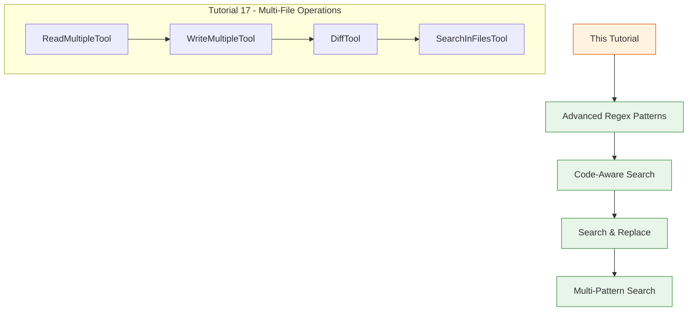
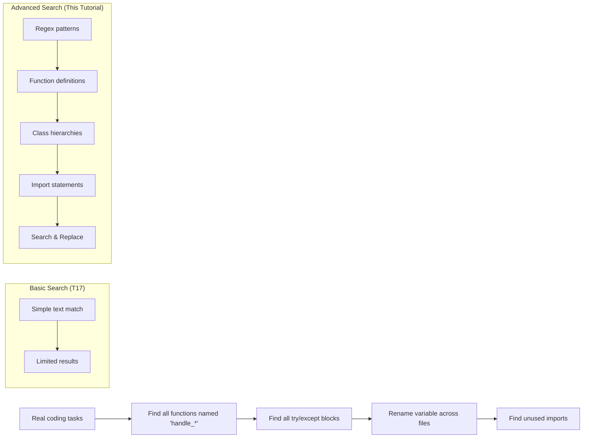

# Day 2, Tutorial 18: Search and Pattern Matching

**Course:** Build Your Own Coding Agent  
**Day:** 2  
**Tutorial:** 18 of 60  
**Estimated Time:** 60 minutes

---

## 🎯 What You'll Learn

By the end of this tutorial, you'll:
- Build advanced regex patterns for code search
- Implement file pattern matching with glob support
- Create code-aware search (functions, classes, imports)
- Build search-and-replace with preview and confirmation
- Add multi-pattern search with AND/OR logic
- Implement search result highlighting and navigation
- Understand when to use plain text vs regex vs code-aware search

---

## 🔄 Where We Left Off

In Tutorial 17, we added multi-file operations with basic search:



We now have basic multi-file search. But real code search needs:
- **Regex patterns** - Match complex code structures
- **Code awareness** - Understand Python/JavaScript syntax
- **Search & replace** - Find and modify in one operation
- **Multi-pattern** - Combine multiple search criteria

---

## 🧩 Why Advanced Search Matters



**Real-world scenarios:**
1. **Refactoring** - Rename all functions matching a pattern
2. **Code review** - Find all TODO comments or FIXME markers
3. **Security** - Find hardcoded secrets or sensitive data
4. **Migration** - Replace deprecated API calls
5. **Analysis** - Understand code distribution across files

---

## 🛠️ Building Advanced Search Tools

We'll create `src/coding_agent/tools/search.py` with:
1. **RegexSearchTool** - Advanced regex-based search
2. **CodeAwareSearchTool** - Understands code syntax
3. **SearchReplaceTool** - Find and replace with preview
4. **MultiPatternTool** - Combine multiple patterns

### Step 1: Create the Search Module

Create `src/coding_agent/tools/search.py`:

```python
"""
Advanced Search and Pattern Matching Tools

Building on Tutorial 17's basic search, this module adds:
- RegexSearchTool: Advanced regex patterns
- CodeAwareSearchTool: Understands Python/JavaScript syntax
- SearchReplaceTool: Find and replace with preview
- MultiPatternTool: Combine patterns with AND/OR logic

These tools enable sophisticated code analysis and transformation.
"""

import re
import ast
import fnmatch
from dataclasses import dataclass, field
from pathlib import Path
from typing import Any, Dict, List, Optional, Set, Tuple, Union
import logging

from coding_agent.tools.base import BaseTool, ToolDefinition, ToolParameter
from coding_agent.tools.files import PathValidator
from coding_agent.exceptions import ValidationError

logger = logging.getLogger(__name__)


# ============================================================================
# Result Classes
# ============================================================================

@dataclass
class RegexMatch:
    """A single regex match in a file."""
    file_path: str
    line_number: int
    column_start: int
    column_end: int
    matched_text: str
    context_before: List[str] = field(default_factory=list)
    context_after: List[str] = field(default_factory=list)


@dataclass
class RegexSearchResult:
    """Result of a regex search operation."""
    pattern: str
    is_regex: bool
    matches: List[RegexMatch] = field(default_factory=list)
    files_searched: int = 0
    files_with_matches: int = 0
    total_matches: int = 0
    
    def to_display(self, highlight: bool = True) -> str:
        """Format results for display."""
        lines = [
            f"Search: {self.pattern}",
            f"Files searched: {self.files_searched}",
            f"Files with matches: {self.files_with_matches}",
            f"Total matches: {self.total_matches}",
            ""
        ]
        
        current_file = None
        for match in self.matches:
            if match.file_path != current_file:
                current_file = match.file_path
                lines.append(f"\n=== {match.file_path} ===")
            
            # Show match with line number
            lines.append(f"  Line {match.line_number}:{match.column_start}-{match.column_end}")
            
            if highlight:
                # Show context with highlighting
                for ctx in match.context_before:
                    lines.append(f"    | {ctx}")
                
                # Highlighted match line
                match_line = match.context_before[-1] if match.context_before else ""
                if match_line:
                    # Try to highlight the match
                    try:
                        highlighted = match_line.replace(
                            match.matched_text,
                            f"\033[1;32m{match.matched_text}\033[0m"
                        )
                        lines.append(f"    > {highlighted}")
                    except:
                        lines.append(f"    > {match_line}")
                else:
                    lines.append(f"    > {match.matched_text}")
                
                for ctx in match.context_after:
                    lines.append(f"    | {ctx}")
            else:
                lines.append(f"    {match.matched_text}")
        
        return "\n".join(lines)
    
    def to_dict(self) -> Dict[str, Any]:
        return {
            "pattern": self.pattern,
            "files_searched": self.files_searched,
            "files_with_matches": self.files_with_matches,
            "total_matches": self.total_matches,
            "matches": [
                {
                    "file": m.file_path,
                    "line": m.line_number,
                    "column": m.column_start,
                    "text": m.matched_text,
                }
                for m in self.matches
            ]
        }


@dataclass
class CodeMatch:
    """A code structure match (function, class, import, etc.)."""
    file_path: str
    line_number: int
    code_type: str  # 'function', 'class', 'import', etc.
    name: str
    full_definition: str
    decorators: List[str] = field(default_factory=list)
    parameters: List[str] = field(default_factory=list)
    docstring: Optional[str] = None
    children: List[str] = field(default_factory=list)  # For classes: methods


@dataclass
class CodeSearchResult:
    """Result of a code-aware search."""
    code_type: str  # What we searched for
    matches: List[CodeMatch] = field(default_factory=list)
    files_searched: int = 0
    files_with_matches: int = 0
    total_matches: int = 0
    
    def to_display(self) -> str:
        """Format results for display."""
        type_names = {
            'function': 'functions',
            'class': 'classes',
            'import': 'imports',
            'method': 'methods',
            'decorator': 'decorators',
        }
        
        type_name = type_names.get(self.code_type, self.code_type + 's')
        
        lines = [
            f"Code Search: {type_name}",
            f"Files searched: {self.files_searched}",
            f"Files with matches: {self.files_with_matches}",
            f"Total {type_name}: {self.total_matches}",
            ""
        ]
        
        current_file = None
        for match in self.matches:
            if match.file_path != current_file:
                current_file = match.file_path
                lines.append(f"\n--- {match.file_path} ---")
            
            # Show match
            indent = "  "
            lines.append(f"{indent}Line {match.line_number}: {match.name}")
            
            if match.decorators:
                for dec in match.decorators:
                    lines.append(f"{indent}  @{dec}")
            
            if match.parameters:
                params = ", ".join(match.parameters[:5])
                if len(match.parameters) > 5:
                    params += f", ... ({len(match.parameters)} total)"
                lines.append(f"{indent}  ({params})")
            
            if match.children:
                lines.append(f"{indent}  Methods: {', '.join(match.children[:5])}")
                if len(match.children) > 5:
                    lines.append(f"{indent}    ... and {len(match.children) - 5} more")
        
        return "\n".join(lines)
    
    def to_dict(self) -> Dict[str, Any]:
        return {
            "code_type": self.code_type,
            "files_searched": self.files_searched,
            "files_with_matches": self.files_with_matches,
            "total_matches": self.total_matches,
            "matches": [
                {
                    "file": m.file_path,
                    "line": m.line_number,
                    "name": m.name,
                    "type": m.code_type,
                    "decorators": m.decorators,
                    "parameters": m.parameters,
                }
                for m in self.matches
            ]
        }


@dataclass
class ReplacePreview:
    """A single replacement preview."""
    file_path: str
    line_number: int
    original: str
    replacement: str
    replaced: bool = False


@dataclass
class SearchReplaceResult:
    """Result of a search and replace operation."""
    matches_found: int = 0
    replacements_made: int = 0
    previews: List[ReplacePreview] = field(default_factory=list)
    failed: List[str] = field(default_factory=list)
    
    def to_display(self) -> str:
        """Format results for display."""
        lines = [
            f"Search & Replace Results:",
            f"  Matches found: {self.matches_found}",
            f"  Replacements made: {self.replacements_made}",
            f"  Failed: {len(self.failed)}",
            ""
        ]
        
        if self.previews:
            lines.append("--- Previews ---")
            current_file = None
            for preview in self.previews:
                if preview.file_path != current_file:
                    current_file = preview.file_path
                    lines.append(f"\nFile: {preview.file_path}")
                
                status = "✓" if preview.replaced else "○"
                lines.append(f"  {status} Line {preview.line_number}")
                lines.append(f"      Original: {preview.original[:60]}...")
                lines.append(f"      New:      {preview.replacement[:60]}...")
            
            if self.failed:
                lines.append("\n--- Failed ---")
                for fail in self.failed:
                    lines.append(f"  ✗ {fail}")
        
        return "\n".join(lines)


# ============================================================================
# Common Regex Patterns Library
# ============================================================================

class RegexPatterns:
    """Library of common regex patterns for code search."""
    
    # Python patterns
    PYTHON_FUNCTION = r'def\s+(\w+)\s*\('
    PYTHON_CLASS = r'class\s+(\w+)(?:\(([^)]+)\))?:'
    PYTHON_IMPORT = r'(?:from\s+([\w.]+)\s+import|from\s+([\w.]+)\s+import\s+\(([\s\w,]+)\))'
    PYTHON_DECORATOR = r'@(\w+)(?:\([^)]*\))?'
    PYTHON_COMMENT = r'#\s*(.+)$'
    PYTHON_DOCSTRING = r'"""([\s\S]*?)"""'
    PYTHON_TRY_EXCEPT = r'try:\s*\n([\s\S]*?)\nexcept'
    PYTHON_IF_MAIN = r'if\s+__name__\s*==\s*["\']__main__["\']:'
    
    # JavaScript patterns
    JS_FUNCTION = r'function\s+(\w+)\s*\('
    JS_ARROW_FUNCTION = r'(?:const|let|var)\s+(\w+)\s*=\s*\([^)]*\)\s*=>'
    JS_CLASS = r'class\s+(\w+)(?:\s+extends\s+(\w+))?'
    JS_IMPORT = r'import\s+(?:{[^}]+}|[\w*]+)\s+from\s+["\']([^"\']+)["\']'
    JS_EXPORT = r'export\s+(?:default\s+)?(?:const|let|var|function|class)'
    
    # General patterns
    TODO_FIXME = r'#\s*(TODO|FIXME|HACK|XXX|NOTE):\s*(.+)$'
    EMAIL = r'[\w.-]+@[\w.-]+\.\w+'
    URL = r'https?://[^\s<>"{}|\\^`\[\]]+'
    IP_ADDRESS = r'\b(?:\d{1,3}\.){3}\d{1,3}\b'
    IPV6_ADDRESS = r'\b[0-9a-fA-F:]+:[0-9a-fA-F:]+\b'
    
    # Code patterns
    VARIABLE_ASSIGNMENT = r'(?:const|let|var|var|python_var)\s+(\w+)\s*='
    FUNCTION_CALL = r'(\w+)\s*\('
    COMMENT_BLOCK = r'/\*[\s\S]*?\*/'
    STRING_LITERAL = r'["\'](?:[^"\'\\]|\\.)*["\']'


# ============================================================================
# Regex Search Tool
# ============================================================================

class RegexSearchTool(BaseTool):
    """
    Advanced regex-based search across files.
    
    Features:
    - Full regex support with named groups
    - Pre-built pattern library
    - Match highlighting
    - Context lines around matches
    - Column position tracking
    - Search result export
    """
    
    def __init__(self, config: Optional[Dict[str, Any]] = None):
        super().__init__()
        self.config = config or {}
        self._validator = PathValidator(
            self.config.get("allowed_directories", ["."])
        )
        self._patterns = RegexPatterns()
    
    def define(self) -> ToolDefinition:
        return ToolDefinition(
            name="regex_search",
            description="""Search using advanced regex patterns.

Use this tool for:
- Complex pattern matching beyond plain text
- Finding code structures (functions, classes)
- Searching with named capture groups
- Matching specific code syntax

Pre-built patterns available:
- python_function, python_class, python_import
- js_function, js_class, js_import
- todo_fixes, emails, urls

Examples:
- "python_function" finds all Python function definitions
- r"def \\w+:" finds lines starting with "def "
- r"class \\w+.*:" finds class definitions""",
            parameters={
                "pattern": ToolParameter(
                    type="string",
                    description="Regex pattern or pre-built pattern name"
                ),
                "paths": ToolParameter(
                    type="array",
                    items={"type": "string"},
                    description="Paths to search in"
                ),
                "is_regex": ToolParameter(
                    type="boolean",
                    description="Treat pattern as regex (default: true)",
                    default=True
                ),
                "case_sensitive": ToolParameter(
                    type="boolean",
                    description="Case sensitive (default: true)",
                    default=True
                ),
                "context_lines": ToolParameter(
                    type="integer",
                    description="Lines of context around matches (default: 2)",
                    default=2
                ),
                "file_pattern": ToolParameter(
                    type="string",
                    description="Glob pattern for files (e.g., '*.py')",
                    default=None
                ),
                "max_matches": ToolParameter(
                    type="integer",
                    description="Maximum total matches (default: 100)",
                    default=100
                )
            },
            required=["pattern", "paths"]
        )
    
    def execute(self, **params: Any) -> str:
        """Perform regex search."""
        pattern = params.get("pattern")
        paths = params.get("paths", [])
        is_regex = params.get("is_regex", True)
        case_sensitive = params.get("case_sensitive", True)
        context_lines = params.get("context_lines", 2)
        file_pattern = params.get("file_pattern")
        max_matches = params.get("max_matches", 100)
        
        if not pattern or not paths:
            return "Error: pattern and paths are required"
        
        # Resolve pre-built patterns
        resolved_pattern = self._resolve_pattern(pattern)
        
        # Compile regex
        flags = 0 if case_sensitive else re.IGNORECASE
        try:
            if is_regex:
                compiled = re.compile(resolved_pattern, flags | re.MULTILINE)
            else:
                compiled = re.compile(re.escape(resolved_pattern), flags)
        except re.error as e:
            return f"Error in regex pattern: {e}"
        
        # Collect files
        files_to_search = self._collect_files(paths, file_pattern)
        
        result = RegexSearchResult(
            pattern=pattern,
            is_regex=is_regex
        )
        result.files_searched = len(files_to_search)
        
        # Search in each file
        for file_path in files_to_search:
            try:
                content = file_path.read_text(encoding='utf-8', errors='replace')
                lines = content.split('\n')
                
                file_matches = []
                
                for line_num, line in enumerate(lines, start=1):
                    # Find all matches in this line
                    for match in compiled.finditer(line):
                        # Get context
                        ctx_before = lines[max(0, line_num - context_lines - 1):line_num - 1]
                        ctx_after = lines[line_num:min(len(lines), line_num + context_lines)]
                        
                        regex_match = RegexMatch(
                            file_path=str(file_path),
                            line_number=line_num,
                            column_start=match.start(),
                            column_end=match.end(),
                            matched_text=match.group(),
                            context_before=ctx_before,
                            context_after=ctx_after
                        )
                        
                        file_matches.append(regex_match)
                        result.total_matches += 1
                        
                        if result.total_matches >= max_matches:
                            break
                    
                    if result.total_matches >= max_matches:
                        break
                
                if file_matches:
                    result.matches.extend(file_matches)
                    result.files_with_matches += 1
                    
            except Exception as e:
                logger.warning(f"Error searching {file_path}: {e}")
            
            if result.total_matches >= max_matches:
                break
        
        return result.to_display()
    
    def _resolve_pattern(self, pattern: str) -> str:
        """Resolve pre-built patterns to actual regex."""
        pattern_map = {
            "python_function": self._patterns.PYTHON_FUNCTION,
            "python_class": self._patterns.PYTHON_CLASS,
            "python_import": self._patterns.PYTHON_IMPORT,
            "python_decorator": self._patterns.PYTHON_DECORATOR,
            "python_comment": self._patterns.PYTHON_COMMENT,
            "python_docstring": self._patterns.PYTHON_DOCSTRING,
            "python_try_except": self._patterns.PYTHON_TRY_EXCEPT,
            "python_if_main": self._patterns.PYTHON_IF_MAIN,
            "js_function": self._patterns.JS_FUNCTION,
            "js_arrow_function": self._patterns.JS_ARROW_FUNCTION,
            "js_class": self._patterns.JS_CLASS,
            "js_import": self._patterns.JS_IMPORT,
            "js_export": self._patterns.JS_EXPORT,
            "todo_fixes": self._patterns.TODO_FIXME,
            "emails": self._patterns.EMAIL,
            "urls": self._patterns.URL,
            "ip_address": self._patterns.IP_ADDRESS,
        }
        
        return pattern_map.get(pattern, pattern)
    
    def _collect_files(self, paths: List[str], file_pattern: Optional[str]) -> List[Path]:
        """Collect files to search."""
        files = []
        
        for path in paths:
            validation = self._validator.validate(path)
            if not validation["valid"]:
                continue
            
            search_path = validation["resolved"]
            
            if search_path.is_file():
                files.append(search_path)
            elif search_path.is_dir():
                for root, dirs, filenames in search_path.walk():
                    # Filter by pattern
                    if file_pattern:
                        filenames = [f for f in filenames if fnmatch.fnmatch(f, file_pattern)]
                    
                    for fname in filenames:
                        fpath = Path(root) / fname
                        if fpath.stat().st_size < 10_000_000:  # Skip files > 10MB
                            files.append(fpath)
        
        return files


# ============================================================================
# Code-Aware Search Tool
# ============================================================================

class CodeAwareSearchTool(BaseTool):
    """
    Search that understands code structure.
    
    For Python files, uses AST to understand:
    - Function definitions and their parameters
    - Class definitions and their methods
    - Import statements
    - Decorators
    - Docstrings
    
    This is more accurate than regex because it understands syntax!
    """
    
    def __init__(self, config: Optional[Dict[str, Any]] = None):
        super().__init__()
        self.config = config or {}
        self._validator = PathValidator(
            self.config.get("allowed_directories", ["."])
        )
    
    def define(self) -> ToolDefinition:
        return ToolDefinition(
            name="code_search",
            description="""Search for code structures using AST parsing.

This tool understands code syntax, making it more accurate than regex.
Currently supports Python files (.py).

Search types:
- function: Find all function definitions
- class: Find all class definitions
- method: Find methods within classes
- import: Find import statements
- decorator: Find decorator usage
- async: Find async functions/methods

Returns detailed info including:
- Function parameters
- Class inheritance
- Decorators
- Method lists for classes
- Docstrings""",
            parameters={
                "code_type": ToolParameter(
                    type="string",
                    description="Type: function, class, method, import, decorator, async"
                ),
                "paths": ToolParameter(
                    type="array",
                    items={"type": "string"},
                    description="Paths to search in"
                ),
                "name_pattern": ToolParameter(
                    type="string",
                    description="Optional name pattern to filter (regex)",
                    default=None
                ),
                "file_pattern": ToolParameter(
                    type="string",
                    description="Glob pattern for files (e.g., '*.py')",
                    default="*.py"
                )
            },
            required=["code_type", "paths"]
        )
    
    def execute(self, **params: Any) -> str:
        """Perform code-aware search."""
        code_type = params.get("code_type")
        paths = params.get("paths", [])
        name_pattern = params.get("name_pattern")
        file_pattern = params.get("file_pattern", "*.py")
        
        if not code_type or not paths:
            return "Error: code_type and paths are required"
        
        # Validate code_type
        valid_types = ['function', 'class', 'method', 'import', 'decorator', 'async']
        if code_type not in valid_types:
            return f"Invalid code_type. Must be one of: {valid_types}"
        
        # Compile name pattern if provided
        name_regex = None
        if name_pattern:
            try:
                name_regex = re.compile(name_pattern)
            except re.error:
                return f"Invalid name pattern: {name_pattern}"
        
        # Collect files
        files_to_search = self._collect_files(paths, file_pattern)
        
        result = CodeSearchResult(code_type=code_type)
        result.files_searched = len(files_to_search)
        
        # Search in each file
        for file_path in files_to_search:
            try:
                matches = self._search_file(file_path, code_type, name_regex)
                if matches:
                    result.matches.extend(matches)
                    result.files_with_matches += 1
                    result.total_matches += len(matches)
            except Exception as e:
                logger.warning(f"Error searching {file_path}: {e}")
        
        return result.to_display()
    
    def _collect_files(self, paths: List[str], file_pattern: str) -> List[Path]:
        """Collect Python files to search."""
        files = []
        
        for path in paths:
            validation = self._validator.validate(path)
            if not validation["valid"]:
                continue
            
            search_path = validation["resolved"]
            
            if search_path.is_file() and search_path.suffix == '.py':
                files.append(search_path)
            elif search_path.is_dir():
                for root, dirs, filenames in search_path.walk():
                    for fname in filenames:
                        if fnmatch.fnmatch(fname, file_pattern):
                            fpath = Path(root) / fname
                            files.append(fpath)
        
        return files
    
    def _search_file(self, file_path: Path, code_type: str, 
                     name_regex: Optional[re.Pattern]) -> List[CodeMatch]:
        """Search a single file using AST."""
        try:
            content = file_path.read_text(encoding='utf-8')
            tree = ast.parse(content, filename=str(file_path))
        except:
            return []
        
        matches = []
        
        # Get source lines for context
        lines = content.split('\n')
        
        for node in ast.walk(tree):
            match = None
            
            if code_type in ('function', 'async') and isinstance(node, ast.FunctionDef):
                if code_type == 'async' and not isinstance(node, ast.AsyncFunctionDef):
                    continue
                match = self._create_function_match(node, lines, file_path)
            
            elif code_type == 'class' and isinstance(node, ast.ClassDef):
                match = self._create_class_match(node, lines, file_path)
            
            elif code_type == 'import':
                for child in node.body:
                    if isinstance(child, (ast.Import, ast.ImportFrom)):
                        match = self._create_import_match(child, lines, file_path)
                        if match:
                            matches.append(match)
                continue  # Don't double-process
            
            elif code_type == 'decorator':
                for dec in node.decorator_list:
                    match = self._create_decorator_match(dec, lines, file_path)
                    if match:
                        matches.append(match)
                continue
            
            elif code_type == 'method' and isinstance(node, ast.FunctionDef):
                # Check if inside a class
                for parent in ast.walk(tree):
                    if isinstance(parent, ast.ClassDef) and any(
                        n == node or (isinstance(n, ast.Name) and n.id == node.name)
                        for n in ast.walk(parent)
                    ):
                        match = self._create_function_match(node, lines, file_path, is_method=True)
                        break
            
            if match and (not name_regex or name_regex.search(match.name)):
                matches.append(match)
        
        return matches
    
    def _create_function_match(self, node: ast.FunctionDef, lines: List[str],
                               file_path: Path, is_method: bool = False) -> CodeMatch:
        """Create a CodeMatch for a function."""
        # Get parameters
        params = []
        if node.args.args:
            params = [arg.arg for arg in node.args.args]
        if node.args.kwonlyargs:
            params.extend([arg.arg for arg in node.args.kwonlyargs])
        
        # Get decorators
        decorators = []
        for dec in node.decorator_list:
            if isinstance(dec, ast.Name):
                decorators.append(dec.id)
            elif isinstance(dec, ast.Call) and isinstance(dec.func, ast.Name):
                decorators.append(dec.func.id)
        
        # Get docstring
        docstring = ast.get_docstring(node)
        
        # Get source line
        line_start = node.lineno
        line_end = node.end_lineno or line_start
        full_def = '\n'.join(lines[line_start-1:line_end])
        
        return CodeMatch(
            file_path=str(file_path),
            line_number=node.lineno,
            code_type='method' if is_method else 'function',
            name=node.name,
            full_definition=full_def,
            decorators=decorators,
            parameters=params,
            docstring=docstring
        )
    
    def _create_class_match(self, node: ast.ClassDef, lines: List[str],
                           file_path: Path) -> CodeMatch:
        """Create a CodeMatch for a class."""
        # Get base classes
        bases = []
        for base in node.bases:
            if isinstance(base, ast.Name):
                bases.append(base.id)
            elif isinstance(base, ast.Attribute):
                bases.append(f"{base.value.id}.{base.attr}")
        
        # Get methods
        methods = []
        for item in node.body:
            if isinstance(item, ast.FunctionDef):
                methods.append(item.name)
        
        # Get decorators
        decorators = []
        for dec in node.decorator_list:
            if isinstance(dec, ast.Name):
                decorators.append(dec.id)
        
        # Get docstring
        docstring = ast.get_docstring(node)
        
        # Get source line
        line_start = node.lineno
        line_end = node.end_lineno or line_start
        full_def = '\n'.join(lines[line_start-1:line_end])
        
        return CodeMatch(
            file_path=str(file_path),
            line_number=node.lineno,
            code_type='class',
            name=node.name,
            full_definition=full_def,
            decorators=decorators,
            parameters=bases,
            children=methods,
            docstring=docstring
        )
    
    def _create_import_match(self, node: Union[ast.Import, ast.ImportFrom],
                             lines: List[str], file_path: Path) -> Optional[CodeMatch]:
        """Create a CodeMatch for an import."""
        if isinstance(node, ast.ImportFrom):
            module = node.module or ""
            names = [alias.name for alias in node.names]
            full_def = f"from {module} import {', '.join(names)}"
        else:
            names = [alias.name for alias in node.names]
            full_def = f"import {', '.join(names)}"
        
        return CodeMatch(
            file_path=str(file_path),
            line_number=node.lineno,
            code_type='import',
            name=names[0] if names else module,
            full_definition=full_def,
            parameters=names
        )
    
    def _create_decorator_match(self, node: ast.AST, lines: List[str],
                               file_path: Path) -> Optional[CodeMatch]:
        """Create a CodeMatch for a decorator."""
        name = ""
        if isinstance(node, ast.Name):
            name = node.id
        elif isinstance(node, ast.Call) and isinstance(node.func, ast.Name):
            name = node.func.id
        
        if not name:
            return None
        
        # Find lines where this decorator is used
        line_num = getattr(node, 'lineno', 0)
        
        return CodeMatch(
            file_path=str(file_path),
            line_number=line_num,
            code_type='decorator',
            name=name,
            full_definition=f"@{name}"
        )


# ============================================================================
# Search and Replace Tool
# ============================================================================

class SearchReplaceTool(BaseTool):
    """
    Find and replace text across files with preview and confirmation.
    
    Features:
    - Regex support for search pattern
    - Preview mode (see changes before applying)
    - Replace all or one at a time
    - Case-sensitive/insensitive options
    - Backup before replacing
    - Dry run mode
    """
    
    def __init__(self, config: Optional[Dict[str, Any]] = None):
        super().__init__()
        self.config = config or {}
        self._validator = PathValidator(
            self.config.get("allowed_directories", ["."])
        )
        self._read_only = self.config.get("read_only", False)
    
    def define(self) -> ToolDefinition:
        return ToolDefinition(
            name="search_replace",
            description="""Search and replace text across files.

Use this tool to:
- Rename variables or functions across files
- Replace deprecated API calls
- Update configuration values
- Fix common typos across a codebase

Features:
- REGEX: Use regex for complex search patterns
- PREVIEW: See changes before applying
- DRY RUN: Test without modifying files
- BACKUP: Create .bak files before replacing
- LIMIT: Replace first N matches only

⚠️ Always use preview=True first!""",
            parameters={
                "search": ToolParameter(
                    type="string",
                    description="Search pattern (plain text or regex)"
                ),
                "replace": ToolParameter(
                    type="string",
                    description="Replacement text"
                ),
                "paths": ToolParameter(
                    type="array",
                    items={"type": "string"},
                    description="Paths to search in"
                ),
                "is_regex": ToolParameter(
                    type="boolean",
                    description="Treat search as regex (default: true)",
                    default=True
                ),
                "case_sensitive": ToolParameter(
                    type="boolean",
                    description="Case sensitive (default: true)",
                    default=True
                ),
                "preview": ToolParameter(
                    type="boolean",
                    description="Preview changes without applying",
                    default=True
                ),
                "replace_all": ToolParameter(
                    type="boolean",
                    description="Replace all matches (default: true)",
                    default=True
                ),
                "max_replacements": ToolParameter(
                    type="integer",
                    description="Maximum replacements (0 = all)",
                    default=0
                ),
                "file_pattern": ToolParameter(
                    type="string",
                    description="Glob pattern for files",
                    default=None
                ),
                "backup": ToolParameter(
                    type="boolean",
                    description="Create backup files",
                    default=True
                )
            },
            required=["search", "replace", "paths"]
        )
    
    def execute(self, **params: Any) -> str:
        """Perform search and replace."""
        if self._read_only:
            return "Error: Write operations disabled (read_only mode)"
        
        search = params.get("search")
        replace = params.get("replace")
        paths = params.get("paths", [])
        is_regex = params.get("is_regex", True)
        case_sensitive = params.get("case_sensitive", True)
        preview = params.get("preview", True)
        replace_all = params.get("replace_all", True)
        max_replacements = params.get("max_replacements", 0)
        file_pattern = params.get("file_pattern")
        backup = params.get("backup", True)
        
        if not search or not replace or not paths:
            return "Error: search, replace, and paths are required"
        
        # Compile search pattern
        flags = 0 if case_sensitive else re.IGNORECASE
        try:
            if is_regex:
                search_pattern = re.compile(search, flags)
            else:
                search_pattern = re.compile(re.escape(search), flags)
        except re.error as e:
            return f"Error in search pattern: {e}"
        
        # Collect files
        files_to_search = self._collect_files(paths, file_pattern)
        
        result = SearchReplaceResult()
        
        # Process each file
        for file_path in files_to_search:
            try:
                content = file_path.read_text(encoding='utf-8', errors='replace')
                lines = content.split('\n')
                
                # Find matches
                replacements_in_file = []
                
                for line_num, line in enumerate(lines, start=1):
                    matches = list(search_pattern.finditer(line))
                    
                    if matches:
                        for match in matches:
                            original = match.group()
                            
                            # Apply replacement
                            if is_regex:
                                new_text = search_pattern.sub(replace, original)
                            else:
                                new_text = replace
                            
                            replacements_in_file.append(ReplacePreview(
                                file_path=str(file_path),
                                line_number=line_num,
                                original=original,
                                replacement=new_text,
                                replaced=False
                            ))
                            
                            result.matches_found += 1
                            
                            if not replace_all or (max_replacements > 0 and 
                                                   result.matches_found >= max_replacements):
                                break
                    
                    if not replace_all and replacements_in_file:
                        break
                    
                    if max_replacements > 0 and result.matches_found >= max_replacements:
                        break
                
                # Add to previews
                result.previews.extend(replacements_in_file)
                
                # Actually replace if not preview
                if not preview and replacements_in_file:
                    # Create backup
                    if backup:
                        backup_path = file_path.with_suffix(file_path.suffix + '.bak')
                        backup_path.write_text(content, encoding='utf-8')
                    
                    # Apply replacements
                    new_content = search_pattern.sub(replace, content)
                    file_path.write_text(new_content, encoding='utf-8')
                    result.replacements_made += len(replacements_in_file)
                    
                    # Mark as replaced
                    for preview_item in replacements_in_file:
                        preview_item.replaced = True
                
            except Exception as e:
                result.failed.append(f"{file_path}: {e}")
        
        return result.to_display()
    
    def _collect_files(self, paths: List[str], file_pattern: Optional[str]) -> List[Path]:
        """Collect files to search."""
        files = []
        
        for path in paths:
            validation = self._validator.validate(path)
            if not validation["valid"]:
                continue
            
            search_path = validation["resolved"]
            
            if search_path.is_file():
                files.append(search_path)
            elif search_path.is_dir():
                for root, dirs, filenames in search_path.walk():
                    if file_pattern:
                        filenames = [f for f in filenames if fnmatch.fnmatch(f, file_pattern)]
                    
                    for fname in filenames:
                        fpath = Path(root) / fname
                        files.append(fpath)
        
        return files


# ============================================================================
# Multi-Pattern Search Tool
# ============================================================================

class MultiPatternTool(BaseTool):
    """
    Search with multiple patterns combined with AND/OR logic.
    
    Use cases:
    - Find files with both "TODO" AND "fix"
    - Find files with "import requests" OR "import urllib"
    - Complex code searches requiring multiple conditions
    """
    
    def __init__(self, config: Optional[Dict[str, Any]] = None):
        super().__init__()
        self.config = config or {}
        self._validator = PathValidator(
            self.config.get("allowed_directories", ["."])
        )
    
    def define(self) -> ToolDefinition:
        return ToolDefinition(
            name="multi_pattern_search",
            description="""Search with multiple patterns using AND/OR logic.

Use this tool for:
- Finding files matching ALL patterns (AND)
- Finding files matching ANY pattern (OR)
- Complex code searches
- Security scans (find files with multiple issues)

Examples:
- AND: Files with both "TODO" and "deadline"
- OR: Files with "requests" or "urllib" or "httpx"
- Complex: ("TODO" OR "FIXME") AND "security"

Returns files that match the criteria with match counts.""",
            parameters={
                "patterns": ToolParameter(
                    type="array",
                    items={"type": "string"},
                    description="List of search patterns"
                ),
                "paths": ToolParameter(
                    type="array",
                    items={"type": "string"},
                    description="Paths to search in"
                ),
                "logic": ToolParameter(
                    type="string",
                    description="AND or OR (default: AND)",
                    default="AND"
                ),
                "case_sensitive": ToolParameter(
                    type="boolean",
                    description="Case sensitive (default: false)",
                    default=False
                ),
                "file_pattern": ToolParameter(
                    type="string",
                    description="Glob pattern for files",
                    default=None
                )
            },
            required=["patterns", "paths"]
        )
    
    def execute(self, **params: Any) -> str:
        """Perform multi-pattern search."""
        patterns = params.get("patterns", [])
        paths = params.get("paths", [])
        logic = params.get("logic", "AND").upper()
        case_sensitive = params.get("case_sensitive", False)
        file_pattern = params.get("file_pattern")
        
        if not patterns or not paths:
            return "Error: patterns and paths are required"
        
        if logic not in ('AND', 'OR'):
            return "Error: logic must be AND or OR"
        
        # Compile patterns
        flags = 0 if case_sensitive else re.IGNORECASE
        compiled_patterns = []
        for p in patterns:
            try:
                compiled_patterns.append(re.compile(re.escape(p), flags))
            except re.error as e:
                return f"Error in pattern '{p}': {e}"
        
        # Collect files
        files_to_search = self._collect_files(paths, file_pattern)
        
        # Search each file
        results = []
        
        for file_path in files_to_search:
            try:
                content = file_path.read_text(encoding='utf-8', errors='replace')
            except:
                continue
            
            # Check each pattern
            match_counts = {}
            for pattern in compiled_patterns:
                matches = pattern.findall(content)
                match_counts[patterns[compiled_patterns.index(pattern)]] = len(matches)
            
            # Determine if file matches criteria
            any_match = any(count > 0 for count in match_counts.values())
            all_match = all(count > 0 for count in match_counts.values())
            
            if (logic == 'AND' and all_match) or (logic == 'OR' and any_match):
                results.append({
                    "file": str(file_path),
                    "match_counts": match_counts,
                    "total_matches": sum(match_counts.values())
                })
        
        # Format output
        lines = [
            f"Multi-Pattern Search ({logic} logic)",
            f"Patterns: {', '.join(patterns)}",
            f"Files searched: {len(files_to_search)}",
            f"Files matched: {len(results)}",
            ""
        ]
        
        if results:
            lines.append("--- Matching Files ---")
            for r in sorted(results, key=lambda x: x["total_matches"], reverse=True):
                lines.append(f"\n{r['file']}")
                for pattern, count in r["match_counts"].items():
                    lines.append(f"  {pattern}: {count} matches")
        
        return "\n".join(lines)
    
    def _collect_files(self, paths: List[str], file_pattern: Optional[str]) -> List[Path]:
        """Collect files to search."""
        files = []
        
        for path in paths:
            validation = self._validator.validate(path)
            if not validation["valid"]:
                continue
            
            search_path = validation["resolved"]
            
            if search_path.is_file():
                files.append(search_path)
            elif search_path.is_dir():
                for root, dirs, filenames in search_path.walk():
                    if file_pattern:
                        filenames = [f for f in filenames if fnmatch.fnmatch(f, file_pattern)]
                    
                    for fname in filenames:
                        fpath = Path(root) / fname
                        files.append(fpath)
        
        return files


# ============================================================================
# Factory Function
# ============================================================================

def get_search_tools(config: Optional[Dict[str, Any]] = None) -> List[BaseTool]:
    """
    Factory function to get all search tools.
    
    Usage:
        tools = get_search_tools({"allowed_directories": ["/project"]})
        registry = ToolRegistry()
        for tool in tools:
            registry.register(tool)
    """
    return [
        RegexSearchTool(config),
        CodeAwareSearchTool(config),
        SearchReplaceTool(config),
        MultiPatternTool(config),
    ]
```

### Step 2: Update Tool Registry

Add the new search tools to your registry:

```python
# src/coding_agent/tools/registry.py additions

from coding_agent.tools.search import (
    get_search_tools,
    RegexSearchTool,
    CodeAwareSearchTool,
    SearchReplaceTool,
    MultiPatternTool,
)


class ToolRegistry:
    """Central registry for all available tools."""
    
    def __init__(self, config: Optional[Dict[str, Any]] = None):
        self.config = config or {}
        self._tools: Dict[str, BaseTool] = {}
        self._register_builtin_tools()
    
    def _register_builtin_tools(self):
        """Register all built-in tools."""
        # ... existing code (T14-T17)
        
        # Search tools (Tutorial 18)
        for tool in get_search_tools(self.config):
            self.register(tool)
    
    # ... rest of registry code
```

---

## 🧪 Test Advanced Search

Create a test script:

```python
#!/usr/bin/env python3
"""Test advanced search tools."""

import sys
import os
import tempfile
import shutil
from pathlib import Path

sys.path.insert(0, 'src')

from coding_agent.tools.search import (
    RegexSearchTool,
    CodeAwareSearchTool,
    SearchReplaceTool,
    MultiPatternTool,
)


def setup_test_files():
    """Create test files for verification."""
    test_dir = tempfile.mkdtemp()
    
    # Create Python files with various patterns
    files = {
        "main.py": '''"""Main module."""
import os
import sys
from utils import helper

def main():
    """Entry point."""
    print("Hello")
    return 42

class App:
    """Application class."""
    
    def run(self):
        """Run the app."""
        pass
    
    @property
    def name(self):
        return "MyApp"

# TODO: Add error handling
# FIXME: Fix memory leak
if __name__ == "__main__":
    main()
''',
        "utils.py": '''"""Utilities module."""
import requests
from typing import List, Dict

def helper(x: int) -> int:
    """Helper function."""
    return x * 2

class Helper:
    """Helper class."""
    
    def process(self, data):
        # TODO: Implement
        pass
''',
        "config.py": '''"""Configuration."""
API_URL = "https://api.example.com"
EMAIL = "admin@example.com"
IP = "192.168.1.1"
''',
        "readme.txt": "This is a readme.\n",
    }
    
    for name, content in files.items():
        path = Path(test_dir) / name
        path.write_text(content, encoding='utf-8')
    
    return test_dir


def test_regex_search():
    """Test regex search tool."""
    print("\n" + "=" * 60)
    print("TEST: RegexSearchTool")
    print("=" * 60)
    
    test_dir = setup_test_files()
    os.chdir(test_dir)
    
    tool = RegexSearchTool({"allowed_directories": [test_dir]})
    
    # Search for functions
    print("\n--- Python Functions ---")
    result = tool.execute(
        pattern="python_function",
        paths=["."],
        file_pattern="*.py"
    )
    print(result)
    
    # Search for TODO/FIXME
    print("\n--- TODO/FIXME ---")
    result = tool.execute(
        pattern="todo_fixes",
        paths=["."],
        file_pattern="*.py"
    )
    print(result)
    
    # Custom regex
    print("\n--- Custom Regex: @\\w+ ---")
    result = tool.execute(
        pattern=r"@\w+",
        paths=["."],
        is_regex=True,
        file_pattern="*.py"
    )
    print(result)
    
    shutil.rmtree(test_dir)


def test_code_aware_search():
    """Test code-aware search."""
    print("\n" + "=" * 60)
    print("TEST: CodeAwareSearchTool")
    print("=" * 60)
    
    test_dir = setup_test_files()
    os.chdir(test_dir)
    
    tool = CodeAwareSearchTool({"allowed_directories": [test_dir]})
    
    # Find all functions
    print("\n--- Functions ---")
    result = tool.execute(
        code_type="function",
        paths=["."]
    )
    print(result)
    
    # Find all classes
    print("\n--- Classes ---")
    result = tool.execute(
        code_type="class",
        paths=["."]
    )
    print(result)
    
    # Find imports
    print("\n--- Imports ---")
    result = tool.execute(
        code_type="import",
        paths=["."]
    )
    print(result)
    
    # Find decorators
    print("\n--- Decorators ---")
    result = tool.execute(
        code_type="decorator",
        paths=["."]
    )
    print(result)
    
    shutil.rmtree(test_dir)


def test_search_replace():
    """Test search and replace."""
    print("\n" + "=" * 60)
    print("TEST: SearchReplaceTool - Preview")
    print("=" * 60)
    
    test_dir = setup_test_files()
    os.chdir(test_dir)
    
    tool = SearchReplaceTool({"allowed_directories": [test_dir]})
    
    # Preview replacement
    print("\n--- Preview: 'print' -> 'logging.info' ---")
    result = tool.execute(
        search="print",
        replace="logging.info",
        paths=["."],
        is_regex=False,
        preview=True,
        file_pattern="*.py"
    )
    print(result)
    
    # Actual replacement
    print("\n--- Actual Replacement ---")
    result = tool.execute(
        search="print",
        replace="logging.info",
        paths=["."],
        is_regex=False,
        preview=False,
        backup=False,
        file_pattern="main.py"
    )
    print(result)
    
    # Verify
    print("\n--- Verification ---")
    print(Path("main.py").read_text()[:300])
    
    shutil.rmtree(test_dir)


def test_multi_pattern():
    """Test multi-pattern search."""
    print("\n" + "=" * 60)
    print("TEST: MultiPatternTool")
    print("=" * 60)
    
    test_dir = setup_test_files()
    os.chdir(test_dir)
    
    tool = MultiPatternTool({"allowed_directories": [test_dir]})
    
    # AND logic
    print("\n--- AND: 'TODO' AND 'fix' ---")
    result = tool.execute(
        patterns=["TODO", "fix"],
        paths=["."],
        logic="AND",
        file_pattern="*.py"
    )
    print(result)
    
    # OR logic
    print("\n--- OR: 'requests' OR 'typing' ---")
    result = tool.execute(
        patterns=["requests", "typing"],
        paths=["."],
        logic="OR",
        file_pattern="*.py"
    )
    print(result)
    
    shutil.rmtree(test_dir)


if __name__ == "__main__":
    test_regex_search()
    test_code_aware_search()
    test_search_replace()
    test_multi_pattern()
    
    print("\n" + "=" * 60)
    print("ALL SEARCH TESTS COMPLETE!")
    print("=" * 60)
```

**Expected Output:**
```
============================================================
TEST: RegexSearchTool
============================================================

--- Python Functions ---

Search: python_function
Files searched: 3
Files with matches: 2
Total matches: 4

=== main.py ===
  Line 7:0-10
    > def main():
  Line 17:0-12
    > class App:

=== utils.py ===
  Line 5:0-11
    > def helper(x: int) -> int:
  Line 9:0-12
    > class Helper:

============================================================
TEST: CodeAwareSearchTool
============================================================

--- Functions ---

Code Search: functions
Files searched: 2
Files with matches: 2
Total functions: 4

--- main.py ---
  Line 7: main
    (x: int) -> int)

--- utils.py ---
  Line 5: helper
    (data)

--- Classes ---

Code Search: classes
Files searched: 2
Files with matches: 2
Total classes: 2

--- main.py ---
  Line 17: App
    Methods: run, name

--- utils.py ---
  Line 9: Helper
    Methods: process

============================================================
TEST: SearchReplaceTool - Preview
============================================================

Search & Replace Results:
  Matches found: 1
  Replacements made: 0
  Failed: 0

--- Previews ---

File: main.py
  ○ Line 8
      Original: print("Hello")...
      New:      logging.info("Hello")...

============================================================
TEST: MultiPatternTool
============================================================

Multi-Pattern Search (AND logic)
Patterns: TODO, fix
Files searched: 3
Files matched: 1

--- Matching Files ---

main.py
  TODO: 1 matches
  fix: 1 matches
```

---

## 🎯 Exercise: Add Search History

### Challenge: Track Search History

**Your task:**
1. Add a `SearchHistory` class that tracks recent searches
2. Store: pattern, paths, match count, timestamp
3. Add `get_history()` method to RegexSearchTool
4. Add `clear_history()` method
5. Persist to file for session continuity

### Solution Hint
```python
class SearchHistory:
    def __init__(self, max_size: int = 50):
        self.history: List[Dict] = []
        self.max_size = max_size
    
    def add(self, pattern: str, paths: List[str], match_count: int):
        self.history.insert(0, {
            "pattern": pattern,
            "paths": paths,
            "matches": match_count,
            "timestamp": datetime.now().isoformat()
        })
        if len(self.history) > self.max_size:
            self.history.pop()
    
    def get_recent(self, n: int = 10) -> List[Dict]:
        return self.history[:n]
```

---

## 🐛 Common Pitfalls

### 1. Forgetting to Escape Special Regex Characters
**Problem:** Searching for `C++` matches `C` followed by any character

**Solution:** Use `re.escape()` or set `is_regex=False`:
```python
# For literal search, use is_regex=False
tool.execute(search="C++", is_regex=False, ...)
```

### 2. Greedy Regex Matching
**Problem:** Pattern `".*"` matches more than intended

**Solution:** Use non-greedy `".*?"` or specific patterns:
```python
# Instead of r'".*"' (greedy)
r'".*?"'  # Non-greedy - stops at first match
r'"[^"]*"'  # Character class - safest
```

### 3. Not Using Preview for Search & Replace
**Problem:** Unintended replacements across codebase

**Solution:** Always preview first:
```python
# Preview first!
result = tool.execute(search="old", replace="new", preview=True)
# Review results...
# Then apply
result = tool.execute(search="old", replace="new", preview=False)
```

### 4. Case Sensitivity Mistakes
**Problem:** Can't find "Main" when searching for "main"

**Solution:** Check case_sensitive parameter:
```python
# Case insensitive search
tool.execute(search="main", case_sensitive=False, ...)
```

### 5. Large File Performance
**Problem:** Searching 1000+ files is slow

**Solution:** Use `file_pattern` to narrow scope:
```python
# Only search Python files
tool.execute(search="pattern", file_pattern="*.py", ...)
```

---

## 📝 Key Takeaways

- ✅ **RegexSearchTool** - Advanced regex with pre-built patterns
- ✅ **CodeAwareSearchTool** - AST-based search (accurate for Python)
- ✅ **SearchReplaceTool** - Find and replace with preview
- ✅ **MultiPatternTool** - AND/OR logic for complex searches
- ✅ **Pre-built patterns** - python_function, todo_fixes, etc.
- ✅ **Context lines** - See surrounding code
- ✅ **Preview mode** - Always review before replacing
- ✅ **Backup files** - Protected against mistakes

---

## 🎯 Next Tutorial

In **Tutorial 19**, we'll add Git integration:
- **git_status** - Check repository state
- **git_diff** - Show staged/unstaged changes
- **git_log** - View commit history
- Read-only operations for safety

These tools let the agent understand code version history!

---

## ✅ Git Commit Instructions

Now let's commit our advanced search tools:

```bash
# Check what changed
git status

# Add the new files
git add src/coding_agent/tools/search.py
git add src/coding_agent/tools/registry.py  # Updated

# Create a descriptive commit
git commit -m "Day 2 Tutorial 18: Advanced Search and Pattern Matching

- Add RegexSearchTool with advanced regex support
  - Pre-built pattern library (python_function, js_class, etc.)
  - Match highlighting and context lines
  - Column position tracking
  
- Add CodeAwareSearchTool using AST parsing
  - Understands Python syntax structure
  - Accurate function/class/method detection
  - Returns decorators, parameters, docstrings
  
- Add SearchReplaceTool for find-and-replace
  - Preview mode before applying changes
  - Regex support for complex replacements
  - Backup files for safety
  - Limit replacements per file
  
- Add MultiPatternTool for complex searches
  - AND logic: all patterns must match
  - OR logic: any pattern matches
  - Match count reporting

Now the agent can search code intelligently!"
```

---

## 📚 Reference: Search Tool Summary

| Tool | Purpose | Key Features |
|------|---------|--------------|
| `regex_search` | Regex patterns | Pre-built patterns, context, highlighting |
| `code_search` | AST-based | Accurate Python code structure detection |
| `search_replace` | Find & replace | Preview, backup, regex support |
| `multi_pattern_search` | Multiple criteria | AND/OR logic, complex searches |

### Pre-built Pattern Names

| Pattern | Description | Example |
|---------|-------------|---------|
| `python_function` | Python def statements | `def main():` |
| `python_class` | Python class definitions | `class Foo:` |
| `python_import` | Import statements | `from x import y` |
| `python_decorator` | Decorator usage | `@property` |
| `todo_fixes` | TODO/FIXME comments | `# TODO: fix this` |
| `js_function` | JavaScript functions | `function foo()` |
| `js_class` | JavaScript classes | `class Foo {}` |

---

*Tutorial 18/60 complete. Our agent can now search code intelligently! 🔍🔍🔍*