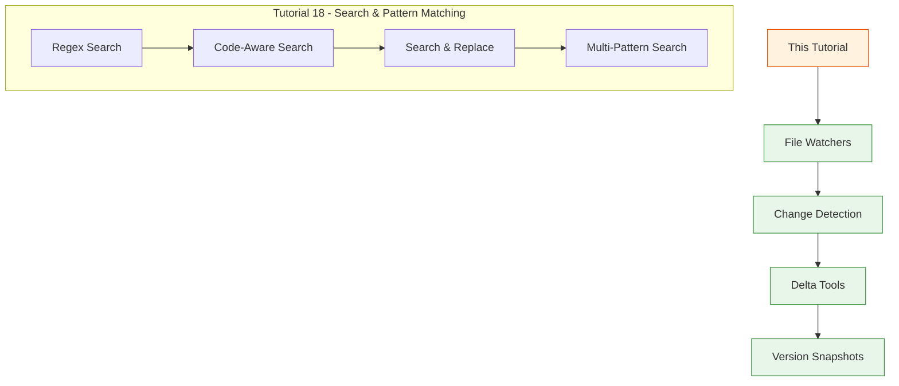
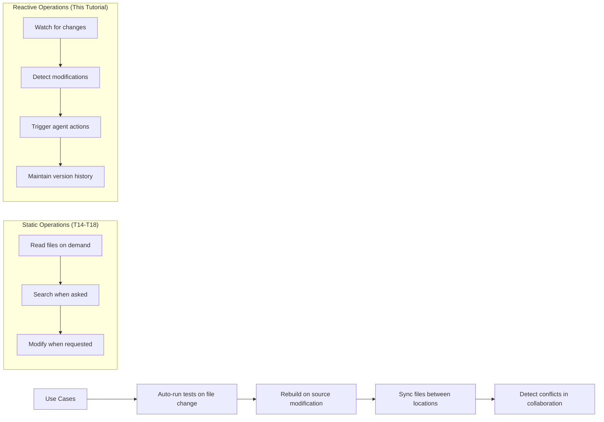
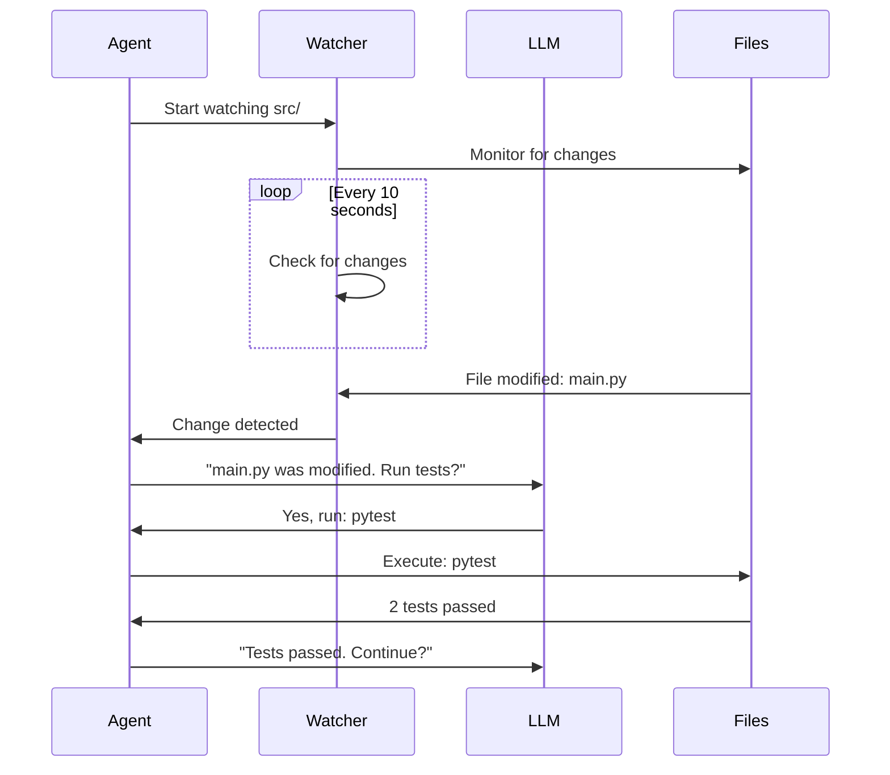
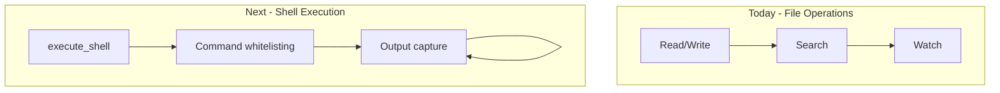

# Day 2, Tutorial 19: File Watching and Change Detection

**Course:** Build Your Own Coding Agent  
**Day:** 2  
**Tutorial:** 19 of 60  
**Estimated Time:** 55 minutes

---

## 🎯 What You'll Learn

By the end of this tutorial, you'll:
- Implement file system watchers to monitor directory changes in real-time
- Build change detection that tracks file modifications, creations, and deletions
- Create delta tools that show what changed since last check
- Implement file version snapshots for rollback capabilities
- Add watch patterns with glob filters (watch only .py files, etc.)
- Understand event debouncing to avoid excessive notifications
- Build integration with the agent's tool system for reactive workflows

---

## 🔄 Where We Left Off

In Tutorial 18, we built advanced search capabilities:



We now have:
- ✅ `read_file` - Read file contents with validation
- ✅ `write_file` - Write files with safety checks
- ✅ `list_dir` - Explore directory structure
- ✅ `file_exists` - Check file presence
- ✅ `file_info` - Get file metadata
- ✅ `delete_file` - Remove files safely
- ✅ `read_multiple` - Batch read operations
- ✅ `write_multiple` - Atomic multi-file writes
- ✅ `regex_search` - Advanced regex patterns
- ✅ `code_search` - AST-based code search
- ✅ `search_replace` - Find and replace with preview

**Today we add file watching!** Static file operations are powerful, but real-time change detection opens up new possibilities for reactive agents.

---

## 🧩 Why File Watching Matters



**Real-world scenarios:**
1. **Test-driven development** - Run tests automatically when source changes
2. **Live reload** - Rebuild applications on file modification
3. **Backup automation** - Copy changed files to backup location
4. **Code review triggers** - Notify when files are modified
5. **Cache invalidation** - Clear caches when dependencies change

Static file operations require explicit agent requests. File watching enables the agent to respond to changes autonomously.

---

## 🛠️ Building File Watching Tools

We'll create a new module `src/coding_agent/tools/watcher.py` with:
1. **WatchTool** - Start/stop watching directories for changes
2. **ChangeDetectorTool** - Detect what changed since last check
3. **DeltaTool** - Show differences between file versions
4. **SnapshotTool** - Create and restore file version snapshots

### Prerequisites

Make sure you have the `watchdog` library installed:

```bash
pip install watchdog
```

Add it to your requirements:

```python
# requirements.txt
watchdog>=3.0.0
```

### Project Structure

We'll add a new tools module:

```text
src/coding_agent/tools/
├── __init__.py          # Already exists
├── base.py              # Already exists  
├── registry.py          # Already exists
├── io.py                # T14: Read/Write tools
├── safety.py            # T15: Path validation
├── listing.py           # T16: Directory listing
├── multifile.py         # T17: Multi-file operations
├── search.py            # T18: Search tools
├── watcher.py           # NEW: File watching tools
└── ...
```

---

## Step 1: Create the Watcher Module

Create `src/coding_agent/tools/watcher.py`:

```python
"""
File Watching and Change Detection Tools

This module provides tools for monitoring file system changes,
detecting modifications, and maintaining version snapshots.
"""

import os
import time
import json
import hashlib
from pathlib import Path
from datetime import datetime
from typing import Optional, Dict, List, Set, Any
from watchdog.observers import Observer
from watchdog.events import FileSystemEventHandler, FileSystemEvent

from .base import BaseTool, ToolResult, ToolCategory


class FileChangeHandler(FileSystemEventHandler):
    """
    Handles file system events and maintains a change log.
    """
    
    def __init__(self, watch_id: str):
        super().__init__()
        self.watch_id = watch_id
        self.changes: List[Dict[str, Any]] = []
        self._last_event_time = time.time()
    
    def on_any_event(self, event: FileSystemEvent):
        """Capture any file system event."""
        if event.is_directory:
            return
        
        # Debounce: ignore rapid successive events on same file
        current_time = time.time()
        if current_time - self._last_event_time < 0.1:
            # Check if we already have a recent event for this path
            recent = [c for c in self.changes 
                     if c['path'] == event.src_path 
                     and current_time - c['timestamp'] < 0.2]
            if recent:
                return
        
        self._last_event_time = current_time
        
        change = {
            'timestamp': current_time,
            'datetime': datetime.now().isoformat(),
            'path': event.src_path,
            'event_type': event.event_type,
            'is_file': event.is_file,
            'is_directory': event.is_directory,
            'watch_id': self.watch_id
        }
        
        # Add event-specific details
        if hasattr(event, 'key'):
            change['key'] = event.key
        
        self.changes.append(change)
        
        # Keep only last 1000 changes per watch
        if len(self.changes) > 1000:
            self.changes = self.changes[-1000:]


class FileSnapshot:
    """
    Maintains snapshots of file states for change detection.
    """
    
    def __init__(self, snapshot_dir: Path):
        self.snapshot_dir = snapshot_dir
        self.snapshot_dir.mkdir(parents=True, exist_ok=True)
        self.snapshots: Dict[str, Dict[str, Any]] = {}
        self._load_index()
    
    def _load_index(self):
        """Load snapshot index from disk."""
        index_file = self.snapshot_dir / 'index.json'
        if index_file.exists():
            with open(index_file, 'r') as f:
                self.snapshots = json.load(f)
    
    def _save_index(self):
        """Save snapshot index to disk."""
        index_file = self.snapshot_dir / 'index.json'
        with open(index_file, 'w') as f:
            json.dump(self.snapshots, f, indent=2)
    
    def compute_hash(self, file_path: Path) -> str:
        """Compute SHA256 hash of file contents."""
        if not file_path.exists():
            return ""
        
        sha256 = hashlib.sha256()
        with open(file_path, 'rb') as f:
            for chunk in iter(lambda: f.read(8192), b''):
                sha256.update(chunk)
        return sha256.hexdigest()
    
    def create_snapshot(self, name: str, paths: List[Path]) -> Dict[str, Any]:
        """
        Create a named snapshot of specified paths.
        
        Args:
            name: Snapshot name
            paths: List of paths to snapshot
            
        Returns:
            Snapshot metadata
        """
        snapshot_id = f"{name}_{int(time.time())}"
        snapshot_data = {
            'id': snapshot_id,
            'name': name,
            'created_at': datetime.now().isoformat(),
            'files': {}
        }
        
        for path in paths:
            if not path.exists():
                continue
            
            if path.is_file():
                snapshot_data['files'][str(path)] = {
                    'hash': self.compute_hash(path),
                    'size': path.stat().st_size,
                    'modified': path.stat().st_mtime
                }
            elif path.is_dir():
                # Snapshot all files in directory
                for file_path in path.rglob('*'):
                    if file_path.is_file():
                        rel_path = file_path.relative_to(path)
                        snapshot_data['files'][str(rel_path)] = {
                            'hash': self.compute_hash(file_path),
                            'size': file_path.stat().st_size,
                            'modified': file_path.stat().st_mtime,
                            'is_dir': True
                        }
        
        # Save snapshot
        snapshot_file = self.snapshot_dir / f'{snapshot_id}.json'
        with open(snapshot_file, 'w') as f:
            json.dump(snapshot_data, f, indent=2)
        
        self.snapshots[snapshot_id] = {
            'name': name,
            'file_count': len(snapshot_data['files']),
            'created_at': snapshot_data['created_at']
        }
        self._save_index()
        
        return snapshot_data
    
    def compare_with_snapshot(self, snapshot_id: str, current_paths: List[Path]) -> Dict[str, Any]:
        """
        Compare current state with a saved snapshot.
        
        Args:
            snapshot_id: ID of snapshot to compare against
            current_paths: Current paths to check
            
        Returns:
            Comparison results with added, modified, deleted files
        """
        snapshot_file = self.snapshot_dir / f'{snapshot_id}.json'
        if not snapshot_file.exists():
            return {'error': f'Snapshot {snapshot_id} not found'}
        
        with open(snapshot_file, 'r') as f:
            snapshot_data = json.load(f)
        
        result = {
            'snapshot_id': snapshot_id,
            'snapshot_name': snapshot_data.get('name'),
            'added': [],
            'modified': [],
            'deleted': []
        }
        
        current_files = {}
        for path in current_paths:
            if not path.exists():
                continue
            
            if path.is_file():
                current_files[str(path)] = {
                    'hash': self.compute_hash(path),
                    'size': path.stat().st_size,
                    'modified': path.stat().st_mtime
                }
        
        snapshot_files = snapshot_data.get('files', {})
        
        # Find added and modified
        for path_str, current_meta in current_files.items():
            if path_str not in snapshot_files:
                result['added'].append(path_str)
            else:
                snapshot_meta = snapshot_files[path_str]
                if current_meta['hash'] != snapshot_meta.get('hash'):
                    result['modified'].append({
                        'path': path_str,
                        'old_hash': snapshot_meta.get('hash'),
                        'new_hash': current_meta['hash']
                    })
        
        # Find deleted
        for path_str in snapshot_files:
            if path_str not in current_files:
                result['deleted'].append(path_str)
        
        return result


class WatchManager:
    """
    Manages multiple file watchers across different directories.
    """
    
    def __init__(self, snapshot_dir: Optional[Path] = None):
        self.observers: Dict[str, Observer] = {}
        self.handlers: Dict[str, FileChangeHandler] = {}
        self.snapshot = FileSnapshot(snapshot_dir or Path('.watcher_snapshots'))
        self._watch_count = 0
    
    def start_watching(
        self,
        path: Path,
        recursive: bool = True,
        patterns: Optional[List[str]] = None
    ) -> str:
        """
        Start watching a path for changes.
        
        Args:
            path: Path to watch
            recursive: Watch subdirectories
            patterns: Optional glob patterns to filter (e.g., ['*.py'])
            
        Returns:
            Watch ID
        """
        watch_id = f"watch_{self._watch_count}"
        self._watch_count += 1
        
        handler = FileChangeHandler(watch_id)
        handler.patterns = patterns or ['*']
        
        observer = Observer()
        observer.schedule(handler, str(path), recursive=recursive)
        observer.start()
        
        self.observers[watch_id] = observer
        self.handlers[watch_id] = handler
        
        return watch_id
    
    def stop_watching(self, watch_id: str) -> bool:
        """
        Stop a watcher.
        
        Args:
            watch_id: ID of watch to stop
            
        Returns:
            True if stopped successfully
        """
        if watch_id not in self.observers:
            return False
        
        observer = self.observers[watch_id]
        observer.stop()
        observer.join(timeout=5)
        
        del self.observers[watch_id]
        del self.handlers[watch_id]
        
        return True
    
    def get_changes(self, watch_id: str, since: Optional[float] = None) -> List[Dict]:
        """
        Get changes for a watch.
        
        Args:
            watch_id: Watch ID
            since: Optional timestamp to get changes since
            
        Returns:
            List of changes
        """
        if watch_id not in self.handlers:
            return []
        
        handler = self.handlers[watch_id]
        changes = handler.changes
        
        if since is not None:
            changes = [c for c in changes if c['timestamp'] > since]
        
        return changes
    
    def stop_all(self):
        """Stop all watchers."""
        for watch_id in list(self.observers.keys()):
            self.stop_watching(watch_id)


# Global watch manager instance
_watch_manager: Optional[WatchManager] = None


def get_watch_manager() -> WatchManager:
    """Get or create the global watch manager."""
    global _watch_manager
    if _watch_manager is None:
        _watch_manager = WatchManager()
    return _watch_manager
```

---

## Step 2: Create the Watch Tool

Add the `WatchTool` class:

```python
class WatchTool(BaseTool):
    """
    Start or stop watching a directory for file changes.
    
    Usage:
        - Start watching: watch path="/project/src" recursive=true
        - Stop watching: watch action=stop watch_id="watch_0"
        - Get changes: watch action=status watch_id="watch_0"
    """
    
    def __init__(self):
        super().__init__(
            name="watch",
            description="Watch a directory for file changes, or manage existing watches. "
                       "Use action='start' to begin watching, action='stop' to end a watch, "
                       "or action='status' to get current changes.",
            category=ToolCategory.FILE_SYSTEM,
            parameters={
                "action": {
                    "type": "string",
                    "enum": ["start", "stop", "status", "list"],
                    "description": "Action to perform: start, stop, status, or list"
                },
                "path": {
                    "type": "string",
                    "description": "Directory path to watch (required for start action)"
                },
                "recursive": {
                    "type": "boolean",
                    "description": "Watch subdirectories recursively",
                    "default": True
                },
                "watch_id": {
                    "type": "string",
                    "description": "Watch ID for stop/status actions"
                },
                "since": {
                    "type": "number",
                    "description": "Get changes since this timestamp (Unix time)"
                }
            },
            required_params=["action"]
        )
        self.manager = get_watch_manager()
    
    def execute(self, **params) -> ToolResult:
        """Execute the watch action."""
        action = params.get("action", "status")
        
        if action == "start":
            return self._start_watch(params)
        elif action == "stop":
            return self._stop_watch(params)
        elif action == "status":
            return self._get_status(params)
        elif action == "list":
            return self._list_watches()
        else:
            return ToolResult(
                success=False,
                error=f"Unknown action: {action}"
            )
    
    def _start_watch(self, params: Dict) -> ToolResult:
        """Start a new file watch."""
        path_str = params.get("path")
        if not path_str:
            return ToolResult(
                success=False,
                error="path is required for start action"
            )
        
        path = Path(path_str).resolve()
        if not path.exists():
            return ToolResult(
                success=False,
                error=f"Path does not exist: {path}"
            )
        
        if not path.is_dir():
            return ToolResult(
                success=False,
                error=f"Path is not a directory: {path}"
            )
        
        recursive = params.get("recursive", True)
        patterns = params.get("patterns")
        
        watch_id = self.manager.start_watching(path, recursive, patterns)
        
        return ToolResult(
            success=True,
            output=f"Started watching: {path}",
            data={
                "watch_id": watch_id,
                "path": str(path),
                "recursive": recursive
            }
        )
    
    def _stop_watch(self, params: Dict) -> ToolResult:
        """Stop an existing watch."""
        watch_id = params.get("watch_id")
        if not watch_id:
            return ToolResult(
                success=False,
                error="watch_id is required for stop action"
            )
        
        success = self.manager.stop_watching(watch_id)
        
        if success:
            return ToolResult(
                success=True,
                output=f"Stopped watch: {watch_id}"
            )
        else:
            return ToolResult(
                success=False,
                error=f"Watch not found: {watch_id}"
            )
    
    def _get_status(self, params: Dict) -> ToolResult:
        """Get changes for a watch."""
        watch_id = params.get("watch_id")
        if not watch_id:
            return ToolResult(
                success=False,
                error="watch_id is required for status action"
            )
        
        changes = self.manager.get_changes(
            watch_id,
            params.get("since")
        )
        
        return ToolResult(
            success=True,
            output=f"Found {len(changes)} changes",
            data={
                "watch_id": watch_id,
                "changes": changes
            }
        )
    
    def _list_watches(self) -> ToolResult:
        """List all active watches."""
        watches = []
        for watch_id, handler in self.manager.handlers.items():
            # Get last change time
            last_change = None
            if handler.changes:
                last_change = handler.changes[-1]['datetime']
            
            watches.append({
                "watch_id": watch_id,
                "change_count": len(handler.changes),
                "last_change": last_change
            })
        
        return ToolResult(
            success=True,
            output=f"Active watches: {len(watches)}",
            data={"watches": watches}
        )
```

---

## Step 3: Create the Delta Tool

Add the `DeltaTool` for comparing file states:

```python
class DeltaTool(BaseTool):
    """
    Show differences between current file state and a snapshot.
    
    Usage:
        - Create snapshot: delta action=create name="before_refactor" paths=["/project/src"]
        - Compare: delta action=compare snapshot_id="before_refactor_1234567890"
    """
    
    def __init__(self):
        super().__init__(
            name="delta",
            description="Compare current file state with snapshots to detect changes. "
                       "Use action='create' to make a snapshot, 'compare' to see changes.",
            category=ToolCategory.FILE_SYSTEM,
            parameters={
                "action": {
                    "type": "string",
                    "enum": ["create", "compare", "list"],
                    "description": "Action: create snapshot, compare with snapshot, or list snapshots"
                },
                "name": {
                    "type": "string",
                    "description": "Snapshot name (for create action)"
                },
                "paths": {
                    "type": "array",
                    "items": {"type": "string"},
                    "description": "Paths to snapshot (for create action)"
                },
                "snapshot_id": {
                    "type": "string",
                    "description": "Snapshot ID to compare against (for compare action)"
                }
            },
            required_params=["action"]
        )
        self.manager = get_watch_manager()
        self.snapshot = self.manager.snapshot
    
    def execute(self, **params) -> ToolResult:
        """Execute the delta action."""
        action = params.get("action")
        
        if action == "create":
            return self._create_snapshot(params)
        elif action == "compare":
            return self._compare_snapshot(params)
        elif action == "list":
            return self._list_snapshots()
        else:
            return ToolResult(
                success=False,
                error=f"Unknown action: {action}"
            )
    
    def _create_snapshot(self, params: Dict) -> ToolResult:
        """Create a new snapshot."""
        name = params.get("name")
        if not name:
            return ToolResult(
                success=False,
                error="name is required for create action"
            )
        
        paths_str = params.get("paths", [])
        if not paths_str:
            return ToolResult(
                success=False,
                error="paths is required for create action"
            )
        
        paths = [Path(p).resolve() for p in paths_str]
        
        for path in paths:
            if not path.exists():
                return ToolResult(
                    success=False,
                    error=f"Path does not exist: {path}"
                )
        
        snapshot_data = self.snapshot.create_snapshot(name, paths)
        
        return ToolResult(
            success=True,
            output=f"Created snapshot '{name}' with {len(snapshot_data['files'])} files",
            data={
                "snapshot_id": snapshot_data['id'],
                "file_count": len(snapshot_data['files'])
            }
        )
    
    def _compare_snapshot(self, params: Dict) -> ToolResult:
        """Compare current state with a snapshot."""
        snapshot_id = params.get("snapshot_id")
        if not snapshot_id:
            return ToolResult(
                success=False,
                error="snapshot_id is required for compare action"
            )
        
        # Get all tracked paths from the snapshot
        snapshot_file = self.snapshot.snapshot_dir / f'{snapshot_id}.json'
        if not snapshot_file.exists():
            return ToolResult(
                success=False,
                error=f"Snapshot not found: {snapshot_id}"
            )
        
        with open(snapshot_file, 'r') as f:
            snapshot_data = json.load(f)
        
        # Get current paths from snapshot
        current_paths = [Path(p) for p in snapshot_data.get('files', {}).keys()]
        # Add base directories
        for path in list(current_paths):
            if not path.exists():
                # Try as directory
                current_paths.append(path.parent)
        
        # Dedupe
        current_paths = list(set(current_paths))
        
        result = self.snapshot.compare_with_snapshot(snapshot_id, current_paths)
        
        # Format output
        output_parts = []
        if result.get('added'):
            output_parts.append(f"Added: {len(result['added'])} files")
        if result.get('modified'):
            output_parts.append(f"Modified: {len(result['modified'])} files")
        if result.get('deleted'):
            output_parts.append(f"Deleted: {len(result['deleted'])} files")
        
        if not output_parts:
            output_parts.append("No changes")
        
        return ToolResult(
            success=True,
            output=", ".join(output_parts),
            data=result
        )
    
    def _list_snapshots(self) -> ToolResult:
        """List all snapshots."""
        snapshots = []
        for snap_id, info in self.snapshot.snapshots.items():
            snapshots.append({
                "id": snap_id,
                "name": info.get("name"),
                "file_count": info.get("file_count"),
                "created_at": info.get("created_at")
            })
        
        return ToolResult(
            success=True,
            output=f"Snapshots: {len(snapshots)}",
            data={"snapshots": snapshots}
        )
```

---

## Step 4: Create the FileInfoDiff Tool

Add a tool for comparing two file versions:

```python
class FileDiffTool(BaseTool):
    """
    Show the difference between two versions of a file or directory.
    
    Usage:
        - Compare files: diff path="/project/file.py" compare_with="/backup/file.py"
        - Compare with snapshot: diff path="/project/file.py" snapshot_id="before_123"
    """
    
    def __init__(self):
        super().__init__(
            name="diff",
            description="Show differences between files or between current state and snapshots",
            category=ToolCategory.FILE_SYSTEM,
            parameters={
                "path": {
                    "type": "string",
                    "description": "Current file path to compare"
                },
                "compare_with": {
                    "type": "string",
                    "description": "File path to compare against"
                },
                "snapshot_id": {
                    "type": "string",
                    "description": "Snapshot ID to compare current file against"
                }
            },
            required_params=["path"]
        )
        self.manager = get_watch_manager()
        self.snapshot = self.manager.snapshot
    
    def execute(self, **params) -> ToolResult:
        """Execute the diff."""
        path = Path(params.get("path", "")).resolve()
        
        if not path.exists():
            return ToolResult(
                success=False,
                error=f"Path does not exist: {path}"
            )
        
        # Compare with another file
        compare_with = params.get("compare_with")
        if compare_with:
            return self._compare_files(path, Path(compare_with).resolve())
        
        # Compare with snapshot
        snapshot_id = params.get("snapshot_id")
        if snapshot_id:
            return self._compare_with_snapshot(path, snapshot_id)
        
        return ToolResult(
            success=False,
            error="Must specify compare_with or snapshot_id"
        )
    
    def _compare_files(self, path1: Path, path2: Path) -> ToolResult:
        """Compare two files."""
        if not path2.exists():
            return ToolResult(
                success=False,
                error=f"Comparison file does not exist: {path2}"
            )
        
        with open(path1, 'r') as f1:
            content1 = f1.read()
        
        with open(path2, 'r') as f2:
            content2 = f2.read()
        
        # Simple line-by-line diff
        lines1 = content1.splitlines()
        lines2 = content2.splitlines()
        
        diff_result = self._compute_diff(lines1, lines2)
        
        return ToolResult(
            success=True,
            output=diff_result['summary'],
            data=diff_result
        )
    
    def _compare_with_snapshot(self, path: Path, snapshot_id: str) -> ToolResult:
        """Compare current file with snapshot."""
        snapshot_file = self.snapshot.snapshot_dir / f'{snapshot_id}.json'
        
        if not snapshot_file.exists():
            return ToolResult(
                success=False,
                error=f"Snapshot not found: {snapshot_id}"
            )
        
        with open(snapshot_file, 'r') as f:
            snapshot_data = json.load(f)
        
        snapshot_files = snapshot_data.get('files', {})
        
        if str(path) not in snapshot_files:
            return ToolResult(
                success=False,
                error=f"File not in snapshot: {path}"
            )
        
        # Compare hashes
        current_hash = self.snapshot.compute_hash(path)
        snapshot_hash = snapshot_files[str(path)].get('hash')
        
        if current_hash == snapshot_hash:
            return ToolResult(
                success=True,
                output="No changes detected",
                data={"changed": False}
            )
        
        # File has changed - show diff with backup if available
        backup_file = self.snapshot.snapshot_dir / f'{snapshot_id}_{path.name}'
        
        if backup_file.exists():
            return self._compare_files(path, backup_file)
        
        return ToolResult(
            success=True,
            output="File has changed (no backup available for diff)",
            data={
                "changed": True,
                "old_hash": snapshot_hash,
                "new_hash": current_hash
            }
        )
    
    def _compute_diff(self, lines1: List[str], lines2: List[str]) -> Dict:
        """Compute simple line-by-line diff."""
        # Find common prefix and suffix
        prefix_len = 0
        for i in range(min(len(lines1), len(lines2))):
            if lines1[i] == lines2[i]:
                prefix_len += 1
            else:
                break
        
        suffix_len = 0
        for i in range(min(len(lines1), len(lines2)) - prefix_len):
            if lines1[-(i+1)] == lines2[-(i+1)]:
                suffix_len += 1
            else:
                break
        
        # Extract differences
        common_len = prefix_len + suffix_len
        old_lines = lines1[prefix_len:len(lines1)-suffix_len] if suffix_len else lines1[prefix_len:]
        new_lines = lines2[prefix_len:len(lines2)-suffix_len] if suffix_len else lines2[prefix_len:]
        
        return {
            "summary": f"+{len(new_lines)} -{len(old_lines)} lines",
            "prefix": prefix_len,
            "suffix": suffix_len,
            "removed": old_lines,
            "added": new_lines
        }
```

---

## Step 5: Register the Tools

Add the new tools to the registry:

```python
# src/coding_agent/tools/__init__.py

from .io import ReadFileTool, WriteFileTool, FileExistsTool
from .safety import PathValidationTool, SafePathTool
from .listing import ListDirTool, FileInfoTool, DeleteFileTool
from .multifile import ReadMultipleTool, WriteMultipleTool, DiffTool, SearchInFilesTool
from .search import RegexSearchTool, CodeSearchTool, SearchReplaceTool
from .watcher import WatchTool, DeltaTool, FileDiffTool  # NEW

__all__ = [
    # IO Tools
    'ReadFileTool',
    'WriteFileTool', 
    'FileExistsTool',
    # Safety Tools
    'PathValidationTool',
    'SafePathTool',
    # Listing Tools
    'ListDirTool',
    'FileInfoTool',
    'DeleteFileTool',
    # Multi-file Tools
    'ReadMultipleTool',
    'WriteMultipleTool',
    'DiffTool',
    'SearchInFilesTool',
    # Search Tools
    'RegexSearchTool',
    'CodeSearchTool',
    'SearchReplaceTool',
    # Watcher Tools
    'WatchTool',
    'DeltaTool',
    'FileDiffTool',
]
```

Now update the tool factory or registry to include these tools.

---

## Step 6: Using the File Watching Tools

Here's how an agent can use these tools:

### Example 1: Start Watching and Get Changes

```python
# Start watching the src directory
result = watch(
    action="start",
    path="/project/src",
    recursive=True
)
print(result.data)
# {'watch_id': 'watch_0', 'path': '/project/src', 'recursive': True}

# ... make some file changes ...

# Get changes since we started watching
result = watch(
    action="status",
    watch_id="watch_0"
)
print(result.data['changes'])
# [{'timestamp': 1234567890.1, 'path': '/project/src/main.py', 
#   'event_type': 'modified'}]
```

### Example 2: Create Snapshot and Compare

```python
# Create a snapshot before refactoring
result = delta(
    action="create",
    name="before_refactor",
    paths=["/project/src"]
)
print(result.data)
# {'snapshot_id': 'before_refactor_1234567890', 'file_count': 42}

# ... make changes ...

# Compare current state with snapshot
result = delta(
    action="compare",
    snapshot_id="before_refactor_1234567890"
)
print(result.data)
# {'added': [], 'modified': ['/project/src/main.py'], 'deleted': []}
```

### Example 3: Use in Agent Loop

```python
async def reactive_agent():
    """An agent that reacts to file changes."""
    
    # Start watching
    watch_result = await agent.execute_tool("watch", {
        "action": "start",
        "path": "./src",
        "recursive": True
    })
    watch_id = watch_result.data["watch_id"]
    
    while True:
        # Check for changes
        status_result = await agent.execute_tool("watch", {
            "action": "status",
            "watch_id": watch_id
        })
        
        changes = status_result.data.get("changes", [])
        
        if changes:
            print(f"Detected {len(changes)} changes")
            
            # React to changes - run tests
            test_result = await agent.execute_tool("execute_shell", {
                "command": "pytest"
            })
            
            # If tests fail, notify
            if not test_result.success or "FAILED" in test_result.output:
                await send_notification("Tests failed after file change!")
        
        await asyncio.sleep(5)  # Check every 5 seconds
```

---

## 🧪 Testing the Watcher Tools

Create a test file `tests/test_watcher.py`:

```python
"""Tests for file watching tools."""

import pytest
import time
import tempfile
import shutil
from pathlib import Path

from coding_agent.tools.watcher import (
    WatchManager, FileSnapshot, WatchTool, DeltaTool, FileDiffTool
)


class TestWatchManager:
    """Test the watch manager."""
    
    @pytest.fixture
    def temp_dir(self):
        """Create a temporary directory."""
        tmp = tempfile.mkdtemp()
        yield Path(tmp)
        shutil.rmtree(tmp)
    
    def test_start_stop_watching(self, temp_dir):
        """Test starting and stopping a watch."""
        manager = WatchManager()
        
        watch_id = manager.start_watching(temp_dir)
        assert watch_id is not None
        assert watch_id in manager.observers
        
        success = manager.stop_watching(watch_id)
        assert success is True
        assert watch_id not in manager.observers
    
    def test_detect_file_change(self, temp_dir):
        """Test detecting file changes."""
        manager = WatchManager()
        
        watch_id = manager.start_watching(temp_dir)
        
        # Create a file
        test_file = temp_dir / "test.txt"
        test_file.write_text("hello")
        
        # Wait for event to propagate
        time.sleep(0.5)
        
        # Get changes
        changes = manager.get_changes(watch_id)
        
        assert len(changes) > 0
        assert any(c['event_type'] == 'created' for c in changes)
        
        # Modify file
        test_file.write_text("world")
        time.sleep(0.5)
        
        changes = manager.get_changes(watch_id)
        assert any(c['event_type'] == 'modified' for c in changes)
        
        manager.stop_watching(watch_id)


class TestFileSnapshot:
    """Test file snapshots."""
    
    @pytest.fixture
    def temp_dir(self):
        """Create a temporary directory."""
        tmp = tempfile.mkdtemp()
        yield Path(tmp)
        shutil.rmtree(tmp)
    
    def test_create_and_compare(self, temp_dir):
        """Test creating and comparing snapshots."""
        # Create test files
        file1 = temp_dir / "file1.txt"
        file2 = temp_dir / "file2.txt"
        file1.write_text("hello")
        file2.write_text("world")
        
        snapshot = FileSnapshot(temp_dir / ".snapshots")
        
        # Create snapshot
        result = snapshot.create_snapshot("test", [temp_dir])
        assert result['id'] is not None
        
        # Modify file
        file1.write_text("changed")
        
        # Compare
        comparison = snapshot.compare_with_snapshot(
            result['id'], 
            [temp_dir]
        )
        
        assert len(comparison['modified']) > 0
        assert any('file1.txt' in m['path'] for m in comparison['modified'])


class TestWatchTool:
    """Test the watch tool."""
    
    @pytest.fixture
    def temp_dir(self):
        """Create a temporary directory."""
        tmp = tempfile.mkdtemp()
        yield Path(tmp)
        shutil.rmtree(tmp)
    
    def test_start_watch(self, temp_dir):
        """Test starting a watch via tool."""
        tool = WatchTool()
        
        result = tool.execute(
            action="start",
            path=str(temp_dir)
        )
        
        assert result.success is True
        assert 'watch_id' in result.data
        
        # Clean up
        tool.manager.stop_watching(result.data['watch_id'])
    
    def test_list_watches(self, temp_dir):
        """Test listing watches."""
        tool = WatchTool()
        
        # Start a watch
        result = tool.execute(action="start", path=str(temp_dir))
        watch_id = result.data['watch_id']
        
        # List watches
        result = tool.execute(action="list")
        
        assert result.success is True
        assert len(result.data['watches']) > 0
        
        # Clean up
        tool.manager.stop_watching(watch_id)
```

Run the tests:

```bash
pytest tests/test_watcher.py -v
```

---

## 🔄 Integration with Agent Context

File watching becomes powerful when integrated with the agent's context management:



---

## 📚 Reference: Watcher Tools Summary

| Tool | Purpose | Key Features |
|------|---------|--------------|
| `watch` | Monitor directories | Start/stop/status/list, recursive, patterns |
| `delta` | Snapshot comparison | Create snapshots, compare, list history |
| `diff` | File comparison | Compare files, compare with snapshots |

### Watch Event Types

| Event | Description |
|-------|-------------|
| `created` | New file or directory created |
| `modified` | File content changed |
| `deleted` | File or directory deleted |
| `moved` | File or directory moved |
| `closed` | File closed after writing |

### Best Practices

1. **Debounce rapid changes** - Use the built-in debouncing to avoid event floods
2. **Filter with patterns** - Watch only relevant files (e.g., `*.py`)
3. **Clean up watchers** - Always stop watchers when done
4. **Use snapshots for comparisons** - Create before making changes
5. **Limit concurrent watchers** - Too many watchers can impact performance

---

## 🎯 What's Next

In Tutorial 20, we'll add **shell execution capabilities** to give your agent full system access:



---

*Tutorial 19/60 complete. Our agent can now watch for file changes and track modifications! 📁👁️*