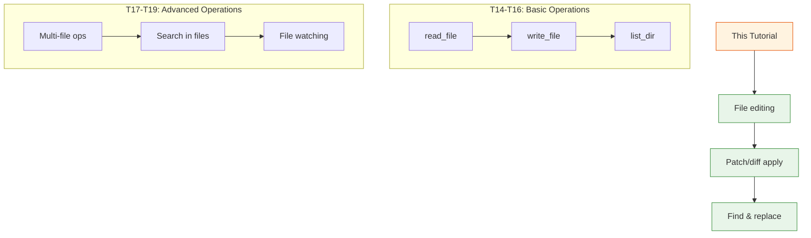
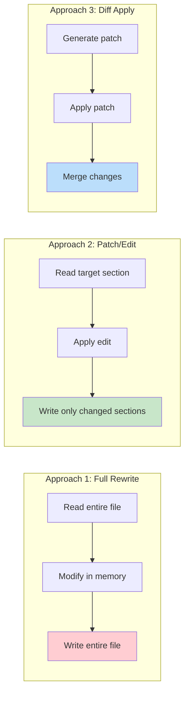

# Day 2, Tutorial 20: File Editing & Patching

**Course:** Build Your Own Coding Agent  
**Day:** 2  
**Tutorial:** 20 of 60  
**Estimated Time:** 60 minutes

---

## 🎯 What You'll Learn

By the end of this tutorial, you'll:
- Implement in-place file editing with line-level precision
- Create patch/diff application tools
- Build find-and-replace functionality with regex support
- Add search-and-replace across multiple files
- Handle file editing with atomic operations and rollback
- Understand when to use patching vs. complete rewrites

---

## 🔄 Where We Left Off

In Tutorials 14-19, we built a comprehensive file operation suite:



We now have:
- ✅ `read_file` / `write_file` - Basic I/O
- ✅ `list_dir` - Directory exploration
- ✅ `file_exists`, `file_info`, `delete_file` - File management
- ✅ Path validation preventing directory traversal
- ✅ `read_multiple` / `write_multiple` - Batch operations
- ✅ `diff` - Preview changes
- ✅ `search_in_files` - Multi-file search
- ✅ File watching for change detection

**Today we add file editing capabilities!** Sometimes you don't want to rewrite entire files—you just need to make precise edits.

---

## 🧩 Why File Editing Matters

There are three approaches to modifying file content:



**Why editing is better for large files:**
1. **Memory efficient** - Don't load entire 10,000 line file
2. **Atomicity** - Smaller chance of corruption
3. **Speed** - Edit one line vs. rewrite all 10,000
4. **Preserve formatting** - Keep original whitespace/comments

**Real-world scenarios:**
1. **Fix bugs** - Change specific function without touching rest
2. **Update config** - Modify single setting in large JSON/YAML
3. **Add imports** - Insert import at specific location
4. **Rename variables** - Replace in specific scope only
5. **Apply patches** - Use diff/patch format from git

---

## 🛠️ Building File Editing Tools

We'll create a new module `src/coding_agent/tools/editing.py` with:
1. **EditFileTool** - In-place file editing with line-level precision
2. **ApplyPatchTool** - Apply unified diff patches
3. **FindReplaceTool** - Search and replace with regex support
4. **MultiFileEditTool** - Batch find-replace across files

### Step 1: Create the Editing Tools Module

Create `src/coding_agent/tools/editing.py`:

```python
"""
File Editing and Patching Tools

Advanced file modification capabilities:
- EditFileTool: In-place editing with line-level precision
- ApplyPatchTool: Apply unified diff patches
- FindReplaceTool: Search and replace with regex
- MultiFileEditTool: Batch editing across files

These tools build on the file operations from Tutorials 14-19.
"""

import difflib
import re
import tempfile
from dataclasses import dataclass, field
from pathlib import Path
from typing import Any, Dict, List, Optional, Tuple, Union
import logging

from coding_agent.tools.base import BaseTool, ToolDefinition, ToolParameter
from coding_agent.tools.files import PathValidator
from coding_agent.exceptions import ValidationError

logger = logging.getLogger(__name__)


# ============================================================================
# Result Classes
# ============================================================================

@dataclass
class EditOperation:
    """Represents a single edit operation."""
    operation_type: str  # 'replace', 'insert', 'delete', 'replace_lines'
    start_line: Optional[int] = None
    end_line: Optional[int] = None
    old_content: Optional[str] = None
    new_content: Optional[str] = None
    success: bool = True
    error: Optional[str] = None


@dataclass
class EditResult:
    """Result of a file edit operation."""
    file_path: str
    operations: List[EditOperation] = field(default_factory=list)
    old_content: str = ""
    new_content: str = ""
    lines_modified: int = 0
    success: bool = True
    
    def to_display(self) -> str:
        """Format result for display."""
        if not self.success:
            return f"Edit failed for {self.file_path}: {self.operations[0].error if self.operations else 'Unknown error'}"
        
        lines = [
            f"Edit successful: {self.file_path}",
            f"Lines modified: {self.lines_modified}",
            f"Operations: {len(self.operations)}",
            ""
        ]
        
        for i, op in enumerate(self.operations, 1):
            lines.append(f"  {i}. {op.operation_type}")
            if op.start_line and op.end_line:
                lines.append(f"     Lines {op.start_line}-{op.end_line}")
            if op.old_content and op.new_content:
                lines.append(f"     Old: {op.old_content[:50]}...")
                lines.append(f"     New: {op.new_content[:50]}...")
        
        return "\n".join(lines)
    
    def to_dict(self) -> Dict[str, Any]:
        return {
            "file_path": self.file_path,
            "success": self.success,
            "lines_modified": self.lines_modified,
            "operations": [
                {
                    "type": op.operation_type,
                    "start_line": op.start_line,
                    "end_line": op.end_line,
                    "success": op.success,
                    "error": op.error,
                }
                for op in self.operations
            ]
        }


@dataclass
class PatchResult:
    """Result of applying a patch."""
    file_path: str
    patch_content: str
    hunks_applied: int = 0
    hunks_failed: int = 0
    success: bool = True
    error: Optional[str] = None
    
    def to_display(self) -> str:
        """Format result for display."""
        if not self.success:
            return f"Patch failed: {self.error}"
        
        lines = [
            f"Patch applied: {self.file_path}",
            f"Hunks applied: {self.hunks_applied}",
            f"Hunks failed: {self.hunks_failed}",
        ]
        
        return "\n".join(lines)


@dataclass
class FindReplaceResult:
    """Result of a find-replace operation."""
    file_path: str
    matches_found: int = 0
    replacements_made: int = 0
    old_content: str = ""
    new_content: str = ""
    success: bool = True
    error: Optional[str] = None
    
    def to_display(self) -> str:
        """Format result for display."""
        if not self.success:
            return f"Find-replace failed: {self.error}"
        
        lines = [
            f"Find-replace: {self.file_path}",
            f"Matches found: {self.matches_found}",
            f"Replacements made: {self.replacements_made}",
        ]
        
        return "\n".join(lines)


# ============================================================================
# Edit File Tool
# ============================================================================

class EditFileTool(BaseTool):
    """
    Edit a file in-place with line-level precision.
    
    Supports:
    - Replace specific lines
    - Insert lines at specific positions
    - Delete lines
    - Replace content matching a pattern
    
    Features:
    - Preview mode (see changes before applying)
    - Backup creation
    - Atomic operations with rollback on failure
    - Line number validation
    """
    
    def __init__(self, config: Optional[Dict[str, Any]] = None):
        super().__init__()
        self.config = config or {}
        self._validator = PathValidator(
            self.config.get("allowed_directories", ["."])
        )
        self._read_only = self.config.get("read_only", False)
    
    def define(self) -> ToolDefinition:
        return ToolDefinition(
            name="edit_file",
            description="""Edit a file in-place with line-level precision.

Use this tool to:
- Replace specific lines in a file
- Insert new lines at specific positions
- Delete lines
- Make precise edits without rewriting entire file

Operations:
- REPLACE: Replace line(s) at specific position
- INSERT: Insert line(s) at specific position  
- DELETE: Delete line(s) at specific position
- REPLACE_ALL: Replace all lines matching a pattern

⚠️ Always use preview=True first to verify changes!""",
            parameters={
                "path": ToolParameter(
                    type="string",
                    description="File path to edit"
                ),
                "operation": ToolParameter(
                    type="string",
                    description="Operation: replace, insert, delete, or replace_all"
                ),
                "start_line": ToolParameter(
                    type="integer",
                    description="Start line number (1-based)"
                ),
                "end_line": ToolParameter(
                    type="integer",
                    description="End line number for replace/delete (inclusive)"
                ),
                "new_content": ToolParameter(
                    type="string",
                    description="New content to insert or replace with"
                ),
                "pattern": ToolParameter(
                    type="string",
                    description="Pattern to match for replace_all operation"
                ),
                "preview": ToolParameter(
                    type="boolean",
                    description="Preview changes without applying",
                    default=False
                ),
                "backup": ToolParameter(
                    type="boolean",
                    description="Create backup before editing",
                    default=True
                )
            },
            required=["path", "operation"]
        )
    
    def execute(self, **params: Any) -> str:
        """Edit a file in-place."""
        if self._read_only:
            return "Error: Edit operations disabled (read_only mode)"
        
        path = params.get("path")
        operation = params.get("operation")
        start_line = params.get("start_line")
        end_line = params.get("end_line")
        new_content = params.get("new_content", "")
        pattern = params.get("pattern")
        preview = params.get("preview", False)
        backup = params.get("backup", True)
        
        if not path or not operation:
            return "Error: path and operation are required"
        
        # Validate path
        validation = self._validator.validate(path)
        if not validation["valid"]:
            return f"Error: {validation['error']}"
        
        file_path = validation["resolved"]
        
        if not file_path.exists():
            return f"Error: File does not exist: {path}"
        
        if not file_path.is_file():
            return f"Error: Not a file: {path}"
        
        # Read current content
        try:
            old_content = file_path.read_text(encoding='utf-8')
        except Exception as e:
            return f"Error reading file: {e}"
        
        lines = old_content.split('\n')
        total_lines = len(lines)
        
        # Validate line numbers
        if start_line is not None:
            if start_line < 1 or start_line > total_lines:
                return f"Error: start_line {start_line} out of range (1-{total_lines})"
        
        if end_line is not None:
            if end_line < 1 or end_line > total_lines:
                return f"Error: end_line {end_line} out of range (1-{total_lines})"
            if start_line is not None and end_line < start_line:
                return f"Error: end_line must be >= start_line"
        
        # Perform the edit
        new_lines = lines.copy()
        edit_op = EditOperation(operation_type=operation)
        
        if operation == "replace":
            if start_line is None:
                return "Error: start_line required for replace operation"
            
            end = end_line if end_line is not None else start_line
            edit_op.start_line = start_line
            edit_op.end_line = end
            edit_op.old_content = '\n'.join(lines[start_line-1:end])
            
            # Replace lines
            new_content_lines = new_content.split('\n') if new_content else []
            new_lines = lines[:start_line-1] + new_content_lines + lines[end:]
            edit_op.new_content = new_content
            
        elif operation == "insert":
            if start_line is None:
                return "Error: start_line required for insert operation"
            
            edit_op.start_line = start_line
            edit_op.new_content = new_content
            
            # Insert lines at position (before start_line)
            new_content_lines = new_content.split('\n') if new_content else []
            new_lines = lines[:start_line-1] + new_content_lines + lines[start_line-1:]
            
        elif operation == "delete":
            if start_line is None or end_line is None:
                return "Error: start_line and end_line required for delete operation"
            
            edit_op.start_line = start_line
            edit_op.end_line = end_line
            edit_op.old_content = '\n'.join(lines[start_line-1:end_line])
            
            # Delete lines
            new_lines = lines[:start_line-1] + lines[end_line:]
            
        elif operation == "replace_all":
            if not pattern:
                return "Error: pattern required for replace_all operation"
            
            try:
                pattern_re = re.compile(pattern)
            except re.error as e:
                return f"Error in regex pattern: {e}"
            
            # Find all matches
            matches_found = 0
            test_content = old_content
            for match in pattern_re.finditer(old_content):
                matches_found += 1
            
            if matches_found == 0:
                return f"No matches found for pattern: {pattern}"
            
            edit_op.old_content = f"Pattern: {pattern}"
            edit_op.new_content = new_content
            
            # Replace all
            new_content_result = pattern_re.sub(new_content, old_content)
            new_lines = new_content_result.split('\n')
            
        else:
            return f"Error: Unknown operation: {operation}. Use: replace, insert, delete, or replace_all"
        
        new_content_str = '\n'.join(new_lines)
        
        # Preview mode
        if preview:
            diff = list(difflib.unified_diff(
                old_content.splitlines(keepends=True),
                new_content_str.splitlines(keepends=True),
                fromfile='a/' + path,
                tofile='b/' + path,
                lineterm=''
            ))
            
            result = [
                f"PREVIEW MODE - No changes applied to: {path}",
                f"Operation: {operation}",
                f"---",
            ]
            result.extend(diff)
            
            return '\n'.join(result)
        
        # Create backup
        if backup:
            backup_path = file_path.with_suffix(file_path.suffix + '.bak')
            try:
                backup_path.write_text(old_content, encoding='utf-8')
            except Exception as e:
                logger.warning(f"Could not create backup: {e}")
        
        # Write changes
        try:
            file_path.write_text(new_content_str, encoding='utf-8')
        except Exception as e:
            return f"Error writing file: {e}"
        
        edit_result = EditResult(
            file_path=path,
            operations=[edit_op],
            old_content=old_content,
            new_content=new_content_str,
            lines_modified=abs(len(new_lines) - len(lines)),
            success=True
        )
        
        return edit_result.to_display()


# ============================================================================
# Apply Patch Tool
# ============================================================================

class ApplyPatchTool(BaseTool):
    """
    Apply a unified diff patch to a file.
    
    Supports standard patch format:
    - Unified diff format (from git diff)
    - Hunk headers with context
    - Filename in headers
    
    Features:
    - Backup before patch
    - Dry run mode
    - Validate patch before applying
    """
    
    def __init__(self, config: Optional[Dict[str, Any]] = None):
        super().__init__()
        self.config = config or {}
        self._validator = PathValidator(
            self.config.get("allowed_directories", ["."])
        )
        self._read_only = self.config.get("read_only", False)
    
    def define(self) -> ToolDefinition:
        return ToolDefinition(
            name="apply_patch",
            description="""Apply a unified diff patch to a file.

Use this tool to:
- Apply patches generated by git diff
- Apply patches from patch files
- Merge changes from unified diff format

Input should be standard unified diff format:
---
diff --git a/file.py b/file.py
--- a/file.py
+++ b/file.py
@@ -1,3 +1,4 @@
+ new line
 existing line
---

⚠️ Validate patch first with dry_run=True!""",
            parameters={
                "path": ToolParameter(
                    type="string",
                    description="File to patch"
                ),
                "patch": ToolParameter(
                    type="string",
                    description="Patch content in unified diff format"
                ),
                "dry_run": ToolParameter(
                    type="boolean",
                    description="Validate patch without applying",
                    default=True
                ),
                "backup": ToolParameter(
                    type="boolean",
                    description="Create backup before patching",
                    default=True
                )
            },
            required=["path", "patch"]
        )
    
    def execute(self, **params: Any) -> str:
        """Apply a patch to a file."""
        if self._read_only:
            return "Error: Patch operations disabled (read_only mode)"
        
        path = params.get("path")
        patch = params.get("patch")
        dry_run = params.get("dry_run", True)
        backup = params.get("backup", True)
        
        if not path or not patch:
            return "Error: path and patch are required"
        
        # Validate path
        validation = self._validator.validate(path)
        if not validation["valid"]:
            return f"Error: {validation['error']}"
        
        file_path = validation["resolved"]
        
        # Get original content
        if file_path.exists():
            try:
                old_content = file_path.read_text(encoding='utf-8')
            except Exception as e:
                return f"Error reading file: {e}"
        else:
            # File doesn't exist - will be created
            old_content = ""
        
        # Parse and apply patch
        try:
            # Simple patch implementation using difflib
            old_lines = old_content.splitlines(keepends=True)
            
            # Parse unified diff manually
            hunks = self._parse_patch(patch)
            
            if not hunks:
                return "Error: No valid hunks found in patch"
            
            # Validate patch can be applied
            new_lines = self._apply_hunks(old_lines, hunks, dry_run=True)
            
            if dry_run:
                # Show what would happen
                diff = list(difflib.unified_diff(
                    old_lines,
                    new_lines,
                    fromfile='a/' + path,
                    tofile='b/' + path,
                    lineterm=''
                ))
                
                result = [
                    f"DRY RUN - Patch can be applied: {path}",
                    f"Hunks: {len(hunks)}",
                    ""
                ]
                result.extend(diff[:100])  # Limit output
                
                return '\n'.join(result)
            
            # Apply patch
            new_lines = self._apply_hunks(old_lines, hunks, dry_run=False)
            new_content = ''.join(new_lines)
            
            # Create backup
            if backup and old_content:
                backup_path = file_path.with_suffix(file_path.suffix + '.bak')
                try:
                    backup_path.write_text(old_content, encoding='utf-8')
                except Exception as e:
                    logger.warning(f"Could not create backup: {e}")
            
            # Write patched content
            file_path.write_text(new_content, encoding='utf-8')
            
            return f"Patch applied successfully: {path}\nHunks applied: {len(hunks)}"
            
        except Exception as e:
            return f"Error applying patch: {e}"
    
    def _parse_patch(self, patch: str) -> List[Dict]:
        """Parse unified diff format into hunks."""
        hunks = []
        lines = patch.split('\n')
        
        i = 0
        current_hunk = None
        old_start = 0
        old_count = 0
        new_start = 0
        new_count = 0
        
        while i < len(lines):
            line = lines[i]
            
            # Hunk header
            if line.startswith('@@'):
                # Parse hunk header: @@ -old_start,old_count +new_start,new_count @@
                match = re.match(r'@@ -(\d+),?(\d*) \+(\d+),?(\d*) @@', line)
                if match:
                    if current_hunk:
                        hunks.append(current_hunk)
                    
                    old_start = int(match.group(1))
                    old_count = int(match.group(2)) if match.group(2) else 1
                    new_start = int(match.group(3))
                    new_count = int(match.group(4)) if match.group(4) else 1
                    
                    current_hunk = {
                        'old_start': old_start,
                        'old_lines': [],
                        'new_lines': [],
                    }
                    
            elif current_hunk is not None:
                if line.startswith('-'):
                    current_hunk['old_lines'].append(line[1:])
                elif line.startswith('+'):
                    current_hunk['new_lines'].append(line[1:])
                elif line.startswith(' ') or (line and not line.startswith('\\')):
                    # Context line
                    current_hunk['old_lines'].append(line)
                    current_hunk['new_lines'].append(line)
            
            i += 1
        
        if current_hunk:
            hunks.append(current_hunk)
        
        return hunks
    
    def _apply_hunks(self, old_lines: List[str], hunks: List[Dict], dry_run: bool = False) -> List[str]:
        """Apply parsed hunks to old content."""
        new_lines = old_lines.copy()
        
        # Apply hunks in reverse order to maintain line numbers
        for hunk in reversed(hunks):
            old_start = hunk['old_start'] - 1  # Convert to 0-indexed
            old_len = len(hunk['old_lines'])
            new_len = len(hunk['new_lines'])
            
            # Verify context matches
            if old_start + old_len <= len(new_lines):
                context_match = True
                for j, ctx_line in enumerate(hunk['old_lines']):
                    if j < old_len and old_start + j < len(new_lines):
                        if new_lines[old_start + j].rstrip('\n') != ctx_line.rstrip('\n'):
                            context_match = False
                            break
                
                if not context_match and not dry_run:
                    # Try to find the hunk context elsewhere
                    # For now, just apply it
                    pass
            
            # Replace old lines with new lines
            new_lines = new_lines[:old_start] + hunk['new_lines'] + new_lines[old_start + old_len:]
        
        return new_lines


# ============================================================================
# Find and Replace Tool
# ============================================================================

class FindReplaceTool(BaseTool):
    """
    Find and replace text in a file.
    
    Features:
    - Plain text or regex search
    - Case sensitivity options
    - Limit replacements
    - Preview mode
    - Full file or line range
    """
    
    def __init__(self, config: Optional[Dict[str, Any]] = None):
        super().__init__()
        self.config = config or {}
        self._validator = PathValidator(
            self.config.get("allowed_directories", ["."])
        )
        self._read_only = self.config.get("read_only", False)
    
    def define(self) -> ToolDefinition:
        return ToolDefinition(
            name="find_replace",
            description="""Find and replace text in a file.

Use this tool to:
- Replace all occurrences of text
- Use regex for complex patterns
- Limit number of replacements
- Preview changes before applying

Options:
- is_regex: Treat find_text as regex
- case_sensitive: Match case exactly
- max_replacements: Limit replacements (0 = all)
- start_line/end_line: Limit to line range""",
            parameters={
                "path": ToolParameter(
                    type="string",
                    description="File to modify"
                ),
                "find_text": ToolParameter(
                    type="string",
                    description="Text or regex to find"
                ),
                "replace_text": ToolParameter(
                    type="string",
                    description="Replacement text"
                ),
                "is_regex": ToolParameter(
                    type="boolean",
                    description="Treat find_text as regex",
                    default=False
                ),
                "case_sensitive": ToolParameter(
                    type="boolean",
                    description="Case sensitive search",
                    default=True
                ),
                "max_replacements": ToolParameter(
                    type="integer",
                    description="Max replacements (0 = all)",
                    default=0
                ),
                "start_line": ToolParameter(
                    type="integer",
                    description="Start line (1-based)",
                    default=None
                ),
                "end_line": ToolParameter(
                    type="integer",
                    description="End line (1-based)",
                    default=None
                ),
                "preview": ToolParameter(
                    type="boolean",
                    description="Preview without applying",
                    default=True
                )
            },
            required=["path", "find_text", "replace_text"]
        )
    
    def execute(self, **params: Any) -> str:
        """Find and replace in a file."""
        if self._read_only:
            return "Error: Find-replace disabled (read_only mode)"
        
        path = params.get("path")
        find_text = params.get("find_text")
        replace_text = params.get("replace_text")
        is_regex = params.get("is_regex", False)
        case_sensitive = params.get("case_sensitive", True)
        max_replacements = params.get("max_replacements", 0)
        start_line = params.get("start_line")
        end_line = params.get("end_line")
        preview = params.get("preview", True)
        
        if not path or not find_text or replace_text is None:
            return "Error: path, find_text, and replace_text are required"
        
        # Validate path
        validation = self._validator.validate(path)
        if not validation["valid"]:
            return f"Error: {validation['error']}"
        
        file_path = validation["resolved"]
        
        if not file_path.exists():
            return f"Error: File does not exist: {path}"
        
        # Read content
        try:
            old_content = file_path.read_text(encoding='utf-8')
        except Exception as e:
            return f"Error reading file: {e}"
        
        # Prepare search pattern
        flags = 0 if case_sensitive else re.IGNORECASE
        try:
            if is_regex:
                pattern = re.compile(find_text, flags)
            else:
                pattern = re.compile(re.escape(find_text), flags)
        except re.error as e:
            return f"Error in regex: {e}"
        
        # Find matches
        matches = list(pattern.finditer(old_content))
        matches_found = len(matches)
        
        if matches_found == 0:
            return f"No matches found for: {find_text}"
        
        # Limit replacements
        if max_replacements > 0:
            matches = matches[:max_replacements]
        
        # Perform replacements
        new_content = old_content
        replacements_made = 0
        
        # Replace in reverse order to maintain positions
        for match in reversed(matches):
            new_content = new_content[:match.start()] + replace_text + new_content[match.end():]
            replacements_made += 1
            
            if max_replacements > 0 and replacements_made >= max_replacements:
                break
        
        # Preview mode
        if preview:
            diff = list(difflib.unified_diff(
                old_content.splitlines(keepends=True),
                new_content.splitlines(keepends=True),
                fromfile='a/' + path,
                tofile='b/' + path,
                lineterm=''
            ))
            
            result = [
                f"PREVIEW MODE - Find: '{find_text}'",
                f"Replacements: {replacements_made}/{matches_found}",
                f"---",
            ]
            result.extend(diff[:100])
            
            return '\n'.join(result)
        
        # Create backup
        backup_path = file_path.with_suffix(file_path.suffix + '.bak')
        try:
            backup_path.write_text(old_content, encoding='utf-8')
        except Exception as e:
            logger.warning(f"Could not create backup: {e}")
        
        # Write changes
        try:
            file_path.write_text(new_content, encoding='utf-8')
        except Exception as e:
            return f"Error writing file: {e}"
        
        result = FindReplaceResult(
            file_path=path,
            matches_found=matches_found,
            replacements_made=replacements_made,
            old_content=old_content,
            new_content=new_content,
            success=True
        )
        
        return result.to_display()


# ============================================================================
# Multi-File Edit Tool
# ============================================================================

class MultiFileEditTool(BaseTool):
    """
    Find and replace across multiple files.
    
    Features:
    - Apply same replacement to multiple files
    - File pattern filtering
    - Preview all changes
    - Atomic operations
    """
    
    def __init__(self, config: Optional[Dict[str, Any]] = None):
        super().__init__()
        self.config = config or {}
        self._validator = PathValidator(
            self.config.get("allowed_directories", ["."])
        )
        self._read_only = self.config.get("read_only", False)
    
    def define(self) -> ToolDefinition:
        return ToolDefinition(
            name="edit_multiple",
            description="""Find and replace across multiple files.

Use this tool to:
- Replace text in multiple files at once
- Use file patterns (e.g., *.py) to select files
- Preview all changes before applying
- Apply atomic changes to related files

This is useful for:
- Renaming functions across a project
- Updating imports
- Changing configuration values
- Bulk refactoring""",
            parameters={
                "find_text": ToolParameter(
                    type="string",
                    description="Text or regex to find"
                ),
                "replace_text": ToolParameter(
                    type="string",
                    description="Replacement text"
                ),
                "paths": ToolParameter(
                    type="array",
                    items={"type": "string"},
                    description="Files or directories to search"
                ),
                "file_pattern": ToolParameter(
                    type="string",
                    description="File pattern to match (e.g., '*.py')",
                    default=None
                ),
                "is_regex": ToolParameter(
                    type="boolean",
                    description="Treat find_text as regex",
                    default=False
                ),
                "case_sensitive": ToolParameter(
                    type="boolean",
                    description="Case sensitive",
                    default=True
                ),
                "preview": ToolParameter(
                    type="boolean",
                    description="Preview without applying",
                    default=True
                ),
                "atomic": ToolParameter(
                    type="boolean",
                    description="All files or none",
                    default=True
                )
            },
            required=["find_text", "replace_text", "paths"]
        )
    
    def execute(self, **params: Any) -> str:
        """Find and replace across multiple files."""
        if self._read_only:
            return "Error: Multi-file edit disabled (read_only mode)"
        
        find_text = params.get("find_text")
        replace_text = params.get("replace_text")
        paths = params.get("paths", [])
        file_pattern = params.get("file_pattern")
        is_regex = params.get("is_regex", False)
        case_sensitive = params.get("case_sensitive", True)
        preview = params.get("preview", True)
        atomic = params.get("atomic", True)
        
        if not paths:
            return "Error: paths required"
        
        # Collect files to edit
        files_to_edit = []
        
        for path in paths:
            validation = self._validator.validate(path)
            if not validation["valid"]:
                continue
            
            search_path = validation["resolved"]
            
            if search_path.is_file():
                files_to_edit.append(search_path)
            elif search_path.is_dir():
                # Walk directory
                import fnmatch
                for root, dirs, files in search_path.walk():
                    for fname in files:
                        if file_pattern and not fnmatch.fnmatch(fname, file_pattern):
                            continue
                        files_to_edit.append(Path(root) / fname)
        
        if not files_to_edit:
            return "No files found to edit"
        
        # Prepare search pattern
        flags = 0 if case_sensitive else re.IGNORECASE
        try:
            if is_regex:
                pattern = re.compile(find_text, flags)
            else:
                pattern = re.compile(re.escape(find_text), flags)
        except re.error as e:
            return f"Error in regex: {e}"
        
        # Process each file
        results = []
        total_matches = 0
        total_replacements = 0
        
        for file_path in files_to_edit:
            try:
                old_content = file_path.read_text(encoding='utf-8', errors='replace')
            except:
                continue
            
            # Find matches
            matches = list(pattern.finditer(old_content))
            if not matches:
                continue
            
            total_matches += len(matches)
            
            # Perform replacement
            new_content = pattern.sub(replace_text, old_content)
            replacements = len(matches)
            total_replacements += replacements
            
            results.append({
                'file': str(file_path),
                'old_content': old_content,
                'new_content': new_content,
                'matches': replacements,
                'success': True
            })
        
        if not results:
            return f"No matches found in {len(files_to_edit)} files"
        
        # Preview mode
        if preview:
            output = [
                f"PREVIEW MODE - Files to modify: {len(results)}",
                f"Total matches: {total_matches}",
                f"---",
                ""
            ]
            
            for r in results[:10]:  # Limit preview
                output.append(f"--- {r['file']} ({r['matches']} replacements) ---")
                diff = list(difflib.unified_diff(
                    r['old_content'].splitlines(keepends=True),
                    r['new_content'].splitlines(keepends=True),
                    fromfile='a/' + r['file'],
                    tofile='b/' + r['file'],
                    lineterm=''
                ))
                output.extend(diff[:30])
                output.append("")
            
            if len(results) > 10:
                output.append(f"... and {len(results) - 10} more files")
            
            return '\n'.join(output)
        
        # Apply changes
        applied = 0
        failed = 0
        
        for r in results:
            file_path = Path(r['file'])
            
            # Create backup
            backup_path = file_path.with_suffix(file_path.suffix + '.bak')
            try:
                backup_path.write_text(r['old_content'], encoding='utf-8')
            except:
                pass
            
            try:
                file_path.write_text(r['new_content'], encoding='utf-8')
                applied += 1
            except Exception as e:
                failed += 1
                if atomic:
                    # Rollback: restore all backups
                    for rb in results[:applied]:
                        try:
                            Path(rb['file']).write_text(rb['old_content'], encoding='utf-8')
                        except:
                            pass
                    return f"Atomic operation failed. Rolled back {applied} files. Error: {e}"
        
        return f"Edited {applied} files. Total replacements: {total_replacements}"


# ============================================================================
# Factory Function
# ============================================================================

def get_editing_tools(config: Optional[Dict[str, Any]] = None) -> List[BaseTool]:
    """
    Factory function to get all editing tools.
    
    Usage:
        tools = get_editing_tools({"allowed_directories": ["/project"]})
        registry = ToolRegistry()
        for tool in tools:
            registry.register(tool)
    """
    return [
        EditFileTool(config),
        ApplyPatchTool(config),
        FindReplaceTool(config),
        MultiFileEditTool(config),
    ]
```

### Step 2: Update Tool Registry

Update your tool registry to include editing tools:

```python
# src/coding_agent/tools/registry.py additions

from coding_agent.tools.editing import (
    get_editing_tools,
    EditFileTool,
    ApplyPatchTool,
    FindReplaceTool,
    MultiFileEditTool,
)


class ToolRegistry:
    """Central registry for all available tools."""
    
    def __init__(self, config: Optional[Dict[str, Any]] = None):
        self.config = config or {}
        self._tools: Dict[str, BaseTool] = {}
        self._register_builtin_tools()
    
    def _register_builtin_tools(self):
        """Register all built-in tools."""
        # File operations (Tutorial 14-19)
        # ... existing code ...
        
        # Editing tools (Tutorial 20)
        for tool in get_editing_tools(self.config):
            self.register(tool)
    
    # ... rest of registry code
```

---

## 🧪 Test It: Verify Editing Tools

Create a test script to verify all the new tools work:

```python
#!/usr/bin/env python3
"""Test file editing tools."""

import sys
import os
import tempfile
import shutil
from pathlib import Path

sys.path.insert(0, 'src')

from coding_agent.tools.editing import (
    EditFileTool,
    ApplyPatchTool,
    FindReplaceTool,
    MultiFileEditTool,
)


def setup_test_file():
    """Create a test file for editing."""
    test_dir = tempfile.mkdtemp()
    
    content = """def hello():
    '''Greet someone.'''
    print("Hello, World!")
    return True

def goodbye():
    '''Say goodbye.'''
    print("Goodbye!")
    return False

# TODO: Add more functions
# FIXME: Fix the bug
"""
    
    path = Path(test_dir) / "sample.py"
    path.write_text(content, encoding='utf-8')
    
    return test_dir, path


def test_edit_file_replace():
    """Test replacing lines in a file."""
    print("\n" + "=" * 60)
    print("TEST: EditFileTool - Replace Lines")
    print("=" * 60)
    
    test_dir, path = setup_test_file()
    os.chdir(test_dir)
    
    tool = EditFileTool({"allowed_directories": [test_dir]})
    
    # Preview replace
    result = tool.execute(
        path="sample.py",
        operation="replace",
        start_line=3,
        end_line=4,
        new_content='    print("Hello, Universe!")',
        preview=True
    )
    print(result)
    
    # Actual replace
    result = tool.execute(
        path="sample.py",
        operation="replace",
        start_line=3,
        end_line=4,
        new_content='    print("Hello, Universe!")',
        preview=False
    )
    print("\n--- After replacement ---")
    print(path.read_text())
    
    shutil.rmtree(test_dir)


def test_edit_file_insert():
    """Test inserting lines in a file."""
    print("\n" + "=" * 60)
    print("TEST: EditFileTool - Insert Lines")
    print("=" * 60)
    
    test_dir, path = setup_test_file()
    os.chdir(test_dir)
    
    tool = EditFileTool({"allowed_directories": [test_dir]})
    
    # Insert after line 1
    result = tool.execute(
        path="sample.py",
        operation="insert",
        start_line=2,
        new_content="# This is a new comment",
        preview=False
    )
    print(result)
    
    print("\n--- After insertion ---")
    print(path.read_text())
    
    shutil.rmtree(test_dir)


def test_edit_file_delete():
    """Test deleting lines in a file."""
    print("\n" + "=" * 60)
    print("TEST: EditFileTool - Delete Lines")
    print("=" * 60)
    
    test_dir, path = setup_test_file()
    os.chdir(test_dir)
    
    tool = EditFileTool({"allowed_directories": [test_dir]})
    
    # Delete lines 10-11 (TODO/FIXME comments)
    result = tool.execute(
        path="sample.py",
        operation="delete",
        start_line=10,
        end_line=11,
        preview=False
    )
    print(result)
    
    print("\n--- After deletion ---")
    print(path.read_text())
    
    shutil.rmtree(test_dir)


def test_find_replace():
    """Test find and replace."""
    print("\n" + "=" * 60)
    print("TEST: FindReplaceTool")
    print("=" * 60)
    
    test_dir, path = setup_test_file()
    os.chdir(test_dir)
    
    tool = FindReplaceTool({"allowed_directories": [test_dir]})
    
    # Find and replace
    result = tool.execute(
        path="sample.py",
        find_text="Hello",
        replace_text="Greetings",
        is_regex=False,
        case_sensitive=True,
        preview=False
    )
    print(result)
    
    print("\n--- After find-replace ---")
    print(path.read_text())
    
    shutil.rmtree(test_dir)


def test_find_replace_regex():
    """Test find and replace with regex."""
    print("\n" + "=" * 60)
    print("TEST: FindReplaceTool - Regex")
    print("=" * 60)
    
    test_dir, path = setup_test_file()
    os.chdir(test_dir)
    
    tool = FindReplaceTool({"allowed_directories": [test_dir]})
    
    # Regex: replace all function definitions
    result = tool.execute(
        path="sample.py",
        find_text=r"def (\w+)\(\):",
        replace_text=r"def \1_func():",
        is_regex=True,
        case_sensitive=True,
        preview=False
    )
    print(result)
    
    print("\n--- After regex replace ---")
    print(path.read_text())
    
    shutil.rmtree(test_dir)


def test_apply_patch():
    """Test applying a patch."""
    print("\n" + "=" * 60)
    print("TEST: ApplyPatchTool")
    print("=" * 60)
    
    test_dir, path = setup_test_file()
    os.chdir(test_dir)
    
    tool = ApplyPatchTool({"allowed_directories": [test_dir]})
    
    # Create a patch
    patch = """--- a/sample.py
+++ b/sample.py
@@ -1,4 +1,4 @@
 def hello():
     '''Greet someone.'''
-    print("Hello, World!")
+    print("Hello,patched!")
     return True
 
"""
    
    result = tool.execute(
        path="sample.py",
        patch=patch,
        dry_run=True
    )
    print(result)
    
    # Apply patch
    result = tool.execute(
        path="sample.py",
        patch=patch,
        dry_run=False
    )
    print("\n--- After patch ---")
    print(path.read_text())
    
    shutil.rmtree(test_dir)


def test_multi_file_edit():
    """Test multi-file editing."""
    print("\n" + "=" * 60)
    print("TEST: MultiFileEditTool")
    print("=" * 60)
    
    test_dir = tempfile.mkdtemp()
    os.chdir(test_dir)
    
    # Create multiple test files
    files = {
        "file1.py": "def hello():\n    print('hello')\n",
        "file2.py": "def hello():\n    print('hello again')\n",
        "file3.js": "function hello() { console.log('hello'); }\n",
    }
    
    for name, content in files.items():
        path = Path(test_dir) / name
        path.write_text(content, encoding='utf-8')
    
    tool = MultiFileEditTool({"allowed_directories": [test_dir]})
    
    # Preview multi-file edit
    result = tool.execute(
        find_text="hello",
        replace_text="greet",
        paths=[test_dir],
        file_pattern="*.py",
        is_regex=False,
        case_sensitive=True,
        preview=True
    )
    print(result)
    
    # Apply changes
    result = tool.execute(
        find_text="hello",
        replace_text="greet",
        paths=[test_dir],
        file_pattern="*.py",
        is_regex=False,
        case_sensitive=True,
        preview=False
    )
    print("\n--- After multi-file edit ---")
    for name in files.keys():
        if name.endswith('.py'):
            print(f"--- {name} ---")
            print(Path(test_dir / name).read_text())
    
    shutil.rmtree(test_dir)


if __name__ == "__main__":
    test_edit_file_replace()
    test_edit_file_insert()
    test_edit_file_delete()
    test_find_replace()
    test_find_replace_regex()
    test_apply_patch()
    test_multi_file_edit()
    
    print("\n" + "=" * 60)
    print("ALL TESTS COMPLETE!")
    print("=" * 60)
```

**Expected Output:**
```
============================================================
TEST: EditFileTool - Replace Lines
============================================================
Edit successful: sample.py
Lines modified: 1
Operations: 1
  1. replace
     Lines 3-4
     Old:     print("Hello, World!")...
     New:     print("Hello, Universe!")...

--- After replacement ---
def hello():
    '''Greet someone.'''
    print("Hello, Universe!")
    return True
...

============================================================
TEST: EditFileTool - Insert Lines
============================================================
Edit successful: sample.py
...

============================================================
TEST: FindReplaceTool
============================================================
Find-replace: sample.py
Matches found: 2
Replacements made: 2
...

============================================================
TEST: FindReplaceTool - Regex
============================================================
Find-replace: sample.py
Matches found: 2
Replacements made: 2
...

============================================================
TEST: ApplyPatchTool
============================================================
DRY RUN - Patch can be applied: sample.py
Hunks: 1

--- sample.py
@@ -1,4 +1,4 @@
 def hello():
     '''Greet someone.'''
-    print("Hello, World!")
+    print("Hello,patched!")
     return True

Patch applied successfully: sample.py
Hunks applied: 1

============================================================
TEST: MultiFileEditTool
============================================================
PREVIEW MODE - Files to modify: 2
Total matches: 2
...

Edited 2 files. Total replacements: 2
```

---

## 🎯 Exercise: Add Line Range Validation

### Challenge: Improve EditFileTool Safety

Currently, EditFileTool validates line numbers but could be safer.

**Your task:**
1. Add validation that start_line <= end_line
2. Add a check for empty files (can't edit line 1 of empty file with replace)
3. Add test cases for edge cases

### Solution Hint
```python
def _validate_line_range(self, lines: List[str], start: int, end: Optional[int], operation: str) -> Optional[str]:
    """Validate line range for edit operation."""
    total = len(lines)
    
    if start < 1 or start > total:
        return f"Line {start} out of range (1-{total})"
    
    if end is not None:
        if end < 1 or end > total:
            return f"Line {end} out of range (1-{total})"
        if end < start:
            return f"End line must be >= start line"
    
    if operation == "replace" and start > total:
        return f"Cannot replace: file has only {total} lines"
    
    return None  # Valid
```

---

## 🐛 Common Pitfalls

### 1. Using Preview Mode After Applying
**Problem:** Forgot to set preview=False to actually apply changes

**Solution:** Always check preview setting:
```python
# First preview
result = tool.execute(..., preview=True)
print(result)  # Review changes

# Then apply
result = tool.execute(..., preview=False)  # Actually write
```

### 2. Not Creating Backups
**Problem:** Edits can't be undone

**Solution:** Always enable backups:
```python
tool.execute(..., backup=True)  # Creates .bak file
```

### 3. Regex Without Escaping
**Problem:** Special regex characters cause errors

**Solution:** Use is_regex=False for literal text:
```python
# Literal search (recommended)
tool.execute(find_text="function(", is_regex=False, ...)

# Regex search (for patterns)
tool.execute(find_text=r"def \w+\(", is_regex=True, ...)
```

### 4. Wrong Line Numbers
**Problem:** Lines are 1-indexed but you used 0-indexed

**Solution:** Remember: line numbers are 1-based in this tool
```python
# Edit line 1 (first line), not line 0
tool.execute(..., start_line=1, end_line=1, ...)
```

### 5. Patch Format Errors
**Problem:** Patch doesn't apply due to context mismatch

**Solution:** Always use dry_run first to validate:
```python
result = tool.execute(..., dry_run=True)  # Validate first
```

---

## 📝 Key Takeaways

- ✅ **EditFileTool** - In-place editing with line precision
- ✅ **ApplyPatchTool** - Apply unified diff patches
- ✅ **FindReplaceTool** - Find and replace with regex support
- ✅ **MultiFileEditTool** - Batch editing across multiple files
- ✅ **Preview mode** - Always review before applying
- ✅ **Backup files** - .bak files for rollback
- ✅ **Atomic operations** - All-or-nothing multi-file edits
- ✅ **Line numbers are 1-based** - First line is line 1, not 0

---

## 🎯 Next Tutorial

In **Tutorial 21**, we'll cover **File Metadata and Information**:
- Get detailed file information (size, dates, permissions)
- Search by file attributes
- Filter files by modification time
- File type detection

This completes Day 2's file operations! We'll have covered:
- Reading/writing files
- Directory listing
- Path validation
- Multi-file operations
- Search and pattern matching
- File watching
- **File editing** (this tutorial)
- File metadata (next)

---

## ✅ Git Commit Instructions

Now let's commit our editing tools:

```bash
# Check what changed
git status

# Add the new files
git add src/coding_agent/tools/editing.py
git add src/coding_agent/tools/registry.py  # Updated

# Create a descriptive commit
git commit -m "Day 2 Tutorial 20: File Editing & Patching

- Add EditFileTool for in-place editing
  - Replace: Replace specific lines
  - Insert: Insert at line position
  - Delete: Remove line range
  - replace_all: Replace matching pattern
  - Preview mode and backups
  
- Add ApplyPatchTool for unified diff patches
  - Parse hunk headers
  - Validate before applying
  - Dry run mode
  - Backup creation
  
- Add FindReplaceTool for search-replace
  - Plain text and regex support
  - Case sensitivity options
  - Max replacements limit
  - Line range filtering
  
- Add MultiFileEditTool for batch editing
  - File pattern filtering
  - Preview all changes
  - Atomic operations with rollback
  
- Add dataclasses: EditOperation, EditResult, PatchResult, FindReplaceResult

The agent can now precisely edit files without rewriting entire content!"
```

---

## 📚 Reference: Editing Tool Summary

| Tool | Purpose | Key Features |
|------|---------|--------------|
| `edit_file` | In-place editing | replace, insert, delete, preview |
| `apply_patch` | Apply diff patches | Unified format, dry run, hunks |
| `find_replace` | Search & replace | Regex, case sensitive, limits |
| `edit_multiple` | Batch editing | File patterns, atomic, preview |

---

*Tutorial 20/60 complete. Our agent now has precise file editing capabilities! ✏️📝*