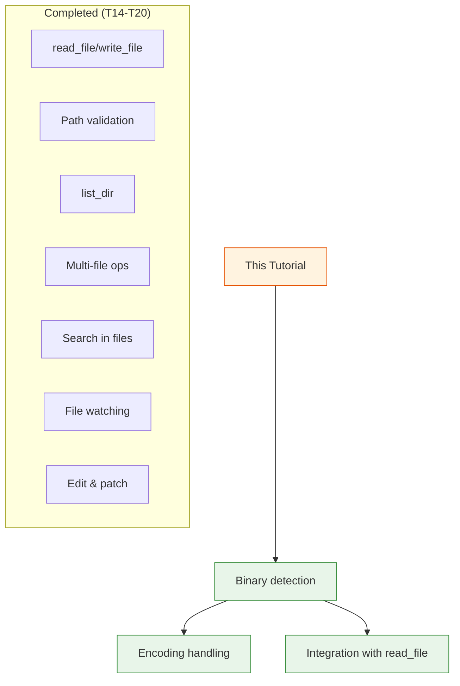

# Day 2, Tutorial 21: Binary File Detection

**Course:** Build Your Own Coding Agent  
**Day:** 2  
**Tutorial:** 21 of 60  
**Estimated Time:** 45 minutes

---

## 🎯 What You'll Learn

By the end of this tutorial, you'll:
- Detect binary vs. text files reliably
- Handle encoding detection for text files
- Build a `is_binary_file()` utility function
- Integrate binary detection into your file tools
- Prevent reading binary files as text (corruption)

---

## 🔄 Where We Left Off

In Tutorials 14-20, we built a comprehensive file operation suite:



---

## 🧠 Why Binary Detection Matters

**The Problem:**
```python
# Without detection:
content = read_file("image.png")  # Returns garbage!
content = read_file("document.pdf")  # Returns garbage!
search_in_file("*.txt", "query")  # Might crash on binary
```

**Real-world scenarios:**
- Agent tries to read a `.jpg` as text → corrupted display
- Search tool hits binary → gibberish results
- File diff on binary → meaningless output

**The Solution:**
- Detect binary files before reading
- Skip binary files in search operations
- Show appropriate message: "[Binary file]"

---

## 🔧 Implementation Strategy

### Approach 1: Null Byte Detection

```python
def is_binary_simple(file_path: str) -> bool:
    """Check if file is binary by looking for null bytes."""
    with open(file_path, 'rb') as f:
        chunk = f.read(1024)
        return b'\x00' in chunk
```

**Pros:** Simple, fast  
**Cons:** False positives on some text files with special characters

### Approach 2: Character Ratio (Chosen)

```python
def is_binary_file(file_path: str) -> bool:
    """
    Detect if a file is binary by checking the ratio of non-text characters.
    
    A file is considered binary if more than 30% of its characters
    are non-printable (outside 0x20-0x7E range, excluding common whitespace).
    """
    try:
        with open(file_path, 'rb') as f:
            chunk = f.read(8192)  # Sample first 8KB
            
        if not chunk:
            return False  # Empty file is text
            
        # Count non-text characters
        text_chars = set(range(32, 127)) | {9, 10, 13}  # Tab, LF, CR
        non_text = sum(1 for byte in chunk if byte not in text_chars)
        
        # If more than 30% non-text, consider it binary
        return (non_text / len(chunk)) > 0.30
        
    except Exception:
        return True  # Assume binary on error (safer)
```

**Why 30%?** Empirically derived — most text files have <1% non-printable chars, binary files have >50%.

---

## 💻 Complete Implementation

### Step 1: Add to `file_utils.py`

```python
# src/coding_agent/tools/file_utils.py

import os
from pathlib import Path
from typing import Union


def is_binary_file(file_path: Union[str, Path]) -> bool:
    """
    Detect if a file is binary by analyzing its content.
    
    Uses character frequency analysis: if more than 30% of characters
    are non-printable, the file is considered binary.
    
    Args:
        file_path: Path to the file to check
        
    Returns:
        True if binary, False if text
        
    Examples:
        >>> is_binary_file("README.md")
        False
        >>> is_binary_file("image.png")
        True
    """
    path = Path(file_path)
    
    if not path.exists():
        raise FileNotFoundError(f"File not found: {path}")
    
    if path.is_dir():
        raise IsADirectoryError(f"Path is directory: {path}")
    
    # Try to detect by reading first 8KB
    try:
        with open(path, 'rb') as f:
            chunk = f.read(8192)
            
        if not chunk:
            return False  # Empty file
            
        # Define text characters (printable ASCII + common whitespace)
        text_chars = set(range(32, 127))  # 0x20-0x7E
        text_chars.update({9, 10, 13})   # Tab, LF, CR
        
        # Count non-text bytes
        non_text_count = sum(1 for byte in chunk if byte not in text_chars)
        
        # Binary if >30% non-text characters
        return (non_text_count / len(chunk)) > 0.30
        
    except (IOError, OSError, PermissionError):
        # On permission errors, assume binary (safer)
        return True


def detect_encoding(file_path: Union[str, Path]) -> str:
    """
    Attempt to detect text file encoding.
    
    Tries UTF-8 first (most common), falls back to UTF-16,
    then latin-1 as last resort.
    
    Args:
        file_path: Path to the file
        
    Returns:
        Detected encoding name
        
    Raises:
        FileNotFoundError: If file doesn't exist
        ValueError: If file is binary
    """
    if is_binary_file(file_path):
        raise ValueError(f"Cannot detect encoding for binary file: {file_path}")
    
    path = Path(file_path)
    
    # Try encodings in order of likelihood
    encodings = ['utf-8', 'utf-8-sig', 'utf-16', 'latin-1', 'cp1252']
    
    for encoding in encodings:
        try:
            with open(path, 'r', encoding=encoding) as f:
                f.read()
            return encoding
        except (UnicodeDecodeError, UnicodeError):
            continue
    
    # If all fail, return latin-1 (never fails, may show garbage)
    return 'latin-1'


def get_file_info(file_path: Union[str, Path]) -> dict:
    """
    Get comprehensive file information.
    
    Returns metadata including size, type, encoding, etc.
    
    Args:
        file_path: Path to the file
        
    Returns:
        Dictionary with file metadata
    """
    path = Path(file_path)
    
    if not path.exists():
        raise FileNotFoundError(f"File not found: {path}")
    
    stat = path.stat()
    
    info = {
        'path': str(path),
        'size': stat.st_size,
        'is_binary': is_binary_file(path),
        'exists': True,
    }
    
    # Add encoding info for text files
    if not info['is_binary']:
        try:
            info['encoding'] = detect_encoding(path)
        except Exception:
            info['encoding'] = 'unknown'
    
    return info
```

---

### Step 2: Update `read_file` Tool

```python
# src/coding_agent/tools/read_file.py
# Update existing read_file function:

def read_file(file_path: str, limit: int = 100) -> str:
    """
    Read contents of a file.
    
    Args:
        file_path: Path to the file
        limit: Maximum number of lines to read (default 100)
        
    Returns:
        File contents as string, or "[Binary file]" for binary files
        
    Raises:
        FileNotFoundError: If file doesn't exist
        PermissionError: If no read permission
    """
    # Validate path (from T14)
    validate_path(file_path)
    
    path = Path(file_path)
    
    # Check if binary
    if is_binary_file(path):
        size = path.stat().st_size
        return f"[Binary file: {path.name} ({format_size(size)})]"
    
    # Detect encoding
    encoding = detect_encoding(path)
    
    # Read file
    with open(path, 'r', encoding=encoding) as f:
        lines = f.readlines()
    
    # Apply limit
    if limit and len(lines) > limit:
        lines = lines[:limit]
        lines.append(f"\n... ({len(lines) - limit} more lines)")
    
    return ''.join(lines)


def format_size(size_bytes: int) -> str:
    """Format byte size to human readable."""
    for unit in ['B', 'KB', 'MB', 'GB']:
        if size_bytes < 1024.0:
            return f"{size_bytes:.1f} {unit}"
        size_bytes /= 1024.0
    return f"{size_bytes:.1f} TB"
```

---

### Step 3: Update `search_in_files`

```python
# src/coding_agent/tools/search.py
# Update to skip binary files:

def search_in_files(
    pattern: str,
    path: str = ".",
    file_pattern: str = "*"
) -> list[dict]:
    """
    Search for pattern in files.
    
    Automatically skips binary files.
    """
    results = []
    search_path = Path(path)
    
    for file_path in search_path.rglob(file_pattern):
        if not file_path.is_file():
            continue
        
        # Skip binary files
        if is_binary_file(file_path):
            continue
        
        try:
            matches = search_in_file(file_path, pattern)
            if matches:
                results.extend(matches)
        except Exception:
            continue  # Skip files we can't read
    
    return results
```

---

### Step 4: Add Binary Detection Tool

```python
# src/coding_agent/tools/binary_check.py

from .base import BaseTool
from .file_utils import is_binary_file, get_file_info


class BinaryCheckTool(BaseTool):
    """Tool to check if a file is binary."""
    
    name = "check_binary"
    description = "Check if a file is binary or text, get file info"
    
    parameters = {
        "file_path": {
            "type": "string",
            "description": "Path to the file to check",
            "required": True
        }
    }
    
    def execute(self, file_path: str) -> str:
        """Check if file is binary and return info."""
        try:
            info = get_file_info(file_path)
            
            if info['is_binary']:
                return f"File '{file_path}' is BINARY ({format_size(info['size'])}). Cannot display contents."
            else:
                encoding_info = f" (encoding: {info.get('encoding', 'unknown')})" if 'encoding' in info else ""
                return f"File '{file_path}' is TEXT ({format_size(info['size'])}){encoding_info}. Safe to read."
                
        except FileNotFoundError:
            return f"Error: File not found: {file_path}"
        except Exception as e:
            return f"Error checking file: {e}"


def format_size(size: int) -> str:
    """Format size to human readable."""
    for unit in ['B', 'KB', 'MB', 'GB']:
        if size < 1024:
            return f"{size} {unit}"
        size //= 1024
    return f"{size} TB"
```

---

### Step 5: Register Tool

```python
# src/coding_agent/tools/__init__.py
# Add to tool registry:

from .binary_check import BinaryCheckTool

tool_registry.register(BinaryCheckTool())
```

---

## 🧪 Testing

```python
# tests/test_binary_detection.py

import pytest
import tempfile
from pathlib import Path
from coding_agent.tools.file_utils import is_binary_file, detect_encoding


class TestBinaryDetection:
    """Test binary file detection."""
    
    def test_text_file_detection(self):
        """Should detect Python file as text."""
        with tempfile.NamedTemporaryFile(mode='w', suffix='.py', delete=False) as f:
            f.write("# This is a Python file\n")
            f.write("print('Hello, World!')\n")
            temp_path = f.name
        
        try:
            assert is_binary_file(temp_path) is False
        finally:
            Path(temp_path).unlink()
    
    def test_binary_file_detection(self):
        """Should detect file with null bytes as binary."""
        with tempfile.NamedTemporaryFile(mode='wb', suffix='.bin', delete=False) as f:
            f.write(b'Hello\x00World\x00\x00\x00')
            temp_path = f.name
        
        try:
            assert is_binary_file(temp_path) is True
        finally:
            Path(temp_path).unlink()
    
    def test_empty_file(self):
        """Empty file should be considered text."""
        with tempfile.NamedTemporaryFile(mode='w', suffix='.txt', delete=False) as f:
            temp_path = f.name
        
        try:
            assert is_binary_file(temp_path) is False
        finally:
            Path(temp_path).unlink()
    
    def test_utf8_detection(self):
        """Should detect UTF-8 encoding."""
        with tempfile.NamedTemporaryFile(mode='w', suffix='.txt', 
                                         encoding='utf-8', delete=False) as f:
            f.write("Hello, 世界! 🌍\n")
            temp_path = f.name
        
        try:
            encoding = detect_encoding(temp_path)
            assert encoding in ['utf-8', 'utf-8-sig']
        finally:
            Path(temp_path).unlink()


class TestBinaryInReadFile:
    """Test that read_file handles binary files correctly."""
    
    def test_read_binary_shows_message(self):
        """Should show binary message, not try to read."""
        # This would need integration with actual read_file
        pass
```

---

## 🎯 Practice Exercise

**Task:** Enhance your file tools with binary detection

1. **Add binary detection to your codebase**
   - Implement `is_binary_file()` in `file_utils.py`
   - Add `detect_encoding()` helper

2. **Update `read_file`**
   - Skip reading binary files
   - Show "[Binary file: filename (size)]" instead

3. **Update `search_in_files`**
   - Automatically skip binary files
   - Don't try to search images, executables, etc.

4. **Test with real files**
   ```bash
   # Create test files
   echo "Hello, World!" > test.txt
   echo -e "Hello\x00World" > test.bin
   
   # Test your agent
   python -c "from coding_agent.tools.file_utils import is_binary_file; print(is_binary_file('test.txt')); print(is_binary_file('test.bin'))"
   ```

---

## 🔍 Common Pitfalls

### ❌ Reading binary as text
```python
# BAD: Try to read image as text
with open("photo.jpg", 'r') as f:  # Crashes or returns garbage
    content = f.read()
```

### ✅ Check first
```python
# GOOD: Check before reading
if is_binary_file("photo.jpg"):
    return "[Binary file]"
content = read_file("photo.jpg")
```

---

### ❌ False positives on special characters
```python
# BAD: Simple null byte check might miss some binary files
if b'\x00' in chunk:  # Some binary files don't have null bytes
```

### ✅ Character ratio approach
```python
# GOOD: Check ratio of non-printable characters
non_text_ratio = sum(1 for b in chunk if b not in text_chars) / len(chunk)
return non_text_ratio > 0.30
```

---

## 📝 Summary

| Concept | Implementation |
|---------|---------------|
| Binary detection | Character frequency analysis (30% threshold) |
| Text characters | 0x20-0x7E + tab, LF, CR |
| Sample size | First 8KB (performance vs accuracy tradeoff) |
| Encoding detection | Try UTF-8, UTF-16, latin-1 in order |
| Integration | Check in `read_file` and `search` |

---

## 🚀 Next Steps

[Tutorial 22: File Diff Preview](./day02-t22-file-diff-preview.md)

Now that we can detect binary files, we'll learn how to show differences between file versions — essential for code review workflows.

---

## 📚 Reference

- **Heuristic:** 30% non-printable = binary (empirical)
- **Sample size:** 8KB provides good accuracy without reading entire file
- **Fallback encoding:** latin-1 never fails, shows bytes directly

**Related:**
- [Tutorial 14: File Operations](./day02-t14-file-operations-read-and-write.md) — Foundation
- [Tutorial 18: Search](./day02-t18-search-pattern-matching.md) — Updated with binary skip