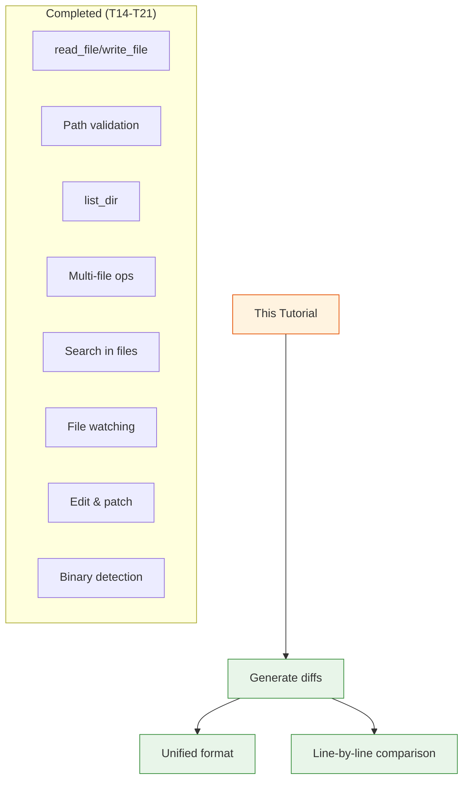

# Day 2, Tutorial 22: File Diff Preview

**Course:** Build Your Own Coding Agent  
**Day:** 2  
**Tutorial:** 22 of 60  
**Estimated Time:** 50 minutes

---

## 🎯 What You'll Learn

By the end of this tutorial, you'll:
- Generate unified diff format between file versions
- Compare files line-by-line with context
- Build a `diff_files()` utility function
- Show meaningful diffs for code reviews
- Handle large diffs with truncation

---

## 🔄 Where We Left Off

In Tutorials 14-21, we built a comprehensive file operation suite:



---

## 🧠 Why File Diff Matters

**Real-world scenarios:**
- Agent edits a file → "What changed?"
- Code review workflow → "Show me the diff"
- Undo changes → "Compare with original"
- Git integration → "What did I modify?"

**The Problem:** Simply showing old vs. new isn't helpful:
```
Old: def calculate(x, y): return x + y
New: def calculate(x, y, z=0): return x + y + z
```

**The Solution:** Unified diff format shows exactly what changed:
```diff
  def calculate(x, y):
+     z=0
      return x + y
+     + z
```

---

## 🔧 Implementation Strategy

### Unified Diff Format

The standard format (used by `git diff`, `diff -u`):

```diff
--- old_file.py
+++ new_file.py
@@ -1,5 +1,7 @@
  def hello():
-     print("Hello")
+     print("Hello, World!")
+     return 42
  
  def goodbye():
      print("Goodbye")
```

**Components:**
- `--- old_file` / `+++ new_file` — File markers
- `@@ -1,5 +1,7 @@` — Hunk header (old_start,old_lines new_start,new_lines)
- `-` — Removed line
- `+` — Added line
- ` ` — Unchanged line (context)

---

## 💻 Complete Implementation

### Step 1: Create `diff_utils.py`

```python
# src/coding_agent/tools/diff_utils.py

import difflib
from pathlib import Path
from typing import Union


def diff_files(
    old_path: Union[str, Path],
    new_path: Union[str, Path],
    context_lines: int = 3
) -> str:
    """
    Generate unified diff between two files.
    
    Args:
        old_path: Path to original file (or None for empty)
        new_path: Path to modified file
        context_lines: Number of context lines around changes (default 3)
        
    Returns:
        Unified diff as string
        
    Raises:
        FileNotFoundError: If files don't exist
        ValueError: If either file is binary
        
    Examples:
        >>> diff = diff_files("old.py", "new.py")
        >>> print(diff)
        --- old.py
        +++ new.py
        @@ -1,3 +1,4 @@
         def hello():
        -    print("Hi")
        +    print("Hello, World!")
        +    return 42
    """
    old_path = Path(old_path) if old_path else None
    new_path = Path(new_path) if new_path else None
    
    # Read old content (empty string if None)
    if old_path and old_path.exists():
        with open(old_path, 'r') as f:
            old_lines = f.readlines()
    else:
        old_lines = []
    
    # Read new content (empty string if None)
    if new_path and new_path.exists():
        with open(new_path, 'r') as f:
            new_lines = f.readlines()
    else:
        new_lines = []
    
    # Ensure lines end with newline for proper diff
    old_lines = [line if line.endswith('\n') else line + '\n' for line in old_lines]
    new_lines = [line if line.endswith('\n') else line + '\n' for line in new_lines]
    
    # Generate unified diff
    diff = difflib.unified_diff(
        old_lines,
        new_lines,
        fromfile=str(old_path) if old_path else "/dev/null",
        tofile=str(new_path) if new_path else "/dev/null",
        n=context_lines
    )
    
    return ''.join(diff)


def diff_strings(
    old_content: str,
    new_content: str,
    old_label: str = "old",
    new_label: str = "new",
    context_lines: int = 3
) -> str:
    """
    Generate unified diff between two strings.
    
    Useful for comparing content without writing to files.
    
    Args:
        old_content: Original content
        new_content: Modified content
        old_label: Label for old content
        new_label: Label for new content
        context_lines: Number of context lines
        
    Returns:
        Unified diff as string
        
    Example:
        >>> old = "line1\nline2\n"
        >>> new = "line1\nmodified\nline3\n"
        >>> print(diff_strings(old, new))
    """
    old_lines = old_content.splitlines(keepends=True)
    new_lines = new_content.splitlines(keepends=True)
    
    # Ensure newline at end
    if old_lines and not old_lines[-1].endswith('\n'):
        old_lines[-1] += '\n'
    if new_lines and not new_lines[-1].endswith('\n'):
        new_lines[-1] += '\n'
    
    diff = difflib.unified_diff(
        old_lines,
        new_lines,
        fromfile=old_label,
        tofile=new_label,
        n=context_lines
    )
    
    return ''.join(diff)


def show_diff_summary(diff_text: str, max_lines: int = 50) -> str:
    """
    Show diff with optional truncation for large changes.
    
    Args:
        diff_text: Full diff text
        max_lines: Maximum lines to show (0 = unlimited)
        
    Returns:
        Possibly truncated diff with summary
    """
    lines = diff_text.split('\n')
    
    if max_lines and len(lines) > max_lines:
        shown = '\n'.join(lines[:max_lines])
        omitted = len(lines) - max_lines
        return f"{shown}\n\n... ({omitted} more lines)\n"
    
    return diff_text


def has_changes(diff_text: str) -> bool:
    """Check if diff contains actual changes (not just identical)."""
    # Look for lines starting with + or - (excluding the +++ and --- headers)
    for line in diff_text.split('\n'):
        if line.startswith('+') and not line.startswith('+++'):
            return True
        if line.startswith('-') and not line.startswith('---'):
            return True
    return False


def count_changes(diff_text: str) -> dict:
    """
    Count additions and deletions in diff.
    
    Returns:
        Dict with 'additions', 'deletions', 'total'
    """
    additions = 0
    deletions = 0
    
    for line in diff_text.split('\n'):
        if line.startswith('+') and not line.startswith('+++'):
            additions += 1
        elif line.startswith('-') and not line.startswith('---'):
            deletions += 1
    
    return {
        'additions': additions,
        'deletions': deletions,
        'total': additions + deletions
    }
```

---

### Step 2: Create Diff Tool

```python
# src/coding_agent/tools/diff_tool.py

from .base import BaseTool
from .diff_utils import diff_files, show_diff_summary, count_changes
from pathlib import Path


class DiffTool(BaseTool):
    """Tool to show differences between files."""
    
    name = "diff_files"
    description = "Show unified diff between two files or file versions"
    
    parameters = {
        "old_path": {
            "type": "string",
            "description": "Path to original file (or 'none' for new file)",
            "required": True
        },
        "new_path": {
            "type": "string",
            "description": "Path to modified file",
            "required": True
        },
        "max_lines": {
            "type": "integer",
            "description": "Maximum lines to show (0 = unlimited)",
            "required": False
        }
    }
    
    def execute(
        self,
        old_path: str,
        new_path: str,
        max_lines: int = 0
    ) -> str:
        """Generate diff between two files."""
        try:
            # Handle special case: new file
            if old_path.lower() in ('none', 'null', ''):
                old_path = None
            
            # Generate diff
            diff = diff_files(old_path, new_path)
            
            if not diff:
                return f"Files are identical: {new_path}"
            
            # Apply limit if specified
            if max_lines and max_lines > 0:
                diff = show_diff_summary(diff, max_lines)
            
            # Add change summary
            stats = count_changes(diff)
            summary = f"Changes: +{stats['additions']}/-{stats['deletions']} lines\n"
            
            return summary + "\n" + diff
            
        except FileNotFoundError as e:
            return f"Error: File not found: {e}"
        except Exception as e:
            return f"Error generating diff: {e}"
```

---

### Step 3: Git-style Diff (Compare with backup)

```python
# src/coding_agent/tools/file_backup.py

import shutil
from datetime import datetime
from pathlib import Path


class FileBackup:
    """Manage file backups for diff/restore."""
    
    def __init__(self, backup_dir: str = ".agent_backups"):
        self.backup_dir = Path(backup_dir)
        self.backup_dir.mkdir(exist_ok=True)
    
    def create_backup(self, file_path: Union[str, Path]) -> Path:
        """
        Create timestamped backup of file.
        
        Returns:
            Path to backup file
        """
        path = Path(file_path)
        timestamp = datetime.now().strftime("%Y%m%d_%H%M%S")
        backup_name = f"{path.name}.{timestamp}.bak"
        backup_path = self.backup_dir / backup_name
        
        shutil.copy2(path, backup_path)
        return backup_path
    
    def get_last_backup(self, file_path: Union[str, Path]) -> Path | None:
        """Get most recent backup for file."""
        path = Path(file_path)
        backups = sorted(
            self.backup_dir.glob(f"{path.name}.*.bak"),
            key=lambda p: p.stat().st_mtime,
            reverse=True
        )
        return backups[0] if backups else None
    
    def diff_with_backup(self, file_path: Union[str, Path]) -> str:
        """Show diff between current file and last backup."""
        from .diff_utils import diff_files
        
        current = Path(file_path)
        backup = self.get_last_backup(current)
        
        if not backup:
            return f"No backup found for: {current}"
        
        return diff_files(backup, current)
```

---

### Step 4: Update Edit Tool with Diff Preview

```python
# src/coding_agent/tools/edit_file.py
# Add diff preview before applying changes:

from .diff_utils import diff_strings

def edit_file(
    file_path: str,
    old_string: str,
    new_string: str,
    preview: bool = False
) -> str:
    """
    Edit file by replacing old_string with new_string.
    
    Args:
        preview: If True, show diff but don't apply changes
    """
    path = Path(file_path)
    content = path.read_text()
    
    if old_string not in content:
        raise ValueError(f"old_string not found in file: {old_string[:50]}...")
    
    new_content = content.replace(old_string, new_string, 1)
    
    # Show diff if preview requested
    if preview:
        diff = diff_strings(content, new_content, 
                          old_label=f"{file_path} (current)",
                          new_label=f"{file_path} (after edit)")
        return f"Preview of changes:\n{diff}"
    
    # Apply changes
    path.write_text(new_content)
    return f"Successfully edited {file_path}"
```

---

## 🧪 Testing

```python
# tests/test_diff.py

import pytest
import tempfile
from pathlib import Path
from coding_agent.tools.diff_utils import (
    diff_files, 
    diff_strings, 
    count_changes,
    has_changes
)


class TestDiffUtils:
    """Test diff generation."""
    
    def test_diff_identical_files(self):
        """Diff of identical files should be empty."""
        with tempfile.NamedTemporaryFile(mode='w', suffix='.py', delete=False) as f:
            f.write("hello\nworld\n")
            path = f.name
        
        try:
            diff = diff_files(path, path)
            assert diff == ""
            assert not has_changes(diff)
        finally:
            Path(path).unlink()
    
    def test_diff_addition(self):
        """Should detect added lines."""
        old = "line1\nline2\n"
        new = "line1\nline2\nline3\n"
        
        diff = diff_strings(old, new)
        
        assert '+line3' in diff
        assert has_changes(diff)
        
        stats = count_changes(diff)
        assert stats['additions'] == 1
        assert stats['deletions'] == 0
    
    def test_diff_deletion(self):
        """Should detect deleted lines."""
        old = "line1\nline2\nline3\n"
        new = "line1\nline3\n"
        
        diff = diff_strings(old, new)
        
        assert '-line2' in diff
        assert has_changes(diff)
    
    def test_diff_modification(self):
        """Should detect modified lines."""
        old = "def hello():\n    print('hi')\n"
        new = "def hello():\n    print('hello')\n"
        
        diff = diff_strings(old, new)
        
        assert "-    print('hi')" in diff
        assert "+    print('hello')" in diff
        assert has_changes(diff)


class TestDiffIntegration:
    """Integration tests with actual files."""
    
    def test_diff_between_files(self, tmp_path):
        """Generate diff between two real files."""
        old_file = tmp_path / "old.py"
        new_file = tmp_path / "new.py"
        
        old_file.write_text("def add(x, y):\n    return x + y\n")
        new_file.write_text("def add(x, y, z=0):\n    return x + y + z\n")
        
        diff = diff_files(old_file, new_file)
        
        assert "---" in diff
        assert "+++" in new_file.name
        assert "+    z=0" in diff or "+    return x + y + z" in diff
```

---

## 🎯 Practice Exercise

**Task:** Add diff preview to your file editing workflow

1. **Create `diff_utils.py`**
   - Implement `diff_files()` using `difflib`
   - Implement `diff_strings()` for in-memory comparison

2. **Add `preview` flag to `edit_file`**
   - Before applying changes, show diff
   - Let user confirm: "Apply these changes?"

3. **Test with real files**
   ```python
   # Create test files
   echo "def old(): pass" > test_old.py
   echo "def new(): return 42" > test_new.py
   
   # Generate diff
   from coding_agent.tools.diff_utils import diff_files
   print(diff_files("test_old.py", "test_new.py"))
   ```

4. **Add to agent workflow**
   - When agent edits a file, automatically show diff
   - "I made these changes to main.py:" [diff]

---

## 🔍 Common Pitfalls

### ❌ Missing newlines in diff
```python
# BAD: Split without preserving newlines
lines = content.split('\n')  # Loses newlines
```

### ✅ Keep newlines
```python
# GOOD: Preserve newlines for proper diff
lines = content.splitlines(keepends=True)
```

---

### ❌ Empty diff on identical files
```python
# BAD: Not checking if files differ
if diff == "":
    return "Error"  # Should report "identical"
```

### ✅ Handle identical files
```python
# GOOD: Explicit check
if not has_changes(diff):
    return "Files are identical"
```

---

## 📝 Summary

| Concept | Implementation |
|---------|---------------|
| Unified diff | `difflib.unified_diff()` |
| Context lines | `n=3` parameter |
| Line endings | Preserve with `keepends=True` |
| Change detection | Look for `+`/`-` lines |
| Stats | Count `+` and `-` lines |

---

## 🚀 Next Steps

[Tutorial 23: Execute Code Tool](./day02-t23-execute-code.md)

Now we'll add a tool that executes Python code snippets — useful for quick calculations, data processing, or testing small code blocks.

---

## 📚 Reference

- **Unified Diff Format:** https://www.gnu.org/software/diffutils/manual/html_node/Unified-Format.html
- **Python difflib:** https://docs.python.org/3/library/difflib.html
- **Git diff:** `git diff --unified`

**Related:**
- [Tutorial 20: File Editing](./day02-t20-file-editing-patching.md) — Uses diff for preview
- [Tutorial 18: Git Integration](./day02-t18-git-integration-read-only.md) — Could show git diff