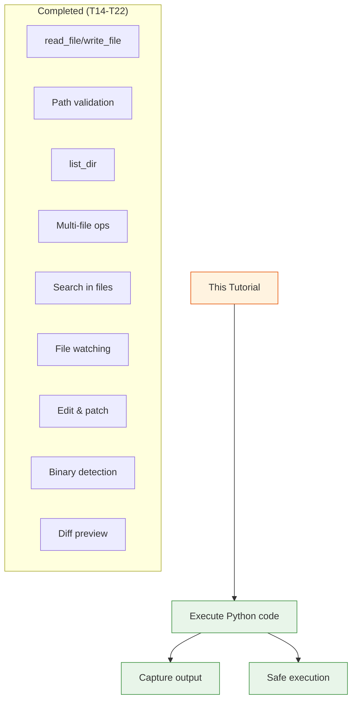

# Day 2, Tutorial 23: Execute Code Tool

**Course:** Build Your Own Coding Agent  
**Day:** 2  
**Tutorial:** 23 of 60  
**Estimated Time:** 50 minutes

---

## 🎯 What You'll Learn

By the end of this tutorial, you'll:
- Build an `execute_code` tool for running Python one-liners
- Execute code safely in a restricted environment
- Capture stdout, stderr, and return values
- Handle execution timeouts and errors
- Integrate code execution with your agent's tool system

---

## 🔄 Where We Left Off

In Tutorials 14-22, we built a comprehensive file operation suite:



---

## 🧠 Why Execute Code?

**Real-world scenarios:**
- Quick calculations: "What's 2**100?"
- Data processing: "Parse this JSON and extract keys"
- File analysis: "Count lines in these files"
- String manipulation: "Generate a UUID"
- Testing: "Verify this regex works"

**The Problem:** Without code execution, agent is limited:
```
User: "Calculate the factorial of 20"
Agent: "I don't have a calculator tool..."
```

**The Solution:** Python one-liners give the agent a calculator, data processor, and more.

---

## 🔧 Implementation Strategy

### Safety First

**DANGEROUS (don't do this):**
```python
# NEVER: Direct eval/exec
result = eval(user_code)  # Can execute ANYTHING!
```

**SAFE (what we'll build):**
```python
# RESTRICTED: Limited builtins, timeout, no filesystem
result = execute_code("2**100", timeout=5)
```

### Security Measures

1. **Restricted globals** — Only safe builtins
2. **Timeout** — Kill long-running code
3. **No file system** — Can't read/write files
4. **No network** — Can't make HTTP calls
5. **Memory limits** — Prevent memory exhaustion

---

## 💻 Complete Implementation

### Step 1: Create `execute_code.py`

```python
# src/coding_agent/tools/execute_code.py

import ast
import signal
import sys
import traceback
from io import StringIO
from typing import Any
from contextlib import redirect_stdout, redirect_stderr

from .base import BaseTool


class TimeoutError(Exception):
    """Raised when code execution times out."""
    pass


def timeout_handler(signum, frame):
    """Signal handler for timeout."""
    raise TimeoutError("Code execution timed out")


class ExecuteCodeTool(BaseTool):
    """
    Tool to execute Python code safely.
    
    Executes Python one-liners in a restricted environment
    with timeout protection and output capture.
    """
    
    name = "execute_code"
    description = "Execute Python code and return the result"
    
    parameters = {
        "code": {
            "type": "string",
            "description": "Python code to execute (one-liner or short script)",
            "required": True
        },
        "timeout": {
            "type": "integer",
            "description": "Maximum execution time in seconds (default 5)",
            "required": False
        }
    }
    
    def __init__(self, default_timeout: int = 5):
        super().__init__()
        self.default_timeout = default_timeout
    
    def execute(self, code: str, timeout: int = None) -> str:
        """
        Execute Python code safely.
        
        Args:
            code: Python code to execute
            timeout: Maximum execution time in seconds
            
        Returns:
            Execution result with stdout, stderr, and return value
            
        Example:
            >>> execute_code("2**100")
            '1267650600228229401496703205376'
            
            >>> execute_code("import json; json.dumps({'key': 'value'})")
            '{"key": "value"}'
        """
        timeout = timeout or self.default_timeout
        
        # Safety: Validate code syntax first
        try:
            ast.parse(code)
        except SyntaxError as e:
            return f"SyntaxError: {e}"
        
        # Safety: Check for dangerous constructs
        safety_check = self._check_code_safety(code)
        if safety_check:
            return f"SecurityError: {safety_check}"
        
        # Execute with timeout
        try:
            result = self._execute_with_timeout(code, timeout)
            return result
        except TimeoutError:
            return f"Error: Code execution timed out after {timeout} seconds"
        except Exception as e:
            return f"Error: {type(e).__name__}: {str(e)}"
    
    def _check_code_safety(self, code: str) -> str | None:
        """
        Check code for potentially dangerous operations.
        
        Returns error message if unsafe, None if safe.
        """
        # Parse AST
        try:
            tree = ast.parse(code)
        except SyntaxError:
            return None  # Already handled
        
        # Check for dangerous imports/attributes
        dangerous = {
            '__import__', 'eval', 'exec', 'compile',
            'open', 'file', 'input', 'raw_input',
            'os.', 'sys.', 'subprocess.', 'socket.',
            'urllib', 'http', 'ftp', 'ftplib',
            'pickle', 'marshal', 'ctypes'
        }
        
        for node in ast.walk(tree):
            # Check for dangerous names
            if isinstance(node, ast.Name):
                if node.id in dangerous:
                    return f"Forbidden name: {node.id}"
            
            # Check for dangerous attributes
            if isinstance(node, ast.Attribute):
                for d in dangerous:
                    if node.attr.startswith(d.split('.')[-1]):
                        return f"Forbidden attribute: {node.attr}"
            
            # Check for dangerous imports
            if isinstance(node, ast.Import):
                for alias in node.names:
                    if any(alias.name.startswith(d.rstrip('.')) for d in dangerous):
                        return f"Forbidden import: {alias.name}"
            
            if isinstance(node, ast.ImportFrom):
                if any(node.module.startswith(d.rstrip('.')) for d in dangerous):
                    return f"Forbidden import: {node.module}"
        
        return None  # Safe
    
    def _execute_with_timeout(self, code: str, timeout: int) -> str:
        """Execute code with timeout protection."""
        # Set up timeout
        old_handler = signal.signal(signal.SIGALRM, timeout_handler)
        signal.alarm(timeout)
        
        try:
            result = self._execute_code(code)
        finally:
            signal.alarm(0)  # Cancel alarm
            signal.signal(signal.SIGALRM, old_handler)
        
        return result
    
    def _execute_code(self, code: str) -> str:
        """Execute code in restricted environment."""
        # Capture stdout and stderr
        stdout_capture = StringIO()
        stderr_capture = StringIO()
        
        # Restricted globals
        safe_globals = {
            '__builtins__': {
                'abs': abs, 'all': all, 'any': any,
                'bin': bin, 'bool': bool, 'bytearray': bytearray,
                'bytes': bytes, 'chr': chr, 'complex': complex,
                'dict': dict, 'divmod': divmod, 'enumerate': enumerate,
                'filter': filter, 'float': float, 'format': format,
                'frozenset': frozenset, 'hasattr': hasattr,
                'hash': hash, 'hex': hex, 'id': id,
                'int': int, 'isinstance': isinstance,
                'issubclass': issubclass, 'iter': iter,
                'len': len, 'list': list, 'map': map,
                'max': max, 'min': min, 'next': next,
                'oct': oct, 'ord': ord, 'pow': pow,
                'print': print, 'range': range, 'repr': repr,
                'reversed': reversed, 'round': round,
                'set': set, 'slice': slice, 'sorted': sorted,
                'str': str, 'sum': sum, 'tuple': tuple,
                'type': type, 'zip': zip,
                # Safe modules
                'json': __import__('json'),
                'math': __import__('math'),
                'random': __import__('random'),
                're': __import__('re'),
                'datetime': __import__('datetime'),
                'itertools': __import__('itertools'),
                'collections': __import__('collections'),
            }
        }
        
        safe_locals = {}
        
        try:
            with redirect_stdout(stdout_capture), redirect_stderr(stderr_capture):
                # Execute code
                exec(compile(code, '<string>', 'exec'), safe_globals, safe_locals)
            
            # Get last expression value if any
            last_value = None
            if safe_locals:
                last_value = list(safe_locals.values())[-1]
            
            # Build result
            result_parts = []
            
            stdout = stdout_capture.getvalue()
            stderr = stderr_capture.getvalue()
            
            if stdout:
                result_parts.append(f"stdout:\n{stdout}")
            
            if stderr:
                result_parts.append(f"stderr:\n{stderr}")
            
            if last_value is not None and not stdout:
                result_parts.append(f"Result: {repr(last_value)}")
            
            return '\n'.join(result_parts) if result_parts else "(no output)"
            
        except Exception as e:
            error_msg = f"{type(e).__name__}: {str(e)}\n"
            error_msg += traceback.format_exc()
            return error_msg


# Register tool
from .registry import tool_registry
tool_registry.register(ExecuteCodeTool())
```

---

### Step 2: Update Tool Registry

```python
# src/coding_agent/tools/__init__.py

from .execute_code import ExecuteCodeTool

__all__ = [
    # ... other tools ...
    'ExecuteCodeTool',
]
```

---

## 🧪 Testing

```python
# tests/test_execute_code.py

import pytest
from coding_agent.tools.execute_code import ExecuteCodeTool


class TestExecuteCodeTool:
    """Test code execution."""
    
    def test_simple_calculation(self):
        """Should execute simple math."""
        tool = ExecuteCodeTool()
        result = tool.execute("2 + 2")
        assert "4" in result
    
    def test_power_operation(self):
        """Should handle large numbers."""
        tool = ExecuteCodeTool()
        result = tool.execute("2**100")
        assert "1267650600228229401496703205376" in result
    
    def test_json_processing(self):
        """Should process JSON."""
        tool = ExecuteCodeTool()
        result = tool.execute("import json; json.dumps({'key': 'value'})")
        assert '"key"' in result
    
    def test_list_operations(self):
        """Should work with lists."""
        tool = ExecuteCodeTool()
        result = tool.execute("[x*2 for x in range(5)]")
        assert "[0, 2, 4, 6, 8]" in result
    
    def test_math_module(self):
        """Should have access to math module."""
        tool = ExecuteCodeTool()
        result = tool.execute("import math; math.sqrt(16)")
        assert "4.0" in result or "4" in result
    
    def test_string_operations(self):
        """Should handle string operations."""
        tool = ExecuteCodeTool()
        result = tool.execute("'hello'.upper()")
        assert "HELLO" in result
    
    def test_forbidden_import(self):
        """Should block dangerous imports."""
        tool = ExecuteCodeTool()
        result = tool.execute("import os")
        assert "SecurityError" in result or "Forbidden" in result
    
    def test_forbidden_eval(self):
        """Should block eval."""
        tool = ExecuteCodeTool()
        result = tool.execute("eval('1+1')")
        assert "SecurityError" in result or "Forbidden" in result
    
    def test_forbidden_open(self):
        """Should block file operations."""
        tool = ExecuteCodeTool()
        result = tool.execute("open('test.txt')")
        assert "SecurityError" in result or "Forbidden" in result
    
    def test_syntax_error(self):
        """Should handle syntax errors gracefully."""
        tool = ExecuteCodeTool()
        result = tool.execute("if True")  # Incomplete
        assert "SyntaxError" in result
    
    def test_timeout(self):
        """Should timeout long-running code."""
        tool = ExecuteCodeTool(default_timeout=1)
        result = tool.execute("while True: pass")
        assert "timed out" in result
```

---

## 🎯 Practice Exercise

**Task:** Add execute_code tool to your agent

1. **Create `execute_code.py`**
   - Implement safety checks
   - Add restricted globals
   - Handle timeout

2. **Test with safe code**
   ```python
   from coding_agent.tools.execute_code import ExecuteCodeTool
   
   tool = ExecuteCodeTool()
   
   # Test calculations
   print(tool.execute("2**100"))
   
   # Test JSON
   print(tool.execute("import json; json.dumps({'name': 'test'})"))
   
   # Test list comprehension
   print(tool.execute("[x**2 for x in range(10)]"))
   ```

3. **Verify security**
   ```python
   # Should be blocked
   print(tool.execute("import os"))  # SecurityError
   print(tool.execute("open('secret.txt')"))  # SecurityError
   ```

4. **Integrate with agent**
   - Add to ToolRegistry
   - Test: "Calculate fibonacci(10)"

---

## 🔍 Common Pitfalls

### ❌ Unlimited execution
```python
# BAD: No timeout
exec(user_code)  # Runs forever if infinite loop
```

### ✅ Timeout protection
```python
# GOOD: Kill after timeout
signal.alarm(timeout)
exec(user_code)
signal.alarm(0)
```

---

### ❌ Full builtins
```python
# BAD: All builtins available
exec(code, {'__builtins__': __builtins__})
# User can call open(), eval(), etc.
```

### ✅ Restricted builtins
```python
# GOOD: Only safe functions
safe_builtins = {'abs': abs, 'len': len, ...}
exec(code, {'__builtins__': safe_builtins})
```

---

### ❌ No output capture
```python
# BAD: Can't see results
result = exec(code)  # Returns None
```

### ✅ Capture output
```python
# GOOD: Capture stdout
from io import StringIO
with redirect_stdout(StringIO()) as f:
    exec(code)
output = f.getvalue()
```

---

## 📝 Summary

| Feature | Implementation |
|---------|---------------|
| Safety | AST parsing + forbidden list |
| Timeout | signal.alarm() |
| Restricted env | Limited __builtins__ |
| Output capture | StringIO redirect |
| Safe modules | json, math, random, re, datetime |
| Forbidden | os, sys, open, eval, exec, network |

---

## 🚀 Next Steps

[Tutorial 24: Day 2 Capstone - Complete File Operations](./day02-t24-day-2-capstone-file-operations-complete.md)

Now we'll do a comprehensive review and hands-on exercise with all Day 2 tools.

---

## 📚 Reference

- **AST module:** https://docs.python.org/3/library/ast.html
- **StringIO:** https://docs.python.org/3/library/io.html
- **Signal:** https://docs.python.org/3/library/signal.html

**Related:**
- [Tutorial 6: Tool System](./day01-t06-tool-system-base-class.md) — BaseTool pattern
- [Tutorial 22: File Diff](./day02-t22-file-diff-preview.md) — Can diff code output