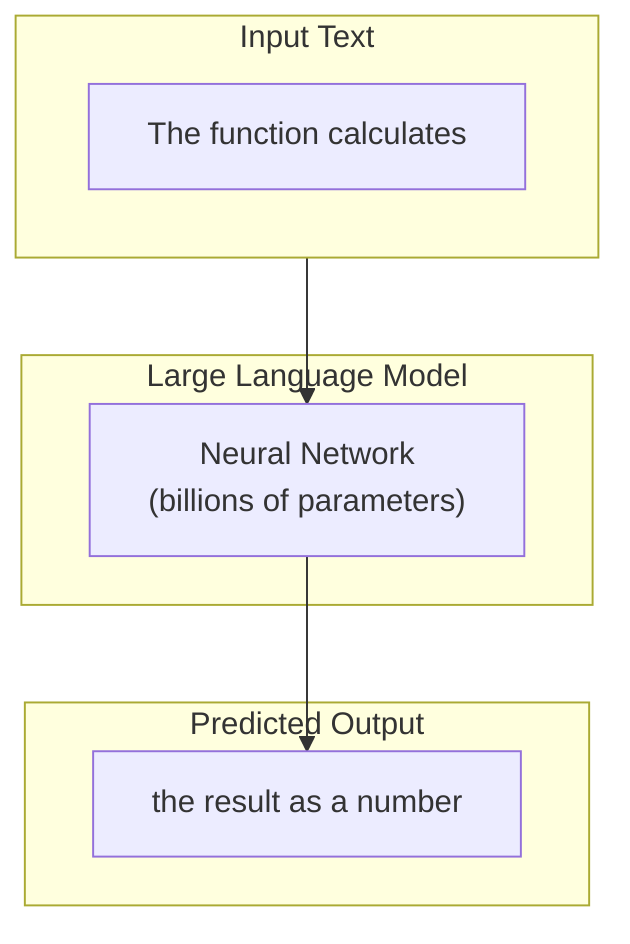
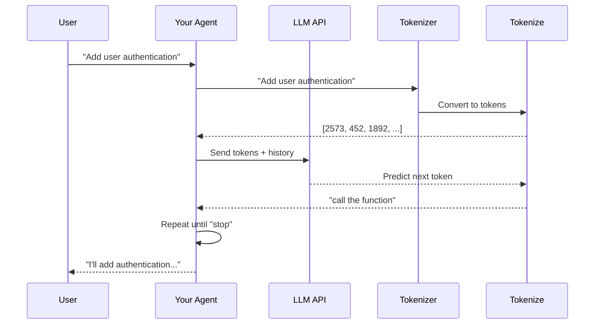
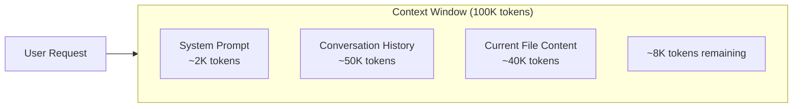

# Day 2, Tutorial 25: What is an LLM? (Brief, Practical)

**Course:** Build Your Own Coding Agent  
**Day:** 2  
**Tutorial:** 25 of 288  
**Estimated Time:** 45 minutes

---

## 🎯 What You'll Learn

By the end of this tutorial, you'll understand:
- What a Large Language Model (LLM) actually is and how it works at a practical level
- The difference between traditional programming and LLM-based programming
- How tokens and context windows limit what LLMs can do
- Why LLMs are the "brain" of our coding agent
- How to think about LLMs as APIs rather than magic

---

## 🧩 Understanding LLMs: Not Magic, Just Math

Before we write any code, let's build a mental model of what an LLM actually is.

### The Core Idea

An LLM (Large Language Model) is, at its essence, a **statistical prediction engine**. Given some text, it predicts what comes next.



**Wait, that's it?** Yes. It's autocomplete on steroids. But the magic comes from:

1. **Scale** - Billions of parameters = patterns humans can't manually program
2. **Training** - Seen trillions of words = understands language structure
3. **Emergence** - At scale, it exhibits "reasoning" without being explicitly taught

---

## 🧠 How It Works: The Prediction Chain

When you send a message to an LLM, here's what happens:



### Step-by-Step Breakdown

1. **Tokenization** - Your text is broken into "tokens" (word pieces)
2. **Embedding** - Each token becomes a vector of numbers
3. **Attention** - The model figures out which parts of input relate to each other
4. **Prediction** - For each position, predict the most likely next token
5. **Decoding** - Convert predictions back to readable text

---

## 📊 Tokens: The Currency of LLMs

Understanding tokens is crucial because **everything** in LLM land revolves around them.

### What Are Tokens?

Tokens are not quite words, not quite characters. They're subword units:

```
"The coding agent" → ["The", " coding", " agent"] → [2573, 452, 1892]
```

- Average: 1 token ≈ 4 characters ≈ ¾ of a word
- Common words: 1 token = 1 word
- Rare words: 1 token = parts of words

### Why Tokens Matter

```python
# Rough token estimation
def estimate_tokens(text: str) -> int:
    """Estimate tokens (rough rule of thumb: 4 chars per token)."""
    return len(text) // 4

# Examples
print(estimate_tokens("Hello, world!"))  # ~4 tokens
print(estimate_tokens("def authenticate_user(username, password):"))  # ~10 tokens
print(estimate_tokens("" * 500))  # ~125 tokens
```

### Context Windows: The Hard Limit

Every LLM has a maximum context window - the total tokens it can handle at once:

| Model | Context Window |
|-------|----------------|
| GPT-4 | 128K tokens (~100K words) |
| Claude 3.5 | 200K tokens (~150K words) |
| GPT-3.5 | 16K tokens (~12K words) |
| Ollama (local) | Varies (4K-128K) |

**This is why context management is one of the hardest problems in agent development.**



If your conversation + file contents exceed this limit, you have problems:
- Truncation (losing history)
- Confusion (model loses track)
- Cost increase (more tokens = more money)

---

## 💡 LLMs in Our Agent: The Brain

In our coding agent architecture, the LLM is the **brain** that:

1. **Understands** - Reads user requests and code
2. **Reasons** - Plans how to solve problems
3. **Decides** - Chooses which tools to use
4. **Generates** - Writes code and explanations

```mermaid
flowchart TB
    subgraph Agent["Our Coding Agent"]
        subgraph Brain["LLM (Brain)"]
            A[Understands Request]
            B[Plans Solution]
            C[Decides Actions]
            D[Generates Response]
        end
        
        subgraph Body["Other Components"]
            E[Tools (Hands)]
            F[Context (Memory)]
            G[Config (Settings)]
        end
    end
    
    User --> Agent
    Agent --> Actions
    Actions --> User
    
    Brain <--> Body
```

---

## 🛠️ Code Integration: Connecting Our Skeleton

Now let's integrate the LLM concept into the skeleton we built in Day 1.

### Updated Project Structure for Day 2

```
src/coding_agent/
├── __init__.py
├── agent.py           # Still the main class
├── config.py          # LLM config included
├── exceptions.py
├── llm/
│   ├── __init__.py
│   ├── client.py      # LLMClient interface
│   ├── anthropic.py    # Anthropic implementation
│   ├── openai.py      # OpenAI implementation  
│   └── factory.py     # Client factory
├── tools/
│   └── ...
└── context/
    └── ...
```

### Using the LLM in Our Agent

From Day 1, we already have the `LLMClient` interface. Now we need an implementation:

```python
# src/coding_agent/llm/anthropic.py
"""
Anthropic Claude client implementation.

This connects our agent to Claude via the Anthropic API.
"""

from typing import List, Dict, Any, Optional
import os
import json
import logging

from coding_agent.llm.client import LLMClient, LLMResponse, Message
from coding_agent.exceptions import LLMError

logger = logging.getLogger(__name__)


class AnthropicClient(LLMClient):
    """
    Client for Anthropic's Claude API.
    
    This implementation follows the LLMClient interface we defined
    in Day 1, using the Anthropic SDK to make actual API calls.
    
    Why Anthropic?
    - Large context windows (200K tokens)
    - Excellent coding capabilities
    - Tool calling support
    - Competitive pricing
    
    Alternative: See openai.py for OpenAI implementation.
    """
    
    def __init__(
        self,
        api_key: str,
        model: str = "claude-3-5-sonnet-20241022",
        temperature: float = 0.7,
        max_tokens: int = 4096,
        timeout: int = 60,
        max_retries: int = 3,
    ):
        """
        Initialize the Anthropic client.
        
        Args:
            api_key: Anthropic API key
            model: Model identifier (claude-3-5-sonnet-20241022, etc.)
            temperature: Sampling temperature (0-2)
            max_tokens: Maximum tokens to generate
            timeout: Request timeout in seconds
            max_retries: Number of retry attempts for failures
        """
        super().__init__(
            api_key=api_key,
            model=model,
            temperature=temperature,
            max_tokens=max_tokens,
            timeout=timeout,
        )
        
        self.max_retries = max_retries
        
        # Lazy import - only load when needed
        try:
            import anthropic
            self._client = anthropic.Anthropic(
                api_key=api_key,
                timeout=timeout,
            )
            logger.info(f"Anthropic client initialized with model {model}")
        except ImportError:
            raise LLMError(
                "anthropic package not installed. Run: pip install anthropic"
            )
    
    def _call_api(
        self,
        messages: List[Message],
        params: Dict[str, Any]
    ) -> LLMResponse:
        """
        Make the actual Anthropic API call.
        
        This overrides the abstract method from LLMClient.
        
        Args:
            messages: List of conversation messages
            params: Generation parameters
            
        Returns:
            LLMResponse with the model's response
        """
        # Convert our Message objects to Anthropic format
        anthropic_messages = []
        
        for msg in messages:
            if msg.role == "system":
                # System messages handled separately
                continue
            
            content = msg.content
            
            # Handle tool calls if present
            if msg.tool_calls:
                tool_calls = []
                for tc in msg.tool_calls:
                    tool_calls.append({
                        "type": "tool_use",
                        "id": tc.get("id", "pending"),
                        "name": tc.get("function", {}).get("name", ""),
                        "input": tc.get("function", {}).get("arguments", {}),
                    })
                content = [{"type": "text", "text": content}]
                # Note: Tool calls would be added here in full implementation
            
            anthropic_messages.append({
                "role": msg.role,
                "content": content
            })
        
        # Build API request
        request_params = {
            "model": self.model,
            "max_tokens": params.get("max_tokens", self.max_tokens),
            "temperature": params.get("temperature", self.temperature),
            "messages": anthropic_messages,
        }
        
        # Add top_p if specified
        if "top_p" in params:
            request_params["top_p"] = params["top_p"]
        
        logger.debug(f"Anthropic API request: {request_params['model']}")
        
        try:
            response = self._client.messages.create(**request_params)
            
            # Extract response content
            content = ""
            for block in response.content:
                if hasattr(block, 'text'):
                    content += block.text
            
            # Extract usage info
            usage = {
                "prompt": response.usage.input_tokens,
                "completion": response.usage.output_tokens,
                "total": response.usage.input_tokens + response.usage.output_tokens,
            }
            
            return LLMResponse(
                content=content,
                model=response.model,
                usage=usage,
                finish_reason=response.stop_reason or "unknown",
                raw_response={
                    "id": response.id,
                    "model": response.model,
                    "version": response.id,
                }
            )
            
        except Exception as e:
            logger.error(f"Anthropic API error: {e}")
            raise LLMError(f"API call failed: {e}") from e
    
    def __repr__(self) -> str:
        return f"AnthropicClient(model={self.model})"


# src/coding_agent/llm/openai.py
"""
OpenAI GPT client implementation.

Alternative client using OpenAI's API.
"""

from typing import List, Dict, Any
import logging

from coding_agent.llm.client import LLMClient, LLMResponse, Message
from coding_agent.exceptions import LLMError

logger = logging.getLogger(__name__)


class OpenAIClient(LLMClient):
    """
    Client for OpenAI's GPT API.
    
    Why OpenAI?
    - First mover in LLM space
    - Excellent GPT-4 capabilities
    - Wide ecosystem support
    
    Note: Pricing is per-token, check OpenAI pricing page.
    """
    
    def __init__(
        self,
        api_key: str,
        model: str = "gpt-4-turbo-preview",
        temperature: float = 0.7,
        max_tokens: int = 4096,
        timeout: int = 60,
    ):
        super().__init__(
            api_key=api_key,
            model=model,
            temperature=temperature,
            max_tokens=max_tokens,
            timeout=timeout,
        )
        
        try:
            from openai import OpenAI
            self._client = OpenAI(api_key=api_key, timeout=timeout)
            logger.info(f"OpenAI client initialized with model {model}")
        except ImportError:
            raise LLMError(
                "openai package not installed. Run: pip install openai"
            )
    
    def _call_api(
        self,
        messages: List[Message],
        params: Dict[str, Any]
    ) -> LLMResponse:
        """Make the OpenAI API call."""
        # Convert messages to OpenAI format
        openai_messages = []
        for msg in messages:
            msg_dict = {"role": msg.role, "content": msg.content}
            
            # Handle tool calls
            if msg.tool_calls:
                msg_dict["tool_calls"] = [
                    {
                        "id": tc.get("id", ""),
                        "type": "function",
                        "function": {
                            "name": tc.get("function", {}).get("name", ""),
                            "arguments": str(tc.get("function", {}).get("arguments", {}))
                        }
                    }
                    for tc in msg.tool_calls
                ]
            
            if msg.tool_call_id:
                msg_dict["tool_call_id"] = msg.tool_call_id
            
            openai_messages.append(msg_dict)
        
        try:
            response = self._client.chat.completions.create(
                model=self.model,
                messages=openai_messages,
                temperature=params.get("temperature", self.temperature),
                max_tokens=params.get("max_tokens", self.max_tokens),
                top_p=params.get("top_p"),
            )
            
            choice = response.choices[0]
            content = choice.message.content or ""
            
            usage = {
                "prompt": response.usage.prompt_tokens,
                "completion": response.usage.completion_tokens,
                "total": response.usage.total_tokens,
            }
            
            return LLMResponse(
                content=content,
                model=response.model,
                usage=usage,
                finish_reason=choice.finish_reason or "unknown",
                raw_response=response.model_dump(),
            )
            
        except Exception as e:
            logger.error(f"OpenAI API error: {e}")
            raise LLMError(f"API call failed: {e}") from e
    
    def __repr__(self) -> str:
        return f"OpenAIClient(model={self.model})"
```

---

## 🧪 Test It: Making Your First LLM Call

Let's verify everything works by making a test call:

```python
# test_llm_client.py
import sys
from pathlib import Path

# Add src to path
sys.path.insert(0, str(Path(__file__).parent / "src"))

from coding_agent.llm.factory import create_llm_client
from coding_agent.config import LLMConfig
from coding_agent.llm.client import Message


def test_anthropic():
    """Test the Anthropic client."""
    print("=" * 50)
    print("Testing Anthropic Client")
    print("=" * 50)
    
    # Create config (will use ANTHROPIC_API_KEY env var)
    try:
        config = LLMConfig(provider="anthropic", model="claude-3-5-sonnet-20241022")
    except ValueError as e:
        print(f"❌ Configuration error: {e}")
        print("   Set ANTHROPIC_API_KEY environment variable")
        return False
    
    # Create client
    try:
        client = create_llm_client(config)
        print(f"✓ Created client: {client}")
    except Exception as e:
        print(f"❌ Failed to create client: {e}")
        return False
    
    # Make a simple call
    messages = [
        Message(role="user", content="Say 'Hello from Claude' in exactly those words.")
    ]
    
    try:
        print("\n📡 Making API call...")
        response = client.complete(messages)
        
        print(f"\n✓ Success!")
        print(f"   Model: {response.model}")
        print(f"   Input tokens: {response.input_tokens}")
        print(f"   Output tokens: {response.output_tokens}")
        print(f"   Finish reason: {response.finish_reason}")
        print(f"\n   Response: {response.content}")
        
        return True
        
    except Exception as e:
        print(f"❌ API call failed: {e}")
        return False


def test_openai():
    """Test the OpenAI client."""
    print("\n" + "=" * 50)
    print("Testing OpenAI Client")
    print("=" * 50)
    
    # This will fail without OPENAI_API_KEY, but shows the structure
    try:
        config = LLMConfig(provider="openai", model="gpt-4-turbo-preview")
        client = create_llm_client(config)
        print(f"✓ Created client: {client}")
    except ValueError as e:
        print(f"⏭️  Skipping (no API key): {e}")
    except Exception as e:
        print(f"❌ Error: {e}")


if __name__ == "__main__":
    success = test_anthropic()
    test_openai()
    
    if success:
        print("\n" + "🎉" * 20)
        print("LLM integration is working!")
    else:
        print("\n⚠️  Set your API key and try again")
        print("   export ANTHROPIC_API_KEY='your-key-here'")
```

Run this with:
```bash
export ANTHROPIC_API_KEY="your-key-here"
python test_llm_client.py
```

**Expected Output (with valid key):**
```
Testing Anthropic Client
==================================================
✓ Created client: AnthropicClient(model=claude-3-5-sonnet-20241022)

📡 Making API call...

✓ Success!
   Model: claude-3-5-sonnet-20241022
   Input tokens: 25
   Output tokens: 8
   Finish reason: end_turn

   Response: Hello from Claude

🎉🎉🎉🎉🎉🎉🎉🎉🎉🎉🎉🎉🎉🎉🎉🎉🎉🎉🎉🎉
LLM integration is working!
```

---

## 🎯 Exercise: Extend the LLM Client

### Challenge 1: Add Streaming Support

Add streaming responses to see output as it's generated:

```python
# Add to AnthropicClient
def complete_streaming(self, messages, system_prompt=None):
    """Generate with streaming response."""
    # Convert messages (same as _call_api)
    # ...
    
    with self._client.messages.stream(
        model=self.model,
        messages=anthropic_messages,
        max_tokens=self.max_tokens,
    ) as stream:
        for text in stream.text_stream:
            print(text, end="", flush=True)
```

### Challenge 2: Implement Retry Logic

Add exponential backoff for rate limits:

```python
import time
from functools import wraps

def with_retry(max_retries=3, base_delay=1):
    """Decorator for retry logic."""
    def decorator(func):
        @wraps(func)
        def wrapper(*args, **kwargs):
            for attempt in range(max_retries):
                try:
                    return func(*args, **kwargs)
                except Exception as e:
                    if "rate_limit" in str(e).lower() and attempt < max_retries - 1:
                        delay = base_delay * (2 ** attempt)
                        print(f"Rate limited. Retrying in {delay}s...")
                        time.sleep(delay)
                    else:
                        raise
            return func(*args, **kwargs)
        return wrapper
    return decorator
```

---

## 🐛 Common Pitfalls

### 1. No API Key
**Problem:** `ValueError: No API key found for anthropic`

**Solution:** Set environment variable before running:
```bash
export ANTHROPIC_API_KEY="sk-ant-api03-..."
# Or for testing
export ANTHROPIC_API_KEY="$ANTHROPIC_API_KEY"  # from .env
```

### 2. Wrong Model Name
**Problem:** `BadRequestError: model not found`

**Solution:** Use correct model identifiers:
- `"claude-3-5-sonnet-20241022"` (current)
- `"claude-3-opus-20240229"` (more capable, more expensive)
- `"claude-3-haiku-20240307"` (faster, cheaper)

### 3. Rate Limiting
**Problem:** `RateLimitError: API rate limit exceeded`

**Solution:**
- Add retry logic with exponential backoff
- Use smaller/faster models for testing
- Implement caching for repeated queries

### 4. Context Overflow
**Problem:** `BadRequestError: context length exceeded`

**Solution:** This is why we need context management (Day 5):
- Track token count
- Implement sliding window
- Summarize old messages

### 5. Timeout
**Problem:** Request hangs or times out

**Solution:** Set appropriate timeouts:
```python
config = LLMConfig(timeout=30)  # 30 seconds
# For long operations, increase this
```

---

## 📝 Key Takeaways

- ✅ **LLMs are prediction engines** - Given text, predict next token
- ✅ **Tokens are the currency** - Everything (cost, context, limits) measured in tokens
- ✅ **Context windows are finite** - ~100K tokens max, requires careful management
- ✅ **LLMs are the brain** - Understand, reason, decide, generate
- ✅ **Multiple providers** - Anthropic, OpenAI, Ollama all work with same interface
- ✅ **Interface pattern works** - Swap implementations without changing agent code
- ✅ **API keys needed** - Environment variables for security
- ✅ **Errors happen** - Rate limits, timeouts, bad requests all need handling

---

## 🎯 Next Tutorial

In **Tutorial 26**, we'll dive deeper into:
- **Tokens, context windows, and limitations** - The technical details
- **How to count tokens** accurately
- **Strategies for handling large codebases** within token limits

We'll also add the actual LLM calls to our Agent class so it can think and respond!

---

## ✅ Git Commit Instructions

```bash
# Navigate to the project
cd /Users/rajatjarvis/.openclaw/workspace/jarvis-learning/repos/auto/rajataijarvis-coder-build-coding-agent

# Check what changed
git status

# Add the new files
git add tutorials/day02-t25-what-is-llm.md src/coding_agent/llm/anthropic.py src/coding_agent/llm/openai.py

# Commit with descriptive message
git commit -m "Day 2 Tutorial 25: What is an LLM?

- Explain LLM fundamentals (prediction engine, tokens, context)
- Add AnthropicClient implementation for Claude API
- Add OpenAIClient implementation for GPT API
- Update LLMClient interface with proper implementations
- Include test script for LLM integration
- Document common pitfalls and solutions

Next: Token limits and context window management"

# Push to GitHub
git push origin main
```

---

## 📚 Reference: LLM Provider Comparison

| Provider | Model | Context | Strengths | Best For |
|----------|-------|--------|-----------|----------|
| **Anthropic** | Claude 3.5 | 200K | Coding, reasoning | Complex agents |
| **OpenAI** | GPT-4 | 128K | General, ecosystem | Wide compatibility |
| **Google** | Gemini Pro | 32K | Multimodal | Vision tasks |
| **Ollama** | Various | Varies | Local, private | Privacy, offline |

---

## 🔗 File Location

All code from this tutorial:
- `src/coding_agent/llm/anthropic.py` - Anthropic implementation
- `src/coding_agent/llm/openai.py` - OpenAI implementation
- `test_llm_client.py` - Integration test

---

*This is tutorial 25/288. We're now in Day 2 - the brain is awakening! 🧠⚡*