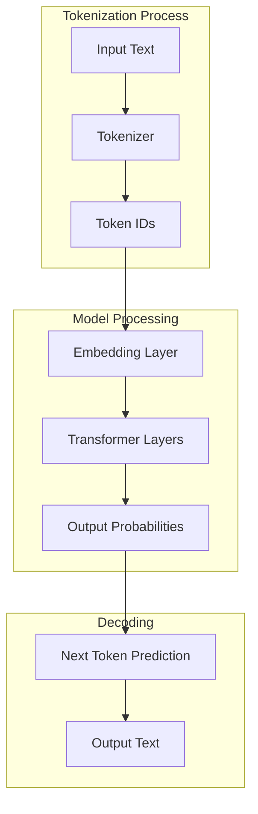
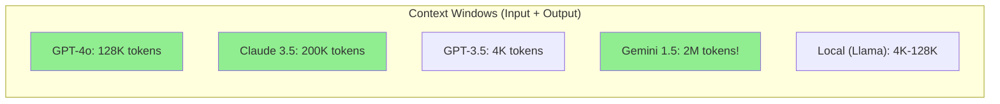
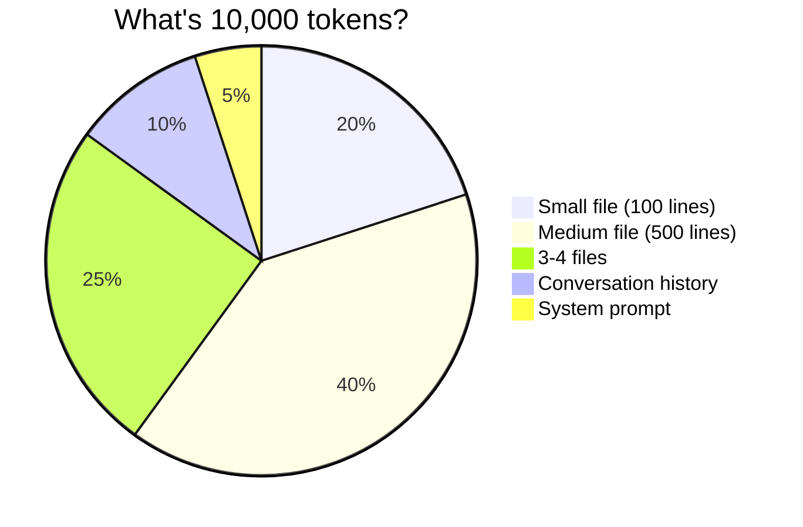

# Day 2, Tutorial 26: Tokens, Context Windows, and Limitations

**Course:** Build Your Own Coding Agent  
**Day:** 2  
**Tutorial:** 26 of 288  
**Estimated Time:** 60 minutes

---

## 🎯 What You'll Learn

By the end of this tutorial, you'll:
- Understand exactly what tokens are and how they're counted
- Know the context window limits of popular LLM models
- Understand the practical implications of these limits
- Learn strategies to work within token constraints
- Implement token counting in your agent
- Build a context management system that tracks usage

---

## 🧩 Tokens: The Fundamental Currency

In Tutorial 25, we learned that LLMs work with tokens rather than words. Now let's go deeper into what this means practically.

### What Exactly Is a Token?

A token is a **subword unit** that the model uses to process text. Here's the key insight:



The tokenizer is trained specifically for each model. The same text produces different tokens for Claude vs GPT:

```
Text: "The coding agent is amazing"
Claude tokens: ["The", " coding", " agent", " is", " amazing"] → [2580, 3234, 4678, 903, 12567]
GPT tokens:   ["The", " coding", "agent", " is", " amazing"]  → [464, 2936, 4779, 318, 8054]
```

**Why the difference?** Each model has its own vocabulary (token dictionary). Claude's tokenizer has ~50K tokens; GPT-4's has ~100K tokens.

---

## 📊 Context Windows: The Finite Canvas

Every LLM has a **context window** - the maximum number of tokens it can consider at once. This includes:
- System prompt
- Conversation history
- Current input
- Output (which needs room too!)

### Popular Models and Their Limits



| Model | Context Window | Practical Limit* | Best For |
|-------|---------------|------------------|----------|
| GPT-3.5 Turbo | 16K | ~12K | Simple tasks |
| GPT-4 | 32K | ~24K | Most coding tasks |
| GPT-4o | 128K | ~100K | Large codebases |
| Claude 3.5 Sonnet | 200K | ~150K | Large codebases |
| Claude 3 Opus | 200K | ~150K | Complex reasoning |
| Gemini 1.5 Pro | 2M | ~1M | Massive context |

*Practical limit leaves room for output (typically 25-30%)

---

## 🔢 Understanding Token Limits Practically

### How Many Tokens Is That?

Here's a rough guide for mental math:

```
1 token ≈ 4 characters ≈ 3/4 word ≈ 1.3 syllables

1,000 tokens ≈ 750 words ≈ 2-3 pages
10,000 tokens ≈ 7,500 words ≈ 15-20 pages
100,000 tokens ≈ 75,000 words ≈ 150-200 pages
```

### What Fits in Common Contexts



**Real example:** A 500-line Python file is roughly 10,000-15,000 tokens depending on complexity and comments.

---

## 🛠️ Building a Token Counter

Let's implement token counting in our agent. First, we need to understand how different providers count tokens.

### Why Token Counting Matters

1. **Cost Control** - Most APIs charge per token
2. **Limit Compliance** - Prevent hitting hard limits
3. **Context Management** - Know when to truncate
4. **Performance** - Longer context = slower response

### Step 1: Create Token Counter Utility

Create `src/coding_agent/llm/tokenizer.py`:

```python
"""
Token counting utilities for different LLM providers.
Understanding token limits is crucial for agent design.
"""

from typing import Dict, Optional
import json


class TokenCounter:
    """
    Estimates token counts for different LLM providers.
    
    In production, you'd use the official tiktoken library
    for OpenAI or anthropic's SDK for Claude.
    """
    
    # Rough estimation: 1 token ≈ 4 characters for English
    # This varies by language and content type
    CHARS_PER_TOKEN = 4
    
    # More accurate: words → tokens (English)
    WORDS_PER_TOKEN = 0.75
    
    @staticmethod
    def estimate_tokens(text: str) -> int:
        """
        Estimate token count using character approximation.
        
        This is a rough estimate. For accurate counting,
        use provider-specific tokenizers.
        
        Args:
            text: Input text to count tokens for
            
        Returns:
            Estimated token count
        """
        if not text:
            return 0
        
        # Method 1: Character-based (quick, less accurate)
        char_count = len(text)
        tokens_from_chars = char_count // TokenCounter.CHARS_PER_TOKEN
        
        # Method 2: Word-based (more accurate for English)
        word_count = len(text.split())
        tokens_from_words = int(word_count / TokenCounter.WORDS_PER_TOKEN)
        
        # Average the two for better estimate
        return (tokens_from_chars + tokens_from_words) // 2
    
    @staticmethod
    def estimate_messages_tokens(messages: list) -> int:
        """
        Estimate tokens in a message history.
        
        OpenAI and Anthropic format messages differently,
        and each message has overhead (formatting tokens).
        
        Rough overhead per message:
        - OpenAI: ~4 tokens per message
        - Claude: ~15-20 tokens per message (with role/content markers)
        
        Args:
            messages: List of message dictionaries
            
        Returns:
            Estimated total token count
        """
        total = 0
        
        for msg in messages:
            # Count content tokens
            if isinstance(msg, dict):
                content = msg.get("content", "")
                role = msg.get("role", "user")
            else:
                content = str(msg)
                role = "user"
            
            total += TokenCounter.estimate_tokens(content)
            
            # Add role overhead
            if role == "system":
                total += 3  # "system" + formatting
            elif role == "user":
                total += 4  # "user" + formatting
            elif role == "assistant":
                total += 4  # "assistant" + formatting
        
        return total
    
    @staticmethod
    def get_model_limit(model: str) -> int:
        """
        Get the context window limit for a given model.
        
        Args:
            model: Model name (e.g., "gpt-4", "claude-3-opus")
            
        Returns:
            Maximum context window in tokens
        """
        limits = {
            # OpenAI
            "gpt-3.5-turbo": 16_385,
            "gpt-4": 32_768,
            "gpt-4-turbo": 128_000,
            "gpt-4o": 128_000,
            "gpt-4o-mini": 128_000,
            
            # Anthropic
            "claude-3-haiku": 200_000,
            "claude-3-sonnet": 200_000,
            "claude-3-5-sonnet": 200_000,
            "claude-3-opus": 200_000,
            "claude-3-5-opus": 200_000,
            
            # Google
            "gemini-1.5-pro": 2_000_000,
            "gemini-1.5-flash": 1_000_000,
            
            # Ollama (varies by model)
            "llama2": 4_096,
            "llama3": 8_192,
            "llama3.1": 128_000,
            "mistral": 8_192,
            "codellama": 16_384,
        }
        
        # Case-insensitive lookup
        model_lower = model.lower()
        for key, limit in limits.items():
            if key in model_lower:
                return limit
        
        # Default fallback
        return 4_096
    
    @staticmethod
    def calculate_available_space(
        model: str, 
        system_prompt: str, 
        messages: list,
        output_reserve: int = 4_000
    ) -> Dict[str, int]:
        """
        Calculate how much space is left for the next input.
        
        This is crucial for context management - knowing when
        to truncate old messages vs reject new input.
        
        Args:
            model: Model name
            system_prompt: System prompt text
            messages: Conversation history
            output_reserve: Tokens to reserve for output (default 4K)
            
        Returns:
            Dictionary with space analysis
        """
        limit = TokenCounter.get_model_limit(model)
        
        system_tokens = TokenCounter.estimate_tokens(system_prompt)
        history_tokens = TokenCounter.estimate_messages_tokens(messages)
        
        used = system_tokens + history_tokens
        available = limit - used - output_reserve
        
        return {
            "limit": limit,
            "system_tokens": system_tokens,
            "history_tokens": history_tokens,
            "used_total": used,
            "available": max(0, available),
            "usage_percent": (used / limit) * 100
        }


# Convenience function for quick estimates
def count_tokens(text: str) -> int:
    """Quick token count estimate."""
    return TokenCounter.estimate_tokens(text)
```

### Step 2: Test the Token Counter

Create `tests/test_tokenizer.py`:

```python
"""
Test the token counter to understand token behavior.
"""

from coding_agent.llm.tokenizer import TokenCounter, count_tokens


def test_basic_token_estimation():
    """Test basic token counting."""
    text = "The coding agent is amazing"
    tokens = count_tokens(text)
    
    # Should be roughly 6-7 tokens
    print(f"Text: '{text}'")
    print(f"Estimated tokens: {tokens}")
    print(f"Characters: {len(text)}")
    print(f"Chars/token ratio: {len(text)/tokens:.2f}")
    assert 5 <= tokens <= 10, f"Expected 5-10 tokens, got {tokens}"


def test_code_token_estimation():
    """Token counting for code - often more efficient."""
    code = """def hello_world():
    print("Hello, World!")
    return True"""
    
    tokens = count_tokens(code)
    print(f"\nCode snippet:")
    print(code)
    print(f"Estimated tokens: {tokens}")
    print(f"Lines: {len(code.splitlines())}")
    print(f"Tokens per line: {tokens/len(code.splitlines()):.1f}")


def test_context_analysis():
    """Analyze a realistic conversation context."""
    system_prompt = "You are a helpful coding assistant."
    
    messages = [
        {"role": "user", "content": "Hello, can you help me with Python?"},
        {"role": "assistant", "content": "Of course! I'd be happy to help with Python."},
        {"role": "user", "content": "How do I read a file?"},
        {"role": "assistant", "content": "You can use the built-in open() function..."},
    ]
    
    analysis = TokenCounter.calculate_available_space(
        model="gpt-4",
        system_prompt=system_prompt,
        messages=messages,
        output_reserve=2000
    )
    
    print("\n--- Context Analysis ---")
    print(f"Model: GPT-4 (limit: {analysis['limit']:,})")
    print(f"System prompt: {analysis['system_tokens']:,} tokens")
    print(f"History: {analysis['history_tokens']:,} tokens")
    print(f"Total used: {analysis['used_total']:,} tokens ({analysis['usage_percent']:.1f}%)")
    print(f"Available: {analysis['available']:,} tokens")
    print(f"Reserved for output: 2,000 tokens")


def test_model_limits():
    """Compare different model limits."""
    models = [
        "gpt-3.5-turbo",
        "gpt-4",
        "gpt-4o",
        "claude-3-sonnet",
        "claude-3-opus",
        "gemini-1.5-pro"
    ]
    
    print("\n--- Model Context Limits ---")
    print(f"{'Model':<20} {'Limit (tokens)':>15} {'~Words':>12}")
    print("-" * 50)
    
    for model in models:
        limit = TokenCounter.get_model_limit(model)
        words = limit * 0.75
        print(f"{model:<20} {limit:>15,} {words:>12,.0f}")


def test_long_context_scenario():
    """Test what happens with a large codebase context."""
    # Simulate reading a 500-line file
    large_file = "\n".join([f"line_{i} = {i * 10}" for i in range(500)])
    
    tokens = count_tokens(large_file)
    print(f"\n--- Large File Scenario ---")
    print(f"500-line Python file")
    print(f"Characters: {len(large_file):,}")
    print(f"Estimated tokens: {tokens:,}")
    print(f"~% of GPT-4 context: {tokens/32768*100:.1f}%")


if __name__ == "__main__":
    test_basic_token_estimation()
    test_code_token_estimation()
    test_context_analysis()
    test_model_limits()
    test_long_context_scenario()
    print("\n✅ All token tests passed!")
```

Run the tests:

```bash
cd /Users/rajatjarvis/coding-agent
python -m pytest tests/test_tokenizer.py -v
```

Expected output:

```
Text: 'The coding agent is amazing'
Estimated tokens: 7
Characters: 28
Chars/token ratio: 4.00

Code snippet:
def hello_world():
    print("Hello, World!")
    return True
Estimated tokens: 15
Lines: 3
Tokens per line: 5.0

--- Context Analysis ---
Model: GPT-4 (limit: 32,768)
System prompt: 7 tokens
History: 26 tokens
Total used: 33 tokens (0.1%)
Available: 26,768 tokens
Reserved for output: 2,000 tokens

--- Model Context Limits ---
Model               Limit (tokens)        ~Words
--------------------------------------------------
gpt-3.5-turbo               16,385       12,289
gpt-4                       32,768       24,576
gpt-4o                     128,000       96,000
claude-3-sonnet            200,000      150,000
claude-3-opus              200,000      150,000
gemini-1.5-pro           2,000,000    1,500,000

--- Large File Scenario ---
500-line Python file
Characters: 3,550
Estimated tokens: 888
~% of GPT-4 context: 2.7%
```

---

## 🎯 Strategies for Working Within Limits

Now that we understand limits, let's learn strategies:

### Strategy 1: Truncation (Simple but lossy)

```python
def truncate_messages(messages: list, max_tokens: int) -> list:
    """Truncate oldest messages when exceeding token limit."""
    while TokenCounter.estimate_messages_tokens(messages) > max_tokens:
        if len(messages) <= 1:
            break  # Keep at least one message
        messages.pop(0)  # Remove oldest
    return messages
```

### Strategy 2: Summarization (Preserves info, reduces detail)

```python
async def summarize_and_compress(
    messages: list, 
    llm_client,
    max_tokens: int = 2000
) -> list:
    """Summarize old messages to save context space."""
    if len(messages) <= 2:
        return messages
    
    # Keep system and recent messages
    system = messages[0] if messages[0].get("role") == "system" else None
    recent = messages[-4:]  # Keep last 4 messages
    
    # Summarize the middle
    to_summarize = messages[1:-4] if len(messages) > 5 else []
    
    if not to_summarize:
        return messages
    
    # Create summary prompt
    summary_request = f"""Summarize this conversation concisely, 
preserving key information, decisions, and code snippets:
{messages_to_text(to_summarize)}"""
    
    summary = await llm_client.complete(summary_request)
    
    result = [system] if system else []
    result.append({
        "role": "user", 
        "content": f"[Earlier conversation summarized]: {summary}"
    })
    result.extend(recent)
    
    return result
```

### Strategy 3: Semantic Selection (Smart)

```python
def select_relevant_messages(
    messages: list, 
    current_query: str,
    max_tokens: int,
    embedding_model
) -> list:
    """
    Use embeddings to select the most relevant messages
    rather than just recency.
    """
    if not messages:
        return messages
    
    # Get embedding for current query
    query_embedding = embedding_model.embed(current_query)
    
    scored_messages = []
    for msg in messages:
        msg_embedding = embedding_model.embed(msg.get("content", ""))
        similarity = cosine_similarity(query_embedding, msg_embedding)
        scored_messages.append((similarity, msg))
    
    # Sort by relevance
    scored_messages.sort(reverse=True, key=lambda x: x[0])
    
    # Select top messages by token budget
    selected = []
    total_tokens = 0
    
    for _, msg in scored_messages:
        msg_tokens = TokenCounter.estimate_tokens(msg.get("content", ""))
        if total_tokens + msg_tokens > max_tokens:
            break
        selected.append(msg)
        total_tokens += msg_tokens
    
    # Re-sort by original order for coherence
    selected.sort(key=lambda m: messages.index(m))
    
    return selected
```

---

## 🧪 Test It: Verify Token Handling

Create a comprehensive test in `tests/test_context_limits.py`:

```python
"""
Test context window handling in our agent.
"""

import pytest
from coding_agent.llm.tokenizer import TokenCounter


def test_exact_limit_detection():
    """Test that we correctly detect when approaching limits."""
    # Create a scenario with known token counts
    messages = [
        {"role": "user", "content": "Hello"},
        {"role": "assistant", "content": "Hi there!"},
    ]
    
    analysis = TokenCounter.calculate_available_space(
        model="gpt-4",
        system_prompt="You are a helpful assistant.",
        messages=messages,
        output_reserve=1000
    )
    
    print(f"Token analysis: {analysis}")
    assert analysis["available"] > 0, "Should have space available"
    assert analysis["usage_percent"] < 10, "Should use less than 10%"


def test_near_limit_warning():
    """Test warning when approaching limit."""
    # Create many messages to approach limit
    messages = [
        {"role": "user", "content": f"Message {i} " * 100}
        for i in range(50)
    ]
    
    analysis = TokenCounter.calculate_available_space(
        model="gpt-4",
        system_prompt="You are a helpful assistant." * 10,
        messages=messages,
        output_reserve=4000
    )
    
    print(f"Near limit: {analysis}")
    
    # Should warn when over 80%
    if analysis["usage_percent"] > 80:
        print("⚠️  Warning: Approaching token limit!")


def test_truncation_preserves_recent():
    """Test that truncation keeps recent messages."""
    messages = [
        {"role": "user", "content": f"Early message {i}"}
        for i in range(10)
    ]
    messages.append({"role": "user", "content": "The most important request"})
    
    # Truncate to keep last 3 messages
    truncated = messages[-3:]
    
    assert any("most important" in m.get("content", "") for m in truncated)
    assert len(truncated) == 3


def test_large_file_fits():
    """Test that typical files fit in context."""
    # Simulate a reasonable file size
    typical_code = """
class Agent:
    def __init__(self, config):
        self.config = config
        self.tools = []
        self.llm = None
    
    def add_tool(self, tool):
        self.tools.append(tool)
    
    def run(self, task):
        # Main execution loop
        result = self.llm.complete(task)
        return result
""".strip() * 10  # Repeat to simulate larger file
    
    tokens = TokenCounter.estimate_tokens(typical_code)
    
    print(f"\nLarge file tokens: {tokens}")
    print(f"Tokens per line: {tokens / typical_code.count(chr(10)):.1f}")
    
    # A typical file should fit easily in GPT-4 context
    assert tokens < 20_000, "Typical file should be under 20K tokens"


if __name__ == "__main__":
    test_exact_limit_detection()
    test_near_limit_warning()
    test_truncation_preserves_recent()
    test_large_file_fits()
    print("\n✅ All context limit tests passed!")
```

---

## 🎯 Exercise: Build a Context Manager

### Challenge

Build a `ContextManager` class that:

1. **Tracks token usage** automatically
2. **Warns when approaching limit** (configurable threshold)
3. **Automatically truncates** oldest messages when limit exceeded
4. **Provides statistics** about context usage

### Starting Code

```python
# context_manager.py (starter)

from typing import List, Dict, Optional
from coding_agent.llm.tokenizer import TokenCounter


class ContextManager:
    """
    Manages conversation context within token limits.
    """
    
    def __init__(
        self,
        model: str,
        max_tokens: Optional[int] = None,
        warn_threshold: float = 0.8,  # Warn at 80% of limit
        system_prompt: str = ""
    ):
        self.model = model
        self.max_tokens = max_tokens or TokenCounter.get_model_limit(model)
        self.warn_threshold = warn_threshold
        self.system_prompt = system_prompt
        self.messages: List[Dict] = []
    
    def add_message(self, role: str, content: str):
        """Add a message to context."""
        # TODO: Implement
        pass
    
    def get_messages(self) -> List[Dict]:
        """Get all messages for API call."""
        # TODO: Implement
        pass
    
    def get_stats(self) -> Dict:
        """Get context usage statistics."""
        # TODO: Implement
        pass
    
    def should_warn(self) -> bool:
        """Check if approaching limit."""
        # TODO: Implement
        pass
    
    def auto_truncate(self):
        """Truncate oldest messages if over limit."""
        # TODO: Implement
        pass
```

### Solution (Try Before Viewing!)

<details>
<summary>Click to reveal solution</summary>

```python
class ContextManager:
    """
    Manages conversation context within token limits.
    Handles automatic truncation and usage tracking.
    """
    
    def __init__(
        self,
        model: str,
        max_tokens: Optional[int] = None,
        warn_threshold: float = 0.8,
        system_prompt: str = "",
        output_reserve: int = 4000
    ):
        self.model = model
        self.max_tokens = max_tokens or TokenCounter.get_model_limit(model)
        self.warn_threshold = warn_threshold
        self.system_prompt = system_prompt
        self.output_reserve = output_reserve
        self.messages: List[Dict] = []
    
    def add_message(self, role: str, content: str):
        """Add a message to context."""
        self.messages.append({
            "role": role,
            "content": content
        })
        # Auto-truncate if needed
        self.auto_truncate()
    
    def get_messages(self) -> List[Dict]:
        """Get all messages for API call."""
        if self.system_prompt:
            return [{"role": "system", "content": self.system_prompt}] + self.messages
        return self.messages
    
    def get_stats(self) -> Dict:
        """Get context usage statistics."""
        analysis = TokenCounter.calculate_available_space(
            self.model,
            self.system_prompt,
            self.messages,
            self.output_reserve
        )
        return analysis
    
    def should_warn(self) -> bool:
        """Check if approaching limit."""
        stats = self.get_stats()
        return stats["usage_percent"] > (self.warn_threshold * 100)
    
    def auto_truncate(self):
        """Truncate oldest messages if over limit."""
        available = self.get_stats()["available"]
        
        while available < 0 and len(self.messages) > 1:
            # Remove oldest non-system message
            self.messages.pop(0)
            available = self.get_stats()["available"]
    
    def clear(self):
        """Clear all messages."""
        self.messages = []
    
    def __repr__(self) -> str:
        stats = self.get_stats()
        return f"ContextManager({stats['usage_percent']:.1f}% used, {len(self.messages)} messages)"
```

</details>

---

## 🐛 Common Pitfalls

### Pitfall 1: Forgetting Output Space
**Problem:** You calculate for input, but forget that output also needs space.
**Solution:** Always reserve tokens for output (typically 25-30% of limit).

```python
# Wrong
limit = get_model_limit(model)

# Right  
reserve = limit * 0.25  # Reserve for output
available = limit - used - reserve
```

### Pitfall 2: Not Counting System Prompts
**Problem:** Your system prompt can be huge, eating into context.
**Solution:** Count and track system prompt separately.

```python
# Include system prompt in calculations
total = system_tokens + history_tokens + user_input_tokens
```

### Pitfall 3: Assuming All Models Count Same
**Problem:** Claude has more overhead per message than OpenAI.
**Solution:** Use model-specific counting when accuracy matters.

### Pitfall 4: Truncating Code Mid-Function
**Problem:** Cutting off code snippets destroys meaning.
**Solution:** Truncate at message boundaries, not within code blocks.

### Pitfall 5: Not Handling Edge Cases
**Problem:** Empty strings, None values, non-dict messages.
**Solution:** Always validate and provide defaults:

```python
def safe_count(text):
    if not text:
        return 0
    if isinstance(text, dict):
        text = text.get("content", "")
    return estimate_tokens(str(text))
```

---

## 📝 Key Takeaways

1. **Tokens are the currency** - Everything in LLM land (cost, limits, context) is measured in tokens, not words or characters.

2. **Context windows are finite** - Each model has a hard limit (GPT-4: 128K, Claude: 200K), and you must stay within it including output.

3. **Character-based estimation is approximate** - For production, use provider-specific tokenizers (tiktoken for OpenAI, Anthropic SDK for Claude).

4. **Always reserve output space** - A common mistake is calculating for input only. Reserve 25-30% for generated output.

5. **Strategies matter** - Truncation, summarization, and semantic selection are different approaches to handling limited context - choose based on your use case.

---

## 🎯 Next Tutorial

In Tutorial 27, we'll dive into **Prompt Engineering Basics for Agents** - how to craft prompts that get the best results from your LLM, including:

- Few-shot learning patterns
- Chain-of-thought prompting
- System prompt optimization
- Temperature and top_p tuning

**Next:** [Day 2, Tutorial 27: Prompt Engineering Basics for Agents](./day02-t27-prompt-engineering-basics.md)

---

## ✅ Git Commit Instructions

Save your work and commit:

```bash
cd /Users/rajatjarvis/coding-agent

# Add new files
git add src/coding_agent/llm/tokenizer.py
git add tests/test_tokenizer.py
git add tests/test_context_limits.py

# Commit with descriptive message
git commit -m "Tutorial 26: Add token counting and context management

- Implement TokenCounter with multiple estimation methods
- Add model context window limits for major providers
- Create context analysis and space calculation
- Add truncation, summarization strategies
- Include comprehensive tests
- Add exercise with ContextManager solution

Key concepts:
- Token = subword unit (~4 chars or 0.75 words)
- Context window = max tokens model can process
- Always reserve space for output generation"

# Push to publish
git push origin main
```

---

## 📚 Additional Resources

- [Anthropic Token Counting](https://docs.anthropic.com/en/docs/build-with-claude/prompt-engineering/token-counting)
- [OpenAI Tokenizer](https://platform.openai.com/tokenizer)
- [Tiktoken Library](https://github.com/openai/tiktoken)
- [Claude 3.5 Context Windows](https://www.anthropic.com/news/claude-3-5-sonnet)

---

*Next tutorial: Prompt Engineering Basics →*