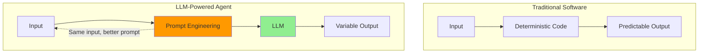
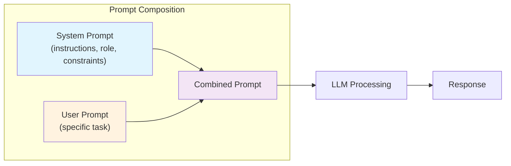
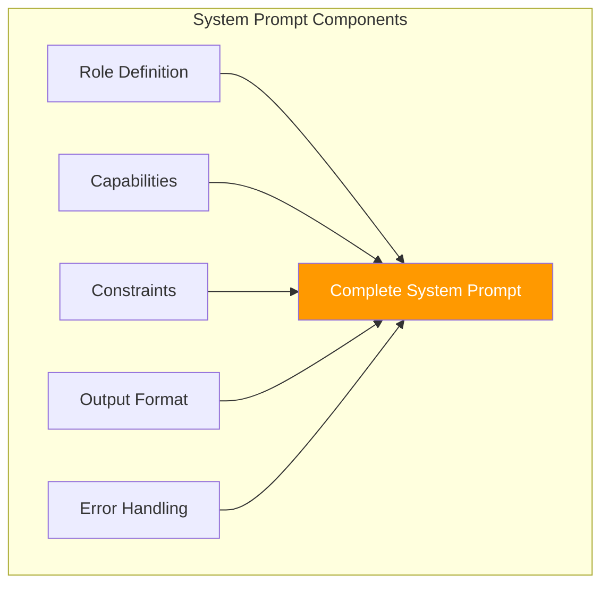
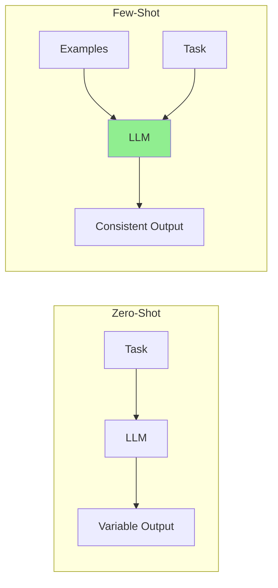
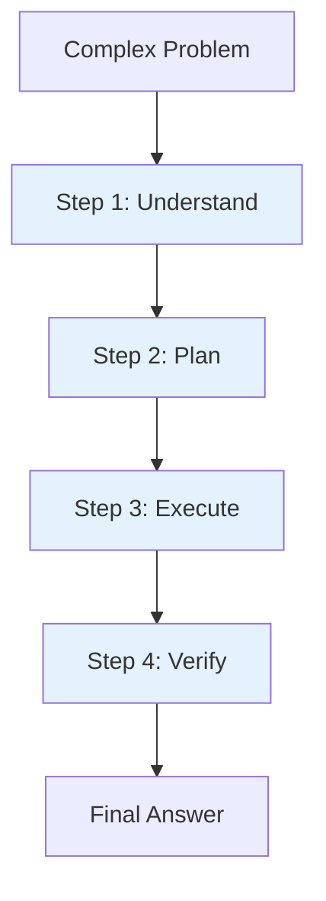
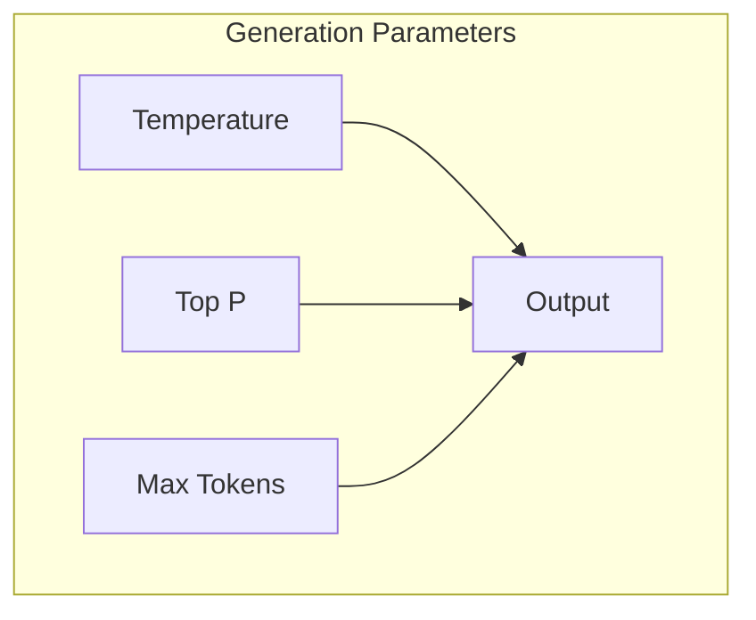

# Day 2, Tutorial 27: Prompt Engineering Basics for Agents

**Course:** Build Your Own Coding Agent  
**Day:** 2  
**Tutorial:** 27 of 288  
**Estimated Time:** 60 minutes

---

## 🎯 What You'll Learn

By the end of this tutorial, you'll:
- Understand the fundamental principles of prompt engineering for agents
- Learn the difference between prompting for chat vs. agentic tasks
- Master few-shot learning patterns for code generation
- Implement chain-of-thought prompting for complex reasoning
- Design effective system prompts that guide agent behavior
- Configure temperature and top_p for different agent tasks
- Build a prompt template system that scales

---

## 🧩 Why Prompt Engineering Matters for Agents

In Tutorial 25, we learned that LLMs are powerful but unpredictable. In Tutorial 26, we learned about token limits. Now we tackle the most critical skill: **making the LLM do what you want, consistently**.



The difference between a frustrating experience and a powerful coding agent often comes down to **how you ask**.

### The Agent Prompt Challenge

Unlike chat apps where users type anything, your coding agent needs:

1. **Consistency** - Same task should produce similar quality results
2. **Specificity** - The agent must follow exact instructions
3. **Error handling** - Graceful degradation when tasks are unclear
4. **Tool awareness** - Understanding what tools are available
5. **Code quality** - Generating valid, secure, maintainable code

Let's build the foundation for all this.

---

## 🧠 Core Prompting Concepts

### 1. System Prompts vs. User Prompts

LLMs process prompts in layers:



**System Prompt:** Sets the overall behavior, role, and rules
**User Prompt:** The specific task or question

```python
# Example: How the same user prompt gets different results

# System Prompt A: Helpful Assistant
system_a = "You are a helpful assistant."
user = "Write a function to sort a list"

# System Prompt B: Security-First Coder  
system_b = "You are a security-focused software engineer. Never use eval(), always validate inputs, prefer immutable patterns."
user = "Write a function to sort a list"

# Results:
# A -> "def sort_list(l): return sorted(l)"
# B -> "def sort_list(items: list) -> list:\n    if not isinstance(items, list): raise TypeError('...')\n    return sorted(items)"
```

### 2. The Anatomy of an Effective System Prompt

For a coding agent, your system prompt should cover:



Let's build our system prompt step by step:

```python
SYSTEM_PROMPT_V1 = """
You are a coding assistant.
"""

# Better: Role + capabilities
SYSTEM_PROMPT_V2 = """
You are a senior software engineer helping write code.
You have access to file operations and shell commands.
"""

# Better: Role + capabilities + constraints + output format
SYSTEM_PROMPT_V3 = """
You are a senior software engineer with expertise in Python, JavaScript, and TypeScript.

## Your Capabilities
- Read, write, and edit files
- Execute shell commands
- Run tests and analyze results
- Search and understand codebases

## Constraints
- Always prefer clean, readable code over clever code
- Add docstrings to all functions
- Handle errors gracefully with specific exception types
- Never use eval() or exec() with user input
- Prefer type hints for function signatures

## Output Format
- When writing code, provide complete files, not fragments
- Include imports at the top
- Add comments for complex logic
- Show file paths in code blocks

## Error Handling
- When unsure, ask clarifying questions
- If a task is impossible, explain why
- Report errors with context and suggested fixes
"""

print("System prompt length:", len(SYSTEM_PROMPT_V3), "characters")
print("Estimated tokens:", len(SYSTEM_PROMPT_V3) // 4)
```

---

## 🛠️ Building the Prompt Template System

Let's create a robust prompt template system that our agent can use. This builds on the tokenizer from Tutorial 26.

### Step 1: Create the Prompt Builder

Create `src/coding_agent/llm/prompts.py`:

```python
"""
Prompt engineering utilities for our coding agent.
Builds effective prompts for consistent, high-quality outputs.
"""

from typing import Dict, List, Optional, Any
from dataclasses import dataclass, field
from enum import Enum
import json


class TaskType(Enum):
    """Types of tasks the agent can perform."""
    CODE_GENERATION = "code_generation"
    CODE_REVIEW = "code_review"
    BUG_FIX = "bug_fix"
    REFACTOR = "refactor"
    EXPLAIN = "explain"
    SEARCH = "search"
    TEST = "test"


@dataclass
class PromptContext:
    """
    Context information for prompt construction.
    This is what gets injected into prompts to give the LLM
    the information it needs to complete tasks.
    """
    task_type: TaskType
    file_contents: Dict[str, str] = field(default_factory=dict)
    available_tools: List[str] = field(default_factory=list)
    current_file: str = ""
    error_message: str = ""
    language: str = "python"
    project_context: str = ""
    
    def to_dict(self) -> Dict[str, Any]:
        """Convert to dictionary for serialization."""
        return {
            "task_type": self.task_type.value,
            "file_contents": self.file_contents,
            "available_tools": self.available_tools,
            "current_file": self.current_file,
            "error_message": self.error_message,
            "language": self.language,
            "project_context": self.project_context,
        }


class PromptBuilder:
    """
    Constructs prompts for the LLM with proper structure and context.
    
    The key insight: prompts are not just "what to do" but also
    "how to do it" and "what to avoid".
    """
    
    # Default system prompt for our coding agent
    DEFAULT_SYSTEM_PROMPT = """You are a senior software engineer helping a user build and maintain a coding agent similar to Claude Code.

## Your Role
You assist with:
- Writing new code (Python, JavaScript, TypeScript, etc.)
- Debugging and fixing issues
- Reviewing code for quality and security
- Explaining complex code
- Refactoring for clarity and performance

## Available Tools
You have access to:
- File read/write operations
- Shell command execution
- Code search and analysis

## Code Quality Standards
- Use type hints in Python, TypeScript
- Add docstrings to all public functions
- Handle errors with specific exceptions
- Prefer readability over cleverness
- Write tests for new functionality
- Never use eval() or exec() with external input

## Output Requirements
- Provide complete code, not fragments
- Include imports at file top
- Use consistent formatting
- Explain your reasoning when helpful
"""
    
    def __init__(self, system_prompt: Optional[str] = None):
        """
        Initialize prompt builder.
        
        Args:
            system_prompt: Custom system prompt (uses default if None)
        """
        self.system_prompt = system_prompt or self.DEFAULT_SYSTEM_PROMPT
    
    def build_task_prompt(
        self,
        user_request: str,
        context: PromptContext,
        include_code: bool = True,
        max_context_files: int = 5
    ) -> List[Dict[str, str]]:
        """
        Build a complete prompt with context.
        
        This is the main method - it constructs a properly formatted
        prompt that includes all necessary context for the LLM.
        
        Args:
            user_request: The user's actual request
            context: Context information (files, tools, etc.)
            include_code: Whether to include file contents in prompt
            max_context_files: Maximum files to include
            
        Returns:
            List of message dictionaries for LLM API
        """
        messages = [{"role": "system", "content": self.system_prompt}]
        
        # Add project context if provided
        if context.project_context:
            messages.append({
                "role": "system",
                "content": f"## Project Context\n{context.project_context}"
            })
        
        # Add task-specific system instructions
        task_instructions = self._get_task_instructions(context.task_type)
        if task_instructions:
            messages.append({
                "role": "system", 
                "content": task_instructions
            })
        
        # Add available tools context
        if context.available_tools:
            tools_desc = self._format_tools_description(context.available_tools)
            messages.append({
                "role": "system",
                "content": f"## Available Tools\n{tools_desc}"
            })
        
        # Add current file context (important for edits)
        if context.current_file and include_code:
            messages.append({
                "role": "system",
                "content": f"## Current Working File\n{context.current_file}"
            })
        
        # Add file contents as context
        if context.file_contents and include_code:
            files_content = self._format_file_context(
                context.file_contents, 
                max_context_files
            )
            messages.append({
                "role": "system",
                "content": f"## Relevant Files\n{files_content}"
            })
        
        # Add error context if any
        if context.error_message:
            messages.append({
                "role": "system",
                "content": f"## Current Error\n```\n{context.error_message}\n```"
            })
        
        # Add language requirement
        messages.append({
            "role": "system",
            "content": f"## Language\nWrite code in {context.language}"
        })
        
        # Finally, add the user's request
        messages.append({"role": "user", "content": user_request})
        
        return messages
    
    def _get_task_instructions(self, task_type: TaskType) -> str:
        """
        Get task-specific instructions based on what we're asking the LLM to do.
        
        Different tasks require different prompting strategies.
        """
        instructions = {
            TaskType.CODE_GENERATION: """
## Task: Code Generation
- Provide complete, runnable code
- Include all necessary imports
- Add docstrings explaining function purpose
- Use type hints for parameters and return values
- Handle edge cases gracefully
""",
            TaskType.CODE_REVIEW: """
## Task: Code Review
- Analyze code for bugs, security issues, and performance
- Check for proper error handling
- Look for code smells and anti-patterns
- Suggest specific improvements with code examples
- Rate overall quality (good/needs-work/poor)
""",
            TaskType.BUG_FIX: """
## Task: Bug Fix
- First understand the bug by analyzing the error message
- Identify the root cause, not just symptoms
- Fix the underlying issue
- Preserve existing functionality
- Test the fix if possible
""",
            TaskType.REFACTOR: """
## Task: Refactoring
- Improve code structure without changing behavior
- Focus on readability and maintainability
- Break large functions into smaller ones
- Remove duplication
- Add appropriate abstractions
""",
            TaskType.EXPLAIN: """
## Task: Code Explanation
- Explain in plain English what the code does
- Use analogies where helpful
- Point out interesting patterns or gotchas
- Keep it concise but complete
""",
            TaskType.SEARCH: """
## Task: Code Search
- Find relevant code based on the query
- Show context around matches
- Explain why each result is relevant
""",
            TaskType.TEST: """
## Task: Test Writing
- Write comprehensive tests covering edge cases
- Use appropriate test framework for the language
- Include both positive and negative test cases
- Make tests readable and maintainable
"""
        }
        return instructions.get(task_type, "")
    
    def _format_tools_description(self, tools: List[str]) -> str:
        """Format the available tools list."""
        if not tools:
            return "No special tools available."
        
        tool_descriptions = []
        for tool in tools:
            tool_descriptions.append(f"- {tool}")
        
        return "\n".join(tool_descriptions)
    
    def _format_file_context(
        self, 
        files: Dict[str, str], 
        max_files: int
    ) -> str:
        """
        Format file contents for inclusion in prompt.
        
        We truncate long files to stay within token limits.
        """
        formatted = []
        
        # Limit number of files
        file_items = list(files.items())[:max_files]
        
        for filepath, content in file_items:
            # Truncate long files (keep beginning and end)
            max_length = 2000  # characters
            
            if len(content) > max_length:
                truncated = (
                    content[:max_length // 2] +
                    f"\n... [{len(content) - max_length} characters truncated] ...\n" +
                    content[-max_length // 2:]
                )
            else:
                truncated = content
            
            formatted.append(f"### {filepath}\n```\n{truncated}\n```")
        
        return "\n\n".join(formatted)
    
    def build_error_recovery_prompt(
        self,
        original_prompt: str,
        error: str,
        attempt: int
    ) -> str:
        """
        Build a prompt to recover from an error.
        
        When the LLM's output causes an error, we need to
        ask it to fix the issue.
        """
        return f"""The previous response caused an error:

```
{error}
```

This is attempt #{attempt} to fix this issue.

Original task: {original_prompt}

Please:
1. Analyze the error carefully
2. Identify what went wrong
3. Provide a corrected response

Remember the constraints from the system prompt."""
    
    def build_clarification_prompt(self, ambiguous_request: str) -> str:
        """
        Build a prompt to ask for clarification.
        
        When the request is unclear, we need to ask questions
        rather than guess incorrectly.
        """
        return f"""The user's request is ambiguous:

"{ambiguous_request}"

Please ask clarifying questions to understand:
1. What specific functionality is needed?
2. What language/framework should be used?
3. Are there any constraints or requirements?
4. What should the output look like?

Ask one or two focused questions to resolve the ambiguity."""


# Convenience function for quick prompt building
def build_prompt(
    user_request: str,
    task_type: TaskType = TaskType.CODE_GENERATION,
    files: Optional[Dict[str, str]] = None,
    language: str = "python"
) -> List[Dict[str, str]]:
    """
    Quick way to build a prompt without full context.
    
    Args:
        user_request: What the user wants
        task_type: Type of task
        files: Optional file contents to include
        language: Programming language
    
    Returns:
        Messages ready for LLM API
    """
    builder = PromptBuilder()
    
    context = PromptContext(
        task_type=task_type,
        file_contents=files or {},
        language=language
    )
    
    return builder.build_task_prompt(user_request, context)
```

### Step 2: Create the Prompt Templates Module

Create `src/coding_agent/llm/templates.py`:

```python
"""
Pre-built prompt templates for common agent tasks.
These templates provide consistent, high-quality prompts.
"""

from typing import Dict, List, Optional
from .prompts import TaskType, PromptContext, PromptBuilder


class PromptTemplates:
    """
    Collection of pre-built prompt templates for common tasks.
    These have been refined to produce good results.
    """
    
    @staticmethod
    def code_completion(
        code: str,
        incomplete_line: str,
        language: str = "python"
    ) -> List[Dict[str, str]]:
        """Complete an incomplete line of code."""
        builder = PromptBuilder()
        context = PromptContext(
            task_type=TaskType.CODE_GENERATION,
            language=language,
            file_contents={"current_file": code}
        )
        
        user_prompt = f"""Complete this code. The incomplete line is:
{incomplete_line}

Provide just the completion, no explanation."""
        
        return builder.build_task_prompt(user_prompt, context)
    
    @staticmethod
    def bug_fix(
        code: str,
        error: str,
        language: str = "python"
    ) -> List[Dict[str, str]]:
        """Fix a bug in the given code."""
        builder = PromptBuilder()
        context = PromptContext(
            task_type=TaskType.BUG_FIX,
            file_contents={"main.py": code},
            error_message=error,
            language=language
        )
        
        user_prompt = f"""Fix the bug in this code. The error is:
{error}

Please provide the corrected code."""
        
        return builder.build_task_prompt(user_prompt, context)
    
    @staticmethod
    def code_review(
        code: str,
        language: str = "python"
    ) -> List[Dict[str, str]]:
        """Review code for issues."""
        builder = PromptBuilder()
        context = PromptContext(
            task_type=TaskType.CODE_REVIEW,
            file_contents={"review.py": code},
            language=language
        )
        
        user_prompt = """Review this code and provide feedback on:
- Bugs and errors
- Security issues
- Performance concerns
- Code quality
- Suggested improvements

Format your response with sections."""
        
        return builder.build_task_prompt(user_prompt, context)
    
    @staticmethod
    def write_tests(
        code: str,
        test_framework: str = "pytest",
        language: str = "python"
    ) -> List[Dict[str, str]]:
        """Generate tests for the given code."""
        builder = PromptBuilder()
        context = PromptContext(
            task_type=TaskType.TEST,
            file_contents={"source.py": code},
            language=language
        )
        
        user_prompt = f"""Write unit tests for this code using {test_framework}.

Cover:
- Normal cases
- Edge cases
- Error conditions

Make tests descriptive and maintainable."""
        
        return builder.build_task_prompt(user_prompt, context)
    
    @staticmethod
    def explain_code(
        code: str,
        language: str = "python"
    ) -> List[Dict[str, str]]:
        """Explain what code does."""
        builder = PromptBuilder()
        context = PromptContext(
            task_type=TaskType.EXPLAIN,
            file_contents={"code.py": code},
            language=language
        )
        
        user_prompt = """Explain this code in plain English. 
Cover what it does, how it works, and any interesting patterns."""
        
        return builder.build_task_prompt(user_prompt, context)
    
    @staticmethod
    def refactor(
        code: str,
        goal: str,
        language: str = "python"
    ) -> List[Dict[str, str]]:
        """Refactor code for specific goals."""
        builder = PromptBuilder()
        context = PromptContext(
            task_type=TaskType.REFACTOR,
            file_contents={"original.py": code},
            language=language
        )
        
        user_prompt = f"""Refactor this code with this goal: {goal}

Preserve functionality while improving:
- Readability
- Maintainability
- Performance (if applicable)

Explain the changes made."""
        
        return builder.build_task_prompt(user_prompt, context)
    
    @staticmethod
    def generate_from_spec(
        spec: str,
        language: str = "python"
    ) -> List[Dict[str, str]]:
        """Generate code from a specification."""
        builder = PromptBuilder()
        context = PromptContext(
            task_type=TaskType.CODE_GENERATION,
            language=language
        )
        
        user_prompt = f"""Generate code based on this specification:

{spec}

Provide complete, working code with:
- All necessary imports
- Type hints
- Docstrings
- Error handling
- Example usage if helpful"""
        
        return builder.build_task_prompt(user_prompt, context)


# Export for easy use
__all__ = ['PromptTemplates', 'TaskType', 'PromptContext', 'PromptBuilder']
```

---

## 🔥 Few-Shot Learning: Teaching Through Examples

One of the most powerful prompting techniques is **few-shot learning** - providing examples in your prompt to guide the LLM's output.

### Why Few-Shot Works



The examples teach the LLM:
- **Format** - How to structure responses
- **Style** - Code conventions to follow
- **Edge cases** - How to handle specific situations

### Implementing Few-Shot in Code

```python
def build_few_shot_prompt(
    task: str,
    examples: List[Dict[str, str]],
    language: str = "python"
) -> List[Dict[str, str]]:
    """
    Build a prompt with few-shot examples.
    
    Args:
        task: The actual task to perform
        examples: List of {"input": "...", "output": "..."} examples
        language: Programming language
    
    Returns:
        Messages ready for LLM
    """
    messages = [
        {
            "role": "system",
            "content": "You are a coding assistant. Follow the examples provided."
        }
    ]
    
    # Add examples as user/assistant pairs
    for example in examples:
        messages.append({
            "role": "user",
            "content": example["input"]
        })
        messages.append({
            "role": "assistant", 
            "content": example["output"]
        })
    
    # Finally, add the actual task
    messages.append({
        "role": "user",
        "content": task
    })
    
    return messages


# Example: Teaching code review format
REVIEW_EXAMPLES = [
    {
        "input": """Review this Python code:
```python
def get_user(user_id):
    return db.query(f"SELECT * FROM users WHERE id = {user_id}")
```""",
        "output": """## Code Review

### Security Issues (CRITICAL)
- **SQL Injection**: Line 2 uses f-string with user input directly in SQL query
- **Fix**: Use parameterized queries:
  ```python
  def get_user(user_id):
      return db.query("SELECT * FROM users WHERE id = ?", (user_id,))
  ```

### Overall Rating: POOR
This code has a critical security vulnerability. Do not use."""
    },
    {
        "input": """Review this Python code:
```python
def calculate_average(numbers):
    return sum(numbers) / len(numbers)
```""",
        "output": """## Code Review

### Correctness
- ✅ Handles empty list? NO - will raise ZeroDivisionError
- ✅ Type hints? NO

### Improvements
```python
def calculate_average(numbers: list[float]) -> float:
    if not numbers:
        raise ValueError("Cannot calculate average of empty list")
    return sum(numbers) / len(numbers)
```

### Overall Rating: NEEDS WORK
Functional but missing edge case handling."""
    }
]

# Usage
prompt = build_few_shot_prompt(
    task="""Review this code:
```python
def process(data):
    return eval(data)
```""",
    examples=REVIEW_EXAMPLES
)
```

---

## 🧠 Chain-of-Thought: Thinking Step by Step

For complex reasoning, **chain-of-thought (CoT)** prompting helps the LLM break down problems:



### Implementing Chain-of-Thought

```python
def build_cot_prompt(
    problem: str,
    language: str = "python"
) -> List[Dict[str, str]]:
    """
    Build a chain-of-thought prompt for complex problems.
    """
    system = """Think through this step by step. For each step:
1. What are we trying to accomplish?
2. What's the approach?
3. What's the result?

Show your reasoning, then provide the solution."""
    
    return [
        {"role": "system", "content": system},
        {"role": "user", "content": problem}
    ]


# Example with CoT enabled
COT_EXAMPLE = """Solve this problem step by step:

Problem: Implement a function that finds the longest palindrome substring in a given string.

Think through:
1. What is a palindrome?
2. What approach (expand from center, DP, etc.)?
3. Walk through the algorithm
4. Then implement in Python"""
```

---

## ⚙️ Temperature and Generation Parameters

Beyond the prompt itself, LLM parameters control output behavior:



### Understanding Temperature

```python
generation_config = {
    # Temperature controls randomness
    # Range: 0.0 (deterministic) to 2.0 (very random)
    
    "temperature": {
        0.0: "Always pick highest probability next token. Good for code where there's a clear 'right' answer.",
        0.3: "Slight creativity allowed. Good for most coding tasks.",
        0.7: "Moderate creativity. Good for explanations, creative coding.",
        1.0: "Balanced. Default for most models.",
    },
    
    # Top-p (nucleus sampling): consider only tokens with 
    # cumulative probability > top_p
    "top_p": 0.9,  # Consider top 90% of probability mass
    
    # Maximum tokens to generate
    "max_tokens": 4000,
}

# Helper class for different tasks
class GenerationSettings:
    """Pre-configured generation settings for different tasks."""
    
    # Precise, deterministic - for code generation
    CODE = {
        "temperature": 0.2,
        "top_p": 0.95,
        "max_tokens": 4000,
    }
    
    # Balanced - for general conversation
    BALANCED = {
        "temperature": 0.7,
        "top_p": 0.9,
        "max_tokens": 2000,
    }
    
    # Creative - for explanations, brainstorming
    CREATIVE = {
        "temperature": 0.9,
        "top_p": 0.95,
        "max_tokens": 3000,
    }
    
    # Code review - needs balance of critical and helpful
    REVIEW = {
        "temperature": 0.5,
        "top_p": 0.9,
        "max_tokens": 2500,
    }
```

---

## 🧪 Test It: Verify Prompt Engineering

Create `tests/test_prompts.py`:

```python
"""
Test prompt engineering utilities.
"""

import pytest
from coding_agent.llm.prompts import (
    PromptBuilder, 
    PromptContext, 
    TaskType,
    build_prompt
)
from coding_agent.llm.templates import PromptTemplates


def test_basic_prompt_builder():
    """Test basic prompt construction."""
    builder = PromptBuilder()
    
    context = PromptContext(
        task_type=TaskType.CODE_GENERATION,
        language="python"
    )
    
    messages = builder.build_task_prompt(
        "Write a hello world function",
        context
    )
    
    # Should have system and user messages
    assert len(messages) >= 2
    assert messages[0]["role"] == "system"
    assert messages[-1]["role"] == "user"
    
    print("✅ Basic prompt builder works")


def test_prompt_with_file_context():
    """Test prompt with file context."""
    builder = PromptBuilder()
    
    context = PromptContext(
        task_type=TaskType.CODE_REVIEW,
        file_contents={
            "main.py": "def foo():\n    return 1/0"
        }
    )
    
    messages = builder.build_task_prompt(
        "Review this code",
        context
    )
    
    # Should include file content
    combined = " ".join(m["content"] for m in messages)
    assert "main.py" in combined or "foo" in combined
    
    print("✅ File context included in prompt")


def test_task_specific_instructions():
    """Test that different tasks get different instructions."""
    builder = PromptBuilder()
    
    generation_context = PromptContext(task_type=TaskType.CODE_GENERATION)
    review_context = PromptContext(task_type=TaskType.CODE_REVIEW)
    
    gen_messages = builder.build_task_prompt("test", generation_context)
    review_messages = builder.build_task_prompt("test", review_context)
    
    gen_text = " ".join(m["content"] for m in gen_messages)
    review_text = " ".join(m["content"] for m in review_messages)
    
    # Should have different instructions
    assert "Code Generation" in gen_text
    assert "Code Review" in review_text
    
    print("✅ Task-specific instructions work")


def test_prompt_templates():
    """Test pre-built prompt templates."""
    # Test code review template
    messages = PromptTemplates.code_review("def foo(): pass")
    
    assert len(messages) >= 2
    assert any("review" in m["content"].lower() for m in messages)
    
    # Test bug fix template
    messages = PromptTemplates.bug_fix(
        code="def foo(): return 1/0",
        error="ZeroDivisionError"
    )
    
    combined = " ".join(m["content"] for m in messages)
    assert "ZeroDivisionError" in combined
    
    print("✅ Prompt templates work")


def test_few_shot_prompt():
    """Test few-shot learning prompts."""
    from coding_agent.llm.prompts import build_few_shot_prompt
    
    examples = [
        {
            "input": "What is 2+2?",
            "output": "4"
        }
    ]
    
    messages = build_few_shot_prompt("What is 3+3?", examples)
    
    # Should have: system, user(example), assistant(example), user(actual)
    assert len(messages) == 4
    assert messages[1]["role"] == "user"
    assert messages[2]["role"] == "assistant"
    
    print("✅ Few-shot prompts work")


def test_convenience_function():
    """Test the quick-build function."""
    messages = build_prompt(
        "Write a function",
        task_type=TaskType.CODE_GENERATION,
        language="python"
    )
    
    assert len(messages) >= 2
    assert messages[-1]["content"] == "Write a function"
    
    print("✅ Convenience function works")


def test_error_context():
    """Test that errors are included in prompts."""
    builder = PromptBuilder()
    
    context = PromptContext(
        task_type=TaskType.BUG_FIX,
        error_message="SyntaxError: invalid syntax",
        file_contents={"test.py": "def foo(:"}
    )
    
    messages = builder.build_task_prompt("Fix it", context)
    
    combined = " ".join(m["content"] for m in messages)
    assert "SyntaxError" in combined
    
    print("✅ Error context included")


if __name__ == "__main__":
    test_basic_prompt_builder()
    test_prompt_with_file_context()
    test_task_specific_instructions()
    test_prompt_templates()
    test_few_shot_prompt()
    test_convenience_function()
    test_error_context()
    
    print("\n✅ All prompt tests passed!")
```

Run the tests:

```bash
cd /Users/rajatjarvis/coding-agent
python -m pytest tests/test_prompts.py -v
```

Expected output:

```
✅ Basic prompt builder works
✅ File context included in prompt  
✅ Task-specific instructions work
✅ Prompt templates work
✅ Few-shot prompts work
✅ Convenience function works
✅ Error context included

✅ All prompt tests passed!
```

---

## 🎯 Exercise: Build a Prompt Optimizer

### Challenge

Build a `PromptOptimizer` class that:

1. **Analyzes prompts** for common issues (too long, too vague, missing context)
2. **Suggests improvements** based on task type
3. **Estimates effectiveness** based on clarity score
4. **Generates variations** for A/B testing

### Starting Code

```python
# prompt_optimizer.py (starter)

from typing import List, Dict, Optional
from enum import Enum


class ClarityLevel(Enum):
    """How clear is the prompt?"""
    EXCELLENT = "excellent"
    GOOD = "good" 
    NEEDS_WORK = "needs_work"
    POOR = "poor"


class PromptOptimizer:
    """
    Analyzes and optimizes prompts for better LLM responses.
    """
    
    def __init__(self):
        self.best_practices = {
            TaskType.CODE_GENERATION: [
                "Specify the programming language",
                "Include example input/output",
                "Mention any constraints"
            ],
            # Add other task types...
        }
    
    def analyze(self, prompt: str, task_type: TaskType) -> Dict:
        """
        Analyze a prompt for issues.
        
        Returns:
            Dictionary with clarity_score, issues, suggestions
        """
        issues = []
        suggestions = []
        
        # TODO: Check prompt length
        # TODO: Check for vagueness
        # TODO: Check for missing context
        # TODO: Check for ambiguity
        
        clarity = self._calculate_clarity(prompt, issues)
        
        return {
            "clarity": clarity,
            "issues": issues,
            "suggestions": suggestions
        }
    
    def optimize(self, prompt: str, task_type: TaskType) -> str:
        """
        Generate an optimized version of the prompt.
        """
        # TODO: Implement optimization logic
        pass
    
    def _calculate_clarity(self, prompt: str, issues: List[str]) -> ClarityLevel:
        """Calculate how clear the prompt is."""
        # TODO: Implement clarity calculation
        pass
```

### Solution (Try Before Viewing!)

<details>
<summary>Click to reveal solution</summary>

```python
from typing import List, Dict, Optional
from enum import Enum
import re


class ClarityLevel(Enum):
    EXCELLENT = "excellent"
    GOOD = "good"
    NEEDS_WORK = "needs_work"
    POOR = "poor"


class PromptOptimizer:
    """
    Analyzes and optimizes prompts for better LLM responses.
    """
    
    def __init__(self):
        self.best_practices = {
            "code_generation": [
                "Specify the programming language",
                "Include example input/output",
                "Mention any constraints or requirements",
                "Indicate desired code style"
            ],
            "code_review": [
                "Point to specific files or functions",
                "Mention what aspects to focus on",
                "Indicate if security is a concern"
            ],
            "bug_fix": [
                "Include the error message",
                "Show the problematic code",
                "Describe expected vs actual behavior"
            ],
            "refactor": [
                "Specify the goal (readability, performance, etc.)",
                "Mention any constraints",
                "Identify specific areas to improve"
            ]
        }
    
    def analyze(self, prompt: str, task_type: str = "general") -> Dict:
        """Analyze a prompt for issues."""
        issues = []
        suggestions = []
        
        # Check 1: Empty or too short
        if len(prompt.strip()) < 20:
            issues.append("Prompt is too short")
            suggestions.append("Provide more context about what you need")
        
        # Check 2: Too long
        if len(prompt) > 2000:
            issues.append("Prompt is very long")
            suggestions.append("Consider breaking into smaller, focused requests")
        
        # Check 3: No specific details
        vague_indicators = ["something", "stuff", "things", "do something"]
        if any(indicator in prompt.lower() for indicator in vague_indicators):
            issues.append("Prompt contains vague terms")
            suggestions.append("Replace 'something' with specific requirements")
        
        # Check 4: No language specified (for code tasks)
        if task_type == "code_generation":
            if not any(lang in prompt.lower() for lang in 
                      ["python", "javascript", "java", "typescript", "go", "rust"]):
                issues.append("No programming language specified")
                suggestions.append("Specify the language (Python, JavaScript, etc.)")
        
        # Check 5: No examples for complex tasks
        if task_type == "code_generation" and len(prompt) > 500:
            if "example" not in prompt.lower():
                suggestions.append("Consider adding an example of expected output")
        
        # Check 6: No error details (for bug fix)
        if task_type == "bug_fix":
            if "error" not in prompt.lower() and "bug" not in prompt.lower():
                suggestions.append("Include error message or bug description")
        
        clarity = self._calculate_clarity(prompt, issues)
        
        # Add best practice suggestions
        for practice in self.best_practices.get(task_type, []):
            if practice not in suggestions:
                suggestions.append(f"Consider: {practice}")
        
        return {
            "clarity": clarity.value,
            "clarity_score": self._clarity_to_score(clarity),
            "issues": issues,
            "suggestions": suggestions,
            "length": len(prompt),
            "word_count": len(prompt.split())
        }
    
    def optimize(self, prompt: str, task_type: str = "general") -> str:
        """Generate an optimized version of the prompt."""
        analysis = self.analyze(prompt, task_type)
        
        optimized = prompt
        
        # Apply automatic improvements
        if analysis["clarity_score"] < 0.7:
            # Add structure
            optimized = self._add_structure(optimized, task_type)
        
        # Add context reminders
        optimized = self._add_context_hints(optimized, task_type)
        
        return optimized
    
    def _calculate_clarity(self, prompt: str, issues: List[str]) -> ClarityLevel:
        """Calculate how clear the prompt is."""
        if not issues:
            return ClarityLevel.EXCELLENT
        
        issue_count = len(issues)
        
        if issue_count >= 4:
            return ClarityLevel.POOR
        elif issue_count >= 2:
            return ClarityLevel.NEEDS_WORK
        else:
            return ClarityLevel.GOOD
    
    def _clarity_to_score(self, clarity: ClarityLevel) -> float:
        """Convert clarity level to numeric score."""
        scores = {
            ClarityLevel.EXCELLENT: 1.0,
            ClarityLevel.GOOD: 0.75,
            ClarityLevel.NEEDS_WORK: 0.5,
            ClarityLevel.POOR: 0.25
        }
        return scores[clarity]
    
    def _add_structure(self, prompt: str, task_type: str) -> str:
        """Add structural elements to unstructured prompts."""
        structures = {
            "code_generation": """
## Requirements
[What the code should do]

## Constraints
[Any limitations or requirements]

## Example
[Any example of expected behavior]

## Code
""",
            "bug_fix": """
## Problem Description
[What should happen vs what actually happens]

## Error Message
[Any error messages]

## Code
```
[problematic code]
```

## What I've Tried
[any attempted fixes]
"""
        }
        
        if task_type in structures:
            return structures[task_type] + prompt
        
        return prompt
    
    def _add_context_hints(self, prompt: str, task_type: str) -> str:
        """Add helpful context hints."""
        hints = {
            "code_generation": "\n\nTip: Include imports, type hints, and docstrings in your response.",
            "code_review": "\n\nTip: Be specific about issues and suggest concrete fixes.",
            "bug_fix": "\n\nTip: Focus on the root cause, not just symptoms."
        }
        
        if task_type in hints:
            prompt += hints[task_type]
        
        return prompt


# Quick test
if __name__ == "__main__":
    optimizer = PromptOptimizer()
    
    # Test with vague prompt
    vague = "write something for me"
    result = optimizer.analyze(vague, "code_generation")
    print(f"Vague prompt: {result}")
    
    # Test with good prompt  
    good = "Write a Python function to sort a list of numbers. Use type hints and handle empty lists."
    result = optimizer.analyze(good, "code_generation")
    print(f"Good prompt: {result}")
    
    # Test optimization
    optimized = optimizer.optimize(vague, "code_generation")
    print(f"\nOptimized:\n{optimized}")
```

</details>

---

## 🐛 Common Pitfalls

### Pitfall 1: System Prompt Overload
**Problem:** Putting everything in the system prompt, making it too long.
**Solution:** Keep system prompts focused. Move task-specific instructions to user prompts.

```python
# Wrong - too much in system
system = "You are a python coder who uses black formatter, prefers dataclasses..."

# Right - focused system, task-specific instructions in user message
system = "You are a coding assistant."
user = "Write Python code. Use black formatter style, prefer dataclasses..."
```

### Pitfall 2: Ignoring the Format
**Problem:** Not specifying output format leads to inconsistent results.
**Solution:** Always specify format for structured outputs.

```python
# Ambiguous
"Explain this code"

# Clear format
"""Explain this code. Use this format:
## Overview
[1-2 sentence summary]

## Key Points
- [Point 1]
- [Point 2]

## Conclusion
[What to remember]"""
```

### Pitfall 3: Temperature Mismatch
**Problem:** Using high temperature for precise code tasks.
**Solution:** Use low temperature (0.2-0.4) for code, higher for creative tasks.

### Pitfall 4: No Error Handling in Prompts
**Problem:** LLM doesn't know what to do when things go wrong.
**Solution:** Include explicit error handling instructions.

```python
"If the request is unclear, ask a clarifying question instead of guessing."
```

### Pitfall 5: Forgetting Token Budget
**Problem:** Prompts so long they push out the actual request.
**Solution:** Use token counting (Tutorial 26) to balance prompt vs. request.

---

## 📝 Key Takeaways

1. **System prompts set the stage** - Role, constraints, and overall behavior. Keep them focused and add task-specific instructions separately.

2. **Context is king** - Including relevant file contents, error messages, and project context dramatically improves results.

3. **Few-shot learning works** - Examples in your prompt teach the LLM exactly what format and quality you expect.

4. **Chain-of-thought for complex tasks** - For reasoning-heavy tasks, explicitly prompt the LLM to think step by step.

5. **Match parameters to task** - Low temperature (0.2-0.4) for code, higher for creative/explanatory tasks.

---

## 🎯 Next Tutorial

In Tutorial 28, we'll dive into **System Prompts vs User Prompts** - a deeper look at how to structure prompts for different scenarios, including:

- When to use which type
- Multi-turn conversation patterns
- Prompt chaining for complex tasks
- Building a prompt library

**Next:** [Day 2, Tutorial 28: System Prompts vs User Prompts](./day02-t28-system-prompts-vs-user-prompts.md)

---

## ✅ Git Commit Instructions

Save your work and commit:

```bash
cd /Users/rajatjarvis/coding-agent

# Add new files
git add src/coding_agent/llm/prompts.py
git add src/coding_agent/llm/templates.py
git add tests/test_prompts.py

# Commit with descriptive message
git commit -m "Tutorial 27: Add prompt engineering basics

- Implement PromptBuilder with context management
- Add PromptTemplates for common tasks
- Implement few-shot learning support
- Add chain-of-thought prompting
- Add generation parameter configurations
- Include comprehensive tests
- Add PromptOptimizer exercise

Key concepts:
- System prompts set overall behavior
- Context (files, errors) improves results
- Few-shot learning via examples
- Temperature controls randomness
- Task-specific instructions matter"

# Push to publish
git push origin main
```

---

## 📚 Additional Resources

- [Anthropic Prompt Engineering Guide](https://docs.anthropic.com/en/docs/build-with-claude/prompt-engineering)
- [OpenAI Prompt Engineering Guide](https://platform.openai.com/docs/guides/prompt-engineering)
- [Few-Shot Learning Paper](https://arxiv.org/abs/2002.05709)
- [Chain of Thought Prompting](https://arxiv.org/abs/2201.11903)

---

*Next tutorial: System Prompts vs User Prompts →*