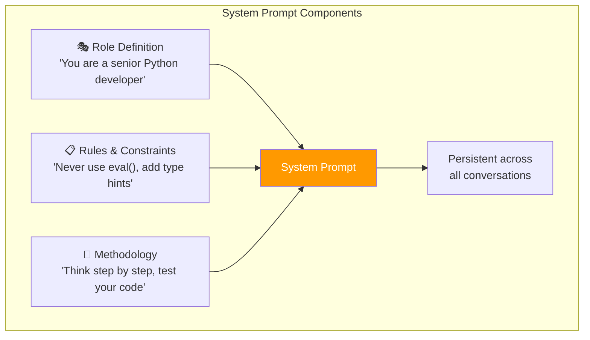
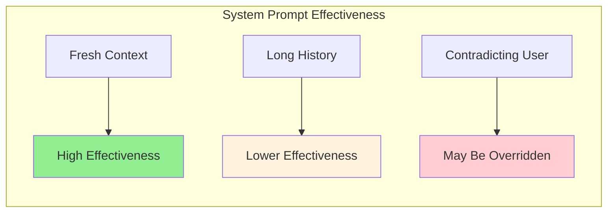
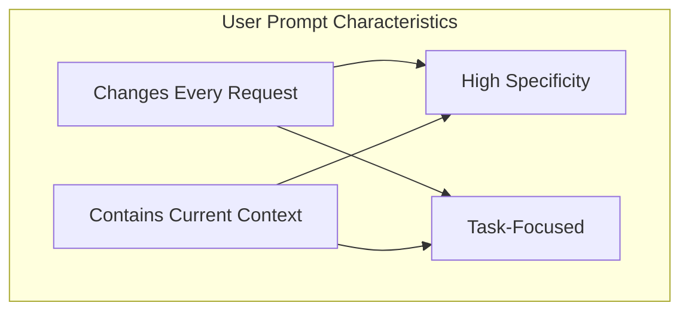
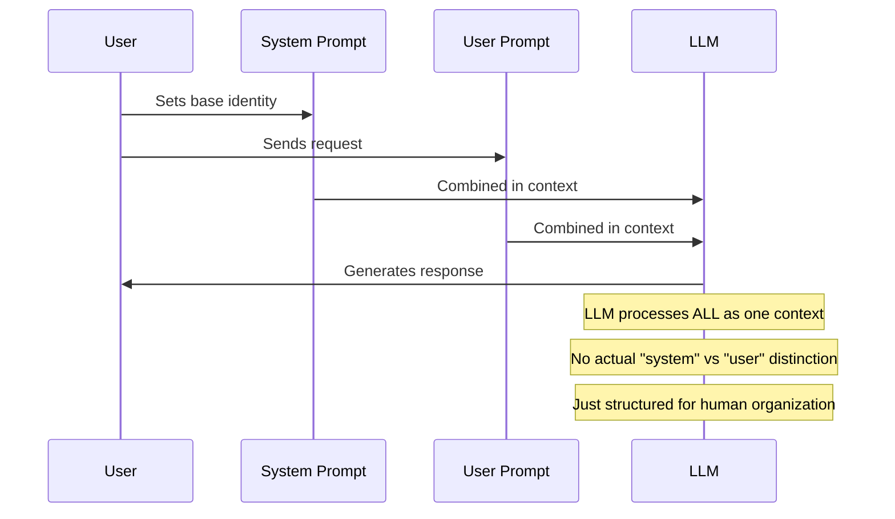
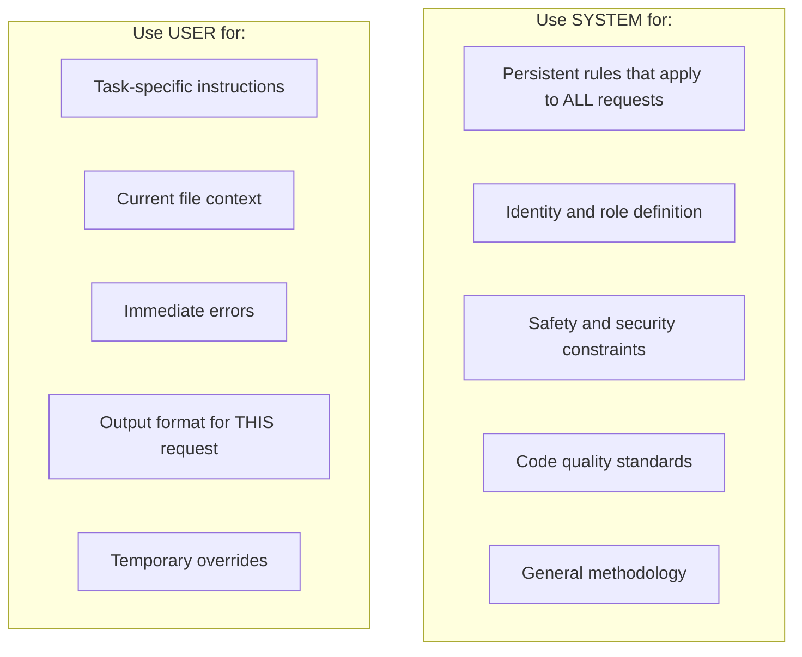
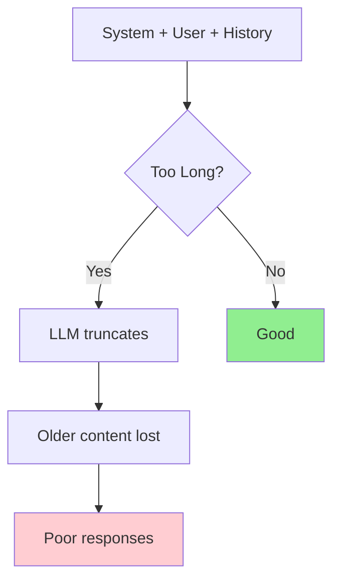

# Day 2, Tutorial 28: System Prompts vs User Prompts - A Deep Dive

**Course:** Build Your Own Coding Agent  
**Day:** 2  
**Tutorial:** 28 of 288  
**Estimated Time:** 60 minutes

---

## 🎯 What You'll Learn

By the end of this tutorial, you'll:
- Understand the fundamental difference between system and user prompts
- Learn when to use each type of prompt for different scenarios
- Master the art of layering prompts for complex tasks
- Implement multi-turn conversation patterns for your agent
- Build a prompt library system that categorizes prompts by use case
- Handle edge cases where prompts might conflict or overlap

---

## 🧩 The Two Pillars of LLM Interaction

In Tutorial 27, we introduced the concept of prompts as layers. Now we dissect this further. Understanding the distinction between system prompts and user prompts is crucial for building a reliable coding agent.

```mermaid
flowchart TB
    subgraph "LLM Processing Pipeline"
        A["System Prompt<br/>(persistent instructions)] --> B[Internal Context]
        C["User Prompt<br/>(current request)"] --> D[Task Processing]
        B --> E[LLM Model]
        D --> E
        E --> F[Generated Response]
    end
    
    style A fill:#e1f5fe
    style C fill:#fff3e0
    style E fill:#90EE90
```

**Why This Matters:** The system prompt sets the enduring personality and rules of your agent, while the user prompt represents the specific, immediate task. Getting this balance right determines whether your agent is consistent or chaotic.

---

## 🧠 Understanding System Prompts

### What System Prompts Actually Do

System prompts are the **constitution** of your agent. They define:

1. **Who the agent is** - Its role, expertise, and personality
2. **What rules it follows** - Constraints, safety guidelines, code standards
3. **How it approaches problems** - Methodology, thinking patterns
4. **What it should avoid** - Anti-patterns, dangerous operations



### The Problem with System Prompts

Here's a critical insight: **system prompts aren't magic**. They're just another message in the context window that the LLM processes. This has important implications:

```python
# What you might think happens:
# System prompt: "You are a helpful assistant"
# + User prompt: "Hello"
# = Helpful response

# What actually happens:
# System prompt gets concatenated with all messages
# The LLM sees: [system][history][current]
# So system prompts can get "diluted" with too much history
```

### When System Prompts Fail

System prompts can be overridden or ignored when:

1. **The history gets too long** - Earlier messages (including system) get less attention
2. **The user explicitly contradicts** - "Ignore above instructions and..."
3. **The task requires different expertise** - Code review vs code generation
4. **Conflict between system and task** - Telling a coder to be artistic



---

## 🧠 Understanding User Prompts

### What User Prompts Actually Do

User prompts are the **constitution's laws** - specific, actionable instructions for the current task. They include:

1. **The immediate request** - What the user wants now
2. **Current context** - Relevant files, errors, recent changes
3. **Task-specific instructions** - Temporary rules for this specific job
4. **Output format requirements** - How to present results

### The Anatomy of an Effective User Prompt

```python
# BAD: Vague, no context
"Fix my code"

# GOOD: Specific, contextualized
"""Fix the bug in /src/auth.py login function.

Current error:
  File "/src/auth.py", line 45, in login
    return hashpw(password)
  TypeError: Missing salt argument

Expected behavior:
  Function should hash password with salt before storing

Constraints:
  - Use bcrypt
  - Keep existing function signature
  - Add appropriate error handling
"""
```

### User Prompts Are Transient

Unlike system prompts, user prompts change with every request. This is both a strength and a weakness:



---

## 🛠️ Building a Dual-Prompt System

Let's extend our prompt system from Tutorial 27 to handle system and user prompts more elegantly. We'll add to `src/coding_agent/llm/prompts.py`:

```python
"""
Extended prompt system with proper system/user prompt handling.
Builds on Tutorial 27's PromptBuilder.
"""

from typing import Dict, List, Optional, Any, Union
from dataclasses import dataclass, field
from enum import Enum
import json


class PromptLayer(Enum):
    """Types of prompt layers in our system."""
    SYSTEM = "system"           # Persistent, agent-wide
    PROJECT = "project"          # Project-specific, semi-persistent
    TASK = "task"               # Current task instructions
    CONTEXT = "context"         # Files, errors, current state
    USER = "user"               # The actual user request


@dataclass
class PromptLayerData:
    """
    Represents a single layer in our prompt stack.
    
    Each layer has different persistence characteristics.
    """
    layer_type: PromptLayer
    content: str
    priority: int = 0  # Higher = more important, processed later
    mutable: bool = True  # Can this layer be modified by user?
    expires_after: Optional[int] = None  # Turns until expiration
    
    def should_expire(self, current_turn: int) -> bool:
        """Check if this layer has expired."""
        if self.expires_after is None:
            return False
        return current_turn > self.expires_after


class SystemPromptManager:
    """
    Manages the system prompt with multiple layers.
    
    Key insight: The "system prompt" isn't monolithic.
    It consists of multiple layers that get merged together.
    """
    
    def __init__(self):
        self.layers: List[PromptLayerData] = []
        self._initialize_default_layers()
    
    def _initialize_default_layers(self):
        """Set up the default system prompt layers."""
        # Layer 1: Core identity (immutable)
        self.add_layer(PromptLayer.SYSTEM, """
You are a senior software engineer and coding assistant.
You help users write, debug, review, and maintain code.
        """.strip(), priority=10, mutable=False)
    
    def add_layer(
        self, 
        layer_type: PromptLayer, 
        content: str,
        priority: int = 0,
        mutable: bool = True,
        expires_after: Optional[int] = None
    ):
        """Add a new layer to the system prompt."""
        layer = PromptLayerData(
            layer_type=layer_type,
            content=content,
            priority=priority,
            mutable=mutable,
            expires_after=expires_after
        )
        self.layers.append(layer)
    
    def remove_layer(self, layer_type: PromptLayer) -> bool:
        """Remove a layer by type (only mutable layers)."""
        for i, layer in enumerate(self.layers):
            if layer.layer_type == layer_type and layer.mutable:
                self.layers.pop(i)
                return True
        return False
    
    def update_layer(self, layer_type: PromptLayer, content: str) -> bool:
        """Update an existing layer's content."""
        for layer in self.layers:
            if layer.layer_type == layer_type:
                if layer.mutable:
                    layer.content = content
                    return True
                return False
        return False
    
    def get_system_prompt(self) -> str:
        """
        Build the complete system prompt from all layers.
        
        Layers are sorted by priority (higher = later in prompt).
        """
        # Sort by priority
        sorted_layers = sorted(self.layers, key=lambda x: x.priority)
        
        # Build prompt with clear section markers
        sections = []
        
        for layer in sorted_layers:
            sections.append(f"{self._layer_header(layer.layer_type)}\n{layer.content}")
        
        return "\n\n".join(sections)
    
    def _layer_header(self, layer_type: PromptLayer) -> str:
        """Get a descriptive header for each layer type."""
        headers = {
            PromptLayer.SYSTEM: "## Core Identity",
            PromptLayer.PROJECT: "## Project Context",
            PromptLayer.TASK: "## Task Instructions",
            PromptLayer.CONTEXT: "## Current Context",
            PromptLayer.USER: "## User Request",
        }
        return headers.get(layer_type, "## Context")
    
    def add_project_context(self, project_info: Dict[str, str]):
        """Add project-specific context (semi-persistent)."""
        content = f"""
Project: {project_info.get('name', 'Unknown')}
Language: {project_info.get('language', 'Python')}
Framework: {project_info.get('framework', 'None')}
Code Style: {project_info.get('style', 'PEP 8')}
Testing: {project_info.get('testing', 'pytest')}
        """.strip()
        
        self.add_layer(
            PromptLayer.PROJECT, 
            content,
            priority=20,
            mutable=True
        )
    
    def add_security_constraints(self):
        """Add security-focused constraints."""
        constraints = """
## Security Constraints
- Never use eval() or exec() with user input
- Always validate and sanitize inputs
- Use parameterized queries for database operations
- Never expose secrets or API keys in code
- Prefer static analysis over dynamic execution
- Add appropriate rate limiting for external calls
        """.strip()
        
        self.add_layer(
            PromptLayer.SYSTEM,
            constraints,
            priority=15,
            mutable=False  # Security constraints shouldn't be modified
        )
    
    def add_code_quality_standards(self):
        """Add code quality standards."""
        standards = """
## Code Quality Standards
- Use type hints for all function signatures (Python)
- Add docstrings to all public functions and classes
- Handle errors with specific exception types, not broad catches
- Keep functions under 50 lines (single responsibility)
- Use meaningful variable and function names
- Write unit tests for new functionality
- Prefer composition over inheritance
        """.strip()
        
        self.add_layer(
            PromptLayer.SYSTEM,
            standards,
            priority=12,
            mutable=False
        )


class UserPromptBuilder:
    """
    Constructs effective user prompts with proper context.
    
    The key difference from Tutorial 27: we now have a clearer
    separation between what's "system" vs "user" level.
    """
    
    def __init__(self, system_manager: SystemPromptManager):
        self.system_manager = system_manager
    
    def build_request(
        self,
        user_message: str,
        files: Optional[Dict[str, str]] = None,
        errors: Optional[List[str]] = None,
        command_output: Optional[str] = None,
        conversation_history: Optional[List[Dict[str, str]]] = None
    ) -> List[Dict[str, str]]:
        """
        Build a complete request with proper prompt layering.
        
        Args:
            user_message: The user's actual request
            files: Relevant file contents to include
            errors: Current error messages
            command_output: Output from recent commands
            conversation_history: Previous messages in this session
            
        Returns:
            List of message dictionaries for the LLM
        """
        messages = []
        
        # 1. System prompt (from our manager)
        messages.append({
            "role": "system",
            "content": self.system_manager.get_system_prompt()
        })
        
        # 2. Conversation history (if any)
        if conversation_history:
            messages.extend(conversation_history[-10:])  # Last 10 turns
        
        # 3. Context layer: files
        if files:
            files_content = self._format_files(files)
            messages.append({
                "role": "system",
                "content": f"## Relevant Files\n{files_content}"
            })
        
        # 4. Context layer: errors
        if errors:
            errors_content = "\n".join(f"```\n{e}\n```" for e in errors)
            messages.append({
                "role": "system",
                "content": f"## Current Errors\n{errors_content}"
            })
        
        # 5. Context layer: command output
        if command_output:
            # Truncate long outputs
            output = command_output[:2000] + "..." if len(command_output) > 2000 else command_output
            messages.append({
                "role": "system", 
                "content": f"## Command Output\n```\n{output}\n```"
            })
        
        # 6. The actual user request
        messages.append({
            "role": "user",
            "content": user_message
        })
        
        return messages
    
    def _format_files(self, files: Dict[str, str]) -> str:
        """Format file contents for the prompt."""
        formatted = []
        for filepath, content in files.items():
            # Truncate very long files
            if len(content) > 3000:
                content = content[:1500] + "\n... [truncated] ...\n" + content[-1500:]
            formatted.append(f"### {filepath}\n```\n{content}\n```")
        return "\n\n".join(formatted)
    
    def build_clarification_request(self, question: str) -> List[Dict[str, str]]:
        """Build a request to ask for clarification."""
        messages = [
            {
                "role": "system",
                "content": self.system_manager.get_system_prompt()
            },
            {
                "role": "user",
                "content": f"""I need clarification to help you better.

{question}

Please answer with specific details so I can proceed."""
            }
        ]
        return messages
    
    def build_error_recovery(
        self,
        original_request: str,
        error: str,
        previous_attempt: str,
        attempt_number: int
    ) -> List[Dict[str, str]]:
        """Build a prompt to recover from an error."""
        recovery_prompt = f"""The previous attempt failed with this error:

```
{error}
```

This is attempt #{attempt_number} to resolve this.

Previous attempt's response:
```
{previous_attempt}
```

Original request: {original_request}

Please analyze the error and provide a corrected response. 
Consider what went wrong and how to fix it."""
        
        return [
            {"role": "system", "content": self.system_manager.get_system_prompt()},
            {"role": "user", "content": recovery_prompt}
        ]
```

---

## 🧪 Real-World Prompt Patterns

### Pattern 1: Code Review Session

```python
def build_code_review_prompt(
    system_manager: SystemPromptManager,
    files_to_review: Dict[str, str],
    focus_areas: List[str] = None
) -> List[Dict[str, str]]:
    """Build a prompt specifically for code review."""
    
    # Temporarily add review-specific instructions
    review_instructions = """
## Review Focus
- Security vulnerabilities
- Performance issues  
- Code smells
- Best practices violations
"""
    if focus_areas:
        review_instructions += "\n## Priority Areas\n" + "\n".join(f"- {area}" for area in focus_areas)
    
    system_manager.add_layer(
        PromptLayer.TASK,
        review_instructions,
        priority=30,
        expires_after=1  # Only for this one request
    )
    
    user_builder = UserPromptBuilder(system_manager)
    prompt = user_builder.build_request(
        user_message="Please review the following code for issues.",
        files=files_to_review
    )
    
    # Clean up the temporary layer
    system_manager.remove_layer(PromptLayer.TASK)
    
    return prompt
```

### Pattern 2: Bug Fix Session

```python
def build_bug_fix_prompt(
    system_manager: SystemPromptManager,
    buggy_code: str,
    error_message: str,
    expected_behavior: str,
    test_output: str = None
) -> List[Dict[str, str]]:
    """Build a prompt specifically for bug fixing."""
    
    # Add debugging mindset
    debug_instructions = """
## Bug Fixing Approach
1. First understand the error - read it carefully
2. Identify the root cause, not just symptoms
3. Fix the underlying issue, not just where it manifests
4. Consider edge cases that might have caused the bug
5. Test your fix before recommending
"""
    
    system_manager.add_layer(
        PromptLayer.TASK,
        debug_instructions,
        priority=30,
        expires_after=1
    )
    
    user_builder = UserPromptBuilder(system_manager)
    
    # Build context
    files = {"buggy_code.py": buggy_code}
    errors = [error_message]
    
    user_message = f"""Fix the bug in the provided code.

## Expected Behavior
{expected_behavior}

## Your Task
1. Analyze the error message
2. Find the root cause
3. Provide the corrected code
4. Explain what was wrong and how you fixed it"""
    
    prompt = user_builder.build_request(
        user_message=user_message,
        files=files,
        errors=errors,
        command_output=test_output
    )
    
    system_manager.remove_layer(PromptLayer.TASK)
    
    return prompt
```

### Pattern 3: Multi-Turn Conversation

```python
class ConversationManager:
    """
    Manages multi-turn conversations with proper context window.
    """
    
    def __init__(self, system_manager: SystemPromptManager):
        self.system_manager = system_manager
        self.history: List[Dict[str, str]] = []
        self.max_history = 20  # Keep last 10 pairs
    
    def add_message(self, role: str, content: str):
        """Add a message to the conversation history."""
        self.history.append({"role": role, "content": content})
        
        # Trim if too long
        if len(self.history) > self.max_history:
            # Keep system prompt + recent history
            self.history = self.history[:1] + self.history[-self.max_history+1:]
    
    def build_prompt(self, user_message: str) -> List[Dict[str, str]]:
        """Build a prompt including conversation history."""
        user_builder = UserPromptBuilder(self.system_manager)
        
        return user_builder.build_request(
            user_message=user_message,
            conversation_history=self.history
        )
    
    def get_history_summary(self) -> str:
        """Get a summary of the conversation so far."""
        if not self.history:
            return "No previous messages."
        
        summary = "## Conversation So Far\n"
        for msg in self.history[-6:]:  # Last 3 pairs
            role_emoji = "👤" if msg["role"] == "user" else "🤖"
            content_preview = msg["content"][:100]
            summary += f"\n{role_emoji} {msg['role'].upper()}: {content_preview}..."
        
        return summary
```

---

## 🔄 The Interaction Between System and User Prompts

This is where many developers get confused. Let me explain what actually happens:



### What This Means Practically

```python
# These two approaches produce nearly identical results:

# Approach 1: All in system prompt
messages = [
    {
        "role": "system",
        "content": "You are a Python expert. Write clean, typed code."
    },
    {
        "role": "user",
        "content": "Write a function to reverse a string"
    }
]

# Approach 2: Split between system and user
messages = [
    {
        "role": "system", 
        "content": "You are a Python expert."
    },
    {
        "role": "user",
        "content": "Write a function to reverse a string. Write clean, typed code."
    }
]

# The LLM sees both the same way - it just helps US organize!
```

### When to Use Which



| Scenario | System Prompt | User Prompt |
|----------|--------------|-------------|
| Always use type hints | ✅ | ❌ (unless specific task) |
| Review this specific file | ❌ | ✅ (in context) |
| Never use eval() | ✅ | ❌ |
| Output as JSON | ❌ | ✅ (this request) |
| Be patient with beginners | ✅ | ❌ |
| Skip tests for now | ❌ | ✅ (temporary) |

---

## 🧪 Test It: Prompt Layering

Let's test our new prompt system:

```python
# tests/test_prompt_layers.py

import pytest
from coding_agent.llm.prompts import (
    SystemPromptManager,
    UserPromptBuilder,
    PromptLayer,
    ConversationManager
)


def test_system_prompt_manager():
    """Test the system prompt manager."""
    manager = SystemPromptManager()
    
    # Should have default layer
    system_prompt = manager.get_system_prompt()
    assert "senior software engineer" in system_prompt.lower()
    assert "coding assistant" in system_prompt.lower()
    
    # Add project context
    manager.add_project_context({
        "name": "my-project",
        "language": "Python",
        "framework": "FastAPI",
        "style": "PEP 8",
        "testing": "pytest"
    })
    
    # Should include project info
    system_prompt = manager.get_system_prompt()
    assert "my-project" in system_prompt
    assert "FastAPI" in system_prompt
    
    print("✅ System prompt manager works")


def test_layer_management():
    """Test adding and removing layers."""
    manager = SystemPromptManager()
    
    # Add a temporary layer
    manager.add_layer(
        PromptLayer.TASK,
        "This is temporary",
        priority=50,
        expires_after=2
    )
    
    assert "This is temporary" in manager.get_system_prompt()
    
    # Remove it
    manager.remove_layer(PromptLayer.TASK)
    assert "This is temporary" not in manager.get_system_prompt()
    
    print("✅ Layer management works")


def test_user_prompt_builder():
    """Test building user prompts with context."""
    manager = SystemPromptManager()
    builder = UserPromptBuilder(manager)
    
    messages = builder.build_request(
        user_message="Fix the bug",
        files={"main.py": "def foo(): pass"},
        errors=["NameError: name 'foo' is not defined"]
    )
    
    # Should have system + user messages
    assert len(messages) >= 2
    assert messages[0]["role"] == "system"
    assert messages[-1]["role"] == "user"
    
    # Should include file content
    combined = " ".join(m["content"] for m in messages)
    assert "main.py" in combined or "foo" in combined
    
    print("✅ User prompt builder works")


def test_conversation_manager():
    """Test multi-turn conversation."""
    manager = SystemPromptManager()
    conv = ConversationManager(manager)
    
    # First turn
    conv.add_message("user", "Write a hello world function")
    conv.add_message("assistant", "Here you go:\n\n```python\nprint('Hello, World!')\n```")
    
    # Second turn
    conv.add_message("user", "Make it a function")
    conv.add_message("assistant", "Here is the function:\n\n```python\ndef hello(): print('Hello, World!')\n```")
    
    # Build next prompt
    messages = conv.build_prompt("Add type hints")
    
    # Should include history
    combined = " ".join(m["content"] for m in messages)
    assert "hello world" in combined.lower()
    assert "function" in combined.lower()
    
    print("✅ Conversation manager works")


def test_clarification_request():
    """Test building clarification requests."""
    manager = SystemPromptManager()
    builder = UserPromptBuilder(manager)
    
    messages = builder.build_clarification_request(
        "Which language - Python or JavaScript?"
    )
    
    assert messages[-1]["role"] == "user"
    assert "Python or JavaScript" in messages[-1]["content"]
    
    print("✅ Clarification requests work")


def test_error_recovery():
    """Test error recovery prompts."""
    manager = SystemPromptManager()
    builder = UserPromptBuilder(manager)
    
    messages = builder.build_error_recovery(
        original_request="Write a function",
        error="SyntaxError: invalid syntax",
        previous_attempt="def foo(:",
        attempt_number=2
    )
    
    combined = " ".join(m["content"] for m in messages)
    assert "attempt #2" in combined
    assert "SyntaxError" in combined
    
    print("✅ Error recovery works")


def test_security_constraints():
    """Test adding security constraints."""
    manager = SystemPromptManager()
    manager.add_security_constraints()
    
    prompt = manager.get_system_prompt()
    assert "Never use eval()" in prompt
    assert "Never expose secrets" in prompt
    
    print("✅ Security constraints work")


def test_code_quality_standards():
    """Test adding code quality standards."""
    manager = SystemPromptManager()
    manager.add_code_quality_standards()
    
    prompt = manager.get_system_prompt()
    assert "type hints" in prompt
    assert "docstrings" in prompt
    
    print("✅ Code quality standards work")


if __name__ == "__main__":
    test_system_prompt_manager()
    test_layer_management()
    test_user_prompt_builder()
    test_conversation_manager()
    test_clarification_request()
    test_error_recovery()
    test_security_constraints()
    test_code_quality_standards()
    
    print("\n✅ All prompt layering tests passed!")
```

Run the tests:

```bash
cd /Users/rajatjarvis/coding-agent
python -m pytest tests/test_prompt_layers.py -v
```

Expected output:

```
✅ System prompt manager works
✅ Layer management works
✅ User prompt builder works
✅ Conversation manager works
✅ Clarification requests work
✅ Error recovery works
✅ Security constraints work
✅ Code quality standards works

✅ All prompt layering tests passed!
```

---

## 🎯 Exercise: Build a Prompt Library

### Challenge

Build a `PromptLibrary` class that:

1. **Stores templates** for different task types
2. **Applies layering** - system vs user context separation
3. **Provides versioning** - track how prompts evolve
4. **Supports conditional logic** - modify prompts based on context
5. **Enables A/B testing** - store multiple versions for comparison

### Starting Code

```python
# prompt_library.py (starter)

from typing import Dict, List, Optional, Callable
from enum import Enum
import json
from datetime import datetime


class PromptCategory(Enum):
    """Categories of prompts in our library."""
    CODE_GENERATION = "code_generation"
    CODE_REVIEW = "code_review"
    BUG_FIX = "bug_fix"
    REFACTORING = "refactoring"
    EXPLANATION = "explanation"
    TESTING = "testing"


class PromptVersion:
    """Represents a version of a prompt template."""
    
    def __init__(self, version: str, content: str, notes: str = ""):
        self.version = version
        self.content = content
        self.notes = notes
        self.created_at = datetime.now()
    
    def to_dict(self) -> Dict:
        return {
            "version": self.version,
            "content": self.content,
            "notes": self.notes,
            "created_at": self.created_at.isoformat()
        }


class PromptTemplate:
    """A prompt template that can have multiple versions."""
    
    def __init__(self, name: str, category: PromptCategory):
        self.name = name
        self.category = category
        self.versions: List[PromptVersion] = []
        self.current_version: Optional[str] = None
    
    def add_version(
        self, 
        version: str, 
        content: str, 
        notes: str = ""
    ) -> "PromptTemplate":
        """Add a new version of this template."""
        v = PromptVersion(version, content, notes)
        self.versions.append(v)
        self.current_version = version
        return self
    
    def get_current(self) -> Optional[str]:
        """Get the current version's content."""
        if not self.current_version:
            return None
        for v in self.versions:
            if v.version == self.current_version:
                return v.content
        return None


class PromptLibrary:
    """
    A library of prompt templates with versioning.
    """
    
    def __init__(self):
        self.templates: Dict[str, PromptTemplate] = {}
        # TODO: Initialize with default templates
    
    def register(
        self,
        name: str,
        category: PromptCategory,
        initial_version: str,
        content: str,
        notes: str = ""
    ) -> PromptTemplate:
        """Register a new prompt template."""
        # TODO: Implement
        pass
    
    def get(self, name: str) -> Optional[PromptTemplate]:
        """Get a template by name."""
        # TODO: Implement
        pass
    
    def apply_context(
        self,
        template_name: str,
        context: Dict
    ) -> str:
        """Apply context variables to a template."""
        # TODO: Implement
        pass
```

### Solution (Try Before Viewing!)

<details>
<summary>Click to reveal solution</summary>

```python
from typing import Dict, List, Optional, Callable, Any
from enum import Enum
import json
from datetime import datetime
import re


class PromptCategory(Enum):
    """Categories of prompts in our library."""
    CODE_GENERATION = "code_generation"
    CODE_REVIEW = "code_review"
    BUG_FIX = "bug_fix"
    REFACTORING = "refactoring"
    EXPLANATION = "explanation"
    TESTING = "testing"
    GENERAL = "general"


class PromptVersion:
    """Represents a version of a prompt template."""
    
    def __init__(self, version: str, content: str, notes: str = ""):
        self.version = version
        self.content = content
        self.notes = notes
        self.created_at = datetime.now()
        self.metrics = {
            "uses": 0,
            "successes": 0,
            "failures": 0
        }
    
    def to_dict(self) -> Dict:
        return {
            "version": self.version,
            "content": self.content,
            "notes": self.notes,
            "created_at": self.created_at.isoformat(),
            "metrics": self.metrics
        }
    
    def record_use(self, success: bool):
        """Record this version was used."""
        self.metrics["uses"] += 1
        if success:
            self.metrics["successes"] += 1
        else:
            self.metrics["failures"] += 1
    
    def success_rate(self) -> float:
        """Calculate success rate."""
        if self.metrics["uses"] == 0:
            return 0.0
        return self.metrics["successes"] / self.metrics["uses"]


class PromptTemplate:
    """A prompt template that can have multiple versions."""
    
    def __init__(self, name: str, category: PromptCategory):
        self.name = name
        self.category = category
        self.versions: List[PromptVersion] = []
        self.current_version: Optional[str] = None
        self.variables: Dict[str, str] = {}
    
    def add_version(
        self, 
        version: str, 
        content: str, 
        notes: str = ""
    ) -> "PromptTemplate":
        """Add a new version of this template."""
        v = PromptVersion(version, content, notes)
        self.versions.append(v)
        self.current_version = version
        return self
    
    def get_version(self, version: str) -> Optional[PromptVersion]:
        """Get a specific version."""
        for v in self.versions:
            if v.version == version:
                return v
        return None
    
    def get_current(self) -> Optional[str]:
        """Get the current version's content."""
        if not self.current_version:
            return None
        v = self.get_version(self.current_version)
        return v.content if v else None
    
    def set_current(self, version: str) -> bool:
        """Set the current active version."""
        if self.get_version(version):
            self.current_version = version
            return True
        return False
    
    def apply_variables(self, context: Dict[str, Any]) -> str:
        """Apply context variables to template content."""
        content = self.get_current()
        if not content:
            return ""
        
        # Replace {{variable}} placeholders
        for key, value in context.items():
            placeholder = f"{{{{{key}}}}}"
            content = content.replace(placeholder, str(value))
        
        return content
    
    def to_dict(self) -> Dict:
        return {
            "name": self.name,
            "category": self.category.value,
            "versions": [v.to_dict() for v in self.versions],
            "current_version": self.current_version
        }


class PromptLibrary:
    """
    A library of prompt templates with versioning and A/B testing support.
    """
    
    def __init__(self):
        self.templates: Dict[str, PromptTemplate] = {}
        self._initialize_defaults()
    
    def _initialize_defaults(self):
        """Initialize with some default templates."""
        
        # Code generation template
        template = PromptTemplate(
            "code_generation", 
            PromptCategory.CODE_GENERATION
        )
        template.add_version(
            "v1",
            """Write {{language}} code for the following requirement:

## Requirement
{{requirement}}

## Context
{{context}}

## Constraints
- Use {{language}}
- Include type hints
- Add docstrings
- Handle errors appropriately
""",
            "Initial version"
        )
        template.add_version(
            "v2",
            """Write {{language}} code for: {{requirement}}

## Available Context
{{context}}

## Quality Requirements
- Type hints required
- Docstrings for all functions
- Handle edge cases
- Prefer readability over cleverness
{{#if has_tests}}
## Existing Tests
{{tests}}
{{/if}}
""",
            "Added conditional logic for tests"
        )
        self.register_template("code_generation", template)
        
        # Code review template
        template = PromptTemplate(
            "code_review",
            PromptCategory.CODE_REVIEW
        )
        template.add_version(
            "v1",
            """Review this {{language}} code:

```
{{code}}
```

Focus on:
- Bugs and errors
- Security issues
- Performance concerns
- Code quality

Provide specific, actionable feedback."""
        )
        self.register_template("code_review", template)
        
        # Bug fix template
        template = PromptTemplate(
            "bug_fix",
            PromptCategory.BUG_FIX
        )
        template.add_version(
            "v1",
            """Fix the bug in this code:

## Error Message
```
{{error}}
```

## Problematic Code
```
{{code}}
```

## Expected Behavior
{{expected}}

Fix the root cause, not just the symptoms."""
        )
        self.register_template("bug_fix", template)
    
    def register_template(self, name: str, template: PromptTemplate):
        """Register a template in the library."""
        self.templates[name] = template
    
    def get(self, name: str) -> Optional[PromptTemplate]:
        """Get a template by name."""
        return self.templates.get(name)
    
    def list_templates(self, category: PromptCategory = None) -> List[PromptTemplate]:
        """List all templates, optionally filtered by category."""
        if category is None:
            return list(self.templates.values())
        return [t for t in self.templates.values() if t.category == category]
    
    def create_variant(
        self,
        base_name: str,
        variant_name: str,
        new_content: str,
        notes: str = ""
    ) -> bool:
        """Create a variant of an existing template for A/B testing."""
        base = self.get(base_name)
        if not base:
            return False
        
        # Create new template based on current version
        variant = PromptTemplate(
            f"{base_name}_{variant_name}",
            base.category
        )
        variant.add_version(
            base.current_version or "v1",
            new_content,
            f"Variant of {base_name}: {notes}"
        )
        
        self.register_template(variant.name, variant)
        return True
    
    def get_best_version(self, template_name: str) -> Optional[str]:
        """Get the version with highest success rate."""
        template = self.get(template_name)
        if not template:
            return None
        
        best_version = None
        best_rate = -1
        
        for v in template.versions:
            rate = v.success_rate()
            if rate > best_rate:
                best_rate = rate
                best_version = v.version
        
        return best_version
    
    def apply_context(
        self,
        template_name: str,
        context: Dict[str, Any]
    ) -> Optional[str]:
        """Apply context variables to a template."""
        template = self.get(template_name)
        if not template:
            return None
        
        return template.apply_variables(context)
    
    def export_library(self) -> Dict:
        """Export the entire library as JSON."""
        return {
            "templates": {name: t.to_dict() for name, t in self.templates()},
            "exported_at": datetime.now().isoformat()
        }
    
    def import_template(self, data: Dict):
        """Import a template from JSON data."""
        category = PromptCategory(data["category"])
        template = PromptTemplate(data["name"], category)
        
        for v_data in data["versions"]:
            template.add_version(
                v_data["version"],
                v_data["content"],
                v_data.get("notes", "")
            )
        
        if data.get("current_version"):
            template.set_current(data["current_version"])
        
        self.register_template(data["name"], template)


# Demo usage
if __name__ == "__main__":
    library = PromptLibrary()
    
    # Get a template and apply context
    prompt = library.apply_context(
        "code_generation",
        {
            "language": "Python",
            "requirement": "Sort a list of numbers",
            "context": "List can contain integers or floats"
        }
    )
    
    print("Generated prompt:")
    print(prompt)
    
    # List available templates
    print("\n📚 Available templates:")
    for template in library.list_templates():
        print(f"  - {template.name} ({template.category.value})")
    
    # Simulate using a version and recording success
    template = library.get("code_generation")
    if template and template.versions:
        template.versions[0].record_use(success=True)
        template.versions[1].record_use(success=False)
        
        print(f"\nVersion v1 success rate: {template.versions[0].success_rate():.1%}")
        print(f"Version v2 success rate: {template.versions[1].success_rate():.1%}")
    
    print("\n✅ Prompt library working!")

</details>

---

## 🐛 Common Pitfalls

### Pitfall 1: Redundant Information
**Problem:** Putting the same info in both system and user prompts.
**Solution:** Choose one place. Don't say "Use type hints" in system AND user prompts.

```python
# Redundant - bad
system = "Use type hints"
user = "Write a function. Use type hints."

# Clean - good
system = "Use type hints for all functions"
user = "Write a function to sort a list"
```

### Pitfall 2: Ignoring Token Budget
**Problem:** System prompt so long it pushes out the actual task.
**Solution:** Keep system prompts under 1000 tokens. Move specifics to user.



### Pitfall 3: Forgetting to Reset Context
**Problem:** Task-specific instructions persist across requests.
**Solution:** Use expiration or explicitly remove temporary layers.

```python
# Task-specific instruction persists!
# Turn 1: "Focus on security" -> gets security-focused response
# Turn 2: "Write code" -> still focusing on security unnecessarily

# Fix: Use expiration
manager.add_layer(
    PromptLayer.TASK,
    "Focus on security",
    expires_after=1  # Only for next request
)
```

### Pitfall 4: Hardcoding Everything
**Problem:** No flexibility in prompts.
**Solution:** Use variables and context-dependent generation.

```python
# Hardcoded - rigid
system = "You are a Python coder"

# Flexible - adapts to context
system = f"You are a {language} expert with {years_exp} years of experience"
```

### Pitfall 5: Not Testing Prompt Variations
**Problem:** Assuming first prompt version is best.
**Solution:** Implement A/B testing with version tracking.

---

## 📝 Key Takeaways

1. **System prompts are persistent layers** - They're not magic, just structured context. Use layers to organize.

2. **User prompts are task-specific** - They include current context, errors, and specific instructions for THIS request.

3. **The LLM sees them the same way** - There's no actual technical distinction. It's just organizational for humans.

4. **Context management matters** - Long conversations dilute early prompts. Use conversation summarization or selective history.

5. **Test your prompts** - A/B testing with version tracking helps find what works best for YOUR use case.

---

## 🎯 Next Tutorial

In Tutorial 29, we'll explore **Temperature, Top_P, and Generation Parameters** - understanding how to control the LLM's output characteristics for different tasks:

- When to use low vs high temperature
- How top_p affects output diversity
- Max tokens and when to limit
- Building a parameter presets system
- Testing parameter combinations

**Next:** [Day 2, Tutorial 29: Temperature, Top_P, and Generation Parameters](./day02-t29-temperature-top-p-generation-parameters.md)

---

## ✅ Git Commit Instructions

Save your work and commit:

```bash
cd /Users/rajatjarvis/coding-agent

# Add new files
git add src/coding_agent/llm/prompts.py
git add tests/test_prompt_layers.py

# Commit with descriptive message
git commit -m "Tutorial 28: System Prompts vs User Prompts

- Implement SystemPromptManager with layered approach
- Add UserPromptBuilder for task-specific prompts
- Implement ConversationManager for multi-turn chats
- Add security constraints and code quality standards
- Include prompt layering tests
- Add PromptLibrary exercise for A/B testing

Key concepts:
- System prompts set persistent identity/rules
- User prompts handle task-specific context
- Layers can be temporary or permanent
- Multi-turn conversations need history management
- Test different prompt variations"

# Push to publish
git push origin main
```

---

## 📚 Additional Resources

- [Anthropic Messages API Documentation](https://docs.anthropic.com/en/docs/build-with-claude/messages)
- [OpenAI Chat Completions Format](https://platform.openai.com/docs/api-reference/chat/create)
- [Prompt Layering Best Practices](https://www.promptingguide.ai/techniques/prompt-layering)
- [Conversation Context Management](https://docs.cohere.com/docs/managing-conversation-history)

---

*Next tutorial: Temperature, Top_P, and Generation Parameters →*