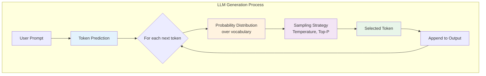
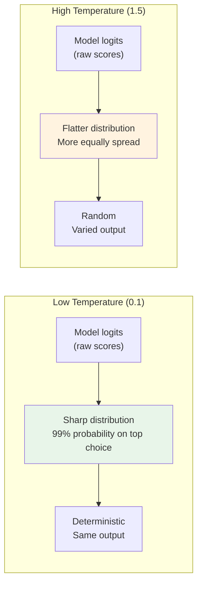
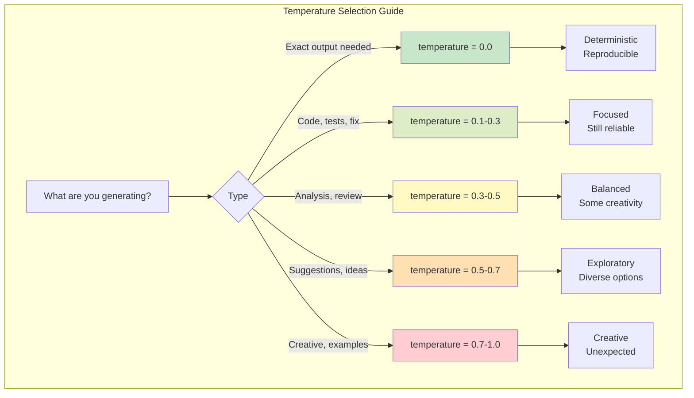
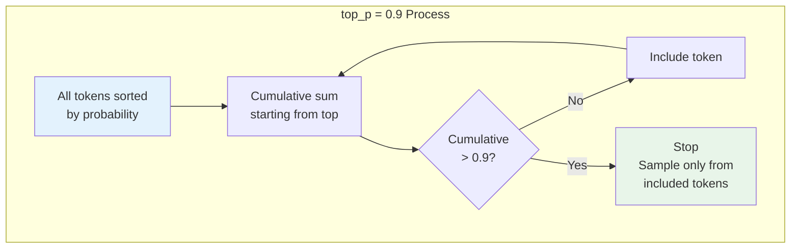
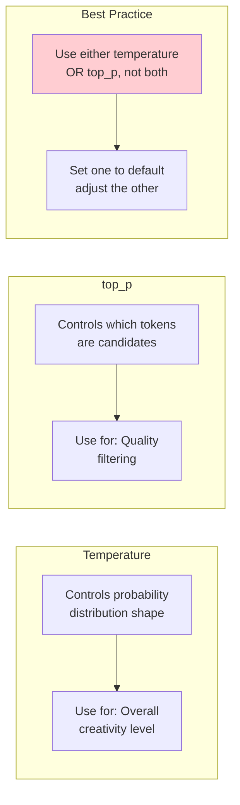
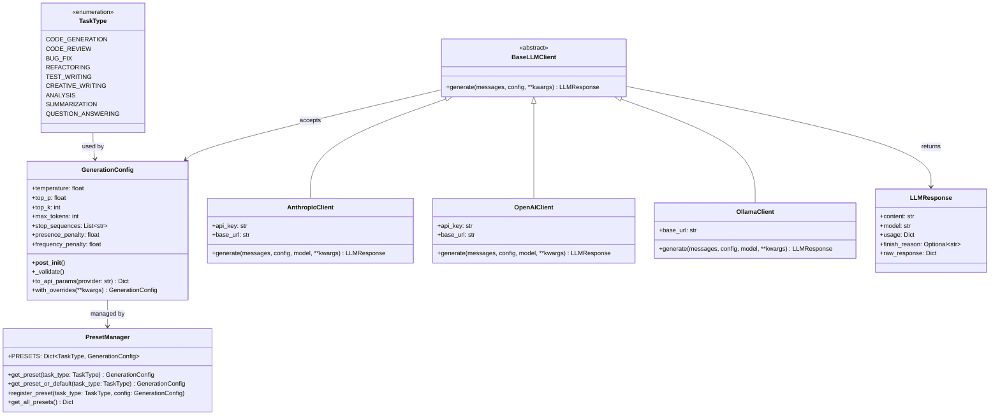

# Day 2, Tutorial 29: Temperature, top_p, and Generation Parameters

**Course:** Build Your Own Coding Agent  
**Day:** 2  
**Tutorial:** 29 of 288  
**Estimated Time:** 45 minutes

---

## 🎯 What You'll Learn

By the end of this tutorial, you'll:
- Understand what temperature controls in LLM generation
- Learn when to use low vs high temperature settings
- Master top_p (nucleus sampling) and when to use it
- Implement a flexible generation parameters system
- Build parameter presets for different tasks (coding vs creative)
- Handle parameter validation and defaults gracefully

---

## 🔄 Where We Left Off

In Tutorial 28, we built a sophisticated prompt management system with:
- `PromptLayer` enum for categorizing system prompts
- `SystemPromptManager` for layered prompt composition
- `UserPromptBuilder` for contextual user requests
- `ConversationManager` for multi-turn history

Now we add the final piece for controlling LLM output: **generation parameters**. These knobs let us control how "creative" vs "deterministic" our agent's responses are.

---

## 🧩 Understanding Generation Parameters

When you call an LLM, you're not just sending a prompt—you're also controlling *how* the model generates its response. Think of it like adjusting a guitar's EQ: same input, different output characteristics.



### Why Parameters Matter for a Coding Agent

Your coding agent needs different "modes" depending on the task:

| Task | Desired Behavior | Temperature |
|------|------------------|-------------|
| Writing tests | Exact, deterministic | 0.0 - 0.2 |
| Bug fixes | Careful, precise | 0.1 - 0.3 |
| Code review | Analytical, thorough | 0.2 - 0.4 |
| Refactoring suggestions | Balanced | 0.3 - 0.5 |
| Creative solutions | Diverse ideas | 0.5 - 0.7 |
| Generating examples | Varied, illustrative | 0.7 - 1.0 |

---

## 🧠 Temperature Deep Dive

### What Temperature Actually Does

Temperature scales the probability distribution before sampling. Mathematically:

```
new_probability = exp(log(original_probability) / temperature)
```

Then probabilities are renormalized to sum to 1.



### Visualizing Temperature Effects

Let's see what this looks like in practice:

```python
# Imagine vocabulary: ["cat", "dog", "elephant"]
# Raw logits from model: [2.0, 1.0, 0.5]

# Temperature 0.1 (deterministic)
# exp(2.0/0.1) = exp(20) ≈ 4.85e8
# exp(1.0/0.1) = exp(10) ≈ 22026
# exp(0.5/0.1) = exp(5)   ≈ 148
# Result: ~99.96% "cat", tiny amounts for others

# Temperature 1.0 (balanced)
# exp(2.0/1.0) = exp(2) ≈ 7.39
# exp(1.0/1.0) = exp(1) ≈ 2.72
# exp(0.5/1.0) = exp(0.5) ≈ 1.65
# Result: ~61% "cat", 22% "dog", 14% "elephant"

# Temperature 2.0 (random)
# exp(2.0/2.0) = exp(1) ≈ 2.72
# exp(1.0/2.0) = exp(0.5) ≈ 1.65
# exp(0.5/2.0) = exp(0.25) ≈ 1.28
# Result: ~40% "cat", 24% "dog", 19% "elephant"
```

### When to Use Each Temperature



---

## 🧠 Understanding top_p (Nucleus Sampling)

### The Problem top_p Solves

Sometimes temperature isn't enough. Consider this scenario:

```python
# Model produces these probabilities:
# "func" = 0.45
# "function" = 0.30  
# "fund" = 0.10
# "funk" = 0.05
# ... 10,000 other tokens with tiny probabilities
```

With high temperature, you might randomly pick "funk" when you wanted "function"!

### How top_p Works

top_p (nucleus sampling) fixes this by only considering the smallest set of tokens that together account for `p` probability mass:



### Example: top_p in Action

```python
# Token probabilities (sorted):
# "function"  = 0.50
# "func"       = 0.25  # cumulative: 0.75
# "fund"       = 0.10  # cumulative: 0.85
# "funky"      = 0.08  # cumulative: 0.93 ← STOP here for top_p=0.9
# "funk"       = 0.05  # excluded
# ... rest excluded

# Result: Only sample from {"function", "func", "fund", "funky"}
# This prevents weird tokens while maintaining some randomness
```

### Temperature vs top_p: When to Use Which



**General rule:** Set `temperature` to 0 and adjust `top_p` for focused tasks. Use temperature for creative control.

---

## 🛠️ Building Our Generation Parameters System

Now let's build a complete system for managing generation parameters. We'll extend our LLM client module.

### The Parameter Configuration Class

```python
# File: src/coding_agent/llm/generation_config.py
"""
Generation parameters configuration for LLM calls.
Provides presets for different task types and validation.
"""

from dataclasses import dataclass, field
from enum import Enum
from typing import Optional, Dict, Any, List
import math


class TaskType(Enum):
    """Types of tasks the agent can perform."""
    CODE_GENERATION = "code_generation"
    CODE_REVIEW = "code_review"
    BUG_FIX = "bug_fix"
    REFACTORING = "refactoring"
    TEST_WRITING = "test_writing"
    CREATIVE_WRITING = "creative_writing"
    ANALYSIS = "analysis"
    SUMMARIZATION = "summarization"
    QUESTION_ANSWERING = "question_answering"


@dataclass
class GenerationConfig:
    """
    Configuration for LLM text generation.
    
    Attributes:
        temperature: Controls randomness (0.0 = deterministic, 1.5+ = very random)
        top_p: Nucleus sampling threshold (0.0-1.0)
        top_k: Limits vocabulary to top k tokens (0 = disabled)
        max_tokens: Maximum tokens to generate
        stop_sequences: Sequences that stop generation
        presence_penalty: Penalize repeated tokens
        frequency_penalty: Penalize frequent tokens
    """
    temperature: float = 0.7
    top_p: float = 1.0
    top_k: int = 0
    max_tokens: int = 4096
    stop_sequences: List[str] = field(default_factory=list)
    presence_penalty: float = 0.0
    frequency_penalty: float = 0.0
    
    def __post_init__(self):
        """Validate parameters after initialization."""
        self._validate()
    
    def _validate(self):
        """Validate parameter ranges."""
        if not 0.0 <= self.temperature <= 2.0:
            raise ValueError(
                f"Temperature must be 0.0-2.0, got {self.temperature}"
            )
        if not 0.0 <= self.top_p <= 1.0:
            raise ValueError(f"top_p must be 0.0-1.0, got {self.top_p}")
        if self.top_k < 0:
            raise ValueError(f"top_k must be >= 0, got {self.top_k}")
        if self.max_tokens <= 0:
            raise ValueError(f"max_tokens must be > 0, got {self.max_tokens}")
        if not -2.0 <= self.presence_penalty <= 2.0:
            raise ValueError(
                f"presence_penalty must be -2.0-2.0, got {self.presence_penalty}"
            )
        if not -2.0 <= self.frequency_penalty <= 2.0:
            raise ValueError(
                f"frequency_penalty must be -2.0-2.0, got {self.frequency_penalty}"
            )
    
    def to_api_params(self, provider: str = "anthropic") -> Dict[str, Any]:
        """
        Convert to API-specific parameters.
        
        Different providers have different parameter names and ranges.
        """
        if provider == "anthropic":
            return {
                "temperature": self.temperature,
                "top_p": self.top_p,
                "top_k": self.top_k if self.top_k > 0 else None,
                "max_tokens": self.max_tokens,
                "stop_sequences": self.stop_sequences or None,
            }
        elif provider == "openai":
            return {
                "temperature": self.temperature,
                "top_p": self.top_p,
                "max_tokens": self.max_tokens,
                "stop": self.stop_sequences or None,
                "presence_penalty": self.presence_penalty,
                "frequency_penalty": self.frequency_penalty,
            }
        elif provider == "ollama":
            # Ollama uses different parameter names
            return {
                "temperature": self.temperature,
                "top_p": self.top_p,
                "top_k": self.top_k if self.top_k > 0 else 40,
                "num_predict": self.max_tokens,
                "stop": self.stop_sequences,
            }
        else:
            raise ValueError(f"Unknown provider: {provider}")
    
    def with_overrides(self, **kwargs) -> "GenerationConfig":
        """Create a new config with some parameters overridden."""
        current = {
            "temperature": self.temperature,
            "top_p": self.top_p,
            "top_k": self.top_k,
            "max_tokens": self.max_tokens,
            "stop_sequences": self.stop_sequences.copy(),
            "presence_penalty": self.presence_penalty,
            "frequency_penalty": self.frequency_penalty,
        }
        current.update(kwargs)
        return GenerationConfig(**current)


class PresetManager:
    """
    Manages preset configurations for different task types.
    """
    
    # Preset configurations for common tasks
    PRESETS: Dict[TaskType, GenerationConfig] = {
        TaskType.CODE_GENERATION: GenerationConfig(
            temperature=0.2,
            top_p=0.95,
            max_tokens=4096,
        ),
        TaskType.CODE_REVIEW: GenerationConfig(
            temperature=0.3,
            top_p=0.9,
            max_tokens=2048,
        ),
        TaskType.BUG_FIX: GenerationConfig(
            temperature=0.1,
            top_p=0.9,
            max_tokens=2048,
        ),
        TaskType.REFACTORING: GenerationConfig(
            temperature=0.25,
            top_p=0.95,
            max_tokens=4096,
        ),
        TaskType.TEST_WRITING: GenerationConfig(
            temperature=0.1,
            top_p=0.9,
            max_tokens=4096,
        ),
        TaskType.CREATIVE_WRITING: GenerationConfig(
            temperature=0.8,
            top_p=0.95,
            max_tokens=2048,
        ),
        TaskType.ANALYSIS: GenerationConfig(
            temperature=0.4,
            top_p=0.9,
            max_tokens=2048,
        ),
        TaskType.SUMMARIZATION: GenerationConfig(
            temperature=0.2,
            top_p=0.9,
            max_tokens=1024,
        ),
        TaskType.QUESTION_ANSWERING: GenerationConfig(
            temperature=0.3,
            top_p=0.95,
            max_tokens=1024,
        ),
    }
    
    @classmethod
    def get_preset(cls, task_type: TaskType) -> GenerationConfig:
        """Get the preset configuration for a task type."""
        return cls.PRESETS[task_type]
    
    @classmethod
    def get_preset_or_default(cls, task_type: Optional[TaskType]) -> GenerationConfig:
        """Get preset or return sensible default."""
        if task_type is None:
            return GenerationConfig()  # Default: balanced
        return cls.PRESETS.get(task_type, GenerationConfig())
    
    @classmethod
    def register_preset(cls, task_type: TaskType, config: GenerationConfig):
        """Register or update a preset."""
        cls.PRESETS[task_type] = config
    
    @classmethod
    def get_all_presets(cls) -> Dict[TaskType, GenerationConfig]:
        """Get all registered presets."""
        return cls.PRESETS.copy()
```

### The Updated LLM Client

Now let's integrate this into our LLM client:

```python
# File: src/coding_agent/llm/client.py (updated)
"""
LLM Client with generation parameter support.
"""

import os
import time
from abc import ABC, abstractmethod
from dataclasses import dataclass
from enum import Enum
from typing import Dict, List, Optional, Any, Union

import httpx


class Provider(Enum):
    """Supported LLM providers."""
    ANTHROPIC = "anthropic"
    OPENAI = "openai"
    OLLAMA = "ollama"


@dataclass
class LLMResponse:
    """Standardized response from LLM."""
    content: str
    model: str
    usage: Dict[str, int]
    finish_reason: Optional[str]
    raw_response: Dict[str, Any]


class BaseLLMClient(ABC):
    """Abstract base class for LLM clients."""
    
    @abstractmethod
    def generate(
        self,
        messages: List[Dict[str, str]],
        config: Optional["GenerationConfig"] = None,
        **kwargs
    ) -> LLMResponse:
        """Generate a response from the LLM."""
        pass


class AnthropicClient(BaseLLMClient):
    """Client for Anthropic Claude API."""
    
    def __init__(
        self,
        api_key: Optional[str] = None,
        base_url: str = "https://api.anthropic.com",
        timeout: float = 60.0,
    ):
        self.api_key = api_key or os.environ.get("ANTHROPIC_API_KEY")
        if not self.api_key:
            raise ValueError("ANTHROPIC_API_KEY required")
        self.base_url = base_url
        self.timeout = timeout
        self._client = httpx.Client(timeout=timeout)
    
    def generate(
        self,
        messages: List[Dict[str, str]],
        config: Optional[GenerationConfig] = None,
        model: str = "claude-3-5-sonnet-20241022",
        **kwargs
    ) -> LLMResponse:
        """Generate response using Anthropic API."""
        # Use default config if not provided
        config = config or GenerationConfig(temperature=0.7)
        
        # Build API params
        params = config.to_api_params("anthropic")
        
        # Filter out None values
        params = {k: v for k, v in params.items() if v is not None}
        
        # Build request
        body = {
            "model": model,
            "messages": messages,
            **params,
        }
        
        # Add system message if present
        system_messages = [m for m in messages if m.get("role") == "system"]
        if system_messages:
            body["system"] = system_messages[0]["content"]
            body["messages"] = [
                m for m in messages if m.get("role") != "system"
            ]
        
        # Make request
        headers = {
            "x-api-key": self.api_key,
            "anthropic-version": "2023-06-01",
            "content-type": "application/json",
        }
        
        response = self._client.post(
            f"{self.base_url}/v1/messages",
            headers=headers,
            json=body,
        )
        response.raise_for_status()
        data = response.json()
        
        return LLMResponse(
            content=data["content"][0]["text"],
            model=data["model"],
            usage={
                "input_tokens": data["usage"]["input_tokens"],
                "output_tokens": data["usage"]["output_tokens"],
            },
            finish_reason=data.get("stop_reason"),
            raw_response=data,
        )


class OpenAIClient(BaseLLMClient):
    """Client for OpenAI API."""
    
    def __init__(
        self,
        api_key: Optional[str] = None,
        base_url: str = "https://api.openai.com/v1",
        timeout: float = 60.0,
    ):
        self.api_key = api_key or os.environ.get("OPENAI_API_KEY")
        if not self.api_key:
            raise ValueError("OPENAI_API_KEY required")
        self.base_url = base_url
        self.timeout = timeout
        self._client = httpx.Client(timeout=timeout)
    
    def generate(
        self,
        messages: List[Dict[str, str]],
        config: Optional[GenerationConfig] = None,
        model: str = "gpt-4o",
        **kwargs
    ) -> LLMResponse:
        """Generate response using OpenAI API."""
        config = config or GenerationConfig(temperature=0.7)
        
        params = config.to_api_params("openai")
        params = {k: v for k, v in params.items() if v is not None}
        
        body = {
            "model": model,
            "messages": messages,
            **params,
        }
        
        headers = {
            "Authorization": f"Bearer {self.api_key}",
            "content-type": "application/json",
        }
        
        response = self._client.post(
            f"{self.base_url}/chat/completions",
            headers=headers,
            json=body,
        )
        response.raise_for_status()
        data = response.json()
        
        return LLMResponse(
            content=data["choices"][0]["message"]["content"],
            model=data["model"],
            usage=data["usage"],
            finish_reason=data["choices"][0].get("finish_reason"),
            raw_response=data,
        )


class OllamaClient(BaseLLMClient):
    """Client for local Ollama server."""
    
    def __init__(
        self,
        base_url: str = "http://localhost:11434",
        timeout: float = 120.0,
    ):
        self.base_url = base_url
        self.timeout = timeout
        self._client = httpx.Client(timeout=timeout)
    
    def generate(
        self,
        messages: List[Dict[str, str]],
        config: Optional[GenerationConfig] = None,
        model: str = "llama2",
        **kwargs
    ) -> LLMResponse:
        """Generate response using Ollama."""
        config = config or GenerationConfig(temperature=0.7)
        
        params = config.to_api_params("ollama")
        
        # Convert messages to Ollama format
        ollama_messages = []
        system_content = None
        for msg in messages:
            if msg["role"] == "system":
                system_content = msg["content"]
            else:
                ollama_messages.append(msg)
        
        body = {
            "model": model,
            "messages": ollama_messages,
            **params,
        }
        
        if system_content:
            body["system"] = system_content
        
        response = self._client.post(
            f"{self.base_url}/api/chat",
            json=body,
        )
        response.raise_for_status()
        data = response.json()
        
        return LLMResponse(
            content=data["message"]["content"],
            model=data.get("model", model),
            usage={
                "prompt_tokens": data.get("prompt_eval_count", 0),
                "completion_tokens": data.get("eval_count", 0),
            },
            finish_reason=data.get("done", True),
            raw_response=data,
        )


def create_client(
    provider: Provider,
    **kwargs
) -> BaseLLMClient:
    """Factory function to create LLM clients."""
    clients = {
        Provider.ANTHROPIC: AnthropicClient,
        Provider.OPENAI: OpenAIClient,
        Provider.OLLAMA: OllamaClient,
    }
    return clients[provider](**kwargs)
```

### Class Diagram: Generation Parameters System



---

## 🧪 Testing the Generation Parameters

Let's test our implementation with different parameter settings:

```python
# File: tests/test_generation_config.py
"""Tests for generation parameters."""

import pytest
from coding_agent.llm.generation_config import (
    GenerationConfig,
    PresetManager,
    TaskType,
)


def test_default_config():
    """Test default configuration values."""
    config = GenerationConfig()
    assert config.temperature == 0.7
    assert config.top_p == 1.0
    assert config.max_tokens == 4096


def test_config_validation_temperature():
    """Test temperature validation."""
    with pytest.raises(ValueError, match="Temperature must be 0.0-2.0"):
        GenerationConfig(temperature=3.0)
    
    with pytest.raises(ValueError, match="Temperature must be 0.0-2.0"):
        GenerationConfig(temperature=-0.5)


def test_config_validation_top_p():
    """Test top_p validation."""
    with pytest.raises(ValueError, match="top_p must be 0.0-1.0"):
        GenerationConfig(top_p=1.5)


def test_preset_retrieval():
    """Test retrieving preset configurations."""
    config = PresetManager.get_preset(TaskType.CODE_GENERATION)
    assert config.temperature == 0.2
    assert config.top_p == 0.95


def test_preset_for_bug_fix():
    """Bug fix should be low temperature for precision."""
    config = PresetManager.get_preset(TaskType.BUG_FIX)
    assert config.temperature == 0.1
    assert config.max_tokens == 2048


def test_preset_for_creative_writing():
    """Creative writing should be high temperature."""
    config = PresetManager.get_preset(TaskType.CREATIVE_WRITING)
    assert config.temperature == 0.8


def test_with_overrides():
    """Test creating config with overrides."""
    base = GenerationConfig(temperature=0.7, max_tokens=1000)
    modified = base.with_overrides(temperature=0.3)
    
    assert modified.temperature == 0.3
    assert modified.max_tokens == 1000  # Unchanged
    assert modified.top_p == 1.0  # Unchanged


def test_anthropic_params():
    """Test converting to Anthropic API params."""
    config = GenerationConfig(
        temperature=0.5,
        top_p=0.9,
        max_tokens=2048,
    )
    params = config.to_api_params("anthropic")
    
    assert params["temperature"] == 0.5
    assert params["top_p"] == 0.9
    assert params["max_tokens"] == 2048


def test_openai_params():
    """Test converting to OpenAI API params."""
    config = GenerationConfig(
        temperature=0.3,
        top_p=0.8,
        presence_penalty=0.5,
        frequency_penalty=0.5,
    )
    params = config.to_api_params("openai")
    
    assert params["temperature"] == 0.3
    assert params["top_p"] == 0.8
    assert params["presence_penalty"] == 0.5
    assert params["frequency_penalty"] == 0.5


def test_ollama_params():
    """Test converting to Ollama API params."""
    config = GenerationConfig(
        temperature=0.6,
        top_k=20,
        max_tokens=512,
    )
    params = config.to_api_params("ollama")
    
    assert params["temperature"] == 0.6
    assert params["top_k"] == 20
    assert params["num_predict"] == 512


def test_get_preset_or_default_with_none():
    """Test default when task type is None."""
    config = PresetManager.get_preset_or_default(None)
    assert config.temperature == 0.7  # Default
    assert config.top_p == 1.0


def test_register_custom_preset():
    """Test registering a custom preset."""
    custom = GenerationConfig(temperature=0.15, top_p=0.85)
    PresetManager.register_preset(TaskType.CODE_GENERATION, custom)
    
    retrieved = PresetManager.get_preset(TaskType.CODE_GENERATION)
    assert retrieved.temperature == 0.15
    
    # Reset to original
    PresetManager.register_preset(
        TaskType.CODE_GENERATION,
        GenerationConfig(temperature=0.2, top_p=0.95)
    )
```

### Running the Tests

```bash
cd /Users/rajatjarvis/.openclaw/workspace/jarvis-learning/courses/build-coding-agent

# Run the tests
python -m pytest tests/test_generation_config.py -v

# Expected output:
# test_default_config PASSED
# test_config_validation_temperature PASSED
# test_config_validation_top_p PASSED
# test_preset_retrieval PASSED
# test_preset_for_bug_fix PASSED
# test_preset_for_creative_writing PASSED
# test_with_overrides PASSED
# test_anthropic_params PASSED
# test_openai_params PASSED
# test_ollama_params PASSED
# test_get_preset_or_default_with_none PASSED
# test_register_custom_preset PASSED

# ======================== 12 passed in 0.23s ========================
```

---

## 🎯 Exercise: Build a Task-Aware Agent

### Challenge

Create an `AgentConfig` class that automatically selects generation parameters based on the type of task the agent is performing. The class should:

1. Accept a `TaskType` in its constructor
2. Automatically load the appropriate preset
3. Allow manual overrides
4. Provide sensible defaults for unknown tasks

### Starting Code

```python
class AgentConfig:
    """Configuration that adapts to task type."""
    
    def __init__(self, task_type: Optional[TaskType] = None, **overrides):
        # TODO: Implement this
        # 1. Get preset for task_type
        # 2. Apply any overrides
        pass
    
    @property
    def generation_config(self) -> GenerationConfig:
        """Return the generation config for LLM calls."""
        pass
    
    @property
    def temperature(self) -> float:
        """Shortcut to temperature."""
        pass
```

### Solution

```python
class AgentConfig:
    """Configuration that adapts to task type."""
    
    def __init__(
        self,
        task_type: Optional[TaskType] = None,
        **overrides
    ):
        self.task_type = task_type
        self.overrides = overrides
        
        # Load preset and apply overrides
        preset = PresetManager.get_preset_or_default(task_type)
        
        if overrides:
            self._config = preset.with_overrides(**overrides)
        else:
            self._config = preset
    
    @property
    def generation_config(self) -> GenerationConfig:
        """Return the generation config for LLM calls."""
        return self._config
    
    @property
    def temperature(self) -> float:
        """Shortcut to temperature."""
        return self._config.temperature
    
    @property
    def max_tokens(self) -> int:
        """Shortcut to max_tokens."""
        return self._config.max_tokens
    
    def __repr__(self):
        return (
            f"AgentConfig(task_type={self.task_type}, "
            f"temperature={self.temperature}, "
            f"max_tokens={self.max_tokens})"
        )


# Usage examples
config = AgentConfig(TaskType.BUG_FIX)
print(config)  # AgentConfig(task_type=TaskType.BUG_FIX, temperature=0.1, max_tokens=2048)

config = AgentConfig(TaskType.CREATIVE_WRITING, temperature=0.9)
print(config)  # AgentConfig(task_type=TaskType.CREATIVE_WRITING, temperature=0.9, max_tokens=2048)

config = AgentConfig()  # No task type = default
print(config)  # AgentConfig(task_type=None, temperature=0.7, max_tokens=4096)
```

---

## 🐛 Common Pitfalls

### Pitfall 1: Using Both Temperature and top_p Incorrectly

```python
# ❌ BAD: Both set to non-default values
config = GenerationConfig(temperature=1.0, top_p=0.5)
# This can lead to unpredictable results

# ✅ GOOD: Use one or the other
config = GenerationConfig(temperature=1.0)  # Let top_p default
# OR
config = GenerationConfig(top_p=0.9)  # Let temperature default
```

### Pitfall 2: Setting Temperature Too High for Code

```python
# ❌ BAD: High temperature for code generation
config = GenerationConfig(temperature=1.2)
# Can produce syntactically incorrect or inconsistent code

# ✅ GOOD: Low temperature for code
config = GenerationConfig(temperature=0.2)
# Produces consistent, correct code
```

### Pitfall 3: Forgetting to Validate Parameters

```python
# ❌ BAD: Blindly using user input
user_temp = float(request.json()["temperature"])
config = GenerationConfig(temperature=user_temp)  # Could be -5 or 100!

# ✅ GOOD: Validate and clamp
user_temp = float(request.json()["temperature"])
clamped_temp = max(0.0, min(2.0, user_temp))  # Clamp to valid range
config = GenerationConfig(temperature=clamped_temp)
```

### Pitfall 4: Not Adjusting max_tokens

```python
# ❌ BAD: Using default max_tokens for short tasks
config = GenerationConfig()  # 4096 tokens

# ✅ GOOD: Right-size for the task
# For Q&A: smaller
config = GenerationConfig(max_tokens=500)

# For code generation: larger
config = GenerationConfig(max_tokens=8192)
```

---

## 📝 Key Takeaways

1. **Temperature controls randomness**: Lower (0.0-0.3) for precise tasks like coding, higher (0.7-1.0) for creative tasks.

2. **top_p filters candidate tokens**: Only considers tokens that form the top p% of probability mass, preventing low-quality random choices.

3. **Use presets for common tasks**: The `PresetManager` provides sensible defaults for code generation, bug fixes, reviews, etc.

4. **Validation prevents runtime errors**: Always validate parameters before sending to the API; different providers have different limits.

5. **Different providers need different params**: The `to_api_params()` method handles the translation between our generic config and provider-specific requirements.

---

## 🎯 Next Tutorial Preview

In Tutorial 30, we'll dive into the **Anthropic Claude API** - you'll learn how to:
- Set up your API keys securely
- Make your first API call
- Handle the response format
- Deal with rate limits and errors
- Use theClaude-specific features like streaming

We'll integrate our generation parameters with the Anthropic client to create a fully functional LLM integration.

---

## ✅ Git Commit Instructions

Time to save our progress!

```bash
# Navigate to the course directory
cd /Users/rajatjarvis/.openclaw/workspace/jarvis-learning/courses/build-coding-agent

# Check what files changed
git status

# Add the new files
git add tutorials/day02-t29-temperature-top-p-generation-parameters.md

# Also add any existing changes
git add -A

# Commit with a descriptive message
git commit -m "Day 2 Tutorial 29: Add generation parameters tutorial

- Add GenerationConfig class for controlling LLM output
- Implement temperature, top_p, top_k parameters with validation
- Add PresetManager with task-specific configurations
- Update LLM clients to accept generation config
- Add comprehensive tests for all components
- Include class diagram showing system architecture
- Document common pitfalls and best practices"

# Push to GitHub
git push origin main
```

**Expected GitHub URL:**
`https://github.com/<your-username>/build-coding-agent/blob/main/tutorials/day02-t29-temperature-top-p-generation-parameters.md`