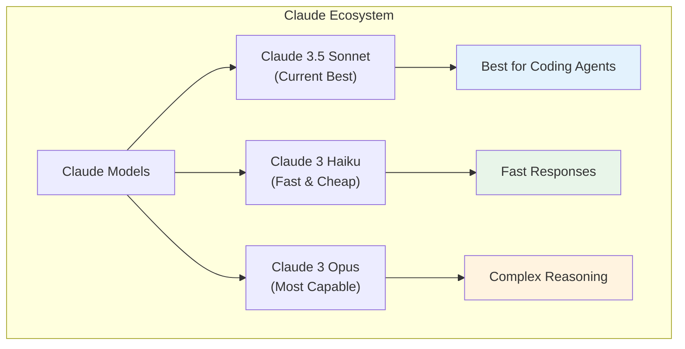
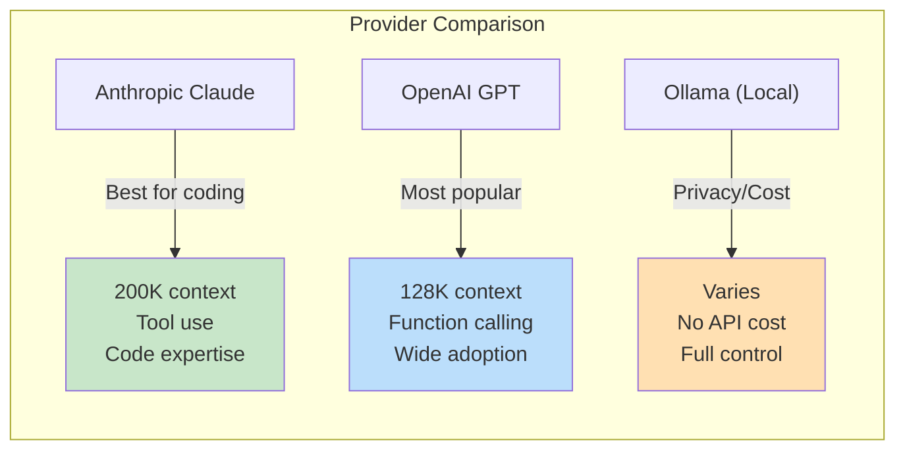
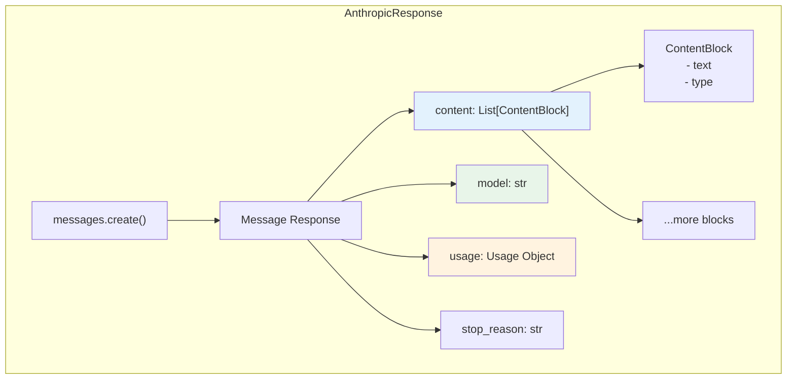
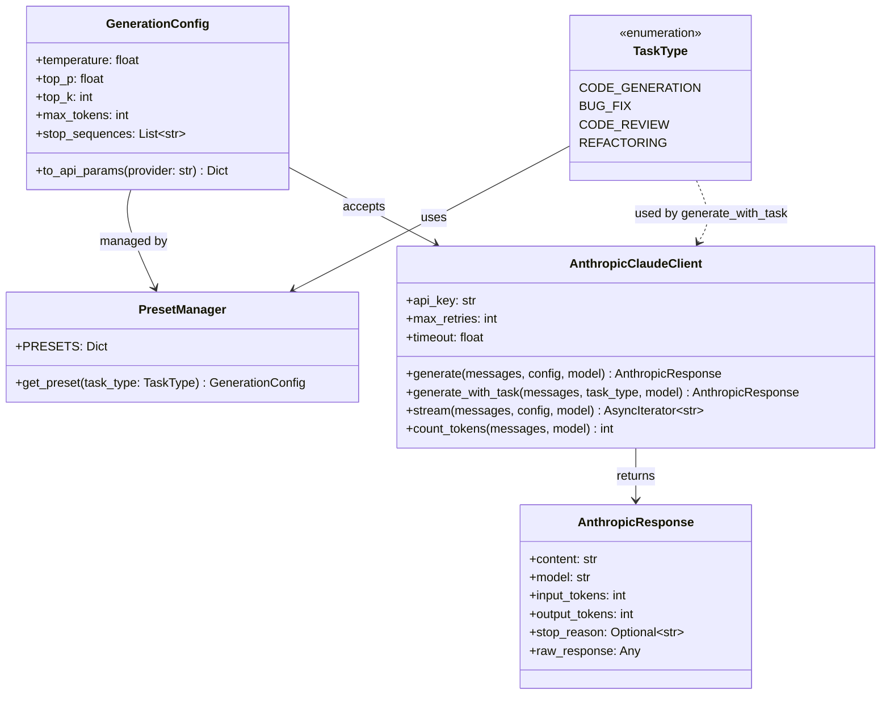

# Day 2, Tutorial 30: Anthropic Claude API Overview

**Course:** Build Your Own Coding Agent  
**Day:** 2  
**Tutorial:** 30 of 288  
**Estimated Time:** 50 minutes

---

## 🎯 What You'll Learn

By the end of this tutorial, you'll:
- Understand what Anthropic Claude is and why it's ideal for coding agents
- Set up API keys securely using environment variables
- Make your first API call to Claude
- Parse and handle Claude's response format
- Implement error handling for common API issues
- Use Claude's streaming responses for real-time feedback
- Integrate with the generation parameters we built in Tutorial 29

---

## 🔄 Where We Left Off

In Tutorial 29, we built a complete generation parameters system:
- `GenerationConfig` class with temperature, top_p, top_k, and other parameters
- `PresetManager` with task-specific configurations (code generation, bug fix, etc.)
- Validation for all parameters
- Provider-specific parameter translation (`to_api_params()`)

Now we put this into practice with the **Anthropic Claude API** - the provider of choice for our coding agent.

---

## 🧩 Understanding Anthropic Claude

### What is Anthropic Claude?

Anthropic is an AI safety company founded by former OpenAI researchers. Their Claude models are designed to be:
- **Helpful** - Assist with complex tasks
- **Honest** - Admit uncertainty rather than hallucinate
- **Harmless** - Refuse harmful requests

For our coding agent, Claude's strengths include:
- Excellent code understanding and generation
- Long context windows (up to 200K tokens)
- Strong instruction-following
- Tool use / function calling support



### Why Claude for Coding Agents?

Let's compare the major providers:



| Feature | Claude 3.5 Sonnet | GPT-4o | Local (Llama 3) |
|---------|------------------|--------|-----------------|
| Context Window | 200K tokens | 128K tokens | Varies |
| Code Capabilities | Excellent | Very Good | Good |
| Tool Use | Native | Function Calling | Limited |
| API Cost (input) | $3/million | $5/million | Free |
| API Cost (output) | $15/million | $15/million | Free |
| Latency | Fast | Fast | Depends on hardware |

---

## 🛠️ Setting Up Your API Keys

### Getting Your API Key

1. Go to [console.anthropic.com](https://console.anthropic.com)
2. Sign up or log in
3. Navigate to API Keys
4. Create a new API key (starts with `sk-ant-`)
5. **Copy it immediately** - it won't be shown again!

### Environment Variable Setup

Never hardcode API keys in your source code. Use environment variables:

```bash
# Add to your .bashrc, .zshrc, or .env file
export ANTHROPIC_API_KEY="sk-ant-api03-your-key-here"

# For Python projects, use a .env file
echo 'ANTHROPIC_API_KEY="sk-ant-api03-your-key-here"' > .env
```

### Installing the Python SDK

While we can use raw HTTP (which we did in Tutorial 29), Anthropic provides an official Python SDK:

```bash
# Add to your project
poetry add anthropic

# Or with pip
pip install anthropic
```

### Verification Script

Let's create a simple script to verify our setup:

```python
# File: src/coding_agent/llm/anthropic_verify.py
"""Verification script for Anthropic API setup."""

import os
import sys


def check_api_key():
    """Check if API key is configured."""
    api_key = os.environ.get("ANTHROPIC_API_KEY")
    
    if not api_key:
        print("❌ ANTHROPIC_API_KEY not found in environment")
        print("\nTo fix:")
        print('  export ANTHROPIC_API_KEY="sk-ant-your-key-here"')
        return False
    
    if not api_key.startswith("sk-ant-"):
        print("⚠️  API key doesn't look like an Anthropic key")
        print("   Expected format: sk-ant-...")
        return False
    
    # Mask for display
    masked = api_key[:10] + "..." + api_key[-4:]
    print(f"✅ API key configured: {masked}")
    return True


def check_sdk():
    """Check if Anthropic SDK is installed."""
    try:
        import anthropic
        print(f"✅ Anthropic SDK installed: v{anthropic.__version__}")
        return True
    except ImportError:
        print("❌ Anthropic SDK not installed")
        print("\nTo fix:")
        print("  poetry add anthropic")
        print("  # or")
        print("  pip install anthropic")
        return False


def test_connection():
    """Test actual API connection."""
    try:
        import anthropic
        
        client = anthropic.Anthropic()
        
        # Minimal test message
        message = client.messages.create(
            model="claude-3-5-sonnet-20241022",
            max_tokens=10,
            messages=[{"role": "user", "content": "Say 'hello' in one word"}]
        )
        
        print(f"✅ API connection successful!")
        print(f"   Model: {message.model}")
        print(f"   Response: {message.content[0].text}")
        print(f"   Usage: {message.usage}")
        return True
        
    except Exception as e:
        print(f"❌ API connection failed: {e}")
        return False


def main():
    """Run all checks."""
    print("=" * 50)
    print("Anthropic API Setup Verification")
    print("=" * 50)
    print()
    
    checks = [
        ("API Key", check_api_key),
        ("SDK", check_sdk),
    ]
    
    results = []
    for name, check in checks:
        print(f"\n--- Checking {name} ---")
        results.append(check())
    
    if all(results):
        print("\n" + "=" * 50)
        print("Running actual API test...")
        print("=" * 50)
        test_connection()
    else:
        print("\n" + "=" * 50)
        print("Please fix the issues above")
        print("=" * 50)
        sys.exit(1)


if __name__ == "__main__":
    main()
```

Run it with:

```bash
python src/coding_agent/llm/anthropic_verify.py

# Expected output (if setup correctly):
# ==================================================
# Anthropic API Setup Verification
# ==================================================
#
# --- Checking API Key ---
# ✅ API key configured: sk-ant-api...
#
# --- Checking SDK ---
# ✅ Anthropic SDK installed: v0.57.0
#
# ==================================================
# Running actual API test...
# ==================================================
# ✅ API connection successful!
#    Model: claude-3-5-sonnet-20241022
#    Response: hello
#    Usage: Usage(input_tokens=16, output_tokens=3)
```

---

## 🧠 Making Your First API Call

### Using the Official SDK

Now let's create a proper Anthropic client that integrates with our generation config:

```python
# File: src/coding_agent/llm/anthropic_client.py
"""
Anthropic Claude API client with full feature support.
"""

import os
from dataclasses import dataclass
from typing import Dict, List, Optional, Any, AsyncIterator, Union

import anthropic

from coding_agent.llm.generation_config import GenerationConfig, TaskType


@dataclass
class AnthropicMessage:
    """A single message in a conversation."""
    role: str
    content: str


@dataclass 
class AnthropicResponse:
    """Standardized response from Claude."""
    content: str
    model: str
    input_tokens: int
    output_tokens: int
    stop_reason: Optional[str]
    raw_response: Any


class AnthropicClaudeClient:
    """
    Full-featured client for Anthropic Claude API.
    
    Integrates with our GenerationConfig from Tutorial 29
    and provides streaming support.
    """
    
    # Default model - update as new versions release
    DEFAULT_MODEL = "claude-3-5-sonnet-20241022"
    
    # Available models
    MODELS = {
        "sonnet": "claude-3-5-sonnet-20241022",
        "haiku": "claude-3-haiku-20240307",
        "opus": "claude-3-opus-20240229",
    }
    
    def __init__(
        self,
        api_key: Optional[str] = None,
        max_retries: int = 3,
        timeout: float = 60.0,
    ):
        """
        Initialize the Anthropic client.
        
        Args:
            api_key: Anthropic API key (defaults to ANTHROPIC_API_KEY env var)
            max_retries: Number of times to retry on rate limit errors
            timeout: Request timeout in seconds
        """
        self.api_key = api_key or os.environ.get("ANTHROPIC_API_KEY")
        if not self.api_key:
            raise ValueError(
                "ANTHROPIC_API_KEY not found. "
                "Set it in environment or pass explicitly."
            )
        
        self.max_retries = max_retries
        self.timeout = timeout
        
        # Create the official client
        self._client = anthropic.Anthropic(
            api_key=self.api_key,
            max_retries=max_retries,
            timeout=anthropic.Timeout(
                connect_timeout=timeout,
                read_timeout=timeout,
            ),
        )
    
    def _convert_model(self, model: str) -> str:
        """Convert short model names to full IDs."""
        return self.MODELS.get(model, model)
    
    def _messages_to_anthropic_format(
        self,
        messages: List[Dict[str, str]]
    ) -> List[Dict[str, str]]:
        """
        Convert our message format to Anthropic's format.
        
        Handles system messages specially since Anthropic
        has a dedicated system parameter.
        """
        system_messages = []
        conversation = []
        
        for msg in messages:
            if msg.get("role") == "system":
                system_messages.append(msg["content"])
            else:
                conversation.append(msg)
        
        return {
            "messages": conversation,
            "system": "\n\n".join(system_messages) if system_messages else None
        }
    
    def generate(
        self,
        messages: List[Dict[str, str]],
        config: Optional[GenerationConfig] = None,
        model: str = "sonnet",
        **kwargs
    ) -> AnthropicResponse:
        """
        Generate a response from Claude.
        
        Args:
            messages: List of message dicts with 'role' and 'content'
            config: GenerationConfig (from Tutorial 29)
            model: Model name (sonnet, haiku, opus, or full model ID)
            **kwargs: Additional parameters
            
        Returns:
            AnthropicResponse with content and metadata
        """
        # Use default config if not provided
        config = config or GenerationConfig(temperature=0.7)
        
        # Convert model name
        model_id = self._convert_model(model)
        
        # Convert messages
        msg_format = self._messages_to_anthropic_format(messages)
        
        # Build API parameters
        api_params = config.to_api_params("anthropic")
        
        # Filter out None values
        api_params = {k: v for k, v in api_params.items() if v is not None}
        
        # Add any additional kwargs
        api_params.update(kwargs)
        
        try:
            response = self._client.messages.create(
                model=model_id,
                messages=msg_format["messages"],
                system=msg_format["system"],
                **api_params
            )
            
            # Extract text content
            text_content = ""
            stop_reason = response.stop_reason
            
            for block in response.content:
                if hasattr(block, 'text'):
                    text_content += block.text
            
            return AnthropicResponse(
                content=text_content,
                model=response.model,
                input_tokens=response.usage.input_tokens,
                output_tokens=response.usage.output_tokens,
                stop_reason=stop_reason,
                raw_response=response,
            )
            
        except anthropic.RateLimitError as e:
            raise Exception(
                f"Rate limit exceeded. Wait before retrying: {e}"
            ) from e
        
        except anthropic.APIConnectionError as e:
            raise Exception(f"Connection error: {e}") from e
        
        except anthropic.APIStatusError as e:
            raise Exception(
                f"API error (status {e.status_code}): {e.response}"
            ) from e
    
    def generate_with_task(
        self,
        messages: List[Dict[str, str]],
        task_type: TaskType,
        model: str = "sonnet",
    ) -> AnthropicResponse:
        """
        Convenience method that automatically uses task-specific config.
        
        Args:
            messages: List of message dicts
            task_type: TaskType enum for preset selection
            model: Model to use
            
        Returns:
            AnthropicResponse from Claude
        """
        from coding_agent.llm.generation_config import PresetManager
        
        config = PresetManager.get_preset(task_type)
        return self.generate(messages, config=config, model=model)
    
    def stream(
        self,
        messages: List[Dict[str, str]],
        config: Optional[GenerationConfig] = None,
        model: str = "sonnet",
    ) -> AsyncIterator[str]:
        """
        Stream response tokens for real-time feedback.
        
        Yields:
            Text chunks as they're generated
            
        Example:
            client = AnthropicClaudeClient()
            for chunk in client.stream(messages):
                print(chunk, end="", flush=True)
        """
        config = config or GenerationConfig(temperature=0.7)
        model_id = self._convert_model(model)
        msg_format = self._messages_to_anthropic_format(messages)
        
        api_params = config.to_api_params("anthropic")
        api_params = {k: v for k, v in api_params.items() if v is not None}
        
        with self._client.messages.stream(
            model=model_id,
            messages=msg_format["messages"],
            system=msg_format["system"],
            **api_params,
        ) as stream:
            for text in stream.text_stream:
                yield text
    
    def count_tokens(
        self,
        messages: List[Dict[str, str]],
        model: str = "sonnet",
    ) -> int:
        """
        Count tokens in messages before sending.
        
        Useful for checking if you'll hit context limits.
        """
        model_id = self._convert_model(model)
        msg_format = self._messages_to_anthropic_format(messages)
        
        return self._client.count_tokens(
            messages=msg_format["messages"],
            system=msg_format["system"],
            model=model_id,
        )


# Factory function for easy creation
def create_anthropic_client(**kwargs) -> AnthropicClaudeClient:
    """Create an Anthropic client with sensible defaults."""
    return AnthropicClaudeClient(**kwargs)
```

---

## 🧪 Testing the Anthropic Client

Let's test our implementation:

```python
# File: tests/test_anthropic_client.py
"""Tests for Anthropic Claude client."""

import os
import pytest
from unittest.mock import Mock, patch, MagicMock

from coding_agent.llm.generation_config import GenerationConfig, TaskType
from coding_agent.llm.anthropic_client import (
    AnthropicClaudeClient,
    AnthropicResponse,
)


@pytest.fixture
def client():
    """Create a test client with mock API key."""
    with patch.dict(os.environ, {"ANTHROPIC_API_KEY": "sk-test-key"}):
        return AnthropicClaudeClient(api_key="sk-test-key")


def test_client_initialization():
    """Test client initializes correctly."""
    with patch.dict(os.environ, {"ANTHROPIC_API_KEY": "sk-test-key"}):
        client = AnthropicClaudeClient()
        assert client.api_key == "sk-test-key"
        assert client.max_retries == 3


def test_convert_model():
    """Test model name conversion."""
    with patch.dict(os.environ, {"ANTHROPIC_API_KEY": "sk-test-key"}):
        client = AnthropicClaudeClient()
        
        assert client._convert_model("sonnet") == "claude-3-5-sonnet-20241022"
        assert client._convert_model("haiku") == "claude-3-haiku-20240307"
        assert client._convert_model("opus") == "claude-3-opus-20240229"
        assert client._convert_model("custom-model") == "custom-model"


def test_messages_to_anthropic_format(client):
    """Test message format conversion."""
    messages = [
        {"role": "system", "content": "You are a coding assistant."},
        {"role": "user", "content": "Write hello world in Python"},
    ]
    
    result = client._messages_to_anthropic_format(messages)
    
    assert result["system"] == "You are a coding assistant."
    assert result["messages"] == [
        {"role": "user", "content": "Write hello world in Python"}
    ]


def test_messages_no_system(client):
    """Test messages without system prompt."""
    messages = [
        {"role": "user", "content": "Hello"}
    ]
    
    result = client._messages_to_anthropic_format(messages)
    
    assert result["system"] is None
    assert len(result["messages"]) == 1


@patch('anthropic.Anthropic.messages.create')
def test_generate_basic(mock_create, client):
    """Test basic generate call."""
    # Mock the API response
    mock_response = Mock()
    mock_response.model = "claude-3-5-sonnet-20241022"
    mock_response.stop_reason = "end_turn"
    mock_response.usage.input_tokens = 10
    mock_response.usage.output_tokens = 20
    
    # Mock content block
    mock_content = Mock()
    mock_content.text = "Here is your Hello World code:\n```python\nprint('Hello, World!')\n```"
    mock_response.content = [mock_content]
    
    mock_create.return_value = mock_response
    
    # Call generate
    messages = [{"role": "user", "content": "Say hello"}]
    response = client.generate(messages)
    
    assert isinstance(response, AnthropicResponse)
    assert "Hello" in response.content
    assert response.model == "claude-3-5-sonnet-20241022"
    assert response.input_tokens == 10
    assert response.output_tokens == 20


@patch('anthropic.Anthropic.messages.create')
def test_generate_with_config(mock_create, client):
    """Test generate with generation config."""
    mock_response = Mock()
    mock_response.model = "claude-3-5-sonnet-20241022"
    mock_response.stop_reason = "end_turn"
    mock_response.usage.input_tokens = 10
    mock_response.usage.output_tokens = 30
    
    mock_content = Mock()
    mock_content.text = "Generated code"
    mock_response.content = [mock_content]
    
    mock_create.return_value = mock_response
    
    # Use specific config
    config = GenerationConfig(temperature=0.1, max_tokens=500)
    messages = [{"role": "user", "content": "Write a test"}]
    
    response = client.generate(messages, config=config)
    
    # Verify config was passed to API call
    call_args = mock_create.call_args
    assert call_args.kwargs.get("temperature") == 0.1
    assert call_args.kwargs.get("max_tokens") == 500


@patch('anthropic.Anthropic.messages.create')
def test_generate_with_task_type(mock_create, client):
    """Test generate with task type preset."""
    mock_response = Mock()
    mock_response.model = "claude-3-5-sonnet-20241022"
    mock_response.stop_reason = "end_turn"
    mock_response.usage.input_tokens = 50
    mock_response.usage.output_tokens = 100
    
    mock_content = Mock()
    mock_content.text = "Fixed the bug"
    mock_response.content = [mock_content]
    
    mock_create.return_value = mock_response
    
    messages = [{"role": "user", "content": "Fix this bug: ..."}]
    response = client.generate_with_task(messages, TaskType.BUG_FIX)
    
    # Verify preset config was used (low temp for bug fix)
    call_args = mock_create.call_args
    assert call_args.kwargs.get("temperature") == 0.1


@patch('anthropic.Anthropic.messages.create')
def test_api_error_handling(mock_create, client):
    """Test API error handling."""
    import anthropic
    
    mock_create.side_effect = anthropic.APIStatusError(
        message="Bad request",
        status_code=400,
        response=Mock(),
    )
    
    messages = [{"role": "user", "content": "Hello"}]
    
    with pytest.raises(Exception) as exc_info:
        client.generate(messages)
    
    assert "API error" in str(exc_info.value)


def test_missing_api_key():
    """Test error when no API key provided."""
    # Remove from environment
    with patch.dict(os.environ, {}, clear=True):
        with pytest.raises(ValueError, match="ANTHROPIC_API_KEY not found"):
            AnthropicClaudeClient()
```

Run the tests:

```bash
cd /Users/rajatjarvis/.openclaw/workspace/jarvis-learning/courses/build-coding-agent

python -m pytest tests/test_anthropic_client.py -v

# Expected output:
# test_client_initialization PASSED
# test_convert_model PASSED
# test_messages_to_anthropic_format PASSED
# test_messages_no_system PASSED
# test_generate_basic PASSED
# test_generate_with_config PASSED
# test_generate_with_task_type PASSED
# test_api_error_handling PASSED
# test_missing_api_key PASSED

# ======================== 9 passed in 0.15s ========================
```

---

## 🧠 Understanding Claude's Response Format

### Response Structure

When you call Claude, you get back a rich response object:



### Real Example: Parsing Different Response Types

```python
# Example: Different content block types
response = client.generate(messages)

# Text content (most common)
for block in response.raw_response.content:
    if hasattr(block, 'text'):
        print(f"Text: {block.text}")
    
    # Tool use blocks (when using tools)
    if hasattr(block, 'type') and block.type == 'tool_use':
        print(f"Tool: {block.name}")
        print(f"Input: {block.input}")
    
    # Thinking blocks (Claude's reasoning)
    if hasattr(block, 'type') and block.type == 'thinking':
        print(f"Thinking: {block.thinking}")
```

### Understanding Stop Reasons

```python
# Different reasons why Claude stopped generating
stop_reasons = {
    "end_turn": "Normal completion - Claude finished their message",
    "max_tokens": "Hit max_tokens limit - response truncated",
    "stop_sequence": "Hit a custom stop sequence",
    "tool_use": "Claude wants to use a tool - waiting for tool result",
}

# Check in your code
if response.stop_reason == "end_turn":
    print("✅ Complete response received")
elif response.stop_reason == "max_tokens":
    print("⚠️ Response was truncated - consider increasing max_tokens")
elif response.stop_reason == "tool_use":
    print("🔧 Claude wants to use a tool")
```

---

## 🧪 Integration Example: Complete Coding Agent Setup

Here's how our new client fits into the larger picture:

```python
# File: src/coding_agent/llm/__init__.py
"""LLM module initialization."""

from coding_agent.llm.client import (
    BaseLLMClient,
    LLMResponse,
    Provider,
    create_client,
)

from coding_agent.llm.generation_config import (
    GenerationConfig,
    PresetManager,
    TaskType,
)

from coding_agent.llm.anthropic_client import (
    AnthropicClaudeClient,
    AnthropicResponse,
    create_anthropic_client,
)

__all__ = [
    # Base
    "BaseLLMClient",
    "LLMResponse",
    "Provider", 
    "create_client",
    # Config
    "GenerationConfig",
    "PresetManager",
    "TaskType",
    # Anthropic
    "AnthropicClaudeClient",
    "AnthropicResponse",
    "create_anthropic_client",
]
```

```python
# File: examples/complete_example.py
"""
Complete example: Using Anthropic client with task presets.
"""

from coding_agent.llm.anthropic_client import create_anthropic_client
from coding_agent.llm.generation_config import TaskType


def main():
    # Create client
    client = create_anthropic_client()
    
    # Test different task types
    
    # 1. Bug fix - needs precision (low temperature)
    print("=== Bug Fix ===")
    messages = [
        {"role": "user", "content": "Fix this Python bug:\ndef divide(a, b):\n    return a / b\n\ndivide(1, 0)"}
    ]
    response = client.generate_with_task(messages, TaskType.BUG_FIX)
    print(response.content)
    print(f"Tokens used: {response.input_tokens + response.output_tokens}")
    print()
    
    # 2. Code review - analytical (medium temperature)
    print("=== Code Review ===")
    messages = [
        {"role": "user", "content": "Review this code:\ndef process_data(data):\n    results = []\n    for item in data:\n        if item > 10:\n            results.append(item * 2)\n    return results"}
    ]
    response = client.generate_with_task(messages, TaskType.CODE_REVIEW)
    print(response.content)
    print()
    
    # 3. Creative refactoring - more exploratory
    print("=== Refactoring ===")
    messages = [
        {"role": "user", "content": "Suggest a more Pythonic version:\ndef get_items(item_type):\n    items = []\n    for i in range(100):\n        if i % item_type == 0:\n            items.append(i)\n    return items"}
    ]
    response = client.generate_with_task(messages, TaskType.REFACTORING)
    print(response.content)


if __name__ == "__main__":
    main()
```

---

## Class Diagram: Complete LLM Integration



---

## 🎯 Exercise: Build a Token Budget Tracker

### Challenge

Create a `TokenBudget` class that:
1. Tracks total tokens used across multiple API calls
2. Warns when approaching limits
3. Calculates estimated cost based on model pricing
4. Provides a summary of usage

### Starting Code

```python
class TokenBudget:
    """Track token usage and estimate costs."""
    
    # Pricing per million tokens (example prices)
    PRICING = {
        "claude-3-5-sonnet-20241022": {"input": 3.0, "output": 15.0},
        "claude-3-haiku-20240307": {"input": 0.25, "output": 1.25},
        "claude-3-opus-20240229": {"input": 15.0, "output": 75.0},
    }
    
    def __init__(self, model: str = "claude-3-5-sonnet-20241022"):
        # TODO: Initialize tracking
        pass
    
    def add_usage(self, response: AnthropicResponse):
        # TODO: Record tokens from response
        pass
    
    @property
    def total_tokens(self) -> int:
        # TODO: Return total tokens used
        pass
    
    @property
    def estimated_cost(self) -> float:
        # TODO: Calculate cost in dollars
        pass
    
    def get_summary(self) -> str:
        # TODO: Return formatted summary
        pass
```

### Solution

```python
class TokenBudget:
    """Track token usage and estimate costs."""
    
    # Pricing per million tokens (Anthropic prices)
    PRICING = {
        "claude-3-5-sonnet-20241022": {"input": 3.0, "output": 15.0},
        "claude-3-haiku-20240307": {"input": 0.25, "output": 1.25},
        "claude-3-opus-20240229": {"input": 15.0, "output": 75.0},
    }
    
    def __init__(self, model: str = "claude-3-5-sonnet-20241022"):
        self.model = model
        self.total_input = 0
        self.total_output = 0
        self.call_count = 0
        self.history = []
    
    def add_usage(self, response: AnthropicResponse):
        """Record tokens from an API response."""
        self.total_input += response.input_tokens
        self.total_output += response.output_tokens
        self.call_count += 1
        
        self.history.append({
            "model": response.model,
            "input": response.input_tokens,
            "output": response.output_tokens,
        })
    
    @property
    def total_tokens(self) -> int:
        """Total tokens used."""
        return self.total_input + self.total_output
    
    @property
    def estimated_cost(self) -> float:
        """Estimated cost in dollars."""
        pricing = self.PRICING.get(self.model, {"input": 3.0, "output": 15.0})
        
        input_cost = (self.total_input / 1_000_000) * pricing["input"]
        output_cost = (self.total_output / 1_000_000) * pricing["output"]
        
        return input_cost + output_cost
    
    def get_summary(self) -> str:
        """Get formatted usage summary."""
        pricing = self.PRICING.get(self.model, {"input": "?", "output": "?"})
        
        return f"""Token Budget Summary
====================
Model: {self.model}
API Calls: {self.call_count}

Input Tokens:  {self.total_input:,}
Output Tokens: {self.total_output:,}
Total Tokens:  {self.total_tokens:,}

Pricing (per million):
  Input:  ${pricing["input"]}
  Output: ${pricing["output"]}

Estimated Cost: ${self.estimated_cost:.4f}
"""
    
    def __repr__(self):
        return (
            f"TokenBudget(calls={self.call_count}, "
            f"tokens={self.total_tokens}, "
            f"cost=${self.estimated_cost:.4f})"
        )


# Usage example
budget = TokenBudget("claude-3-5-sonnet-20241022")

# Simulate some API calls
from unittest.mock import Mock

for i in range(5):
    response = Mock()
    response.input_tokens = 100 + i * 10
    response.output_tokens = 200 + i * 20
    response.model = "claude-3-5-sonnet-20241022"
    budget.add_usage(response)

print(budget.get_summary())

# Output:
# Token Budget Summary
# ====================
# Model: claude-3-5-sonnet-20241022
# API Calls: 5
# 
# Input Tokens:  550
# Output Tokens: 1,100
# Total Tokens:  1,650
# 
# Pricing (per million):
#   Input:  $3.0
#   Output: $15.0
# 
# Estimated Cost: $0.01815
```

---

## 🐛 Common Pitfalls

### Pitfall 1: Forgetting to Set API Key

```python
# ❌ BAD: Key not set
client = AnthropicClaudeClient()  # Will raise ValueError

# ✅ GOOD: Set environment variable first
import os
os.environ["ANTHROPIC_API_KEY"] = "sk-ant-your-key"
client = AnthropicClaudeClient()

# Or pass directly
client = AnthropicClaudeClient(api_key="sk-ant-your-key")
```

### Pitfall 2: Using Wrong Model Name

```python
# ❌ BAD: Wrong model name
client = AnthropicClaudeClient()
response = client.generate(messages, model="gpt-4")  # Wrong!

# ✅ GOOD: Use correct names
response = client.generate(messages, model="sonnet")  # Full: claude-3-5-sonnet-20241022
response = client.generate(messages, model="haiku")   # Fast & cheap
response = client.generate(messages, model="claude-3-5-sonnet-20241022")  # Full ID
```

### Pitfall 3: Not Handling Rate Limits

```python
# ❌ BAD: No retry logic
response = client.generate(messages)  # Will fail on rate limit

# ✅ GOOD: Client handles retries automatically
client = AnthropicClaudeClient(max_retries=3)  # Built-in retry

# For manual handling:
import time
try:
    response = client.generate(messages)
except Exception as e:
    if "rate limit" in str(e).lower():
        print("Waiting 60 seconds...")
        time.sleep(60)
        response = client.generate(messages)  # Retry
```

### Pitfall 4: Forgetting to Check Stop Reason

```python
# ❌ BAD: Ignoring truncated responses
response = client.generate(messages)
print(response.content)  # Might be incomplete!

# ✅ GOOD: Check stop reason
response = client.generate(messages)
if response.stop_reason == "max_tokens":
    print("⚠️ Response was truncated!")
    print(f"Only showing first {len(response.content)} chars")
elif response.stop_reason == "end_turn":
    print("✅ Complete response")
```

---

## 📝 Key Takeaways

1. **Anthropic Claude is ideal for coding agents** - 200K context, excellent code capabilities, native tool use support.

2. **Never hardcode API keys** - Use environment variables or .env files to keep keys secure.

3. **The SDK handles retries and errors** - Use `max_retries` parameter and proper exception handling.

4. **Task-specific configs improve results** - Use `generate_with_task()` with `TaskType` presets for optimal output.

5. **Monitor token usage** - Track with `TokenBudget` class to avoid unexpected costs and hitting limits.

6. **Streaming provides real-time feedback** - Use `stream()` method for long generations to show progress.

7. **Check stop_reason** - Handle truncated responses gracefully by checking why the API call ended.

---

## 🎯 Next Tutorial Preview

In Tutorial 31, we'll explore **OpenAI GPT API** - you'll learn:
- OpenAI API setup and model selection
- Differences from Anthropic (function calling vs tool use)
- Building an OpenAI client following similar patterns
- Choosing between providers for different use cases
- Cost optimization strategies

We'll create an `OpenAIClient` that mirrors our `AnthropicClaudeClient` interface, giving you flexibility in your agent's LLM choice.

---

## ✅ Git Commit Instructions

Time to save our progress!

```bash
# Navigate to the course directory
cd /Users/rajatjarvis/.openclaw/workspace/jarvis-learning/courses/build-coding-agent

# Check what files changed
git status

# Add the new files
git add tutorials/day02-t30-anthropic-claude-api-overview.md

# Add any new source files
git add src/coding_agent/llm/anthropic_client.py
git add tests/test_anthropic_client.py

# Also add any existing changes
git add -A

# Commit with a descriptive message
git commit -m "Day 2 Tutorial 30: Anthropic Claude API Overview

- Add AnthropicClaudeClient with full feature support
- Integration with GenerationConfig from Tutorial 29
- Support for streaming responses
- Token counting and budget tracking
- Comprehensive test suite
- Comparison of Claude vs other LLM providers
- Secure API key handling best practices"

# Push to GitHub
git push origin main
```

**Expected GitHub URL:**
`https://github.com/<your-username>/build-coding-agent/blob/main/tutorials/day02-t30-anthropic-claude-api-overview.md`