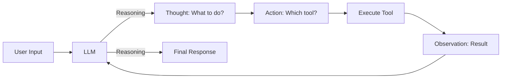
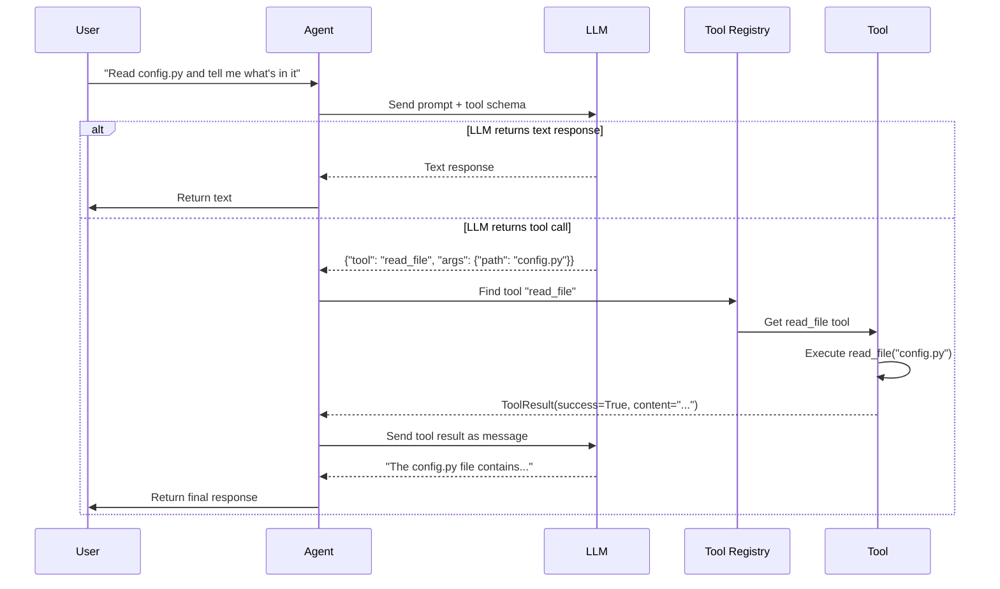

# T25: Tool Use Concept - How LLMs Output JSON Function Calls

**Course:** Build Your Own Coding Agent  
**Day:** 3 - Tool Use Loop  
**Tutorial:** 25 of 60  
**Estimated Time:** 45 minutes

---

## 🎯 Learning Goals

By the end of this tutorial, you will understand:
1. **What** tool use is and why it matters for autonomous agents
2. **How** LLMs output structured JSON function calls (not just text)
3. **Why** this pattern enables agents to act, not just respond
4. **The architecture** we'll build in Day 3

---

## 🔑 The Key Insight: From Text to Action

Here's the fundamental shift that makes a coding agent different from ChatGPT:

### Traditional LLM Interaction
```
User: "How do I read a file in Python?"
LLM: "You can use the built-in open() function..."
```

The LLM **tells you how** to do something. You have to do it yourself.

### Agentic LLM Interaction
```
User: "Read the file config.py for me"
LLM: {"name": "read_file", "arguments": {"path": "config.py"}}
Agent: → Executes read_file("config.py")
Agent: → Returns content to LLM
LLM: "The file contains: ..."
```

The LLM **decides to take action** and **returns structured instructions** for the agent to execute.

---

## 🧠 Why This Matters

### The ReAct Pattern (Reason + Act)

The seminal paper ["ReAct: Synergizing Reasoning and Acting in Language Models"](https://arxiv.org/abs/2210.03629) introduced this concept:



This creates a **loop** where the LLM:
1. **Reasons** about what to do
2. **Acts** by calling a tool
3. **Observes** the result
4. **Repeats** until done

### Why JSON Function Calls?

Structured JSON provides:
- **Type safety** - The LLM knows expected arguments
- **Parsing** - Easy to extract and execute
- **Schema** - Tool descriptions guide the LLM
- **Reliability** - Less ambiguity than natural text

---

## 🏗️ Tool Use Architecture

Here's what we'll build in Day 3:

```mermaid
graph TB
    subgraph "Agent"
        User[User Input] --> Agent
        Agent --> Convo[Conversation Manager]
        Convo --> LLM
    end
    
    subgraph "Tool Use Loop"
        LLM -- "JSON Tool Call" --> Parse[Parse Response]
        Parse --> Find[Find Tool in Registry]
        Find --> Validate[Validate Arguments]
        Validate --> Exec[Execute Tool]
        Exec --> Result[Tool Result]
        Result --> LLM
    end
    
    subgraph "Tools"
        Exec -.-> Files[File Tools]
        Exec -.-> Shell[Shell Tools]
        Exec -.-> Builtins[Built-in Tools]
    end
```

### Key Components

| Component | Responsibility |
|-----------|----------------|
| **Tool Schema** | JSON description of what each tool does |
| **Tool Call Parser** | Extract structured calls from LLM response |
| **Tool Registry** | Maps tool names to executable implementations |
| **Execution Loop** | Orchestrates call → execute → return cycle |
| **Conversation Manager** | Tracks tool results as messages |

---

## 📋 How Different LLMs Format Tool Calls

### Anthropic (Claude)

Claude uses a specific tool_use block:

```python
{
  "id": "msg_123",
  "content": [
    {
      "type": "tool_use",
      "id": "toolu_001",
      "name": "read_file",
      "input": {"path": "config.py"}
    }
  ]
}
```

### OpenAI (GPT-4)

OpenAI uses a tool_calls array:

```python
{
  "id": "chatcmpl-123",
  "choices": [
    {
      "message": {
        "role": "assistant",
        "content": None,
        "tool_calls": [
          {
            "id": "call_abc",
            "type": "function",
            "function": {
              "name": "read_file",
              "arguments": "{\"path\": \"config.py\"}"
            }
          }
        ]
      }
    }
  ]
}
```

### Ollama

Local models may return plain text that we parse:

```
I'll read the config.py file for you.
[TOOL_CALL: read_file {"path": "config.py"}]
```

---

## 🔧 The Tool Schema

To help the LLM know what tools exist, we provide a JSON Schema:

```python
TOOL_SCHEMA = [
    {
        "name": "read_file",
        "description": "Read contents of a file",
        "input_schema": {
            "type": "object",
            "properties": {
                "path": {
                    "type": "string",
                    "description": "Path to file to read"
                }
            },
            "required": ["path"]
        }
    },
    {
        "name": "write_file",
        "description": "Write content to a file",
        "input_schema": {
            "type": "object",
            "properties": {
                "path": {"type": "string", "description": "File path"},
                "content": {"type": "string", "description": "Content to write"}
            },
            "required": ["path", "content"]
        }
    },
    {
        "name": "execute_shell",
        "description": "Execute a shell command",
        "input_schema": {
            "type": "object",
            "properties": {
                "command": {"type": "string", "description": "Command to run"}
            },
            "required": ["command"]
        }
    }
]
```

**Why this works:**
- The LLM reads this schema and knows what tools exist
- It can match user requests to appropriate tools
- The input_schema validates arguments are correct

---

## 🔄 The Tool Use Flow

Here's the complete flow we'll implement:



---

## 📝 Tool Result Format

After executing a tool, we return structured results to the LLM:

```python
# Tool executed successfully
{
    "tool_use_id": "toolu_001",
    "output": {
        "success": True,
        "content": "api_key=abc123\ndebug=true",
        "error": None
    }
}

# Tool failed
{
    "tool_use_id": "toolu_002", 
    "output": {
        "success": False,
        "content": "",
        "error": "File not found: missing.py"
    }
}
```

**Why include both success and error:**
- The LLM can reason about failures
- It can try alternative approaches
- User gets better error messages

---

## 🔀 Multi-Step Tool Calls

Sometimes the LLM needs multiple tools in sequence:

```python
# First, find the file
{
  "type": "tool_use",
  "name": "search_files",
  "input": {"pattern": "*.py", "path": "."}
}

# Then read one of the results
{
  "type": "tool_use", 
  "name": "read_file",
  "input": {"path": "src/main.py"}
}
```

The agent executes them in order and accumulates results.

---

## ⚠️ Challenges We'll Address

### Challenge 1: Malformed Calls
The LLM might output invalid JSON or wrong tool names.

**Solution:** Validation and error handling in the parser

### Challenge 2: Tool Loop Infinite
The LLM keeps calling tools forever.

**Solution:** Maximum iteration limit (e.g., 10 tool calls)

### Challenge 3: Wrong Tool Selection
The LLM chooses the wrong tool for the job.

**Solution:** Clear tool descriptions in schema

### Challenge 4: Argument Mismatches
The LLM provides wrong or missing arguments.

**Solution:** JSON Schema validation

---

## 🛠️ Today's Exercise

**For this tutorial**, there's no code to write - just understanding!

**Reflection questions:**
1. How is tool use different from just prompting an LLM?
2. Why is structured JSON better than natural text for tool calls?
3. What could go wrong if we just let the LLM run any code?

---

## 📦 What We Have Now (T13 + Day 2)

Your codebase from previous tutorials includes:

```python
# From T13 - Agent with tool registry
class Agent:
    def __init__(self, ...):
        self._tools = ToolRegistry()
        self._register_builtin_tools()
    
    def run(self, user_input: str) -> str:
        # Currently: just sends to LLM
        response = self._llm.complete(user_input)
        return response.content

# From Day 2 - File tools registered
class ToolRegistry:
    def execute(self, name: str, **kwargs) -> ToolResult:
        tool = self.get(name)
        return tool.execute(**kwargs)
```

The agent can **receive** prompts and **run tools manually**, but it cannot:
- Parse tool calls from LLM responses
- Automatically decide when to use tools
- Loop until a task is complete

---

## 🎯 Day 3 Roadmap

Over the next tutorials, we'll build:

| Tutorial | Topic | What You'll Build |
|----------|-------|-------------------|
| **T26** | JSON Schema for tools | Tool definition format |
| **T27** | Anthropic tool format | Claude-specific parsing |
| **T28** | Parsing tool calls | Extract structured calls |
| **T29** | Tool execution loop | Call → Execute → Return |
| **T30** | Error handling | Graceful tool failures |
| **T31** | ReAct pattern | Thought → Action → Observation |
| **T32** | Multi-step tasks | Planning before execution |
| **T33** | Self-correction | When tools fail, try again |
| **T34** | Token tracking | Monitor costs |
| **T35** | Conversation persistence | Save/load sessions |
| **T36** | **Hands-on:** Complete system | End-to-end tool use |

---

## ✅ Commit Your Progress

```bash
git add .
git commit -m "T25: Understanding tool use concept

- Learned what tool use means for agents
- Understood JSON function call formats
- Studied ReAct pattern (Reason + Act)
- Explored tool schema architecture
- Ready to implement tool use loop in T26"

git push origin main
```

---

## 🔗 Next Tutorial

**T26: JSON Schema for Tool Definitions** - Learn how to define tools so the LLM understands what each tool does and when to use it.

---

**Questions? Let's discuss in the comments!**