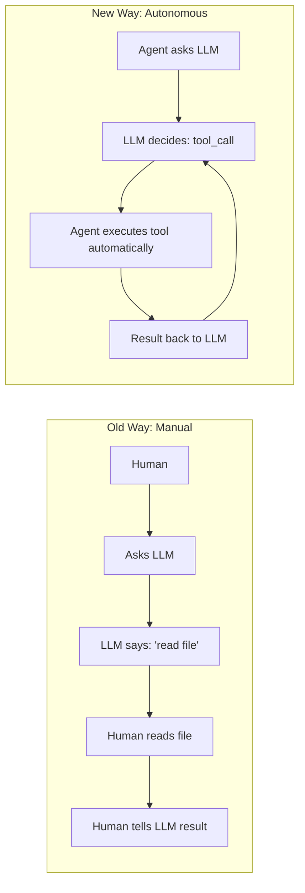
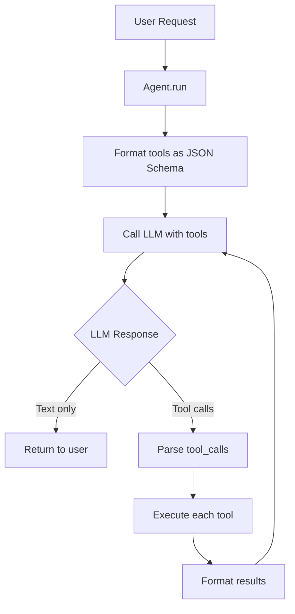

# Day 3, Tutorial 25: Tool Use Loop - LLM Decides When to Use Tools

**Course:** Build Your Own Coding Agent  
**Day:** 3 - Tool Use Loop  
**Tutorial:** 25 of 60  
**Estimated Time:** 90 minutes

---

## 🎯 What You'll Learn

By the end of this tutorial, you'll:
- Understand the **Tool Use Loop** - the magic that makes agents autonomous
- Learn how LLMs output JSON function calls instead of just text
- Implement the **"Thought → Action → Observation"** pattern (ReAct)
- Build the execution loop: `Call → Execute → Return Result → Repeat`
- Parse tool calls from LLM responses and execute them automatically

---

## 🎭 The Big Idea

So far, your agent can:
- ✅ Register tools (T6-T7)
- ✅ Read/write files (T14-T24)
- ✅ Chat with LLMs (T5)

But there's a **critical missing piece**: The agent doesn't know **when** to use tools. The human has to manually call them.

### The Tool Use Loop changes everything:



**The agent becomes autonomous.** The LLM decides what to do, the agent executes, the LLM decides again based on results.

---

## 🔧 How Tool Use Works

### Step 1: Tell the LLM About Available Tools

```python
# You provide the LLM with tool definitions
tools = [
    {
        "name": "read_file",
        "description": "Read contents of a file",
        "input_schema": {...}  # JSON Schema
    },
    {
        "name": "execute_shell",
        "description": "Run a shell command",
        "input_schema": {...}
    }
]
```

### Step 2: LLM Decides to Use a Tool

```json
// Instead of text, LLM returns:
{
    "tool_calls": [
        {
            "name": "read_file",
            "arguments": {"path": "/src/main.py"}
        }
    ]
}
```

### Step 3: Agent Executes the Tool

```python
# Agent parses the tool call, executes it
result = tool_registry.execute("read_file", {"path": "/src/main.py"})
# Returns: "import os\n\ndef main():..."
```

### Step 4: Result Goes Back to LLM

```python
# Agent sends result back to LLM
messages.append({
    "role": "user",  # or "tool" depending on API
    "content": result
})

# LLM decides: "Now I need to edit this file"
```

### Step 5: Loop Until Done

The cycle repeats until the LLM decides no more tools are needed.

---

## 📐 Architecture: Tool Use Loop



---

## 💻 Implementation

### Step 1: Tool Definition Format (JSON Schema)

```python
# src/coding_agent/tools/schema.py
"""JSON Schema definitions for tools."""

from typing import Any


def get_tool_schema(name: str, description: str, parameters: dict) -> dict:
    """Build a tool schema compatible with Anthropic/OpenAI."""
    return {
        "name": name,
        "description": description,
        "input_schema": {
            "type": "object",
            "properties": parameters,
            "required": list(parameters.keys())
        }
    }


# Example: read_file tool schema
READ_FILE_SCHEMA = get_tool_schema(
    name="read_file",
    description="Read the contents of a file at the given path",
    parameters={
        "path": {
            "type": "string",
            "description": "Absolute or relative path to the file"
        },
        "limit": {
            "type": "integer",
            "description": "Optional max lines to read",
            "default": None
        }
    }
)


# Example: write_file tool schema
WRITE_FILE_SCHEMA = get_tool_schema(
    name="write_file",
    description="Write content to a file",
    parameters={
        "path": {
            "type": "string",
            "description": "Path to write the file"
        },
        "content": {
            "type": "string",
            "description": "Content to write"
        }
    }
)
```

### Step 2: LLM Tool Use Response

```python
# src/coding_agent/llm/responses.py
"""Parse LLM responses that include tool calls."""

from dataclasses import dataclass
from typing import Optional, List
import json


@dataclass
class ToolCall:
    """Represents a single tool call from the LLM."""
    name: str
    arguments: dict
    
    @classmethod
    def from_anthropic(cls, tool_use: dict) -> "ToolCall":
        """Parse Anthropic tool_use format."""
        return cls(
            name=tool_use["name"],
            arguments=tool_use["input"]  # Anthropic uses 'input'
        )
    
    @classmethod
    def from_openai(cls, function_call: dict) -> "ToolCall":
        """Parse OpenAI function_call format."""
        return cls(
            name=function_call["name"],
            arguments=json.loads(function_call["arguments"])
        )


@dataclass  
class LLMResponse:
    """Parsed LLM response - either text or tool calls."""
    text: Optional[str] = None
    tool_calls: List[ToolCall] = None
    stop_reason: str = "end_turn"  # or "tool_use"
    
    def has_tool_calls(self) -> bool:
        return bool(self.tool_calls)
```

### Step 3: Anthropic LLM with Tool Use

```python
# src/coding_agent/llm/anthropic.py
"""Anthropic Claude client with tool use support."""

from typing import List, Dict, Any, Optional
import anthropic
from .responses import LLMResponse, ToolCall


class AnthropicClient:
    """Claude client that supports tool use."""
    
    def __init__(self, api_key: str, model: str = "claude-3-5-sonnet-20241022"):
        self.client = anthropic.Anthropic(api_key=api_key)
        self.model = model
    
    def generate(
        self,
        messages: List[Dict],
        tools: Optional[List[Dict]] = None,
        system: Optional[str] = None
    ) -> LLMResponse:
        """
        Call Claude with optional tools.
        
        Args:
            messages: Conversation history
            tools: Optional list of tool schemas
            system: Optional system prompt
            
        Returns:
            LLMResponse with text and/or tool_calls
        """
        # Build the API call
        kwargs = {
            "model": self.model,
            "messages": messages,
            "max_tokens": 4096,
        }
        
        if tools:
            kwargs["tools"] = tools
            kwargs["tool_choice"] = {"type": "auto"}  # Let Claude decide
        
        if system:
            kwargs["system"] = system
        
        # Call Anthropic API
        response = self.client.messages.create(**kwargs)
        
        # Parse the response
        content_blocks = response.content
        text_parts = []
        tool_calls = []
        
        for block in content_blocks:
            if block.type == "text":
                text_parts.append(block.text)
            elif block.type == "tool_use":
                tool_calls.append(ToolCall.from_anthropic({
                    "name": block.name,
                    "input": block.input,
                    "id": block.id
                }))
        
        return LLMResponse(
            text=" ".join(text_parts) if text_parts else None,
            tool_calls=tool_calls if tool_calls else None,
            stop_reason=response.stop_reason  # "end_turn" or "tool_use"
        )
```

### Step 4: The Tool Use Loop

```python
# src/coding_agent/agent.py
"""Agent with autonomous tool use loop."""

from typing import List, Dict, Any, Optional
from .tools.registry import ToolRegistry
from .llm.responses import LLMResponse


class Agent:
    """
    Autonomous agent that can use tools via LLM function calling.
    """
    
    def __init__(
        self,
        llm_client,  # Any LLM client with .generate(messages, tools)
        tool_registry: ToolRegistry,
        system_prompt: Optional[str] = None,
        max_iterations: int = 10  # Safety limit
    ):
        self.llm = llm_client
        self.tools = tool_registry
        self.system_prompt = system_prompt
        self.max_iterations = max_iterations
    
    def run(self, user_input: str) -> str:
        """
        Run the agent on a user request.
        
        This is the TOOL USE LOOP:
        1. Call LLM with tools
        2. If LLM returns tool_calls, execute them
        3. Send results back to LLM
        4. Repeat until LLM says "done" (no tool calls)
        5. Return final text response
        """
        messages = [{"role": "user", "content": user_input}]
        
        # Get tool schemas from registry
        tool_schemas = self.tools.get_schemas()  # Returns list of JSON schemas
        
        iteration = 0
        while iteration < self.max_iterations:
            iteration += 1
            
            # Step 1: Call LLM with available tools
            response = self.llm.generate(
                messages=messages,
                tools=tool_schemas,
                system=self.system_prompt
            )
            
            # Step 2: Check if LLM wants to use tools
            if not response.has_tool_calls():
                # LLM is done - return the text response
                return response.text or "(no response)"
            
            # Step 3: Execute each tool call
            tool_results = []
            for call in response.tool_calls:
                print(f"🛠️  Executing: {call.name}({call.arguments})")
                
                # Execute the tool
                result = self.tools.execute(call.name, call.arguments)
                
                # Format result for LLM
                tool_results.append({
                    "tool_name": call.name,
                    "result": result
                })
            
            # Step 4: Add tool results to conversation
            # Format: "Tool X returned: Y"
            results_text = "\n\n".join([
                f"Tool '{r['tool_name']}' returned:\n{r['result']}"
                for r in tool_results
            ])
            
            messages.append({
                "role": "user",
                "content": f"Tool execution results:\n\n{results_text}"
            })
            
            # Loop continues - LLM decides next action based on results
        
        # Safety limit reached
        return "(Reached max iterations without completion)"
```

### Step 5: ToolRegistry.get_schemas()

```python
# src/coding_agent/tools/registry.py (add to ToolRegistry class)

    def get_schemas(self) -> List[Dict]:
        """
        Return JSON Schema definitions for all registered tools.
        Used by LLM to know what tools are available.
        """
        schemas = []
        for name, tool in self._tools.items():
            schema = {
                "name": name,
                "description": tool.get_description(),
                "input_schema": tool.get_input_schema()  # JSON Schema
            }
            schemas.append(schema)
        return schemas
```

### Step 6: BaseTool with Schema

```python
# src/coding_agent/tools/base.py
"""Base tool class with schema support."""

from abc import ABC, abstractmethod
from typing import Dict, Any


class BaseTool(ABC):
    """Base class for all tools with JSON Schema support."""
    
    @property
    @abstractmethod
    def name(self) -> str:
        """Tool name (snake_case)."""
        pass
    
    @property
    @abstractmethod
    def description(self) -> str:
        """Human-readable description for LLM."""
        pass
    
    @abstractmethod
    def get_input_schema(self) -> Dict:
        """
        Return JSON Schema for tool inputs.
        Example: {"type": "object", "properties": {...}}
        """
        pass
    
    @abstractmethod
    def execute(self, **kwargs) -> str:
        """Execute the tool with given arguments."""
        pass
    
    def get_description(self) -> str:
        """Alias for description property."""
        return self.description
```

### Step 7: Updated ReadFile Tool with Schema

```python
# src/coding_agent/tools/files.py
"""File operation tools with JSON Schema."""

from pathlib import Path
from typing import Dict, Any
from .base import BaseTool


class ReadFileTool(BaseTool):
    """Read file contents - now with JSON Schema for LLM tool use."""
    
    @property
    def name(self) -> str:
        return "read_file"
    
    @property
    def description(self) -> str:
        return "Read the contents of a file at the given path. Returns file contents as string."
    
    def get_input_schema(self) -> Dict:
        """JSON Schema for LLM to know what parameters to provide."""
        return {
            "type": "object",
            "properties": {
                "path": {
                    "type": "string",
                    "description": "Absolute or relative path to the file to read"
                },
                "limit": {
                    "type": ["integer", "null"],
                    "description": "Maximum number of lines to read (optional)"
                }
            },
            "required": ["path"]
        }
    
    def execute(self, path: str, limit: int = None) -> str:
        """Execute read_file tool."""
        try:
            file_path = Path(path).resolve()
            
            if not file_path.exists():
                return f"Error: File not found: {path}"
            
            if not file_path.is_file():
                return f"Error: Path is not a file: {path}"
            
            content = file_path.read_text()
            
            if limit:
                lines = content.split('\n')[:limit]
                content = '\n'.join(lines)
                if len(content.split('\n')) == limit:
                    content += f"\n\n... ({limit} lines shown)"
            
            return content
            
        except Exception as e:
            return f"Error reading file: {e}"
```

---

## 🏃 Example: Agent in Action

```python
# scripts/run_agent.py
"""Run the autonomous agent."""

from coding_agent.llm.anthropic import AnthropicClient
from coding_agent.tools.registry import ToolRegistry
from coding_agent.tools.files import ReadFileTool, WriteFileTool, ListDirTool
from coding_agent.agent import Agent


def main():
    # Set up components
    llm = AnthropicClient(api_key="your-api-key")
    tools = ToolRegistry()
    
    # Register file tools
    tools.register(ReadFileTool())
    tools.register(WriteFileTool())
    tools.register(ListDirTool())
    
    # Create agent with system prompt
    agent = Agent(
        llm_client=llm,
        tool_registry=tools,
        system_prompt="""You are a helpful coding assistant.
You have access to file tools. When asked about code:
1. Read relevant files
2. Analyze the code
3. Suggest improvements or answer questions
4. Be concise.""",
        max_iterations=5
    )
    
    # Run the agent
    user_input = input("You: ")
    response = agent.run(user_input)
    print(f"\nAgent: {response}")


if __name__ == "__main__":
    main()
```

### Example Session:

```
You: What files are in my project?

🛠️  Executing: list_dir({'path': '.'})

Agent: I found these files:
- README.md
- pyproject.toml
- src/
  - coding_agent/
    - agent.py
    - tools/
    - llm/
```

```
You: Read the main agent file and explain what it does

🛠️  Executing: list_dir({'path': 'src/coding_agent'})
🛠️  Executing: read_file({'path': 'src/coding_agent/agent.py'})

Agent: The agent.py file implements an autonomous Agent class that:
1. Takes user input
2. Calls an LLM with available tools
3. If the LLM requests tool calls, executes them
4. Returns results to the LLM
5. Repeats until the LLM provides a text response

The key method is `run()` which implements the tool use loop.
```

---

## 🧠 Key Concepts

### 1. Thought → Action → Observation (ReAct)

The LLM doesn't just call tools randomly - it follows a reasoning pattern:

```
Thought: I need to understand the project structure first.
Action: list_dir({"path": "."})
Observation: [files listed]

Thought: Now I see there's a src/ directory. Let me check the main code.
Action: read_file({"path": "src/main.py"})
Observation: [file contents]

Thought: I now understand the code. Here's my analysis...
```

This is called **ReAct**: Reasoning + Acting.

### 2. Tool Choice: Auto vs Forced

```python
# Let LLM decide whether to use tools
tool_choice={"type": "auto"}  # Default

# Force LLM to use a specific tool
tool_choice={
    "type": "tool",
    "name": "read_file"
}

# Force LLM to NOT use tools (text only)
tool_choice={"type": "none"}
```

### 3. Parallel Tool Calls

LLMs can request multiple tools at once:

```json
{
    "tool_calls": [
        {"name": "read_file", "arguments": {...}},
        {"name": "list_dir", "arguments": {...}},
        {"name": "read_file", "arguments": {...}}
    ]
}
```

Your agent should execute all of them before returning to the LLM.

---

## ✅ Exercise

1. **Implement Tool Use Loop:**
   - Add `get_schemas()` to your ToolRegistry
   - Update ReadFileTool with `get_input_schema()`
   - Implement the Agent.run() loop

2. **Test the Agent:**
   ```python
   # Test: "What Python files are in src/?"
   # Expected: Agent calls list_dir, then reads any .py files
   ```

3. **Add a Tool:**
   - Create a `GrepTool` that searches file contents
   - Register it with the registry
   - Test: "Find all files containing 'class Agent'"

---

## 🔗 Integration with Day 1-2

This tutorial builds on your existing code:
- **T13** (Day 1 Capstone): Base architecture, DI, ToolRegistry
- **T14-T24** (Day 2): File tools now need `get_input_schema()`

### What to Update:

1. Add `get_input_schema()` to all file tools from Day 2
2. Add `get_schemas()` to ToolRegistry
3. Update LLMClient to accept `tools` parameter
4. Implement Agent.run() with the tool use loop

---

## 🎯 Next Up

**Tutorial 26:** JSON Schema Deep Dive - Making your tools discoverable

We'll cover:
- Advanced JSON Schema features
- Making tools self-documenting
- Schema validation before execution

---

## 📚 Resources

- [Anthropic Tool Use Documentation](https://docs.anthropic.com/claude/docs/tool-use)
- [OpenAI Function Calling](https://platform.openai.com/docs/guides/function-calling)
- [ReAct Pattern Paper](https://arxiv.org/abs/2210.03629)

---

*"The tool use loop is what separates a chatbot from an agent. The LLM becomes the brain, your code becomes the hands."*