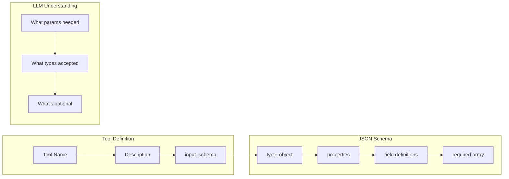

# Day 3, Tutorial 26: JSON Schema for Tool Definitions

**Course:** Build Your Own Coding Agent  
**Day:** 3 - Tool Use Loop  
**Tutorial:** 26 of 60  
**Estimated Time:** 90 minutes

---

## 🎯 What You'll Learn

By the end of this tutorial, you'll:
- Understand **JSON Schema** and why it's essential for tool definitions
- Learn how to write proper input schemas for your tools
- Implement **self-documenting tools** that tell the LLM exactly what parameters they need
- Master advanced schema features: required fields, type validation, enums, descriptions
- Build a schema generator that creates LLM-friendly tool definitions automatically

---

## 🎭 The Big Picture

In Tutorial 25, we learned that LLMs can call tools by receiving JSON function call specifications. But how does the LLM know **what parameters** each tool accepts?

The answer is **JSON Schema** - a standardized way to describe the structure of JSON data. When you register a tool, you provide a schema that tells the LLM:

```json
{
  "name": "read_file",
  "description": "Read the contents of a file",
  "input_schema": {
    "type": "object",
    "properties": {
      "path": {
        "type": "string",
        "description": "Absolute or relative path to the file"
      },
      "limit": {
        "type": "integer",
        "description": "Maximum lines to read (optional)"
      }
    },
    "required": ["path"]
  }
}
```

With this schema, the LLM knows:
- `path` is **required** (must be provided)
- `limit` is **optional** (can be omitted)
- `path` must be a **string**
- `limit` must be an **integer**

---

## 📐 JSON Schema Deep Dive



---

## 💻 Implementation

### Step 1: Understanding JSON Schema Basics

```python
# src/coding_agent/tools/schema.py
"""JSON Schema definitions for tools - the foundation of tool use."""

from typing import Dict, Any, List, Optional
from dataclasses import dataclass, field


@dataclass
class SchemaProperty:
    """
    A single property in a JSON Schema.
    
    This helper class makes it easy to build schemas
    without manually constructing dictionaries.
    """
    name: str
    type: str  # "string", "integer", "number", "boolean", "array", "object"
    description: str
    required: bool = False
    default: Any = None
    enum: Optional[List[Any]] = None
    minimum: Optional[float] = None
    maximum: Optional[float] = None
    min_length: Optional[int] = None
    max_length: Optional[int] = None
    items: Optional[Dict[str, Any]] = None  # For arrays
    
    def to_json_schema(self) -> Dict[str, Any]:
        """Convert to JSON Schema property definition."""
        schema = {
            "type": self.type,
            "description": self.description,
        }
        
        # Add optional constraints
        if self.default is not None:
            schema["default"] = self.default
        
        if self.enum is not None:
            schema["enum"] = self.enum
        
        if self.minimum is not None:
            schema["minimum"] = self.minimum
        
        if self.maximum is not None:
            schema["maximum"] = self.maximum
        
        if self.min_length is not None:
            schema["minLength"] = self.min_length
        
        if self.max_length is not None:
            schema["maxLength"] = self.max_length
        
        if self.items is not None:
            schema["items"] = self.items
        
        return schema


class ToolSchema:
    """
    Builder for tool input schemas.
    
    Makes it easy to create well-formed JSON Schema
    definitions for LLM tool use.
    
    Usage:
        schema = (ToolSchema("read_file", "Read a file")
            .add_property("path", "string", "File path to read", required=True)
            .add_property("limit", "integer", "Max lines", default=None)
            .build())
    """
    
    def __init__(self, name: str, description: str):
        self.name = name
        self.description = description
        self._properties: Dict[str, SchemaProperty] = {}
        self._required: List[str] = []
    
    def add_property(
        self,
        name: str,
        type: str,
        description: str,
        required: bool = False,
        **kwargs
    ) -> "ToolSchema":
        """
        Add a property to the schema.
        
        Args:
            name: Property name (snake_case)
            type: JSON type (string, integer, number, boolean, array, object)
            description: Human-readable description
            required: Whether this property is required
            **kwargs: Additional schema options (default, enum, min, max, etc.)
        
        Returns:
            Self for method chaining
        """
        prop = SchemaProperty(
            name=name,
            type=type,
            description=description,
            required=required,
            **kwargs
        )
        
        self._properties[name] = prop
        
        if required:
            self._required.append(name)
        
        return self
    
    def add_string_property(
        self,
        name: str,
        description: str,
        required: bool = False,
        min_length: int = None,
        max_length: int = None,
        enum: List[str] = None,
    ) -> "ToolSchema":
        """Convenience method for string properties."""
        return self.add_property(
            name=name,
            type="string",
            description=description,
            required=required,
            min_length=min_length,
            max_length=max_length,
            enum=enum,
        )
    
    def add_integer_property(
        self,
        name: str,
        description: str,
        required: bool = False,
        minimum: int = None,
        maximum: int = None,
        default: int = None,
    ) -> "ToolSchema":
        """Convenience method for integer properties."""
        return self.add_property(
            name=name,
            type="integer",
            description=description,
            required=required,
            minimum=minimum,
            maximum=maximum,
            default=default,
        )
    
    def add_boolean_property(
        self,
        name: str,
        description: str,
        required: bool = False,
        default: bool = None,
    ) -> "ToolSchema":
        """Convenience method for boolean properties."""
        return self.add_property(
            name=name,
            type="boolean",
            description=description,
            required=required,
            default=default,
        )
    
    def add_array_property(
        self,
        name: str,
        description: str,
        required: bool = False,
        items_schema: Dict[str, Any] = None,
    ) -> "ToolSchema":
        """Convenience method for array properties."""
        return self.add_property(
            name=name,
            type="array",
            description=description,
            required=required,
            items=items_schema,
        )
    
    def build(self) -> Dict[str, Any]:
        """
        Build the complete JSON Schema.
        
        Returns:
            Dictionary suitable for LLM tool definition
        """
        properties = {
            name: prop.to_json_schema()
            for name, prop in self._properties.items()
        }
        
        schema = {
            "type": "object",
            "properties": properties,
        }
        
        if self._required:
            schema["required"] = self._required
        
        return schema
    
    def to_tool_definition(self) -> Dict[str, Any]:
        """
        Build complete tool definition for LLM.
        
        Returns:
            Full tool definition with name, description, and input_schema
        """
        return {
            "name": self.name,
            "description": self.description,
            "input_schema": self.build()
        }
```

### Step 2: Using the Schema Builder

```python
# Example: Building schemas with the helper classes

# Simple read_file schema
read_file_schema = (
    ToolSchema("read_file", "Read the contents of a file")
    .add_string_property(
        "path",
        "Absolute or relative path to the file",
        required=True
    )
    .add_integer_property(
        "limit",
        "Maximum number of lines to read (optional)",
        default=None
    )
    .build()
)

# write_file schema with more options
write_file_schema = (
    ToolSchema("write_file", "Write content to a file")
    .add_string_property(
        "path",
        "Path to the file to write",
        required=True
    )
    .add_string_property(
        "content",
        "Content to write to the file",
        required=True
    )
    .add_boolean_property(
        "append",
        "Append to file instead of overwriting",
        default=False
    )
    .build()
)

# Schema with enum (limited choices)
grep_schema = (
    ToolSchema("grep", "Search for patterns in files")
    .add_string_property(
        "pattern",
        "Search pattern (regex supported)",
        required=True
    )
    .add_string_property(
        "path",
        "File or directory to search",
        required=True
    )
    .add_string_property(
        "case_sensitive",
        "Whether to match case exactly",
        required=False,
        enum=["true", "false"],  # Wait, this should be boolean
    )
    .build()
)

# Fix: Boolean should be actual boolean type
grep_schema_corrected = (
    ToolSchema("grep", "Search for patterns in files")
    .add_string_property(
        "pattern",
        "Search pattern (regex supported)",
        required=True,
        min_length=1
    )
    .add_string_property(
        "path",
        "File or directory to search",
        required=True
    )
    .add_boolean_property(
        "case_sensitive",
        "Whether to match case exactly",
        default=True
    )
    .build()
)
```

### Step 3: Updating BaseTool with Schema Support

```python
# src/coding_agent/tools/base.py
"""Base tool class with comprehensive JSON Schema support."""

from abc import ABC, abstractmethod
from typing import Dict, Any, List, Optional
from dataclasses import dataclass
import logging

logger = logging.getLogger(__name__)


@dataclass
class ToolDefinition:
    """
    Complete tool definition for LLM consumption.
    
    This is what gets sent to the LLM to describe
    what tools are available.
    """
    name: str
    description: str
    input_schema: Dict[str, Any]
    
    def to_dict(self) -> Dict[str, Any]:
        """Convert to dictionary format."""
        return {
            "name": self.name,
            "description": self.description,
            "input_schema": self.input_schema
        }


class BaseTool(ABC):
    """
    Abstract base class for all tools with full JSON Schema support.
    
    This version (Tutorial 26) adds comprehensive schema generation
    to make tools fully self-documenting for LLMs.
    """
    
    def __init__(self, config: Optional[Dict[str, Any]] = None):
        """Initialize the tool."""
        self.config = config or {}
        self.logger = logging.getLogger(f"{__name__}.{self.__class__.__name__}")
    
    @property
    @abstractmethod
    def name(self) -> str:
        """Tool name in snake_case."""
        pass
    
    @property
    @abstractmethod
    def description(self) -> str:
        """Human-readable description of what the tool does."""
        pass
    
    @property
    def input_schema(self) -> Dict[str, Any]:
        """
        JSON Schema for tool input.
        
        Override this in subclasses to define parameters.
        The default returns an empty object schema.
        """
        return {
            "type": "object",
            "properties": {},
            "required": []
        }
    
    def get_definition(self) -> ToolDefinition:
        """
        Get complete tool definition for LLM.
        
        Returns:
            ToolDefinition with name, description, and schema
        """
        return ToolDefinition(
            name=self.name,
            description=self.description,
            input_schema=self.input_schema
        )
    
    @abstractmethod
    def execute(self, **params: Any) -> str:
        """
        Execute the tool with given parameters.
        
        Args:
            **params: Tool-specific parameters
            
        Returns:
            Tool result as string
        """
        pass
    
    def validate_params(self, params: Dict[str, Any]) -> bool:
        """
        Validate parameters against the schema.
        
        Args:
            params: Parameters to validate
            
        Returns:
            True if valid
            
        Raises:
            ValueError: If validation fails
        """
        schema = self.input_schema
        required = schema.get("required", [])
        
        # Check required fields
        for field in required:
            if field not in params or params[field] is None:
                raise ValueError(f"Missing required parameter: {field}")
        
        # Check types
        properties = schema.get("properties", {})
        for name, value in params.items():
            if name in properties:
                expected_type = properties[name].get("type")
                
                # Type mapping from JSON Schema to Python
                type_map = {
                    "string": str,
                    "integer": int,
                    "number": (int, float),
                    "boolean": bool,
                    "array": list,
                    "object": dict,
                }
                
                expected_python_type = type_map.get(expected_type)
                if expected_python_type and not isinstance(value, expected_python_type):
                    # Special case: integer is also valid for number
                    if expected_type == "integer" and isinstance(value, float):
                        continue
                    raise ValueError(
                        f"Parameter '{name}' must be {expected_type}, "
                        f"got {type(value).__name__}"
                    )
        
        return True
    
    def __repr__(self) -> str:
        return f"{self.__class__.__name__}(name={self.name})"
```

### Step 4: Implementing Tools with Full Schemas

```python
# src/coding_agent/tools/files.py
"""File tools with comprehensive JSON Schema definitions."""

from pathlib import Path
from typing import Dict, Any, Optional
from .base import BaseTool


class ReadFileTool(BaseTool):
    """Read file contents - fully documented with JSON Schema."""
    
    def __init__(self, validator=None, config: Optional[Dict[str, Any]] = None):
        super().__init__(config)
        self.validator = validator
    
    @property
    def name(self) -> str:
        return "read_file"
    
    @property
    def description(self) -> str:
        return (
            "Read the contents of a file at the given path. "
            "Returns the file contents as a string. "
            "Use this to examine code, configuration, or text files."
        )
    
    @property
    def input_schema(self) -> Dict[str, Any]:
        return {
            "type": "object",
            "properties": {
                "path": {
                    "type": "string",
                    "description": "Absolute or relative path to the file to read",
                    "minLength": 1
                },
                "encoding": {
                    "type": "string",
                    "description": "File encoding (default: utf-8)",
                    "default": "utf-8",
                    "enum": ["utf-8", "latin-1", "ascii", "utf-16"]
                },
                "limit": {
                    "type": ["integer", "null"],
                    "description": "Maximum number of lines to read (optional, returns all lines if null)",
                    "minimum": 1
                },
                "start_line": {
                    "type": ["integer", "null"],
                    "description": "1-based line number to start reading from (optional)",
                    "minimum": 1
                }
            },
            "required": ["path"],
            "description": "Read contents of a file"
        }
    
    def execute(self, **params) -> str:
        """Execute read_file tool."""
        # Validate parameters first
        self.validate_params(params)
        
        try:
            path = params["path"]
            encoding = params.get("encoding", "utf-8")
            limit = params.get("limit")
            start_line = params.get("start_line", 1) - 1  # Convert to 0-based
            
            if self.validator:
                file_path = self.validator.validate_input_path(path)
            else:
                file_path = Path(path).resolve()
            
            if not file_path.exists():
                return f"Error: File not found: {path}"
            
            if not file_path.is_file():
                return f"Error: Path is not a file: {path}"
            
            content = file_path.read_text(encoding=encoding)
            
            # Apply line limits
            lines = content.split('\n')
            
            if start_line > 0:
                lines = lines[start_line:]
            
            if limit:
                lines = lines[:limit]
                truncated = len(content.split('\n')) > limit
                content = '\n'.join(lines)
                if truncated:
                    content += f"\n\n... ({limit} line limit reached)"
            else:
                content = '\n'.join(lines)
            
            return content
            
        except Exception as e:
            return f"Error reading file: {e}"


class WriteFileTool(BaseTool):
    """Write content to a file - fully documented with JSON Schema."""
    
    def __init__(self, validator=None, config: Optional[Dict[str, Any]] = None):
        super().__init__(config)
        self.validator = validator
    
    @property
    def name(self) -> str:
        return "write_file"
    
    @property
    def description(self) -> str:
        return (
            "Write content to a file. Creates the file if it doesn't exist, "
            "or overwrites existing file if it does. Use this to create or "
            "update code files, configuration, or any text content."
        )
    
    @property
    def input_schema(self) -> Dict[str, Any]:
        return {
            "type": "object",
            "properties": {
                "path": {
                    "type": "string",
                    "description": "Absolute or relative path to the file to write",
                    "minLength": 1
                },
                "content": {
                    "type": "string",
                    "description": "Content to write to the file"
                },
                "encoding": {
                    "type": "string",
                    "description": "File encoding (default: utf-8)",
                    "default": "utf-8",
                    "enum": ["utf-8", "latin-1", "ascii", "utf-16"]
                },
                "append": {
                    "type": "boolean",
                    "description": "Append to file instead of overwriting (default: false)",
                    "default": False
                },
                "atomic": {
                    "type": "boolean",
                    "description": "Use atomic write for safety (default: true). Writes to temp file first, then renames.",
                    "default": True
                }
            },
            "required": ["path", "content"],
            "description": "Write content to a file"
        }
    
    def execute(self, **params) -> str:
        """Execute write_file tool."""
        self.validate_params(params)
        
        try:
            path = params["path"]
            content = params["content"]
            encoding = params.get("encoding", "utf-8")
            append = params.get("append", False)
            atomic = params.get("atomic", True)
            
            if self.validator:
                file_path = self.validator.validate_output_path(path)
            else:
                file_path = Path(path).resolve()
            
            # Ensure parent directory exists
            file_path.parent.mkdir(parents=True, exist_ok=True)
            
            if atomic:
                # Write to temp file, then rename
                temp_path = file_path.with_suffix(file_path.suffix + ".tmp")
                try:
                    if append and file_path.exists():
                        content = file_path.read_text() + content
                    temp_path.write_text(content, encoding=encoding)
                    temp_path.replace(file_path)
                except Exception:
                    if temp_path.exists():
                        temp_path.unlink()
                    raise
            else:
                # Direct write
                if append and file_path.exists():
                    content = file_path.read_text() + content
                file_path.write_text(content, encoding=encoding)
            
            return f"Successfully wrote {len(content)} characters to {path}"
            
        except Exception as e:
            return f"Error writing file: {e}"


class ListDirectoryTool(BaseTool):
    """List directory contents - fully documented with JSON Schema."""
    
    def __init__(self, validator=None, config: Optional[Dict[str, Any]] = None):
        super().__init__(config)
        self.validator = validator
    
    @property
    def name(self) -> str:
        return "list_dir"
    
    @property
    def description(self) -> str:
        return (
            "List contents of a directory. Shows files and subdirectories "
            "with optional filtering by pattern and sorting options."
        )
    
    @property
    def input_schema(self) -> Dict[str, Any]:
        return {
            "type": "object",
            "properties": {
                "path": {
                    "type": "string",
                    "description": "Directory path to list (default: current directory)",
                    "default": "."
                },
                "pattern": {
                    "type": ["string", "null"],
                    "description": "Glob pattern to filter results (e.g., '*.py' for Python files)"
                },
                "include_hidden": {
                    "type": "boolean",
                    "description": "Include hidden files starting with '.' (default: false)",
                    "default": False
                },
                "sort_by": {
                    "type": "string",
                    "description": "How to sort results",
                    "default": "name",
                    "enum": ["name", "size", "date"]
                },
                "max_results": {
                    "type": ["integer", "null"],
                    "description": "Maximum number of results to return",
                    "minimum": 1,
                    "maximum": 1000
                }
            },
            "required": [],
            "description": "List directory contents"
        }
    
    def execute(self, **params) -> str:
        """Execute list_dir tool."""
        self.validate_params(params)
        
        try:
            path = params.get("path", ".")
            pattern = params.get("pattern")
            include_hidden = params.get("include_hidden", False)
            sort_by = params.get("sort_by", "name")
            max_results = params.get("max_results")
            
            if self.validator:
                dir_path = self.validator.validate_input_path(path)
            else:
                dir_path = Path(path).resolve()
            
            if not dir_path.exists():
                return f"Error: Directory not found: {path}"
            
            if not dir_path.is_dir():
                return f"Error: Not a directory: {path}"
            
            # Collect entries
            entries = []
            for entry in dir_path.iterdir():
                # Skip hidden unless requested
                if not include_hidden and entry.name.startswith("."):
                    continue
                
                # Apply pattern filter
                if pattern and not entry.match(pattern):
                    continue
                
                stat = entry.stat()
                entries.append({
                    "name": entry.name,
                    "type": "dir" if entry.is_dir() else "file",
                    "size": stat.st_size if entry.is_file() else 0,
                    "modified": stat.st_mtime,
                })
            
            # Sort
            if sort_by == "size":
                entries.sort(key=lambda x: x["size"], reverse=True)
            elif sort_by == "date":
                entries.sort(key=lambda x: x["modified"], reverse=True)
            else:
                entries.sort(key=lambda x: x["name"].lower())
            
            # Apply limit
            if max_results:
                entries = entries[:max_results]
            
            # Format output
            output = f"Contents of {dir_path} ({len(entries)} items):\n"
            for entry in entries:
                prefix = "[DIR]" if entry["type"] == "dir" else "[FILE]"
                size_str = f" ({entry['size']:,} bytes)" if entry["type"] == "file" else ""
                output += f"  {prefix} {entry['name']}{size_str}\n"
            
            return output
            
        except Exception as e:
            return f"Error listing directory: {e}"


class GrepTool(BaseTool):
    """Search file contents - fully documented with JSON Schema."""
    
    def __init__(self, validator=None, config: Optional[Dict[str, Any]] = None):
        super().__init__(config)
        self.validator = validator
    
    @property
    def name(self) -> str:
        return "grep"
    
    @property
    def description(self) -> str:
        return (
            "Search for text patterns in files. Supports regular expressions. "
            "Returns matching lines with file path and line number."
        )
    
    @property
    def input_schema(self) -> Dict[str, Any]:
        return {
            "type": "object",
            "properties": {
                "pattern": {
                    "type": "string",
                    "description": "Search pattern. Supports regex syntax.",
                    "minLength": 1
                },
                "path": {
                    "type": "string",
                    "description": "File or directory to search in",
                    "default": "."
                },
                "use_regex": {
                    "type": "boolean",
                    "description": "Treat pattern as regular expression (default: true)",
                    "default": True
                },
                "case_sensitive": {
                    "type": "boolean",
                    "description": "Match case exactly (default: true)",
                    "default": True
                },
                "include_binary": {
                    "type": "boolean",
                    "description": "Include binary files in search (default: false)",
                    "default": False
                },
                "max_results": {
                    "type": ["integer", "null"],
                    "description": "Maximum number of matches to return",
                    "minimum": 1,
                    "maximum": 500
                }
            },
            "required": ["pattern"],
            "description": "Search for patterns in files"
        }
    
    def execute(self, **params) -> str:
        """Execute grep tool."""
        self.validate_params(params)
        
        import re
        
        try:
            pattern = params["pattern"]
            path = params.get("path", ".")
            use_regex = params.get("use_regex", True)
            case_sensitive = params.get("case_sensitive", True)
            include_binary = params.get("include_binary", False)
            max_results = params.get("max_results")
            
            if self.validator:
                search_path = self.validator.validate_input_path(path)
            else:
                search_path = Path(path).resolve()
            
            # Compile pattern
            flags = 0 if case_sensitive else re.IGNORECASE
            if use_regex:
                compiled_pattern = re.compile(pattern, flags)
            else:
                compiled_pattern = re.compile(re.escape(pattern), flags)
            
            # Collect files to search
            if search_path.is_file():
                files_to_search = [search_path]
            else:
                files_to_search = []
                for f in search_path.glob("**/*"):
                    if f.is_file():
                        if not include_binary and f.suffix in {
                            ".png", ".jpg", ".pdf", ".zip", ".exe", ".so"
                        }:
                            continue
                        files_to_search.append(f)
            
            # Search
            results = []
            for file_path in files_to_search[:200]:
                try:
                    content = file_path.read_text(errors="ignore")
                except:
                    continue
                
                for line_num, line in enumerate(content.splitlines(), 1):
                    if compiled_pattern.search(line):
                        results.append({
                            "file": str(file_path),
                            "line": line_num,
                            "content": line[:200]
                        })
                        
                        if max_results and len(results) >= max_results:
                            break
                
                if max_results and len(results) >= max_results:
                    break
            
            # Format output
            if not results:
                return f"No matches found for '{pattern}' in {path}"
            
            output = f"Found {len(results)} matches:\n"
            for r in results[:50]:
                output += f"{r['file']}:{r['line']}: {r['content']}\n"
            
            if len(results) > 50:
                output += f"\n... and {len(results) - 50} more matches"
            
            return output
            
        except Exception as e:
            return f"Error searching: {e}"
```

### Step 5: ToolRegistry with Schema Generation

```python
# src/coding_agent/tools/registry.py
"""Tool Registry with JSON Schema support."""

from typing import Dict, List, Optional, Any
import logging

from coding_agent.tools.base import BaseTool, ToolDefinition
from coding_agent.exceptions import ToolNotFoundError, ToolError

logger = logging.getLogger(__name__)


class ToolRegistry:
    """
    Registry for managing tools with JSON Schema support.
    
    This version (Tutorial 26) adds schema generation methods
    for LLM tool use.
    """
    
    def __init__(self):
        """Initialize an empty registry."""
        self._tools: Dict[str, BaseTool] = {}
        self._tool_names: Dict[str, str] = {}  # alias -> canonical name
        logger.info("ToolRegistry initialized")
    
    def register(self, tool: BaseTool, alias: Optional[str] = None) -> None:
        """Register a tool."""
        if tool.name in self._tools:
            logger.warning(f"Tool '{tool.name}' already registered, replacing")
        
        self._tools[tool.name] = tool
        
        if alias:
            self._tool_names[alias] = tool.name
        
        logger.debug(f"Registered tool: {tool.name}")
    
    def unregister(self, name: str) -> None:
        """Remove a tool."""
        if name not in self._tools and name not in self._tool_names:
            raise ToolNotFoundError(f"Tool not found: {name}")
        
        canonical = self._tool_names.get(name, name)
        del self._tools[canonical]
        
        self._tool_names = {
            alias: cn for alias, cn in self._tool_names.items()
            if cn != canonical
        }
        
        logger.debug(f"Unregistered tool: {canonical}")
    
    def get(self, name: str) -> BaseTool:
        """Get a tool by name."""
        canonical = self._tool_names.get(name, name)
        
        if canonical not in self._tools:
            raise ToolNotFoundError(
                f"Tool not found: {name}",
                details={"available": self.list_tools()}
            )
        
        return self._tools[canonical]
    
    def execute(self, name: str, **params: Any) -> str:
        """Execute a tool by name."""
        tool = self.get(name)
        
        try:
            tool.validate_params(params)
        except ValueError as e:
            raise ToolError(f"Validation failed for {name}: {e}") from e
        
        try:
            result = tool.execute(**params)
            return result
        except Exception as e:
            raise ToolError(f"Failed to execute {name}: {e}") from e
    
    def list_tools(self) -> List[str]:
        """List all registered tool names."""
        return list(self._tools.keys())
    
    def get_definitions(self) -> List[ToolDefinition]:
        """Get tool definitions for all registered tools."""
        return [tool.get_definition() for tool in self._tools.values()]
    
    def get_schemas(self) -> List[Dict[str, Any]]:
        """
        Get JSON Schema format for all tools.
        
        This is the format expected by Anthropic and OpenAI APIs.
        
        Returns:
            List of tool definition dictionaries
        """
        schemas = []
        for tool in self._tools.values():
            definition = tool.get_definition()
            schemas.append(definition.to_dict())
        return schemas
    
    def get_schema_by_name(self, name: str) -> Dict[str, Any]:
        """Get schema for a specific tool."""
        tool = self.get(name)
        return tool.get_definition().to_dict()
    
    def __len__(self) -> int:
        """Number of registered tools."""
        return len(self._tools)
    
    def __contains__(self, name: str) -> bool:
        """Check if tool is registered."""
        return name in self._tools or name in self._tool_names
    
    def __repr__(self) -> str:
        return f"ToolRegistry(tools={len(self._tools)})"
```

### Step 6: Demo Script

```python
# scripts/demo_schema.py
"""Demo script showing JSON Schema in action."""

import sys
from pathlib import Path

sys.path.insert(0, str(Path(__file__).parent.parent / "src"))

from coding_agent.tools.registry import ToolRegistry
from coding_agent.tools.files import ReadFileTool, WriteFileTool, ListDirectoryTool, GrepTool


def main():
    """Demonstrate JSON Schema tool definitions."""
    
    print("=" * 60)
    print("🛠️  JSON Schema Tool Definitions Demo")
    print("=" * 60)
    print()
    
    # Create registry
    registry = ToolRegistry()
    
    # Register tools (without validator for demo)
    registry.register(ReadFileTool(validator=None))
    registry.register(WriteFileTool(validator=None))
    registry.register(ListDirectoryTool(validator=None))
    registry.register(GrepTool(validator=None))
    
    print(f"Registered {len(registry)} tools: {registry.list_tools()}")
    print()
    
    # Get schemas
    schemas = registry.get_schemas()
    
    print("=" * 60)
    print("📋 Tool Schemas (for LLM)")
    print("=" * 60)
    
    for schema in schemas:
        print(f"\n🔧 Tool: {schema['name']}")
        print(f"   Description: {schema['description']}")
        print(f"   Input Schema:")
        
        import json
        schema_json = json.dumps(schema["input_schema"], indent=4)
        for line in schema_json.split('\n'):
            print(f"      {line}")
    
    print()
    print("=" * 60)
    print("🔍 Individual Tool Schema: read_file")
    print("=" * 60)
    
    read_schema = registry.get_schema_by_name("read_file")
    import json
    print(json.dumps(read_schema, indent=2))
    
    print()
    print("=" * 60)
    print("✨ Demo Complete!")
    print("=" * 60)
    print()
    print("These schemas are what gets sent to the LLM to tell it")
    print("what parameters each tool accepts. The LLM uses this")
    print("information to generate valid tool calls automatically.")


if __name__ == "__main__":
    main()
```

### Running the Demo

```bash
cd /path/to/coding-agent
python scripts/demo_schema.py
```

**Expected Output:**

```
============================================================
🛠️  JSON Schema Tool Definitions Demo
============================================================

Registered 4 tools: ['read_file', 'write_file', 'list_dir', 'grep']

============================================================
📋 Tool Schemas (for LLM)
============================================================

🔧 Tool: read_file
   Description: Read the contents of a file at the given path...
   Input Schema:
      {
          "type": "object",
          "properties": {
              "path": {
                  "type": "string",
                  "description": "Absolute or relative path to the file to read",
                  "minLength": 1
              },
              ...
          },
          "required": ["path"]
      }
```

---

## 🧠 Advanced Schema Features

### 1. Nested Objects

```python
# Schema with nested object property
nested_schema = {
    "type": "object",
    "properties": {
        "options": {
            "type": "object",
            "description": "Additional options",
            "properties": {
                "recursive": {
                    "type": "boolean",
                    "description": "Process recursively"
                },
                "depth": {
                    "type": "integer",
                    "description": "Maximum depth"
                }
            }
        }
    }
}
```

### 2. Arrays with Specific Items

```python
# Schema with array of strings
array_schema = {
    "type": "object",
    "properties": {
        "paths": {
            "type": "array",
            "description": "List of file paths",
            "items": {
                "type": "string",
                "description": "A file path"
            },
            "minItems": 1
        }
    },
    "required": ["paths"]
}
```

### 3. Combining Types (nullable)

```python
# Optional integer - can be integer or null
nullable_schema = {
    "type": "object",
    "properties": {
        "limit": {
            "type": ["integer", "null"],
            "description": "Max results (null for unlimited)"
        }
    }
}
```

---

## ✅ Exercise

1. **Create a Schema for a New Tool:**
   - Add a `SearchFilesTool` that finds files by name pattern
   - Include schema with parameters: `path`, `pattern`, `file_type`, `max_results`

2. **Test Schema Validation:**
   ```python
   tool = ReadFileTool()
   tool.validate_params({"path": "test.txt"})  # Should pass
   tool.validate_params({})  # Should raise - missing required "path"
   ```

3. **Generate Full Schema Output:**
   ```python
   registry = ToolRegistry()
   registry.register(ReadFileTool())
   schemas = registry.get_schemas()
   print(json.dumps(schemas, indent=2))
   ```

---

## 🔗 Integration with Previous Tutorials

This tutorial builds on:
- **T13** (Day 1 Capstone): BaseTool, ToolRegistry foundation
- **T25** (Day 3 start): Tool use concept, LLM function calling

### What We Added:

| Previous | This Tutorial (T26) |
|----------|-------------------|
| `BaseTool` with basic schema | `BaseTool` with full JSON Schema |
| `ToolRegistry.execute()` | Added `get_schemas()`, schema validation |
| Manual schema dicts | `ToolSchema` builder class |
| No parameter validation | Full `validate_params()` with type checking |

---

## 🎯 Next Up

**Tutorial 27:** Anthropic Tool Use Format

We'll cover:
- Anthropic's specific tool_use format
- Converting our schemas to Anthropic format
- Handling tool_choice options
- Testing with Claude API

---

## 📚 Resources

- [JSON Schema Official Documentation](https://json-schema.org/)
- [Anthropic Tool Use](https://docs.anthropic.com/claude/docs/tool-use)
- [OpenAI Function Calling](https://platform.openai.com/docs/guides/function-calling)

---

*"JSON Schema is the contract between your tools and the LLM. Good schemas mean reliable tool use."*