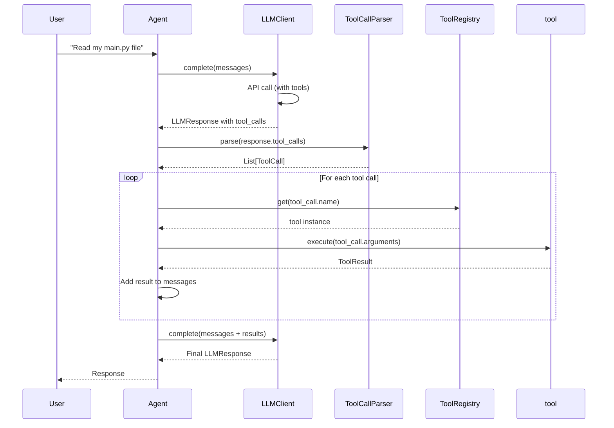

# Day 3, Tutorial 29: Parsing Tool Calls from LLM Responses

**Course:** Build Your Own Coding Agent  
**Day:** 3 - Tool Use Loop  
**Tutorial:** 29 of 60  
**Estimated Time:** 60 minutes

---

## 🎯 What You'll Learn

By the end of this tutorial, you'll:
- **Extract** tool calls from both Anthropic and OpenAI API responses
- **Parse** the JSON arguments from LLM tool call payloads
- **Validate** tool call structure before execution
- **Handle** malformed responses gracefully
- **Build** a unified `ToolCallParser` class that works with any LLM provider

---

## 🎭 The Big Picture

In Tutorials 25-28, we learned:
- How tool use works conceptually (T25)
- How to define tools with JSON Schema (T26)
- Anthropic's specific `tool_use` format (T27)
- OpenAI's specific `function_call` format (T28)

**Now comes the critical piece:** Actually extracting and parsing those tool calls from the raw API response!

```mermaid
flowchart TD
    subgraph "LLM Response"
        A[Raw API Response]
    end
    
    subgraph "Parsing Pipeline"
        B[Detect Format] --> C{Which Provider?}
        C -->|"Anthropic"| D[Extract tool_use blocks]
        C -->|"OpenAI"| E[Extract tool_calls array]
        
        D --> F[Parse Arguments JSON]
        E --> F
        
        F --> G[Validate Structure]
        G --> H[Create ToolCall Object]
    end
    
    subgraph "Output"
        I[List[ToolCall]]
    end
    
    H --> I
    
    style B fill:#e3f2fd,stroke:#1565c0
    style F fill:#fff3e0,stroke:#e65100
    style H fill:#e8f5e9,stroke:#388e3c
```

---

## 🏗️ Why Parsing Matters

When an LLM decides to use a tool, it doesn't just say "I'll use read_file." Instead:

**Anthropic returns:**
```json
{
  "content": [
    {
      "type": "tool_use",
      "id": "toolu_1234",
      "name": "read_file",
      "input": {"path": "/home/user/project/main.py"}
    }
  ]
}
```

**OpenAI returns:**
```json
{
  "tool_calls": [
    {
      "id": "call_abc123",
      "type": "function",
      "function": {
        "name": "read_file",
        "arguments": "{\"path\": \"/home/user/project/main.py\"}"
      }
    }
  ]
}
```

These formats are **completely different!** Your agent needs to:
1. Detect which provider generated the response
2. Extract tool calls using the correct path
3. Parse JSON arguments (note: OpenAI sends a STRING, not an object!)
4. Validate the structure before executing

---

## 💻 Implementation

### Step 1: Define the ToolCall Data Class

First, let's create a clean representation of a tool call:

```python
# src/coding_agent/llm/tool_call.py
"""
Tool call parsing and representation.

This module handles extracting and parsing tool calls from
LLM responses in both Anthropic and OpenAI formats.
"""

import json
import logging
from typing import Optional, Dict, Any, List
from dataclasses import dataclass, field
from datetime import datetime

logger = logging.getLogger(__name__)


@dataclass
class ToolCall:
    """
    Represents a single tool call from the LLM.
    
    This is our internal format - provider-agnostic.
    The ToolCallParser converts provider-specific formats
    into this unified representation.
    """
    
    id: str                          # Unique call ID (provider-generated)
    name: str                        # Tool name to call
    arguments: Dict[str, Any]        # Parsed arguments dict
    raw_arguments: str               # Raw JSON string (for debugging)
    provider: str                    # "anthropic" or "openai"
    timestamp: datetime = field(default_factory=datetime.now)
    
    def __str__(self) -> str:
        return f"ToolCall({self.name}, id={self.id[:12]}...)"
    
    def __repr__(self) -> str:
        args_preview = json.dumps(self.arguments)[:50]
        return f"ToolCall(id={self.id}, name={self.name}, args={args_preview}...)"


class ToolCallParseError(Exception):
    """Raised when tool call parsing fails."""
    
    def __init__(self, message: str, raw_data: Any = None):
        super().__init__(message)
        self.raw_data = raw_data
```

**Why this structure?**
- `id`: Critical for tracking which result goes with which call
- `name`: The tool to execute
- `arguments`: Already-parsed dict for easy access
- `raw_arguments`: Keep the original for debugging/logging
- `provider`: Know which format to use for result insertion

---

### Step 2: The ToolCallParser Class

Now let's build the core parser that handles both formats:

```python
# src/coding_agent/llm/tool_call_parser.py
"""
Tool call parser - handles extraction from Anthropic and OpenAI responses.
"""

import json
import logging
from typing import Optional, Dict, Any, List, Union

from .tool_call import ToolCall, ToolCallParseError

logger = logging.getLogger(__name__)


class ToolCallParser:
    """
    Unified parser for extracting tool calls from LLM responses.
    
    Supports both:
    - Anthropic's tool_use format
    - OpenAI's function calling format
    
    Example:
        parser = ToolCallParser()
        
        # Parse Anthropic response
        tool_calls = parser.parse(response.content, provider="anthropic")
        
        # Parse OpenAI response
        tool_calls = parser.parse(response.tool_calls, provider="openai")
    """
    
    def __init__(self, strict: bool = True):
        """
        Initialize the parser.
        
        Args:
            strict: If True, raise on malformed tool calls.
                   If False, log warnings and skip bad calls.
        """
        self.strict = strict
    
    def parse(
        self, 
        response_data: Any, 
        provider: str
    ) -> List[ToolCall]:
        """
        Parse tool calls from an LLM response.
        
        Args:
            response_data: The raw response data from the LLM
            provider: "anthropic" or "openai"
            
        Returns:
            List of ToolCall objects
            
        Raises:
            ToolCallParseError: If strict=True and parsing fails
        """
        if provider.lower() == "anthropic":
            return self._parse_anthropic(response_data)
        elif provider.lower() == "openai":
            return self._parse_openai(response_data)
        else:
            raise ToolCallParseError(f"Unknown provider: {provider}")
    
    def _parse_anthropic(self, content: Any) -> List[ToolCall]:
        """
        Parse tool_use blocks from Anthropic responses.
        
        Anthropic format:
        {
          "content": [
            {"type": "tool_use", "id": "toolu_123", "name": "read_file", "input": {...}}
          ]
        }
        """
        tool_calls = []
        
        # Handle various response structures
        if not content:
            return tool_calls
        
        # Content can be a list of blocks or wrapped in a dict
        content_blocks = content
        if isinstance(content, dict):
            content_blocks = content.get("content", [])
        
        if not isinstance(content_blocks, list):
            if self.strict:
                raise ToolCallParseError(
                    f"Expected list of content blocks, got {type(content_blocks)}"
                )
            logger.warning(f"Unexpected content format: {type(content_blocks)}")
            return tool_calls
        
        # Process each content block
        for block in content_blocks:
            if not isinstance(block, dict):
                continue
                
            block_type = block.get("type")
            if block_type != "tool_use":
                continue
            
            try:
                tool_call = self._parse_anthropic_block(block)
                tool_calls.append(tool_call)
            except Exception as e:
                logger.error(f"Failed to parse Anthropic tool_use block: {e}")
                if self.strict:
                    raise ToolCallParseError(
                        f"Failed to parse tool_use block: {e}",
                        raw_data=block
                    )
        
        return tool_calls
    
    def _parse_anthropic_block(self, block: Dict[str, Any]) -> ToolCall:
        """
        Parse a single Anthropic tool_use block.
        """
        # Extract required fields
        tool_id = block.get("id")
        tool_name = block.get("name")
        tool_input = block.get("input", {})
        
        if not tool_id:
            raise ToolCallParseError("Missing 'id' in tool_use block")
        if not tool_name:
            raise ToolCallParseError("Missing 'name' in tool_use block")
        
        # Input should be a dict (Anthropic sends parsed JSON)
        if not isinstance(tool_input, dict):
            raise ToolCallParseError(
                f"Expected 'input' to be dict, got {type(tool_input)}"
            )
        
        return ToolCall(
            id=tool_id,
            name=tool_name,
            arguments=tool_input,
            raw_arguments=json.dumps(tool_input),
            provider="anthropic"
        )
    
    def _parse_openai(self, tool_calls: Any) -> List[ToolCall]:
        """
        Parse tool_calls array from OpenAI responses.
        
        OpenAI format:
        {
          "tool_calls": [
            {"id": "call_abc", "type": "function", "function": {"name": "read_file", "arguments": "{\"path\": \"...\"}"}}
          ]
        }
        """
        tool_calls_list = []
        
        if not tool_calls:
            return tool_calls_list
        
        # Handle various response structures
        # Can be: list, dict with "tool_calls" key, or None
        if isinstance(tool_calls, dict):
            tool_calls = tool_calls.get("tool_calls", [])
        
        if not isinstance(tool_calls, list):
            if self.strict:
                raise ToolCallParseError(
                    f"Expected list of tool_calls, got {type(tool_calls)}"
                )
            logger.warning(f"Unexpected tool_calls format: {type(tool_calls)}")
            return tool_calls_list
        
        # Process each tool call
        for call in tool_calls:
            if not isinstance(call, dict):
                continue
            
            try:
                tool_call = self._parse_openai_call(call)
                tool_calls_list.append(tool_call)
            except Exception as e:
                logger.error(f"Failed to parse OpenAI tool_call: {e}")
                if self.strict:
                    raise ToolCallParseError(
                        f"Failed to parse tool_call: {e}",
                        raw_data=call
                    )
        
        return tool_calls_list
    
    def _parse_openai_call(self, call: Dict[str, Any]) -> ToolCall:
        """
        Parse a single OpenAI tool_call object.
        
        Key difference from Anthropic: arguments is a JSON STRING!
        """
        # Extract call ID
        call_id = call.get("id")
        if not call_id:
            raise ToolCallParseError("Missing 'id' in tool_call")
        
        # Extract function object
        function = call.get("function", {})
        if not function:
            raise ToolCallParseError("Missing 'function' in tool_call")
        
        # Extract function name
        func_name = function.get("name")
        if not func_name:
            raise ToolCallParseError("Missing 'function.name' in tool_call")
        
        # Extract arguments - THIS IS THE TRICKY PART!
        # OpenAI sends arguments as a JSON STRING, not a dict
        raw_arguments = function.get("arguments", "{}")
        
        # Parse the JSON string to a dict
        try:
            if isinstance(raw_arguments, str):
                arguments = json.loads(raw_arguments)
            else:
                # Already a dict (some API versions return this)
                arguments = raw_arguments
        except json.JSONDecodeError as e:
            raise ToolCallParseError(
                f"Failed to parse arguments JSON: {e}",
                raw_data=raw_arguments
            )
        
        if not isinstance(arguments, dict):
            raise ToolCallParseError(
                f"Expected arguments to be dict after parsing, got {type(arguments)}"
            )
        
        return ToolCall(
            id=call_id,
            name=func_name,
            arguments=arguments,
            raw_arguments=raw_arguments if isinstance(raw_arguments, str) else json.dumps(arguments),
            provider="openai"
        )
```

---

### Step 3: Handling Edge Cases

Real-world LLM responses can be messy. Let's add robustness:

```python
# src/coding_agent/llm/tool_call_parser.py (continued)

    def parse_with_fallback(
        self, 
        response: Any, 
        provider: str
    ) -> List[ToolCall]:
        """
        Parse with fallback - try provider format, then try other format.
        
        Use this when you're not sure which provider generated the response.
        """
        # Try the specified provider first
        try:
            return self.parse(response, provider)
        except ToolCallParseError as e:
            logger.debug(f"Failed to parse as {provider}: {e}")
        
        # Try the other provider as fallback
        other_provider = "openai" if provider.lower() == "anthropic" else "anthropic"
        try:
            return self.parse(response, other_provider)
        except ToolCallParseError as e:
            logger.debug(f"Failed to parse as {other_provider}: {e}")
        
        # Both failed - return empty or raise based on strict mode
        if self.strict:
            raise ToolCallParseError(
                f"Failed to parse as either {provider} or {other_provider}",
                raw_data=response
            )
        
        logger.warning(f"Could not parse tool calls from response")
        return []
    
    def has_tool_calls(self, response_data: Any, provider: str) -> bool:
        """
        Quick check if response contains tool calls.
        
        More efficient than parsing when you just want to know
        if tools were used.
        """
        if provider.lower() == "anthropic":
            if isinstance(response_data, dict):
                content = response_data.get("content", [])
            else:
                content = response_data or []
            
            if isinstance(content, list):
                return any(
                    block.get("type") == "tool_use" 
                    for block in content 
                    if isinstance(block, dict)
                )
            return False
        
        elif provider.lower() == "openai":
            if isinstance(response_data, dict):
                tool_calls = response_data.get("tool_calls", [])
            else:
                tool_calls = response_data or []
            
            return bool(tool_calls and isinstance(tool_calls, list))
        
        return False
```

---

### Step 4: Integration with LLM Response

Now let's extend our `LLMResponse` to include tool calls:

```python
# src/coding_agent/llm/client.py (updated)

from dataclasses import dataclass, field
from typing import Optional, Dict, Any, List
from datetime import datetime

# Import ToolCall
from coding_agent.llm.tool_call import ToolCall


@dataclass
class LLMResponse:
    """Structured response from an LLM."""
    
    content: str
    model: str
    usage: Dict[str, int] = field(default_factory=dict)
    raw_response: Optional[Dict[str, Any]] = None
    tool_calls: List[ToolCall] = field(default_factory=list)  # NEW!
    stop_reason: Optional[str] = None  # NEW! - tells us why response stopped
    timestamp: datetime = field(default_factory=datetime.now)
    
    def __str__(self) -> str:
        if self.tool_calls:
            return f"[Tool calls: {', '.join(tc.name for tc in self.tool_calls)}] {self.content[:100]}..."
        return self.content[:100] + "..."
    
    @property
    def has_tool_calls(self) -> bool:
        """Check if response contains tool calls to execute."""
        return bool(self.tool_calls)
```

---

### Step 5: Updating the Anthropic Client

Now let's update the Anthropic client to extract tool calls:

```python
# src/coding_agent/llm/anthropic.py (updated section)

from .tool_call_parser import ToolCallParser


class AnthropicClient:
    # ... existing code ...
    
    def __init__(self, ...):
        # ... existing init ...
        self._tool_parser = ToolCallParser(strict=False)
    
    def _parse_response(self, response_data: Dict[str, Any]) -> LLMResponse:
        """Parse the API response into our LLMResponse format."""
        content_blocks = response_data.get("content", [])
        stop_reason = response_data.get("stop_reason")
        
        if not content_blocks:
            raise APIError("Empty response from Anthropic API")
        
        # Extract text content
        text_content = ""
        for block in content_blocks:
            if block.get("type") == "text":
                text_content += block.get("text", "")
        
        if not text_content and not any(b.get("type") == "tool_use" for b in content_blocks):
            raise APIError("No text or tool content in API response")
        
        # Parse tool calls if present
        tool_calls = []
        if any(block.get("type") == "tool_use" for block in content_blocks):
            tool_calls = self._tool_parser._parse_anthropic(content_blocks)
            # Filter out tool calls from text content
            text_content = "".join(
                b.get("text", "") 
                for b in content_blocks 
                if b.get("type") == "text"
            )
        
        usage = response_data.get("usage", {})
        
        return LLMResponse(
            content=text_content,
            model=response_data.get("model", self._model),
            usage={
                "input_tokens": usage.get("input_tokens", 0),
                "output_tokens": usage.get("output_tokens", 0)
            },
            raw_response=response_data,
            tool_calls=tool_calls,
            stop_reason=stop_reason
        )
```

---

## 🧪 Testing the Parser

Let's verify our parser works with both formats:

```python
# tests/test_tool_call_parser.py
"""
Tests for the ToolCallParser.
"""

import pytest
from coding_agent.llm.tool_call_parser import ToolCallParser, ToolCallParseError
from coding_agent.llm.tool_call import ToolCall


class TestAnthropicParsing:
    """Test parsing Anthropic tool_use format."""
    
    @pytest.fixture
    def parser(self):
        return ToolCallParser(strict=True)
    
    def test_parse_single_tool_use(self, parser):
        """Test parsing a single tool_use block."""
        response = {
            "content": [
                {
                    "type": "tool_use",
                    "id": "toolu_01A2B3C4D5E6",
                    "name": "read_file",
                    "input": {
                        "path": "/home/user/project/main.py"
                    }
                }
            ]
        }
        
        tool_calls = parser.parse(response, provider="anthropic")
        
        assert len(tool_calls) == 1
        assert tool_calls[0].name == "read_file"
        assert tool_calls[0].arguments["path"] == "/home/user/project/main.py"
        assert tool_calls[0].provider == "anthropic"
    
    def test_parse_multiple_tool_calls(self, parser):
        """Test parsing multiple tool_use blocks."""
        response = {
            "content": [
                {"type": "tool_use", "id": "toolu_1", "name": "read_file", "input": {"path": "/a.py"}},
                {"type": "tool_use", "id": "toolu_2", "name": "search", "input": {"query": "test", "path": "/b.py"}}
            ]
        }
        
        tool_calls = parser.parse(response, provider="anthropic")
        
        assert len(tool_calls) == 2
        assert tool_calls[0].name == "read_file"
        assert tool_calls[1].name == "search"
    
    def test_ignore_text_blocks(self, parser):
        """Test that text blocks are ignored."""
        response = {
            "content": [
                {"type": "text", "text": "I'll read that file for you."},
                {"type": "tool_use", "id": "toolu_1", "name": "read_file", "input": {"path": "/a.py"}}
            ]
        }
        
        tool_calls = parser.parse(response, provider="anthropic")
        
        assert len(tool_calls) == 1
        assert tool_calls[0].name == "read_file"


class TestOpenAIParsing:
    """Test parsing OpenAI function calling format."""
    
    @pytest.fixture
    def parser(self):
        return ToolCallParser(strict=True)
    
    def test_parse_function_call(self, parser):
        """Test parsing a function call (arguments as JSON string!)."""
        response = {
            "tool_calls": [
                {
                    "id": "call_abc123xyz",
                    "type": "function",
                    "function": {
                        "name": "read_file",
                        "arguments": "{\"path\": \"/home/user/project/main.py\"}"
                    }
                }
            ]
        }
        
        tool_calls = parser.parse(response, provider="openai")
        
        assert len(tool_calls) == 1
        assert tool_calls[0].name == "read_file"
        assert tool_calls[0].arguments["path"] == "/home/user/project/main.py"
        assert tool_calls[0].provider == "openai"
        # Verify raw_arguments preserved the original string
        assert "\\" in tool_calls[0].raw_arguments or "path" in tool_calls[0].raw_arguments
    
    def test_parse_nested_arguments(self, parser):
        """Test parsing complex nested arguments."""
        response = {
            "tool_calls": [
                {
                    "id": "call_xyz",
                    "type": "function",
                    "function": {
                        "name": "search",
                        "arguments": "{\"query\": \"class\", \"path\": \"/src\", \"options\": {\"regex\": true, \"ignore_case\": true}}"
                    }
                }
            ]
        }
        
        tool_calls = parser.parse(response, provider="openai")
        
        assert len(tool_calls) == 1
        assert tool_calls[0].name == "search"
        assert tool_calls[0].arguments["query"] == "class"
        assert tool_calls[0].arguments["options"]["regex"] is True


class TestErrorHandling:
    """Test error handling in parser."""
    
    def test_strict_mode_raises(self):
        """Test that strict mode raises on malformed input."""
        parser = ToolCallParser(strict=True)
        
        with pytest.raises(ToolCallParseError):
            parser.parse({"content": [{"type": "tool_use"}]}, provider="anthropic")  # Missing id
    
    def test_non_strict_mode_logs(self, caplog):
        """Test that non-strict mode logs and continues."""
        parser = ToolCallParser(strict=False)
        
        # Should not raise, just log warning
        result = parser.parse({"content": [{"type": "tool_use"}]}, provider="anthropic")
        
        assert result == []
        assert "Failed to parse" in caplog.text


# Run with: python -m pytest tests/test_tool_call_parser.py -v
```

---

## 🔄 The Complete Flow

Here's how tool call parsing fits into the overall agent flow:



---

## 📝 Summary

In this tutorial, you learned:

| Concept | What It Does |
|---------|--------------|
| **ToolCall dataclass** | Unified representation of a tool call |
| **ToolCallParser** | Extracts tool calls from Anthropic/OpenAI responses |
| **Anthropic format** | `content[].type == "tool_use"` with parsed `input` dict |
| **OpenAI format** | `tool_calls[]` with `function.arguments` as JSON STRING |
| **Validation** | Ensures required fields exist before execution |
| **Error handling** | Strict vs non-strict modes for robustness |

---

## 🎯 Next Steps

In Tutorial 30, we'll build the **tool execution loop** that:
1. Takes the parsed ToolCall objects
2. Looks up the tool in the registry
3. Executes the tool with the provided arguments
4. Returns the result to the LLM for the next iteration

---

## 📚 Reference

**Files created/updated in this tutorial:**
- `src/coding_agent/llm/tool_call.py` - ToolCall dataclass
- `src/coding_agent/llm/tool_call_parser.py` - ToolCallParser class
- `src/coding_agent/llm/client.py` - Added tool_calls to LLMResponse
- `src/coding_agent/llm/anthropic.py` - Added tool call extraction

**Depends on:**
- Tutorial 27: Anthropic tool use format
- Tutorial 28: OpenAI function calling format

---

*Tutorial 29 of 60 - Next: Tool Execution Loop*