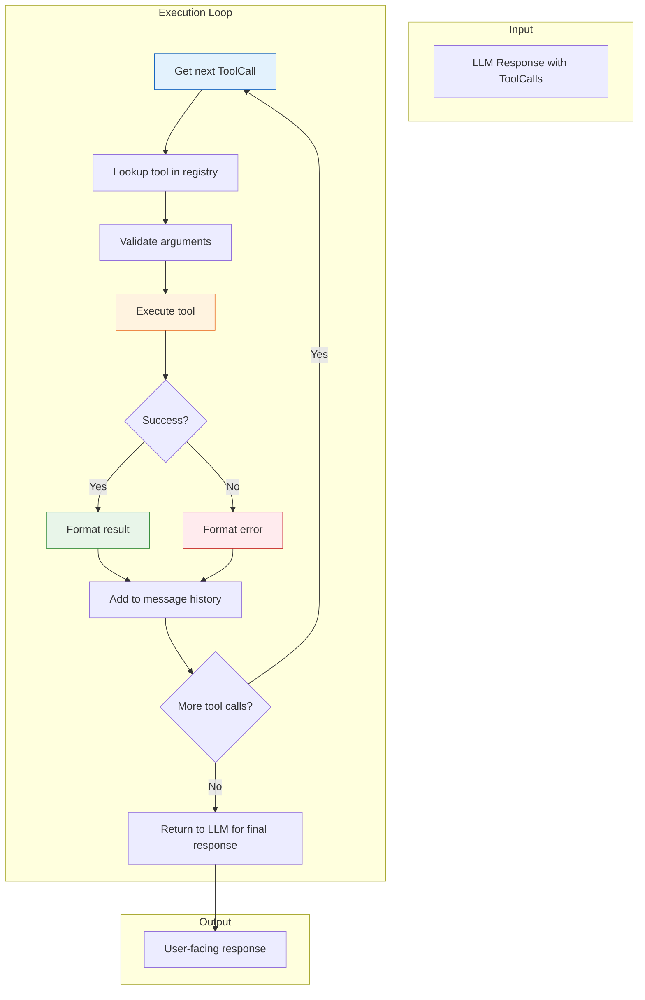
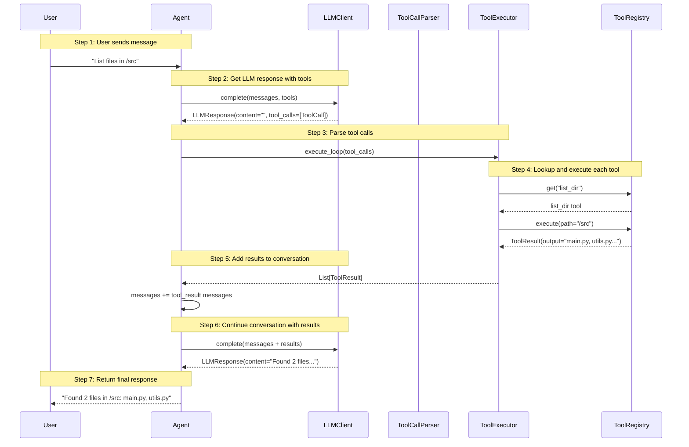

# Day 3, Tutorial 30: Tool Execution Loop - Call, Execute, Return

**Course:** Build Your Own Coding Agent  
**Day:** 3 - Tool Use Loop  
**Tutorial:** 30 of 60  
**Estimated Time:** 60 minutes

---

## 🎯 What You'll Learn

By the end of this tutorial, you'll:
- **Execute** ToolCall objects through the ToolRegistry
- **Handle** tool execution errors gracefully
- **Format** tool results for return to the LLM
- **Build** a complete tool execution loop that handles retries
- **Manage** the conversation state between tool calls

---

## 🎭 The Big Picture

In Tutorial 29, we learned how to **parse** tool calls from LLM responses. Now we need to actually **execute** those tools and return the results.



This is the heart of autonomous agent behavior - the LLM doesn't just respond once; it can loop, using tools as needed until the task is complete.

---

## 💻 Implementation

### Step 1: Define Tool Result Structure

First, let's create a clean representation of tool execution results:

```python
# src/coding_agent/tools/result.py
"""
Tool execution result representation.
"""

import json
import logging
from typing import Optional, Dict, Any, List
from dataclasses import dataclass, field
from datetime import datetime
from enum import Enum

logger = logging.getLogger(__name__)


class ToolStatus(Enum):
    """Status of tool execution."""
    SUCCESS = "success"
    ERROR = "error"
    NOT_FOUND = "not_found"
    INVALID_ARGS = "invalid_args"
    TIMEOUT = "timeout"


@dataclass
class ToolResult:
    """
    Result of tool execution.
    
    This is what gets sent back to the LLM after a tool executes.
    The LLM uses this "observation" to decide its next action.
    """
    
    tool_call_id: str              # ID from the original ToolCall
    tool_name: str                 # Name of the tool that was executed
    status: ToolStatus             # Success or error
    output: str                    # Human-readable output (for LLM)
    error: Optional[str] = None    # Error message if status != success
    execution_time_ms: int = 0     # How long the tool took
    metadata: Dict[str, Any] = field(default_factory=dict)  # Extra info
    timestamp: datetime = field(default_factory=datetime.now)
    
    def __str__(self) -> str:
        if self.status == ToolStatus.SUCCESS:
            output_preview = self.output[:100] + "..." if len(self.output) > 100 else self.output
            return f"[{self.tool_name}] Success: {output_preview}"
        else:
            return f"[{self.tool_name}] Error: {self.error}"
    
    @property
    def is_success(self) -> bool:
        """Check if the tool executed successfully."""
        return self.status == ToolStatus.SUCCESS
    
    def to_message(self) -> Dict[str, Any]:
        """
        Convert to message format for LLM conversation.
        
        This is critical - the LLM needs to understand what happened!
        """
        if self.status == ToolStatus.SUCCESS:
            return {
                "type": "tool_result",
                "tool_use_id": self.tool_call_id,
                "content": self.output
            }
        else:
            return {
                "type": "tool_result",
                "tool_use_id": self.tool_call_id,
                "content": f"Error: {self.error}",
                "is_error": True
            }


class ToolExecutionError(Exception):
    """Base exception for tool execution errors."""
    
    def __init__(self, message: str, tool_name: str = None, tool_call_id: str = None):
        super().__init__(message)
        self.tool_name = tool_name
        self.tool_call_id = tool_call_id


class ToolNotFoundError(ToolExecutionError):
    """Raised when a tool doesn't exist in the registry."""
    pass


class InvalidArgumentsError(ToolExecutionError):
    """Raised when tool arguments are invalid."""
    pass


class ToolExecutionTimeoutError(ToolExecutionError):
    """Raised when tool execution times out."""
    pass
```

**Why this structure?**
- `tool_call_id`: Critical for linking result back to the original call
- `status`: Clear success/error distinction
- `output`: What the LLM "observes"
- `metadata`: Extra info for debugging/logging

---

### Step 2: The ToolExecutor Class

Now let's build the executor that runs tools:

```python
# src/coding_agent/tools/executor.py
"""
Tool execution engine - runs tools and manages the execution loop.
"""

import json
import logging
import time
from typing import Optional, Dict, Any, List, Callable

from .base import BaseTool
from .registry import ToolRegistry
from .result import ToolResult, ToolStatus, ToolExecutionError, ToolNotFoundError, InvalidArgumentsError

logger = logging.getLogger(__name__)


class ToolExecutor:
    """
    Executes tool calls and manages the execution loop.
    
    This is the bridge between parsed ToolCall objects (from T29)
    and actual tool execution.
    
    Key responsibilities:
    1. Lookup tools in the registry
    2. Validate and execute tools
    3. Handle errors gracefully
    4. Format results for the LLM
    
    Example:
        executor = ToolExecutor(tool_registry)
        
        # Execute a single tool call
        result = executor.execute_tool_call(tool_call)
        
        # Execute multiple tool calls in sequence
        results = executor.execute_loop(tool_calls)
    """
    
    def __init__(
        self, 
        registry: ToolRegistry,
        max_retries: int = 1,
        default_timeout_ms: int = 30000
    ):
        """
        Initialize the executor.
        
        Args:
            registry: The ToolRegistry to look up tools in
            max_retries: Number of retries on failure (default: 1)
            default_timeout_ms: Default timeout for tool execution (default: 30s)
        """
        self.registry = registry
        self.max_retries = max_retries
        self.default_timeout_ms = default_timeout_ms
    
    def execute_tool_call(
        self, 
        tool_call,
        timeout_ms: Optional[int] = None
    ) -> ToolResult:
        """
        Execute a single tool call.
        
        Args:
            tool_call: ToolCall object from the parser
            timeout_ms: Optional timeout override
            
        Returns:
            ToolResult with the execution outcome
        """
        start_time = time.time()
        tool_name = tool_call.name
        tool_call_id = tool_call.id
        arguments = tool_call.arguments
        
        logger.info(f"Executing tool: {tool_name} (call_id: {tool_call_id})")
        
        # Step 1: Lookup the tool in the registry
        tool = self.registry.get(tool_name)
        if tool is None:
            logger.error(f"Tool not found: {tool_name}")
            return ToolResult(
                tool_call_id=tool_call_id,
                tool_name=tool_name,
                status=ToolStatus.NOT_FOUND,
                output="",
                error=f"Tool '{tool_name}' not found. Available tools: {', '.join(self.registry.list_tools())}",
                execution_time_ms=int((time.time() - start_time) * 1000)
            )
        
        # Step 2: Validate arguments
        validation_error = self._validate_arguments(tool, arguments)
        if validation_error:
            logger.error(f"Invalid arguments for {tool_name}: {validation_error}")
            return ToolResult(
                tool_call_id=tool_call_id,
                tool_name=tool_name,
                status=ToolStatus.INVALID_ARGS,
                output="",
                error=validation_error,
                execution_time_ms=int((time.time() - start_time) * 1000)
            )
        
        # Step 3: Execute the tool
        try:
            result = tool.execute(**arguments)
            
            # Handle different return types
            if isinstance(result, ToolResult):
                # Tool returned a ToolResult directly
                output = result.output
                error = result.error
                status = result.status
            elif isinstance(result, dict):
                # Tool returned a dict - convert to string
                output = json.dumps(result, indent=2)
                error = result.get("error")
                status = ToolStatus.ERROR if error else ToolStatus.SUCCESS
            elif isinstance(result, str):
                # Tool returned a string
                output = result
                error = None
                status = ToolStatus.SUCCESS
            elif result is None:
                # Tool returned None - assume success with empty output
                output = "(no output)"
                error = None
                status = ToolStatus.SUCCESS
            else:
                # Fallback: convert to string
                output = str(result)
                error = None
                status = ToolStatus.SUCCESS
            
            execution_time_ms = int((time.time() - start_time) * 1000)
            
            logger.info(f"Tool {tool_name} executed successfully in {execution_time_ms}ms")
            
            return ToolResult(
                tool_call_id=tool_call_id,
                tool_name=tool_name,
                status=status,
                output=output,
                error=error,
                execution_time_ms=execution_time_ms,
                metadata={"result_type": type(result).__name__}
            )
            
        except Exception as e:
            execution_time_ms = int((time.time() - start_time) * 1000)
            error_msg = f"{type(e).__name__}: {str(e)}"
            
            logger.error(f"Tool {tool_name} failed: {error_msg}")
            
            return ToolResult(
                tool_call_id=tool_call_id,
                tool_name=tool_name,
                status=ToolStatus.ERROR,
                output="",
                error=error_msg,
                execution_time_ms=execution_time_ms
            )
    
    def _validate_arguments(
        self, 
        tool: BaseTool, 
        arguments: Dict[str, Any]
    ) -> Optional[str]:
        """
        Validate tool arguments against the tool's schema.
        
        Args:
            tool: The tool to validate against
            arguments: Arguments to validate
            
        Returns:
            Error message if invalid, None if valid
        """
        # Get the tool's input schema
        schema = tool.get_input_schema()
        if not schema or "properties" not in schema:
            # No schema means no validation needed
            return None
        
        required = schema.get("required", [])
        properties = schema.get("properties", {})
        
        # Check required arguments
        for req_arg in required:
            if req_arg not in arguments:
                return f"Missing required argument: {req_arg}"
        
        # Check argument types
        for arg_name, arg_value in arguments.items():
            if arg_name in properties:
                expected_type = properties[arg_name].get("type")
                if expected_type and not self._check_type(arg_value, expected_type):
                    return f"Argument '{arg_name}' should be {expected_type}, got {type(arg_value).__name__}"
        
        return None
    
    def _check_type(self, value: Any, expected_type: str) -> bool:
        """Check if value matches the expected JSON schema type."""
        type_map = {
            "string": str,
            "number": (int, float),
            "integer": int,
            "boolean": bool,
            "array": list,
            "object": dict,
            "null": type(None)
        }
        
        expected_python = type_map.get(expected_type)
        if expected_python is None:
            return True  # Unknown type, skip validation
        
        return isinstance(value, expected_python)
```

---

### Step 3: The Tool Execution Loop

Now let's build the loop that handles multiple tool calls:

```python
# src/coding_agent/tools/executor.py (continued)

    def execute_loop(
        self, 
        tool_calls: List,
        stop_on_error: bool = False
    ) -> List[ToolResult]:
        """
        Execute a sequence of tool calls.
        
        This is the main entry point for executing tools from an LLM response.
        The loop continues until all tools are executed or an error occurs.
        
        Args:
            tool_calls: List of ToolCall objects from the parser
            stop_on_error: If True, stop executing remaining tools on first error
            
        Returns:
            List of ToolResult objects in the same order as tool_calls
        """
        results = []
        
        logger.info(f"Starting tool execution loop with {len(tool_calls)} tool(s)")
        
        for i, tool_call in enumerate(tool_calls):
            logger.debug(f"Executing tool {i+1}/{len(tool_calls)}: {tool_call.name}")
            
            # Execute with retry logic
            result = self._execute_with_retry(tool_call)
            results.append(result)
            
            # Stop if error and stop_on_error is True
            if stop_on_error and not result.is_success:
                logger.warning(f"Stopping execution loop due to error in {tool_call.name}")
                # Mark remaining as skipped
                remaining = len(tool_calls) - (i + 1)
                if remaining > 0:
                    logger.info(f"Skipping {remaining} remaining tool(s)")
                break
        
        # Log summary
        success_count = sum(1 for r in results if r.is_success)
        error_count = len(results) - success_count
        logger.info(f"Tool execution loop complete: {success_count} success, {error_count} errors")
        
        return results
    
    def _execute_with_retry(self, tool_call) -> ToolResult:
        """
        Execute a tool call with retry logic.
        
        Args:
            tool_call: ToolCall object to execute
            
        Returns:
            ToolResult from the final attempt
        """
        last_result = None
        
        for attempt in range(self.max_retries + 1):
            if attempt > 0:
                logger.info(f"Retry attempt {attempt}/{self.max_retries} for {tool_call.name}")
            
            last_result = self.execute_tool_call(tool_call)
            
            if last_result.is_success:
                return last_result
            
            # Don't retry on certain errors
            if last_result.status in [ToolStatus.NOT_FOUND, ToolStatus.INVALID_ARGS]:
                logger.debug(f"Not retrying - error type: {last_result.status}")
                return last_result
        
        return last_result
```

---

### Step 4: Converting Results to Messages

The LLM needs to see tool results in its conversation format. Let's add that:

```python
# src/coding_agent/tools/executor.py (continued)

    def results_to_messages(
        self, 
        results: List[ToolResult]
    ) -> List[Dict[str, Any]]:
        """
        Convert ToolResult objects to message format for the LLM.
        
        This formats results exactly as the LLM API expects:
        - Anthropic: Requires tool_result blocks
        - OpenAI: Requires tool role messages
        
        Args:
            results: List of ToolResult objects
            
        Returns:
            List of message dictionaries
        """
        messages = []
        
        for result in results:
            message = result.to_message()
            messages.append(message)
        
        return messages
    
    def append_results_to_conversation(
        self, 
        messages: List[Dict[str, Any]], 
        results: List[ToolResult]
    ) -> List[Dict[str, Any]]:
        """
        Append tool results to an existing message list.
        
        This is used to continue the conversation after tool execution,
        sending the results back to the LLM for the next response.
        
        Args:
            messages: Existing message list
            results: Tool results to append
            
        Returns:
            Updated message list with tool results
        """
        result_messages = self.results_to_messages(results)
        return messages + result_messages
```

---

### Step 5: Integration with the Agent

Now let's integrate the executor with our Agent class:

```python
# src/coding_agent/agent.py (updated section)

from .tools.registry import ToolRegistry
from .tools.executor import ToolExecutor
from .llm.tool_call import ToolCall


class Agent:
    """
    The main agent that orchestrates everything.
    
    Updated with tool execution loop support.
    """
    
    def __init__(
        self,
        llm_client: LLMClient,
        tool_registry: ToolRegistry,
        event_emitter: Optional[EventEmitter] = None
    ):
        self.llm = llm_client
        self.registry = tool_registry
        self.events = event_emitter or EventEmitter()
        
        # Initialize the tool executor
        self.executor = ToolExecutor(
            registry=self.registry,
            max_retries=1,
            default_timeout_ms=30000
        )
        
        # Conversation history
        self.messages: List[Dict[str, Any]] = []
        
        # Configuration
        self.max_tool_iterations = 10  # Prevent infinite loops
        self.stop_on_tool_error = False
    
    def chat(self, user_message: str) -> str:
        """
        Main chat method with tool execution support.
        
        This is the core loop:
        1. Send message to LLM
        2. If LLM returns tool calls, execute them
        3. Add results to conversation
        4. Repeat until LLM returns text (no more tools)
        """
        # Add user message to conversation
        self.messages.append({"role": "user", "content": user_message})
        
        self.events.emit("message_sent", {"content": user_message})
        
        # Main tool use loop
        iteration = 0
        while iteration < self.max_tool_iterations:
            iteration += 1
            
            # Get response from LLM (with tools available)
            response = self.llm.complete(
                messages=self.messages,
                tools=self.registry.get_tool_schemas()
            )
            
            # Check if LLM wants to use tools
            if response.has_tool_calls:
                self.events.emit("tool_calls_received", {
                    "count": len(response.tool_calls),
                    "tools": [tc.name for tc in response.tool_calls]
                })
                
                # Execute the tool calls
                results = self.executor.execute_loop(
                    response.tool_calls,
                    stop_on_error=self.stop_on_tool_error
                )
                
                # Log results
                for result in results:
                    self.events.emit("tool_executed", {
                        "tool": result.tool_name,
                        "status": result.status.value,
                        "duration_ms": result.execution_time_ms
                    })
                
                # Add results to conversation
                self.messages = self.executor.append_results_to_conversation(
                    self.messages, 
                    results
                )
                
                # Continue loop - LLM will decide what to do next
                self.events.emit("iteration_complete", {
                    "iteration": iteration,
                    "tools_executed": len(results)
                })
                
            else:
                # No tool calls - we're done!
                break
        
        # Get the final response content
        final_content = response.content
        
        # Add assistant response to conversation
        self.messages.append({"role": "assistant", "content": final_content})
        
        self.events.emit("response_received", {"content": final_content})
        
        return final_content
```

---

## 🔄 The Complete Tool Use Loop

Here's how everything fits together:



---

## 🧪 Testing the Executor

Let's verify our executor works:

```python
# tests/test_tool_executor.py
"""
Tests for the ToolExecutor.
"""

import pytest
from coding_agent.tools.executor import ToolExecutor, ToolNotFoundError
from coding_agent.tools.result import ToolResult, ToolStatus
from coding_agent.tools.registry import ToolRegistry
from coding_agent.tools.builtins import ReadFileTool, ListDirTool
from coding_agent.llm.tool_call import ToolCall


class TestToolExecution:
    """Test tool execution functionality."""
    
    @pytest.fixture
    def registry(self):
        """Create a test registry with some tools."""
        registry = ToolRegistry()
        registry.register(ReadFileTool())
        registry.register(ListDirTool())
        return registry
    
    @pytest.fixture
    def executor(self, registry):
        """Create a test executor."""
        return ToolExecutor(registry)
    
    def test_execute_list_dir(self, executor):
        """Test executing list_dir tool."""
        tool_call = ToolCall(
            id="call_123",
            name="list_dir",
            arguments={"path": "/tmp"},
            raw_arguments='{"path": "/tmp"}',
            provider="anthropic"
        )
        
        result = executor.execute_tool_call(tool_call)
        
        assert result.status == ToolStatus.SUCCESS
        assert result.tool_name == "list_dir"
        assert result.tool_call_id == "call_123"
    
    def test_tool_not_found(self, executor):
        """Test handling of unknown tool."""
        tool_call = ToolCall(
            id="call_456",
            name="nonexistent_tool",
            arguments={},
            raw_arguments="{}",
            provider="anthropic"
        )
        
        result = executor.execute_tool_call(tool_call)
        
        assert result.status == ToolStatus.NOT_FOUND
        assert "not found" in result.error.lower()
    
    def test_execute_loop_multiple(self, executor):
        """Test executing multiple tools in sequence."""
        tool_calls = [
            ToolCall(id="call_1", name="list_dir", arguments={"path": "."}, raw_arguments="{}", provider="anthropic"),
            ToolCall(id="call_2", name="list_dir", arguments={"path": "."}, raw_arguments="{}", provider="anthropic"),
        ]
        
        results = executor.execute_loop(tool_calls)
        
        assert len(results) == 2
        assert all(r.status == ToolStatus.SUCCESS for r in results)
    
    def test_stop_on_error(self, executor):
        """Test stopping loop on error."""
        tool_calls = [
            ToolCall(id="call_1", name="nonexistent", arguments={}, raw_arguments="{}", provider="anthropic"),
            ToolCall(id="call_2", name="list_dir", arguments={"path": "."}, raw_arguments="{}", provider="anthropic"),
        ]
        
        results = executor.execute_loop(tool_calls, stop_on_error=True)
        
        # Should have only 1 result (the error), not 2
        assert len(results) == 1
        assert results[0].status == ToolStatus.NOT_FOUND


# Run with: python -m pytest tests/test_tool_executor.py -v
```

---

## 🎯 Error Handling Best Practices

Here's how to handle different error scenarios:

```python
# Error handling patterns for tool execution

# 1. Tool Not Found - Inform the LLM, let it decide next action
if result.status == ToolStatus.NOT_FOUND:
    # LLM can try a different tool or ask user
    pass

# 2. Invalid Arguments - Return error, LLM might fix and retry
if result.status == ToolStatus.INVALID_ARGS:
    # LLM sees the error message, can adjust arguments
    pass

# 3. Execution Error - Log details, return sanitized error to LLM
if result.status == ToolStatus.ERROR:
    # Don't expose raw stack traces to LLM!
    sanitized_error = f"Tool execution failed: {result.error}"
    pass

# 4. Timeout - Could implement retry with backoff
if result.status == ToolStatus.TIMEOUT:
    # Consider retrying with exponential backoff
    pass
```

**Important:** Never expose raw exception traces or system details to the LLM. Always sanitize errors - the LLM doesn't need to know your file paths or internal variable names.

---

## 📝 Summary

In this tutorial, you learned:

| Concept | What It Does |
|---------|--------------|
| **ToolResult** | Structured representation of tool execution outcome |
| **ToolExecutor** | Executes ToolCall objects through the registry |
| **execute_tool_call()** | Single tool execution with validation |
| **execute_loop()** | Multiple tool calls in sequence |
| **results_to_messages()** | Convert results to LLM conversation format |
| **Error handling** | Different strategies for different error types |
| **stop_on_error** | Option to stop loop on first error |

---

## 🎯 Next Steps

In Tutorial 31, we'll explore the **ReAct pattern** (Reason + Act), which adds explicit reasoning between tool calls - the LLM explains its thought process before and after each tool use.

---

## 📚 Reference

**Files created/updated in this tutorial:**
- `src/coding_agent/tools/result.py` - ToolResult and status enums
- `src/coding_agent/tools/executor.py` - ToolExecutor class
- `src/coding_agent/agent.py` - Updated chat() method with tool loop

**Depends on:**
- Tutorial 29: Parsing tool calls from LLM responses
- Tutorial 24: Day 2 capstone with file tools

---

*Tutorial 30 of 60 - Next: ReAct Pattern - Reasoning Before Acting*