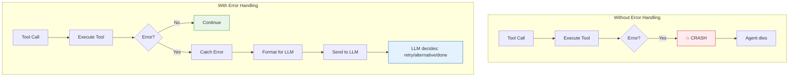

# Day 3, Tutorial 31: Error Handling in Tool Loop

**Course:** Build Your Own Coding Agent  
**Day:** 3 - Tool Use Loop  
**Tutorial:** 31 of 60  
**Estimated Time:** 75 minutes

---

## 🎯 What You'll Learn

By the end of this tutorial, you'll:
- **Handle** tool execution errors gracefully without crashing
- **Format** errors in ways the LLM can understand and recover from
- **Implement** retry logic for transient failures
- **Create** error recovery strategies (fallback tools, partial results)
- **Build** robust error boundaries that keep the agent running

---

## 🎭 Why Error Handling Matters

Your agent will encounter errors constantly:

| Error Type | Example | What to Do |
|------------|---------|------------|
| **File not found** | `read_file("nonexistent.txt")` | Inform LLM, suggest alternatives |
| **Permission denied** | `write_file("/root/secret.txt")` | Explain the limitation |
| **Tool not found** | LLM calls unknown tool | Graceful fallback |
| **Invalid arguments** | `read_file(path=None)` | Show correct usage |
| **Timeout** | `execute_shell("sleep 100")` | Cancel and retry |
| **LLM API error** | Rate limit, network error | Retry with backoff |

**Without error handling:** One error crashes the entire agent.
**With error handling:** The agent learns from failures and tries alternatives.



---

## 💻 Implementation

### Step 1: Error Classification System

First, let's create a robust error classification system:

```python
# src/coding_agent/tools/errors.py
"""
Tool error classification and handling.
"""

import logging
import traceback
from enum import Enum
from typing import Optional, Dict, Any, List
from dataclasses import dataclass, field

logger = logging.getLogger(__name__)


class ErrorCategory(Enum):
    """Categorize tool errors for appropriate handling."""
    
    # Retryable errors - worth trying again
    TRANSIENT = "transient"           # Network timeout, rate limit
    TEMPORARY_UNAVAILABLE = "temp_unavailable"  # Resource busy
    
    # Non-retryable but recoverable - LLM can try alternative
    NOT_FOUND = "not_found"           # File, directory, tool not found
    PERMISSION_DENIED = "permission" # Access denied
    INVALID_INPUT = "invalid_input"  # Bad arguments
    VALIDATION_FAILED = "validation" # Schema validation failed
    
    # Fatal errors - stop the tool use loop
    FATAL = "fatal"                   # Unknown error, coding bug
    TIMEOUT = "timeout"               # Operation took too long
    RESOURCE_EXHAUSTED = "exhausted"  # Out of memory, disk full


@dataclass
class ToolError:
    """
    Structured tool error with classification and recovery info.
    
    The LLM uses this information to decide how to recover!
    """
    
    original_exception: Exception
    error_category: ErrorCategory
    tool_name: str
    tool_args: Dict[str, Any]
    message: str
    is_retryable: bool = False
    recovery_suggestions: List[str] = field(default_factory=list)
    context: Dict[str, Any] = field(default_factory=dict)
    
    @classmethod
    def from_exception(
        cls,
        exc: Exception,
        tool_name: str,
        tool_args: Dict[str, Any]
    ) -> "ToolError":
        """Classify an exception and create a ToolError."""
        
        # Classify the error
        category, is_retryable, suggestions = cls._classify_exception(exc)
        
        return cls(
            original_exception=exc,
            error_category=category,
            tool_name=tool_name,
            tool_args=tool_args,
            message=str(exc),
            is_retryable=is_retryable,
            recovery_suggestions=suggestions,
            context={
                "exception_type": type(exc).__name__,
                "traceback": traceback.format_exc(),
            }
        )
    
    @staticmethod
    def _classify_exception(exc: Exception) -> tuple:
        """
        Classify exception type into ErrorCategory.
        
        Returns: (category, is_retryable, suggestions)
        """
        
        exc_type = type(exc).__name__.lower()
        exc_msg = str(exc).lower()
        
        # File not found
        if "not found" in exc_msg or "no such file" in exc_msg:
            return (
                ErrorCategory.NOT_FOUND,
                False,
                [
                    "Check the file path for typos",
                    "Use list_dir to see available files",
                    "Use search_files to find files by name"
                ]
            )
        
        # Permission denied
        if "permission" in exc_msg or "denied" in exc_msg:
            return (
                ErrorCategory.PERMISSION_DENIED,
                False,
                [
                    "Check if you have read/write permissions",
                    "Try a different directory",
                    "Run with elevated permissions if needed"
                ]
            )
        
        # Invalid input
        if "invalid" in exc_msg or "required" in exc_msg:
            return (
                ErrorCategory.INVALID_INPUT,
                False,
                [
                    "Check the required parameters",
                    "Verify argument types match schema",
                    "Provide all required fields"
                ]
            )
        
        # Timeout
        if "timeout" in exc_msg or "timed out" in exc_msg:
            return (
                ErrorCategory.TIMEOUT,
                True,
                [
                    "Try with a smaller operation",
                    "Increase timeout if possible",
                    "Break the task into smaller steps"
                ]
            )
        
        # Transient errors (network, rate limits)
        if any(kw in exc_msg for kw in ["rate limit", "429", "503", "connection"]):
            return (
                ErrorCategory.TRANSIENT,
                True,
                [
                    "Wait and retry",
                    "Check API rate limits",
                    "Try again with exponential backoff"
                ]
            )
        
        # Default: fatal error
        return (
            ErrorCategory.FATAL,
            False,
            [
                "This is an unexpected error",
                "Check the error details for more info",
                "The agent may need to try a different approach"
            ]
        )
    
    def format_for_llm(self) -> str:
        """
        Format error in a way the LLM can understand and act on.
        
        The LLM needs enough context to make a recovery decision!
        """
        lines = [
            f"Tool Error: {self.tool_name}",
            f"Error Type: {self.error_category.value}",
            f"Message: {self.message}",
        ]
        
        if self.is_retryable:
            lines.append("Status: RETRYABLE - can try again")
        else:
            lines.append("Status: NON-RETRYABLE - try alternative approach")
        
        if self.recovery_suggestions:
            lines.append("\nRecovery Suggestions:")
            for suggestion in self.recovery_suggestions:
                lines.append(f"  - {suggestion}")
        
        lines.append(f"\nArguments used: {self.tool_args}")
        
        return "\n".join(lines)
```

### Step 2: Retry Logic with Exponential Backoff

For transient errors, we need intelligent retry logic:

```python
# src/coding_agent/tools/retry.py
"""
Retry logic with exponential backoff for transient errors.
"""

import time
import logging
from typing import Callable, Optional, Type, Tuple
from functools import wraps

logger = logging.getLogger(__name__)


class RetryConfig:
    """Configuration for retry behavior."""
    
    def __init__(
        self,
        max_retries: int = 3,
        initial_delay_ms: int = 100,
        max_delay_ms: int = 5000,
        backoff_multiplier: float = 2.0,
        jitter: bool = True
    ):
        self.max_retries = max_retries
        self.initial_delay_ms = initial_delay_ms
        self.max_delay_ms = max_delay_ms
        self.backoff_multiplier = backoff_multiplier
        self.jitter = jitter
    
    def get_delay(self, attempt: int) -> float:
        """Calculate delay for given attempt number."""
        delay = min(
            self.initial_delay_ms * (self.backoff_multiplier ** attempt),
            self.max_delay_ms
        )
        
        if self.jitter:
            # Add random jitter (±25%)
            import random
            jitter_amount = delay * 0.25
            delay += random.uniform(-jitter_amount, jitter_amount)
        
        return delay / 1000  # Convert to seconds


def with_retry(
    config: Optional[RetryConfig] = None,
    retryable_exceptions: Tuple[Type[Exception], ...] = (Exception,)
):
    """
    Decorator to add retry logic to any function.
    
    Usage:
        @with_retry(RetryConfig(max_retries=3))
        def call_api(url):
            ...
    """
    if config is None:
        config = RetryConfig()
    
    def decorator(func: Callable):
        @wraps(func)
        def wrapper(*args, **kwargs):
            last_exception = None
            
            for attempt in range(config.max_retries + 1):
                try:
                    return func(*args, **kwargs)
                    
                except retryable_exceptions as e:
                    last_exception = e
                    
                    if attempt < config.max_retries:
                        delay = config.get_delay(attempt)
                        logger.warning(
                            f"Attempt {attempt + 1} failed: {e}. "
                            f"Retrying in {delay:.2f}s..."
                        )
                        time.sleep(delay)
                    else:
                        logger.error(
                            f"All {config.max_retries + 1} attempts failed"
                        )
            
            raise last_exception
        
        return wrapper
    return decorator


class RetryableOperation:
    """
    Context manager for retryable operations.
    
    Usage:
        with RetryableOperation(max_retries=3) as op:
            result = op.execute(lambda: risky_operation())
    """
    
    def __init__(
        self,
        name: str,
        config: Optional[RetryConfig] = None,
        on_retry: Optional[Callable] = None
    ):
        self.name = name
        self.config = config or RetryConfig()
        self.on_retry = on_retry
        self.attempt = 0
        self.last_exception = None
    
    def __enter__(self):
        return self
    
    def __exit__(self, exc_type, exc_val, exc_tb):
        return False  # Don't suppress exceptions
    
    def execute(self, func: Callable):
        """Execute function with retry logic."""
        self.attempt = 0
        self.last_exception = None
        
        while self.attempt <= self.config.max_retries:
            try:
                return func()
                
            except Exception as e:
                self.last_exception = e
                
                # Check if retryable
                if not self._is_retryable(e):
                    logger.error(f"Non-retryable error in {self.name}: {e}")
                    raise
                
                if self.attempt < self.config.max_retries:
                    delay = self.config.get_delay(self.attempt)
                    logger.warning(
                        f"Attempt {self.attempt + 1}/{self.config.max_retries + 1} "
                        f"failed for {self.name}: {e}. Retrying in {delay:.2f}s..."
                    )
                    
                    if self.on_retry:
                        self.on_retry(self.attempt, e)
                    
                    time.sleep(delay)
                    self.attempt += 1
                else:
                    logger.error(
                        f"All attempts exhausted for {self.name}: {e}"
                    )
                    raise
        
        raise self.last_exception
    
    def _is_retryable(self, exc: Exception) -> bool:
        """Determine if exception is retryable."""
        exc_msg = str(exc).lower()
        
        # List of retryable error patterns
        retryable_patterns = [
            "timeout", "timed out",
            "rate limit", "429",
            "503", "service unavailable",
            "connection", "network",
            "temporary", "temp"
        ]
        
        return any(pattern in exc_msg for pattern in retryable_patterns)
```

### Step 3: Error Handler in the Tool Use Loop

Now integrate error handling into the agent's tool use loop:

```python
# src/coding_agent/agent.py (add error handling to tool execution)

# ... imports ...

class ToolUseLoopError(Exception):
    """Error in the tool use loop."""
    pass


class Agent:
    """
    Autonomous agent with robust error handling in tool use loop.
    """
    
    def __init__(
        self,
        llm_client,
        tool_registry,
        system_prompt: Optional[str] = None,
        max_iterations: int = 10,
        retry_config: Optional[RetryConfig] = None
    ):
        self.llm = llm_client
        self.tools = tool_registry
        self.system_prompt = system_prompt
        self.max_iterations = max_iterations
        self.retry_config = retry_config or RetryConfig()
        
        # Track errors for analysis
        self.error_history: List[ToolError] = []
    
    def run(self, user_input: str) -> str:
        """
        Run agent with robust error handling.
        
        Errors don't crash the agent - they're formatted and sent to LLM
        for intelligent recovery decisions.
        """
        messages = [{"role": "user", "content": user_input}]
        tool_schemas = self.tools.get_schemas()
        
        iteration = 0
        consecutive_errors = 0
        
        while iteration < self.max_iterations:
            iteration += 1
            
            # Call LLM with tools
            try:
                response = self.llm.generate(
                    messages=messages,
                    tools=tool_schemas,
                    system=self.system_prompt
                )
            except Exception as e:
                # LLM API error - could be retryable
                error = ToolError.from_exception(e, "LLM_API", {"iteration": iteration})
                self.error_history.append(error)
                
                logger.error(f"LLM API error: {e}")
                return f"I encountered an API error: {e}. Please try again."
            
            # Check if LLM wants to use tools
            if not response.has_tool_calls():
                # Done - return text response
                return response.text or "(No response)"
            
            # Execute each tool call with error handling
            for call in response.tool_calls:
                result = self._execute_tool_with_error_handling(call)
                
                # Format result for LLM
                messages.append({
                    "role": "user",
                    "content": self._format_tool_result_message(call, result)
                })
                
                # Track error rate
                if not result.is_success:
                    consecutive_errors += 1
                else:
                    consecutive_errors = 0
            
            # Stop if too many consecutive errors
            if consecutive_errors >= 3:
                logger.warning("Too many consecutive errors, stopping")
                return (
                    "I encountered multiple errors and couldn't complete the task. "
                    "The errors were: " +
                    "\n".join([str(e) for e in self.error_history[-3:]])
                )
        
        return "(Reached max iterations)"
    
    def _execute_tool_with_error_handling(self, tool_call) -> ToolResult:
        """
        Execute a tool call with full error handling.
        
        This is the key to robust tool use:
        1. Validate the tool exists
        2. Validate arguments match schema
        3. Execute with retry logic
        4. Catch and classify any errors
        """
        tool_name = tool_call.name
        tool_args = tool_call.arguments
        
        # Step 1: Check tool exists
        if not self.tools.has_tool(tool_name):
            error = ToolError(
                original_exception=Exception(f"Tool '{tool_name}' not found"),
                error_category=ErrorCategory.NOT_FOUND,
                tool_name=tool_name,
                tool_args=tool_args,
                message=f"Tool '{tool_name}' does not exist",
                is_retryable=False,
                recovery_suggestions=[
                    f"Use one of: {', '.join(self.tools.list_tool_names())}",
                    "Check for typos in tool name"
                ]
            )
            self.error_history.append(error)
            return ToolResult(
                tool_call_id=getattr(tool_call, 'id', 'unknown'),
                tool_name=tool_name,
                status=ToolStatus.NOT_FOUND,
                output="",
                error=error.format_for_llm()
            )
        
        # Step 2: Validate arguments against schema
        validation_error = self.tools.validate_args(tool_name, tool_args)
        if validation_error:
            error = ToolError(
                original_exception=Exception(validation_error),
                error_category=ErrorCategory.VALIDATION_FAILED,
                tool_name=tool_name,
                tool_args=tool_args,
                message=validation_error,
                is_retryable=False,
                recovery_suggestions=[
                    "Check the tool's input schema",
                    "Ensure all required parameters are provided",
                    "Verify argument types"
                ]
            )
            self.error_history.append(error)
            return ToolResult(
                tool_call_id=getattr(tool_call, 'id', 'unknown'),
                tool_name=tool_name,
                status=ToolStatus.INVALID_ARGS,
                output="",
                error=error.format_for_llm()
            )
        
        # Step 3: Execute with retry logic
        try:
            with RetryableOperation(
                name=f"tool:{tool_name}",
                config=self.retry_config,
                on_retry=lambda attempt, exc: logger.warning(
                    f"Retry {attempt} for {tool_name}: {exc}"
                )
            ) as op:
                output = op.execute(
                    lambda: self.tools.execute(tool_name, **tool_args)
                )
            
            return ToolResult(
                tool_call_id=getattr(tool_call, 'id', 'unknown'),
                tool_name=tool_name,
                status=ToolStatus.SUCCESS,
                output=output
            )
            
        except Exception as e:
            # Classify the error
            error = ToolError.from_exception(e, tool_name, tool_args)
            self.error_history.append(error)
            
            return ToolResult(
                tool_call_id=getattr(tool_call, 'id', 'unknown'),
                tool_name=tool_name,
                status=ToolStatus.ERROR,
                output="",
                error=error.format_for_llm()
            )
    
    def _format_tool_result_message(self, tool_call, result: ToolResult) -> str:
        """Format tool result for sending back to LLM."""
        
        if result.status == ToolStatus.SUCCESS:
            # Truncate very long outputs
            output = result.output
            if len(output) > 4000:  # Leave room for formatting
                output = output[:4000] + "\n... (truncated)"
            
            return f"Tool '{result.tool_name}' executed successfully:\n{output}"
        
        else:
            # Include error details and recovery suggestions
            return f"Tool '{result.tool_name}' failed:\n{result.error}"
```

### Step 4: Adding Validation to ToolRegistry

```python
# src/coding_agent/tools/registry.py (add validation methods)

class ToolRegistry:
    """Registry with error handling support."""
    
    # ... existing code ...
    
    def has_tool(self, name: str) -> bool:
        """Check if tool exists."""
        return name in self._tools
    
    def list_tool_names(self) -> List[str]:
        """List all registered tool names."""
        return list(self._tools.keys())
    
    def validate_args(self, tool_name: str, args: Dict) -> Optional[str]:
        """
        Validate arguments against tool's input schema.
        
        Returns error message if invalid, None if valid.
        """
        tool = self.get(tool_name)
        
        # Get schema
        schema = tool.get_input_schema()
        properties = schema.get("properties", {})
        required = schema.get("required", [])
        
        # Check required fields
        for field_name in required:
            if field_name not in args or args[field_name] is None:
                return f"Missing required parameter: {field_name}"
        
        # Check types
        for field_name, value in args.items():
            if field_name in properties:
                expected_type = properties[field_name].get("type")
                if not self._check_type(value, expected_type):
                    return (
                        f"Invalid type for {field_name}: "
                        f"expected {expected_type}, got {type(value).__name__}"
                    )
        
        return None
    
    def _check_type(self, value, expected_type: str) -> bool:
        """Check if value matches expected JSON Schema type."""
        if expected_type is None:
            return True
        
        type_map = {
            "string": str,
            "integer": int,
            "number": (int, float),
            "boolean": bool,
            "array": list,
            "object": dict,
            "null": type(None)
        }
        
        expected_python = type_map.get(expected_type)
        if expected_python is None:
            return True  # Unknown type, skip validation
        
        return isinstance(value, expected_python)
```

---

## 🏃 Testing Error Handling

```python
# tests/test_error_handling.py

import pytest
from unittest.mock import Mock, patch
from coding_agent.tools.errors import ToolError, ErrorCategory
from coding_agent.tools.retry import RetryConfig, RetryableOperation
from coding_agent.agent import Agent


class TestToolError:
    """Test error classification."""
    
    def test_classify_file_not_found(self):
        """File not found is NOT_FOUND category."""
        exc = FileNotFoundError("File 'test.txt' not found")
        error = ToolError.from_exception(exc, "read_file", {"path": "test.txt"})
        
        assert error.error_category == ErrorCategory.NOT_FOUND
        assert not error.is_retryable
        assert "Check the file path" in error.recovery_suggestions[0]
    
    def test_classify_permission_denied(self):
        """Permission denied is PERMISSION category."""
        exc = PermissionError("Permission denied: /root/secret.txt")
        error = ToolError.from_exception(exc, "write_file", {"path": "/root/secret.txt"})
        
        assert error.error_category == ErrorCategory.PERMISSION_DENIED
        assert not error.is_retryable
    
    def test_classify_timeout(self):
        """Timeout is retryable."""
        exc = TimeoutError("Operation timed out after 30s")
        error = ToolError.from_exception(exc, "execute_shell", {"command": "sleep 100"})
        
        assert error.error_category == ErrorCategory.TIMEOUT
        assert error.is_retryable
    
    def test_classify_rate_limit(self):
        """Rate limit is TRANSIENT and retryable."""
        exc = Exception("Rate limit exceeded (429)")
        error = ToolError.from_exception(exc, "LLM_API", {})
        
        assert error.error_category == ErrorCategory.TRANSIENT
        assert error.is_retryable
    
    def test_format_for_llm(self):
        """Error formatted for LLM includes recovery suggestions."""
        exc = FileNotFoundError("File 'test.txt' not found")
        error = ToolError.from_exception(exc, "read_file", {"path": "test.txt"})
        
        formatted = error.format_for_llm()
        
        assert "read_file" in formatted
        assert "NOT_FOUND" in formatted
        assert "Recovery Suggestions" in formatted
        assert "list_dir" in formatted  # One of the suggestions


class TestRetryableOperation:
    """Test retry logic."""
    
    def test_successful_first_try(self):
        """No retries needed for successful operation."""
        with RetryableOperation("test") as op:
            result = op.execute(lambda: "success")
        
        assert result == "success"
        assert op.attempt == 0
    
    def test_retry_on_transient_error(self):
        """Retries on transient errors."""
        call_count = 0
        
        def flaky():
            nonlocal call_count
            call_count += 1
            if call_count < 3:
                raise TimeoutError("timeout")
            return "success"
        
        config = RetryConfig(max_retries=3, initial_delay_ms=10)
        
        with RetryableOperation("test", config) as op:
            result = op.execute(flaky)
        
        assert result == "success"
        assert call_count == 3
    
    def test_fails_after_max_retries(self):
        """Raises after exhausting retries."""
        def always_fail():
            raise TimeoutError("always fails")
        
        config = RetryConfig(max_retries=2, initial_delay_ms=10)
        
        with pytest.raises(TimeoutError):
            with RetryableOperation("test", config) as op:
                op.execute(always_fail)


class TestAgentErrorHandling:
    """Test agent's error handling in tool loop."""
    
    def test_handles_missing_tool(self):
        """Gracefully handles unknown tool."""
        # Mock LLM that returns a tool call for non-existent tool
        mock_llm = Mock()
        mock_response = Mock()
        mock_response.has_tool_calls.return_value = True
        mock_response.tool_calls = [
            Mock(name="nonexistent_tool", arguments={})
        ]
        mock_llm.generate.return_value = mock_response
        
        # Create agent
        agent = Agent(
            llm_client=mock_llm,
            tool_registry=Mock(),  # Empty registry
            max_iterations=1
        )
        
        # Run - should not crash
        result = agent.run("Do something")
        
        # Should have error in history
        assert len(agent.error_history) > 0
        assert agent.error_history[0].error_category == ErrorCategory.NOT_FOUND
    
    def test_stops_after_consecutive_errors(self):
        """Stops after 3 consecutive errors."""
        # Mock LLM that always requests a tool
        mock_llm = Mock()
        mock_response = Mock()
        mock_response.has_tool_calls.return_value = True
        mock_response.tool_calls = [
            Mock(name="failing_tool", arguments={})
        ]
        mock_llm.generate.return_value = mock_response
        
        # Mock registry that always throws
        mock_registry = Mock()
        mock_registry.get_schema.return_value = {}
        mock_registry.has_tool.return_value = True
        mock_registry.validate_args.return_value = None
        mock_registry.execute.side_effect = Exception("Always fails")
        
        agent = Agent(
            llm_client=mock_llm,
            tool_registry=mock_registry,
            max_iterations=10
        )
        
        result = agent.run("Do something")
        
        # Should stop due to consecutive errors
        assert "multiple errors" in result.lower()
```

---

## 🧠 Key Concepts

### 1. Error Categories Guide Recovery

```python
# The LLM uses category to decide what to do:

if error.is_retryable:
    # Try the same operation again
    "Let me retry that operation..."
else:
    # Try a different approach
    "Since that didn't work, let me try a different way..."
```

### 2. Error Messages Should Help the LLM

**Bad:** `"Error: file not found"`
**Good:** 
```
Error: File 'config.txt' not found
Type: NOT_FOUND
Suggestions:
  - Check the file path for typos
  - Use list_dir to see available files
  - File may have been deleted
```

### 3. Track Error History for Debugging

```python
# Keep history for analysis
self.error_history.append(error)

# Later, analyze patterns
error_types = [e.error_category for e in self.error_history]
most_common = max(set(error_types), key=error_types.count)
```

### 4. Graceful Degradation

When a tool fails, the agent should:
1. Acknowledge the failure
2. Explain what happened
3. Suggest alternatives
4. Try a different approach if possible

---

## ✅ Exercise

1. **Implement Error Classification:**
   - Add `ToolError` class to your codebase
   - Test error classification with different exception types

2. **Add Retry Logic:**
   - Implement `RetryConfig` and `RetryableOperation`
   - Test retry behavior with flaky operations

3. **Update Agent:**
   - Add `_execute_tool_with_error_handling()` method
   - Track error history
   - Stop after consecutive errors

4. **Test Error Handling:**
   ```python
   # Test: Tool not found
   # Test: Invalid arguments
   # Test: Transient error with retry
   ```

---

## 🔗 Integration with Previous Tutorials

This tutorial builds on:
- **T29:** Parsing tool calls from LLM responses
- **T30:** Tool execution loop
- **T13 (Day 1):** ToolRegistry base
- **T14-T24 (Day 2):** File tools with their own error cases

Error handling integrates with:
- `ToolResult` from T30
- `ToolRegistry.get_schemas()` from T26
- Agent's `run()` method from T25

---

## 🎯 Next Up

**Tutorial 32:** ReAct Pattern - Thought → Action → Observation

We'll cover:
- Chain of thought reasoning
- How the LLM decides what to do next
- Building the inner loop of agent cognition

---

## 📚 Resources

- [Python Exception Handling Best Practices](https://docs.python.org/3/library/exceptions.html)
- [Exponential Backoff Pattern](https://en.wikipedia.org/wiki/Exponential_backoff)
- [Anthropic Error Handling](https://docs.anthropic.com/claude/docs/error-handling)

---

*"Errors are not failures - they're information. The question is whether your agent listens."*