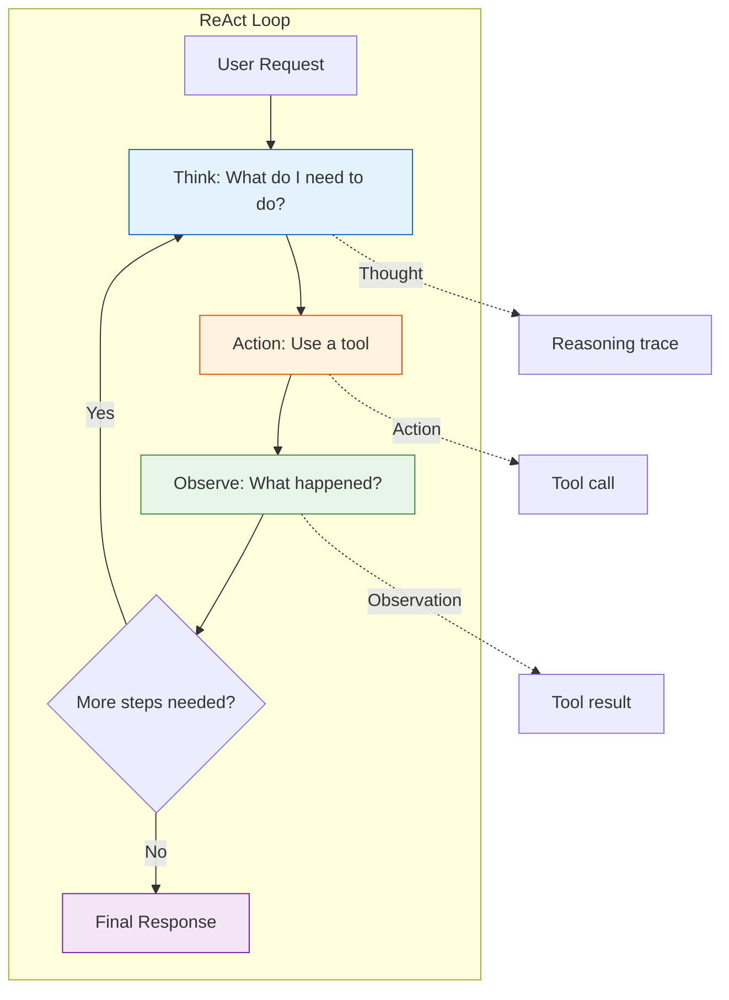

# Day 3, Tutorial 32: ReAct Pattern - Chain of Thought

**Course:** Build Your Own Coding Agent  
**Day:** 3 - Tool Use Loop  
**Tutorial:** 32 of 60  
**Estimated Time:** 90 minutes

---

## 🎯 What You'll Learn

By the end of this tutorial, you'll:
- **Understand** the ReAct (Reasoning + Acting) pattern for autonomous agents
- **Implement** thought-action-observation loops in your agent
- **Design** prompts that encourage the LLM to reason before acting
- **Build** a multi-step execution engine that tracks reasoning
- **Handle** complex tasks requiring multiple tool calls with planning

---

## 🎭 Why ReAct Matters

Traditional LLM interaction is simple: **Prompt → Response → Done**

But coding agents need to do more:
1. **Analyze** the user's request
2. **Plan** which tools to use
3. **Execute** those tools
4. **Observe** the results
5. **Reason** about what to do next
6. **Repeat** until the task is complete

This is the ReAct pattern - the same mental process you use when debugging code:



---

## 💡 The ReAct Prompting Technique

ReAct was introduced in a 2022 paper by Shunyu Yao et al. The key insight is:

**Don't just ask the LLM to do something. Ask it to show its work.**

### Without ReAct (Basic Tool Use):
```
User: "Read the config file and tell me the database host"

LLM: *calls read_file tool* → *sees "db_host: localhost"* → "The database host is localhost"
```

### With ReAct (Chain of Thought):
```
User: "Read the config file and tell me the database host"

Thought: The user wants to know the database host from the config file.
Action: call read_file with path="config.yaml"
Observation: The file contains "db_host: localhost"
Thought: I found the answer - the database host is localhost.
Final Response: The database host is localhost.
```

The difference? With ReAct, the LLM:
1. **Shows its reasoning** - you can see what it's thinking
2. **Plans before acting** - considers which tool to use
3. **Uses observations** - incorporates tool results into thinking
4. **Self-corrects** - can identify and fix mistakes

---

## 💻 Implementation

### Step 1: ReAct Message Format

We need a structured way to capture thought-action-observation:

```python
# src/coding_agent/react/messages.py
"""
ReAct message format for chain-of-thought reasoning.
"""

from typing import Optional, List, Dict, Any
from dataclasses import dataclass, field
from enum import Enum
import json


class ReActStepType(Enum):
    """Types of steps in ReAct reasoning."""
    THOUGHT = "thought"
    ACTION = "action"
    OBSERVATION = "observation"
    FINAL = "final"


@dataclass
class ReActStep:
    """
    A single step in the ReAct reasoning chain.
    
    Each step can be:
    - THOUGHT: The LLM is thinking about what to do
    - ACTION: The LLM is calling a tool
    - OBSERVATION: The result from a tool
    - FINAL: The final response to the user
    """
    
    step_type: ReActStepType
    content: str
    tool_name: Optional[str] = None
    tool_input: Optional[Dict[str, Any]] = None
    tool_result: Optional[str] = None
    
    def to_message(self) -> Dict[str, Any]:
        """Convert to message format for LLM."""
        if self.step_type == ReActStepType.THOUGHT:
            return {
                "role": "assistant",
                "content": None,
                "reasoning": self.content
            }
        elif self.step_type == ReActStepType.ACTION:
            return {
                "role": "assistant",
                "content": None,
                "tool_calls": [{
                    "id": f"react_action_{id(self)}",
                    "type": "tool_use",
                    "name": self.tool_name,
                    "input": self.tool_input
                }]
            }
        elif self.step_type == ReActStepType.OBSERVATION:
            return {
                "role": "user",
                "content": f"Observation: {self.tool_result}"
            }
        else:  # FINAL
            return {
                "role": "assistant",
                "content": self.content
            }
    
    def to_string(self) -> str:
        """Human-readable format for logging."""
        if self.step_type == ReActStepType.THOUGHT:
            return f"Thought: {self.content}"
        elif self.step_type == ReActStepType.ACTION:
            return f"Action: {self.tool_name}({self.tool_input})"
        elif self.step_type == ReActStepType.OBSERVATION:
            return f"Observation: {self.tool_result}"
        else:
            return f"Final: {self.content}"


@dataclass
class ReActTrace:
    """
    Complete reasoning trace for a single user request.
    
    This tracks the entire thought-action-observation chain.
    """
    
    user_request: str
    steps: List[ReActStep] = field(default_factory=list)
    
    def add_thought(self, thought: str):
        """Add a reasoning step."""
        self.steps.append(ReActStep(
            step_type=ReActStepType.THOUGHT,
            content=thought
        ))
    
    def add_action(self, tool_name: str, tool_input: Dict[str, Any]):
        """Add a tool call action."""
        self.steps.append(ReActStep(
            step_type=ReActStepType.ACTION,
            content=f"Action: {tool_name}",
            tool_name=tool_name,
            tool_input=tool_input
        ))
    
    def add_observation(self, result: str):
        """Add a tool result observation."""
        self.steps.append(ReActStep(
            step_type=ReActStepType.OBSERVATION,
            content=f"Observation: {result}",
            tool_result=result
        ))
    
    def add_final(self, response: str):
        """Add the final response."""
        self.steps.append(ReActStep(
            step_type=ReActStepType.FINAL,
            content=response
        ))
    
    def to_messages(self) -> List[Dict[str, Any]]:
        """Convert entire trace to message history for LLM."""
        return [step.to_message() for step in self.steps]
    
    def summarize(self) -> str:
        """Get a summary of the reasoning chain."""
        lines = [f"Request: {self.user_request}"]
        for step in self.steps:
            lines.append(f"  → {step.to_string()}")
        return "\n".join(lines)
```

### Step 2: ReAct Prompt Template

The system prompt is crucial for encouraging ReAct behavior:

```python
# src/coding_agent/react/prompts.py
"""
ReAct system prompts that encourage chain-of-thought reasoning.
"""

REACT_SYSTEM_PROMPT = """You are an autonomous coding agent with the ability to reason and act.

## Your Thinking Process

You follow the ReAct (Reasoning + Acting) pattern:

1. **Thought**: Analyze the user's request and plan your approach
2. **Action**: Choose and execute appropriate tools
3. **Observation**: Incorporate tool results into your thinking
4. **Repeat** until the task is complete
5. **Final**: Provide a clear response to the user

## Response Format

When you need to use tools, respond with EXACTLY this format:

```
Thought: <your reasoning about what to do>

Action: <tool_name>
Action Input: <JSON arguments>
```

When you've completed the task:

```
Thought: <summarize what you did and the result>

Final Answer: <your response to the user>
```

## Important Rules

- ALWAYS show your reasoning with "Thought:" before taking action
- After each tool use, incorporate the result into your thinking
- If a tool fails, explain why and try an alternative approach
- Keep your thoughts focused and relevant to the user's request
- When uncertain, explain your uncertainty

## Available Tools

You have access to these tools:
{tool_descriptions}

Think step by step. Show your work. Get results. Done."""


def build_react_prompt(tools: list, user_request: str) -> str:
    """
    Build a complete ReAct prompt with tool descriptions.
    
    Args:
        tools: List of available tools (BaseTool instances)
        user_request: What the user wants done
    
    Returns:
        Formatted system prompt ready for LLM
    """
    # Build tool descriptions
    tool_descriptions = []
    for tool in tools:
        tool_descriptions.append(
            f"- {tool.name}: {tool.description}\n"
            f"  Parameters: {json.dumps(tool.input_schema, indent=2)}"
        )
    
    tool_desc_text = "\n".join(tool_descriptions)
    
    return REACT_SYSTEM_PROMPT.format(
        tool_descriptions=tool_desc_text
    ) + f"\n\nUser Request: {user_request}"
```

### Step 3: ReAct Execution Engine

Now the core execution loop that handles the reasoning:

```python
# src/coding_agent/react/engine.py
"""
ReAct execution engine - the brain of chain-of-thought reasoning.
"""

import logging
import re
from typing import Optional, Dict, Any, List, Callable
from dataclasses import dataclass, field
from enum import Enum

from ..tools.registry import ToolRegistry
from ..tools.result import ToolResult, ToolStatus
from .messages import ReActTrace, ReActStepType
from .prompts import build_react_prompt

logger = logging.getLogger(__name__)


class ReActState(Enum):
    """States in the ReAct execution loop."""
    THINKING = "thinking"      # Waiting for LLM reasoning
    ACTING = "acting"         # Executing a tool
    OBSERVING = "observing"   # Processing tool result
    DONE = "done"             # Final response ready
    ERROR = "error"           # Something went wrong


@dataclass
class ReActConfig:
    """Configuration for ReAct execution."""
    max_iterations: int = 10          # Maximum tool use loops
    max_tool_calls_per_iteration: int = 1  # Tools per thought cycle
    timeout_seconds: int = 60         # Timeout for tool execution
    verbose: bool = False             # Log all reasoning steps


class ReActEngine:
    """
    The ReAct execution engine.
    
    This is where the magic happens - the loop that alternates
    between reasoning (LLM) and acting (tools).
    """
    
    def __init__(
        self,
        tool_registry: ToolRegistry,
        llm_client: Any,
        config: Optional[ReActConfig] = None
    ):
        self.tool_registry = tool_registry
        self.llm_client = llm_client
        self.config = config or ReActConfig()
        
        # State
        self.current_trace: Optional[ReActTrace] = None
        self.state = ReActState.THINKING
    
    def execute(self, user_request: str) -> str:
        """
        Execute a user request using ReAct pattern.
        
        Args:
            user_request: What the user wants done
            
        Returns:
            Final response to the user
        """
        logger.info(f"Starting ReAct execution for: {user_request}")
        
        # Initialize the trace
        self.current_trace = ReActTrace(user_request=user_request)
        
        # Build the initial prompt
        messages = self._build_initial_messages(user_request)
        
        # ReAct loop
        for iteration in range(self.config.max_iterations):
            logger.info(f"ReAct iteration {iteration + 1}/{self.config.max_iterations}")
            
            # Step 1: Get LLM response (thought + possible action)
            llm_response = self.llm_client.chat(messages)
            
            # Step 2: Parse the response
            thought, action = self._parse_llm_response(llm_response)
            
            if thought:
                self.current_trace.add_thought(thought)
            
            # Step 3: If there's an action, execute it
            if action:
                self.current_trace.add_action(action["tool_name"], action["tool_input"])
                
                # Execute the tool
                tool_result = self._execute_tool(
                    action["tool_name"], 
                    action["tool_input"]
                )
                
                # Add observation
                result_text = tool_result.output if tool_result.is_success else f"Error: {tool_result.error}"
                self.current_trace.add_observation(result_text)
                
                # Add tool result to messages
                messages.extend(self._tool_result_to_messages(tool_result))
                
                # Check for errors
                if not tool_result.is_success:
                    logger.warning(f"Tool error: {tool_result.error}")
                    # Continue - let LLM decide how to handle
            else:
                # No action - this is the final response
                self.current_trace.add_final(llm_response.get("content", ""))
                break
            
            # Add the LLM's thought to messages
            messages.extend(self._thought_to_messages(thought))
        
        # Log the full trace if verbose
        if self.config.verbose:
            logger.info("ReAct Trace:\n" + self.current_trace.summarize())
        
        # Get final response
        final_step = self._get_final_step()
        return final_step.content if final_step else "No response generated"
    
    def _build_initial_messages(self, user_request: str) -> List[Dict[str, Any]]:
        """Build initial message list with system prompt."""
        system_prompt = build_react_prompt(
            list(self.tool_registry.tools.values()),
            user_request
        )
        
        return [
            {"role": "system", "content": system_prompt}
        ]
    
    def _parse_llm_response(self, response: Dict[str, Any]) -> tuple:
        """
        Parse LLM response for thought and action.
        
        Returns:
            Tuple of (thought: str or None, action: dict or None)
        """
        content = response.get("content", "")
        
        # Look for "Thought:" section
        thought = None
        thought_match = re.search(r'Thought:\s*(.+?)(?=Action:|Final Answer:|$)', 
                                   content, re.DOTALL)
        if thought_match:
            thought = thought_match.group(1).strip()
        
        # Look for "Action:" section
        action = None
        action_match = re.search(
            r'Action:\s*(\w+)\s*\nAction Input:\s*(\{.*?\})',
            content, re.DOTALL
        )
        if action_match:
            tool_name = action_match.group(1).strip()
            try:
                tool_input = json.loads(action_match.group(2))
                action = {"tool_name": tool_name, "tool_input": tool_input}
            except json.JSONDecodeError:
                logger.error(f"Failed to parse tool input: {action_match.group(2)}")
        
        # Check for Final Answer (no action needed)
        final_match = re.search(r'Final Answer:\s*(.+)$', content, re.DOTALL)
        if final_match:
            # This is a final response - wrap it
            thought = final_match.group(1).strip()
        
        return thought, action
    
    def _execute_tool(self, tool_name: str, tool_input: Dict[str, Any]) -> ToolResult:
        """Execute a tool and return the result."""
        try:
            tool = self.tool_registry.get_tool(tool_name)
            if not tool:
                return ToolResult(
                    tool_call_id="unknown",
                    tool_name=tool_name,
                    status=ToolStatus.NOT_FOUND,
                    output="",
                    error=f"Tool '{tool_name}' not found"
                )
            
            # Execute the tool
            result = tool.execute(**tool_input)
            
            return ToolResult(
                tool_call_id=f"react_{id(tool)}",
                tool_name=tool_name,
                status=ToolStatus.SUCCESS,
                output=str(result)
            )
            
        except Exception as e:
            logger.exception(f"Tool execution failed: {tool_name}")
            return ToolResult(
                tool_call_id="unknown",
                tool_name=tool_name,
                status=ToolStatus.ERROR,
                output="",
                error=str(e)
            )
    
    def _tool_result_to_messages(self, result: ToolResult) -> List[Dict[str, Any]]:
        """Convert tool result to message format."""
        return [{
            "role": "user",
            "content": f"Observation: {result.output if result.is_success else result.error}"
        }]
    
    def _thought_to_messages(self, thought: str) -> List[Dict[str, Any]]:
        """Convert thought to message format."""
        return [{
            "role": "assistant",
            "content": f"Thought: {thought}"
        }]
    
    def _get_final_step(self):
        """Get the final response step from the trace."""
        for step in reversed(self.current_trace.steps):
            if step.step_type == ReActStepType.FINAL:
                return step
        # If no explicit final, return the last thought
        for step in reversed(self.current_trace.steps):
            if step.step_type == ReActStepType.THOUGHT:
                return step
        return None
```

### Step 4: Integration with Agent

Now integrate ReAct into the main agent:

```python
# src/coding_agent/agent.py (updated)
"""
Coding Agent with ReAct pattern integration.
"""

import logging
from typing import Optional, List, Dict, Any

from .llm.client import LLMClient
from .tools.registry import ToolRegistry
from .context.manager import ContextManager
from .events import EventEmitter
from .react.engine import ReActEngine, ReActConfig
from .react.messages import ReActTrace

logger = logging.getLogger(__name__)


class Agent:
    """
    Main coding agent with ReAct pattern for autonomous tool use.
    
    This agent can:
    - Chat with the user
    - Use tools autonomously via ReAct reasoning
    - Maintain conversation context
    - Emit events for observability
    """
    
    def __init__(
        self,
        llm_client: LLMClient,
        tool_registry: ToolRegistry,
        context_manager: Optional[ContextManager] = None,
        event_emitter: Optional[EventEmitter] = None,
        use_react: bool = True,
        react_config: Optional[ReActConfig] = None
    ):
        self.llm_client = llm_client
        self.tool_registry = tool_registry
        self.context_manager = context_manager or ContextManager()
        self.event_emitter = event_emitter or EventEmitter()
        self.use_react = use_react
        
        # ReAct engine for autonomous tool use
        if use_react:
            self.react_engine = ReActEngine(
                tool_registry=tool_registry,
                llm_client=llm_client,
                config=react_config or ReActConfig()
            )
        
        logger.info(f"Agent initialized (ReAct: {use_react})")
    
    def run(self, user_input: str) -> str:
        """
        Process user input and generate response.
        
        This is the main entry point for the agent.
        """
        self.event_emitter.emit("agent.start", {"input": user_input})
        
        try:
            # Check if this needs tool use (ReAct mode)
            if self.use_react:
                response = self._run_with_react(user_input)
            else:
                response = self._run_simple(user_input)
            
            self.event_emitter.emit("agent.complete", {"response": response})
            return response
            
        except Exception as e:
            logger.exception("Agent error")
            self.event_emitter.emit("agent.error", {"error": str(e)}")
            return f"I encountered an error: {str(e)}"
    
    def _run_with_react(self, user_input: str) -> str:
        """Run with ReAct pattern for autonomous tool use."""
        logger.info("Using ReAct pattern for execution")
        
        # Execute via ReAct engine
        response = self.react_engine.execute(user_input)
        
        return response
    
    def _run_simple(self, user_input: str) -> str:
        """Simple chat without tool use."""
        messages = [
            {"role": "system", "content": "You are a helpful coding assistant."},
            {"role": "user", "content": user_input}
        ]
        
        response = self.llm_client.chat(messages)
        return response.get("content", "No response")
```

---

## 🧪 Testing ReAct

Let's create a test to verify ReAct works correctly:

```python
# tests/test_react.py
"""
Tests for ReAct pattern implementation.
"""

import pytest
from unittest.mock import Mock, patch

from coding_agent.react.engine import ReActEngine, ReActConfig, ReActState
from coding_agent.react.messages import ReActTrace, ReActStepType
from coding_agent.tools.registry import ToolRegistry
from coding_agent.tools.builtins import ReadFileTool, WriteFileTool


class TestReActMessages:
    """Test ReAct message handling."""
    
    def test_trace_creation(self):
        """Test creating a new ReAct trace."""
        trace = ReActTrace(user_request="Read config.yaml")
        
        assert trace.user_request == "Read config.yaml"
        assert len(trace.steps) == 0
    
    def test_add_thought(self):
        """Test adding a thought step."""
        trace = ReActTrace(user_request="Test")
        trace.add_thought("I need to read a file")
        
        assert len(trace.steps) == 1
        assert trace.steps[0].step_type == ReActStepType.THOUGHT
        assert "read a file" in trace.steps[0].content
    
    def test_add_action(self):
        """Test adding an action step."""
        trace = ReActTrace(user_request="Test")
        trace.add_action("read_file", {"path": "config.yaml"})
        
        assert len(trace.steps) == 1
        assert trace.steps[0].step_type == ReActStepType.ACTION
        assert trace.steps[0].tool_name == "read_file"
    
    def test_trace_summarize(self):
        """Test trace summarization."""
        trace = ReActTrace(user_request="Find the DB host")
        trace.add_thought("I need to read the config file")
        trace.add_action("read_file", {"path": "config.yaml"})
        trace.add_observation("db_host: localhost")
        
        summary = trace.summarize()
        assert "Request: Find the DB host" in summary
        assert "Thought:" in summary
        assert "Action:" in summary
        assert "Observation:" in summary


class TestReActEngine:
    """Test ReAct execution engine."""
    
    @pytest.fixture
    def tool_registry(self):
        """Create a tool registry with test tools."""
        registry = ToolRegistry()
        registry.register(ReadFileTool())
        registry.register(WriteFileTool())
        return registry
    
    @pytest.fixture
    def mock_llm(self):
        """Create a mock LLM client."""
        llm = Mock()
        llm.chat.return_value = {
            "content": "Thought: I need to read the config file\n\nAction: read_file\nAction Input: {\"path\": \"config.yaml\"}"
        }
        return llm
    
    def test_engine_initialization(self, tool_registry, mock_llm):
        """Test engine initializes correctly."""
        engine = ReActEngine(tool_registry, mock_llm)
        
        assert engine.tool_registry == tool_registry
        assert engine.llm_client == mock_llm
        assert engine.state == ReActState.THINKING
    
    def test_max_iterations(self, tool_registry):
        """Test max iterations limit."""
        # Mock LLM that always returns an action
        mock_llm = Mock()
        mock_llm.chat.return_value = {
            "content": "Thought: Keep going\n\nAction: read_file\nAction Input: {\"path\": \"test.txt\"}"
        }
        
        config = ReActConfig(max_iterations=3)
        engine = ReActEngine(tool_registry, mock_llm, config)
        
        # Should stop after max_iterations
        result = engine.execute("Test request")
        
        # LLM called exactly max_iterations times
        assert mock_llm.chat.call_count == 3
```

---

## 🔄 ReAct vs. Standard Tool Use

Here's why ReAct is superior for complex tasks:

| Aspect | Standard Tool Use | ReAct Pattern |
|--------|------------------|---------------|
| **Reasoning** | Implicit, hidden | Explicit, visible |
| **Planning** | LLM decides in one shot | Step-by-step planning |
| **Error Recovery** | Limited | Can self-correct |
| **Debugging** | Hard to follow | Full trace available |
| **Complex Tasks** | Struggles | Excels |
| **Token Usage** | Lower | Higher (more reasoning) |

---

## ⚠️ Common Pitfalls

### 1. LLM Doesn't Show Reasoning
**Problem:** LLM jumps straight to action without "Thought:"
**Solution:** Improve system prompt, add examples

### 2. Infinite Loop
**Problem:** LLM keeps calling the same tool
**Solution:** Set `max_iterations` in ReActConfig

### 3. Tool Results Not Used
**Problem:** LLM ignores observations
**Solution:** Make observation format very clear in prompt

---

## 🎯 Exercise

**Build a ReAct-powered file searcher:**

1. Create a `search_code` tool that grep searches for a pattern
2. Configure ReAct engine with max 5 iterations
3. Test: "Find all files that mention 'TODO' in the src/ directory"
4. Verify the trace shows reasoning → action → observation → final

---

## 📝 Summary

In this tutorial, you learned:
- ✅ What the ReAct pattern is and why it matters
- ✅ How to implement thought-action-observation chains
- ✅ The importance of explicit reasoning in tool use
- ✅ How to build a ReAct execution engine
- ✅ Testing strategies for ReAct agents

**Next Tutorial (T33):** We'll build on ReAct to handle multi-step tasks with explicit planning before execution.

---

## 🔗 Code References

- **This tutorial's code:** `src/coding_agent/react/` (new directory)
- **Depends on:** T30 (Tool Execution Loop), T31 (Error Handling)
- **Used by:** T33 (Multi-step tasks with planning)