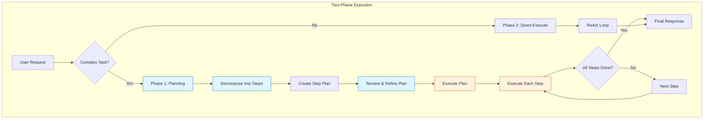

# Day 3, Tutorial 33: Multi-Step Tasks - Planning Before Execution

**Course:** Build Your Own Coding Agent  
**Day:** 3 - Tool Use Loop  
**Tutorial:** 33 of 60  
**Estimated Time:** 90 minutes

---

## 🎯 What You'll Learn

By the end of this tutorial, you'll:
- **Understand** why planning matters for complex tasks
- **Implement** a planning component that breaks down tasks
- **Design** a two-phase execution model (Plan → Execute)
- **Build** a task decomposition engine
- **Integrate** planning with the ReAct engine from T32

---

## 🎭 Why Planning Matters

In T32, we implemented ReAct - the agent thinks, acts, and observes. But there's a problem:

**ReAct plans one step at a time.** For complex tasks, this can lead to:
- **Mid-course wandering** - Agent gets distracted by intermediate results
- **Inefficient tool sequences** - Agent doesn't see the bigger picture
- **Lost track of goal** - Agent forgets what it was trying to accomplish

### The Solution: Plan Before Acting



---

## 💡 Planning Patterns

### Pattern 1: Zero-Shot Planning
The LLM decomposes the task without explicit structure:

```
User: "Create a REST API with user authentication"
Thought: This is a complex task. I need to break it down.
Plan:
  1. Create project structure
  2. Set up database models
  3. Implement auth endpoints
  4. Add middleware
Final Answer: Here's my plan...
```

### Pattern 2: Structured Planning
A predefined plan format the LLM must follow:

```
User: "Create a REST API with user authentication"
Thought: I need to create a structured plan.
Plan:
  - Step 1: Create project structure (file operations)
  - Step 2: Set up database models (file operations)
  - Step 3: Implement auth endpoints (file operations)
Execution Order: 1 → 2 → 3
```

### Pattern 3: Hierarchical Planning
Plans within plans:

```
User: "Create a full-stack app"
Master Plan:
  - Phase 1: Backend (sub-plan with 5 steps)
  - Phase 2: Frontend (sub-plan with 3 steps)
  - Phase 3: Integration (sub-plan with 2 steps)
```

---

## 💻 Implementation

### Step 1: Task Decomposition

First, let's create a task decomposition system:

```python
# src/coding_agent/planning/decomposer.py
"""
Task decomposition - breaking complex tasks into manageable steps.
"""

from typing import Optional, List, Dict, Any
from dataclasses import dataclass, field
from enum import Enum
import json
import re


class TaskComplexity(Enum):
    """Classification of task complexity."""
    SIMPLE = "simple"       # One tool call, direct answer
    MODERATE = "moderate"   # 2-3 tool calls, straightforward
    COMPLEX = "complex"     # Many tool calls, requires planning


@dataclass
class TaskStep:
    """
    A single step in a task plan.
    
    Each step represents one action the agent needs to take.
    """
    step_id: int
    description: str
    tool_name: Optional[str] = None
    tool_input: Optional[Dict[str, Any]] = None
    dependencies: List[int] = field(default_factory=list)
    status: str = "pending"  # pending, in_progress, completed, failed
    
    def to_dict(self) -> Dict[str, Any]:
        """Convert to dictionary format."""
        return {
            "step_id": self.step_id,
            "description": self.description,
            "tool_name": self.tool_name,
            "tool_input": self.tool_input,
            "dependencies": self.dependencies,
            "status": self.status
        }


@dataclass
class TaskPlan:
    """
    A complete plan for accomplishing a complex task.
    
    Contains all steps and their execution order.
    """
    task: str
    steps: List[TaskStep] = field(default_factory=list)
    complexity: TaskComplexity = TaskComplexity.SIMPLE
    estimated_steps: int = 0
    
    def add_step(
        self, 
        description: str, 
        tool_name: Optional[str] = None,
        tool_input: Optional[Dict[str, Any]] = None,
        dependencies: Optional[List[int]] = None
    ) -> TaskStep:
        """Add a new step to the plan."""
        step = TaskStep(
            step_id=len(self.steps) + 1,
            description=description,
            tool_name=tool_name,
            tool_input=tool_input,
            dependencies=dependencies or []
        )
        self.steps.append(step)
        return step
    
    def get_ready_steps(self) -> List[TaskStep]:
        """Get steps that are ready to execute (dependencies met)."""
        ready = []
        completed_ids = {s.step_id for s in self.steps if s.status == "completed"}
        
        for step in self.steps:
            if step.status == "pending":
                # Check if all dependencies are satisfied
                deps_met = all(dep in completed_ids for dep in step.dependencies)
                if deps_met:
                    ready.append(step)
        
        return ready
    
    def mark_completed(self, step_id: int):
        """Mark a step as completed."""
        for step in self.steps:
            if step.step_id == step_id:
                step.status = "completed"
                break
    
    def is_complete(self) -> bool:
        """Check if all steps are completed."""
        return all(s.status == "completed" for s in self.steps)
    
    def to_string(self) -> str:
        """Human-readable plan format."""
        lines = [f"Task: {self.task}", f"Complexity: {self.complexity.value}", ""]
        for step in self.steps:
            status_icon = "✅" if step.status == "completed" else "⏳"
            deps = f" (depends on: {step.dependencies})" if step.dependencies else ""
            lines.append(f"{status_icon} Step {step.step_id}: {step.description}{deps}")
        return "\n".join(lines)


class TaskDecomposer:
    """
    Decomposes complex tasks into executable steps.
    
    Uses the LLM to analyze the task and create a plan.
    """
    
    def __init__(self, llm_client: Any):
        self.llm_client = llm_client
    
    def decompose(self, task: str, available_tools: List[Any]) -> TaskPlan:
        """
        Decompose a task into a plan.
        
        Args:
            task: The user's request
            available_tools: List of available tools
            
        Returns:
            TaskPlan with decomposed steps
        """
        # First, assess complexity
        complexity = self._assess_complexity(task, available_tools)
        
        # Create the plan
        plan = TaskPlan(task=task, complexity=complexity)
        
        # For simple tasks, no planning needed
        if complexity == TaskComplexity.SIMPLE:
            plan.add_step(description=task)
            return plan
        
        # For complex tasks, use LLM to decompose
        steps = self._llm_decompose(task, available_tools, complexity)
        
        for step_data in steps:
            plan.add_step(
                description=step_data.get("description", ""),
                tool_name=step_data.get("tool"),
                tool_input=step_data.get("input"),
                dependencies=step_data.get("depends_on", [])
            )
        
        plan.estimated_steps = len(steps)
        return plan
    
    def _assess_complexity(
        self, 
        task: str, 
        available_tools: List[Any]
    ) -> TaskComplexity:
        """Assess how complex a task is."""
        complexity_prompt = f"""Analyze this task and classify its complexity:

Task: {task}

Available tools: {len(available_tools)}

Respond with ONLY one word:
- "simple" - if the task can be done with 1 tool call
- "moderate" - if the task needs 2-3 tool calls
- "complex" - if the task needs many tool calls or has multiple phases

Complexity:"""
        
        response = self.llm_client.chat([
            {"role": "user", "content": complexity_prompt}
        ])
        
        content = response.get("content", "").strip().lower()
        
        if "complex" in content:
            return TaskComplexity.COMPLEX
        elif "moderate" in content:
            return TaskComplexity.MODERATE
        else:
            return TaskComplexity.SIMPLE
    
    def _llm_decompose(
        self, 
        task: str, 
        available_tools: List[Any],
        complexity: TaskComplexity
    ) -> List[Dict[str, Any]]:
        """Use LLM to decompose the task."""
        tool_names = [t.name for t in available_tools]
        
        decompose_prompt = f"""You are a planning assistant. Break down this task into steps.

Task: {task}
Complexity: {complexity.value}

Available tools: {tool_names}

Create a plan with numbered steps. For each step, specify:
- description: What this step does
- tool: (optional) Which tool to use
- input: (optional) Tool input parameters
- depends_on: (optional) Which step numbers must complete first

Respond in this exact JSON format:
{{
  "plan": [
    {{"description": "...", "tool": "...", "input": {{...}}, "depends_on": []}},
    ...
  ]
}}

JSON:"""
        
        response = self.llm_client.chat([
            {"role": "user", "content": decompose_prompt}
        ])
        
        # Parse JSON from response
        content = response.get("content", "")
        
        try:
            # Try to extract JSON
            json_match = re.search(r'\{.*\}', content, re.DOTALL)
            if json_match:
                data = json.loads(json_match.group())
                return data.get("plan", [])
        except json.JSONDecodeError:
            pass
        
        # Fallback: create simple one-step plan
        return [{"description": task}]
```

### Step 2: Plan Executor

Now let's create the component that executes a plan:

```python
# src/coding_agent/planning/executor.py
"""
Plan execution - executing tasks according to a plan.
"""

import logging
from typing import Optional, Dict, Any, List
from dataclasses import dataclass
from enum import Enum

from .decomposer import TaskPlan, TaskStep
from ..tools.registry import ToolRegistry
from ..tools.result import ToolResult, ToolStatus

logger = logging.getLogger(__name__)


class ExecutionState(Enum):
    """States in plan execution."""
    PLANNING = "planning"
    EXECUTING = "executing"
    WAITING = "waiting"
    COMPLETE = "complete"
    FAILED = "failed"


@dataclass
class ExecutionResult:
    """Result of executing a plan."""
    success: bool
    completed_steps: int
    total_steps: int
    step_results: List[Dict[str, Any]]
    final_response: str
    error: Optional[str] = None


class PlanExecutor:
    """
    Executes a TaskPlan step by step.
    
    Handles dependencies, retries, and error recovery.
    """
    
    def __init__(
        self,
        tool_registry: ToolRegistry,
        llm_client: Any,
        max_retries: int = 2
    ):
        self.tool_registry = tool_registry
        self.llm_client = llm_client
        self.max_retries = max_retries
    
    def execute(self, plan: TaskPlan) -> ExecutionResult:
        """
        Execute a complete task plan.
        
        Args:
            plan: The task plan to execute
            
        Returns:
            ExecutionResult with completion status
        """
        logger.info(f"Executing plan with {len(plan.steps)} steps")
        
        step_results = []
        
        # Execute until all steps complete or failure
        while not plan.is_complete():
            # Get steps ready to execute
            ready_steps = plan.get_ready_steps()
            
            if not ready_steps:
                # No steps ready - either complete or stuck
                if plan.is_complete():
                    break
                else:
                    # Deadlock - steps have unmet dependencies
                    return ExecutionResult(
                        success=False,
                        completed_steps=sum(1 for s in plan.steps if s.status == "completed"),
                        total_steps=len(plan.steps),
                        step_results=step_results,
                        final_response="",
                        error="Cannot proceed: circular dependency or missing dependencies"
                    )
            
            # Execute each ready step
            for step in ready_steps:
                logger.info(f"Executing step {step.step_id}: {step.description}")
                step.status = "in_progress"
                
                # Execute the step
                result = self._execute_step(step)
                
                step_results.append({
                    "step_id": step.step_id,
                    "description": step.description,
                    "result": result.output if result.is_success else None,
                    "error": result.error if not result.is_success else None,
                    "success": result.is_success
                })
                
                if result.is_success:
                    plan.mark_completed(step.step_id)
                else:
                    # For now, mark as failed and continue
                    # In production, you might want retry logic
                    step.status = "failed"
                    logger.warning(f"Step {step.step_id} failed: {result.error}")
        
        # Generate final response
        final_response = self._generate_final_response(plan, step_results)
        
        return ExecutionResult(
            success=plan.is_complete(),
            completed_steps=sum(1 for s in plan.steps if s.status == "completed"),
            total_steps=len(plan.steps),
            step_results=step_results,
            final_response=final_response
        )
    
    def _execute_step(self, step: TaskStep) -> ToolResult:
        """Execute a single step."""
        if not step.tool_name:
            # No tool needed - this is just a thinking step
            return ToolResult(
                tool_call_id=f"step_{step.step_id}",
                tool_name="none",
                status=ToolStatus.SUCCESS,
                output=f"Step {step.step_id} completed: {step.description}",
                error=None
            )
        
        try:
            tool = self.tool_registry.get_tool(step.tool_name)
            if not tool:
                return ToolResult(
                    tool_call_id=f"step_{step.step_id}",
                    tool_name=step.tool_name,
                    status=ToolStatus.NOT_FOUND,
                    output="",
                    error=f"Tool '{step.tool_name}' not found"
                )
            
            # Execute with retries
            for attempt in range(self.max_retries):
                try:
                    result = tool.execute(**(step.tool_input or {}))
                    if result.is_success:
                        return result
                except Exception as e:
                    if attempt == self.max_retries - 1:
                        raise
            
            return ToolResult(
                tool_call_id=f"step_{step.step_id}",
                tool_name=step.tool_name,
                status=ToolStatus.ERROR,
                output="",
                error="Max retries exceeded"
            )
            
        except Exception as e:
            return ToolResult(
                tool_call_id=f"step_{step.step_id}",
                tool_name=step.tool_name,
                status=ToolStatus.ERROR,
                output="",
                error=str(e)
            )
    
    def _generate_final_response(
        self, 
        plan: TaskPlan,
        step_results: List[Dict[str, Any]]
    ) -> str:
        """Generate a final response from the plan execution."""
        if plan.is_complete():
            return f"Task completed successfully! {len(plan.steps)} steps executed."
        else:
            completed = sum(1 for s in step_results if s.get("success"))
            return f"Task partially completed: {completed}/{len(plan.steps)} steps successful."
```

### Step 3: Planner Integration

Now integrate the planner with the agent:

```python
# src/coding_agent/planning/planner.py
"""
Main planning component - combines decomposition and execution.
"""

import logging
from typing import Optional, List, Dict, Any

from .decomposer import TaskDecomposer, TaskComplexity, TaskPlan
from .executor import PlanExecutor, ExecutionResult
from ..tools.registry import ToolRegistry

logger = logging.getLogger(__name__)


class TaskPlanner:
    """
    Main planning component that handles complex tasks.
    
    Uses a two-phase approach:
    1. Plan phase: Decompose task into steps
    2. Execute phase: Run each step
    """
    
    def __init__(
        self,
        llm_client: Any,
        tool_registry: ToolRegistry,
        complexity_threshold: TaskComplexity = TaskComplexity.MODERATE
    ):
        self.llm_client = llm_client
        self.tool_registry = tool_registry
        self.complexity_threshold = complexity_threshold
        
        # Initialize components
        self.decomposer = TaskDecomposer(llm_client)
        self.executor = PlanExecutor(tool_registry, llm_client)
    
    def should_plan(self, task: str, available_tools: List[Any]) -> bool:
        """
        Determine if a task requires planning.
        
        Args:
            task: The user's request
            available_tools: List of available tools
            
        Returns:
            True if planning should be used
        """
        complexity = self.decomposer._assess_complexity(task, available_tools)
        
        # Plan if complexity meets threshold
        complexity_order = [
            TaskComplexity.SIMPLE,
            TaskComplexity.MODERATE,
            TaskComplexity.COMPLEX
        ]
        
        return complexity_order.index(complexity) >= complexity_order.index(self.complexity_threshold)
    
    def execute(self, task: str) -> ExecutionResult:
        """
        Execute a task with planning if needed.
        
        Args:
            task: The user's request
            
        Returns:
            ExecutionResult with completion status
        """
        logger.info(f"TaskPlanner processing: {task}")
        
        # Get available tools
        available_tools = list(self.tool_registry.tools.values())
        
        # Check if we should plan
        if not self.should_plan(task, available_tools):
            logger.info("Task is simple, skipping planning phase")
            # Return a simple result
            return ExecutionResult(
                success=True,
                completed_steps=1,
                total_steps=1,
                step_results=[{"step_id": 1, "description": task}],
                final_response=f"Handled: {task}"
            )
        
        # Phase 1: Create plan
        logger.info("Creating task plan...")
        plan = self.decomposer.decompose(task, available_tools)
        
        logger.info(f"Plan created: {plan.to_string()}")
        
        # Phase 2: Execute plan
        logger.info("Executing plan...")
        result = self.executor.execute(plan)
        
        logger.info(f"Execution complete: {result.completed_steps}/{result.total_steps} steps")
        
        return result
    
    def get_plan_preview(self, task: str) -> Optional[TaskPlan]:
        """
        Get a preview of the plan without executing.
        
        Useful for user confirmation on complex tasks.
        """
        available_tools = list(self.tool_registry.tools.values())
        
        if not self.should_plan(task, available_tools):
            return None
        
        return self.decomposer.decompose(task, available_tools)
```

### Step 4: Agent Integration

Finally, let's update the agent to use the planner:

```python
# src/coding_agent/agent.py (updated)
"""
Coding Agent with Planning integration.
"""

import logging
from typing import Optional, List, Dict, Any

from .llm.client import LLMClient
from .tools.registry import ToolRegistry
from .context.manager import ContextManager
from .events import EventEmitter
from .react.engine import ReActEngine, ReActConfig
from .planning.planner import TaskPlanner, TaskComplexity

logger = logging.getLogger(__name__)


class Agent:
    """
    Main coding agent with planning for complex tasks.
    
    This agent can:
    - Handle simple tasks directly (ReAct)
    - Plan complex tasks before executing
    - Use tools autonomously via ReAct reasoning
    - Maintain conversation context
    """
    
    def __init__(
        self,
        llm_client: LLMClient,
        tool_registry: ToolRegistry,
        context_manager: Optional[ContextManager] = None,
        event_emitter: Optional[EventEmitter] = None,
        use_planning: bool = True,
        react_config: Optional[ReActConfig] = None
    ):
        self.llm_client = llm_client
        self.tool_registry = tool_registry
        self.context_manager = context_manager or ContextManager()
        self.event_emitter = event_emitter or EventEmitter()
        self.use_planning = use_planning
        
        # ReAct engine for direct execution
        self.react_engine = ReActEngine(
            tool_registry=tool_registry,
            llm_client=llm_client,
            config=react_config or ReActConfig()
        )
        
        # Task planner for complex tasks
        if use_planning:
            self.planner = TaskPlanner(
                llm_client=llm_client,
                tool_registry=tool_registry,
                complexity_threshold=TaskComplexity.MODERATE
            )
        
        logger.info(f"Agent initialized (Planning: {use_planning})")
    
    def run(self, user_input: str) -> str:
        """
        Process user input and generate response.
        
        This is the main entry point for the agent.
        """
        self.event_emitter.emit("agent.start", {"input": user_input})
        
        try:
            # Use planning for complex tasks
            if self.use_planning and self.planner.should_plan(
                user_input, 
                list(self.tool_registry.tools.values())
            ):
                response = self._run_with_planning(user_input)
            else:
                response = self._run_with_react(user_input)
            
            self.event_emitter.emit("agent.complete", {"response": response})
            return response
            
        except Exception as e:
            logger.exception("Agent error")
            self.event_emitter.emit("agent.error", {"error": str(e)})
            return f"I encountered an error: {str(e)}"
    
    def _run_with_planning(self, user_input: str) -> str:
        """Run with planning for complex tasks."""
        logger.info("Using planning for complex task")
        
        # Get plan preview
        plan = self.planner.get_plan_preview(user_input)
        
        if plan:
            logger.info(f"Plan preview: {plan.to_string()}")
        
        # Execute with planning
        result = self.planner.execute(user_input)
        
        return result.final_response
    
    def _run_with_react(self, user_input: str) -> str:
        """Run with ReAct for simple tasks."""
        logger.info("Using ReAct for simple task")
        return self.react_engine.execute(user_input)
```

---

## 🧪 Testing the Planner

Let's test our planning system:

```python
# tests/test_planning.py
"""
Tests for planning components.
"""

import pytest
from unittest.mock import Mock, patch

from coding_agent.planning.decomposer import (
    TaskDecomposer, TaskPlan, TaskStep, TaskComplexity
)
from coding_agent.planning.executor import PlanExecutor, ExecutionResult
from coding_agent.planning.planner import TaskPlanner
from coding_agent.tools.registry import ToolRegistry
from coding_agent.tools.builtins import ReadFileTool, WriteFileTool


class TestTaskPlan:
    """Test TaskPlan functionality."""
    
    def test_create_empty_plan(self):
        """Test creating an empty plan."""
        plan = TaskPlan(task="Test task")
        
        assert plan.task == "Test task"
        assert len(plan.steps) == 0
        assert not plan.is_complete()
    
    def test_add_step(self):
        """Test adding steps to a plan."""
        plan = TaskPlan(task="Test")
        step = plan.add_step("Read config", "read_file", {"path": "config.yaml"})
        
        assert step.step_id == 1
        assert step.description == "Read config"
        assert step.tool_name == "read_file"
        assert step.status == "pending"
    
    def test_mark_completed(self):
        """Test marking steps as completed."""
        plan = TaskPlan(task="Test")
        plan.add_step("Step 1")
        plan.add_step("Step 2")
        
        plan.mark_completed(1)
        
        assert plan.steps[0].status == "completed"
        assert plan.steps[1].status == "pending"
    
    def test_get_ready_steps_with_dependencies(self):
        """Test dependency resolution."""
        plan = TaskPlan(task="Test")
        plan.add_step("Step 1")
        plan.add_step("Step 2", dependencies=[1])  # Depends on step 1
        plan.add_step("Step 3", dependencies=[1, 2])  # Depends on both
        
        # Initially, only step 1 is ready
        ready = plan.get_ready_steps()
        assert len(ready) == 1
        assert ready[0].step_id == 1
        
        # After completing step 1, step 2 becomes ready
        plan.mark_completed(1)
        ready = plan.get_ready_steps()
        assert len(ready) == 1
        assert ready[0].step_id == 2


class TestPlanExecutor:
    """Test plan execution."""
    
    @pytest.fixture
    def tool_registry(self):
        """Create a tool registry."""
        registry = ToolRegistry()
        registry.register(ReadFileTool())
        return registry
    
    @pytest.fixture
    def mock_llm(self):
        """Create a mock LLM."""
        return Mock()
    
    def test_simple_execution(self, tool_registry, mock_llm):
        """Test executing a simple plan."""
        executor = PlanExecutor(tool_registry, mock_llm)
        
        plan = TaskPlan(task="Test")
        plan.add_step("Read config", "read_file", {"path": "config.yaml"})
        
        result = executor.execute(plan)
        
        assert result.success
        assert result.completed_steps == 1


class TestTaskPlanner:
    """Test the main planner."""
    
    @pytest.fixture
    def tool_registry(self):
        """Create a tool registry."""
        registry = ToolRegistry()
        registry.register(ReadFileTool())
        registry.register(WriteFileTool())
        return registry
    
    @pytest.fixture
    def mock_llm(self):
        """Create a mock LLM that returns simple responses."""
        llm = Mock()
        llm.chat.return_value = {"content": "simple"}
        return llm
    
    def test_should_plan_simple_task(self, tool_registry, mock_llm):
        """Test that simple tasks don't require planning."""
        planner = TaskPlanner(
            mock_llm, 
            tool_registry,
            complexity_threshold=TaskComplexity.MODERATE
        )
        
        # A simple task should not need planning
        should_plan = planner.should_plan(
            "What is the time?",
            list(tool_registry.tools.values())
        )
        
        assert not should_plan
```

---

## 🔄 Planning vs. ReAct

When to use each approach:

| Scenario | Approach | Reason |
|----------|----------|--------|
| "What's the time?" | Direct ReAct | Simple, one tool |
| "Read file X" | Direct ReAct | Single operation |
| "Create a REST API" | Planning first | Many steps, complex |
| "Find all bugs in code" | Planning first | Requires analysis |
| "Explain this file" | Direct ReAct | No tool use needed |

---

## ⚠️ Common Pitfalls

### 1. Over-Planning
**Problem:** Agent plans even for simple tasks
**Solution:** Use complexity threshold, skip planning for simple tasks

### 2. Rigid Plans
**Problem:** Agent follows plan even when it's wrong
**Solution:** Allow plan modification during execution

### 3. Missing Dependencies
**Problem:** Steps fail because dependencies aren't tracked
**Solution:** Use explicit dependency tracking in TaskStep

---

## 🎯 Exercise

**Build a planning-enabled file organizer:**

1. Create a `TaskPlanner` with complexity threshold
2. Test: "Organize all Python files into a new directory structure"
3. Verify the plan shows multiple steps with dependencies
4. Execute the plan and verify files are organized

---

## 📝 Summary

In this tutorial, you learned:
- ✅ Why planning matters for complex tasks
- ✅ How to implement task decomposition
- ✅ How to build a plan executor
- ✅ How to integrate planning with ReAct
- ✅ When to use planning vs. direct execution

**Next Tutorial (T34):** We'll learn about self-correction - how the agent handles tool failures and recovers gracefully.

---

## 🔗 Code References

- **This tutorial's code:** `src/coding_agent/planning/` (new directory)
- **Depends on:** T32 (ReAct Pattern), T30 (Tool Execution Loop)
- **Used by:** T34 (Self-correction)