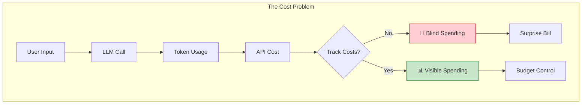

# Day 3, Tutorial 34: Token Tracking and Cost Awareness

**Course:** Build Your Own Coding Agent  
**Day:** 3 - Tool Use Loop  
**Tutorial:** 34 of 60  
**Estimated Time:** 60 minutes

---

## 🎯 What You'll Learn

By the end of this tutorial, you'll:
- **Understand** what tokens are and why they matter
- **Implement** token tracking in the LLM client
- **Calculate** costs based on model pricing
- **Display** usage statistics to users
- **Add** budget limits and warning thresholds
- **Integrate** cost tracking with the agent

---

## 🎭 Why Token Tracking Matters

When we built the agent in earlier tutorials, we focused on functionality - can it read files? Can it execute tools? But there's a critical aspect we haven't addressed: **cost**.

Every LLM call uses tokens. Every token costs money (except local Ollama). If your agent runs for hours without tracking, you could:

1. ** blow through your API quota** - Unexpected bills
2. **Hit context limits** - Conversations get truncated
3. **Waste money** - Repeating the same context repeatedly
4. **Have no visibility** - No idea what's being spent



### How LLM Pricing Works

Different providers price tokens differently:

| Provider | Model | Input $/M tokens | Output $/M tokens |
|----------|-------|------------------|-------------------|
| Anthropic | Claude 3.5 Sonnet | $3.00 | $15.00 |
| Anthropic | Claude 3 Haiku | $0.25 | $1.25 |
| OpenAI | GPT-4o | $2.50 | $10.00 |
| OpenAI | GPT-4o Mini | $0.15 | $0.60 |
| Ollama | Local | $0.00 | $0.00 |

**Example:** 10,000 input tokens + 5,000 output tokens on Claude 3.5 Sonnet:
- Input: 10,000 × ($3.00 / 1,000,000) = $0.03
- Output: 5,000 × ($15.00 / 1,000,000) = $0.075
- **Total: $0.105 per request**

That seems small, but if you're making hundreds of requests per session, it adds up fast.

---

## 💻 Implementation

### Step 1: Token and Cost Tracking Module

Create a new module to track token usage:

```python
# src/coding_agent/monitoring/usage.py
"""
Token usage tracking and cost calculation.
"""

from dataclasses import dataclass, field
from typing import Dict, Optional, List
from datetime import datetime
import logging

logger = logging.getLogger(__name__)


@dataclass
class TokenUsage:
    """Tracks token usage for a single request."""
    
    prompt_tokens: int = 0
    completion_tokens: int = 0
    total_tokens: int = 0
    
    @property
    def input_tokens(self) -> int:
        """Alias for prompt_tokens."""
        return self.prompt_tokens
    
    @property
    def output_tokens(self) -> int:
        """Alias for completion_tokens."""
        return self.completion_tokens
    
    def to_dict(self) -> Dict[str, int]:
        return {
            "prompt_tokens": self.prompt_tokens,
            "completion_tokens": self.completion_tokens,
            "total_tokens": self.total_tokens
        }


@dataclass
class CostCalculation:
    """Cost calculation for a single request."""
    
    model: str
    input_tokens: int
    output_tokens: int
    input_cost: float = 0.0
    output_cost: float = 0.0
    total_cost: float = 0.0
    
    def to_dict(self) -> Dict[str, any]:
        return {
            "model": self.model,
            "input_tokens": self.input_tokens,
            "output_tokens": self.output_tokens,
            "input_cost": self.input_cost,
            "output_cost": self.output_cost,
            "total_cost": self.total_cost
        }


class PricingConfig:
    """
    Pricing configuration for different models.
    
    Prices are per million tokens.
    """
    
    # Anthropic pricing
    ANTHROPIC_PRICING = {
        "claude-3-5-sonnet-20241022": {
            "input": 3.00,
            "output": 15.00
        },
        "claude-3-5-haiku-20241022": {
            "input": 0.25,
            "output": 1.25
        },
        "claude-3-opus-20240229": {
            "input": 15.00,
            "output": 75.00
        },
        "claude-3-sonnet-20240229": {
            "input": 3.00,
            "output": 15.00
        },
        "claude-3-haiku-20240307": {
            "input": 0.25,
            "output": 1.25
        },
    }
    
    # OpenAI pricing
    OPENAI_PRICING = {
        "gpt-4o": {"input": 2.50, "output": 10.00},
        "gpt-4o-mini": {"input": 0.15, "output": 0.60},
        "gpt-4-turbo": {"input": 10.00, "output": 30.00},
        "gpt-4": {"input": 30.00, "output": 60.00},
    }
    
    # Ollama (free)
    OLLAMA_PRICING = {
        "llama3.2": {"input": 0.0, "output": 0.0},
        "llama3.1": {"input": 0.0, "output": 0.0},
        "mixtral": {"input": 0.0, "output": 0.0},
        "codellama": {"input": 0.0, "output": 0.0},
    }
    
    @classmethod
    def get_pricing(cls, provider: str, model: str) -> Dict[str, float]:
        """Get pricing for a specific model."""
        if provider == "anthropic":
            return cls.ANTHROPIC_PRICING.get(model, {"input": 3.00, "output": 15.00})
        elif provider == "openai":
            return cls.OPENAI_PRICING.get(model, {"input": 2.50, "output": 10.00})
        else:  # ollama or unknown
            return cls.OLLAMA_PRICING.get(model, {"input": 0.0, "output": 0.0})
    
    @classmethod
    def calculate_cost(
        cls, 
        provider: str, 
        model: str, 
        input_tokens: int, 
        output_tokens: int
    ) -> CostCalculation:
        """Calculate cost for a request."""
        pricing = cls.get_pricing(provider, model)
        
        input_cost = (input_tokens / 1_000_000) * pricing["input"]
        output_cost = (output_tokens / 1_000_000) * pricing["output"]
        
        return CostCalculation(
            model=model,
            input_tokens=input_tokens,
            output_tokens=output_tokens,
            input_cost=input_cost,
            output_cost=output_cost,
            total_cost=input_cost + output_cost
        )


@dataclass
class UsageStats:
    """Aggregate usage statistics for a session."""
    
    total_requests: int = 0
    total_prompt_tokens: int = 0
    total_completion_tokens: int = 0
    total_cost: float = 0.0
    start_time: datetime = field(default_factory=datetime.now)
    
    @property
    def total_tokens(self) -> int:
        return self.total_prompt_tokens + self.total_completion_tokens
    
    @property
    def average_tokens_per_request(self) -> float:
        if self.total_requests == 0:
            return 0.0
        return self.total_tokens / self.total_requests
    
    @property
    def session_duration_seconds(self) -> float:
        return (datetime.now() - self.start_time).total_seconds()
    
    def to_dict(self) -> Dict[str, any]:
        return {
            "total_requests": self.total_requests,
            "total_tokens": self.total_tokens,
            "total_prompt_tokens": self.total_prompt_tokens,
            "total_completion_tokens": self.total_completion_tokens,
            "total_cost": self.total_cost,
            "average_tokens_per_request": self.average_tokens_per_request,
            "session_duration_seconds": self.session_duration_seconds
        }


class TokenTracker:
    """
    Tracks token usage and calculates costs across sessions.
    
    This is the main class users will interact with for tracking.
    """
    
    def __init__(
        self,
        provider: str = "anthropic",
        model: str = "claude-3-5-sonnet-20241022",
        budget_limit: Optional[float] = None,
        warning_threshold: float = 0.8
    ):
        self.provider = provider
        self.model = model
        self.budget_limit = budget_limit
        self.warning_threshold = warning_threshold
        
        self.current_session = UsageStats()
        self.request_history: List[Dict] = []
        
        logger.info(f"TokenTracker initialized: {provider}/{model}")
    
    def record_request(
        self,
        input_tokens: int,
        output_tokens: int,
        metadata: Optional[Dict] = None
    ) -> CostCalculation:
        """
        Record a request and update statistics.
        
        Args:
            input_tokens: Number of input tokens
            output_tokens: Number of output tokens
            metadata: Optional metadata about the request
            
        Returns:
            CostCalculation for this request
        """
        # Calculate cost
        cost = PricingConfig.calculate_cost(
            self.provider,
            self.model,
            input_tokens,
            output_tokens
        )
        
        # Update session stats
        self.current_session.total_requests += 1
        self.current_session.total_prompt_tokens += input_tokens
        self.current_session.total_completion_tokens += output_tokens
        self.current_session.total_cost += cost.total_cost
        
        # Record in history
        self.request_history.append({
            "timestamp": datetime.now().isoformat(),
            "input_tokens": input_tokens,
            "output_tokens": output_tokens,
            "cost": cost.total_cost,
            "metadata": metadata or {}
        })
        
        # Check budget
        self._check_budget()
        
        logger.debug(
            f"Request recorded: {input_tokens + output_tokens} tokens, "
            f"${cost.total_cost:.4f}"
        )
        
        return cost
    
    def _check_budget(self):
        """Check if we're approaching or exceeding budget."""
        if self.budget_limit is None:
            return
        
        percentage = self.current_session.total_cost / self.budget_limit
        
        if percentage >= 1.0:
            logger.error(
                f"BUDGET EXCEEDED: ${self.current_session.total_cost:.2f} "
                f"of ${self.budget_limit:.2f}"
            )
        elif percentage >= self.warning_threshold:
            logger.warning(
                f"Budget warning: ${self.current_session.total_cost:.2f} "
                f"of ${self.budget_limit:.2f} ({percentage*100:.0f}%)"
            )
    
    def get_stats(self) -> UsageStats:
        """Get current session statistics."""
        return self.current_session
    
    def get_formatted_summary(self) -> str:
        """Get a human-readable summary."""
        stats = self.current_session
        
        lines = [
            "📊 Session Statistics",
            f"  Requests: {stats.total_requests}",
            f"  Total Tokens: {stats.total_tokens:,}",
            f"    - Input: {stats.total_prompt_tokens:,}",
            f"    - Output: {stats.total_completion_tokens:,}",
            f"  Total Cost: ${stats.total_cost:.4f}",
            f"  Avg Tokens/Request: {stats.average_tokens_per_request:.0f}",
        ]
        
        if self.budget_limit:
            percentage = (stats.total_cost / self.budget_limit) * 100
            lines.append(f"  Budget: {percentage:.1f}% of ${self.budget_limit:.2f}")
        
        return "\n".join(lines)
    
    def reset_session(self):
        """Reset session statistics (start new session)."""
        self.current_session = UsageStats()
        self.request_history.clear()
        logger.info("Session statistics reset")
    
    def get_last_request_cost(self) -> Optional[CostCalculation]:
        """Get cost of the most recent request."""
        if not self.request_history:
            return None
        
        last = self.request_history[-1]
        return PricingConfig.calculate_cost(
            self.provider,
            self.model,
            last["input_tokens"],
            last["output_tokens"]
        )
```

### Step 2: Update LLM Client to Track Usage

Now update the LLM client to use our token tracker:

```python
# src/coding_agent/llm/client.py (updated)
"""
LLM Client interface with usage tracking.
"""

from abc import ABC, abstractmethod
from dataclasses import dataclass
from typing import List, Dict, Any, Optional
import logging

from coding_agent.monitoring.usage import TokenTracker, CostCalculation

logger = logging.getLogger(__name__)


@dataclass
class LLMResponse:
    """Response from an LLM call."""
    
    content: str
    model: str
    usage: Dict[str, int]  # {"prompt": 100, "completion": 50, "total": 150}
    finish_reason: str  # "stop", "length", "error"
    raw_response: Optional[Dict[str, Any]] = None
    cost: Optional[CostCalculation] = None  # NEW: Cost tracking
    
    @property
    def input_tokens(self) -> int:
        return self.usage.get("prompt", 0)
    
    @property
    def output_tokens(self) -> int:
        return self.usage.get("completion", 0)


@dataclass
class Message:
    """A single message in the conversation."""
    
    role: str  # "system", "user", "assistant"
    content: str
    tool_calls: Optional[List[Dict[str, Any]]] = None
    tool_call_id: Optional[str] = None


class LLMClient(ABC):
    """
    Abstract base class for LLM clients with usage tracking.
    """
    
    def __init__(
        self,
        api_key: str,
        model: str = "claude-3-5-sonnet-20241022",
        temperature: float = 0.7,
        max_tokens: int = 4096,
        timeout: int = 60,
        token_tracker: Optional[TokenTracker] = None,  # NEW
    ):
        self.api_key = api_key
        self.model = model
        self.temperature = temperature
        self.max_tokens = max_tokens
        self.timeout = timeout
        
        # NEW: Initialize token tracker
        self.token_tracker = token_tracker or TokenTracker(
            provider=self.get_provider_name(),
            model=model
        )
        
        logger.info(f"Initialized {self.__class__.__name__} with model {model}")
    
    @abstractmethod
    def get_provider_name(self) -> str:
        """Return the provider name (anthropic, openai, ollama)."""
        pass
    
    @abstractmethod
    def _call_api(
        self,
        messages: List[Message],
        params: Dict[str, Any]
    ) -> LLMResponse:
        """Make the actual API call. Must be implemented by subclasses."""
        pass
    
    def _record_usage(self, response: LLMResponse) -> LLMResponse:
        """Record token usage and calculate cost."""
        cost = self.token_tracker.record_request(
            input_tokens=response.input_tokens,
            output_tokens=response.output_tokens,
            metadata={"model": response.model}
        )
        response.cost = cost
        return response
    
    def chat(
        self,
        messages: List[Message],
        tools: Optional[List[Dict]] = None,
        **params
    ) -> LLMResponse:
        """
        Send a chat request to the LLM.
        
        Args:
            messages: List of conversation messages
            tools: Optional list of tool definitions
            **params: Additional parameters
            
        Returns:
            LLMResponse with content and usage information
        """
        # Merge default params with overrides
        request_params = {
            "temperature": self.temperature,
            "max_tokens": self.max_tokens,
            **params
        }
        
        # Add tools if provided
        if tools:
            request_params["tools"] = tools
        
        # Make the API call
        response = self._call_api(messages, request_params)
        
        # Record usage
        response = self._record_usage(response)
        
        logger.debug(
            f"LLM call: {response.input_tokens + response.output_tokens} tokens, "
            f"${response.cost.total_cost:.4f}" if response.cost else ""
        )
        
        return response
    
    def get_usage_stats(self):
        """Get current usage statistics."""
        return self.token_tracker.get_stats()
    
    def get_usage_summary(self) -> str:
        """Get formatted usage summary."""
        return self.token_tracker.get_formatted_summary()
```

### Step 3: Update Specific LLM Implementations

Update the Anthropic client:

```python
# src/coding_agent/llm/anthropic.py (updated)
"""
Anthropic Claude client with usage tracking.
"""

import anthropic
from typing import List, Dict, Any
import logging

from .client import LLMClient, LLMResponse, Message

logger = logging.getLogger(__name__)


class AnthropicClient(LLMClient):
    """Client for Anthropic's Claude API."""
    
    def __init__(
        self,
        api_key: str,
        model: str = "claude-3-5-sonnet-20241022",
        **kwargs
    ):
        super().__init__(api_key, model, **kwargs)
        self.client = anthropic.Anthropic(api_key=api_key, timeout=kwargs.get("timeout", 60))
    
    def get_provider_name(self) -> str:
        return "anthropic"
    
    def _call_api(
        self,
        messages: List[Message],
        params: Dict[str, Any]
    ) -> LLMResponse:
        """Make Anthropic API call."""
        # Convert messages to Anthropic format
        anthropic_messages = []
        system_message = None
        
        for msg in messages:
            if msg.role == "system":
                system_message = msg.content
            else:
                msg_dict = {
                    "role": msg.role,
                    "content": msg.content
                }
                if msg.tool_calls:
                    msg_dict["content"] = [
                        {"type": "text", "text": msg.content}
                    ] + [
                        {
                            "type": "tool_use",
                            "id": tc["id"],
                            "name": tc["function"]["name"],
                            "input": tc["function"]["arguments"]
                        }
                        for tc in msg.tool_calls
                    ]
                anthropic_messages.append(msg_dict)
        
        # Build request
        request = {
            "model": self.model,
            "messages": anthropic_messages,
            "max_tokens": params.get("max_tokens", self.max_tokens),
            "temperature": params.get("temperature", self.temperature),
        }
        
        if system_message:
            request["system"] = system_message
        
        if "tools" in params:
            request["tools"] = params["tools"]
        
        # Make call
        try:
            response = self.client.messages.create(**request)
            
            # Extract content
            content = ""
            tool_calls = []
            
            for block in response.content:
                if block.type == "text":
                    content += block.text
                elif block.type == "tool_use":
                    tool_calls.append({
                        "id": block.id,
                        "function": {
                            "name": block.name,
                            "arguments": block.input
                        }
                    })
            
            # Extract usage
            usage = {
                "prompt": response.usage.input_tokens,
                "completion": response.usage.output_tokens,
                "total": response.usage.input_tokens + response.usage.output_tokens
            }
            
            return LLMResponse(
                content=content,
                model=response.model,
                usage=usage,
                finish_reason=response.stop_reason or "stop",
                raw_response=response.model_dump()
            )
            
        except anthropic.APIConnectionError as e:
            logger.error(f"Anthropic connection error: {e}")
            return LLMResponse(
                content="",
                model=self.model,
                usage={"prompt": 0, "completion": 0, "total": 0},
                finish_reason="error",
                raw_response={"error": str(e)}
            )
        except Exception as e:
            logger.exception("Anthropic API error")
            return LLMResponse(
                content=f"Error: {str(e)}",
                model=self.model,
                usage={"prompt": 0, "completion": 0, "total": 0},
                finish_reason="error"
            )
```

### Step 4: Add Budget Warning to Agent

Now integrate cost tracking into the agent:

```python
# src/coding_agent/agent.py (updated)
"""
Coding Agent with cost tracking and budget management.
"""

import logging
from typing import Optional, List, Dict, Any

from .llm.client import LLMClient
from .tools.registry import ToolRegistry
from .context.manager import ContextManager
from .events import EventEmitter
from .react.engine import ReActEngine, ReActConfig
from .monitoring.usage import TokenTracker

logger = logging.getLogger(__name__)


class Agent:
    """
    Main coding agent with cost tracking and budget management.
    
    This agent can:
    - Track token usage and costs
    - Warn when approaching budget limits
    - Display usage statistics
    - Use tools autonomously via ReAct reasoning
    """
    
    def __init__(
        self,
        llm_client: LLMClient,
        tool_registry: ToolRegistry,
        context_manager: Optional[ContextManager] = None,
        event_emitter: Optional[EventEmitter] = None,
        budget_limit: Optional[float] = None,
        warn_threshold: float = 0.8,
        react_config: Optional[ReActConfig] = None
    ):
        self.llm_client = llm_client
        self.tool_registry = tool_registry
        self.context_manager = context_manager or ContextManager()
        self.event_emitter = event_emitter or EventEmitter()
        
        # Budget configuration
        self.budget_limit = budget_limit
        self.warn_threshold = warn_threshold
        
        # ReAct engine for execution
        self.react_engine = ReActEngine(
            tool_registry=tool_registry,
            llm_client=llm_client,
            config=react_config or ReActConfig()
        )
        
        logger.info(f"Agent initialized (Budget: {budget_limit})")
    
    def run(self, user_input: str) -> str:
        """Process user input and generate response."""
        self.event_emitter.emit("agent.start", {"input": user_input})
        
        try:
            # Execute via ReAct
            response = self.react_engine.execute(user_input)
            
            # Check budget after execution
            self._check_budget()
            
            self.event_emitter.emit("agent.complete", {
                "response": response,
                "usage": self.get_usage().to_dict()
            })
            return response
            
        except Exception as e:
            logger.exception("Agent error")
            self.event_emitter.emit("agent.error", {"error": str(e)})
            return f"I encountered an error: {str(e)}"
    
    def _check_budget(self):
        """Check budget and emit warnings."""
        if self.budget_limit is None:
            return
        
        stats = self.llm_client.get_usage_stats()
        percentage = stats.total_cost / self.budget_limit
        
        if percentage >= 1.0:
            self.event_emitter.emit("budget.exceeded", {
                "total_cost": stats.total_cost,
                "budget": self.budget_limit
            })
            logger.error(
                f"BUDGET EXCEEDED: ${stats.total_cost:.2f} "
                f"of ${self.budget_limit:.2f}"
            )
        elif percentage >= self.warn_threshold:
            self.event_emitter.emit("budget.warning", {
                "percentage": percentage,
                "total_cost": stats.total_cost,
                "budget": self.budget_limit
            })
            logger.warning(
                f"Budget warning: ${stats.total_cost:.2f} "
                f"of ${self.budget_limit:.2f} ({percentage*100:.0f}%)"
            )
    
    def get_usage(self):
        """Get current usage statistics."""
        return self.llm_client.get_usage_stats()
    
    def get_usage_summary(self) -> str:
        """Get formatted usage summary."""
        return self.llm_client.get_usage_summary()
    
    def reset_usage(self):
        """Reset usage statistics for a new session."""
        self.llm_client.token_tracker.reset_session()
```

### Step 5: Add Usage Display Tool

Add a tool so users can check their usage:

```python
# src/coding_agent/tools/monitoring.py
"""
Monitoring tools - usage, stats, budget.
"""

from typing import Dict, Any, Optional
from dataclasses import asdict

from .base import BaseTool, ToolResult, ToolStatus


class UsageTool(BaseTool):
    """Tool for displaying usage statistics."""
    
    def __init__(self, agent: Optional[Any] = None):
        super().__init__(
            name="usage",
            description="Display token usage and cost statistics for this session. Shows total requests, tokens, and cost."
        )
        self.agent = agent
    
    def execute(self, **kwargs) -> ToolResult:
        """Display usage statistics."""
        if self.agent:
            summary = self.agent.get_usage_summary()
            stats = self.agent.get_usage()
        else:
            summary = "No agent available"
            stats = None
        
        return ToolResult(
            tool_call_id="usage",
            tool_name=self.name,
            status=ToolStatus.SUCCESS,
            output=summary,
            metadata=asdict(stats) if stats else {}
        )


class BudgetTool(BaseTool):
    """Tool for setting budget limits."""
    
    def __init__(self, agent: Optional[Any] = None):
        super().__init__(
            name="budget",
            description="Set or display budget limits for the session. Use: budget set 10.00 or budget show"
        )
        self.agent = agent
    
    def execute(self, action: str = "show", limit: Optional[float] = None, **kwargs) -> ToolResult:
        """Set or show budget."""
        if action == "set" and limit:
            if self.agent:
                self.agent.budget_limit = limit
                return ToolResult(
                    tool_call_id="budget",
                    tool_name=self.name,
                    status=ToolStatus.SUCCESS,
                    output=f"Budget limit set to ${limit:.2f}"
                )
            else:
                return ToolResult(
                    tool_call_id="budget",
                    tool_name=self.name,
                    status=ToolStatus.ERROR,
                    output="No agent available to set budget"
                )
        elif action == "show":
            if self.agent:
                limit = self.agent.budget_limit
                if limit:
                    stats = self.agent.get_usage()
                    percentage = (stats.total_cost / limit) * 100
                    return ToolResult(
                        tool_call_id="budget",
                        tool_name=self.name,
                        status=ToolStatus.SUCCESS,
                        output=f"Budget: ${limit:.2f} | Spent: ${stats.total_cost:.2f} ({percentage:.1f}%)"
                    )
                else:
                    return ToolResult(
                        tool_call_id="budget",
                        tool_name=self.name,
                        status=ToolStatus.SUCCESS,
                        output="No budget limit set"
                    )
            else:
                return ToolResult(
                    tool_call_id="budget",
                    tool_name=self.name,
                    status=ToolStatus.ERROR,
                    output="No agent available"
                )
        else:
            return ToolResult(
                tool_call_id="budget",
                tool_name=self.name,
                status=ToolStatus.ERROR,
                output=f"Unknown action: {action}. Use 'set' or 'show'"
            )


class ResetUsageTool(BaseTool):
    """Tool for resetting usage statistics."""
    
    def __init__(self, agent: Optional[Any] = None):
        super().__init__(
            name="reset_usage",
            description="Reset session usage statistics. Starts fresh counting."
        )
        self.agent = agent
    
    def execute(self, **kwargs) -> ToolResult:
        """Reset usage."""
        if self.agent:
            self.agent.reset_usage()
            return ToolResult(
                tool_call_id="reset_usage",
                tool_name=self.name,
                status=ToolStatus.SUCCESS,
                output="Usage statistics reset"
            )
        else:
            return ToolResult(
                tool_call_id="reset_usage",
                tool_name=self.name,
                status=ToolStatus.ERROR,
                output="No agent available"
            )
```

---

## 🧪 Testing Token Tracking

Let's test our implementation:

```python
# tests/test_token_tracking.py
"""
Tests for token tracking and cost calculation.
"""

import pytest
from coding_agent.monitoring.usage import (
    TokenTracker, PricingConfig, UsageStats, CostCalculation
)


class TestPricingConfig:
    """Test pricing calculations."""
    
    def test_anthropic_pricing(self):
        """Test Anthropic pricing calculation."""
        cost = PricingConfig.calculate_cost(
            "anthropic",
            "claude-3-5-sonnet-20241022",
            input_tokens=10_000,
            output_tokens=5_000
        )
        
        # Input: 10,000 / 1M * $3.00 = $0.03
        # Output: 5,000 / 1M * $15.00 = $0.075
        # Total: $0.105
        assert abs(cost.input_cost - 0.03) < 0.001
        assert abs(cost.output_cost - 0.075) < 0.001
        assert abs(cost.total_cost - 0.105) < 0.001
    
    def test_openai_pricing(self):
        """Test OpenAI pricing calculation."""
        cost = PricingConfig.calculate_cost(
            "openai",
            "gpt-4o",
            input_tokens=1_000_000,
            output_tokens=1_000_000
        )
        
        # $2.50 + $10.00 = $12.50
        assert abs(cost.total_cost - 12.50) < 0.01
    
    def test_ollama_free(self):
        """Test Ollama is free."""
        cost = PricingConfig.calculate_cost(
            "ollama",
            "llama3.2",
            input_tokens=1_000_000,
            output_tokens=1_000_000
        )
        
        assert cost.total_cost == 0.0


class TestTokenTracker:
    """Test token tracker."""
    
    def test_basic_tracking(self):
        """Test basic request tracking."""
        tracker = TokenTracker(
            provider="anthropic",
            model="claude-3-5-sonnet-20241022"
        )
        
        cost = tracker.record_request(1000, 500)
        
        assert tracker.current_session.total_requests == 1
        assert tracker.current_session.total_prompt_tokens == 1000
        assert tracker.current_session.total_completion_tokens == 500
        assert cost.total_cost > 0
    
    def test_budget_warning(self):
        """Test budget warning threshold."""
        tracker = TokenTracker(
            provider="anthropic",
            model="claude-3-5-sonnet-20241022",
            budget_limit=1.00,
            warning_threshold=0.8
        )
        
        # Record requests until we hit 80% of budget
        for _ in range(8):
            tracker.record_request(100_000, 50_000)
        
        # Should have a warning now
        stats = tracker.current_session
        assert stats.total_cost >= 0.80  # 80% of $1.00
    
    def test_formatted_summary(self):
        """Test formatted summary output."""
        tracker = TokenTracker(
            provider="anthropic",
            model="claude-3-5-sonnet-20241022"
        )
        
        tracker.record_request(1000, 500)
        
        summary = tracker.get_formatted_summary()
        
        assert "Session Statistics" in summary
        assert "Requests: 1" in summary
        assert "Total Cost:" in summary
```

---

## 💡 Cost Optimization Tips

### 1. Use Cheaper Models for Simple Tasks

```python
# Route to cheaper model for simple tasks
def should_use_cheap_model(task: str) -> bool:
    simple_patterns = ["what is", "time", "help", "list"]
    return any(task.lower().startswith(p) for p in simple_patterns)
```

### 2. Cache Repeated Contexts

If you're reading the same files repeatedly, cache them:

```python
# Don't do this
for file in files:
    read_tool.execute(path=file)  # Same context each time

# Do this instead
context = load_all_files(files)  # Load once
prompt = f"Files:\n{context}\n\nTask: {task}"
```

### 3. Limit Response Tokens

Set `max_tokens` appropriately - don't over-provision:

```python
# Instead of default 4096
response = client.chat(messages, max_tokens=1024)  # For simple tasks
```

### 4. Track Per-Task Costs

Know which tasks cost the most:

```python
def track_task_cost(task: str, cost: float):
    """Log cost by task type"""
    task_type = classify_task(task)
    logger.info(f"Task: {task_type}, Cost: ${cost:.4f}")
```

---

## ⚠️ Common Pitfalls

### 1. Ignoring Token Limits
**Problem:** Not tracking means hitting context limits unexpectedly
**Solution:** Monitor total tokens, not just cost

### 2. Not Resetting Between Sessions
**Problem:** Accumulated costs show wrong per-session spending
**Solution:** Call `reset_session()` when starting new sessions

### 3. Hardcoded Prices
**Problem:** Prices change, hardcoding breaks
**Solution:** Use `PricingConfig` with updateable prices

### 4. Forgetting Ollama is Free
**Problem:** Treating Ollama like paid APIs
**Solution:** It's $0 - use it for development!

---

## 🎯 Exercise

**Implement a cost-aware agent:**

1. Add TokenTracker to your agent
2. Set a $5.00 budget limit
3. Run a session and track costs
4. Add the `usage` and `budget` tools
5. Verify budget warnings work

---

## 📝 Summary

In this tutorial, you learned:
- ✅ What tokens are and why they matter
- ✅ How to track token usage per request
- ✅ How to calculate costs based on model pricing
- ✅ How to display usage statistics
- ✅ How to add budget limits and warnings
- ✅ How to integrate tracking with the agent

**Next Tutorial (T35):** We'll learn about conversation persistence - saving and loading session state so users can resume later.

---

## 🔗 Code References

- **This tutorial's code:** `src/coding_agent/monitoring/usage.py`
- **Depends on:** T30 (Tool Execution Loop), T32 (ReAct Pattern)
- **Used by:** T35 (Conversation Persistence)