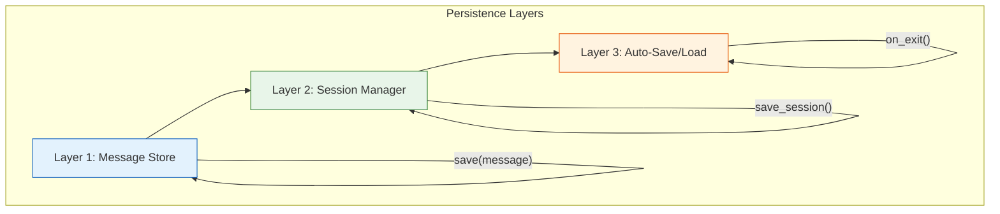
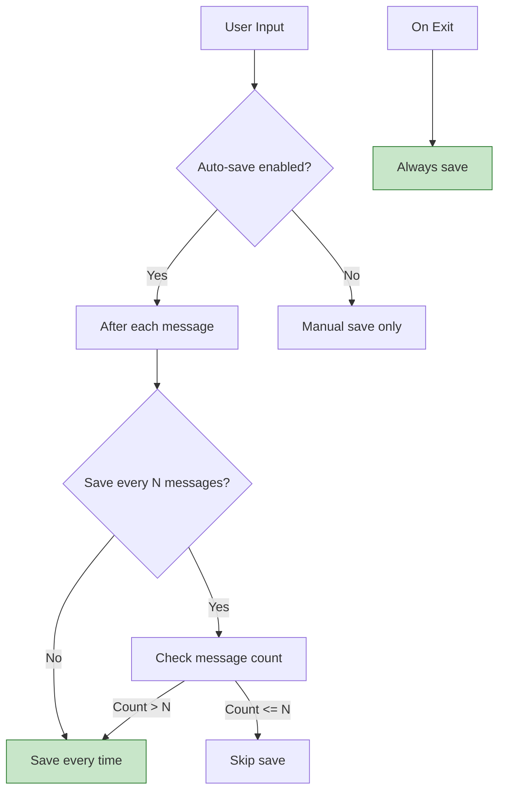

# Day 3, Tutorial 35: Conversation Persistence - Save and Load Sessions

**Course:** Build Your Own Coding Agent  
**Day:** 3 - Tool Use Loop  
**Tutorial:** 35 of 60  
**Estimated Time:** 60 minutes

---

## 🎯 What You'll Learn

By the end of this tutorial, you'll:
- **Understand** why conversation persistence matters
- **Implement** session save/load functionality
- **Build** automatic session recovery
- **Handle** session metadata and cleanup
- **Integrate** persistence with the agent loop

---

## 🎭 Why Conversation Persistence Matters

Imagine this scenario:

```mermaid
flowchart TD
    subgraph "The Problem"
        A[User starts coding session] --> B[Agent reads 10 files]
        B --> C[Makes 50 tool calls]
        C --> D[User closes terminal]
        D --> E[💥 ALL CONTEXT LOST]
        E --> F[Next day: Start from scratch]
        F --> G[😤 User frustrated]
    end
    
    subgraph "The Solution"
        H[User starts session] --> I[Load previous session]
        I --> J[Agent remembers file context]
        J --> K[Continues where left off]
        K --> L[😊 Productive workflow]
    end
```



### Real-World Benefits

| Scenario | Without Persistence | With Persistence |
|----------|---------------------|-----------------|
| **Long debugging** | Lose context after 2 hours | Pick up exactly where left off |
| **Multiple projects** | Reset for each project | Keep sessions separate |
| **Crash recovery** | Start over | Resume from saved state |
| **Context limits** | Lose old messages | Summarize and compress |
| **Reporting** | No history | Export session logs |

---

## 💾 How Conversation Persistence Works

### The Three Layers



### What We Save

```python
@dataclass
class SessionData:
    """Everything we save for a session."""
    
    session_id: str           # Unique identifier
    created_at: datetime      # When session started
    updated_at: datetime      # Last modification
    messages: List[Message]   # All conversation messages
    tool_call_history: List[ToolCall]  # Every tool execution
    context_summary: Optional[str]    # Compressed context
    metadata: Dict[str, Any]          # User config, etc.
    
    # File context (what files were read)
    file_context: Dict[str, str]  # path -> content_hash
    
    # Token usage (from T34)
    token_usage: TokenStats
    
    # Agent state
    working_directory: str
    budget_limit: Optional[float]
```

---

## 💻 Implementation

### Step 1: Session Data Structure

Create a new module for session management:

```python
# src/coding_agent/session/manager.py
"""
Conversation persistence and session management.
"""

from dataclasses import dataclass, field, asdict
from typing import List, Dict, Any, Optional
from datetime import datetime
import json
import uuid
import logging
from pathlib import Path

logger = logging.getLogger(__name__)


@dataclass
class Message:
    """A message in the conversation."""
    
    role: str  # "system", "user", "assistant"
    content: str
    tool_calls: Optional[List[Dict[str, Any]]] = None
    tool_call_id: Optional[str] = None
    timestamp: str = field(default_factory=lambda: datetime.now().isoformat())
    
    def to_dict(self) -> Dict[str, Any]:
        """Convert to dictionary for JSON serialization."""
        return {
            "role": self.role,
            "content": self.content,
            "tool_calls": self.tool_calls,
            "tool_call_id": self.tool_call_id,
            "timestamp": self.timestamp
        }
    
    @classmethod
    def from_dict(cls, data: Dict[str, Any]) -> "Message":
        """Create from dictionary."""
        return cls(
            role=data["role"],
            content=data["content"],
            tool_calls=data.get("tool_calls"),
            tool_call_id=data.get("tool_call_id"),
            timestamp=data.get("timestamp", datetime.now().isoformat())
        )


@dataclass
class ToolCall:
    """Record of a tool execution."""
    
    tool_name: str
    arguments: Dict[str, Any]
    result: str
    status: str  # "success", "error"
    duration_ms: float
    timestamp: str = field(default_factory=lambda: datetime.now().isoformat())
    
    def to_dict(self) -> Dict[str, Any]:
        return asdict(self)
    
    @classmethod
    def from_dict(cls, data: Dict[str, Any]) -> "ToolCall":
        return cls(**data)


@dataclass
class TokenStats:
    """Token usage statistics (from T34)."""
    
    total_input_tokens: int = 0
    total_output_tokens: int = 0
    total_cost: float = 0.0
    request_count: int = 0
    
    def to_dict(self) -> Dict[str, Any]:
        return asdict(self)
    
    @classmethod
    def from_dict(cls, data: Dict[str, Any]) -> "TokenStats":
        return cls(**data) if data else cls()


@dataclass
class SessionData:
    """
    Complete session data that gets saved to disk.
    """
    
    session_id: str
    created_at: str
    updated_at: str
    messages: List[Message] = field(default_factory=list)
    tool_calls: List[ToolCall] = field(default_factory=list)
    context_summary: Optional[str] = None
    metadata: Dict[str, Any] = field(default_factory=dict)
    file_context: Dict[str, str] = field(default_factory=dict)
    token_stats: TokenStats = field(default_factory=TokenStats)
    working_directory: str = ""
    budget_limit: Optional[float] = None
    
    def to_dict(self) -> Dict[str, Any]:
        """Convert to dictionary for JSON serialization."""
        return {
            "session_id": self.session_id,
            "created_at": self.created_at,
            "updated_at": self.updated_at,
            "messages": [m.to_dict() for m in self.messages],
            "tool_calls": [t.to_dict() for t in self.tool_calls],
            "context_summary": self.context_summary,
            "metadata": self.metadata,
            "file_context": self.file_context,
            "token_stats": self.token_stats.to_dict(),
            "working_directory": self.working_directory,
            "budget_limit": self.budget_limit
        }
    
    @classmethod
    def from_dict(cls, data: Dict[str, Any]) -> "SessionData":
        """Create from dictionary."""
        return cls(
            session_id=data["session_id"],
            created_at=data["created_at"],
            updated_at=data["updated_at"],
            messages=[Message.from_dict(m) for m in data.get("messages", [])],
            tool_calls=[ToolCall.from_dict(t) for t in data.get("tool_calls", [])],
            context_summary=data.get("context_summary"),
            metadata=data.get("metadata", {}),
            file_context=data.get("file_context", {}),
            token_stats=TokenStats.from_dict(data.get("token_stats")),
            working_directory=data.get("working_directory", ""),
            budget_limit=data.get("budget_limit")
        )
```

### Step 2: Session Manager

```python
class SessionManager:
    """
    Manages session persistence: save, load, list, and cleanup.
    """
    
    def __init__(self, session_dir: Optional[Path] = None):
        """
        Initialize the session manager.
        
        Args:
            session_dir: Where to store sessions. Defaults to ~/.coding_agent/sessions/
        """
        self.session_dir = session_dir or Path.home() / ".coding_agent" / "sessions"
        self.session_dir.mkdir(parents=True, exist_ok=True)
        
        logger.info(f"Session manager initialized: {self.session_dir}")
    
    def _get_session_path(self, session_id: str) -> Path:
        """Get the file path for a session."""
        return self.session_dir / f"{session_id}.json"
    
    def create_session(self, working_directory: str = "") -> SessionData:
        """
        Create a new session.
        
        Args:
            working_directory: Initial working directory
            
        Returns:
            New SessionData instance
        """
        now = datetime.now().isoformat()
        session = SessionData(
            session_id=str(uuid.uuid4()),
            created_at=now,
            updated_at=now,
            working_directory=working_directory or str(Path.cwd())
        )
        
        # Add system message
        session.messages.append(Message(
            role="system",
            content="You are a helpful coding assistant."
        ))
        
        self.save_session(session)
        logger.info(f"Created new session: {session.session_id}")
        
        return session
    
    def save_session(self, session: SessionData) -> None:
        """
        Save session to disk.
        
        Args:
            session: SessionData to save
        """
        session_path = self._get_session_path(session.session_id)
        
        # Update timestamp
        session.updated_at = datetime.now().isoformat()
        
        # Serialize to JSON
        with open(session_path, "w") as f:
            json.dump(session.to_dict(), f, indent=2)
        
        logger.debug(f"Saved session to {session_path}")
    
    def load_session(self, session_id: str) -> Optional[SessionData]:
        """
        Load session from disk.
        
        Args:
            session_id: ID of session to load
            
        Returns:
            SessionData if found, None otherwise
        """
        session_path = self._get_session_path(session_id)
        
        if not session_path.exists():
            logger.warning(f"Session not found: {session_id}")
            return None
        
        with open(session_path, "r") as f:
            data = json.load(f)
        
        session = SessionData.from_dict(data)
        logger.info(f"Loaded session: {session_id}")
        
        return session
    
    def load_latest_session(self) -> Optional[SessionData]:
        """
        Load the most recently modified session.
        
        Returns:
            Most recent SessionData or None
        """
        sessions = list(self.session_dir.glob("*.json"))
        
        if not sessions:
            return None
        
        # Get most recent by modification time
        latest = max(sessions, key=lambda p: p.stat().st_mtime)
        
        with open(latest, "r") as f:
            data = json.load(f)
        
        return SessionData.from_dict(data)
    
    def list_sessions(self) -> List[Dict[str, Any]]:
        """
        List all available sessions.
        
        Returns:
            List of session summaries (id, created, updated, message_count)
        """
        sessions = []
        
        for session_file in self.session_dir.glob("*.json"):
            try:
                with open(session_file, "r") as f:
                    data = json.load(f)
                
                sessions.append({
                    "session_id": data["session_id"],
                    "created_at": data["created_at"],
                    "updated_at": data["updated_at"],
                    "message_count": len(data.get("messages", [])),
                    "tool_call_count": len(data.get("tool_calls", [])),
                    "working_directory": data.get("working_directory", "")
                })
            except (json.JSONDecodeError, KeyError) as e:
                logger.warning(f"Corrupted session file: {session_file}, error: {e}")
        
        # Sort by most recently updated
        sessions.sort(key=lambda s: s["updated_at"], reverse=True)
        
        return sessions
    
    def delete_session(self, session_id: str) -> bool:
        """
        Delete a session.
        
        Args:
            session_id: ID of session to delete
            
        Returns:
            True if deleted, False if not found
        """
        session_path = self._get_session_path(session_id)
        
        if session_path.exists():
            session_path.unlink()
            logger.info(f"Deleted session: {session_id}")
            return True
        
        return False
    
    def cleanup_old_sessions(self, max_age_days: int = 30) -> int:
        """
        Delete sessions older than specified days.
        
        Args:
            max_age_days: Maximum age in days
            
        Returns:
            Number of sessions deleted
        """
        from datetime import timedelta
        
        cutoff = datetime.now() - timedelta(days=max_age_days)
        deleted = 0
        
        for session_file in self.session_dir.glob("*.json"):
            mtime = datetime.fromtimestamp(session_file.stat().st_mtime)
            
            if mtime < cutoff:
                session_file.unlink()
                deleted += 1
                logger.debug(f"Deleted old session: {session_file.name}")
        
        if deleted:
            logger.info(f"Cleaned up {deleted} old sessions")
        
        return deleted
```

### Step 3: Adding Messages to Session

```python
class ConversationManager:
    """
    Manages the ongoing conversation, integrated with session persistence.
    """
    
    def __init__(
        self,
        session_manager: SessionManager,
        auto_save: bool = True,
        max_messages: int = 1000
    ):
        """
        Initialize conversation manager.
        
        Args:
            session_manager: Session manager instance
            auto_save: Whether to auto-save after each message
            max_messages: Maximum messages before compression
        """
        self.session_manager = session_manager
        self.auto_save = auto_save
        self.max_messages = max_messages
        
        # Current session
        self.session: Optional[SessionData] = None
        
        logger.info(f"Conversation manager initialized (auto_save={auto_save})")
    
    def start_new_session(self, working_directory: str = "") -> SessionData:
        """Start a new session."""
        self.session = self.session_manager.create_session(working_directory)
        return self.session
    
    def load_session(self, session_id: str) -> Optional[SessionData]:
        """Load an existing session."""
        self.session = self.session_manager.load_session(session_id)
        return self.session
    
    def load_latest(self) -> Optional[SessionData]:
        """Load the most recent session."""
        self.session = self.session_manager.load_latest_session()
        return self.session
    
    def add_message(self, role: str, content: str, **kwargs) -> None:
        """
        Add a message to the current session.
        
        Args:
            role: Message role (system, user, assistant)
            content: Message content
            **kwargs: Additional fields (tool_calls, etc.)
        """
        if not self.session:
            self.start_new_session()
        
        message = Message(role=role, content=content, **kwargs)
        self.session.messages.append(message)
        
        if self.auto_save:
            self.save()
    
    def add_tool_call(
        self,
        tool_name: str,
        arguments: Dict[str, Any],
        result: str,
        status: str,
        duration_ms: float
    ) -> None:
        """Add a tool call record."""
        if not self.session:
            return
        
        tool_call = ToolCall(
            tool_name=tool_name,
            arguments=arguments,
            result=result,
            status=status,
            duration_ms=duration_ms
        )
        self.session.tool_calls.append(tool_call)
        
        if self.auto_save:
            self.save()
    
    def save(self) -> None:
        """Save the current session."""
        if self.session:
            self.session_manager.save_session(self.session)
    
    def get_messages(self) -> List[Message]:
        """Get all messages in current session."""
        if not self.session:
            return []
        return self.session.messages
    
    def get_messages_for_llm(self) -> List[Dict[str, Any]]:
        """
        Get messages in format ready for LLM API.
        
        Returns:
            List of message dictionaries
        """
        if not self.session:
            return []
        
        return [
            {
                "role": m.role,
                "content": m.content,
                **({"tool_calls": m.tool_calls} if m.tool_calls else {})
            }
            for m in self.session.messages
        ]
```

### Step 4: Integration with Agent

```python
# Updated agent.py - integration

class Agent:
    """The main coding agent with session persistence."""
    
    def __init__(
        self,
        llm_client: LLMClient,
        tool_registry: ToolRegistry,
        session_manager: Optional[SessionManager] = None,
        auto_save: bool = True,
        working_directory: Optional[Path] = None
    ):
        self.llm_client = llm_client
        self.tool_registry = tool_registry
        self.working_directory = working_directory or Path.cwd()
        
        # Session management
        self.session_manager = session_manager or SessionManager()
        self.conversation = ConversationManager(
            self.session_manager,
            auto_save=auto_save
        )
        
        # State
        self.running = False
        
        logger.info("Agent initialized with session persistence")
    
    def start(self, session_id: Optional[str] = None) -> None:
        """
        Start the agent, optionally loading a session.
        
        Args:
            session_id: If provided, load this session. Otherwise, load latest or create new.
        """
        if session_id:
            # Load specific session
            loaded = self.conversation.load_session(session_id)
            if loaded:
                logger.info(f"Loaded session: {session_id}")
            else:
                logger.warning(f"Session {session_id} not found, creating new")
                self.conversation.start_new_session(str(self.working_directory))
        else:
            # Try to load latest, or create new
            loaded = self.conversation.load_latest()
            if loaded:
                logger.info(f"Resumed latest session: {loaded.session_id}")
            else:
                self.conversation.start_new_session(str(self.working_directory))
        
        self.running = True
        self._print_welcome()
    
    def _print_welcome(self) -> None:
        """Print welcome message with session info."""
        session = self.conversation.session
        
        if session:
            print(f"\n🤖 Coding Agent Ready")
            print(f"   Session: {session.session_id[:8]}...")
            print(f"   Messages: {len(session.messages)}")
            print(f"   Tools: {len(self.tool_registry.list_tools())}")
            print(f"   Type 'help' for commands, 'exit' to quit\n")
        else:
            print("\n🤖 Coding Agent Ready\n")
    
    def chat(self, user_input: str) -> str:
        """
        Process user input and return response.
        
        Args:
            user_input: User's message
            
        Returns:
            Agent's response
        """
        if not self.conversation.session:
            self.start()
        
        # Add user message
        self.conversation.add_message("user", user_input)
        
        # Get tool definitions for LLM
        tools = self.tool_registry.get_tool_definitions()
        
        # Get conversation history
        messages = self.conversation.get_messages_for_llm()
        
        # Call LLM
        response = self.llm_client.chat(messages, tools=tools)
        
        # Handle response (tool calls or text)
        if response.tool_calls:
            # Execute tool calls (T29-T30)
            result = self._execute_tool_calls(response.tool_calls)
            self.conversation.add_message("assistant", result)
            return result
        else:
            self.conversation.add_message("assistant", response.content)
            return response.content
    
    def save_session(self) -> str:
        """Save current session."""
        self.conversation.save()
        return f"Session saved: {self.conversation.session.session_id}"
    
    def list_sessions(self) -> List[Dict[str, Any]]:
        """List all available sessions."""
        return self.session_manager.list_sessions()
    
    def switch_session(self, session_id: str) -> str:
        """
        Switch to a different session.
        
        Args:
            session_id: Session to switch to
            
        Returns:
            Status message
        """
        loaded = self.conversation.load_session(session_id)
        if loaded:
            return f"Switched to session: {session_id[:8]}..."
        else:
            return f"Session not found: {session_id}"
```

### Step 5: CLI Commands for Session Management

```python
# Add to cli.py or builtins.py

class SessionTools:
    """Tools for session management."""
    
    def __init__(self, agent: Optional["Agent"] = None):
        self.agent = agent
    
    def save_session(self, **kwargs) -> ToolResult:
        """Save the current session."""
        if not self.agent:
            return ToolResult(
                tool_call_id="save_session",
                tool_name="save_session",
                status=ToolStatus.ERROR,
                output="No agent attached"
            )
        
        result = self.agent.save_session()
        return ToolResult(
            tool_call_id="save_session",
            tool_name="save_session",
            status=ToolStatus.SUCCESS,
            output=result
        )
    
    def list_sessions(self, **kwargs) -> ToolResult:
        """List all available sessions."""
        if not self.agent:
            return ToolResult(
                tool_call_id="list_sessions",
                tool_name="list_sessions",
                status=ToolStatus.ERROR,
                output="No agent attached"
            )
        
        sessions = self.agent.list_sessions()
        
        if not sessions:
            return ToolResult(
                tool_call_id="list_sessions",
                tool_name="list_sessions",
                status=ToolStatus.SUCCESS,
                output="No saved sessions"
            )
        
        # Format as table
        lines = ["Available Sessions:", ""]
        for s in sessions:
            lines.append(f"  {s['session_id'][:8]}... | {s['message_count']} msgs | {s['updated_at'][:19]}")
        
        return ToolResult(
            tool_call_id="list_sessions",
            tool_name="list_sessions",
            status=ToolStatus.SUCCESS,
            output="\n".join(lines)
        )
    
    def switch_session(self, session_id: str, **kwargs) -> ToolResult:
        """Switch to a different session."""
        if not self.agent:
            return ToolResult(
                tool_call_id="switch_session",
                tool_name="switch_session",
                status=ToolStatus.ERROR,
                output="No agent attached"
            )
        
        result = self.agent.switch_session(session_id)
        return ToolResult(
            tool_call_id="switch_session",
            tool_name="switch_session",
            status=ToolStatus.SUCCESS,
            output=result
        )
```

---

## 🧪 Testing Session Persistence

```python
# tests/test_session.py

import pytest
from pathlib import Path
import tempfile
import shutil

from coding_agent.session.manager import (
    SessionManager, SessionData, Message, ToolCall
)


@pytest.fixture
def temp_session_dir():
    """Create a temporary directory for sessions."""
    temp_dir = Path(tempfile.mkdtemp())
    yield temp_dir
    shutil.rmtree(temp_dir)


@pytest.fixture
def session_manager(temp_session_dir):
    """Create a session manager with temp directory."""
    return SessionManager(session_dir=temp_session_dir)


def test_create_session(session_manager):
    """Test creating a new session."""
    session = session_manager.create_session("/home/user/project")
    
    assert session.session_id is not None
    assert len(session.messages) == 1  # System message
    assert session.working_directory == "/home/user/project"


def test_save_and_load(session_manager):
    """Test saving and loading a session."""
    # Create and modify session
    session = session_manager.create_session()
    session.messages.append(Message(role="user", content="Hello"))
    session.messages.append(Message(role="assistant", content="Hi there"))
    
    # Save
    session_manager.save_session(session)
    
    # Load
    loaded = session_manager.load_session(session.session_id)
    
    assert loaded is not None
    assert loaded.session_id == session.session_id
    assert len(loaded.messages) == 3  # System + user + assistant


def test_list_sessions(session_manager):
    """Test listing sessions."""
    # Create multiple sessions
    s1 = session_manager.create_session()
    s2 = session_manager.create_session()
    
    sessions = session_manager.list_sessions()
    
    assert len(sessions) >= 2
    assert any(s["session_id"] == s1.session_id for s in sessions)
    assert any(s["session_id"] == s2.session_id for s in sessions)


def test_delete_session(session_manager):
    """Test deleting a session."""
    session = session_manager.create_session()
    session_id = session.session_id
    
    # Verify exists
    assert session_manager.load_session(session_id) is not None
    
    # Delete
    result = session_manager.delete_session(session_id)
    assert result is True
    
    # Verify deleted
    assert session_manager.load_session(session_id) is None
```

---

## 🔄 Auto-Save Strategy

### When to Save



### Configuration Options

```python
@dataclass
class PersistenceConfig:
    """Configuration for session persistence."""
    
    enabled: bool = True
    auto_save: bool = True
    save_interval: int = 5  # Save every N messages
    session_dir: Optional[Path] = None
    max_sessions: int = 10  # Keep only N sessions
    max_age_days: int = 30  # Delete sessions older than this
    
    # Compression options
    compress_old_messages: bool = True
    compression_threshold: int = 100  # Compress after N messages
```

---

## 🎯 Summary

In this tutorial, you learned:

1. **Why persistence matters** - Don't lose context when closing terminal
2. **Session data structure** - What to save (messages, tools, tokens, files)
3. **Session manager** - Save, load, list, delete sessions
4. **Conversation manager** - Add messages, track tool calls
5. **Agent integration** - Start with session, switch between sessions
6. **CLI tools** - Commands for session management

### Key Classes

| Class | Purpose |
|-------|---------|
| `SessionData` | What gets saved to disk |
| `Message` | Individual conversation message |
| `ToolCall` | Record of tool execution |
| `SessionManager` | File I/O for sessions |
| `ConversationManager` | In-memory session management |

### What's Next (T36)

In the hands-on tutorial, you'll:
- Build a complete tool use system
- Integrate all T25-T35 concepts
- Create a working autonomous agent
- Test the full loop

---

## 📚 Exercise

**Try this yourself:**

1. Create a session manager
2. Start a new session
3. Add some messages
4. Save the session
5. Load it back and verify messages

```python
# Quick test
sm = SessionManager()
session = sm.create_session("/tmp/test")
session.messages.append(Message(role="user", content="Test message"))
sm.save_session(session)

loaded = sm.load_session(session.session_id)
print(f"Loaded {len(loaded.messages)} messages")
```

---

*Next: Tutorial 36 - Hands-on: Complete Tool Use System*