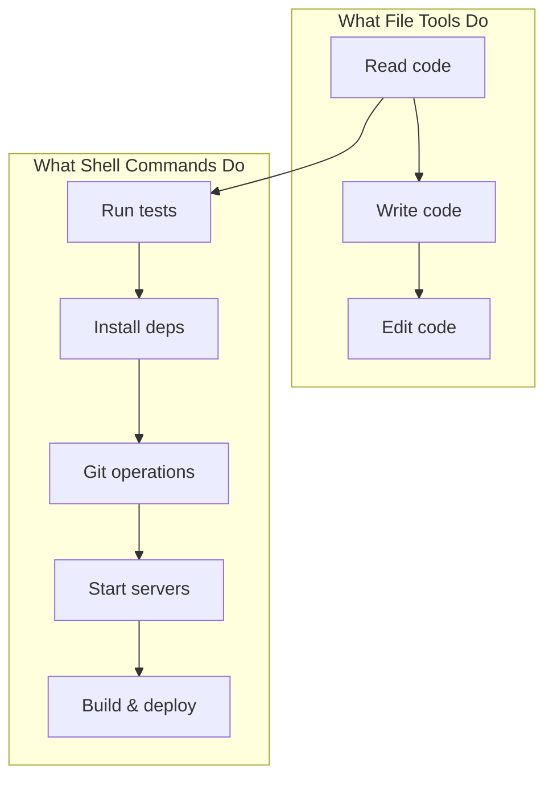

# Day 4, Tutorial 37: Shell Tool Design - Execute Shell Commands

**Course:** Build Your Own Coding Agent  
**Day:** 4 - Shell & Context  
**Tutorial:** 37 of 60  
**Estimated Time:** 45 minutes

---

## 🎯 What You'll Learn

By the end of this tutorial, you'll:
- Understand **why shell execution is essential** for coding agents
- Design the `execute_shell` tool interface
- Implement command execution with Python's `subprocess` module
- Handle stdout, stderr, and return codes
- Build a clean shell tool class following the BaseTool pattern

---

## 🎭 Why Shell Commands Matter

A coding agent that can't run shell commands is like a chef who can read recipes but can't use the stove. Here's why:



**File tools** let the agent inspect and modify code.  
**Shell tools** let the agent *do* things with that code.

---

## 🔧 Designing the Shell Tool

### The Interface

Following our BaseTool pattern (T6), the shell tool needs:

```python
# tools/shell.py
from typing import Any
from .base import BaseTool

class ExecuteShellTool(BaseTool):
    """Execute shell commands and return their output."""
    
    def __init__(self):
        super().__init__(
            name="execute_shell",
            description="Execute a shell command and return its output. "
                       "Use for running tests, git commands, installing packages, etc."
        )
    
    @property
    def input_schema(self) -> dict[str, Any]:
        return {
            "type": "object",
            "properties": {
                "command": {
                    "type": "string",
                    "description": "The shell command to execute"
                },
                "working_directory": {
                    "type": "string",
                    "description": "Optional directory to run command in",
                    "default": "."
                }
            },
            "required": ["command"]
        }
```

### The Execution Logic

Now let's implement the actual command execution:

```python
import subprocess
import shutil
from typing import Any

class ExecuteShellTool(BaseTool):
    # ... __init__ and input_schema as above ...
    
    def execute(self, command: str, working_directory: str = ".") -> dict[str, Any]:
        """
        Execute a shell command and return structured output.
        
        Args:
            command: The shell command to run
            working_directory: Directory to run command in
            
        Returns:
            Dictionary with stdout, stderr, return_code, and success status
        """
        # Resolve the working directory
        cwd = shutil.os.path.abspath(working_directory)
        
        try:
            # Run the command
            result = subprocess.run(
                command,
                shell=True,          # Allow shell features like pipes
                cwd=cwd,             # Working directory
                capture_output=True, # Capture stdout and stderr
                text=True,           # Return strings, not bytes
                timeout=300          # 5 minute timeout (we'll make this configurable later)
            )
            
            return {
                "success": result.returncode == 0,
                "return_code": result.returncode,
                "stdout": result.stdout,
                "stderr": result.stderr,
                "command": command,
                "working_directory": cwd
            }
            
        except subprocess.TimeoutExpired:
            return {
                "success": False,
                "return_code": -1,
                "stdout": "",
                "stderr": f"Command timed out after 300 seconds: {command}",
                "command": command,
                "working_directory": cwd,
                "error": "timeout"
            }
            
        except Exception as e:
            return {
                "success": False,
                "return_code": -1,
                "stdout": "",
                "stderr": str(e),
                "command": command,
                "working_directory": cwd,
                "error": "exception"
            }
```

### Handling Output Size

Shell commands can produce massive output. We need to truncate it:

```python
def execute(self, command: str, working_directory: str = ".", 
            max_output: int = 10000) -> dict[str, Any]:
    """Execute shell command with output truncation."""
    
    # ... execution logic ...
    
    # Truncate output to prevent token limit issues
    stdout = result.stdout[:max_output]
    stderr = result.stderr[:max_output]
    
    # Track if we truncated
    truncation_note = ""
    if len(result.stdout) > max_output:
        truncation_note = f"\n\n[Output truncated. Showing first {max_output} chars.]"
    
    return {
        "success": result.returncode == 0,
        "return_code": result.returncode,
        "stdout": stdout + truncation_note,
        "stderr": stderr,
        # ...
    }
```

---

## 🏗️ Integrating into the Tool Registry

Register the shell tool just like any other:

```python
# tools/registry.py
from .shell import ExecuteShellTool

class ToolRegistry:
    def __init__(self):
        self._tools: dict[str, BaseTool] = {}
        self._register_builtins()
    
    def _register_builtins(self):
        # File tools (Day 2)
        self.register(ReadFileTool())
        self.register(WriteFileTool())
        self.register(ListDirTool())
        
        # Shell tool (Day 4 - NEW!)
        self.register(ExecuteShellTool())
        
        # Built-in tools (Day 1)
        self.register(HelpTool())
        self.register(TimeTool())
```

---

## 🎯 Key Concepts

### Why `shell=True`?

```python
# With shell=True (allows pipes, redirects, etc.)
result = subprocess.run("ls -la | head -5", shell=True, ...)

# Without shell=True (single command only)
result = subprocess.run(["ls", "-la"], ...)
```

**Trade-off:** `shell=True` is more powerful but slightly less secure (we'll address this in T38).

### Return Codes

| Code | Meaning |
|------|---------|
| 0 | Success |
| 1 | General error |
| 2 | Misuse of command |
| 126 | Command not executable |
| 127 | Command not found |
| 130 | Terminated by Ctrl+C |

---

## 🧪 Testing the Shell Tool

```python
# tests/test_shell.py
import pytest
from coding_agent.tools.shell import ExecuteShellTool

def test_execute_shell_success():
    """Test successful command execution."""
    tool = ExecuteShellTool()
    result = tool.execute("echo 'hello world'")
    
    assert result["success"] is True
    assert result["return_code"] == 0
    assert "hello world" in result["stdout"]

def test_execute_shell_failure():
    """Test failed command execution."""
    tool = ExecuteShellTool()
    result = tool.execute("exit 1")
    
    assert result["success"] is False
    assert result["return_code"] == 1

def test_execute_shell_timeout():
    """Test command timeout."""
    tool = ExecuteShellTool()
    result = tool.execute("sleep 10", max_output=1000)
    
    assert result["success"] is False
    assert result.get("error") == "timeout"
```

---

## 📝 Summary

In this tutorial, you learned:
- ✅ Shell commands are essential for agents to *do* things (run tests, build, deploy)
- ✅ Designed the `ExecuteShellTool` interface following the BaseTool pattern
- ✅ Implemented command execution using `subprocess.run()`
- ✅ Handled stdout, stderr, return codes, and timeouts
- ✅ Added output truncation to prevent token limit issues
- ✅ Registered the shell tool in the ToolRegistry

---

## 🔜 Next Tutorial

**T38: Command Whitelisting** - We'll add safety by allowing only pre-approved commands like `git`, `npm`, `pip`, etc. - preventing the agent from running dangerous commands like `rm -rf /` or `format c:`.

---

## Code Checkpoint

At this point, your project should look like:

```
coding_agent/
├── src/coding_agent/
│   ├── __init__.py
│   ├── agent.py
│   ├── config.py
│   ├── llm/
│   │   ├── __init__.py
│   │   ├── client.py
│   │   ├── anthropic.py
│   │   ├── openai.py
│   │   └── ollama.py
│   ├── tools/
│   │   ├── __init__.py
│   │   ├── base.py
│   │   ├── registry.py
│   │   ├── builtins.py      # help, time, history, clear
│   │   ├── files.py        # read_file, write_file, list_dir
│   │   └── shell.py        # execute_shell ✅ NEW!
│   └── events.py
└── tests/
    └── test_shell.py       # ✅ NEW!
```